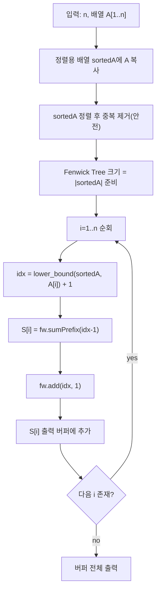

서로 다른 정수 배열 \(A\)가 주어질 때,

\[
S[i] = |\{ j \mid 1 \le j < i \ \wedge\ A[j] < A[i] \}|
\]

를 모든 \(i\)에 대해 출력하는 문제다.  
\(n\)이 최대 \(10^6\)이라서 \(O(n^2)\) 비교는 불가능하고, **좌표 압축 + Fenwick Tree**로 \(O(n\log n)\)에 해결한다.

## 문제 정보

**문제 링크**: [https://www.acmicpc.net/problem/15517](https://www.acmicpc.net/problem/15517)

**문제 요약**:
- 길이 \(n\)의 서로 다른 정수 배열 \(A\)가 주어진다.
- 각 \(i\)에 대해, \(i\)보다 앞에 있으면서 \(A[i]\)보다 작은 원소의 개수 \(S[i]\)를 출력한다.

**제한 조건**:
- 시간 제한: 2초
- 메모리 제한: 512MB
- \(1 \le n \le 1{,}000{,}000\)
- \(|A[i]| \le 2{,}000{,}000{,}000\)
- \(A\)는 **distinct**

## 입출력 예제

**입력 1**:

```text
5
10
5
12
1
11
```

**출력 1**:

```text
0
0
2
0
3
```

## 접근 방식

### 핵심 관찰: “이전 원소 중 작은 것의 개수”는 ‘순위 누적’으로 계산된다

왼쪽부터 \(A[i]\)를 하나씩 처리한다고 하자.

- 지금까지 본 값들이 Fenwick Tree에 “등장 횟수(=1)”로 들어있다면,
- \(A[i]\)보다 **작은 값들의 총 등장 횟수**가 곧 \(S[i]\)가 된다.

즉,
- `ans = sum(rank(A[i]) - 1)`
- `add(rank(A[i]), +1)`

만 반복하면 된다.

### 좌표 압축이 필요한 이유

\(A[i]\) 범위가 \(\pm 2 \times 10^9\)이므로 그대로 인덱스로 Fenwick Tree를 만들 수 없다.  
따라서 값들을 정렬해서 \(1 \ldots m\) 범위의 **순위(rank)** 로 바꾼다.

### 알고리즘 설계 (Mermaid Flowchart)



## 복잡도 분석

| 항목 | 복잡도 | 비고 |
|---|---|---|
| **시간 복잡도** | \(O(n \log n)\) | 정렬 \(O(n \log n)\) + 각 원소마다 Fenwick 2회 |
| **공간 복잡도** | \(O(n)\) | 입력 배열 + 정렬 배열 + Fenwick |

## 코너 케이스 및 실수 포인트

| 케이스 | 설명 | 처리 방법 |
|---|---|---|
| **n=1** | 이전 원소가 없음 | 항상 0 출력 |
| **음수/큰 값** | 값 범위가 매우 큼 | 좌표 압축 필수 |
| **distinct** | 문제에서 보장 | 그래도 `unique`로 안전 처리 가능 |
| **대용량 출력** | 최대 \(10^6\) 줄 | 문자열 버퍼에 모아 `fwrite` 권장 |

## 구현 코드 (C++)

```cpp
// 42jerrykim.github.io에서 더 많은 정보를 확인 할 수 있다
#include <bits/stdc++.h>
using namespace std;

struct FastInput {
    static constexpr size_t BUFSIZE = 1 << 20;
    char buf[BUFSIZE];
    size_t idx = 0, size = 0;

    inline char readChar() {
        if (idx >= size) {
            size = fread(buf, 1, BUFSIZE, stdin);
            idx = 0;
            if (size == 0) return 0;
        }
        return buf[idx++];
    }

    template <typename T>
    bool readInt(T &out) {
        char c;
        do {
            c = readChar();
            if (!c) return false;
        } while (c <= ' ');

        bool neg = false;
        if (c == '-') { neg = true; c = readChar(); }

        long long val = 0;
        while (c > ' ') {
            val = val * 10 + (c - '0');
            c = readChar();
        }
        out = neg ? -val : val;
        return true;
    }
};

struct Fenwick {
    int n;
    vector<int> bit;
    Fenwick(int n = 0) : n(n), bit(n + 1, 0) {}

    inline void add(int i, int v) {
        for (; i <= n; i += i & -i) bit[i] += v;
    }
    inline int sumPrefix(int i) const {
        int s = 0;
        for (; i > 0; i -= i & -i) s += bit[i];
        return s;
    }
};

int main() {
    ios::sync_with_stdio(false);
    cin.tie(nullptr);

    FastInput in;
    int n;
    if (!in.readInt(n)) return 0;

    vector<long long> A(n), sortedA;
    sortedA.reserve(n);

    for (int i = 0; i < n; i++) {
        in.readInt(A[i]);
        sortedA.push_back(A[i]);
    }

    sort(sortedA.begin(), sortedA.end());
    sortedA.erase(unique(sortedA.begin(), sortedA.end()), sortedA.end());

    Fenwick fw((int)sortedA.size());

    string out;
    out.reserve((size_t)n * 3);

    for (int i = 0; i < n; i++) {
        int idx = (int)(lower_bound(sortedA.begin(), sortedA.end(), A[i]) - sortedA.begin()) + 1;
        int ans = fw.sumPrefix(idx - 1);
        fw.add(idx, 1);

        out.append(to_string(ans));
        out.push_back('\n');
    }

    fwrite(out.c_str(), 1, out.size(), stdout);
    return 0;
}
```

## 참고 문헌 및 출처

- [백준 15517번 문제](https://www.acmicpc.net/problem/15517)

