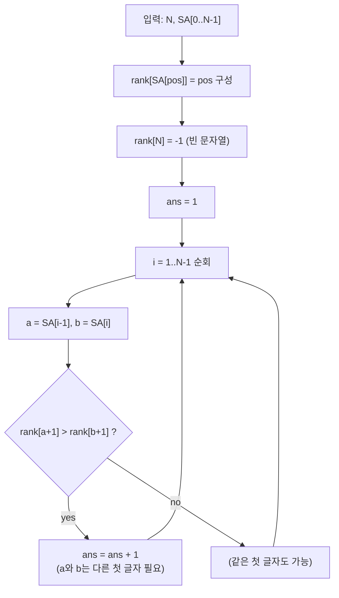

문제: [BOJ 13013 - 접미사 배열 2](https://www.acmicpc.net/problem/13013)

접미사 배열(Suffix Array) 결과만 주어졌을 때, 그 접미사 배열을 만들 수 있는 문자열 \(S\)는 여러 개가 있을 수 있다.  
이 중에서 \(S\)에 포함된 **서로 다른 문자 개수(알파벳 크기)의 최솟값**을 구하는 문제다.

## 문제 정보

**문제 링크**: [https://www.acmicpc.net/problem/13013](https://www.acmicpc.net/problem/13013)

**문제 요약**:
- 길이 \(N\)인 문자열 \(S\)의 접미사 배열 \(SA\)가 주어진다. (\(SA\)는 0..\(N-1\)의 순열)
- \(SA\)는 접미사 \(S[i..]\)들을 사전순으로 정렬했을 때의 시작 인덱스 목록이다.
- 주어진 \(SA\)를 만들 수 있는 문자열들 중, **서로 다른 문자의 개수의 최솟값**을 출력한다.

**제한 조건**:
- 시간 제한: 2초
- 메모리 제한: 512MB
- \(1 \le N \le 50\)

## 입출력 예제

**입력 1**:

```text
4
3 0 1 2
```

**출력 1**:

```text
2
```

## 접근 방식

### 핵심 관찰: 인접한 두 접미사의 “첫 글자 같음/다름”은 다음 접미사의 순서로 결정된다

접미사 \(A = S[a..]\), \(B = S[b..]\)를 비교할 때,

- 만약 \(S[a] \ne S[b]\)이면: 첫 글자만으로 순서가 정해진다.
- 만약 \(S[a] = S[b]\)이면: 남은 부분 \(S[a+1..]\)와 \(S[b+1..]\) (즉, **다음 접미사**)의 사전순이 \(A,B\)의 순서를 결정한다.

이 문제는 “문자 종류를 최소화”해야 하므로, 가능한 한 많은 위치에서 \(S[a] = S[b]\) (같은 문자)로 두고 싶다.  
그런데 접미사 배열 \(SA\)의 **인접한 원소** \(a = SA[i-1]\), \(b = SA[i]\)는 사전순으로 \(S[a..] < S[b..]\)를 의미하므로, 다음이 성립한다.

- \(S[a] = S[b]\)로 둘 수 있으려면, 다음 접미사들의 순서도 \(S[a+1..] < S[b+1..]\)여야 한다.
- 즉, \(rank[a+1] < rank[b+1]\)이면 같은 문자로 “묶을 수” 있다.
- 반대로 \(rank[a+1] > rank[b+1]\)이면 \(S[a]=S[b]\)로 두면 순서가 뒤집히므로, 반드시 \(S[a] < S[b]\)가 되도록 **새 문자를 증가**시켜야 한다.

여기서 \(rank[x]\)는 “접미사 \(S[x..]\)가 접미사 배열에서 등장하는 위치”다.

또한 \(a\)나 \(b\)가 \(N-1\)이면 \(a+1\) 또는 \(b+1\)은 \(N\)이 되는데, 이는 빈 문자열 접미사 \(S[N..]\)로 생각할 수 있다.  
빈 문자열은 모든 접미사보다 사전순으로 작으므로, 편의상 \(rank[N] = -1\)로 두면 된다.

### 결론: 답은 \(1 +\) (내림 발생 횟수)

\[
\text{ans} = 1 + \left|\left\{ i \in [1, N-1] : rank[SA[i-1]+1] > rank[SA[i]+1] \right\}\right|
\]

즉, \(SA\)를 왼쪽에서 오른쪽으로 훑으면서 \(rank[SA[i]+1]\)의 값이 **내림(감소)** 하는 지점마다 “새 문자 그룹”이 하나 더 필요하다.

### 알고리즘 설계 (Mermaid Flowchart)



### 정당성 스케치

- **필요성**: 어떤 인접 쌍 \((a,b)\)에서 \(rank[a+1] > rank[b+1]\)이면, \(S[a]=S[b]\)로는 \(S[a..]\)와 \(S[b..]\)의 순서를 \(SA\)와 같게 만들 수 없다. 따라서 반드시 \(S[a] < S[b]\)가 되어야 하고, 이는 “새 문자 증가”가 필요함을 뜻한다.
- **충분성(구성 가능)**: \(SA\)를 왼쪽부터 보며 위 조건이 깨지는 지점에서만 문자를 1씩 증가시키면, 각 인접 쌍은
  - 같은 문자일 때는 \(rank[a+1] < rank[b+1]\)로 인해 다음 접미사 순서가 보장되고,
  - 다른 문자일 때는 첫 글자 비교로 즉시 순서가 고정되므로,
  전체 \(SA\)의 사전순을 만족하는 문자열을 구성할 수 있다.

## 복잡도 분석

| 항목 | 복잡도 | 비고 |
|---|---|---|
| **시간 복잡도** | \(O(N)\) | `rank` 구성 \(O(N)\) + 한 번 스캔 \(O(N)\) |
| **공간 복잡도** | \(O(N)\) | `SA`, `rank` |

## 코너 케이스 및 실수 포인트

| 케이스 | 설명 | 처리 방법 |
|---|---|---|
| **N=1** | 접미사 1개 | 답은 1 |
| **끝 인덱스 처리** | \(i=N-1\)이면 \(i+1=N\) | \(rank[N] = -1\)로 두기 |
| **전부 같은 문자 가능** | 예: \(SA = [N-1, N-2, \ldots, 0]\) | 내림이 없으면 답 1 |
| **SA가 증가** | 예: \(SA = [0,1,2,\ldots]\) | 내림이 많이 생길 수 있음 (예제 3) |

## 구현 코드 (C++)

```cpp
// 42jerrykim.github.io에서 더 많은 정보를 확인 할 수 있다
#include <bits/stdc++.h>
using namespace std;

int main() {
    ios::sync_with_stdio(false);
    cin.tie(nullptr);

    int N;
    cin >> N;
    vector<int> sa(N);
    for (int i = 0; i < N; i++) cin >> sa[i];

    // rankPos[x] = 접미사 S[x..]가 SA에서 나타나는 위치
    // rankPos[N] = 빈 문자열 접미사 S[N..]의 랭크 (가장 작게 두기 위해 -1)
    vector<int> rankPos(N + 1, -1);
    for (int pos = 0; pos < N; pos++) rankPos[sa[pos]] = pos;
    rankPos[N] = -1;

    int ans = 1;
    for (int i = 1; i < N; i++) {
        int a = sa[i - 1], b = sa[i];
        if (rankPos[a + 1] > rankPos[b + 1]) ans++;
    }

    cout << ans << "\n";
    return 0;
}
```

## 참고 문헌 및 출처

- [백준 13013번 문제](https://www.acmicpc.net/problem/13013)

