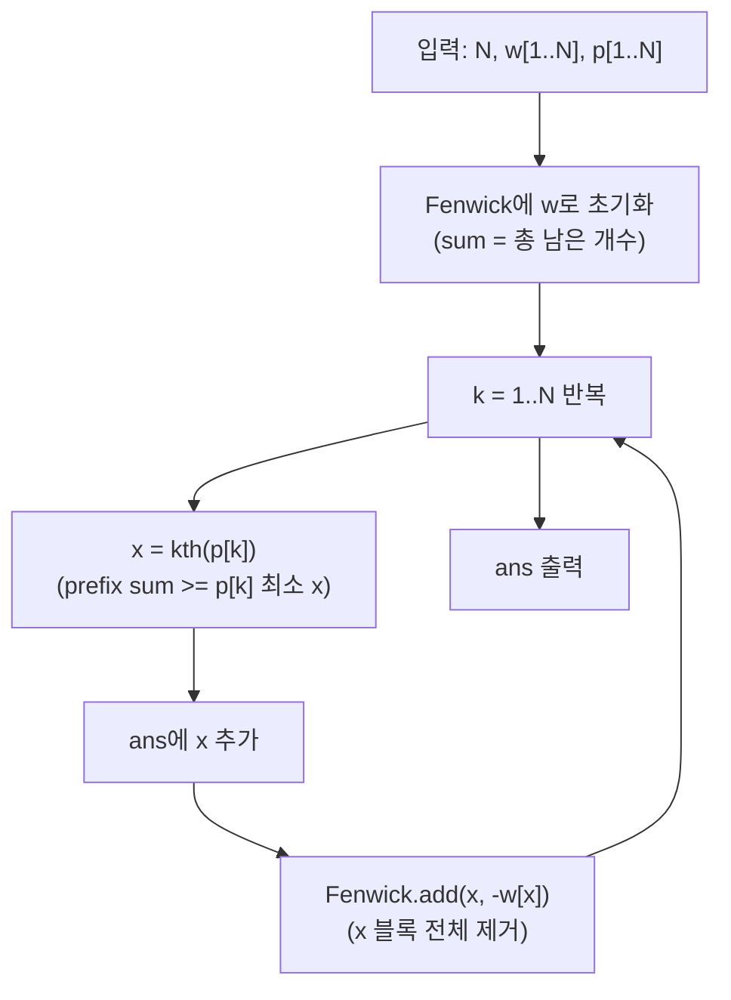

문제: [BOJ 19646 - Random Generator](https://www.acmicpc.net/problem/19646)

각 숫자 \(i\)를 \(w_i\)번씩 “연속 배치”한 긴 수열에서, 매 단계 \(p_k\)번째 원소를 뽑아 순열에 추가하고 **그 숫자의 남은 모든 복제본을 한 번에 제거**한다.  
이 과정을 \(N\)번 반복했을 때 최종 순열을 복원하는 문제다.

## 문제 정보

**문제 링크**: [https://www.acmicpc.net/problem/19646](https://www.acmicpc.net/problem/19646)

**문제 요약**:
- 처음에 숫자 \(1..N\)을 각각 \(w_i\)개씩 이어 붙여 길이 \(W=\sum w_i\)인 수열을 만든다.
- 각 단계 \(k\)에서 \(1..W\) 중 균등하게 고른 위치가 \(p_k\)로 주어질 때, 그 위치의 숫자를 답에 추가한다.
- 추가한 숫자의 **모든 남은 등장**을 수열에서 삭제하고, 수열이 빌 때까지 반복한다.
- \(p_1..p_N\)는 항상 “가능한 경우만” 주어진다.

**제한 조건**:
- 시간 제한: 1초
- 메모리 제한: 1024MB
- \(1 \le N \le 200{,}000\)
- \(1 \le w_i \le 1000\)

## 입출력 예제

**입력 1**:

```text
5
1 2 3 4 5
6 4 6 1 2
```

**출력 1**:

```text
3 4 5 1 2
```

## 접근 방식

### 핵심 관찰: “긴 수열”을 직접 만들 필요가 없다

처음 수열은

\[
\underbrace{1,1,\ldots}_{w_1\text{개}},
\underbrace{2,2,\ldots}_{w_2\text{개}},
\ldots,
\underbrace{N,N,\ldots}_{w_N\text{개}}
\]

처럼 **블록(구간)들의 연결**이다. 어떤 숫자 \(x\)를 뽑는 순간, 그 숫자 블록 전체(\(w_x\)개)가 통째로 사라진다.

따라서 매 단계에 필요한 것은:
- **현재 남아 있는 각 숫자 \(i\)의 개수(가중치) \(w_i\)** 와
- “블록들을 이어 붙였을 때 \(p_k\)번째가 어느 숫자에 속하는지”를 찾는 **k-th(순서 통계) 질의**

뿐이다.

이를 위해 Fenwick Tree(이진 인덱스 트리)에 \(w_i\)를 저장하면,
- prefix sum = 앞에서부터 몇 개가 남아 있는지
- k-th = prefix sum이 처음으로 \(p_k\) 이상이 되는 최소 인덱스

를 \(O(\log N)\)에 구할 수 있다.

### 알고리즘 설계 (Mermaid Flowchart)



### 단계별 로직

1. **Fenwick 초기화**: `tree[i] += w[i]`
2. **각 단계 k에서 선택**: Fenwick의 `kth(p[k])`로 선택된 숫자 \(x\)를 찾는다.
3. **전체 삭제 반영**: `add(x, -w[x])`로 해당 블록을 0으로 만든다.
4. **총 N회 반복**하면 정확히 \(1..N\)의 순열이 나온다. (각 숫자는 한 번만 선택됨)

## 정당성(간단 증명)

Fenwick에 저장한 값은 “현재 남아 있는 수열에서 숫자 \(i\)가 차지하는 길이”다.

- **불변식**: 어느 시점이든, “남아 있는 긴 수열”에서 인덱스 \(t\)가 속한 숫자는
  \(\min\{x \mid \sum_{i=1}^{x} w_i \ge t\}\) 이다.
- Fenwick의 `kth(t)`는 바로 위 정의의 최소 \(x\)를 \(O(\log N)\)에 찾는다.
- 숫자 \(x\)를 뽑으면 문제 정의상 그 숫자의 남은 모든 복제본이 삭제되므로, 가중치 \(w_x\)를 0으로 만드는 업데이트가 정확하다.

따라서 각 단계에서 선택되는 숫자와 삭제 과정이 문제의 과정과 일치하며, \(N\)번 반복 후 얻는 수열은 요구되는 순열이다.

## 복잡도 분석

| 항목 | 복잡도 | 비고 |
|---|---|---|
| **시간 복잡도** | \(O(N \log N)\) | 각 단계 `kth` + `add`가 \(O(\log N)\) |
| **공간 복잡도** | \(O(N)\) | Fenwick + 입력 배열 |

## 코너 케이스 및 실수 포인트

| 케이스 | 설명 | 처리 방법 |
|---|---|---|
| **큰 합 W** | \(W=\sum w_i \le 2 \times 10^8\) | 누적합/bit는 `long long` 권장 |
| **이미 삭제된 숫자** | 한 번 뽑힌 숫자는 다시 등장하지 않음 | `add(x, -w[x])` 후 `w[x]=0` |
| **p_k의 유효성** | 남은 길이보다 큰 \(p_k\)는 없음 | 입력이 보장하지만 `kth`는 1-index로 구현 |
| **1-index/0-index 혼동** | Fenwick은 보통 1-index | `kth`/`add`/입력 모두 1-index로 통일 |

## 구현 코드 (C++)

```cpp
// 42jerrykim.github.io에서 더 많은 정보를 확인 할 수 있다
#include <bits/stdc++.h>
using namespace std;

struct Fenwick {
    int n;
    vector<long long> bit;

    Fenwick(int n_ = 0) { init(n_); }

    void init(int n_) {
        n = n_;
        bit.assign(n + 1, 0);
    }

    void add(int i, long long delta) {
        for (; i <= n; i += i & -i) bit[i] += delta;
    }

    // Returns smallest idx such that prefixSum(idx) >= k (k is 1-indexed)
    int kth(long long k) const {
        int idx = 0;
        long long acc = 0;

        int pw = 1;
        while ((pw << 1) <= n) pw <<= 1;

        for (int step = pw; step > 0; step >>= 1) {
            int next = idx + step;
            if (next <= n && acc + bit[next] < k) {
                acc += bit[next];
                idx = next;
            }
        }
        return idx + 1;
    }
};

int main() {
    ios::sync_with_stdio(false);
    cin.tie(nullptr);

    int N;
    cin >> N;

    vector<long long> w(N + 1), p(N + 1);
    Fenwick fw(N);

    for (int i = 1; i <= N; i++) {
        cin >> w[i];
        fw.add(i, w[i]);
    }
    for (int i = 1; i <= N; i++) cin >> p[i];

    for (int i = 1; i <= N; i++) {
        int x = fw.kth(p[i]);
        if (i > 1) cout << ' ';
        cout << x;

        fw.add(x, -w[x]);
        w[x] = 0;
    }

    cout << '\n';
    return 0;
}
```

## 참고 문헌 및 출처

- [백준 19646번 문제](https://www.acmicpc.net/problem/19646)

## 작성 체크리스트

- [x] 폴더명이 `YYYY-MM-DD-BOJ-번호-슬러그` 형식인가?
- [x] Front Matter의 tags가 50개 이상인가? (한글/영어 포함)
- [x] description이 150자 내외로 핵심을 요약했는가?
- [x] Mermaid 다이어그램으로 로직을 시각화했는가? (라벨 특수문자 방지용 전체 따옴표 적용)
- [x] 복잡도 분석이 표(Table) 형식인가?
- [x] 코드 최상단에 지정 주석이 포함되었는가?
- [x] 코너 케이스 체크리스트가 포함되었는가?
- [x] `date`와 `lastmod`가 오늘 날짜(2026-02-05)로 설정되었는가?

