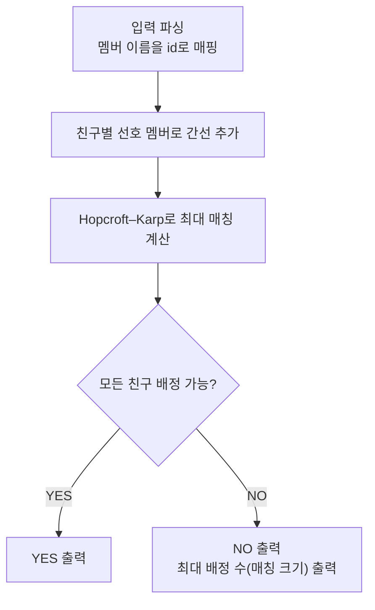

문제: [BOJ 17481 - 최애 정하기](https://www.acmicpc.net/problem/17481)

친구마다 “좋아하는 멤버 목록”이 주어질 때, 모든 친구가 **서로 다른 멤버**를 최애로 고를 수 있는지 판단합니다.  
가능하면 `YES`, 불가능하면 `NO`와 함께 “서로 다른 멤버로 배정할 수 있는 친구 수의 최댓값”을 출력하면 됩니다.

## 문제 정보

**문제 링크**: [https://www.acmicpc.net/problem/17481](https://www.acmicpc.net/problem/17481)

**문제 요약**:
- 친구는 \(N\)명, 멤버는 \(M\)명입니다.
- 각 친구 \(i\)는 좋아하는 멤버들의 집합 \(S_i\)를 가집니다.
- 모든 친구에게 서로 다른 멤버를 하나씩 골라 배정할 수 있으면 성공입니다.
- 불가능하면, 서로 다른 멤버로 배정 가능한 친구 수의 최댓값을 구합니다.

**제한 조건**:
- 시간 제한: 2초
- 메모리 제한: 256MB
- \(2 \le N, M \le 1000\)
- 각 친구의 선호 멤버 수 \(1 \le K \le M\)
- 멤버 이름: 대문자, 길이 \(\le 100\)

## 입출력 예제

**입력 1**:

```text
4 5
YEJI
LIA
RYUJIN
CHAERYEONG
YUNA
3 YEJI RYUJIN YUNA
2 LIA RYUJIN
3 CHAERYEONG YEJI RYUJIN
4 LIA RYUJIN CHAERYEONG YUNA
```

**출력 1**:

```text
YES
```

**입력 2**:

```text
6 6
MIYEON
MINNIE
SOOJIN
SOYEON
YUQI
SHUHUA
2 YUQI SOOJIN
1 SOYEON
1 YUQI
2 YUQI SHUHUA
3 MIYEON SOYEON YUQI
3 MIYEON SHUHUA SOYEON
```

**출력 2**:

```text
NO
5
```

## 접근 방식

### 핵심 관찰: “서로 다른 선택”은 이분 매칭 문제

- 왼쪽 정점 집합 \(U\): 친구(크기 \(N\))
- 오른쪽 정점 집합 \(V\): 멤버(크기 \(M\))
- 간선 \((i, j)\): 친구 \(i\)가 멤버 \(j\)를 좋아한다

그러면 “각 친구에게 좋아하는 멤버 중 하나를 배정하되, 멤버는 중복 불가”는 **이분 그래프 매칭**입니다.

- 전원이 배정 가능 ⇔ 크기 \(N\)의 매칭(친구 전원을 덮는 매칭)이 존재
- 불가능한 경우 “최대로 배정 가능한 친구 수” ⇔ **최대 매칭 크기**

따라서 Hopcroft–Karp로 최대 매칭을 구해,
- `matched == N`이면 `YES`
- 아니면 `NO`와 `matched`

를 출력하면 됩니다.

### 알고리즘 설계 (Mermaid Flowchart)



### 단계별 로직

1. **이름을 정수 id로 변환**: 멤버 이름 \(\to\) 0..M-1
2. **그래프 구성**: 친구 \(i\)에서 좋아하는 멤버 id들로 간선 추가
3. **Hopcroft–Karp 실행**:
   - BFS로 레벨 그래프(거리) 구성
   - DFS로 증대 경로를 여러 개 찾아 한 번에 매칭을 키움
4. **출력**: 매칭 크기로 `YES/NO`와 정답 출력

## 정당성(간단 증명)

1. **모델링의 정확성**:  
   친구 \(i\)에게 멤버 \(j\)를 배정할 수 있는 경우에만 간선 \((i,j)\)가 있습니다.  
   매칭은 각 친구/멤버가 최대 1번만 선택되도록 강제하므로, “서로 다른 멤버 배정” 조건과 정확히 일치합니다.

2. **YES 판정**:  
   크기 \(N\)의 매칭이 존재하면 모든 친구가 서로 다른 멤버를 하나씩 배정받을 수 있으므로 `YES`입니다.  
   반대로 전원 배정이 가능하다면 그 배정은 곧 크기 \(N\)의 매칭이므로, `matched == N`이어야 합니다.

3. **NO일 때 최대값**:  
   전원 배정이 불가능하면 어떤 배정도 매칭이며, 배정 가능한 친구 수는 매칭 크기입니다.  
   따라서 그 최댓값은 **최대 매칭 크기**이고, Hopcroft–Karp는 이를 정확히 계산합니다.

## 복잡도 분석

| 항목 | 복잡도 | 비고 |
|---|---|---|
| **시간 복잡도** | \(O(E\sqrt{V})\) | Hopcroft–Karp, \(V=N+M\), \(E=\sum K\) |
| **공간 복잡도** | \(O(E+V)\) | 인접 리스트 + 매칭/거리 배열 |

## 코너 케이스 및 실수 포인트

| 케이스 | 설명 | 처리 방법 |
|---|---|---|
| **N > M** | 멤버 수보다 친구 수가 많으면 전원 배정 불가 | 최대 매칭은 \(\le M\), 그대로 출력 |
| **선호가 한쪽으로 쏠림** | 많은 친구가 같은 소수 멤버만 좋아함 | 최대 매칭이 작아질 수 있음(정상) |
| **중복 이름 처리** | 문자열 입력을 정수로 매핑해야 함 | `unordered_map<string,int>` 사용 |
| **친구별 K가 큼** | 최악 \(E \approx 10^6\) 가능 | 인접 리스트 + 빠른 I/O |

## 구현 코드 (C++)

```cpp
// 42jerrykim.github.io에서 더 많은 정보를 확인 할 수 있다
#include <bits/stdc++.h>
using namespace std;

// Hopcroft-Karp for maximum bipartite matching (U: friends, V: members)
struct HopcroftKarp {
    int n, m;
    vector<vector<int>> adj; // adj[u] = list of v
    vector<int> pairU, pairV, dist;

    HopcroftKarp(int n_, int m_) : n(n_), m(m_), adj(n), pairU(n, -1), pairV(m, -1), dist(n) {}

    void addEdge(int u, int v) { adj[u].push_back(v); }

    bool bfs() {
        const int INF = 1e9;
        queue<int> q;
        for (int u = 0; u < n; u++) {
            if (pairU[u] == -1) {
                dist[u] = 0;
                q.push(u);
            } else {
                dist[u] = INF;
            }
        }

        bool foundAugPath = false;
        while (!q.empty()) {
            int u = q.front();
            q.pop();
            for (int v : adj[u]) {
                int u2 = pairV[v];
                if (u2 == -1) {
                    foundAugPath = true;
                } else if (dist[u2] == INF) {
                    dist[u2] = dist[u] + 1;
                    q.push(u2);
                }
            }
        }
        return foundAugPath;
    }

    bool dfs(int u) {
        const int INF = 1e9;
        for (int v : adj[u]) {
            int u2 = pairV[v];
            if (u2 == -1 || (dist[u2] == dist[u] + 1 && dfs(u2))) {
                pairU[u] = v;
                pairV[v] = u;
                return true;
            }
        }
        dist[u] = INF;
        return false;
    }

    int maxMatching() {
        int matching = 0;
        while (bfs()) {
            for (int u = 0; u < n; u++) {
                if (pairU[u] == -1 && dfs(u)) matching++;
            }
        }
        return matching;
    }
};

int main() {
    ios::sync_with_stdio(false);
    cin.tie(nullptr);

    int N, M;
    cin >> N >> M;

    unordered_map<string, int> id;
    id.reserve(M * 2);

    for (int i = 0; i < M; i++) {
        string name;
        cin >> name;
        id[name] = i;
    }

    HopcroftKarp hk(N, M);

    for (int i = 0; i < N; i++) {
        int K;
        cin >> K;
        for (int j = 0; j < K; j++) {
            string name;
            cin >> name;
            hk.addEdge(i, id[name]);
        }
    }

    int matched = hk.maxMatching();

    if (matched == N) {
        cout << "YES\n";
    } else {
        cout << "NO\n" << matched << "\n";
    }
    return 0;
}
```

## 참고 문헌 및 출처

- [백준 17481번 문제](https://www.acmicpc.net/problem/17481)
