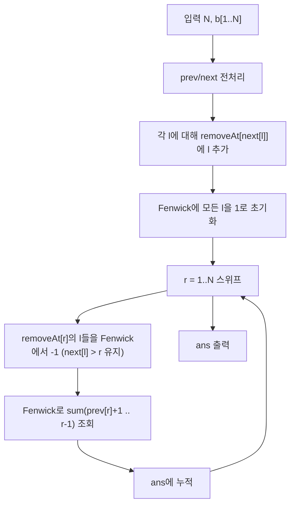

문제: [BOJ 21814 - United Cows of Farmer John](https://www.acmicpc.net/problem/21814)

길이 \(N\)의 품종 배열에서, 길이 2 이상인 구간 \([l, r]\)을 하나 고릅니다.  
이때 양끝 \(l, r\)의 소를 “리더”로 지정하며, **각 리더의 품종은 구간 내부(다른 리더 포함)에 다시 등장하면 안 됩니다.**  
즉, \(b_l\)은 \((l+1..r)\)에 없어야 하고, \(b_r\)은 \((l..r-1)\)에 없어야 합니다.

이 조건을 빠르게 세기 위해 `prev/next 등장 위치`로 조건을 바꾸고, 오른쪽 끝을 스위핑하면서 Fenwick Tree로 가능한 왼쪽 끝 개수를 누적합니다.

## 문제 정보

**문제 링크**: [https://www.acmicpc.net/problem/21814](https://www.acmicpc.net/problem/21814)

**문제 요약**:
- \(N\)마리 소가 일렬로 서 있고, \(i\)번째 소의 품종은 \(b_i\)입니다.
- 길이 2 이상인 구간 \([l, r]\)을 선택합니다.
- 리더 \(l\)의 품종 \(b_l\)이 \((l+1..r)\)에 등장하면 안 됩니다.
- 리더 \(r\)의 품종 \(b_r\)이 \((l..r-1)\)에 등장하면 안 됩니다.
- 가능한 구간(delegation) 개수를 출력합니다.

**제한 조건**:
- 시간 제한: 1초
- 메모리 제한: 512MB
- \(1 \le N \le 2 \cdot 10^5\)
- \(1 \le b_i \le N\)

## 입출력 예제

**입력 1**:

```text
7
1 2 3 4 3 2 5
```

**출력 1**:

```text
13
```

## 접근 방식

### 핵심 관찰 1) 조건을 prev/next로 바꾸기

각 위치 \(i\)에 대해,
- `prev[i]`: \(i\)보다 왼쪽에서 \(b_i\)가 마지막으로 나온 위치(없으면 0)
- `next[i]`: \(i\)보다 오른쪽에서 \(b_i\)가 처음으로 나온 위치(없으면 \(N+1\))

라고 하겠습니다.

구간 \([l, r]\)에서,
- \(l\)이 리더가 되려면 \(b_l\)이 \((l+1..r)\)에 없어야 하므로, **`next[l] > r`** 와 동치입니다.
- \(r\)이 리더가 되려면 \(b_r\)이 \((l..r-1)\)에 없어야 하므로, **`prev[r] < l`** 와 동치입니다.

따라서 답은 다음 쌍의 개수입니다.

- \(1 \le l < r \le N\)
- `next[l] > r`
- `prev[r] < l`

### 핵심 관찰 2) 오른쪽 끝 r을 고정하고 가능한 l을 세기

오른쪽 끝을 \(r\)로 고정하면 필요한 조건은:
- \(l \in [prev[r]+1, r-1]\)  (즉 `prev[r] < l < r`)
- 동시에 `next[l] > r`

즉, 매 \(r\)마다 “현재 \(r\)에서 유효한 \(l\)”을 자료구조로 관리하면서 구간 합을 구하면 됩니다.

### 알고리즘 설계 (Mermaid Flowchart)



### 단계별 로직

1. **전처리**:
   - 한 번의 좌→우 스캔으로 `prev[i]` 계산
   - 한 번의 우→좌 스캔으로 `next[i]` 계산
2. **스위핑 + Fenwick Tree**:
   - Fenwick에는 “현재 r에서 `next[l] > r`를 만족하는 l”만 1로 유지
   - \(r\)에 도달했을 때 `next[l] == r`인 \(l\)은 더 이상 쓸 수 없으니 비활성화
   - 그 후 `prev[r] < l < r` 구간 합을 더함
3. **출력**:
   - 누적합 `ans`는 최대 \(O(N^2)\)까지 커질 수 있으므로 `long long` 사용

### 정당성(왜 맞는가)

- **(필요조건)** 어떤 구간 \([l, r]\)이 유효하려면 \(b_l\)이 \((l+1..r)\)에 없고, \(b_r\)이 \((l..r-1)\)에 없어야 합니다.  
  이는 각각 `next[l] > r`, `prev[r] < l`와 동치입니다.
- **(충분조건)** 반대로 `next[l] > r`이면 \(b_l\)은 \(r\)까지 다시 등장하지 않으므로 \(l\)은 리더 조건을 만족합니다.  
  `prev[r] < l`이면 \(l..r-1\) 안에는 \(b_r\)이 없으므로 \(r\)도 리더 조건을 만족합니다.  
  따라서 두 조건을 동시에 만족하면 \([l, r]\)은 항상 유효합니다.
- 알고리즘은 각 \(r\)에 대해 정확히 조건을 만족하는 \(l\)의 개수를 Fenwick의 구간 합으로 세고 더하므로, 전체 정답을 정확히 구합니다.

## 복잡도 분석

| 항목 | 복잡도 | 비고 |
|---|---|---|
| **시간 복잡도** | \(O(N \log N)\) | 전처리 \(O(N)\) + 스위프 중 Fenwick 갱신/질의 \(O(\log N)\) |
| **공간 복잡도** | \(O(N)\) | `prev`, `next`, Fenwick, 버킷 배열 |

## 구현 코드

### C++

```cpp
// 42jerrykim.github.io에서 더 많은 정보를 확인 할 수 있다
#include <bits/stdc++.h>
using namespace std;

struct Fenwick {
    int n;
    vector<int> bit;
    Fenwick(int n = 0) : n(n), bit(n + 1, 0) {}

    void add(int i, int v) {
        for (; i <= n; i += i & -i) bit[i] += v;
    }

    int sumPrefix(int i) const {
        int s = 0;
        for (; i > 0; i -= i & -i) s += bit[i];
        return s;
    }

    int sumRange(int l, int r) const {
        if (l > r) return 0;
        return sumPrefix(r) - sumPrefix(l - 1);
    }
};

int main() {
    ios::sync_with_stdio(false);
    cin.tie(nullptr);

    int N;
    cin >> N;
    vector<int> b(N + 1);
    for (int i = 1; i <= N; i++) cin >> b[i];

    vector<int> prevPos(N + 1), nextPos(N + 1);
    vector<int> last(N + 1, 0);

    // prevPos[i]
    for (int i = 1; i <= N; i++) {
        prevPos[i] = last[b[i]];
        last[b[i]] = i;
    }

    // nextPos[i]
    fill(last.begin(), last.end(), N + 1);
    for (int i = N; i >= 1; i--) {
        nextPos[i] = last[b[i]];
        last[b[i]] = i;
    }

    // removeAt[r] = { l | nextPos[l] == r }
    vector<vector<int>> removeAt(N + 2);
    for (int l = 1; l <= N; l++) {
        if (nextPos[l] <= N) removeAt[nextPos[l]].push_back(l);
    }

    // Fenwick holds active l where nextPos[l] > current r
    Fenwick fw(N);
    for (int l = 1; l <= N; l++) fw.add(l, 1);

    long long ans = 0;
    for (int r = 1; r <= N; r++) {
        for (int l : removeAt[r]) fw.add(l, -1); // now nextPos[l] <= r

        // need prevPos[r] < l < r and nextPos[l] > r
        int L = prevPos[r] + 1;
        int R = r - 1;
        ans += fw.sumRange(L, R);
    }

    cout << ans << "\n";
    return 0;
}
```

## 코너 케이스 및 실수 포인트

| 케이스 | 설명 | 처리 방법 |
|---|---|---|
| **N=1** | 길이 2 이상 구간이 없음 | 루프는 돌아도 `R=r-1`로 합이 0 |
| **모든 품종 동일** | 어떤 리더도 내부에 같은 품종이 생김 | `prev/next` 조건이 자동으로 걸러줌 |
| **모든 품종 서로 다름** | 거의 모든 \([l,r]\)이 유효 | `ans`가 커지므로 `long long` 필수 |
| **오프바이원** | `prev[r] < l < r` 범위 | 질의 범위를 `[prev[r]+1, r-1]`로 고정 |

## 참고 문헌 및 출처

- [백준 21814번 - United Cows of Farmer John](https://www.acmicpc.net/problem/21814)
- USACO 2021 US Open Gold 1 (원문 출처)

## 작성 체크리스트

- [x] 폴더명이 `YYYY-MM-DD-BOJ-번호-슬러그` 형식인가?
- [x] Front Matter의 tags가 50개 이상인가? (한글/영어 혼합)
- [x] description이 150자 내외로 핵심을 요약했는가?
- [x] Mermaid 다이어그램으로 로직을 시각화했는가?
- [x] 복잡도 분석이 표(Table) 형식으로 작성되었는가?
- [x] 코드 최상단에 지정 주석이 포함되었는가?
- [x] 코너 케이스 체크리스트가 포함되었는가?
- [x] `date`와 `lastmod`가 오늘 날짜(`2026-02-06`)로 설정되었는가?

