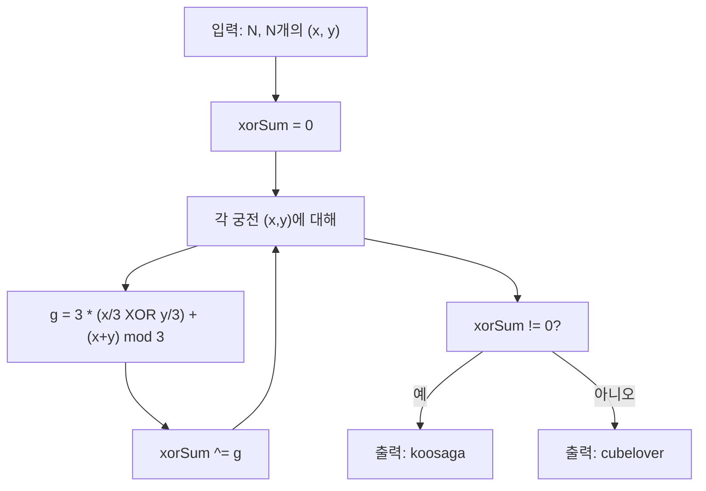

3000×3000 체스판 위에서 **궁전**(룩+킹 이동)을 (0,0) 쪽으로만 움직이는 턴제 게임이다.  
각 궁전의 **Grundy 수**를 구해 XOR 합이 0이면 후공(cubelover) 승, 아니면 선공(koosaga) 승임을 이용해 \(O(N)\)에 답을 구한다.

## 문제 정보

**문제 링크**: [https://www.acmicpc.net/problem/16879](https://www.acmicpc.net/problem/16879)

**문제 요약**:
- 크기 3000×3000 체스판에 궁전 \(N\)개가 놓여 있다. 가장 왼쪽 아랫칸은 (0,0), 오른쪽 윗칸은 (2999,2999).
- 궁전은 **룩**(같은 행/열) 또는 **킹**(인접 8방)으로 이동할 수 있으나, **맨해튼 거리**(\(x+y\))가 감소하는 방향으로만 이동 가능하다.
- 턴마다 궁전 하나를 골라 위 조건을 만족하게 한 칸 옮긴다. 더 이상 옮길 수 없는 쪽이 진다.
- 구사과(선공)와 큐브러버(후공)가 최적 플레이할 때 승자를 구한다.

**제한 조건**:
- 시간 제한: 0.5초
- 메모리 제한: 512MB
- \(1 \le N \le 300{,}000\), \(0 \le x, y < 3000\)

## 입출력 예제

**입력 1**:

```text
1
3 2
```

**출력 1**:

```text
koosaga
```

**입력 2**:

```text
1
3 3
```

**출력 2**:

```text
cubelover
```

**입력 3**:

```text
3
7 4
3 7
1 0
```

**출력 3**:

```text
cubelover
```

**입력 4**:

```text
5
4 2
6 9
7 8
2 1
5 5
```

**출력 4**:

```text
koosaga
```

## 접근 방식

### 핵심 관찰: Impartial Game + Grundy

- **(0,0)**에 있으면 이동 불가 → 패배 위치(Grundy 0).
- 맨해튼 거리가 감소하는 이동만 허용되므로:
  - **룩**: 같은 행에서 \(x\) 감소, 또는 같은 열에서 \(y\) 감소 → \((x', y)\) (\(x' < x\)), \((x, y')\) (\(y' < y\)).
  - **킹**: 8방 중 거리가 감소하는 것은 **왼쪽 아래** 대각선 한 방향뿐 → \((x-1, y-1)\).
- 각 궁전은 서로 독립이므로 **Sprague-Grundy 정리**: 여러 독립 게임의 XOR 합이 0이면 후공 승, 아니면 선공 승.

각 칸 \((x,y)\)의 **Grundy 수**를 작은 격자에서 DP로 구해 보면 패턴이 보인다.  
6×6 정도까지 직접 계산하면 다음 공식이 성립함을 확인할 수 있다:

\[
g(x, y) = 3 \times \bigl(\lfloor x/3 \rfloor \oplus \lfloor y/3 \rfloor\bigr) + (x + y) \bmod 3.
\]

- \(\lfloor x/3 \rfloor \oplus \lfloor y/3 \rfloor\): 3×3 블록 단위의 “블록 좌표” XOR.
- \((x+y) \bmod 3\): 블록 내에서의 나머지 성분.

따라서 각 궁전 \((x_i, y_i)\)에 대해 \(g(x_i, y_i)\)를 구하고, **XOR 합**이 0이면 `cubelover`, 아니면 `koosaga`를 출력하면 된다.

### 알고리즘 설계 (Mermaid Flowchart)



### 단계별 로직

1. **입력**: \(N\)과 \(N\)개의 \((x, y)\) 좌표를 읽는다.
2. **Grundy 계산**: 각 \((x, y)\)에 대해 \(g = 3 \times (\lfloor x/3 \rfloor \oplus \lfloor y/3 \rfloor) + (x+y) \bmod 3\)를 계산하고, 전부 XOR한다.
3. **승자 판정**: XOR 합이 0이면 후공(cubelover), 아니면 선공(koosaga)를 출력한다.

## 복잡도 분석

| 항목 | 복잡도 | 비고 |
|---|---|---|
| **시간 복잡도** | \(O(N)\) | 궁전당 \(O(1)\) Grundy 계산 후 XOR |
| **공간 복잡도** | \(O(1)\) | 좌표를 하나씩 읽으며 XOR만 유지 가능 |

## 코너 케이스 및 실수 포인트

| 케이스 | 설명 | 처리 방법 |
|---|---|---|
| **N=1** | 궁전 하나만 있을 때 | 한 칸의 Grundy만 보면 됨. (3,3), (6,6) 등은 0 → cubelover |
| **(0,0)** | 이미 끝 칸이면 이동 불가 | \(g(0,0)=0\)이므로 XOR에 0 기여 |
| **여러 궁전 같은 칸** | 동일 칸에 여러 말 가능 | 각각 독립적으로 Grundy 계산 후 XOR (같은 칸이면 같은 \(g\)가 짝수 번 XOR되어 상쇄) |
| **정수 범위** | \(x,y < 3000\)이면 \(g\)는 \(3 \times 1023 + 2\) 수준 | 32비트 정수로 충분 |

## 구현 코드 (C++)

```cpp
// 42jerrykim.github.io에서 더 많은 정보를 확인 할 수 있다
#include <bits/stdc++.h>
using namespace std;

int main() {
    ios_base::sync_with_stdio(false);
    cin.tie(NULL);

    int n;
    cin >> n;

    int xorSum = 0;
    for (int i = 0; i < n; i++) {
        int x, y;
        cin >> x >> y;
        int g = 3 * ((x / 3) ^ (y / 3)) + (x + y) % 3;
        xorSum ^= g;
    }

    cout << (xorSum ? "koosaga" : "cubelover") << "\n";
    return 0;
}
```

## 참고 문헌 및 출처

- [백준 16879번 궁전 게임](https://www.acmicpc.net/problem/16879)
