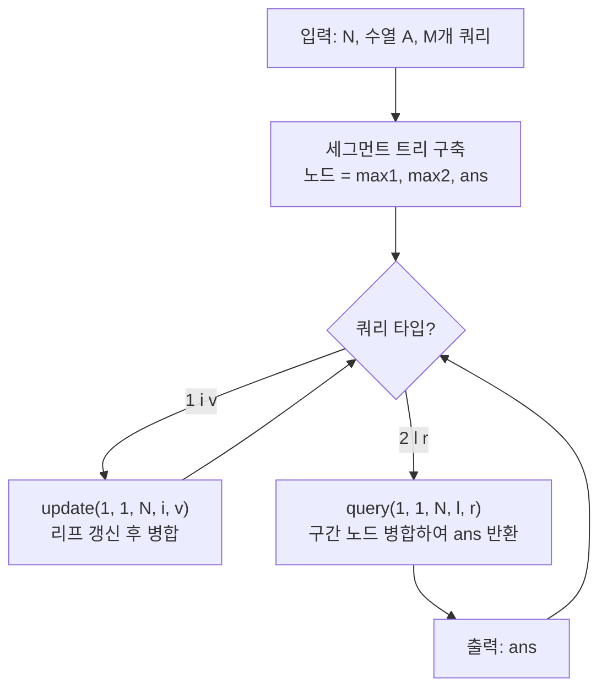

수열에 **점 업데이트**와 **구간 [l, r]에서 서로 다른 두 인덱스 i < j에 대한 Ai + Aj의 최댓값** 쿼리를 처리하는 문제다.  
세그먼트 트리 각 노드에 구간의 **최댓값**, **두 번째 최댓값**, 그리고 **두 원소 합의 최댓값**을 들고 있으면, 병합 시 왼쪽 최댓값 + 오른쪽 최댓값을 고려해 O(log N)에 답을 구할 수 있다.

## 문제 정보

**문제 링크**: [https://www.acmicpc.net/problem/17408](https://www.acmicpc.net/problem/17408)

**문제 요약**:
- 길이 \(N\)인 수열 \(A_1, \ldots, A_N\)이 주어진다.
- **쿼리 1** `1 i v`: \(A_i\)를 \(v\)로 바꾼다. (\(1 \le i \le N\), \(1 \le v \le 10^9\))
- **쿼리 2** `2 l r`: \(l \le i < j \le r\)을 만족하는 모든 \(A_i + A_j\) 중 최댓값을 출력한다. (\(1 \le l < r \le N\))
- 수열 인덱스는 1부터 시작한다.

**제한 조건**:
- 시간 제한: 1초
- 메모리 제한: 512MB
- \(2 \le N \le 100{,}000\), \(2 \le M \le 100{,}000\)

## 입출력 예제

**입력 1**:

```text
5
5 4 3 2 1
6
2 2 4
2 1 4
1 5 5
2 3 5
1 4 9
2 3 5
```

**출력 1**:

```text
7
9
8
14
```

**설명**: 첫 쿼리 `2 2 4`는 구간 [2,4]에서 A₂+A₃=4+3=7, A₂+A₄=4+2=6, A₃+A₄=3+2=5 중 최댓값 7을 출력한다. 이후 업데이트와 쿼리가 반복된다.

## 접근 방식

### 핵심 관찰: 구간 내 “두 원소 합” 최댓값은 최댓값 두 개로 결정된다

\(l \le i < j \le r\) 조건에서 \(A_i + A_j\)의 최댓값을 구할 때, **같은 구간 안에서** 합이 최대가 되려면 해당 구간에서 **가장 큰 값**과 **그다음 큰 값**을 더한 것이 최대이다. (같은 인덱스를 두 번 쓰지 않으므로, 최댓값 하나와 두 번째 최댓값 하나의 조합이 최선이다.)

따라서 세그먼트 트리 노드에 다음을 저장하면 된다:
- **max1**: 구간 내 최댓값
- **max2**: 구간 내 두 번째 최댓값 (같은 구간 내에서만 사용할 때의 후보)
- **ans**: 해당 구간만 놓고 봤을 때의 “두 원소 합” 최댓값 (즉, max1 + max2가 유효하면 그 값, 아니면 구간 길이가 1일 때 등은 매우 작은 값으로 둠)

두 자식 구간을 병합할 때:
- **ans** = max(왼쪽.ans, 오른쪽.ans, **왼쪽.max1 + 오른쪽.max1**).  
  즉, “왼쪽 구간만”, “오른쪽 구간만”, “왼쪽 최댓값 + 오른쪽 최댓값” 중 최대가 전체 구간의 답이 된다. (i < j 조건은 서로 다른 구간에서 하나씩 뽑으면 자동으로 만족한다.)
- **max1, max2**는 두 자식의 max1, max2 네 값 중 가장 큰 두 개를 취하면 된다.

리프에서는 원소 하나뿐이므로 max1만 의미 있고, 두 원소 합은 정의할 수 없어 **ans**는 충분히 작은 값(예: `LLONG_MIN/2`)으로 두면 된다.

### 알고리즘 설계 (Mermaid Flowchart)



### 단계별 로직

1. **초기화**: 수열을 1-index로 저장하고, 세그먼트 트리를 build한다. 리프 노드는 (max1 = A[i], max2 = 매우 작은 값, ans = 매우 작은 값).
2. **병합(merge)**: 왼쪽/오른쪽 노드의 max1, max2에서 상위 두 개를 골라 새 max1, max2를 정하고, ans = max(left.ans, right.ans, left.max1 + right.max1)로 갱신한다.
3. **쿼리 1**: update(node, s, e, idx, val)로 해당 리프만 바꾼 뒤, 위로 올라가며 merge로 갱신한다.
4. **쿼리 2**: query(node, s, e, l, r)로 [l, r]을 덮는 노드들을 병합한 결과 노드의 ans를 출력한다.

## 복잡도 분석

| 항목 | 복잡도 | 비고 |
|---|---|---|
| **시간 복잡도** | \(O((N + M) \log N)\) | build \(O(N)\), 쿼리·업데이트 각 \(O(\log N)\) |
| **공간 복잡도** | \(O(N)\) | 세그먼트 트리 노드 수 \(O(N)\) |

## 코너 케이스 및 실수 포인트

| 케이스 | 설명 | 처리 방법 |
|---|---|---|
| **구간 길이 1** | l = r이면 두 원소를 고를 수 없음 | 문제에서 \(l < r\)만 주어지므로 구간 길이 ≥ 2 |
| **두 번째 최댓값 없음** | 구간에 원소가 하나뿐일 때 max2 미정의 | max2를 `LLONG_MIN/2` 등으로 두어 합이 오버플로우하지 않게 처리 |
| **오버플로우** | \(A_i \le 10^9\)이면 \(A_i + A_j \le 2 \times 10^9\) | `long long` 사용 시 안전 |
| **1-index** | 문제와 트리 모두 1-index 사용 | 입력/업데이트 인덱스 그대로 사용 |

## 구현 코드 (C++)

```cpp
// 42jerrykim.github.io에서 더 많은 정보를 확인 할 수 있다
#include <bits/stdc++.h>
using namespace std;

struct Node {
    long long max1, max2, ans;
};

Node tree[400005];
int n;

Node merge(Node l, Node r) {
    Node res;
    res.ans = max({l.ans, r.ans, l.max1 + r.max1});
    if (l.max1 >= r.max1) {
        res.max1 = l.max1;
        res.max2 = max(l.max2, r.max1);
    } else {
        res.max1 = r.max1;
        res.max2 = max(r.max2, l.max1);
    }
    return res;
}

void build(int node, int s, int e, vector<long long>& a) {
    if (s == e) {
        tree[node] = {a[s], LLONG_MIN / 2, LLONG_MIN / 2};
        return;
    }
    int mid = (s + e) / 2;
    build(2*node, s, mid, a);
    build(2*node+1, mid+1, e, a);
    tree[node] = merge(tree[2*node], tree[2*node+1]);
}

void update(int node, int s, int e, int idx, long long val) {
    if (s == e) {
        tree[node] = {val, LLONG_MIN / 2, LLONG_MIN / 2};
        return;
    }
    int mid = (s + e) / 2;
    if (idx <= mid) update(2*node, s, mid, idx, val);
    else update(2*node+1, mid+1, e, idx, val);
    tree[node] = merge(tree[2*node], tree[2*node+1]);
}

Node query(int node, int s, int e, int l, int r) {
    if (r < s || e < l) return {LLONG_MIN / 2, LLONG_MIN / 2, LLONG_MIN / 2};
    if (l <= s && e <= r) return tree[node];
    int mid = (s + e) / 2;
    return merge(query(2*node, s, mid, l, r), query(2*node+1, mid+1, e, l, r));
}

int main() {
    ios::sync_with_stdio(false);
    cin.tie(nullptr);

    cin >> n;
    vector<long long> a(n+1);
    for (int i = 1; i <= n; i++) cin >> a[i];
    build(1, 1, n, a);

    int m;
    cin >> m;
    while (m--) {
        int t; cin >> t;
        if (t == 1) {
            int i; long long v; cin >> i >> v;
            update(1, 1, n, i, v);
        } else {
            int l, r; cin >> l >> r;
            cout << query(1, 1, n, l, r).ans << '\n';
        }
    }
    return 0;
}
```

## 참고 문헌 및 출처

- [백준 17408번 수열과 쿼리 24](https://www.acmicpc.net/problem/17408)
