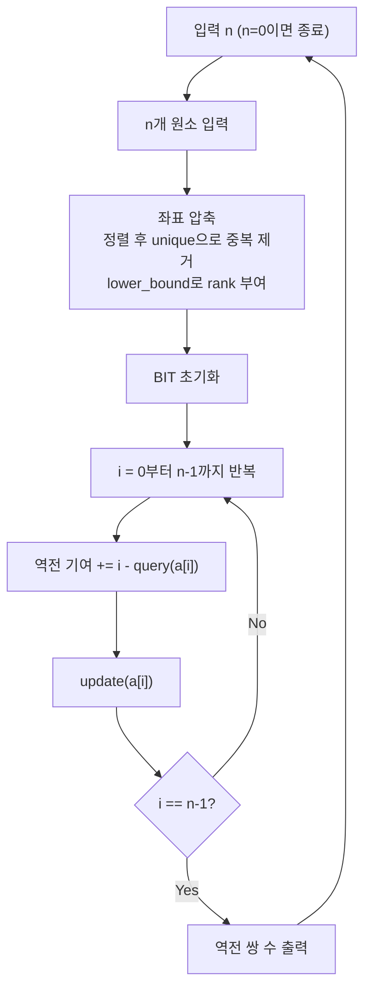

인접한 원소끼리만 교환해서 정렬하는 데 필요한 **최소 교환 횟수**는 수열의 **역전 쌍(Inversion) 수**와 정확히 일치한다.  
값이 최대 999,999,999에 달하므로 **좌표 압축** 후 **BIT(Binary Indexed Tree)**로 O(N log N)에 역전 쌍을 셀 수 있다.

## 문제 정보

**문제 링크**: [https://www.acmicpc.net/problem/4297](https://www.acmicpc.net/problem/4297)

**문제 요약**:
- n개의 서로 다른 정수로 이루어진 수열이 주어진다.
- 인접한 두 원소를 교환하는 연산만으로 오름차순 정렬하려 할 때, **최소 교환 횟수**를 구한다.
- 여러 테스트 케이스가 주어지며 n = 0이 입력되면 종료한다.

**제한 조건**:
- 시간 제한: 1초
- 메모리 제한: 256MB
- \(1 \le n < 500{,}000\)
- \(0 \le a[i] \le 999{,}999{,}999\) (모든 값이 서로 다름)

## 입출력 예제

**입력 1**:

```text
5
9
1
0
5
4
3
1
2
3
0
```

**출력 1**:

```text
6
0
```

**설명**: 첫 번째 수열 `[9, 1, 0, 5, 4]`에서 역전 쌍은 (9,1), (9,0), (9,5), (9,4), (1,0), (5,4) 총 6쌍이다. 두 번째 수열 `[1, 2, 3]`은 이미 정렬되어 있으므로 0이다.

## 접근 방식

### 핵심 관찰: 인접 교환 최소 횟수 = 역전 쌍 수

인접한 두 원소를 교환하는 연산은 **정확히 역전 쌍 하나를 제거**한다. 따라서 수열을 정렬하는 데 필요한 최소 인접 교환 횟수는 수열 내 역전 쌍의 총 개수와 동치이다.

역전 쌍 \((i, j)\): \(i < j\)이면서 \(a[i] > a[j]\)인 쌍

값의 범위가 \(10^9\)이므로 BIT에 직접 넣을 수 없다. 따라서 **좌표 압축**으로 원래 값을 1~n 범위로 변환한 뒤, BIT를 활용한다.

### BIT를 이용한 역전 쌍 카운팅 원리

왼쪽에서 오른쪽으로 원소를 차례로 처리할 때, i번째 원소 a[i]를 BIT에 삽입하기 전에 **a[i]보다 큰 값이 앞에 몇 개 삽입되어 있는지**를 계산하면 된다.

- `query(a[i])`: 1~a[i] 범위에 삽입된 원소 수
- i번째 원소를 처리하는 시점에 앞서 삽입된 총 원소 수: i (0-indexed에서 i)
- 역전 기여 = `i - query(a[i])`

### 알고리즘 설계 (Mermaid Flowchart)



### 단계별 로직

1. **좌표 압축**: 입력 배열을 복사해 정렬 후 중복 제거. `lower_bound`로 각 원소의 rank(1~n)를 구한다.
2. **BIT 초기화**: 크기 n+1 배열을 0으로 초기화한다.
3. **역전 쌍 카운팅**: 원소를 순서대로 처리하면서, 현재까지 삽입된 수 중 현재 값보다 큰 수의 개수(`i - query(a[i])`)를 누적한다.
4. **업데이트**: 처리한 원소를 BIT에 삽입한다.
5. **출력**: 누적된 역전 쌍 수를 출력한다.

## 복잡도 분석

| 항목 | 복잡도 | 비고 |
|---|---|---|
| **시간 복잡도** | \(O(N \log N)\) | 좌표 압축 정렬 \(O(N \log N)\) + BIT 처리 \(O(N \log N)\) |
| **공간 복잡도** | \(O(N)\) | 입력 배열, 압축 배열, BIT 배열 |

## 코너 케이스 및 실수 포인트

| 케이스 | 설명 | 처리 방법 |
|---|---|---|
| **n=1** | 원소가 하나면 역전 쌍 없음 | 루프가 자연스럽게 0을 반환 |
| **이미 정렬된 수열** | 역전 쌍 0 | `i - query(a[i])`가 항상 0이 되어 자동 처리 |
| **역정렬된 수열** | 최대 \(N(N-1)/2\)개의 역전 쌍 | `long long` 사용 필수 (\(500000 \times 499999 / 2 \approx 1.25 \times 10^{11}\)) |
| **값 범위 초과** | 최대 999,999,999 | 좌표 압축 후 BIT 사용 |
| **다중 테스트 케이스** | BIT를 매번 초기화해야 함 | `fill(bit, bit + N + 2, 0)` 사용 |

## 구현 코드 (C++)

```cpp
// 42jerrykim.github.io에서 더 많은 정보를 확인 할 수 있다
#include <bits/stdc++.h>
using namespace std;
typedef long long ll;

int bit[500005];
int N;

void update(int i) {
    for (; i <= N; i += i & -i)
        bit[i]++;
}

int query(int i) {
    int s = 0;
    for (; i > 0; i -= i & -i)
        s += bit[i];
    return s;
}

int main() {
    ios_base::sync_with_stdio(false);
    cin.tie(NULL);

    while (cin >> N && N) {
        vector<int> a(N);
        for (int i = 0; i < N; i++) cin >> a[i];

        // 좌표 압축
        vector<int> sorted_a = a;
        sort(sorted_a.begin(), sorted_a.end());
        sorted_a.erase(unique(sorted_a.begin(), sorted_a.end()), sorted_a.end());
        for (int i = 0; i < N; i++)
            a[i] = (int)(lower_bound(sorted_a.begin(), sorted_a.end(), a[i]) - sorted_a.begin()) + 1;

        // BIT로 역전 쌍 카운트
        fill(bit, bit + N + 2, 0);
        ll inv = 0;
        for (int i = 0; i < N; i++) {
            inv += i - query(a[i]);
            update(a[i]);
        }

        cout << inv << "\n";
    }

    return 0;
}
```

## 참고 문헌 및 출처

- [백준 4297번 Ultra-QuickSort](https://www.acmicpc.net/problem/4297)
- [역전 쌍 (Inversion) - Wikipedia](https://en.wikipedia.org/wiki/Inversion_(discrete_mathematics))
