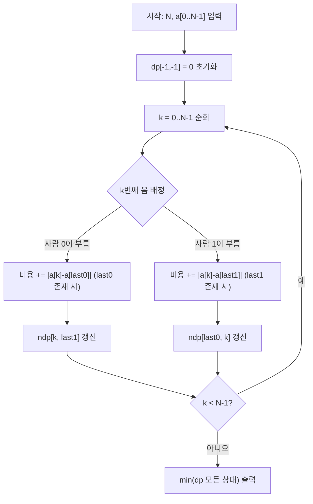

두 사람이 노래의 N개 음을 나누어 부를 때, **두 사람이 느끼는 난이도의 합**을 최소화하는 문제이다. 각 사람의 난이도는 **연속으로 부른 음의 차이의 합**으로 정의되며, DP로 최적 배분을 구할 수 있다.

## 문제 정보

**문제 링크**: [https://www.acmicpc.net/problem/12932](https://www.acmicpc.net/problem/12932)

**문제 요약**:
- 음의 높이는 1부터 1,000,000까지의 정수로 표현된다.
- 노래는 N개의 음이 순서대로 주어진다.
- 각 음은 두 사람 중 한 사람만 부른다.
- 각 사람의 난이도 = 연속으로 부른 음들의 차이의 합 (예: 8, 8, 13, 12를 부르면 \|8-8\| + \|13-8\| + \|12-13\| = 6)
- 두 사람 난이도의 합의 최솟값을 구한다.

**제한 조건**:
- 시간 제한: 2초
- 메모리 제한: 512MB
- $1 \le N \le 2{,}000$

## 입출력 예제

**입력 1**:

```text
5
1 3 8 12 13
```

**출력 1**:

```text
7
```

**설명**: 영선이가 1, 3을 부르고 효빈이가 8, 12, 13을 부르면 영선 난이도 2 + 효빈 난이도 5 = 7이다.

**입력 2**:

```text
5
1 5 6 2 1
```

**출력 2**:

```text
3
```

**입력 3**:

```text
8
5 5 5 5 4 4 4 4
```

**출력 3**:

```text
0
```

## 접근 방식

### 핵심 관찰

- 같은 사람이 **연속으로** 부른 음들 사이에만 비용이 발생한다. 다른 사람이 부른 음이 끼어 있으면 그 구간은 비용에 포함되지 않는다.
- 따라서 각 음을 순서대로 처리하면서, "누가 k번째 음을 부르는가"를 결정할 때, 그 사람이 **직전에 부른 음의 인덱스**만 알면 새로 추가되는 비용 \|a[k] - a[last]\|를 계산할 수 있다.
- 이 문제는 **최적 부분 구조**를 가지므로 DP로 접근 가능하다.

### 알고리즘 설계 (Mermaid Flowchart)



### 단계별 로직

1. **상태 정의**: `dp[last0][last1]` = 0..k-1번 음까지 처리했을 때의 최소 총 난이도. `last0`는 사람 0이 마지막으로 부른 음의 인덱스, `last1`은 사람 1의 것. (-1이면 아직 부른 적 없음)
2. **전이**: k번째 음을 사람 0이 부르면 `last0` → k, 비용에 \|a[k]-a[last0]\| 추가 (last0 ≥ 0일 때). 사람 1이 부르면 `last1` → k, 비용에 \|a[k]-a[last1]\| 추가.
3. **유효 상태**: k번째 음까지 처리한 상태에서는 반드시 `last0 = k` 또는 `last1 = k`이어야 하므로, 이전 단계에서 `last0 = k-1` 또는 `last1 = k-1`인 상태만 전이에 사용한다.
4. **답**: 모든 음 처리 후 `dp`의 최솟값.

## 복잡도 분석

| 항목 | 복잡도 | 비고 |
|---|---|---|
| **시간 복잡도** | $O(N^2)$ | 각 단계에서 상태 수 $O(N)$, 총 $N$ 단계 |
| **공간 복잡도** | $O(N^2)$ | `map`으로 유효 상태만 저장 시 실제로는 $O(N)$ 수준 |

## 구현 코드

### C++

```cpp
// 42jerrykim.github.io에서 더 많은 정보를 확인 할 수 있다
#include <bits/stdc++.h>
using namespace std;

const long long INF = 1e18;

int main() {
    ios::sync_with_stdio(false);
    cin.tie(nullptr);

    int n;
    cin >> n;
    vector<int> a(n);
    for (int i = 0; i < n; i++) cin >> a[i];

    // dp[last0][last1] = min total difficulty
    // last0 = last index person 0 sang (-1 if none)
    // last1 = last index person 1 sang (-1 if none)
    const int NONE = -1;
    map<pair<int, int>, long long> dp;
    dp[{NONE, NONE}] = 0;

    for (int k = 0; k < n; k++) {
        map<pair<int, int>, long long> ndp;
        for (auto& [key, cost] : dp) {
            int last0 = key.first, last1 = key.second;
            if (k > 0 && last0 != k - 1 && last1 != k - 1) continue;

            // Person 0 sings note k
            long long c0 = cost;
            if (last0 != NONE) c0 += abs(a[k] - a[last0]);
            {
                auto p = make_pair(k, last1);
                if (!ndp.count(p) || ndp[p] > c0) ndp[p] = c0;
            }

            // Person 1 sings note k
            long long c1 = cost;
            if (last1 != NONE) c1 += abs(a[k] - a[last1]);
            {
                auto p = make_pair(last0, k);
                if (!ndp.count(p) || ndp[p] > c1) ndp[p] = c1;
            }
        }
        dp = move(ndp);
    }

    long long ans = INF;
    for (auto& [key, cost] : dp) {
        ans = min(ans, cost);
    }
    cout << ans << "\n";
    return 0;
}
```

## 코너 케이스 및 실수 포인트

| 케이스 | 설명 | 처리 방법 |
|---|---|---|
| **N=1** | 한 음만 있을 때 | 한 사람이 부르면 비용 0, 정상 처리됨 |
| **모든 음이 동일** | 예제 3처럼 5,5,5,5,4,4,4,4 | 같은 음 연속이면 \|차이\|=0, 답 0 |
| **오버플로우** | N=2000, 음 차이 최대 10^6일 때 | `long long` 사용으로 충분 |
| **상태 폭발** | 2D 배열 사용 시 | `map`으로 유효 상태만 저장해 메모리 절약 |

## 참고 문헌 및 출처

- [백준 12932번 노래방](https://www.acmicpc.net/problem/12932)
