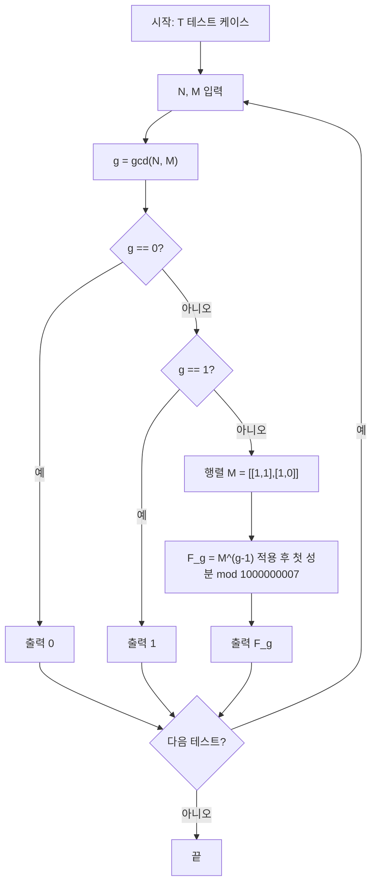

[BOJ 11238 - Fibo](https://www.acmicpc.net/problem/11238)는 두 피보나치 수 \(F_N\), \(F_M\)의 최대공약수를 \(1\,000\,000\,007\)로 나눈 나머지를 구하는 문제입니다. **gcd(F_n, F_m) = F_{gcd(n,m)}** 라는 아름다운 성질을 쓰면, 결국 \(g = \gcd(N, M)\)에 대해 \(F_g \bmod 1\,000\,000\,007\)만 빠르게 구하면 됩니다. \(N, M\)이 최대 \(10^9\)이므로 \(F_g\)는 **행렬 거듭제곱**으로 \(O(\log g)\)에 구합니다.

## 문제 정보

**문제 링크**: [https://www.acmicpc.net/problem/11238](https://www.acmicpc.net/problem/11238)

**문제 요약**:
- 피보나치 수열: \(F_0 = 0,\ F_1 = 1,\ F_n = F_{n-1} + F_{n-2}\) (\(n \ge 2\)).
- \(T\)개의 테스트마다 두 정수 \(N, M\)이 주어진다.
- \(\gcd(F_N, F_M) \bmod 1\,000\,000\,007\)을 출력한다.

**제한 조건**:
- 시간 제한: 1초
- 메모리 제한: 256MB
- \(1 \le T \le 1\,000\), \(0 < N, M \le 1\,000\,000\,000\)

## 입출력 예제

**입력 1**:

```text
2
7 10
6 12
```

**출력 1**:

```text
1
8
```

**설명**: \(\gcd(7,10)=1\) → \(F_1=1\). \(\gcd(6,12)=6\) → \(F_6=8\).

## 접근 방식

### 핵심 관찰

1. **피보나치와 GCD 성질**  
   \(\gcd(F_n, F_m) = F_{\gcd(n,m)}\) 가 성립한다. 따라서 \(\gcd(N, M) = g\)라 하면, 답은 \(F_g \bmod 1\,000\,000\,007\)이다.

2. **\(F_g\)를 빠르게 구하기**  
   \(g\)는 최대 약 \(10^9\)이므로 선형 반복은 불가능하다.  
   점화식 \(\begin{bmatrix} F_{k+1} \\ F_k \end{bmatrix} = \begin{bmatrix} 1 & 1 \\ 1 & 0 \end{bmatrix} \begin{bmatrix} F_k \\ F_{k-1} \end{bmatrix}\) 를 이용해 \(2\times 2\) 행렬의 \((g-1)\)제곱(또는 \(g\)제곱에 맞춘 구현)으로 \(F_g\)를 \(O(\log g)\)에 구할 수 있다.

3. **특수값**  
   \(g=0\)이면 \(F_0=0\), \(g=1\)이면 \(F_1=1\)로 바로 반환한다.

### 알고리즘 설계 (Mermaid)



### 단계별 로직

1. **gcd 계산**: 유클리드 호제법으로 \(g = \gcd(N, M)\)을 구한다.
2. **예외 처리**: \(g=0\)이면 \(0\), \(g=1\)이면 \(1\)을 출력하고 다음 테스트로 넘긴다.
3. **행렬 거듭제곱**:  
   \(\begin{bmatrix} 1 & 1 \\ 1 & 0 \end{bmatrix}^{g-1}\) 를 \(1\,000\,000\,007\)로 나눈 나머지에서 계산한다.  
   초기 벡터 \((F_1, F_0) = (1, 0)\)에 이 행렬을 \((g-1)\)번 적용한 결과의 첫 성분이 \(F_g\)이다.  
   즉, \(F_g = (M^{g-1})_{00} \cdot 1 + (M^{g-1})_{01} \cdot 0 = (M^{g-1})_{00}\).
4. **출력**: \(F_g \bmod 1\,000\,000\,007\)을 출력한다.

## 복잡도 분석

| 항목 | 복잡도 | 비고 |
|------|--------|------|
| **시간 복잡도** | \(O(T \log (\min(N,M)))\) | gcd \(O(\log(\min(N,M)))\), 행렬 거듭제곱 \(O(\log g)\) |
| **공간 복잡도** | \(O(1)\) | 고정 크기 행렬·변수만 사용 |

## 구현 코드

### C++

```cpp
// 42jerrykim.github.io에서 더 많은 정보를 확인 할 수 있다
#include <bits/stdc++.h>
using namespace std;
using ll = long long;

const ll MOD = 1000000007;

ll gcd(ll a, ll b) {
    while (b) { ll t = a % b; a = b; b = t; }
    return a;
}

void mat_mul(ll A[2][2], ll B[2][2]) {
    ll C[2][2] = {};
    for (int i = 0; i < 2; i++)
        for (int j = 0; j < 2; j++)
            for (int k = 0; k < 2; k++)
                C[i][j] = (C[i][j] + A[i][k] * B[k][j]) % MOD;
    for (int i = 0; i < 2; i++)
        for (int j = 0; j < 2; j++)
            A[i][j] = C[i][j];
}

void mat_pow(ll A[2][2], ll n) {
    ll B[2][2] = {{1, 0}, {0, 1}};
    ll T[2][2];
    for (; n; n >>= 1) {
        if (n & 1) {
            for (int i = 0; i < 2; i++) for (int j = 0; j < 2; j++) T[i][j] = A[i][j];
            mat_mul(B, T);
        }
        for (int i = 0; i < 2; i++) for (int j = 0; j < 2; j++) T[i][j] = A[i][j];
        mat_mul(T, A);  // T = A * A
        for (int i = 0; i < 2; i++) for (int j = 0; j < 2; j++) A[i][j] = T[i][j];
    }
    for (int i = 0; i < 2; i++)
        for (int j = 0; j < 2; j++)
            A[i][j] = B[i][j];
}

ll fibo(ll n) {
    if (n == 0) return 0;
    if (n == 1) return 1;
    ll M[2][2] = {{1, 1}, {1, 0}};
    mat_pow(M, n - 1);
    return M[0][0];
}

int main() {
    ios::sync_with_stdio(false);
    cin.tie(nullptr);
    int T;
    cin >> T;
    while (T--) {
        ll N, M;
        cin >> N >> M;
        ll g = gcd(N, M);
        cout << fibo(g) << '\n';
    }
    return 0;
}
```

### Python

```python
# 42jerrykim.github.io에서 더 많은 정보를 확인 할 수 있다
import sys
input = sys.stdin.readline

MOD = 10**9 + 7

def gcd(a, b):
    while b:
        a, b = b, a % b
    return a

def mat_mul(A, B):
    C = [[0, 0], [0, 0]]
    for i in range(2):
        for j in range(2):
            for k in range(2):
                C[i][j] = (C[i][j] + A[i][k] * B[k][j]) % MOD
    return C

def mat_pow(M, n):
    if n == 0:
        return [[1, 0], [0, 1]]
    half = mat_pow(M, n // 2)
    sq = mat_mul(half, half)
    if n % 2:
        return mat_mul(sq, M)
    return sq

def fibo(n):
    if n == 0:
        return 0
    if n == 1:
        return 1
    M = [[1, 1], [1, 0]]
    M = mat_pow(M, n - 1)
    return M[0][0]

T = int(input())
for _ in range(T):
    N, M = map(int, input().split())
    g = gcd(N, M)
    print(fibo(g))
```

## 코너 케이스 및 실수 포인트

| 케이스 | 설명 | 처리 방법 |
|--------|------|-----------|
| **g = 0** | gcd(N,M)=0인 경우(문제 조건상 N,M>0이라 실제로는 없음) | \(F_0=0\) 반환 |
| **g = 1** | \(F_1=1\) | 행렬 연산 없이 1 반환 |
| **큰 g** | \(g \approx 10^9\) | 행렬 거듭제곱으로 \(O(\log g)\)에 계산 |
| **오버플로우** | 행렬 곱셈 시 중간값 | 매 연산마다 \(\bmod 1\,000\,000\,007\) 적용 |
| **행렬 복사** | C++에서 `mat_pow` 시 원본 행렬이 바뀜 | `mat_pow` 내부에서 복사본으로 거듭제곱 후 결과만 복사 |

## 마무리

피보나치와 GCD의 관계 \(\gcd(F_n, F_m) = F_{\gcd(n,m)}\)를 알면 문제가 단순히 “\(F_g\)를 빠르게 구하기”로 줄어듭니다. 행렬 거듭제곱은 피보나치뿐 아니라 선형 점화식 일반항을 로그 시간에 구할 때 자주 쓰이므로 익혀 두면 유용합니다.

## 참고 문헌 및 출처

- [백준 11238번 Fibo](https://www.acmicpc.net/problem/11238)
- [Fibonacci number - Wikipedia](https://en.wikipedia.org/wiki/Fibonacci_number) (Fibonacci GCD identity)
