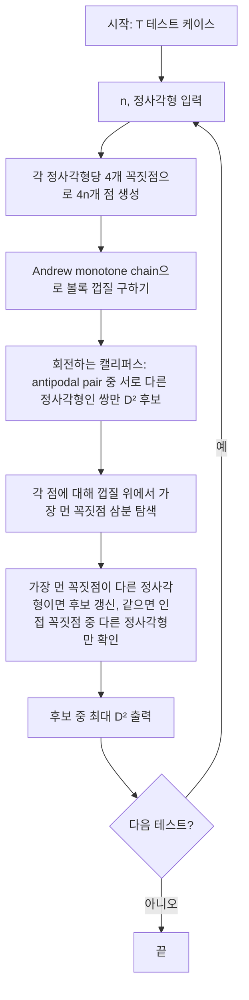

문제: [BOJ 8927 - Squares](https://www.acmicpc.net/problem/8927)

평면 위에 축에 평행한 정사각형들이 주어질 때, 각 정사각형에서 정확히 한 점씩 선택해 만든 점 집합의 **직경(diameter)**을 최대화하고, 그 직경 \(D\)의 제곱 \(D^2\)을 정수로 출력하는 문제입니다.

## 문제 정보

**문제 링크**: [https://www.acmicpc.net/problem/8927](https://www.acmicpc.net/problem/8927)

**문제 요약**:
- \(n\)개의 정사각형이 주어진다. 각 정사각형은 왼쪽 아래 꼭짓점 \((x,y)\)와 한 변의 길이 \(w\)로 주어진다.
- 각 정사각형에서 정확히 한 점을 선택해 \(n\)개의 점을 만든다.
- 직경은 이 점들 중 **가장 먼 두 점 사이의 유클리드 거리**로 정의된다.
- 직경을 최대화하는 선택에 대한 직경 \(D\)의 제곱 \(D^2\)을 출력한다.

**제한 조건**:
- 시간 제한: 1초
- 메모리 제한: 128MB
- \(2 \le n \le 100\,000\), \(0 \le x,y \le 10\,000\), \(1 \le w \le 10\,000\)

## 입출력 예제

**입력 1**:

```text
2
3
0 0 1
1 0 2
0 0 1
6
2 1 2
1 4 2
3 2 3
4 4 4
6 5 1
5 1 3
```

**출력 1**:

```text
13
85
```

## 접근 방식

### 핵심 관찰

1. **직경을 만드는 두 점은 항상 두 정사각형의 꼭짓점으로 잡을 수 있다.**  
   두 정사각형 \(A, B\)에서 거리를 최대화하려면, 한 점은 \(A\)의 경계(또는 내부)에서 \(B\)와 반대 방향으로 밀어낸 점이어야 하므로, 결국 \(A\)의 네 꼭짓점 중 하나, \(B\)의 네 꼭짓점 중 하나에서 최대가 된다.

2. **전체 후보는 정사각형당 4개 꼭짓점으로 총 \(4n\)개.**  
   이 \(4n\)개 점에 대해 “서로 다른 정사각형에서 나온 두 점” 쌍 중 거리 제곱의 최댓값을 구하면 된다.

3. **볼록 껍질과 직경:**  
   평면 위 점 집합의 직경(가장 먼 두 점)은 항상 **볼록 껍질** 위의 두 점(antipodal pair)으로 얻을 수 있다. 따라서 \(4n\)개 꼭짓점의 볼록 껍질을 구한 뒤, **회전하는 캘리퍼스(rotating calipers)**로 antipodal pair를 모두 보면서, 서로 다른 정사각형에서 나온 쌍에 대해서만 \(D^2\) 후보를 갱신한다.

4. **껍질 밖 점 처리:**  
   직경을 이루는 두 점이 “둘 다 껍질 위”가 아니라 “한 점은 껍질 위, 한 점은 껍질 안”일 수 있다. 이때 껍질 안의 점에서 **가장 먼 점은 항상 껍질 위**에 있으므로, 각 점에 대해 껍질 위에서 가장 먼 꼭짓점을 찾고(삼분 탐색), 그 꼭짓점이 **다른 정사각형**일 때만 \(D^2\) 후보로 사용한다. 같은 정사각형이면 껍질 위에서 인접한 꼭짓점들 중 다른 정사각형인 것만 추가로 확인한다.

### 알고리즘 설계 (Mermaid)



### 단계별 로직

1. **전처리**: 각 정사각형 \((x,y,w)\)에 대해 네 꼭짓점 \((x,y), (x+w,y), (x,y+w), (x+w,y+w)\)을 `(x, y, square_id)` 형태로 저장해 \(4n\)개 점 리스트를 만든다.
2. **볼록 껍질**: x, y 기준 정렬 후 Andrew의 monotone chain으로 하단·상단 껍질을 구해 합친다.
3. **회전하는 캘리퍼스**: 껍질 위에서 antipodal pair를 훑으며, `square_id`가 다른 쌍에 대해서만 거리 제곱의 최댓값을 갱신한다.
4. **점별 최대 거리**: \(4n\)개 점 각각에 대해 껍질 꼭짓점을 구간으로 삼분 탐색해 “이 점에서 가장 먼 껍질 꼭짓점”을 찾고, 그 꼭짓점이 다른 정사각형이면 후보 갱신; 같은 정사각형이면 껍질 위 인접 꼭짓점 중 다른 정사각형인 것만 추가로 비교한다.
5. **출력**: 위에서 모은 후보 중 최대값을 정수로 출력한다.

## 복잡도 분석

| 항목 | 복잡도 | 비고 |
|------|--------|------|
| **시간 복잡도** | \(O(n \log n)\) | 정렬·볼록 껍질 \(O(n \log n)\), 회전하는 캘리퍼스 \(O(h)\), 점별 삼분 탐색 \(O(n \log h)\) (\(h\) = 껍질 크기) |
| **공간 복잡도** | \(O(n)\) | \(4n\)개 점 및 껍질 인덱스 저장 |

## 구현 코드

### C++

```cpp
// 42jerrykim.github.io에서 더 많은 정보를 확인 할 수 있다
#include <bits/stdc++.h>
using namespace std;
using ll = long long;

struct Point {
    ll x, y;
    int sid;
};

vector<Point> pts;
vector<int> hull;

ll dist2(int i, int j) {
    ll dx = pts[i].x - pts[j].x;
    ll dy = pts[i].y - pts[j].y;
    return dx * dx + dy * dy;
}

ll dist2_pt(const Point& a, const Point& b) {
    ll dx = a.x - b.x;
    ll dy = a.y - b.y;
    return dx * dx + dy * dy;
}

int ccw(const Point& a, const Point& b, const Point& c) {
    ll v = (b.x - a.x) * (c.y - a.y) - (b.y - a.y) * (c.x - a.x);
    if (v > 0) return 1;
    if (v < 0) return -1;
    return 0;
}

bool cmp_xy(const Point& a, const Point& b) {
    if (a.x != b.x) return a.x < b.x;
    return a.y < b.y;
}

void build_hull(int n) {
    sort(pts.begin(), pts.end(), cmp_xy);
    vector<int> lower, upper;
    for (int i = 0; i < n; i++) {
        while ((int)lower.size() >= 2 &&
               ccw(pts[lower[lower.size()-2]], pts[lower.back()], pts[i]) <= 0)
            lower.pop_back();
        lower.push_back(i);
    }
    for (int i = n - 1; i >= 0; i--) {
        while ((int)upper.size() >= 2 &&
               ccw(pts[upper[upper.size()-2]], pts[upper.back()], pts[i]) <= 0)
            upper.pop_back();
        upper.push_back(i);
    }
    hull.clear();
    for (int i = 0; i < (int)lower.size() - 1; i++) hull.push_back(lower[i]);
    for (int i = 0; i < (int)upper.size() - 1; i++) hull.push_back(upper[i]);
}

ll rotating_calipers() {
    int H = (int)hull.size();
    if (H <= 1) return 0;
    if (H == 2) {
        if (pts[hull[0]].sid != pts[hull[1]].sid)
            return dist2(hull[0], hull[1]);
        return 0;
    }
    ll best = 0;
    int j = 1;
    for (int i = 0; i < H; i++) {
        while (dist2(hull[i], hull[(j + 1) % H]) > dist2(hull[i], hull[j]))
            j = (j + 1) % H;
        int a = hull[i], b = hull[j];
        if (pts[a].sid != pts[b].sid)
            best = max(best, dist2(a, b));
    }
    return best;
}

int main() {
    ios::sync_with_stdio(false);
    cin.tie(nullptr);
    int T;
    cin >> T;
    while (T--) {
        int n;
        cin >> n;
        pts.clear();
        for (int i = 0; i < n; i++) {
            ll x, y, w;
            cin >> x >> y >> w;
            pts.push_back({x, y, i});
            pts.push_back({x + w, y, i});
            pts.push_back({x, y + w, i});
            pts.push_back({x + w, y + w, i});
        }
        int N = (int)pts.size();
        build_hull(N);
        int H = (int)hull.size();
        ll ans = rotating_calipers();
        for (int i = 0; i < N; i++) {
            int lo = 0, hi = H - 1;
            while (hi - lo > 2) {
                int m1 = lo + (hi - lo) / 3;
                int m2 = hi - (hi - lo) / 3;
                ll d1 = dist2_pt(pts[i], pts[hull[m1]]);
                ll d2 = dist2_pt(pts[i], pts[hull[m2]]);
                if (d1 < d2) lo = m1;
                else hi = m2;
            }
            int best_k = lo;
            ll best_d = dist2_pt(pts[i], pts[hull[lo]]);
            for (int k = lo + 1; k <= hi; k++) {
                ll d = dist2_pt(pts[i], pts[hull[k]]);
                if (d > best_d) best_d = d, best_k = k;
            }
            for (int d = -1; d <= 1; d++) {
                int k = (best_k + d + H) % H;
                int j = hull[k];
                if (pts[j].sid != pts[i].sid)
                    ans = max(ans, dist2_pt(pts[i], pts[j]));
            }
        }
        cout << ans << '\n';
    }
    return 0;
}
```

### Python

```python
# 42jerrykim.github.io에서 더 많은 정보를 확인 할 수 있다
import sys
input = sys.stdin.readline

def dist2(pts, i, j):
    dx = pts[i][0] - pts[j][0]
    dy = pts[i][1] - pts[j][1]
    return dx * dx + dy * dy

def dist2_pt(a, b):
    dx = a[0] - b[0]
    dy = a[1] - b[1]
    return dx * dx + dy * dy

def ccw(a, b, c):
    ax, ay = a[0], a[1]
    v = (b[0] - ax) * (c[1] - ay) - (b[1] - ay) * (c[0] - ax)
    if v > 0: return 1
    if v < 0: return -1
    return 0

def build_hull(pts):
    n = len(pts)
    pts_sorted = sorted(range(n), key=lambda i: (pts[i][0], pts[i][1]))
    lower = []
    for i in pts_sorted:
        p = pts[i]
        while len(lower) >= 2:
            a, b = lower[-2], lower[-1]
            if ccw(pts[a], pts[b], p) <= 0:
                lower.pop()
            else:
                break
        lower.append(i)
    upper = []
    for i in reversed(pts_sorted):
        p = pts[i]
        while len(upper) >= 2:
            a, b = upper[-2], upper[-1]
            if ccw(pts[a], pts[b], p) <= 0:
                upper.pop()
            else:
                break
        upper.append(i)
    hull = lower[:-1] + upper[:-1]
    return hull

def rotating_calipers(pts, hull, sid):
    H = len(hull)
    if H <= 1:
        return 0
    if H == 2:
        if sid[hull[0]] != sid[hull[1]]:
            return dist2(pts, hull[0], hull[1])
        return 0
    best = 0
    j = 1
    for i in range(H):
        while dist2(pts, hull[i], hull[(j + 1) % H]) > dist2(pts, hull[i], hull[j]):
            j = (j + 1) % H
        a, b = hull[i], hull[j]
        if sid[a] != sid[b]:
            best = max(best, dist2(pts, a, b))
    return best

def main():
    T = int(input())
    for _ in range(T):
        n = int(input())
        pts = []
        sid = []
        for i in range(n):
            x, y, w = map(int, input().split())
            for dx, dy in [(0, 0), (w, 0), (0, w), (w, w)]:
                pts.append((x + dx, y + dy))
                sid.append(i)
        N = len(pts)
        hull = build_hull(pts)
        H = len(hull)
        ans = rotating_calipers(pts, hull, sid)
        for i in range(N):
            lo, hi = 0, H - 1
            while hi - lo > 2:
                m1 = lo + (hi - lo) // 3
                m2 = hi - (hi - lo) // 3
                d1 = dist2_pt(pts[i], pts[hull[m1]])
                d2 = dist2_pt(pts[i], pts[hull[m2]])
                if d1 < d2:
                    lo = m1
                else:
                    hi = m2
            best_k = lo
            best_d = dist2_pt(pts[i], pts[hull[lo]])
            for k in range(lo + 1, hi + 1):
                d = dist2_pt(pts[i], pts[hull[k]])
                if d > best_d:
                    best_d, best_k = d, k
            for d in (-1, 0, 1):
                k = (best_k + d + H) % H
                j = hull[k]
                if sid[j] != sid[i]:
                    ans = max(ans, dist2_pt(pts[i], pts[j]))
        print(ans)

if __name__ == "__main__":
    main()
```

## 코너 케이스 및 실수 포인트

| 케이스 | 설명 | 처리 방법 |
|--------|------|-----------|
| **n=2** | 정사각형 2개 | 두 정사각형의 4×4 꼭짓점 쌍 중 최대 거리 제곱이 답 |
| **껍질 크기 2** | 모든 점이 일직선 또는 두 점만 껍질에 남음 | `rotating_calipers`에서 \(H=2\) 분기로 두 꼭짓점이 서로 다른 정사각형일 때만 후보 사용 |
| **같은 정사각형 antipodal** | 직경 후보가 같은 정사각형의 두 꼭짓점인 경우 | 회전하는 캘리퍼스·점별 탐색 시 `sid` 비교로 서로 다른 정사각형만 갱신 |
| **오버플로우** | \(D^2\)가 \(10^8\) 수준으로 커질 수 있음 | C++은 `long long`, Python은 정수 그대로 사용 |
| **겹치는 정사각형** | 정사각형이 겹치거나 같은 꼭짓점 공유 | 꼭짓점을 square_id와 함께 저장해 쌍 비교 시 id만 구분하면 됨 |

## 참고 문헌 및 출처

- [백준 8927번 Squares](https://www.acmicpc.net/problem/8927)
- [Rotating calipers (Wikipedia)](https://en.wikipedia.org/wiki/Rotating_calipers)
- ICPC Asia Regional - Seoul 2009 F번
