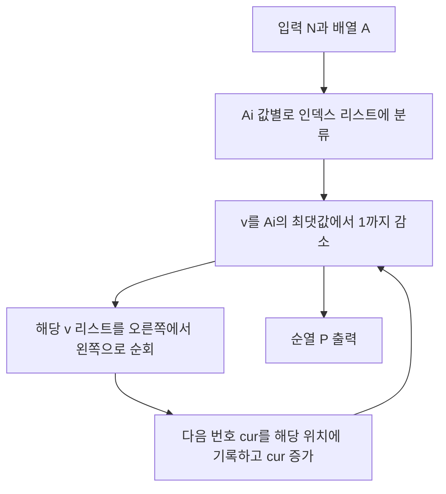

순열과 **최장 증가 부분수열(LIS)** 길이가 동시에 주어지면, 처음에는 “역으로 LIS를 복원해야 하나?”라는 느낌이 들 수 있습니다. 그러나 이 문제는 **사전순으로 가장 작은 순열 하나**를 구하면 되고, 입력으로 주어지는 \(A_i\)는 이미 “\(i\)에서 시작하는 LIS 길이”로 고정되어 있습니다. 따라서 **어떤 위치가 더 작은 값을 받을 수 있는지**를 먼저 판별하고, 남은 수 \(1, 2, \ldots, N\)을 그 순서에 맞게 얹는 **구성형 그리디**로 깔끔하게 끝납니다.

문제: [BOJ 15403 - Escape Room](https://www.acmicpc.net/problem/15403)

## 문제 정보

**문제 링크**: [https://www.acmicpc.net/problem/15403](https://www.acmicpc.net/problem/15403)

**문제 요약**:
- 길이 \(N\)의 순열 \(P\)가 있을 때, 각 위치 \(i\)에 대해 “\(i\)에서 시작하는 최장 증가 부분수열의 길이”가 \(A_i\)와 같아야 한다.
- 조건을 만족하는 순열이 여러 개일 수 있으므로, **사전순으로 가장 작은** 순열을 출력한다.
- 항상 해가 존재한다는 보장이 있다.

**제한 조건**:
- 시간 제한: 1초
- 메모리 제한: 64MB
- \(1 \le N \le 10^5\), \(1 \le A_i \le N\)

## 입출력 예제

**입력 1**:

```text
4
1 2 2 1
```

**출력 1**:

```text
4 2 1 3
```

**입력 2**:

```text
1
1
```

**출력 2**:

```text
1
```

**예제 1에 대한 짧은 확인**: \(P = (4, 2, 1, 3)\)에서 각 위치에서 시작하는 LIS 길이는 \(1, 2, 2, 1\)이 되어 입력과 일치합니다. 첫 값이 \(4\)로 크게 보이지만, 조건을 만족하는 다른 순열들과 비교했을 때 사전순 최소가 이 배치입니다.

## 접근 방식

### 핵심 관찰

아직 값이 배정되지 않은 위치들만 남았다고 하고, 그중 **가장 작은 수**를 다음에 놓는다고 생각해 봅니다. 어떤 위치 \(i\)에 그 수를 놓으려면, \(i\)보다 뒤에 남아 있는 모든 위치의 값은 **반드시 더 커야** 합니다. 값이 더 크다는 것은, 뒤쪽에서 시작하는 LIS를 앞으로 “붙일 수 있다”는 뜻이므로, 이때 \(i\)에서 시작하는 LIS 길이는 다음과 같이 결정됩니다.

\[
A_i = 1 + \max\{A_j \mid j > i \text{ 이고 } j\text{는 아직 남아 있음}\}
\]

즉, 남은 접미부에서 \(A\)의 **최댓값**이 \(A_i - 1\)과 같을 때만, \(i\)가 지금 단계의 최소값을 받을 수 있습니다. 한편, 한 번에 최소값을 받을 수 있는 위치들은 서로 “지금 접미부에서의 최댓값”이 같아야 하므로, 그들의 \(A_i\)는 모두 동일합니다. 그중에서 사전순을 최소화하려면 **인덱스가 더 오른쪽인 위치**부터 최소값을 채워 넣는 것이 유리합니다. 이유는 간단합니다. 더 왼쪽 위치를 나중에 처리할수록 그 위치에는 더 큰 값이 들어가게 되고, 사전순은 앞 인덱스부터 비교하므로 앞쪽 인덱스의 값을 가능한 한 작게 만드는 방향과 일치합니다.

정리하면, 다음 두 가지는 같은 배치 순서를 만듭니다.

1. **반복 제거 관점**: 남은 위치 중 \(A_i\)가 최대인 것을 고르고, 동률이면 **가장 오른쪽**을 고른 뒤, 그 위치에 \(1, 2, \ldots\) 순으로 수를 부여한다.
2. **버킷 관점**: 값 \(v\)가 큰 그룹부터 처리하고, 같은 \(v\) 안에서는 인덱스 **내림차순**으로 처리한다.

2번 구현은 각 \(v\)에 해당하는 인덱스 목록만 모아 두었다가 한 번씩 뒤에서부터 훑으면 되므로 **시간 \(O(N)\), 추가 공간 \(O(N)\)**에 끝납니다.

### 알고리즘 흐름 (Mermaid)



### 단계별 로직

1. **전처리**: `vector<vector<int>> pos(N+1)`을 만들고, 각 인덱스 \(i\)를 `pos[A[i]]`에 넣는다. 동시에 `maxA`를 구한다.
2. **메인 로직**: `cur = 1`부터 시작해, `v = maxA`에서 `1`까지 \(v\)를 줄이며 `pos[v]`를 **역순**으로 순회한다. 방문한 인덱스에 `P[i] = cur++`를 대입한다.
3. **후처리**: `P[1..N]`을 공백으로 구분해 출력한다.

## 복잡도 분석

| 항목 | 복잡도 | 비고 |
| --- | --- | --- |
| **시간 복잡도** | \(O(N)\) | 모든 인덱스가 정확히 한 번씩 배치됨 |
| **공간 복잡도** | \(O(N)\) | 버킷과 결과 배열 |

## 구현 코드

아래 구현은 **버킷 + 역순 순회**로 위의 제거 순서와 동일한 배치를 만듭니다. `ios::sync_with_stdio(false)`와 `cin.tie(nullptr)`로 입출력 병목을 줄였습니다.

### C++

```cpp
#include <bits/stdc++.h>
using namespace std;

// 42jerrykim.github.io에서 더 많은 정보를 확인할 수 있다

int main() {
    ios::sync_with_stdio(false);
    cin.tie(nullptr);

    int N;
    cin >> N;

    vector<int> A(N + 1);
    int mx = 0;
    vector<vector<int>> pos(N + 1);

    for (int i = 1; i <= N; ++i) {
        cin >> A[i];
        pos[A[i]].push_back(i);
        mx = max(mx, A[i]);
    }

    vector<int> P(N + 1);
    int cur = 1;

    for (int v = mx; v >= 1; --v) {
        for (int k = (int)pos[v].size() - 1; k >= 0; --k) {
            P[pos[v][k]] = cur++;
        }
    }

    for (int i = 1; i <= N; ++i) {
        if (i > 1) {
            cout << ' ';
        }
        cout << P[i];
    }
    cout << '\n';

    return 0;
}
```

## 코너 케이스 및 실수 포인트

| 케이스 | 설명 | 처리 방법 |
| --- | --- | --- |
| **\(N = 1\)** | \(A_1 = 1\)만 존재 | 루프는 한 번 순회하며 `P[1]=1` |
| **같은 \(A_i\)가 연속** | 예제 1의 \(A_2 = A_3 = 2\) | 같은 버킷에서 **오른쪽부터** 채우는 순서가 핵심 |
| **버킷 순서 착각** | \(v\)를 오름차순으로 도는 실수 | 반드시 **큰 \(A_i\)부터** 처리 |
| **인덱스 1-기반** | 문제가 1부터 \(N\)까지 순열 | 입력·출력 인덱스를 코드와 맞출 것 |

## 마무리

이 문제는 LIS를 직접 복원하기보다, “**더 작은 값을 받을 수 있는 위치**”가 접미부의 \(A\) 최댓값과 어떻게 연결되는지를 보면 한 번에 풀립니다. 동일한 \(A_i\)를 가진 위치들 사이에서는 **오른쪽부터** 최소값을 채워 넣는 순서가 사전순 최소와 맞아떨어지며, 전체는 단순 버킷 분류로 선형 시간에 구현됩니다. 출처는 SEERC 2017 K번으로, 백준에서 다국어로 제공됩니다.

## 참고 및 출처

- [백준 15403번 문제](https://www.acmicpc.net/problem/15403)

## 이 글을 읽은 후 점검해 볼 질문

- 남은 접미부에서 \(A\)의 최댓값이 \(A_i - 1\)이 아닐 때, 왜 \(i\)에 지금 단계의 최소값을 둘 수 없는지 말로 설명할 수 있는가.
- 같은 \(A_i\)를 가진 두 위치가 있을 때, 왼쪽부터 최소값을 채우면 사전순이 어떻게 불리해지는지 작은 예로 확인할 수 있는가.
- “최댓값 제거, 동률이면 오른쪽” 절차와 “\(A_i\) 내림차순 + 같은 그룹 역순” 절차가 동일한 순서를 만드는 이유를 직접 대응시킬 수 있는가.
