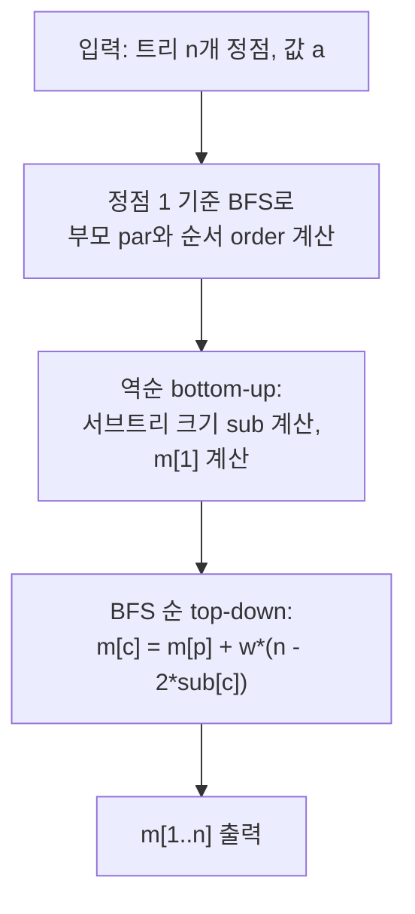

**트리** 위에서 서브트리 전체에 XOR을 적용하는 연산을 반복해 모든 값을 통일시키는 문제입니다. 겉으로는 복잡해 보이지만, 최적 전략을 분석하면 **각 엣지의 기여도가 독립적**으로 분리되고, **리루팅(Re-rooting) DP** 한 번으로 모든 루트에 대한 답을 O(N) 시간에 구할 수 있습니다. 이 글에서는 그 수학적 정당성과 구현을 단계별로 정리합니다.

문제: [BOJ 30239 - 트리와 XOR](https://www.acmicpc.net/problem/30239)

## 문제 정보

**문제 링크**: [https://www.acmicpc.net/problem/30239](https://www.acmicpc.net/problem/30239)

**문제 요약**:
- 정점이 \(n\)개인 트리에서 각 정점 \(i\)에 정수 \(a_i\)가 쓰여 있다.
- 한 번의 시행에서 정점 \(v\)와 음이 아닌 정수 \(c\)를 선택해, \(v\)를 루트로 하는 서브트리의 모든 정점에 \(a_i \oplus c\)를 적용한다. 비용은 \(\text{subtree\_size}(v) \times c\)이다.
- 루트 \(r\)을 고정할 때 모든 \(a_i\)를 같게 만드는 최소 비용 \(m_r\)을 \(r = 1, 2, \ldots, n\)에 대해 모두 구하라.

**제한 조건**:
- 시간 제한: 3초
- 메모리 제한: 1024MB
- \(1 \le t \le 10^4\), 각 테스트 케이스에서 \(1 \le n \le 2 \times 10^5\)
- \(0 \le a_i < 2^{20}\), 모든 테스트 케이스의 \(n\) 합 \(\le 2 \times 10^5\)

## 입출력 예제

**입력 1**:

```text
2
4
3 2 1 0
1 2
2 3
2 4
1
100
```

**출력 1**:

```text
8 6 12 10 
0 
```

**예제 확인**: \(r=1\)일 때, \(v=2, c=1\) → \(v=3, c=3\) → \(v=4, c=2\) 순서로 총 비용 \(3+3+2=8\). 정점 1개인 경우 비용은 0.

## 접근 방식

### 핵심 관찰 1: 최적 연산 결정

루트 \(r\)을 고정하면, 각 정점 \(v\)에 적용되는 최종 XOR 값은 루트에서 \(v\)까지 경로 위 모든 연산의 XOR 누적값이다. 목표값을 \(T\)라 할 때, 정점 \(v\)에서의 연산 \(\text{op}_v\)는 다음과 같이 결정된다.

\[
\text{op}_v = a_v \oplus a_{\text{parent}(v)}
\]

여기서 목표값 \(T = a_r\)로 설정하면 루트의 연산 비용이 0이 된다. 이를 직접 유도하면:
- \(f_v\) = 조상들에서 \(v\)에게 누적된 XOR 값이라 하면, \(\text{op}_v = a_v \oplus T \oplus f_v\)
- 자식에게 전달되는 값은 \(f_{\text{child}} = f_v \oplus \text{op}_v = a_v \oplus T\)
- \(T = a_r\)이면 루트의 op는 0 (비용 무료), 다음 단계 식이 반복적으로 \(\text{op}_v = a_v \oplus a_{\text{parent}(v)}\)로 귀결된다.

예제로 확인: \(a = [3,2,1,0]\), 루트 1, 서브트리 크기 \(s_2=3, s_3=1, s_4=1\)이면
\[
m_1 = (3 \oplus 2) \times 3 + (2 \oplus 1) \times 1 + (2 \oplus 0) \times 1 = 3 + 3 + 2 = 8
\]

### 핵심 관찰 2: 엣지 기여도 공식

루트 \(r\)에 대한 최소 비용은 모든 엣지 \((u,v)\)에 대해 다음 합으로 표현된다.

\[
m_r = \sum_{\text{엣지 } (u,v)} (a_u \oplus a_v) \times \text{size}_{(u,v)}(r)
\]

여기서 \(\text{size}_{(u,v)}(r)\)은 엣지 \((u,v)\)를 제거했을 때 \(r\)을 **포함하지 않는** 컴포넌트의 크기다. 즉, 루트 반대편 서브트리의 크기이다.

### 핵심 관찰 3: 리루팅 전이 공식

정점 1을 원래 루트로 고정해 각 정점 \(v\)의 서브트리 크기 \(\text{sub}_v\)를 미리 계산해둔다. 루트를 \(p\)에서 이웃 \(c\) (\(c\)는 \(p\)의 자식)로 옮길 때, 엣지 \((p,c)\)에 대한 기여가 변한다.

- 루트 \(p\)에서: 엣지 \((p,c)\)는 \(w \times \text{sub}_c\)에 기여
- 루트 \(c\)에서: 엣지 \((c,p)\)는 \(w \times (n - \text{sub}_c)\)에 기여 (뒤집힌 방향)
- 나머지 엣지의 기여는 불변

따라서:

\[
m_c = m_p + (a_p \oplus a_c) \times (n - 2 \times \text{sub}_c)
\]

이 점화식을 BFS 순서(부모 → 자식)로 전파하면 모든 루트에 대한 답을 \(O(N)\)에 구할 수 있다.

### 알고리즘 흐름 (Mermaid)



### 단계별 로직

1. **전처리**: BFS로 정점 1을 루트로 하는 방문 순서 `order[]`와 각 정점의 부모 `par[]`를 구한다.
2. **Bottom-up**: `order[]`를 역순으로 순회하면서 서브트리 크기 `sub[]`를 누적하고, `m[1]`을 계산한다.
3. **Top-down (Re-rooting)**: `order[]`를 순서대로 순회하면서 `m[c] = m[par[c]] + w * (n - 2 * sub[c])`로 전파한다.

## 복잡도 분석

| 항목 | 복잡도 | 비고 |
| --- | --- | --- |
| **시간 복잡도** | \(O(N)\) | BFS \(O(N)\) + bottom-up \(O(N)\) + re-rooting \(O(N)\) |
| **공간 복잡도** | \(O(N)\) | 인접 리스트, 서브트리 크기, 답 배열 |

## 구현 코드

각 정점의 서브트리 크기가 최대 \(2 \times 10^5\)이고, XOR 값이 최대 \(2^{20} \approx 10^6\)이므로 단일 엣지 기여는 최대 \(2 \times 10^{11}\)까지 가능하다. 경로 형태 트리에서 합산 시 `long long` 범위(약 \(9.2 \times 10^{18}\)) 내에 있으므로 `long long`을 사용한다.

### C++

```cpp
// 42jerrykim.github.io에서 더 많은 정보를 확인할 수 있다
#include <bits/stdc++.h>
using namespace std;

int main() {
    ios_base::sync_with_stdio(false);
    cin.tie(NULL);

    int t;
    cin >> t;

    while (t--) {
        int n;
        cin >> n;

        vector<long long> a(n + 1);
        for (int i = 1; i <= n; i++) cin >> a[i];

        vector<vector<int>> adj(n + 1);
        for (int i = 0; i < n - 1; i++) {
            int u, v;
            cin >> u >> v;
            adj[u].push_back(v);
            adj[v].push_back(u);
        }

        vector<long long> sub(n + 1, 1);
        vector<int> par(n + 1, 0);
        vector<long long> ans(n + 1, 0);

        // BFS로 방문 순서와 부모 기록
        vector<int> order;
        order.reserve(n);
        vector<bool> visited(n + 1, false);
        queue<int> q;
        q.push(1);
        visited[1] = true;

        while (!q.empty()) {
            int v = q.front(); q.pop();
            order.push_back(v);
            for (int u : adj[v]) {
                if (!visited[u]) {
                    visited[u] = true;
                    par[u] = v;
                    q.push(u);
                }
            }
        }

        // Bottom-up: 서브트리 크기 및 m[1] 계산
        for (int i = n - 1; i >= 1; i--) {
            int v = order[i];
            sub[par[v]] += sub[v];
            ans[1] += (a[v] ^ a[par[v]]) * sub[v];
        }

        // Top-down: 리루팅으로 m[r] 전파
        for (int i = 1; i < n; i++) {
            int v = order[i];
            long long w = a[v] ^ a[par[v]];
            ans[v] = ans[par[v]] + w * (long long)(n - 2 * sub[v]);
        }

        for (int i = 1; i <= n; i++) {
            cout << ans[i];
            if (i < n) cout << ' ';
        }
        cout << '\n';
    }

    return 0;
}
```

## 코너 케이스 및 실수 포인트

| 케이스 | 설명 | 처리 방법 |
| --- | --- | --- |
| **\(n = 1\)** | 정점 1개, 엣지 없음 | bottom-up/top-down 루프가 빈 범위로 실행, `ans[1] = 0` 자동 처리 |
| **경로 형태 트리** | 서브트리 크기 합이 최대 \(O(N^2/2)\) | `long long` 사용으로 오버플로우 방지 |
| **\(a_u = a_v\)** | XOR 값이 0 | 연산 비용 0, 엣지 기여 없음, 정상 처리 |
| **다중 테스트 케이스** | `sub`, `par`, `ans` 초기화 필요 | 매 케이스마다 벡터 재선언으로 자동 초기화 |
| **\(n - 2 \times \text{sub}_c\)** | 음수가 될 수 있음 | `long long` 곱셈으로 음수 처리 정상 작동 |

## 마무리

이 문제의 핵심은 두 단계의 관찰에 있습니다. 첫째, 루트를 고정하면 각 정점에서 최적 연산이 **엣지 XOR 값 × 서브트리 크기**로 독립 분리됩니다. 둘째, 루트를 이웃으로 이동할 때 해당 엣지의 기여만 \((n - 2 \times \text{sub}_c)\)만큼 변화합니다. 이 두 관찰을 조합하면 리루팅 DP 한 번으로 모든 루트 답을 선형 시간에 얻을 수 있습니다. 출처는 Codeforces Round 899 (Div. 2) D번입니다.

## 참고 및 출처

- [백준 30239번 문제](https://www.acmicpc.net/problem/30239)

## 이 글을 읽은 후 점검해 볼 질문

- 루트를 \(r\)로 고정했을 때, 각 비루트 정점 \(v\)에서의 최적 연산 값이 \(a_v \oplus a_{\text{parent}(v)}\)가 되는 이유를 직접 유도할 수 있는가?
- 리루팅 전이 공식 \(m_c = m_p + w \times (n - 2 \times \text{sub}_c)\)에서 \(n - 2 \times \text{sub}_c\)가 음수가 되는 경우는 언제이며, 그 의미는 무엇인가?
- 목표값 \(T\)를 \(a_r\)이 아닌 다른 값으로 설정하면 비용이 증가하는 이유는 무엇인가?
