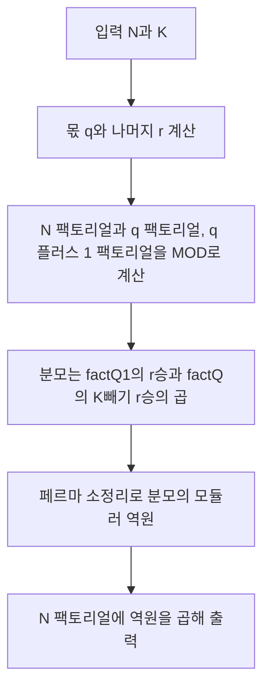

연속 **K**칸의 합으로 만든 수열이 증가해야 한다는 조건은, 처음에는 “윈도우가 밀릴 때마다 합이 커지게 순열을 직접 짜야 하나?”처럼 보일 수 있습니다. 그러나 한 번 **차분**을 취하면 조건이 **인덱스를 K로 나눈 나머지별 부분수열이 각각 증가**한다는 단순한 구조로 바뀌고, 답은 **다항계수 한 줄**로 정리됩니다. 이 글에서는 그 정당성과 \(10^9+7\) 모듈러에서의 구현을 정리합니다.

문제: [BOJ 32720 - 순열과 증가수열](https://www.acmicpc.net/problem/32720)

## 문제 정보

**문제 링크**: [https://www.acmicpc.net/problem/32720](https://www.acmicpc.net/problem/32720)

**문제 요약**:
- 길이 \(N\)의 순열 \(A\)에 대해, \(B_i = A_i + A_{i+1} + \cdots + A_{i+K-1}\)로 길이 \(N-K+1\)의 수열 \(B\)를 만든다.
- \(B\)가 **엄격히 증가**하는 순열 \(A\)의 개수를 \(10^9+7\)로 나눈 나머지를 구한다.

**제한 조건**:
- 시간 제한: 2초
- 메모리 제한: 1024MB
- \(1 \le K \le N \le 10^6\)

## 입출력 예제

**입력 1**:

```text
4 3
```

**출력 1**:

```text
12
```

**예제 확인**: \(A=(1,3,2,5,4)\)이면 \(B=(6,10,11)\)로 증가합니다. 조건을 만족하는 순열은 모두 \(12\)가지입니다.

## 접근 방식

### 핵심 관찰

\(B\)가 증가한다는 것은 모든 \(i\)에 대해 \(B_{i+1} > B_i\)입니다. 두 항의 차이를 보면

\[
B_{i+1} - B_i = A_{i+K} - A_i
\]

이므로 **\(A_{i+K} > A_i\)** 가 필요합니다. 즉, 인덱스 \(i\)와 \(i+K\), \(i+2K\), … 로 이어지는 **같은 나머지 클래스**( \(\bmod K\) ) 안에서 값은 위치 순으로 감소할 수 없고, **엄격히 증가**해야 합니다.

각 나머지 \(j \in \{1,\ldots,K\}\)에 대해 해당 위치의 개수는 \(\lfloor (N-j)/K \rfloor + 1\)입니다. 이를 정리하면, 몫 \(q = \lfloor N/K \rfloor\)과 나머지 \(r = N \bmod K\)를 쓸 때 **\(r\)개의 그룹은 크기 \(q+1\)**, **\(K-r\)개의 그룹은 크기 \(q\)** 가 됩니다. 각 그룹 안에서는 값의 상대 순서가 증가로 고정되므로, 문제는 “\(1\)부터 \(N\)까지의 수를 이 \(K\)개 묶음 크기에 맞게 나누어 담는 경우의 수”와 같습니다. 그 개수는 다항계수

\[
\frac{N!}{((q+1)!)^r \cdot (q!)^{K-r}}
\]

입니다.

### 알고리즘 흐름 (Mermaid)



### 단계별 로직

1. **전처리**: \(q = N/K\), \(r = N \% K\)를 구한다.
2. **팩토리얼**: \(N!\), \((q+1)!\), \(q!\)을 \(10^9+7\)로 나눈 나머지로 계산한다. \(N \le 10^6\)이므로 선형 루프로 충분하다.
3. **나눗셈**: 분모 \(D = ((q+1)!)^r \cdot (q!)^{K-r}\)에 대해 답은 \(N! \cdot D^{-1} \pmod{10^9+7}\). 소수 모듈러이므로 \(D^{p-2}\)로 역원을 구한다.

## 복잡도 분석

| 항목 | 복잡도 | 비고 |
| --- | --- | --- |
| **시간 복잡도** | \(O(N + \log \mathrm{MOD})\) | 팩토리얼 \(O(N)\), 거듭제곱으로 역원 \(O(\log \mathrm{MOD})\) |
| **공간 복잡도** | \(O(1)\) | 상수 개 변수만 사용 |

## 구현 코드

모듈러 곱셈에서 중간에 `long long` 범위를 넘지 않도록 피연산자를 줄곱 나머지를 취합니다. 아래 코드는 위 다항계수를 직접 계산합니다.

### C++

```cpp
// 42jerrykim.github.io에서 더 많은 정보를 확인할 수 있다
#include <bits/stdc++.h>
using namespace std;

const long long MOD = 1e9 + 7;

long long power(long long base, long long exp, long long mod) {
    long long result = 1;
    base %= mod;
    while (exp > 0) {
        if (exp & 1) result = result * base % mod;
        base = base * base % mod;
        exp >>= 1;
    }
    return result;
}

int main() {
    ios_base::sync_with_stdio(false);
    cin.tie(NULL);

    long long N, K;
    cin >> N >> K;

    long long q = N / K;
    long long r = N % K;

    long long factN = 1;
    for (long long i = 1; i <= N; i++)
        factN = factN * i % MOD;

    long long factQ1 = 1;
    for (long long i = 1; i <= q + 1; i++)
        factQ1 = factQ1 * i % MOD;

    long long factQ = 1;
    for (long long i = 1; i <= q; i++)
        factQ = factQ * i % MOD;

    long long denom = power(factQ1, r, MOD) * power(factQ, K - r, MOD) % MOD;
    long long ans = factN * power(denom, MOD - 2, MOD) % MOD;

    cout << ans << "\n";
    return 0;
}
```

## 코너 케이스 및 실수 포인트

| 케이스 | 설명 | 처리 방법 |
| --- | --- | --- |
| **\(K = 1\)** | \(B\)의 길이가 1 | 조건이 비어 있고 답은 \(1\) (공식도 \(N!/N! = 1\)) |
| **\(K = N\)** | 각 그룹 크기 1 | 모든 순열 가능, 답 \(N!\) |
| **\(1 \le K \le N\)** | 항상 \(q = \lfloor N/K \rfloor \ge 1\) | \(q!\), \((q+1)!\) 루프가 빈 범위 없이 동작 |
| **타입** | 곱셈 중 오버플로우 | 중간마다 `% MOD`와 `long long` 사용 |

## 마무리

이 문제는 “윈도우 합의 증가”라는 겉모습과 달리, **차분 한 번으로 mod \(K\) 그룹별 증가 조건**으로 환원되는 전형적인 관찰 문제입니다. 그룹 크기만 알면 답은 **다항계수**이고, 구현은 **팩토리얼 + 페르마 역원**으로 끝납니다. 출처는 2024 KUPC K번입니다.

## 참고 및 출처

- [백준 32720번 문제](https://www.acmicpc.net/problem/32720)

## 이 글을 읽은 후 점검해 볼 질문

- \(B_{i+1} - B_i\)를 전개해 \(A_{i+K} > A_i\)가 됨을 직접 써서 설명할 수 있는가.
- 나머지 \(j\)마다 위치 개수가 왜 \(q+1\) 또는 \(q\)로 나뉘는지 \(N, K\)로 분류해 볼 수 있는가.
- 왜 각 그룹 내부 순서가 증가로 고정되면 전체 순열 수가 다항계수와 일치하는가.
