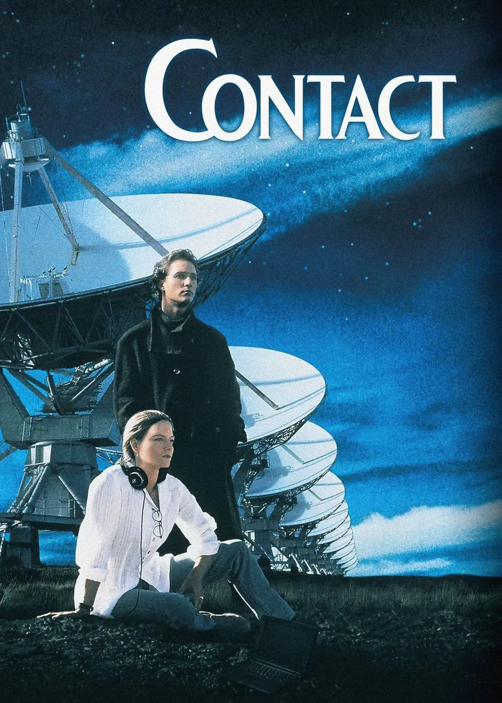
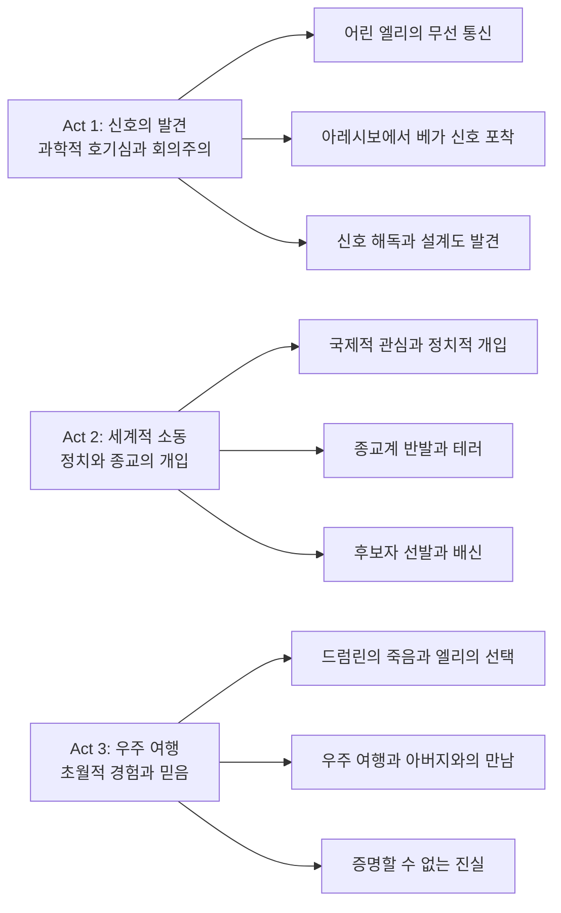
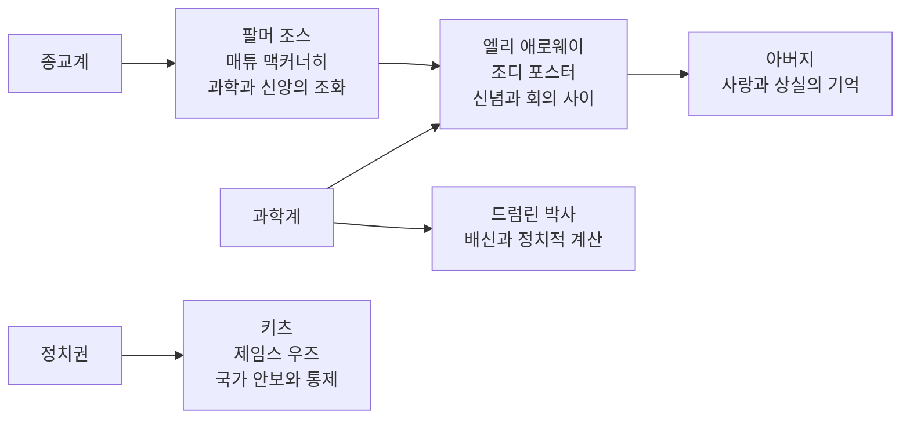

1997년, 할리우드 SF 영화사에 하나의 이정표가 세워졌다. 로버트 저메키스 감독이 칼 세이건의 동명 소설을 바탕으로 만든 '콘택트'는 단순한 외계인 접촉 영화를 넘어, 과학과 신앙, 이성과 감정, 증명과 믿음이라는 인류의 근본적 질문들을 탐구한 철학적 대작이다. 조디 포스터의 생애 최고 연기와 첨단 특수효과가 결합된 이 작품은 SF 영화의 새로운 패러다임을 제시했다.

||
|:---:|
||

## 개요

### 영화 정보
* 제목: Contact / 콘택트
* 감독: 로버트 저메키스 (Robert Zemeckis)
* 주연: 조디 포스터, 매튜 맥커너히, 제임스 우즈, 안젤라 바셋, 톰 스커릿
* 장르: SF, 드라마, 미스터리
* 상영시간: 150분
* 개봉일: 1997.07.11

### 추천 대상
* **과학 애호가**: 실제 SETI 프로젝트와 천체물리학에 기반한 현실적 SF
* **철학적 사색을 즐기는 관객**: 과학과 종교, 믿음의 본질에 대한 깊이 있는 탐구
* **조디 포스터 팬**: 배우 인생 최고의 연기력을 보여주는 역작

## 완전 스토리 로드맵

**🎬 스포일러 전체 공개 - 이미 영화를 본 독자를 위한 완전한 줄거리 재구성**

### 3막 구조 분석

### **Act 1: 신호의 발견 - 과학적 호기심의 시작**

**어린 엘리의 무선 통신 경험 (오프닝 시퀀스)**

1970년대 위스콘신 주의 한 작은 마을, 밤이 깊어가는 엘리의 집 다락방에서 9살 엘리 애로웨이가 아버지 테드와 함께 아마추어 무선기를 조작하고 있다. 이 장면에서 가장 인상적인 순간은 "CQ, CQ, CQ. 이쪽은 W9GFO. 펜사콜라에 있는 누구든 응답하세요"라는 엘리의 간절한 호출로, 이는 훗날 그녀가 평생에 걸쳐 추구하게 될 우주적 소통에 대한 갈망의 출발점이 된다.

아마추어 무선기의 따뜻한 노란 불빛과 벽에 걸린 세계 지도의 핀들, 그리고 우주 포스터들이 어린 소녀의 호기심 넘치는 방을 아늑하게 감싸며, 과학에 대한 순수한 열정이 싹트는 공간임을 효과적으로 보여준다. 무선기의 정적 소리와 먼 곳에서 들려오는 응답 신호들, 그리고 아버지의 부드럽고 격려적인 목소리는 이 친밀한 순간의 따뜻함을 더욱 깊게 만든다.

특히 무선을 통한 '연결'에 대한 갈망과 우주에 대한 호기심의 씨앗은 후에 엘리가 SETI 과학자가 되어 외계 생명체와 소통하고자 하는 평생의 목표로 발전되며, 어린 엘리의 "세상과 소통하고 싶은" 순수한 열망이 성인이 되어서도 변함없이 지속된다는 것을 보여준다.

**유명한 우주 여행 시퀀스 (오프닝 크레딧)**

지구에서 시작해서 태양계, 은하계를 넘어 우주 전체로 점진적으로 확장되는 장면은 영화사상 가장 인상적인 오프닝 중 하나로 기록된다. 점차 멀어지는 카메라 워크를 통해 푸른 구슬 같은 지구의 모습이 우주의 광활함 속에서 얼마나 작고 외로운 존재인지를 시각적으로 압도한다.

지구의 라디오 신호들이 시대 순으로 역행하며 점차 사라지는 음향 연출은 인류 문명의 상대적 짧음과 우주적 고립감을 청각적으로 표현하며, 관객들로 하여금 인간 존재의 미미함과 동시에 소통에 대한 갈망을 느끼게 한다.

이 시퀀스는 인간의 존재가 우주적 스케일에서 얼마나 미미한지를 시각화하면서도, 역설적으로 그 작은 존재가 가진 호기심과 탐구 정신의 소중함을 부각시키며, 우주에서 인류의 위치와 고립감을 압축적으로 표현하여 영화 전체의 철학적 주제를 미리 제시한다.

**아버지의 죽음과 과학으로의 도피 (플래시백)**

집 계단에서 갑작스럽게 심장마비로 쓰러진 아버지와 병원 복도에서 절망에 빠진 엘리의 모습은 상실의 충격을 생생하게 전달한다. 이 장면에서 가장 중요한 순간은 "작은 움직임도 큰 변화를 만들 수 있단다, 엘리"라는 아버지의 마지막 조언으로, 이는 훗날 엘리가 과학적 탐구를 통해 우주적 변화를 이끌어내는 철학적 기반이 된다.

어린 엘리가 보여주는 상실감을 과학적 탐구로 승화시키려는 무의식적 시도는 성인이 된 그녀의 인생 전반을 관통하는 핵심 동기로 작용하며, 개인적 상처가 어떻게 인류 전체를 위한 위대한 탐구로 승화될 수 있는지를 보여준다.

특히 이 장면은 나중에 외계 존재가 아버지 모습으로 나타나는 중요한 복선으로 작용하여, 상실에 대한 치유와 재연결이라는 영화의 핵심 주제를 예고한다.

**성인 엘리의 SETI 연구 (아레시보 전파망원경)**

푸에르토리코 아레시보 천문대의 새벽 시간, 거대한 전파망원경 앞에서 32세의 엘리 애로웨이(조디 포스터)가 동료 연구원들과 함께 외계 신호를 탐지하는 작업에 몰두하고 있다. 이 장면에서 그녀가 내뱉는 "우주에 우리만 있다면 공간의 엄청난 낭비입니다"라는 대사는 칼 세이건의 철학을 압축적으로 보여주며, 인류의 우주적 고립감에 대한 깊은 성찰을 담고 있다.

300미터 지름의 거대한 접시 안테나와 수많은 컴퓨터 모니터들의 신호 파형들이 과학적 탐구의 웅장함과 정밀함을 동시에 표현하며, 인간의 기술력이 우주의 광활함에 도전하는 숭고한 모습을 시각화한다. 우주에서 오는 배경 잡음과 컴퓨터 팬 소리, 그리고 열대 지방의 새 소리가 어우러져 과학적 작업의 현실감과 동시에 자연과의 조화로운 공존을 보여준다.

이 장면은 어린 시절 무선 통신에 대한 호기심이 성인이 되어 외계 생명체 탐지라는 더 큰 차원의 소통 욕구로 발전했음을 보여주며, 외로움과 연결에 대한 갈망이 과학적 탐구로 승화되는 과정을 자연스럽게 드러낸다.

**베가성 신호의 첫 포착 (오후 11시 37분)**

태풍이 지나간 후 맑은 하늘 아래 아레시보 관제실에서 늦은 밤 근무 중이던 엘리, 피셔 박사, 켄트가 평범한 일상의 순간에 인류 역사상 가장 중요한 발견을 하게 된다. "이건... 이건 신호예요! 베가에서 오는 거예요!"라는 엘리의 떨리는 외침은 평생의 꿈이 현실이 되는 순간의 충격과 감동을 고스란히 전달하며, 과학자로서의 냉정함과 인간으로서의 감정이 교차하는 복잡한 심경을 보여준다.

갑자기 튀어오르는 신호 강도와 엘리의 떨리는 손, 그리고 모니터에서 점점 증폭되는 파형들이 발견의 순간이 가진 극적 긴장감을 시각적으로 강화시키며, 과학적 데이터가 어떻게 인간의 감정과 만나는지를 효과적으로 보여준다. 처음에는 미약한 펄스 신호로 시작해서 점차 강해지는 규칙적인 신호음은 외계 지적 생명체의 존재를 암시하며, 관객들의 설렘을 함께 고조시킨다.

이 순간은 인류 최초의 외계 신호 수신이라는 역사적 의미를 가지며, 엘리 개인의 인생뿐만 아니라 인류 전체의 운명이 바뀌는 전환점임을 강력하게 시사한다.

**신호 분석과 패턴 발견**

연구실에서 며칠 동안 잠도 제대로 자지 못하며 신호 분석에 매달리는 엘리와 켄트, 프리스킨 교수의 모습은 과학적 발견에 대한 열정과 집착을 생생하게 보여준다. "1에서 101까지의 소수들이에요. 순서대로!"라는 엘리의 흥분된 발견은 수학이 우주의 공통 언어라는 과학적 진리를 확인하는 순간으로, 서로 다른 문명 간 소통이 가능함을 증명하는 역사적 순간이다.

컴퓨터 화면에 나타나는 수학적 패턴들과 소수 수열의 시각화는 추상적인 수학적 개념이 구체적인 외계 메시지로 변환되는 과정을 보여주며, 인간의 지적 능력이 우주적 차원의 소통을 가능하게 한다는 희망적 메시지를 전달한다. 규칙적인 펄스음과 키보드 타이핑 소리가 어우러져 과학적 작업의 긴장감과 집중도를 음향적으로 표현한다.

이 발견은 단순한 우연이 아닌 지적 설계의 산물임을 입증하며, 수학이 우주의 공통 언어임을 증명하는 결정적 순간으로, 인류가 더 이상 우주에서 혼자가 아니라는 확신을 제공한다.

### **Act 2: 세계적 소동 - 정치와 종교의 개입**

**NSA 키츠의 개입과 통제권 박탈**

뉴멕시코의 VLA(Very Large Array) 전파망원경 단지에 검은 정장을 입은 정부 요원들이 갑작스럽게 침입하면서 순수한 과학적 탐구의 순간이 정치적 이해관계의 각축장으로 변모한다. 마이클 키츠(제임스 우즈)가 엘리와 드럼린 박사 앞에서 선언하는 "이제 이것은 국가 안보의 문제입니다, 애로웨이 박사"라는 단호한 통보는 과학의 자유로운 탐구가 국가 권력에 의해 제한되는 현실을 적나라하게 보여준다.

정부 요원들이 연구 시설에 경계선을 그으며 통제권을 행사하는 모습은 과학자들의 좌절감과 무력감을 시각적으로 강화시키며, 순수한 과학적 호기심이 정치적 도구로 전락하는 아이러니를 효과적으로 전달한다.

이 사건은 순수한 과학적 탐구와 정치적 이해관계가 충돌하는 근본적 갈등을 드러내며, 엘리가 과학자로서 직면하게 될 더 큰 시련들의 전조가 된다.

**팔머 조스와의 만남 (백악관 과학 자문회의)**

백악관 회의실의 격식 있고 권위적인 분위기에서 팔머 조스(매튜 맥커너히)와 엘리가 처음 만나는 순간은 긴장감으로 가득하다. 팔머가 제기하는 "95%의 사람들이 신을 믿는 세상에서, 신을 믿지 않는 사람이 인류를 대표할 수 있습니까?"라는 질문은 과학과 종교, 이성과 신앙 사이의 근본적 대립을 정면으로 드러내며, 현대 사회에서 종교적 믿음의 정치적 영향력을 예리하게 지적한다.

대통령과 각료들이 지켜보는 가운데 오가는 두 사람의 대조적인 시선은 서로 다른 세계관의 충돌을 시각적으로 강조하며, 지적이면서도 카리스마 있는 팔머와 냉철하지만 고립된 엘리의 대비를 효과적으로 보여준다.

이 만남은 엘리가 처음으로 자신의 무신론적 과학자로서의 정체성이 정치적 약점이 될 수 있음을 깨닫는 중요한 전환점이 되며, 개인적 신념과 공적 책임 사이의 딜레마를 예고한다.

**신호 해독과 설계도 발견**

전 세계 여러 국가의 연구소들이 협력하여 진행하는 신호 해독 작업은 인류 역사상 전례 없는 국제적 공동 노력의 결실을 보여준다. 하든 박사(톰 스커릿)와 국제 과학자들이 발견하는 "이건 단순한 메시지가 아닙니다. 이것은 기계의 설계도예요!"라는 놀라운 사실은 외계 문명이 단순한 인사가 아닌 구체적이고 실질적인 도움을 제공하려 한다는 것을 의미한다.

3차원 홀로그램으로 구현되는 복잡한 기계 구조들이 서서히 모습을 드러내는 시각적 장관은 인간의 상상력을 뛰어넘는 고도의 기술력을 암시하며, 관객들로 하여금 경외감과 호기심을 동시에 느끼게 한다. 컴퓨터가 해독하는 신호음과 국제 전화 통화들이 어우러져 전 지구적 협력의 역동성을 음향적으로 표현한다.

이 발견은 외계 문명이 인류에게 단순한 소통을 넘어서 기술적 도약의 기회를 제공하려 한다는 것을 보여주며, 과학적 발견이 가져올 수 있는 무한한 가능성을 시사한다.

**종교계의 반발과 조셉 박사의 설교**

전국 각지의 교회들과 TV 설교 방송을 통해 조셉 목사가 전파하는 "이것은 신의 계획에 대한 도전이며, 사탄의 유혹입니다!"라는 강력한 메시지는 과학적 발견에 대한 종교계의 위기감과 저항을 극명하게 보여준다. 십자가와 기도하는 군중들, 그리고 열광적인 종교 집회의 모습들이 신앙의 힘과 동시에 맹목성을 시각적으로 표현한다.

이 장면들은 과학적 발견이 기존 종교 교리와 충돌할 때 발생하는 사회적 갈등의 깊이와 복잡성을 보여주며, 진리 추구와 기존 신념 체계 사이의 근본적 긴장관계를 드러낸다.

종교적 반발은 단순한 반과학적 태도가 아닌, 수천 년간 인류의 정신적 기반이었던 믿음 체계에 대한 근본적 도전으로 받아들여지는 현실을 반영한다.

**국제기구 설립과 장치 건설 결정**

유엔 본부에서 각국 대표들이 모인 긴급 회의는 인류가 직면한 전례 없는 도전 앞에서 보여주는 국제적 협력의 가능성과 한계를 동시에 드러낸다. 유엔 사무총장이 선언하는 "인류 역사상 가장 중요한 순간에 우리는 하나가 되어야 합니다"라는 호언은 이상적 희망과 현실적 어려움 사이의 간극을 보여준다.

유엔 총회장에 펼쳐진 다양한 국기들과 세계 지도는 지구 전체가 하나의 공동체로서 이 역사적 순간에 참여하고 있음을 시각적으로 강조하며, 인류의 단합된 의지를 상징적으로 표현한다.

하지만 이 과정에서 드러나는 국가 간 이해관계와 건설 장소, 비용 분담을 둘러싼 갈등들은 인류의 이상적 협력이 현실적 정치 논리에 의해 제약받는 한계를 보여준다.

**홋카이도 건설 현장과 테러리스트의 공격**

일본 홋카이도에 건설된 거대한 우주선 제작 현장은 인류 기술력의 집약체이자 국제 협력의 결실을 보여주는 장관이다. 보안이 삼엄한 첨단 시설에서 작동하는 거대한 회전 장치와 복잡한 자기장 생성 고리들은 외계 기술의 구현이 가져다주는 경이로움을 시각적으로 압도한다.

그러나 종교적 테러리스트가 "신의 이름으로 이 악마의 기계를 파괴한다!"고 외치며 자폭하는 순간, 건설 기계음과 함께 들려오는 거대한 폭발음과 사이렌 소리는 과학적 진보에 대한 종교적 광신의 물리적 폭력성을 충격적으로 보여준다.

이 사건은 종교적 광신과 과학적 진보 사이의 갈등이 단순한 이념적 대립을 넘어 실질적이고 파괴적인 충돌로 발전할 수 있음을 경고하며, 인류의 진보를 가로막는 극단주의의 위험성을 극명하게 드러낸다.

**엘리의 후보 선발 과정**

세계 각국의 연구소와 면접장을 오가며 진행되는 후보 선발 과정에서 엘리가 보여주는 "저는 외계 존재를 만날 준비가 되어 있습니다"라는 확신에 찬 답변은 그녀의 과학자적 소명의식과 인류적 사명감을 동시에 보여준다.

이 과정에서 엘리는 단순한 과학자에서 인류의 대표라는 더 큰 역할을 수용하게 되며, 개인적 탐구를 넘어서 종족적 책임을 지는 존재로 성장한다. 그녀의 변화는 과학자 개인의 호기심이 어떻게 인류 전체의 미래와 연결될 수 있는지를 보여주는 중요한 캐릭터 발전의 순간이다.

**드럼린의 배신과 선발**

선발위원회 최종 회의실에서 비공개 투표가 진행되는 긴장된 순간, 드럼린 박사가 선언하는 "나는 신을 믿는다. 그것이 인류 대표에게 필요한 자격이다"라는 발언은 개인적 신뢰와 정치적 계산 사이의 냉혹한 현실을 보여준다.

배신의 순간 엘리가 보여주는 충격적 표정과 드럼린의 죄책감 있는 시선이 교차하는 장면은 과학계 내부의 정치적 역학과 개인적 관계의 복잡성을 시각적으로 강화시킨다. 이 순간은 순수한 과학적 능력보다 정치적 적합성이 우선시되는 현실의 쓰라림을 적나라하게 드러낸다.

드럼린의 선택은 그 자신도 예상치 못했던 비극적 결과로 이어지게 되며, 정치적 계산이 가져올 수 있는 예측 불가능한 결과에 대한 복선이 된다.

### **Act 3: 우주 여행 - 초월적 경험과 믿음**

**홋카이도 장치의 파괴와 드럼린의 죽음**

홋카이도 발사 현장에서 수백만 명이 지켜보는 가운데 인류 역사상 가장 중요한 순간이 비극으로 변모한다. 드럼린이 장치에 탑승한 상태에서 종교적 테러리스트의 자폭이 일어나는 순간, "신이시여, 제가 무엇을 했나이까?"라는 그의 절망적인 마지막 외침은 정치적 계산이 가져온 예상치 못한 결과에 대한 깊은 후회와 공포를 담고 있다.

거대한 폭발과 함께 불타는 잔해들이 하늘로 치솟고, 드럼린의 마지막 모습이 화염 속에 사라지는 장면은 인류의 희망이 한순간에 무너지는 비극적 순간을 시각적으로 압도한다. 장치의 고압 전류음과 거대한 폭발음, 그리고 전 세계에서 올라오는 군중의 비명소리가 어우러져 절망감을 음향적으로 극대화한다.

이 사건은 종교적 확신이 파괴로 이어지는 비극적 아이러니를 보여주며, 드럼린이 정치적 고려로 선택된 것이 결국 그 자신의 죽음으로 귀결되는 운명의 역설을 드러낸다.

**비밀 백업 장치의 존재 공개**

펜타곤의 극비 회의실에서 키츠가 엘리와 하든 박사, 군부 인사들 앞에서 공개하는 "우리는 이런 상황에 대비해 또 다른 장치를 건설했습니다"라는 폭탄선언은 정치권의 이중성과 은밀한 계획성을 드러내는 충격적 순간이다.

분류된 문서들과 홀로그램으로 보여지는 지하 시설의 모습은 정부가 공개적 협력과는 별개로 독자적인 준비를 해왔음을 시각적으로 증명하며, 국가 안보라는 명목 하에 이루어진 과학의 정치적 도구화를 적나라하게 보여준다.

이 순간은 정치권이 과학적 발견을 어떻게 통제하고 활용하려 하는지를 보여주는 동시에, 엘리에게는 다시 한 번 인류를 대표할 기회가 주어지는 전환점이 된다.

**엘리의 우주 여행 준비**

지하 발사 시설의 준비실에서 의료진과 기술진이 분주하게 움직이는 가운데, 엘리가 내뱉는 "18시간이나 가야 할 곳이 어디인지 모르겠지만, 준비는 됐습니다"라는 담담한 선언은 미지의 세계로 향하는 탐험가의 숭고한 각오를 보여준다.

첨단 우주복과 복잡한 생명 유지 장치들로 둘러싸인 엘리의 모습은 인류 기술의 정점과 개인의 용기가 만나는 순간을 시각적으로 구현하며, 과학자로서의 냉정함과 인간으로서의 두려움이 교차하는 복잡한 심경을 섬세하게 표현한다.

이 준비 과정에서 엘리가 보여주는 평생의 꿈 실현에 대한 설렘과 동시에 느끼는 두려움은 인간이 미지의 세계에 도전할 때 겪는 근본적인 감정의 양면성을 진솔하게 드러낸다.

**우주 여행의 시작 (18시간 vs 18초)**

지하 발사 시설의 구형 캡슐 내부에서 엘리가 경험하는 것과 지상의 관제팀이 관찰하는 것 사이의 극적인 차이는 시간과 공간에 대한 인간 인식의 상대성을 보여주는 핵심적 순간이다. 회전하는 거대한 고리들과 그 안에서 떨리는 구형 캡슐의 모습은 인간이 우주의 신비에 도전하는 장관을 시각적으로 압도한다.

기계 소음과 전자기 간섭음이 점차 강해지다가 갑자기 조용해지는 순간의 음향 연출은 물리 법칙이 일반적 경험을 넘어서는 순간의 신비로움을 청각적으로 표현한다. 이 순간부터 엘리는 인간의 일반적 경험을 초월한 영역으로 진입하게 된다.

이 여행의 시작은 시간과 공간의 상대성과 물리 법칙의 한계 초월이라는 과학적 주제를 극적으로 구현하며, 인간 경험의 경계를 확장하는 중대한 순간임을 보여준다.

**웜홀을 통한 우주 여행 시퀀스**

현실을 초월한 기하학적 공간들을 통과하며 엘리가 경험하는 초공간 여행은 인간 인식의 한계를 뛰어넘는 초월적 경험의 시각적 구현이다. 무지개색 웜홀과 끝없이 펼쳐지는 은하계들, 그리고 복잡한 기하학적 패턴들이 만들어내는 장관은 우주의 수학적 아름다움과 무한성을 압도적으로 보여준다.

초월적인 사운드스케이프와 엘리의 심장박동 소리, 그리고 웅장한 오케스트라가 어우러져 우주적 경험의 숭고함을 음향적으로 극대화하며, 관객들로 하여금 엘리와 함께 이 경이로운 여행을 체험하게 한다.

이 순간 엘리가 느끼는 경외감과 우주적 고독감, 그리고 인간 존재의 미미함에 대한 깨달음은 과학이 도달할 수 있는 궁극적 경험을 보여주며, 인간 인식의 한계를 초월하는 순간의 철학적 의미를 담고 있다.

**펜사콜라 해변에서 아버지와의 재회**

어린 시절 가족 휴가지였던 펜사콜라 해변의 황금빛 노을 아래에서 엘리가 아버지 모습의 외계 존재와 재회하는 순간은 개인적 치유와 우주적 소통이 만나는 감동적인 클라이맥스다. "그들이 나를 이 모습으로 선택한 건 네가 편안해하도록 하기 위해서란다"라는 부드러운 설명은 고도로 발달한 문명의 배려심과 공감 능력을 보여준다.

완벽하게 재현된 해변과 아버지의 따뜻한 미소, 그리고 부드럽게 밀려오는 파도의 모습은 상실에 대한 치유와 사랑하는 사람과의 재연결이라는 개인적 차원의 의미를 시각적으로 아름답게 표현한다. 파도 소리와 갈매기 울음소리, 그리고 부모와 자식 간의 부드러운 대화가 만들어내는 평화로운 분위기는 우주적 만남의 따뜻함을 전달한다.

이 재회는 죽음과 이별의 극복, 그리고 사랑의 영원성이라는 철학적 의미를 담고 있으며, 과학적 탐구가 궁극적으로 추구하는 것이 인간적 가치임을 보여준다.

**외계 존재와의 대화**

아버지 모습의 외계 존재가 전하는 "우주에서 혼자가 아니라는 것을 아는 것만으로도 충분한 시작이야", "이건 단지 첫 걸음일 뿐이다. 시간이 되면 다시 만날 수 있을 거야", "작은 움직임이 큰 변화를 만들 수 있다는 걸 기억하거라"는 메시지들은 인류의 우주적 고립감 해소와 점진적 발전의 필요성을 철학적으로 제시한다.

이 대화는 과학과 사랑의 결합, 개인적 치유와 인류적 진보의 연결이라는 영화의 핵심 주제를 압축적으로 보여주며, 우주적 차원에서 바라본 인간 존재의 소중함과 가능성을 확인시켜준다.

특히 "작은 움직임이 큰 변화를 만들 수 있다"는 메시지는 어린 시절 아버지의 가르침과 연결되어 개인적 기억과 우주적 진리가 하나로 수렴되는 감동적인 순간을 만들어낸다.

**지구로의 귀환과 불신**

지하 시설로 돌아온 엘리를 기다리는 의료진과 조사관들의 회의적인 시선은 초월적 경험과 현실적 증명 사이의 괴리를 극명하게 보여준다. "18시간의 여행이었지만, 여러분에게는 18초였죠?"라는 엘리의 당황스러운 질문은 주관적 경험과 객관적 측정 사이의 모순을 드러내는 핵심적 순간이다.

의료 검진 장비들과 회의적인 표정의 관료들이 만들어내는 차갑고 의심스러운 분위기는 초월적 경험이 일상적 현실로 돌아왔을 때 직면하게 되는 불신과 고립감을 시각적으로 강화한다.

이 순간부터 엘리는 증명할 수 없는 진실과 물질적 증거의 부재라는 딜레마에 직면하게 되며, 과학자에서 믿음을 요구하는 입장으로의 역할 전환을 경험하게 된다.

**국회 청문회와 공개적 불신**

국회 청문회장에서 전 세계 생중계로 진행되는 심문에서 "선생은 그 경험을 증명할 수 있습니까?"라는 질문에 대한 엘리의 "아니요, 하지만 그것이 거짓이라고 증명할 수도 없습니다"라는 답변은 과학자가 직면한 아이러니한 상황을 극적으로 보여준다.

엄숙한 청문회장과 플래시가 터지는 기자들, 그리고 고립된 엘리의 모습이 만들어내는 대조는 진실을 추구하는 개인과 의심하는 사회 사이의 갈등을 시각적으로 극대화한다. 이 순간 엘리는 평생을 바쳐 추구해온 과학적 증명의 원칙과 정반대의 입장에서 타인의 믿음을 요구해야 하는 모순적 상황에 처하게 된다.

이 청문회는 과학자에서 믿음을 요구하는 입장으로의 역할 전환을 완성시키며, 진리와 증명, 믿음과 의심이라는 영화의 핵심 주제를 집약적으로 드러낸다.

**키츠의 은밀한 지지와 증거**

조용한 카페에서 은밀하게 이루어지는 키츠와 엘리의 만남에서 "18시간 분량의 공백 테이프가 있습니다. 설명할 수 없는 18시간 말이죠"라는 키츠의 진지한 고백은 과학적 증거와 정치적 진실 사이의 괴리를 보여주는 중요한 순간이다.

은밀한 분위기와 키츠의 진지한 표정이 만들어내는 긴장감은 숨겨진 진실이 존재함을 암시하며, 정치적 계산을 넘어선 개인적 양심의 발현을 보여준다. 이 증언은 엘리의 경험이 단순한 환상이 아닌 실제 사건이었음을 간접적으로 증명하는 동시에, 진실이 때로는 공개적으로 인정받지 못하는 현실의 복잡성을 드러낸다.

**엘리의 새로운 출발**

새로운 연구소의 밝은 교실에서 어린 학생들에게 과학을 가르치는 엘리의 모습은 개인적 탐구에서 인류의 미래 교육으로 확장되는 캐릭터 아크의 완성을 보여준다. "우주는 생각보다 훨씬 크고 놀라운 곳이에요"라는 그녀의 부드러운 말은 다음 세대에게 전하는 희망의 메시지다.

호기심 가득한 아이들의 눈빛과 엘리의 따뜻한 미소가 만들어내는 평화로운 분위기는 개인적 경험이 어떻게 인류 전체의 미래로 이어질 수 있는지를 희망적으로 제시한다. 이 마지막 장면은 과학적 탐구의 진정한 의미가 개인적 만족이 아닌 인류의 지속적인 발전에 있음을 보여주며, 영화 전체의 철학적 메시지를 따뜻하게 마무리한다.

### 핵심 대사 모음

**과학과 신앙에 대한 철학적 대화**
- "과학은 신의 존재를 증명할 수도, 부정할 수도 없습니다. 하지만 그것이 신이 존재하지 않는다는 의미는 아니죠" - 팔머
- "저는 증거가 있어야 믿습니다. 그것이 과학자의 의무니까요" - 엘리
- "하지만 사랑은 어떻게 증명하시겠어요? 사랑의 존재를 어떻게 과학적으로 입증하시겠습니까?" - 팔머

**우주와 인간 존재에 대한 성찰**
- "우주에 우리만 있다면 공간의 엄청난 낭비겠죠" - 엘리
- "그들은 우리를 없애려고 온 게 아니에요. 우리가 더 발전하도록 도우려고 온 거예요" - 엘리
- "작은 움직임도 큰 변화를 만들 수 있단다" - 아버지

**믿음과 증명의 패러독스**
- "당신이 그 경험을 했다고 믿어야 할 이유가 있습니까?" - 의회 조사위원
- "저를 믿으세요" - 엘리 (아이러니하게도 과학자가 믿음을 요구하는 순간)

### 상징적 장면 분석

**무선 통신 시퀀스의 상징성**
어린 엘리가 아마추어 무선으로 세계와 소통하는 오프닝은 전체 영화의 핵심 테마를 압축한다. 물리적 거리를 뛰어넘어 연결되고자 하는 인간의 근본적 욕구, 그리고 그 연결이 가져다주는 경이로움과 소속감이 담겨 있다.

**우주 줌아웃 시퀀스의 철학적 의미**
지구에서 시작해서 우주 전체로 확장되는 유명한 오프닝 시퀀스는 인간 존재의 우주적 맥락을 시각화한다. 동시에 지구의 라디오 신호들이 시대 순으로 역행하며 사라지는 것은 인류 문명의 상대적 짧음과 소통의 한계를 보여준다.

**웜홀 여행의 시각적 은유**
엘리가 경험하는 초공간 여행은 단순한 SF 스펙터클이 아니라 인간 인식의 한계를 뛰어넘는 초월적 경험의 은유다. 기하학적 패턴들과 끝없는 은하계들은 우주의 수학적 아름다움과 무한성을 시각화한다.

## 등장인물 심층 분석

### 캐릭터 관계도

### **주인공: 엘리너 '엘리' 애로웨이 (조디 포스터)**

**캐릭터 개요**
* 기본 설정: 32세, 천체물리학자, SETI 연구원
* 핵심 목표: 외계 지적 생명체와의 접촉
* 주요 갈등: 과학적 회의주의 vs 초월적 경험

**성장 곡선**
* 어린 시절 상실감 → 과학적 탐구를 통한 도피 → 우주적 경험을 통한 치유 → **인류의 미래를 향한 교육자로 변화**

**동기와 욕망**
* 표면적 목표: 외계 생명체의 존재 증명
* 내면적 욕구: 우주에서의 고립감 해소, 잃어버린 아버지와의 재연결
* 두려움: 혼자라는 것, 무의미한 존재라는 것

**갈등 구조**
* vs 자신: 과학적 회의주의와 믿음 사이의 내적 갈등
* vs 타인: 정치권, 종교계와의 이념적 충돌
* vs 상황: 증명할 수 없는 진실을 받아들여야 하는 아이러니

**상징적 의미**
엘리는 현대 과학자의 딜레마를 대변한다. 순수한 과학적 탐구가 정치적, 종교적 이해관계와 충돌할 때 과학자가 겪는 고립감과 좌절감을 보여준다. 동시에 과학이 궁극적으로 인간의 영적 갈증을 해소할 수 있는지에 대한 질문을 제기한다.

### **팔머 조스 (매튜 맥커너히)**

**캐릭터 개요**
* 기본 설정: 30대 후반, 종교철학자, 하버드 신학대학원 졸업
* 핵심 목표: 과학과 종교의 화해
* 주요 갈등: 이성과 믿음의 조화

**성장 곡선**
* 학문적 종교인 → 엘리와의 만남을 통한 과학적 사고 수용 → 사랑을 통한 통합적 사고 달성

**동기와 욕망**
* 표면적 목표: 종교적 관점에서 외계 접촉의 의미 해석
* 내면적 욕구: 과학과 신앙이 공존할 수 있는 세계관 구축
* 두려움: 과학이 종교를 완전히 대체할 수도 있다는 불안

**상징적 의미**
팔머는 21세기적 종교인의 모델을 제시한다. 맹목적 신앙이 아닌 과학적 사고를 수용하면서도 영적 가치를 포기하지 않는 합리적 신앙인의 모습을 보여준다.

### **마이클 키츠 (제임스 우즈)**

**캐릭터 개요**
* 기본 설정: 40대, NSA 국가안보고문, 정치적 실용주의자
* 핵심 목표: 외계 접촉 사건의 국가적 통제
* 주요 갈등: 과학의 자유 vs 국가 안보

**상징적 의미**
키츠는 정치권의 이중성을 대변한다. 표면적으로는 과학을 억압하지만, 궁극적으로는 진실의 가치를 인정하는 복합적 인물이다. 그의 마지막 증언은 정치적 계산을 넘어선 양심의 발현을 보여준다.

## 요소별 심층 분석

### 기술 요소 분석 테이블
| 기술 요소 | 혁신점/특징 | 시각적/청각적 효과 | 제작 의의 |
|-----------|-------------|-------------------|-----------|
| CGI 웜홀 시퀀스 | 실제 물리학 이론 기반 구현 | 현실감 있는 초공간 묘사 | SF 특수효과의 새로운 기준 |
| 아레시보 망원경 촬영 | 실제 시설에서 촬영 | 과학적 현실감 극대화 | 다큐멘터리적 사실성 확보 |
| 사운드 디자인 | 우주의 정적과 전파 신호 | 과학적 정확성과 감성적 효과 | 청각적 몰입도 향상 |
| 심층 촬영법 | 웰즈의 Deep Focus 기법 계승 | 현실감과 깊이감 증대 | 고전 영화 기법의 현대적 적용 |

### 연기 & 캐스팅 분석 테이블  
| 배우 | 캐릭터 | 연기력 평가 | 캐스팅 적합성 | 특별한 점 |
|------|---------|-------------|---------------|-----------|
| 조디 포스터 | 엘리 애로웨이 | ★★★★★ | 완벽한 지적 여성 캐스팅 | 과학자의 냉철함과 인간적 감정의 완벽한 균형 |
| 매튜 맥커너히 | 팔머 조스 | ★★★★☆ | 카리스마 있는 종교철학자 | 로맨틱 코미디 배우에서 진지한 연기자로의 전환점 |
| 제임스 우즈 | 마이클 키츠 | ★★★★☆ | 권위적이면서 복합적인 관료 | 악역이면서도 최종적으로 선역이 되는 복합성 |
| 안젤라 바셋 | 하든 박사 | ★★★★☆ | 신뢰할 수 있는 동료 과학자 | 제한적 분량에서도 강한 존재감 |

### 연출 & 각본 분석

**연출의 강점**
- **사실적 묘사**: 실제 과학 시설 활용으로 다큐멘터리적 현실감 구축
- **시각적 스케일**: 개인적 드라마에서 우주적 스케일까지의 매끄러운 확장
- **편집 리듬**: 과학적 탐구의 점진적 발전을 효과적으로 시각화

**연출의 약점**
- **러닝타임**: 150분의 상영시간으로 인한 일부 지루함
- **설명적 대화**: 복잡한 과학 이론 설명을 위한 다소 인위적인 대화

**각본의 강점**
- **철학적 깊이**: 과학과 종교의 대립을 단순화하지 않고 복합적으로 접근
- **캐릭터 아크**: 주인공의 성장이 개인적 치유와 사회적 메시지로 연결됨
- **복선 활용**: 초반의 무선 통신 경험이 후반의 우주적 소통과 연결

**각본의 약점**
- **예측 가능성**: 일부 로맨스 플롯과 정치적 갈등의 뻔한 전개
- **설명 과다**: 과학적 설정 설명을 위한 다소 딱딱한 대화

### 음악 & 사운드 분석

**앨런 실베스트리의 스코어 특징**
- **우주적 웅장함**: 오케스트라와 신시사이저의 조화로 우주의 광활함 표현
- **감정적 섬세함**: 개인적 순간들에서의 피아노와 현악기 활용
- **과학적 정확성**: 우주 공간의 무음 상태를 정확히 반영

**대표곡 분석**
- **"The Journey"**: 웜홀 여행 시퀀스의 음악, 경외감과 신비로움을 동시에 표현
- **"Ellie's Father"**: 아버지와의 재회 장면, 개인적 치유의 감정을 섬세하게 묘사

## 비교 분석

### 동일 감독/제작사 작품과의 비교

**로버트 저메키스의 필모그래피 내 위치**
- **『백 투 더 퓨처』 시리즈 (1985-1990)**: 가벼운 SF에서 철학적 SF로의 진화
- **『포레스트 검프』 (1994)**: 개인사와 역사의 결합이라는 공통된 내러티브 구조
- **『캐스트 어웨이』 (2000)**: 고립과 연결이라는 유사한 주제 의식

저메키스는 『콘택트』를 통해 자신의 기술적 역량과 철학적 사색을 절정으로 결합시켰다. 이전 작품들의 오락성과 『콘택트』의 진지함이 균형을 이루며, 감독으로서의 성숙함을 보여준다.

### 동일 장르 작품과의 비교  

**『2001: 스페이스 오디세이』 (1968)와의 비교**
- **공통점**: 과학적 정확성 추구, 철학적 깊이, 초월적 경험의 시각화
- **차이점**: 큐브릭의 차가운 미학 vs 저메키스의 감성적 접근
- **영향**: 초공간 여행 시퀀스에서 큐브릭의 영향이 명확히 드러남

**『미지와의 조우』 (1977)와의 비교**
- **공통점**: 외계 접촉을 통한 인간 존재에 대한 성찰
- **차이점**: 스필버그의 가족적 휴머니즘 vs 저메키스의 과학적 엄밀성
- **진화**: 70년대의 신비주의적 접근에서 90년대의 과학적 접근으로 발전

**『인터스텔라』 (2014)와의 예견적 관계**
흥미롭게도 『콘택트』의 팔머 조스를 연기한 매튜 맥커너히는 17년 후 『인터스텔라』에서 비슷한 우주적 스케일의 과학자 역할을 맡는다. 두 작품 모두 과학과 사랑, 아버지와 딸의 관계를 우주적 배경에서 다룬다는 점에서 흥미로운 연결점을 보여준다.

### 동시대 경쟁작과의 비교

**1997년 SF 영화들과의 비교**
- **『맨 인 블랙』**: 코미디 SF의 대중성 vs 『콘택트』의 진지함
- **『더 피프스 엘리먼트』**: 시각적 화려함 vs 『콘택트』의 현실적 접근
- **『스타쉽 트루퍼스』**: 군사적 SF vs 『콘택트』의 평화적 접촉

『콘택트』는 1997년 SF 영화 중에서도 가장 진지하고 철학적인 접근을 보여준 작품으로, 오락성보다는 사색을 추구했다는 점에서 독특한 위치를 차지한다.

## 숨겨진 레이어

### 상징적 의미

**무선 통신의 상징성**
영화 전반에 걸쳐 나타나는 무선 통신은 인간의 근본적인 연결 욕구를 상징한다. 어린 엘리의 아마추어 무선에서 시작해서 외계 신호 수신까지, 모든 형태의 소통은 고립된 존재가 연결을 갈망하는 인간 본성을 보여준다.

**아버지 형상의 의미**
외계 존재가 엘리의 아버지 모습으로 나타나는 것은 여러 층위의 의미를 갖는다:
- **개인적 차원**: 상실에 대한 치유와 화해
- **종교적 차원**: 신적 존재의 부성적 특성
- **과학적 차원**: 미지의 존재가 인간이 이해할 수 있는 형태로 자신을 제한하는 겸손함

**수학의 우주적 언어**
소수 수열로 시작되는 외계 신호는 수학이 우주의 공통 언어라는 플라톤주의적 관점을 반영한다. 이는 과학적 진리의 보편성과 객관성을 강조하는 동시에, 서로 다른 문명 간 소통의 가능성을 시사한다.

### 사회적/문화적 맥락

**90년대 냉전 종료 후 세계관**
1997년은 냉전이 종료된 지 6년이 지난 시점으로, 인류가 이념적 분열을 넘어 공통의 도전에 직면할 수 있다는 낙관주의가 반영되어 있다. 영화 속 국제 협력은 이러한 시대적 희망을 보여준다.

**과학기술에 대한 양면적 시각**
90년대 중반은 인터넷의 대중화와 함께 과학기술에 대한 기대와 불안이 공존했던 시기다. 『콘택트』는 과학의 긍정적 가능성을 보여주면서도, 정치적 도구화의 위험성을 경고한다.

**페미니즘과 여성 과학자**
조디 포스터의 엘리는 90년대 페미니즘의 이상적 모델을 보여준다. 감정적이지 않고 이성적이면서도, 냉정함 뒤에 숨은 인간적 따뜻함을 잃지 않는 복합적 여성 인물이다.

### 현대적 메시지

**포스트 트루스 시대의 예언**
엘리가 자신의 경험을 증명할 수 없어 믿음을 요구해야 하는 아이러니는 현재의 '포스트 트루스' 시대를 20년 앞서 예견했다. 사실과 믿음, 증거와 신념의 경계가 모호해진 현재 상황을 정확히 예측한 것이다.

**과학 커뮤니케이션의 중요성**
코로나19 팬데믹을 겪으며 과학적 사실과 대중의 믿음 사이의 간극이 중요한 사회 문제로 대두되었다. 『콘택트』가 제기한 과학자의 소통 책임은 현재 더욱 절실한 문제가 되었다.

**다원주의적 가치관**
영화는 과학과 종교가 대립이 아닌 상호 보완적 관계임을 보여준다. 이는 현재의 다문화, 다종교 사회에서 필요한 관용과 이해의 정신을 앞서 제시한 것이다.

## 제작 비하인드

### 제작 과정의 특별함

**칼 세이건의 직접 참여**
원작자 칼 세이건이 각본 개발 과정에 직접 참여하여 과학적 정확성을 보장했다. 특히 베가성까지의 거리, 전파 신호의 특성, SETI 프로젝트의 실제 운영 방식 등이 정확하게 반영되었다.

**실제 과학자들의 자문**
NASA, SETI Institute, 캘리포니아 공과대학의 실제 과학자들이 제작에 참여하여 기술적 고증을 담당했다. 이는 SF 영화로서는 이례적인 수준의 과학적 정확성을 확보하는 결과를 낳았다.

### 캐스팅 스토리

**조디 포스터의 완벽한 캐스팅**
포스터는 예일대학교에서 문학을 전공한 지적인 배경을 가지고 있어, 과학자 역할에 설득력을 더했다. 그녀의 차갑지만 따뜻한 연기는 엘리라는 캐릭터의 복합성을 완벽하게 구현했다.

**매튜 맥커너히의 브레이크스루**
당시 로맨틱 코미디 배우로 인식되던 맥커너히는 이 작품을 통해 진지한 연기자로의 전환점을 마련했다. 그의 지적이면서도 카리스마 있는 연기는 종교철학자 팔머 조스를 매력적인 인물로 만들었다.

### 기술적 혁신

**웜홀 시퀀스의 혁신**
ILM(Industrial Light & Magic)은 실제 물리학 이론에 기반하여 웜홀을 시각화했다. 아인슈타인-로젠 다리 이론과 상대성 이론을 바탕으로 한 이 시퀀스는 SF 영화 특수효과의 새로운 기준을 제시했다.

**아레시보 망원경에서의 실제 촬영**
푸에르토리코의 아레시보 전파망원경에서 실제 촬영을 진행하여 현실감을 극대화했다. 300미터 지름의 거대한 접시 안테나는 세트로는 구현 불가능한 압도적 스케일을 제공했다.

**실시간 렌더링 기술**
당시로서는 혁신적이었던 실시간 렌더링 기술을 활용하여 복잡한 수학적 패턴들을 시각화했다. 이는 후에 『매트릭스』 등의 작품에서 활용될 기술의 선구적 사례였다.

## 종합 평가

**최종 평점: ★★★★★ (5/5)**

### 한 줄 평
"과학과 신앙이 만나는 지점에서 발견한 인류의 가장 아름다운 가능성"

### 추천 작품
- **『2001: 스페이스 오디세이』**: 철학적 SF의 고전
- **『인터스텔라』**: 현대적 관점에서 재해석한 과학과 사랑의 조화
- **『메시지(Arrival)』**: 언어학적 접근을 통한 외계 접촉
- **『그래비티』**: 우주의 고독과 생존 의지
- **『화성인』**: 과학적 정확성과 휴머니즘의 결합

### 관람 전 체크리스트
- **과학적 배경 지식**: SETI 프로젝트와 전파천문학에 대한 기초 이해
- **철학적 열린 마음**: 과학과 종교에 대한 편견 없는 접근
- **인내심**: 150분의 긴 러닝타임과 느린 전개에 대한 준비
- **감정적 준비**: 상실과 치유에 대한 깊이 있는 성찰

『콘택트』는 단순한 SF 영화를 넘어서 인류의 가장 근본적인 질문들을 탐구한 철학적 대작이다. 로버트 저메키스의 탁월한 연출, 조디 포스터의 완벽한 연기, 그리고 칼 세이건의 과학적 상상력이 결합되어 만들어낸 이 작품은 SF 영화의 새로운 지평을 열었다.

특히 이 영화가 가진 가장 큰 미덕은 과학과 종교를 대립적 관계로 보지 않고, 둘 다 진리를 추구하는 서로 다른 방법론으로 제시한다는 점이다. 엘리의 과학적 탐구와 팔머의 종교적 성찰이 결국 같은 목적지를 향한다는 메시지는 분열된 현대 사회에 중요한 시사점을 제공한다.

영화는 또한 믿음의 본질에 대해 깊이 있게 탐구한다. 과학자인 엘리가 자신의 경험을 증명할 수 없어 타인에게 '믿어달라'고 요청해야 하는 아이러니는 과학과 종교가 결국 믿음이라는 공통분모를 가지고 있음을 보여준다.

25년이 지난 지금, 『콘택트』의 메시지는 더욱 절실하게 다가온다. 포스트 트루스 시대, 과학에 대한 불신이 확산되는 현재, 이 영화가 제기한 과학 커뮤니케이션의 중요성과 믿음의 복합성은 여전히 유효한 화두다.

무엇보다 이 영화가 보여주는 것은 인간의 호기심과 탐구 정신의 아름다움이다. 엘리가 끝까지 포기하지 않고 진리를 추구하는 모습은 인류 문명의 진보가 어떻게 이루어지는지를 상징적으로 보여준다. 

『콘택트』는 우리에게 묻는다. 광활한 우주 앞에서 인간은 얼마나 작은 존재인가? 하지만 동시에 답한다. 그 작은 존재가 가진 호기심과 사랑이야말로 우주에서 가장 소중한 것이라고.

*"작은 움직임도 큰 변화를 만들 수 있다. 때로는 가장 작은 발걸음이 가장 큰 여행의 시작이 되기도 한다."*