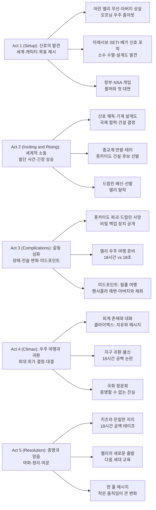
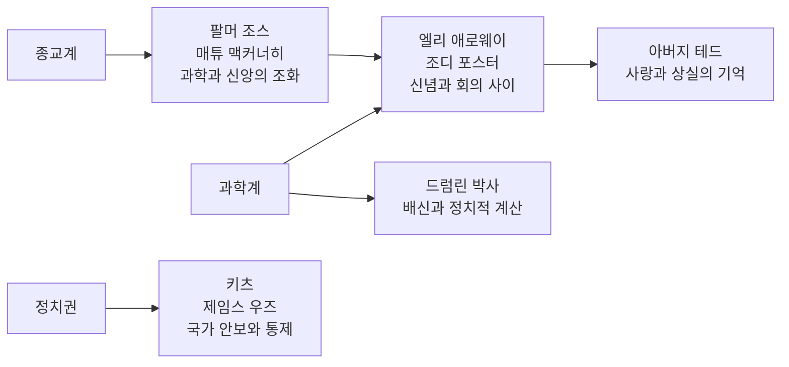

1997년 할리우드 SF의 이정표가 세워졌다. 로버트 저메키스 감독이 칼 세이건의 동명 소설을 바탕으로 만든 『콘택트』는 단순한 외계인 접촉 영화를 넘어, 과학과 신앙·이성과 감정·증명과 믿음이라는 인류의 근본 질문을 탐구한 철학적 대작이다. 조디 포스터의 생애 최고 연기와 첨단 특수효과가 결합된 이 작품은 SF의 새로운 패러다임을 제시했다.

## 개요

### 영화 정보

* **제목**: Contact / 콘택트
* **감독**: Robert Zemeckis (로버트 저메키스)
* **각본**: James V. Hart, Michael Goldenberg (원작·스토리: Carl Sagan, Ann Druyan)
* **주연**: Jodie Foster (엘리 애로웨이), Matthew McConaughey (팔머 조스), James Woods (마이클 키츠), Tom Skerritt (데이비드 드럼린), Angela Bassett (하든 박사), John Hurt (S.R. 하든), David Morse (테드 애로웨이)
* **음악**: Alan Silvestri (앨런 실베스트리)
* **촬영**: Don Burgess (돈 버제스)
* **장르**: SF, 드라마, 미스터리, 스릴러
* **상영시간**: 150분
* **개봉일**: 1997.07.11 (미국), 1997.08.09 (한국)
* **제작사**: South Side Amusement Company, Warner Bros.
* **배급사**: Warner Bros.
* **제작비**: 약 9천만 달러
* **흥행**: 전세계 약 1억 7,112만 달러 (미국·캐나다 약 1억 92만 달러)
* **평점**: IMDb 7.5/10, Metacritic 62, 수상: 휴고상 드라마 부문, 새턴상 2관왕

### 추천 대상

* **과학·SETI 애호가**: 실제 SETI·아레시보·VLA에 기반한 현실적 SF와 전파천문학 묘사.
* **철학·종교와 과학 관계에 관심 있는 관객**: 과학과 종교, 믿음과 증명의 경계를 깊이 있게 다룬 대화와 갈등.
* **조디 포스터·저메키스 팬**: 인생 연기와 감독의 기술력·서사력이 결합된 역작.

## 구조 분석

```mermaid
flowchart LR
    Act1["Act 1 (Setup): 신호의 발견</br>세계·캐릭터·목표 제시"]
    Act2["Act 2 (Inciting and Rising): 세계적 소동</br>발단 사건·긴장 상승"]
    Act3["Act 3 (Complications): 갈등 심화</br>장애·전술 변화·미드포인트"]
    Act4["Act 4 (Climax): 우주 여행과 귀환</br>최대 위기·결정·대결"]
    Act5["Act 5 (Resolution): 증명과 믿음</br>여파·정리·여운"]
    Act1 --> A1["어린 엘리 무선·아버지 상실</br>오프닝 우주 줌아웃"]
    Act1 --> A2["아레시보 SETI·베가 신호 포착</br>소수 수열·설계도 발견"]
    Act1 --> A3["정부·NSA 개입</br>팔머와 첫 대면"]
    Act2 --> B1["신호 해독·기계 설계도</br>국제 협력·건설 결정"]
    Act2 --> B2["종교계 반발·테러</br>홋카이도 건설·후보 선발"]
    Act2 --> B3["드럼린 배신·선발</br>엘리 탈락"]
    Act3 --> C1["홋카이도 파괴·드럼린 사망</br>비밀 백업 장치 공개"]
    Act3 --> C2["엘리 우주 여행 준비</br>18시간 vs 18초"]
    Act3 --> C3["미드포인트: 웜홀 여행</br>펜사콜라 해변·아버지와 재회"]
    Act4 --> D1["외계 존재와 대화</br>클라이맥스: 치유와 메시지"]
    Act4 --> D2["지구 귀환·불신</br>18시간 공백 논란"]
    Act4 --> D3["국회 청문회</br>증명할 수 없는 진실"]
    Act5 --> E1["키츠의 은밀한 지지</br>18시간 공백 테이프"]
    Act5 --> E2["엘리의 새로운 출발</br>다음 세대 교육"]
    Act5 --> E3["한 줄 메시지</br>작은 움직임이 큰 변화"]
```

## 영화의 전체 내용 (스포일러 포함)

『콘택트』는 외계 신호의 발견에서 시작해 국제 정치·종교 갈등, 웜홀 여행, 그리고 “증명할 수 없는 진실”을 믿을지 묻는 국회 청문회까지, 한 과학자의 여정과 인류의 반응을 따라간다. 아래는 Act 1부터 Act 5까지 장면 비트 [S01]~[Sxx]로 이어지는 전체 줄거리다.

### Act 1 (Setup): 신호의 발견

**[S01] 어린 엘리의 무선 통신**: 1970년대 위스콘신, 9살 엘리 애로웨이가 아버지 테드와 함께 아마추어 무선으로 "CQ, CQ. 펜사콜라에 있는 누구든 응답하세요"라고 호출한다. 우주와 소통하려는 갈망의 출발점이 되는 장면이다.

**[S02] 우주 줌아웃 (오프닝 크레딧)**: 지구에서 시작해 태양계·은하를 넘어 우주로 점점 멀어지는 시퀀스. 라디오 신호가 시대 순으로 역행하며 사라지는 음향과 함께 인류 문명의 짧음과 고립감을 보여준다. 결국 어린 엘리의 눈동자로 수렴한다.

**[S03] 아버지의 죽음 (플래시백)**: 계단에서 심장마비로 쓰러진 아버지, 병원 복도에서의 엘리. "작은 움직임도 큰 변화를 만들 수 있단다"라는 아버지의 마지막 말은 이후 그녀의 과학적 여정과 웜홀 너머 재회의 복선이 된다.

**[S04] 성인 엘리, 아레시보 SETI**: 푸에르토리코 아레시보 전파망원경. 32세 엘리(조디 포스터)가 동료들과 외계 신호 탐지에 몰두한다. "우주에 우리만 있다면 공간의 엄청난 낭비입니다"라는 대사가 칼 세이건의 철학을 대변한다.

**[S05] 베가 신호 포착**: 태풍이 지난 뒤 늦은 밤, "이건 신호예요! 베가에서 오는 거예요!"라는 엘리의 외침. 규칙적인 펄스가 강해지며 인류 최초의 외계 신호 수신이라는 역사적 순간이 된다.

**[S06] 신호 분석·패턴 발견**: 1에서 101까지의 소수 수열 발견. 수학이 우주의 공통 언어임을 보여주며, 설계도가 숨겨져 있음을 암시한다.

**[S07] NSA 키츠의 개입**: VLA에 검은 정장의 정부 요원들이 등장한다. "이제 이것은 국가 안보의 문제입니다"라는 마이클 키츠(제임스 우즈)의 통보로 과학적 탐구가 통제권 박탈과 맞닿는다.

**[S08] 팔머 조스와의 만남 (백악관)**: 종교철학자 팔머 조스(매튜 맥커너히)가 "95%가 신을 믿는 세상에서, 신을 믿지 않는 사람이 인류를 대표할 수 있습니까?"라고 묻는다. 과학과 종교의 대립이 공적 자리에서 부각된다.

### Act 2 (Inciting & Rising): 세계적 소동

**[S09] 신호 해독·설계도 발견**: 국제 협력으로 신호를 해독한 끝에 "기계의 설계도"가 나온다. 3D 홀로그램으로 구현되는 구조는 단순 인사가 아닌, 실질적 도움의 제안으로 읽힌다.

**[S10] 종교계 반발**: 조셉 목사 등이 "신의 계획에 대한 도전", "사탄의 유혹"이라며 반발하고, TV 설교와 집회로 확산된다.

**[S11] 국제기구·장치 건설 결정**: 유엔 긴급 회의에서 각국이 협력해 기계 건설을 결정하지만, 장소·비용·이해관계로 갈등이 드러난다.

**[S12] 홋카이도 건설·테러**: 일본 홋카이도에 건설된 거대 장치. 종교적 테러리스트가 "신의 이름으로" 자폭하며 시설을 파괴한다.

**[S13] 엘리의 후보 선발 과정**: 세계적 면접에서 엘리는 "외계 존재를 만날 준비가 되어 있습니다"라고 답하며 인류 대표로서의 역할을 수용한다.

**[S14] 드럼린의 배신·선발**: 선발위원회에서 드럼린 박사가 "나는 신을 믿는다. 그것이 인류 대표에게 필요한 자격이다"라며 엘리를 제치고 자신이 선발된다. 정치적 계산이 과학적 적합성보다 우선하는 순간이다.

### Act 3 (Complications): 갈등 심화

**[S15] 홋카이도 장치 파괴·드럼린 사망**: 수백만이 지켜보는 가운데 테러로 장치가 폭발하고, 탑승한 드럼린이 "신이시여, 제가 무엇을 했나이까?"라는 절규와 함께 사망한다.

**[S16] 비밀 백업 장치 공개**: 펜타곤 극비 회의에서 키츠가 "또 다른 장치를 건설했습니다"라고 밝힌다. 일본 외에 비밀리에 제작한 두 번째 장치가 존재하며, 엘리에게 기회가 돌아온다.

**[S17] 엘리의 우주 여행 준비**: 지하 발사 시설에서 의료·기술진이 분주히 움직이는 가운데, 엘리는 "18시간이나 가야 할 곳이 어디인지 모르겠지만, 준비는 됐습니다"라고 말한다.

**[S18] 우주 여행 시작 (18시간 vs 18초)**: 구형 캡슐이 회전하는 고리 안으로 떨어진다. 지상에서는 아무 일도 일어나지 않은 것처럼 보이지만, 엘리에게는 시간이 18시간으로 체감되는 여행이 시작된다.

**[S19] 미드포인트 — 웜홀을 통한 여행**: 무지개색 웜홀과 은하들이 펼쳐지는 초공간 시퀀스. 엘리는 인간 인식을 넘어선 경외감과 고독감을 경험한다.

**[S20] 펜사콜라 해변·아버지와의 재회**: 어린 시절 휴가지였던 해변. 외계 존재가 아버지 모습으로 나타나 "그들이 나를 이 모습으로 선택한 건 네가 편안해하도록 하기 위해서란다"라고 말한다. 상실에 대한 치유와 우주적 소통이 겹치는 감동적 클라이맥스로 이어진다.

### Act 4 (Climax): 우주 여행과 귀환

**[S21] 클라이맥스 — 외계 존재와의 대화**: 아버지 형상의 존재가 "우주에서 혼자가 아니라는 것을 아는 것만으로도 충분한 시작이야", "작은 움직임이 큰 변화를 만들 수 있다는 걸 기억하거라"라고 전한다. 어린 시절 아버지의 가르침과 우주적 메시지가 하나로 겹친다.

**[S22] 지구로 귀환·불신**: 지하 시설로 돌아온 엘리를 의료진과 조사관들이 회의적으로 맞는다. "18시간의 여행이었지만, 여러분에게는 18초였죠?"라는 엘리의 질문이 주관적 경험과 객관적 측정의 괴리를 드러낸다.

**[S23] 국회 청문회**: 전 세계 생중계 속에서 "선생은 그 경험을 증명할 수 있습니까?"라는 질문에 엘리는 "아니요, 하지만 그것이 거짓이라고 증명할 수도 없습니다"라고 답한다. 과학자가 믿음을 요구하는 아이러니가 완성된다.

### Act 5 (Resolution): 증명과 믿음

**[S24] 키츠의 은밀한 지지**: 조용한 카페에서 키츠가 "18시간 분량의 공백 테이프가 있습니다. 설명할 수 없는 18시간 말이죠"라고 고백한다. 공개적 인정은 없지만, 엘리 경험이 단순한 환상이 아니었음을 간접적으로 뒷받침한다.

**[S25] 엘리의 새로운 출발**: 새로운 연구소의 교실에서 어린 학생들에게 "우주는 생각보다 훨씬 크고 놀라운 곳이에요"라고 말하는 엘리. 개인적 탐구에서 인류의 미래 교육으로 캐릭터 아크가 마무리된다.

**[S26] 엔딩**: SETI 지원이 이어지고, 엘리와 팔머의 관계가 믿음 위에서 재연결되는 여운으로 영화가 끝난다.

---

## 핵심 대사 인덱스

* "우주에 우리만 있다면 공간의 엄청난 낭비입니다" — 엘리, [S04]; SETI에 대한 신념.
* "과학은 신의 존재를 증명할 수도, 부정할 수도 없습니다" — 팔머; 과학과 신앙의 공존 가능성.
* "저는 증거가 있어야 믿습니다. 그것이 과학자의 의무니까요" — 엘리; 회의주의와 증명.
* "하지만 사랑은 어떻게 증명하시겠어요?" — 팔머; 믿음의 영역을 묻는 질문.
* "작은 움직임도 큰 변화를 만들 수 있단다" — 아버지(테드), [S03]/[S21]; 개인적 가르침과 우주적 메시지의 일치.
* "아니요, 하지만 그것이 거짓이라고 증명할 수도 없습니다" — 엘리, [S23]; 증명과 믿음의 경계.

## 캐릭터 분석

### 캐릭터 관계도

```mermaid
graph LR
    ScienceWorld["과학계"] --> Ellie["엘리 애로웨이</br>조디 포스터</br>신념과 회의 사이"]
    ScienceWorld --> Drumlin["드럼린 박사</br>배신과 정치적 계산"]
    ReligionWorld["종교계"] --> Palmer["팔머 조스</br>매튜 맥커너히</br>과학과 신앙의 조화"]
    PoliticsWorld["정치권"] --> Kitz["키츠</br>제임스 우즈</br>국가 안보와 통제"]
    Ellie --> Father["아버지 테드</br>사랑과 상실의 기억"]
    Palmer --> Ellie
```

### 엘리너 '엘리' 애로웨이 / Dr. Ellie Arroway (Jodie Foster)

**개요**: 32세 천체물리학자, SETI 연구원. 어린 시절 아버지와의 무선 통신과 그 상실이 우주와의 소통에 대한 평생의 목표로 이어졌다.

**성장 곡선**: 어린 시절 상실감 → 과학적 탐구로의 도피 → 베가 신호 발견·정치·종교와의 충돌 → 웜홀 여행을 통한 아버지와의 재회와 내면 치유 → 증명할 수 없는 경험을 둘러싼 청문회 → 다음 세대 교육으로 나아가는 새로운 출발.

**동기와 욕망**: 표면적으로는 외계 생명체의 존재 증명; 내면적으로는 우주적 고립감 해소와 잃어버린 아버지와의 재연결. 혼자라는 것, 무의미한 존재라는 것에 대한 두려움.

**갈등 구조**: 자신과의 갈등 — 과학적 회의주의와 믿음 사이; 타인과의 갈등 — 정치권·종교계와의 이념적 충돌; 상황과의 갈등 — 증명할 수 없는 진실을 받아들여야 하는 아이러니.

**상징적 의미**: 순수한 과학적 탐구가 정치·종교와 부딪힐 때 겪는 고립과 좌절, 그리고 궁극적으로 과학이 인간의 영적 갈증과 어떻게 맞닿을 수 있는지를 묻는 현대 과학자의 얼굴.

**연기 평가**: 조디 포스터는 냉정한 이성과 숨겨진 감정을 동시에 전달하며, 엘리의 복합성을 설득력 있게 구현했다. 청문회와 웜홀 귀환 직후 장면에서의 절제된 연기가 특히 인상적이다.

### 팔머 조스 / Palmer Joss (Matthew McConaughey)

**개요**: 30대 후반 종교철학자, 하버드 신학대학원 출신. 백악관 과학 자문위원으로 엘리와 대립하면서도 사랑과 존경으로 그녀를 지지한다.

**성장 곡선**: 학문적 종교인 → 엘리와의 만남으로 과학적 사고 수용 → "사랑을 어떻게 증명하겠는가"라는 질문을 통해 이성과 믿음의 조화 추구 → 엘리의 경험을 믿어주는 쪽으로 성장.

**동기와 욕망**: 과학과 종교의 화해, 그리고 엘리에 대한 사랑. 과학이 종교를 완전히 대체할 수 있다는 불안을 안은 채, 공존 가능성을 탐색한다.

**갈등 구조**: 공적 자리에서는 엘리의 무신론을 문제시하지만, 사적으로는 그녀의 진실 추구를 인정하고 최종적으로 "믿는다"고 말하는 내적·외적 긴장.

**상징적 의미**: 맹목적 신앙이 아닌, 과학적 사고를 수용하면서도 영적 가치를 포기하지 않는 21세기적 종교인 모델.

**연기 평가**: 매튜 맥커너히는 당시 로맨틱 코미디 이미지를 넘어 카리스마 있고 지적인 종교철학자 역할로 진지한 연기 전환을 보여준다.

### 마이클 키츠 / Michael Kitz (James Woods)

**개요**: 40대 NSA 국가안보고문. 외계 신호 사건의 국가적 통제와 정보 독점을 추구하는 정치적 실용주의자.

**성장 곡선**: 과학 시설 접수·엘리 견제 → 비밀 백업 장치 운영·엘리 재기회 제공 → 청문회 이후 18시간 공백 테이프를 암묵적으로 인정하며 엘리를 은밀히 지지.

**동기와 욕망**: 국가 안보와 정보 통제; 동시에 "설명할 수 없는 18시간"을 인정하는 양심의 발현.

**갈등 구조**: 과학의 자유 vs 국가 안보; 공식 입장(회의·조작 가능성 시사) vs 개인적 진실 인정.

**상징적 의미**: 표면적으로는 과학을 억압하는 권력이지만, 궁극적으로는 진실의 가치를 인정하는 복합적 관료. 정치적 계산을 넘어선 양심의 선택.

**연기 평가**: 제임스 우즈는 권위적이면서도 마지막 카페 장면에서 은밀한 지지를 전하는 복합적인 톤을 잘 살렸다.

### 데이비드 드럼린 / David Drumlin (Tom Skerritt)

**개요**: 대통령 과학 자문위원. SETI를 낭비로 보며 예산을 끊었으나, 베가 신호 발견 후 사건의 중심에 선 인물. 종교적 적합성을 이유로 엘리를 제치고 자신이 우주 여행자로 선발된다.

**성장 곡선**: 엘리의 반대자 → 신호 발견 후 국제 프로젝트의 얼굴 → 선발 과정에서의 배신 → 테러로 첫 탑승자로서 사망하며 "신이시여, 제가 무엇을 했나이까?"라고 절규.

**동기와 욕망**: 권위 유지와 정치적 적합성. 과학적 능력보다 "신을 믿는 대표"라는 자격을 앞세운 선택.

**상징적 의미**: 정치적 계산이 과학과 개인에게 돌아오는 비극적 결과. 배신과 자기 파멸의 아이러니.

## 영상미와 음악

### 시각 효과·촬영·미학

* **오프닝 시퀀스**: 지구에서 우주까지 역방향 줌아웃과 라디오 신호의 시대별 소거는 『Powers of Ten』에 영감을 받은 당시 최장 연속 CG 시퀀스로, 인간 존재의 우주적 맥락을 압축한다.
* **실제 로케이션**: 아레시보 전파망원경(푸에르토리코), VLA(뉴멕시코)에서의 촬영으로 과학적 현실감을 확보했다.
* **웜홀 시퀀스**: ILM·웨타 등이 아인슈타인-로젠 다리 등 물리 이론을 참고해 구현한 초공간 여행은 색채·기하학·규모감으로 SF 시각 효과의 기준을 올렸다.
* **펜사콜라 해변**: 은하 코어 근처의 “꿈 같은 해변”으로, 파도 역주행·그림자 가속 등 미묘한 비현실 요소로 “진짜인가?”라는 질문을 유지한다.
* **미러·아버지 사망**: 거울과 캐비닛을 이용한 트릭 숏으로 상실의 충격을 간접적으로 전달한다.

### 음악감독의 음악

* **앨런 실베스트리**: 오케스트라와 신시사이저를 결합해 우주의 웅장함과 개인적 순간의 감정을 동시에 담았다.
* **대표 퀴**: "The Journey" — 웜홀 여행 장면의 경외감과 신비로움; "Ellie's Father" — 아버지와의 재회와 치유의 감정.
* **사운드 디자인**: 우주 공간의 정적, 전파 신호·펄스음, 컴퓨터·기계음이 과학적 정확성과 몰입감을 높인다.

## 종합 평가

### 최종 평점: ★★★★☆ (4.0/5.0)

**장점**:
* 과학과 종교를 단순 대립이 아닌, 각각의 진리 추구 방식으로 그려 신앙인·비신앙인 모두에게 사유의 여지를 준다.
* SETI·아레시보·VLA 등 실제 과학과 물리 이론(웜홀)에 기반한 고증으로 SF의 설득력이 높다.
* 조디 포스터의 엘리 연기로 과학자의 냉정함과 인간적 상실·갈망이 균형 있게 전달된다.
* 오프닝 우주 줌아웃·웜홀·해변 클라이맥스 등 시각적·음향적 하이라이트가 뚜렷하다.
* "증명할 수 없는 경험"을 둘러싼 청문회는 포스트 트루스 시대의 논의를 선취한다.

**단점**:
* 150분 러닝타임과 중반 정치·선발 과정 서사가 다소 길게 느껴질 수 있다.
* 과학 개념 설명을 위한 대사가 때로 설명적으로 들릴 수 있다.
* 로맨스(엘리–팔머)와 정치적 갈등 전개가 다소 예측 가능한 편이다.

### 한 줄 평

"과학과 신앙이 만나는 지점에서, 증명할 수 없는 진실을 믿을지 묻는 영화."

### 추천 작품

* **『2001: 스페이스 오디세이』(1968)**: 과학적 정확성과 철학적 깊이, 초월적 경험의 시각화.
* **『인터스텔라』(2014)**: 과학과 사랑·시간·아버지와 자녀 관계를 우주 스케일로 다룬 작품.
* **『메시지(Arrival)』(2016)**: 언어학적 접근의 외계 접촉과 시간·소통에 대한 성찰.
* **『그래비티』(2013)**: 우주의 고독과 생존 의지, 극소 인원의 긴장감.
* **『미지와의 조우』(1977)**: 외계 접촉을 통한 인간 존재 성찰과 70년대 SF 톤.

### 관람 전 체크리스트

* **사전 지식**: SETI·전파천문학·아레시보에 대한 기초 이해가 있으면 좋다. 필수는 아니다.
* **연령·등급**: 미국 PG, 한국 12세 관람가. 어린이와 관람 시 150분 길이와 철학적 대화를 고려하면 된다.
* **기대 요소**: 하드 SF·철학적 대화·시각 효과·조디 포스터 연기를 기대하면 만족도가 높다.
* **쿠키 영상**: 없다.
* **속편**: 원작 소설·영화 모두 단일 완결 구조이며, 속편 제작 계획은 공식적으로 없다.

### 참고 문헌 및 출처

* [Contact (1997) — IMDb](https://www.imdb.com/title/tt0118884/)
* [Contact (1997 American film) — Wikipedia](https://en.wikipedia.org/wiki/Contact_(1997_American_film))
* [Contact (novel) — Wikipedia](https://en.wikipedia.org/wiki/Contact_(novel))
