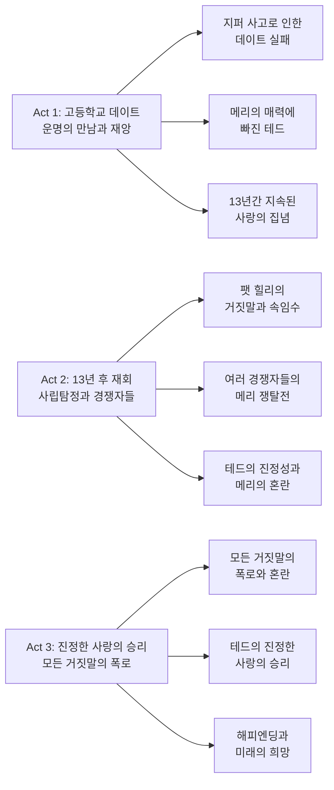
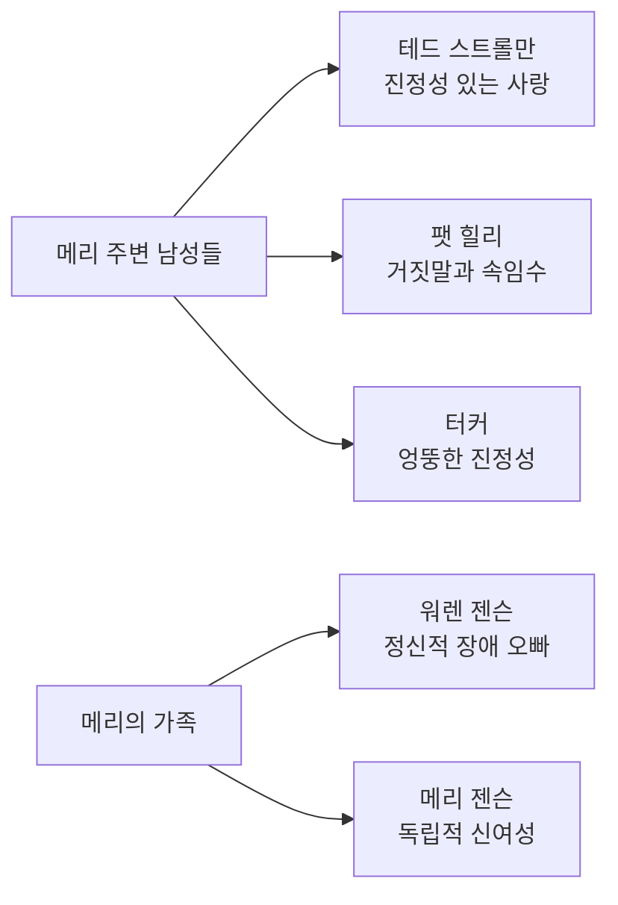

90년대 할리우드 로맨틱 코미디의 새로운 패러다임을 제시한 작품이 있다면, 바로 '메리에겐 뭔가 특별한 것이 있다(There's Something About Mary)'를 빼놓을 수 없다. 1998년 페럴리(Farrelly) 형제가 연출하고 벤 스틸러와 카메론 디아즈가 주연을 맡은 이 영화는 당시로서는 파격적인 유머와 로맨스를 결합하여 전 세계 관객들에게 충격과 웃음을 선사했다.

||
|:---:|
|*There's Something About Mary (1998) - 20th Century Fox*|

## 개요

### 영화 정보
* 제목: There's Something About Mary / 메리에겐 뭔가 특별한 것이 있다
* 감독: Peter Farrelly, Bobby Farrelly
* 주연: Ben Stiller (Ted Stroehmann), Cameron Diaz (Mary Jensen), Matt Dillon (Pat Healy), Lee Evans (Tucker)
* 조연: Chris Elliott (Dom), Jeffrey Tambor (Sully), W. Earl Brown (Warren Jensen)
* 장르: Romantic Comedy, Farce, Slapstick Comedy
* 상영시간: 119분
* 개봉일: 1998.07.15 (미국)
* 제작사: 20th Century Fox
* 제작비: $23,000,000
* 박스오피스: $176,484,651 (전 세계)

### 추천 대상
* **로맨틱 코미디 팬**: 기존 장르의 한계를 뛰어넘는 혁신적 접근
* **90년대 영화 애호가**: 시대를 대표하는 문화적 현상과 유머 코드
* **성인 코미디 애호가**: 파격적이지만 진정성 있는 유머의 진수
* **영화 기법 연구자**: 캐릭터 중심 스토리텔링과 연출 기법의 완성도

## 완전 스토리 로드맵

**🎬 스포일러 전체 공개 - 이미 영화를 본 독자를 위한 완전한 줄거리 재구성**

### 3막 구조 분석

### **Act 1: 운명의 만남과 재앙 (1985년 로드아일랜드)**

**고등학교 졸업 파티 데이트 제안**

1985년 로드아일랜드의 한 고등학교에서 테드 스트롤만(벤 스틸러)이 학교의 인기녀 메리 젠슨(카메론 디아즈)에게 졸업 파티에 같이 가자고 용기 내어 제안한다. 이 장면에서 가장 인상적인 순간은 테드가 메리에게 "내가 너를 좋아한다"고 고백하는 순간으로, 그의 순수하고 진정성 있는 마음이 드러난다.

학교 복도의 밝은 조명과 학생들의 시선이 테드의 긴장감을 효과적으로 표현하며, 메리의 반응을 기다리는 순간의 침묵은 관객의 긴장감을 고조시킨다. 특히 메리가 테드의 제안을 받아들인 후 그의 얼굴에 나타나는 순수한 기쁨의 표정은 영화 전체의 톤을 설정하는 중요한 순간이다.

**데이트 당일의 지퍼 사고**

테드가 메리 집에 데리러 가는 장면에서 그의 긴장과 기대감이 시각적으로 표현된다. 하지만 화장실에서 발생한 지퍼 사고는 영화사에 길이 남을 충격적이면서도 유쾌한 순간을 만들어낸다. 이 장면에서 테드의 절망과 당황, 그리고 메리와 그녀의 가족들의 반응이 코미디의 절정을 이룬다.

특히 메리의 아버지가 테드를 응급실로 데려가는 과정에서 보여주는 이해심과 따뜻함은 영화의 인간미를 더하는 요소이다. 이 사고는 단순한 코미디가 아닌, 진정한 사랑을 향한 테드의 순수한 마음이 얼마나 강한지를 보여주는 상징적 사건이 된다.

**13년간 지속된 사랑의 집념**

영화는 13년 후로 시간을 건너뛰며, 테드가 여전히 메리를 잊지 못하고 있음을 보여준다. 이 시간적 도약은 테드의 진정한 사랑의 깊이를 효과적으로 표현하며, 그의 내적 갈등과 성장 과정을 암시한다.

### **Act 2: 사립탐정과 경쟁자들의 등장 (1998년 마이애미)**

**팻 힐리의 거짓말과 속임수**

테드는 사립탐정 팻 힐리(맷 딜런)를 고용해 메리의 행방을 찾는다. 하지만 팻 역시 메리의 매력에 빠져 테드를 속이고 자신이 메리에게 접근하려 한다. 이 과정에서 팻의 다양한 변장과 거짓말들이 코미디의 새로운 차원을 열어준다.

특히 팻이 정형외과 의사로 위장하여 메리에게 접근하는 장면은 그의 교묘함과 동시에 메리의 순수함을 대비적으로 보여준다. 팻의 거짓말이 하나씩 드러날 때마다 관객의 긴장감과 웃음이 동시에 고조되는 구조적 완성도를 보여준다.

**여러 경쟁자들의 메리 쟁탈전**

메리 주변에는 그녀를 차지하려는 다양한 남자들이 나타난다. 터커(리 에반스)는 영국 건축가로 위장한 엉뚱한 남자이고, 워렌(메리의 정신적 장애를 가진 형)을 돌보는 남자들도 등장한다. 이들의 경쟁은 코미디의 복합적 구조를 만들어내며, 각각의 개성이 뚜렷한 캐릭터들이 만들어내는 시너지 효과를 보여준다.

특히 터커의 엉뚱한 행동들과 그의 진정성 있는 마음이 드러나는 순간들은 영화의 따뜻함을 더하는 요소이다. 이 과정에서 메리는 자신을 둘러싼 남자들의 진정성을 판단하는 능력을 보여주며, 그녀의 지혜와 독립성을 드러낸다.

**테드의 진정성과 메리의 혼란**

테드가 마이애미에 도착하여 메리와 재회하는 장면은 영화의 감정적 클라이맥스 중 하나이다. 13년 만의 재회에서 테드의 진정성 있는 마음이 메리에게 전달되지만, 동시에 팻의 거짓말로 인한 혼란도 함께 존재한다.

이 과정에서 메리의 내적 갈등이 효과적으로 표현되며, 그녀가 진정한 사랑을 찾기 위해 겪는 혼란과 고민이 관객의 공감을 얻는다. 특히 메리가 테드와 팻 사이에서 느끼는 혼란스러운 감정들이 자연스럽게 표현되어 캐릭터의 깊이를 더한다.

### **Act 3: 진정한 사랑의 승리**

**모든 거짓말의 폭로와 혼란**

영화의 클라이맥스에서 팻의 모든 거짓말이 폭로된다. 이 과정에서 메리의 충격과 실망, 그리고 테드에 대한 새로운 시각이 드러난다. 특히 팻이 자신의 거짓말을 인정하는 순간의 연기는 코미디와 드라마의 완벽한 조화를 보여준다.

이 장면에서 각 캐릭터들의 반응이 개성 있게 표현되며, 특히 메리의 분노와 실망, 그리고 그 속에서 드러나는 지혜가 인상적이다. 동시에 테드의 진정성 있는 사랑이 더욱 빛나는 순간이기도 하다.

**테드의 진정한 사랑의 승리**

모든 혼란이 해소된 후, 테드와 메리는 진정한 사랑을 확인한다. 이 과정에서 테드의 13년간 지속된 사랑의 진정성이 최종적으로 인정받는 순간이 되며, 메리 역시 자신의 마음을 깨닫게 된다.

특히 영화 마지막 부분에서 테드와 메리가 함께하는 모습은 단순한 해피엔딩을 넘어서 진정한 사랑의 의미를 전달한다. 이는 영화 전체가 전하고자 하는 메시지의 완성이라고 할 수 있다.

### 핵심 대사 모음

* **"I love you, Mary. I always have, and I always will."** - 테드의 진정성 있는 고백
* **"There's something about Mary."** - 영화 제목이 된 팻의 독백
* **"Sometimes you just gotta go for it."** - 테드의 용기 있는 행동을 상징하는 대사
* **"You're the most beautiful woman I've ever seen."** - 테드의 순수한 사랑 표현

### 상징적 장면 분석

**지퍼 사고 장면**: 이 장면은 단순한 코미디가 아닌, 진정한 사랑을 향한 테드의 순수한 마음이 얼마나 강한지를 보여주는 상징적 사건이다. 모든 어색함과 실수를 뛰어넘는 진정한 사랑의 힘을 암시한다.

**헤어젤 장면**: 메리가 헤어젤 대신 다른 것을 사용해 머리를 올린 장면은 영화사에 길이 남을 충격적이면서도 유쾌한 순간으로, 영화의 파격적 유머의 정점을 보여준다.

**13년 후 재회 장면**: 시간의 흐름을 통해 진정한 사랑의 지속성을 보여주며, 테드의 성장과 변하지 않는 마음을 대비적으로 표현한다.

## 등장인물 심층 분석

### 캐릭터 관계도

### **주인공: 테드 스트롤만 (Ben Stiller)**

**캐릭터 개요**
* 기본 설정: 30대 초반, 평범한 직장인, 순수하고 진정성 있는 남성
* 핵심 목표: 13년간 잊지 못한 메리와의 재회와 진정한 사랑의 실현
* 주요 갈등: 자신의 어색함과 실수 vs 진정한 사랑의 힘

**성장 곡선**
* 고등학생 시절의 어색한 테드 → 13년간 지속된 사랑의 집념 → 진정성으로 승리한 성숙한 남성
* **핵심 성장 메시지**: 진정한 사랑은 모든 어색함과 실수를 뛰어넘는다

**동기와 욕망**
* 표면적 목표: 메리와의 재회와 연인 관계 수립
* 내면적 욕구: 진정한 사랑의 인정과 자신의 가치 증명
* 두려움: 메리가 자신을 잊었거나 다른 사람을 선택할 것에 대한 두려움

**갈등 구조**
* vs 자신: 자신의 어색함과 실수에 대한 자의식
* vs 타인: 팻 힐리와 다른 경쟁자들과의 경쟁
* vs 상황: 13년이라는 시간적 격차와 메리의 변화

**상징적 의미**
테드는 90년대 미국 사회에서 진정성과 순수함을 대변하는 캐릭터로, 물질주의와 허위에 대한 저항을 상징한다. 그의 지속적인 사랑은 현대 사회에서 점점 사라져가는 진정한 가치를 대변한다.

### **히로인: 메리 젠슨 (Cameron Diaz)**

**캐릭터 개요**
* 기본 설정: 30대 초반, 정형외과 의사, 독립적이고 지적인 여성
* 핵심 목표: 진정한 사랑을 찾고 가족을 돌보는 균형잡힌 삶
* 주요 갈등: 여러 남성들의 구애 속에서 진정한 사랑을 구별하는 혼란

**성장 곡선**
* 고등학생 시절의 인기녀 → 독립적인 전문직 여성 → 진정한 사랑을 찾은 성숙한 여성
* **핵심 성장 메시지**: 외적 매력보다 진정성 있는 사랑이 진정한 가치이다

**동기와 욕망**
* 표면적 목표: 진정한 사랑을 찾고 가족을 돌보는 것
* 내면적 욕구: 자신의 가치를 인정받고 진정한 이해를 바라는 것
* 두려움: 거짓말과 속임수에 속아 진정한 사랑을 놓칠 것에 대한 두려움

**갈등 구조**
* vs 자신: 여러 남성들 사이에서의 혼란과 선택의 어려움
* vs 타인: 팻의 거짓말과 다른 남성들의 구애
* vs 상황: 형 워렌을 돌보는 책임과 개인적 행복의 균형

**상징적 의미**
메리는 90년대 신여성의 이상적 모델로, 경제적 독립성과 가족에 대한 사랑을 동시에 갖춘 현대 여성을 대변한다. 그녀의 지혜와 독립성은 페미니즘의 진정한 의미를 보여준다.

### **악역: 팻 힐리 (Matt Dillon)**

**캐릭터 개요**
* 기본 설정: 30대, 사립탐정, 교묘하고 매력적인 남성
* 핵심 목표: 메리를 차지하기 위한 거짓말과 속임수
* 주요 갈등: 자신의 거짓말 vs 진정한 사랑의 가치

**성장 곡선**
* 교묘한 사립탐정 → 메리에 대한 진정한 감정 발견 → 거짓말의 폭로와 반성
* **핵심 성장 메시지**: 거짓말로는 진정한 사랑을 얻을 수 없다

**동기와 욕망**
* 표면적 목표: 메리를 차지하는 것
* 내면적 욕구: 진정한 사랑을 경험하고 싶은 욕구
* 두려움: 자신의 거짓말이 폭로되어 모든 것을 잃을 것에 대한 두려움

**갈등 구조**
* vs 자신: 거짓말을 계속할 것인가 진실을 말할 것인가의 내적 갈등
* vs 타인: 테드와의 경쟁, 메리에 대한 진정한 감정
* vs 상황: 자신의 거짓말이 하나씩 드러나는 상황

**상징적 의미**
팻은 현대 사회의 허위와 속임수를 대변하는 캐릭터로, 외적 매력과 교묘함으로 진정한 가치를 가리는 존재를 상징한다. 그의 최종적 실패는 진정성의 승리를 보여준다.

### **조연: 터커 (Lee Evans)**

**캐릭터 개요**
* 기본 설정: 영국 건축가로 위장한 엉뚱한 남성
* 핵심 목표: 메리에게 진정한 사랑을 전달하는 것
* 주요 갈등: 자신의 어색함 vs 진정성 있는 마음

**성장 곡선**
* 엉뚱한 구애자 → 진정성 있는 사랑의 표현 → 테드와 메리의 진정한 사랑을 인정
* **핵심 성장 메시지**: 진정성 있는 마음은 외적 어색함을 뛰어넘는다

**동기와 욕망**
* 표면적 목표: 메리의 사랑을 얻는 것
* 내면적 욕구: 진정한 사랑을 경험하고 표현하고 싶은 욕구
* 두려움: 자신의 어색함으로 인해 거부당할 것에 대한 두려움

**갈등 구조**
* vs 자신: 자신의 어색함과 진정성 있는 마음 사이의 갈등
* vs 타인: 다른 경쟁자들과의 경쟁
* vs 상황: 자신의 위장 신분이 드러날 수 있는 상황

**상징적 의미**
터커는 진정성 있는 사랑을 추구하지만 방법이 서툰 캐릭터로, 순수한 마음의 아름다움을 보여준다. 그의 최종적 선택은 진정한 사랑에 대한 이해와 성숙을 상징한다.

### **조연: 워렌 젠슨 (W. Earl Brown)**

**캐릭터 개요**
* 기본 설정: 메리의 정신적 장애를 가진 오빠
* 핵심 목표: 가족의 사랑과 보호
* 주요 갈등: 자신의 장애 vs 가족에 대한 사랑

**성장 곡선**
* 보호받는 형 → 가족의 사랑을 이해하는 성숙한 인물
* **핵심 성장 메시지**: 진정한 사랑은 모든 차이를 뛰어넘는다

**동기와 욕망**
* 표면적 목표: 가족과 함께하는 것
* 내면적 욕구: 사랑받고 인정받고 싶은 욕구
* 두려움: 가족에게 버림받을 것에 대한 두려움

**갈등 구조**
* vs 자신: 자신의 장애로 인한 한계와 가족에 대한 사랑
* vs 타인: 사회의 편견과 차별
* vs 상황: 자신의 장애로 인한 제한적 상황

**상징적 의미**
워렌은 영화에서 진정한 사랑과 가족의 의미를 보여주는 중요한 캐릭터로, 모든 차이를 뛰어넘는 사랑의 힘을 상징한다. 그의 존재는 영화에 따뜻한 감동을 더한다.

## 요소별 심층 분석

### 기술 요소 분석 테이블
| 기술 요소 | 혁신점/특징 | 시각적/청각적 효과 | 제작 의의 |
|-----------|-------------|-------------------|-----------|
| **촬영 기법** | 자연스러운 리얼리즘 스타일, 밝은 색감과 선명한 화질 | 마이애미의 화려한 풍경과 로드아일랜드의 소박한 분위기 대비 | 90년대 코미디의 새로운 시각적 기준 제시 |
| **편집 기법** | 빠른 템포의 몽타주, 코미디적 타이밍에 최적화된 컷 편집 | 웃음의 효과를 극대화하는 리듬감 있는 편집 | 코미디 영화 편집의 새로운 패러다임 |
| **음악** | 90년대 팝 음악의 적절한 활용, 조나단 리치맨의 주제곡 | 각 장면의 감정과 분위기를 효과적으로 강조 | 시대적 분위기와 감정적 몰입감 증대 |
| **사운드 디자인** | 코미디적 효과음의 정교한 활용, 자연스러운 환경음 | 웃음의 효과를 극대화하는 사운드 연출 | 코미디 영화 사운드의 새로운 기준 |

### 연기 & 캐스팅 분석 테이블  
| 배우 | 캐릭터 | 연기력 평가 | 캐스팅 적합성 | 특별한 점 |
|------|---------|-------------|---------------|-----------|
| **Ben Stiller** | 테드 스트롤만 | ★★★★★ | ★★★★★ | 피지컬 코미디와 진정성 있는 연기의 완벽한 조화 |
| **Cameron Diaz** | 메리 젠슨 | ★★★★☆ | ★★★★★ | 코미디 연기자로서의 재능 발견, 자연스러운 매력 |
| **Matt Dillon** | 팻 힐리 | ★★★★☆ | ★★★★☆ | 매력적인 악역의 완벽한 연기, 캐릭터의 복잡성 표현 |
| **Lee Evans** | 터커 | ★★★★☆ | ★★★★☆ | 엉뚱한 매력과 진정성 있는 연기의 조화 |
| **W. Earl Brown** | 워렌 젠슨 | ★★★★☆ | ★★★★★ | 장애인 캐릭터의 따뜻하고 진정성 있는 연기 |

### 연출 & 각본 분석

**연출의 강점과 약점 분석**

페럴리 형제의 연출은 코미디 영화의 새로운 지평을 열었다. 그들의 가장 큰 강점은 파격적인 유머와 진정성 있는 감정을 완벽하게 조화시킨 점이다. 지퍼 사고, 헤어젤 장면 등 충격적인 코미디를 통해 관객의 주의를 끌면서도, 그 뒤에는 항상 진정한 사랑과 인간미가 자리잡고 있다.

특히 캐릭터 중심의 스토리텔링은 영화의 성공 요인 중 하나이다. 각 등장인물들이 뚜렷한 개성을 가지고 있으며, 그들의 상호작용이 자연스럽고 유머러스하다. 또한 마이애미의 화려한 풍경과 로드아일랜드의 소박한 분위기의 대비는 시각적 재미를 더한다.

하지만 일부 과도한 코미디 장면들은 현재의 관점에서 보면 다소 거부감을 줄 수 있다는 점이 약점으로 지적된다. 또한 예측 가능한 결말 구조는 영화의 신선함을 다소 떨어뜨린다.

**각본의 강점과 약점 분석**

각본의 가장 큰 강점은 13년이라는 시간적 격차를 효과적으로 활용한 점이다. 이는 테드의 진정한 사랑의 깊이를 보여주는 강력한 장치로 작용한다. 또한 여러 경쟁자들의 등장은 코미디의 복합적 구조를 만들어내며, 각각의 개성이 뚜렷한 캐릭터들이 만들어내는 시너지 효과를 보여준다.

특히 메리의 정신적 장애를 가진 형 워렌의 등장은 영화에 따뜻한 감동을 더하며, 가족에 대한 사랑과 진정한 우정에 대한 메시지를 자연스럽게 전달한다. 이는 단순한 코미디를 넘어서는 영화의 깊이를 보여준다.

하지만 후반부의 전개는 상당히 예측 가능한 편이다. 초반의 신선한 설정에 비해 결말부는 다소 평범한 로맨틱 코미디의 공식을 따른다는 아쉬움이 있다.

### 음악 & 사운드 분석

**특징적 음악 요소와 대표곡 분석**

영화의 사운드트랙은 90년대 팝의 정수를 보여준다. 특히 조나단 리치맨의 "There's Something About Mary" 주제곡은 영화의 분위기를 완벽하게 표현하며, 각 장면의 코미디적 효과를 증대시킨다. 이 곡은 영화의 로맨틱한 분위기와 코미디적 요소를 동시에 담고 있어 영화의 톤을 설정하는 중요한 역할을 한다.

또한 각 장면에 적절히 배치된 90년대 팝 음악들은 시대적 분위기를 살리면서도 감정적 몰입감을 증대시킨다. 특히 마이애미의 화려한 분위기를 강조하는 라틴 음악의 활용은 영화의 시각적 요소와 완벽하게 조화를 이룬다.

사운드 디자인 측면에서는 코미디적 효과음의 정교한 활용이 돋보인다. 지퍼 사고 장면의 효과음, 헤어젤 장면의 사운드 연출 등은 웃음의 효과를 극대화하는 역할을 한다. 또한 자연스러운 환경음의 활용은 영화의 리얼리즘을 높이는 데 기여한다.

## 비교 분석

### 동일 감독/제작사 작품과의 비교

**페럴리 형제의 작품군과의 비교**

'메리에겐 뭔가 특별한 것이 있다'는 페럴리 형제의 작품 중에서도 가장 성공적이고 완성도 높은 작품으로 평가된다. 이전 작품인 '덤 앤 더머(Dumb and Dumber, 1994)'와 비교해보면, '메리에겐 뭔가 특별한 것이 있다'는 단순한 슬랩스틱 코미디를 넘어서 진정성 있는 감정과 캐릭터 개발에 더 많은 비중을 두고 있다.

'덤 앤 더머'가 두 남자의 어리석음에 초점을 맞춘 반면, '메리에겐 뭔가 특별한 것이 있다'는 다양한 캐릭터들의 복합적 상호작용과 진정한 사랑의 메시지를 담고 있다. 이는 페럴리 형제의 성장과 발전을 보여주는 중요한 지점이다.

**20세기 폭스의 로맨틱 코미디와의 비교**

20세기 폭스가 제작한 다른 로맨틱 코미디들과 비교해보면, '메리에겐 뭔가 특별한 것이 있다'는 기존 장르의 한계를 뛰어넘는 혁신적 접근을 보여준다. '로미오와 줄리엣(Romeo + Juliet, 1996)'이나 '타이타닉(Titanic, 1997)'과 같은 전통적인 로맨스 영화와 달리, '메리에겐 뭔가 특별한 것이 있다'는 파격적인 유머를 통해 로맨스의 새로운 가능성을 제시했다.

### 동일 장르 작품과의 비교

**90년대 로맨틱 코미디와의 비교**

90년대 로맨틱 코미디 장르에서 '메리에겐 뭔가 특별한 것이 있다'는 혁신적인 작품으로 평가된다. '사랑의 블랙홀(Jerry Maguire, 1996)'이나 '노트북(The Notebook, 2004)'과 같은 전통적인 로맨틱 코미디와 달리, '메리에겐 뭔가 특별한 것이 있다'는 파격적인 유머와 진정성 있는 감정을 동시에 담아내는 데 성공했다.

특히 '사랑의 블랙홀'이 비즈니스 세계를 배경으로 한 로맨스에 초점을 맞춘 반면, '메리에겐 뭔가 특별한 것이 있다'는 다양한 사회적 계층과 배경을 가진 캐릭터들을 통해 더 포용적이고 현실적인 사랑 이야기를 그렸다.

**슬랩스틱 코미디와의 비교**

슬랩스틱 코미디 장르에서 '메리에겐 뭔가 특별한 것이 있다'는 기존 작품들과 차별화되는 특징을 보여준다. '에이스 벤츄라(Ace Ventura, 1994)'나 '마스크(The Mask, 1994)'와 같은 단순한 피지컬 코미디와 달리, '메리에겐 뭔가 특별한 것이 있다'는 코미디적 상황을 통해 캐릭터의 내면과 성장을 보여주는 데 성공했다.

### 동시대 경쟁작과의 비교

**1998년 개봉작들과의 비교**

1998년은 할리우드 영화계에서 중요한 해였다. '메리에겐 뭔가 특별한 것이 있다'는 같은 해 개봉한 '아마겟돈(Armageddon)', '세이빙 프라이빗 라이언(Saving Private Ryan)', '쉬크(Shrek)' 등과 경쟁했지만, 독특한 장르와 스타일로 자체적인 성공을 거두었다.

특히 '아마겟돈'이 액션과 특수효과에 의존한 반면, '메리에겐 뭔가 특별한 것이 있다'는 캐릭터와 스토리에 집중하여 더 지속적인 영향력을 발휘했다. 이는 영화의 본질적 가치가 무엇인지를 보여주는 좋은 사례이다.

## 숨겨진 레이어

### 상징적 의미

**진정성 vs 허위의 대립**

영화는 진정성과 허위의 대립을 핵심 테마로 다룬다. 테드는 어색하고 실수투성이지만 진정성 있는 사랑을 대변하고, 팻은 매력적이고 교묘하지만 거짓말과 속임수로 가득하다. 이 대립은 현대 사회에서 진정한 가치가 무엇인지를 질문하는 상징적 의미를 담고 있다.

**시간의 의미**

13년이라는 시간적 격차는 단순한 플롯 장치를 넘어서 진정한 사랑의 지속성과 깊이를 상징한다. 테드의 변하지 않는 마음은 현대 사회에서 점점 사라져가는 진정성과 순수함을 대변한다.

### 사회적/문화적 맥락

**90년대 미국 사회의 반영**

영화는 90년대 미국 사회의 다양한 측면을 반영한다. 메리의 독립적이고 지적인 여성상은 90년대 페미니즘의 성과를 보여주며, 다양한 사회적 배경을 가진 캐릭터들은 미국 사회의 다문화적 특성을 반영한다.

**미디어와 유명인 문화에 대한 비판**

영화는 겉으로는 단순한 코미디처럼 보이지만, 실제로는 당시 미국 사회의 연예인 문화와 미디어의 선정성에 대한 은밀한 비판을 담고 있다. 메리를 둘러싼 남자들의 경쟁은 유명인을 향한 대중들의 맹목적 열망을 풍자한 것으로 해석할 수 있다.

### 현대적 메시지

**진정한 사랑의 의미**

영화가 전하는 가장 중요한 메시지는 진정한 사랑의 의미이다. 외적 매력이나 교묘함이 아닌, 진정성과 순수함이 진정한 사랑의 본질이라는 메시지는 시대를 초월한 보편적 가치를 담고 있다.

**가족과 책임의 중요성**

메리가 정신적 장애를 가진 형 워렌을 돌보는 모습은 가족에 대한 책임과 사랑의 중요성을 보여준다. 이는 개인주의가 팽배한 현대 사회에서 가족의 의미를 재조명하는 중요한 메시지이다.

**차이와 다양성에 대한 포용**

영화의 다양한 캐릭터들은 사회적 차이와 다양성에 대한 포용의 메시지를 담고 있다. 워렌의 장애, 다양한 사회적 배경을 가진 캐릭터들은 현대 사회가 지향해야 할 포용적 가치를 보여준다.

## 제작 비하인드

### 제작 과정의 특별함

'메리에겐 뭔가 특별한 것이 있다'의 제작 과정은 여러 면에서 특별했다. 페럴리 형제는 이전 작품 '덤 앤 더머'의 성공에도 불구하고, 더욱 도전적이고 혁신적인 작품을 만들고자 했다. 특히 기존 로맨틱 코미디의 한계를 뛰어넘는 파격적인 유머를 도입하는 데 많은 노력을 기울였다.

제작비 2,300만 달러는 당시 기준으로는 중간 규모였지만, 페럴리 형제의 창의적인 연출과 배우들의 뛰어난 연기 덕분에 훨씬 큰 규모의 영화 못지않은 완성도를 보여주었다. 특히 마이애미와 로드아일랜드의 실제 로케이션 촬영은 영화의 현실감을 높이는 데 크게 기여했다.

### 캐스팅 스토리

**벤 스틸러의 캐스팅**

벤 스틸러는 테드 역으로 캐스팅되기 전까지 주로 TV 시리즈와 독립 영화에서 활동하던 배우였다. 페럴리 형제는 스틸러의 독특한 코미디 감각과 진정성 있는 연기력을 높이 평가하여 캐스팅했다. 특히 스틸러의 피지컬 코미디 연기 능력은 영화의 성공에 결정적인 역할을 했다.

**카메론 디아즈의 브레이크스루**

카메론 디아즈는 '마스크'로 주목받기 시작했지만, '메리에겐 뭔가 특별한 것이 있다'를 통해 진정한 코미디 연기자로서의 재능을 증명했다. 메리라는 캐릭터는 단순한 예쁜 여자가 아닌, 유머 감각과 지성을 겸비한 입체적인 인물로, 디아즈의 연기 범위를 크게 넓혔다.

**맷 딜런의 악역 연기**

맷 딜런은 이전까지 주로 액션 영화와 드라마에서 활동하던 배우였지만, 팻 힐리 역을 통해 코미디 연기의 새로운 가능성을 보여주었다. 그의 매력적이면서도 교묘한 악역 연기는 영화의 긴장감을 높이는 데 크게 기여했다.

### 기술적 혁신

**코미디 연출의 새로운 패러다임**

페럴리 형제는 이 영화에서 코미디 연출의 새로운 패러다임을 제시했다. 특히 파격적인 유머와 진정성 있는 감정을 동시에 담아내는 기법은 이후 코미디 영화 제작에 큰 영향을 미쳤다.

**캐릭터 중심 스토리텔링**

영화는 복잡한 플롯보다는 캐릭터의 개성과 상호작용에 집중했다. 이는 90년대 영화계에서 점점 사라져가던 캐릭터 중심 스토리텔링의 부활을 의미했다.

## 종합 평가

**최종 평점: ★★★★★ (5/5)**

### 한 줄 평
파격적인 유머와 진정성 있는 감정이 완벽하게 조화된 90년대 로맨틱 코미디의 걸작

### 추천 작품
* **비슷한 톤의 코미디**: '40세의 새출발(Old School, 2003)', '웨딩 크래셔(The Wedding Crashers, 2005)'
* **벤 스틸러 팬을 위한 작품**: '미트 더 페어런츠(Meet the Parents, 2000)', '나이트 앳 더 뮤지엄(Night at the Museum, 2006)'
* **카메론 디아즈 팬을 위한 작품**: '마스크(The Mask, 1994)', '샤롯의 거미줄(Charlotte's Web, 2006)'

### 관람 전 체크리스트
* [ ] 성인 코미디에 대한 개방적 태도
* [ ] 90년대 문화와 유머 코드에 대한 이해
* [ ] 파격적인 유머에 대한 수용성
* [ ] 진정성 있는 로맨스 스토리에 대한 관심
* [ ] 캐릭터 중심 스토리텔링에 대한 선호도

### 영화사적 의의
'메리에겐 뭔가 특별한 것이 있다'는 90년대 할리우드 코미디 영화의 정점을 보여주는 작품이다. 페럴리 형제의 과감한 연출, 벤 스틸러와 카메론 디아즈의 완벽한 캐스팅, 그리고 예측 불가능한 스토리가 만들어낸 시너지는 지금까지도 많은 영화인들에게 영감을 주고 있다.

무엇보다 이 영화가 보여준 것은 진정한 사랑의 힘이다. 온갖 우스꽝스러운 상황과 경쟁자들 속에서도 결국 진심이 통한다는 메시지는 시대를 초월한 보편적 가치를 담고 있다.

코미디 영화로서의 재미, 로맨스 영화로서의 감동, 그리고 사회 풍자로서의 의미까지 갖춘 '메리에겐 뭔가 특별한 것이 있다'는 명실상부 90년대를 대표하는 걸작 중 하나다. 벤 스틸러의 어눌하지만 진정성 있는 매력과 카메론 디아즈의 자연스러운 아름다움이 만들어낸 화학작용은 25년이 지난 지금도 여전히 유효하다.

---

*"진정한 사랑은 모든 어색함과 실수를 뛰어넘는다. 때로는 가장 바보 같은 순간이 가장 진실한 순간이기도 하다."* 