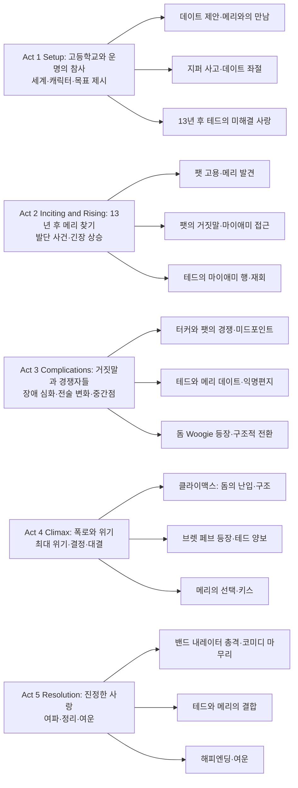

90년대 할리우드 로맨틱 코미디의 터를 잡은 작품 중 하나가 페럴리 형제의 《메리에겐 뭔가 특별한 것이 있다》(There's Something About Mary, 1998)다. 벤 스틸러와 카메론 디아즈가 주연한 이 영화는 당시 파격적인 유머와 진정한 사랑이라는 메시지를 결합해 전 세계적으로 흥행했고, AFI '100 Years...100 Laughs' 27위에 올랐다. 이미 관람한 독자를 위해 스포일러를 포함한 전체 내용, Act 5 구조, 캐릭터 분석, 영상·음악, 종합 평가까지 규칙에 맞춰 정리했다.

## 개요

### 영화 정보
* **제목**: There's Something About Mary / 메리에겐 뭔가 특별한 것이 있다
* **감독**: Peter Farrelly, Bobby Farrelly (페럴리 형제)
* **각본**: Ed Decter, John J. Strauss, Peter Farrelly, Bobby Farrelly
* **주연**: Ben Stiller (Ted Stroehmann), Cameron Diaz (Mary Jensen), Matt Dillon (Pat Healy), Lee Evans (Tucker / Norm Phipps)
* **조연**: Chris Elliott (Dom Woganowski), Jeffrey Tambor (Sully), W. Earl Brown (Warren Jensen), Lin Shaye (Magda)
* **음악**: Jonathan Richman
* **촬영**: Mark Irwin
* **장르**: Romantic Comedy, Farce, Slapstick Comedy
* **상영시간**: 119분
* **개봉일**: 1998.07.15 (미국), 1998.09.25 (영국)
* **제작사**: 20th Century Fox
* **배급사**: 20th Century Fox
* **제작비**: 약 2,300만 달러
* **평점**: 로튼 토마토 84%, 박스오피스 전 세계 약 3억 6,988만 달러

### 추천 대상
* **로맨틱 코미디·성인 코미디 팬**: 장르의 한계를 넘어선 파격 유머와 진정성 있는 감정선
* **90년대 영화·문화 애호가**: 당시 유머 코드와 스타 연기력을 함께 즐기고 싶은 관객
* **캐릭터·구조 분석에 관심 있는 이**: Act 5 서사와 여러 구애자들의 대비 구조를 보고 싶은 이

## 구조 분석 (Act 5)

```mermaid
flowchart LR
    act1["Act 1 Setup: 고등학교와 운명의 참사</br>세계·캐릭터·목표 제시"]
    act2["Act 2 Inciting and Rising: 13년 후 메리 찾기</br>발단 사건·긴장 상승"]
    act3["Act 3 Complications: 거짓말과 경쟁자들</br>장애 심화·전술 변화·중간점"]
    act4["Act 4 Climax: 폭로와 위기</br>최대 위기·결정·대결"]
    act5["Act 5 Resolution: 진정한 사랑</br>여파·정리·여운"]
    act1 --> evA1["데이트 제안·메리와의 만남"]
    act1 --> evA2["지퍼 사고·데이트 좌절"]
    act1 --> evA3["13년 후 테드의 미해결 사랑"]
    act2 --> evB1["팻 고용·메리 발견"]
    act2 --> evB2["팻의 거짓말·마이애미 접근"]
    act2 --> evB3["테드의 마이애미 행·재회"]
    act3 --> evC1["터커와 팻의 경쟁·미드포인트"]
    act3 --> evC2["테드와 메리 데이트·익명편지"]
    act3 --> evC3["돔 Woogie 등장·구조적 전환"]
    act4 --> evD1["클라이맥스: 돔의 난입·구조"]
    act4 --> evD2["브렛 페브 등장·테드 양보"]
    act4 --> evD3["메리의 선택·키스"]
    act5 --> evE1["밴드 내레이터 총격·코미디 마무리"]
    act5 --> evE2["테드와 메리의 결합"]
    act5 --> evE3["해피엔딩·여운"]
```

## 영화의 전체 내용 (스포일러 포함)

이미 관람한 독자를 대상으로 Act 단위와 장면 비트 [S01]~[Sxx]로 전체 줄거리를 재구성했다. 미드포인트·클라이맥스는 표기해 두었다.

### Act 1 (Setup): 고등학교와 운명의 참사

테드 스트롤만과 메리 젠슨의 관계, 그리고 13년 동안 이어지는 테드의 집념이 세워지는 1막이다.

**[S01] 고등학교 복도·데이트 제안**: 1985년 로드아일랜드 프로비던스. 테드(벤 스틸러)가 학교의 인기녀 메리 젠슨(카메론 디아즈)에게 졸업 파티 데이트를 신청하고, 메리가 수락한다. 테드의 순수한 호감과 긴장이 드러난다.

**[S02] 메리 집 앞·데이트 당일**: 테드가 메리를 데리러 그녀 집에 온다. 기대와 불안으로 화장실에서 실수한다.

**[S03] 지퍼 사고·응급실**: 화장실에서 테드가 지퍼에 걸리는 사고가 나고, 메리의 아버지가 그를 응급실로 데려간다. 데이트는 완전히 틀어지고, 테드는 메리와 연락을 잃는다.

**[S04] 13년 후·테드의 현재**: 시간이 1998년으로 넘어간다. 테드는 잡지 기자로 일하며 여전히 메리를 잊지 못한다. 친구 돔(Chris Elliott)의 권유로 사립탐정을 쓰기로 한다.

### Act 2 (Inciting & Rising): 13년 후 메리 찾기

사건이 촉발되고 긴장이 올라가는 2막이다. 팻의 등장과 거짓말이 플롯을 움직인다.

**[S05] 팻 힐리와 계약**: 테드가 사립탐정 팻 힐리(맷 딜런)를 고용해 메리의 행방을 찾는다.

**[S06] 팻의 마이애미 탐문**: 팻이 마이애미에서 메리를 찾는다. 메리는 성을 매튜스로 바꾸고 정형외과 의사로 살며, 지적 장애가 있는 오빠 워렌(W. Earl Brown)과 룸메이트 막다(Lin Shaye)와 함께 산다.

**[S07] 팻의 집착·거짓 보고**: 팻도 메리에게 반해, 테드에게는 “메리가 뚱뚱하고 아이가 넷”이라고 거짓말한다. 테드를 떼어놓은 뒤 자신이 메리에게 접근할 속셈이다.

**[S08] 테드의 히치하이크·몸을 싣고 간 살인자**: 테드는 팻의 거짓말을 어느 정도 의심하고, 마이애미로 차를 몰고 간다. 도중 히치하이커를 태우는데, 그가 시체를 차에 남기고 사라진다. 테드는 살인 혐의로 잡혔다가, 히치하이커가 자수하면서 풀려난다.

**[S09] 팻과 메리의 데이트·정형외과 의사 위장**: 팻은 정형외과 의사로 위장해 메리와 만나고, 그녀의 취향과 일상을 파악하며 데이트를 이어간다.

**[S10] 테드와 메리의 재회**: 테드가 마이애미에 도착해 메리와 13년 만에 재회한다. 메리는 테드에게 여전히 호감을 보이지만, 팻과의 관계로 혼란스러워한다.

### Act 3 (Complications): 거짓말과 경쟁자들

**[S11] 터커(노름) 등장**: 영국 건축가 “터커”로 위장한 노름 필립스(리 에반스)가 등장한다. 사실 그는 피자 배달원으로, 일부러 다쳐서 메리 환자가 되어 그녀 곁에 있는 인물이다. 팻을 “연쇄 살인범” 등으로 모함해 메리와의 관계를 깨뜨린다.

**[S12] 미드포인트 - 테드와 메리의 데이트·익명편지**: 테드와 메리가 본격적으로 데이트를 한다. 그때 메리에게 “테드가 당신을 찾기 위해 탐정을 썼다”는 익명의 편지가 도착하고, 메리는 배신감을 느껴 테드와 결별한다.

**[S13] 팻과 노름의 동맹**: 테드를 제거하려는 팻과 노름이 손을 잡고, 테드를 방해하는 행동을 한다.

**[S14] 돔 Woogie의 정체**: 메리의 옛 연인 “우기(Woogie)”가 바로 돔이다. 그는 메리를 스토킹해 금지접근명령을 받은 인물인데, 테드가 메리를 찾자 다시 나타나 편지를 보낸 것이 드러난다.

### Act 4 (Climax): 폭로와 위기

**[S15] 클라이맥스 - 돔의 난입·메리 위기**: 돔이 메리 아파트에 들어와 다시 집착을 드러내고, 메리를 위협한다. 밖에서 엿들은 팻과 노름이 들어와 돔을 제압하고 메리를 구한다.

**[S16] 브렛 페브 등장**: 메리의 전 남자친구인 NFL 쿼터백 브렛 페브(본인 역)가 등장한다. 노름이 그에게 대한 거짓말을 해서 메리가 그와 헤어졌던 것이 밝혀진다. 테드는 “속임수를 쓰지 않은 유일한 남자”인 브렛이 메리와 함께하는 게 맞다고 생각하고, 둘을 다시 이어주려 한다.

**[S17] 메리의 선택·키스**: 메리는 테드를 따라 나와, 자신이 가장 행복할 사람은 테드라고 말하고 그와 키스한다. 막다의 남자친구가 메리를 향한 질투로 저격을 시도하지만, 총알은 테드와 메리 사랑 이야기를 노래하던 밴드 멤버에게 맞는 코미디로 마무리된다.

### Act 5 (Resolution): 진정한 사랑

**[S18] 엔딩 - 해피엔딩**: 테드와 메리는 함께하며, 13년 만에 진정한 사랑을 이루었다는 여운으로 영화가 끝난다.

### 핵심 대사 인덱스

* "I love you, Mary. I always have, and I always will." — 테드, [S10] 전후; 13년간의 감정을 요약한 고백
* "There's something about Mary." — 팻의 독백; 영화 제목과 동일한 문장
* "Sometimes you just gotta go for it." — 테드의 용기를 대변하는 대사

## 캐릭터 분석

### 테드 스트롤만 / Ted Stroehmann (Ben Stiller)

**개요**: 고등학교 시절 데이트 참사 후 13년이 지나도 메리를 잊지 못하는 잡지 기자. 어색하고 실수도 많지만, 메리에 대한 감정만은 진실하다.

**성장 곡선**: 고등학생 시절의 수줍은 테드 → 13년간 지켜온 집념 → 탐정·경쟁자·거짓말 속에서도 진심을 선택한 뒤, 마지막에 메리의 선택을 받는 인물로 성장한다.

**동기와 욕망**: 표면적으로는 “메리와 다시 만나 사귀는 것”, 내면적으로는 “진정한 사랑으로 인정받는 것”. 두려움은 메리가 자신을 잊었거나 다른 이를 선택하는 것이다.

**갈등 구조**: 자신의 어색함과 자의식(내적), 팻·노름·돔 등 경쟁자(외적), 13년이라는 시간과 메리의 변화(상황).

**상징적 의미**: 거짓말과 꾸밈이 난무하는 환경 속에서도 “진정성”을 대표하는 캐릭터로, 90년대 로맨틱 코미디의 대표적 주인공 유형이다.

### 메리 젠슨 / Mary Jensen (Cameron Diaz)

**개요**: 정형외과 의사. 스토커를 피해 성을 바꾸고 마이애미에서 살며, 지적 장애가 있는 오빠 워렌을 돌본다. 여러 남성의 구애와 속임수 사이에서 진짜 사랑을 가려내야 한다.

**성장 곡선**: 고등학교 시절 인기녀 → 독립한 전문직 여성 → 팻·노름·테드·돔의 진위를 겪으며, 최종적으로 “진정한 사랑”을 선택하는 쪽으로 정리된다.

**동기와 욕망**: 진정한 파트너를 찾는 것, 가족(워렌)을 지키는 것. 거짓말에 속아 진심을 놓치는 것을 두려워한다.

**갈등 구조**: 여러 구애자 사이에서의 혼란(내적), 팻·노름의 거짓말(외적), 워렌 돌봄과 개인적 행복의 균형(상황).

**상징적 의미**: 90년대 “독립적이고 지적인 여성” 이미지와, 외모·직업을 넘어 “진정성”을 기준으로 선택하는 주체로 그려진다.

### 팻 힐리 / Pat Healy (Matt Dillon)

**개요**: 테드가 고용한 사립탐정. 메리를 찾는 과정에서 그녀에게 반해, 테드를 속이고 의사 등으로 위장해 메리에게 접근한다.

**성장 곡선**: 냉정한 탐정 → 메리에 대한 집착으로 거짓말과 위장을 반복 → 돔 사건 때 메리를 구하는 행동을 하며, 결국 메리의 선택은 테드에게 간다. 거짓으로는 사랑을 얻지 못한다는 쪽으로 정리된다.

**동기와 욕망**: 메리를 “차지”하려는 욕구. 내면에는 진짜 사랑에 대한 동경이 있지만, 수단이 거짓말이라 붕괴한다.

**갈등 구조**: 거짓을 계속할지 말지(내적), 테드·노름과의 경쟁(외적), 거짓이 하나씩 드러나는 상황(상황).

**상징적 의미**: 매력과 말솜씨로 “겉만 다듬는” 인물로, 테드의 진정성과 대비되는 역할이다.

### 터커 / 노름 필립스 (Lee Evans)

**개요**: “터커”라는 영국 건축가 persona를 쓴 실제 identity는 피자 배달원 노름. 의도적으로 다쳐 메리의 환자가 되었고, 장애를 유지한 채 그녀 곁에 있다. 팻을 모함해 메리와의 관계를 깨뜨린다.

**성장 곡선**: 엉뚱한 구애자 → 팻과 손잡아 테드를 방해 → 돔 사건에서 메리를 구하는 데 가담. 최종적으로는 테드와 메리의 결합을 인정하는 쪽으로 흐른다.

**동기와 욕망**: 메리의 사랑을 받고 싶은 마음. 방법은 위장·거짓말이지만, 캐릭터 자체는 “어색하지만 진심”에 가깝게 그려진다.

**상징적 의미**: “방법은 잘못됐지만 마음은 진실”에 가까운 캐릭터로, 코미디와 감정선을 동시에 담당한다.

### 워렌 젠슨 / Warren Jensen (W. Earl Brown)

**개요**: 메리의 오빠. 지적 장애가 있으며, 귀를 보호하려는 습관 등으로 개성 있게 그려진다. 메리의 가족에 대한 사랑과 책임을 보여주는 인물이다.

**성장 곡선**: 메리의 보호 아래 있는 인물에서, 영화 후반에도 가족의 일원으로 유지된다. “차이를 넘어선 사랑”을 상징하는 보조 캐릭터다.

**동기와 욕망**: 가족과 함께하고, 사랑받고 인정받는 것. 버림받을까 봐 두려워한다.

**상징적 의미**: 가족·책임·포용을 담당하며, 코미디 안에서 휴먼 터치를 더한다.

## 영상미와 음악

### 시각 효과 / 촬영 / 미학
* **색감·구도**: 밝은 톤의 90년대 코미디 스타일. 마이애미의 햇빛과 로드아일랜드의 소박한 배경이 대비된다.
* **촬영**: 마크 어윈(Mark Irwin) 촬영. 리얼리즘에 가까운 연출로, 지퍼·헤어젤 같은 개그 장면도 과장되지만 “현실 안”에서 터지도록 맞춰져 있다.
* **미장센·로케이션**: 마이애미 실제 로케이션(빅 핑크, 카도조 호텔, 처칠 펍 등) 활용으로 현장감을 준다.
* **특수·분장**: 지퍼 사고, 헤어젤 등 파격 장면의 분장·효과는 토니 가드너(Tony Gardner) 등이 담당해, 코미디적 임팩트와 함께 기억에 남는 비주얼을 만든다.

### 음악감독의 음악
* **Jonathan Richman**: 주제곡 "There's Something About Mary"와 여러 곡으로 영화 분위기를 이끈다. 내레이터 겸 밴드 역할로 등장해 메타적 유머를 더한다.
* **사운드트랙**: 90년대 팝·인디 팝 위주. "Build Me Up Buttercup"(The Foundations), "Mary's Prayer"(Danny Wilson), "Is She Really Going Out with Him?"(Joe Jackson) 등이 장면과 잘 맞는다.
* **사운드 디자인**: 지퍼·헤어젤 등 개그 포인트의 효과음이 코미디 타이밍을 강화한다.

## 종합 평가

### 최종 평점: ★★★★☆ (4.0/5.0)

**장점**:
* 파격적인 유머(지퍼, 헤어젤 등)와 “진정한 사랑” 메시지의 결합이 잘 맞아 90년대 로맨틱 코미디의 대표작으로 자리 잡았다.
* 테드·메리·팻·터커(노름)·워렌 등 캐릭터가 뚜렷하고, 벤 스틸러·카메론 디아즈·맷 딜런·리 에반스 연기가 장면을 이끈다.
* 13년이라는 시간, 여러 구애자와 거짓말 구조가 서사를 풍부하게 하고, 미드포인트·클라이맥스가 분명한 Act 구조로 정리된다.

**단점**:
* 일부 개그는 당시 기준과 현재 감수성 차이로 거부감을 줄 수 있다.
* 후반부 “진정한 사랑의 승리”는 예측 가능한 로맨틱 코미디 공식에 가깝다.

### 한 줄 평

"파격적인 유머와 진정한 사랑 메시지가 결합한 90년대 로맨틱 코미디의 대표작."

### 추천 작품

* 《덤 앤 더머》(Dumb and Dumber, 1994): 같은 페럴리 형제 연출의 슬랩스틱 코미디.
* 《미트 더 페어런츠》(Meet the Parents, 2000): 벤 스틸러의 어색함과 진심이 살아 있는 코미디.
* 《40세의 새출발》(Old School, 2003): 성인 로맨틱·친구 코미디로 비슷한 톤을 찾기 좋다.

### 관람 전 체크리스트

* 사전 지식이 필요한가? **아니오.** 단, 90년대 미국 코미디·로맨틱 코미디에 대한 호감이 있으면 더 잘 즐길 수 있다.
* 어린이와 함께 볼 수 있는가? **아니오.** R등급(성인 코미디·언어·선정적 유머) 수준이다.
* 특정 요소를 기대해도 되는가? **예.** 피지컬·선정적 유머와 진심 어린 로맨스, 캐릭터 코미디를 기대해도 된다.
* 쿠키 영상이 있는가? **본작에는 명확한 미드/포스트 크레딧 쿠키 영상은 없다.**
* 속편 가능성은? **현재까지 정식 속편 계획은 없으며, 단편·패러디 등은 다양하게 존재한다.**

## 참고 문헌 및 출처

- [There's Something About Mary (1998) — Rotten Tomatoes](https://www.rottentomatoes.com/m/theres_something_about_mary)
- [There's Something About Mary — Box Office Mojo](https://www.boxofficemojo.com/movies/?id=somethingaboutmary.htm)
- [There's Something About Mary — Wikipedia](https://en.wikipedia.org/wiki/There%27s_Something_About_Mary)
- [There's Something About Mary (1998) — IMDb](https://www.imdb.com/title/tt0129387/)
