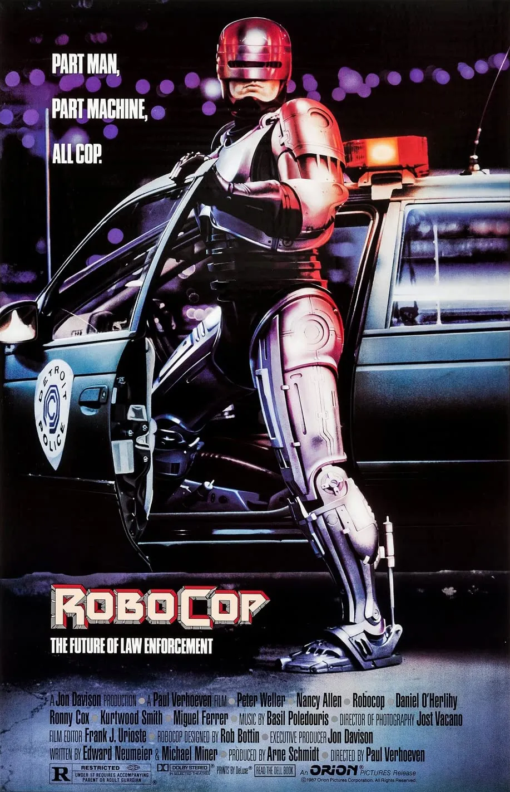
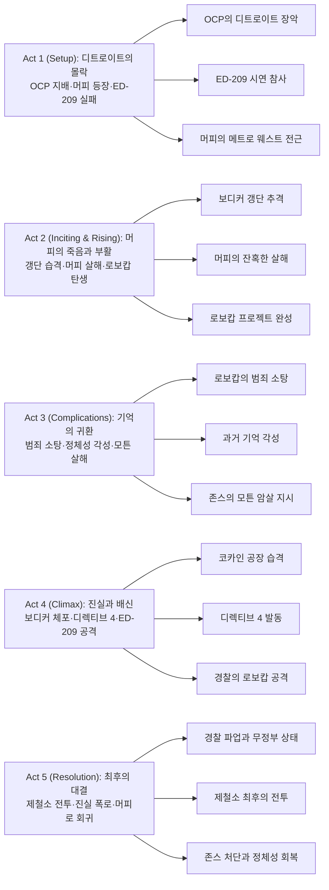

근미래 디트로이트, 범죄와 부패로 무너져가는 도시에서 살해당한 경찰관 알렉스 머피가 거대 기업 OCP의 프로젝트로 사이보그 로보캅으로 부활합니다. 완벽한 법 집행 기계로 설계되었지만, 잃어버린 기억과 인간성이 되살아나면서 로보캅은 자신을 죽인 범죄자들과 부패한 기업 권력에 맞서 싸우게 됩니다.

## 개요

### 영화 정보
* **제목**: RoboCop / 로보캅
* **감독**: Paul Verhoeven (폴 버호벤)
* **각본**: Edward Neumeier (에드워드 노이마이어), Michael Miner (마이클 마이너)
* **주연**: Peter Weller (피터 웰러), Nancy Allen (낸시 앨런), Kurtwood Smith (커트우드 스미스), Ronny Cox (로니 콕스), Miguel Ferrer (미겔 페러)
* **음악**: Basil Poledouris (바질 폴레두리스)
* **장르**: Science Fiction, Action, Crime, Satire
* **상영시간**: 102분
* **개봉일**: 1987.07.17 (미국)
* **제작사**: Orion Pictures
* **평점**: 로튼 토마토 90%, IMDb 7.6/10

### 추천 대상
* **SF 액션 팬**: 80년대 실용 특수효과의 정수와 강렬한 액션 시퀀스
* **사회 비판 영화 애호가**: 기업 권력과 미디어 조작을 날카롭게 풍자한 지적인 접근
* **컬트 클래식 탐험가**: 폴 버호벤의 독특한 연출과 시대를 앞서간 예언적 비전

## 구조 분석

## 영화의 전체 내용 (스포일러 포함)

근미래 디트로이트를 배경으로, 죽음에서 부활한 사이보그 경찰이 자신의 인간성을 되찾고 부패한 권력에 맞서는 이야기입니다. OCP라는 거대 기업이 경찰을 민영화한 디스토피아 사회에서, 머피 경관은 갱단에게 살해당했다가 로보캅으로 재탄생합니다. 그러나 프로그래밍된 명령과 되살아나는 인간의 기억 사이에서 갈등하며, 결국 자신을 만든 시스템의 부패를 폭로하고 진정한 정의를 실현합니다.

### Act 1 (Setup): 디트로이트의 몰락

**[S01] 디트로이트의 현실**: 근미래 디트로이트는 사회적, 재정적 붕괴 직전입니다. 범죄가 만연하고 자원이 고갈된 도시는 거대 기업 Omni Consumer Products(OCP)에 경찰서 운영권을 넘깁니다.

**[S02] OCP 이사회 - ED-209 시연**: OCP 본사 이사회실에서 수석 부사장 딕 존스(로니 콕스)가 법 집행 드로이드 ED-209를 시연합니다. "미래의 경찰"로 홍보되던 ED-209은 자원봉사자를 향해 오작동하여 무자비하게 살해하는 참사를 일으킵니다.

**[S03] 밥 모튼의 제안**: ED-209의 실패로 존스가 곤경에 처하자, 야심찬 주니어 임원 밥 모튼(미겔 페러)이 회장("노인")에게 자신의 프로젝트 로보캅을 소개합니다. 인간을 기반으로 한 사이보그 경찰이라는 개념입니다.

**[S04] 알렉스 머피의 등장**: 경찰관 알렉스 머피(피터 웰러)가 메트로 웨스트 관할구로 전근을 옵니다. 그는 새 파트너 앤 루이스(낸시 앨런)를 만나고, 사물함에서 가족 사진을 꺼내 보며 아들에게 보여줄 총 돌리기 묘기를 연습합니다.

**[S05] 클라렌스 보디커 갱단**: 악명 높은 범죄자 클라렌스 보디커(커트우드 스미스)와 그의 갱단 - 에밀 안토노프스키, 레온 내쉬, 조 콕스, 스티브 민 - 이 강도 사건을 벌입니다.

### Act 2 (Inciting & Rising): 머피의 죽음과 부활

**[S06] 갱단 추격**: 머피와 루이스는 보디커 갱단을 추격합니다. 갱단은 폐공장으로 도주하고, 두 경찰은 분리되어 추격에 들어갑니다.

**[S07] 머피의 살해 - 발단 사건**: 루이스는 무력화되고, 머피는 갱단의 매복에 걸립니다. 보디커와 부하들은 머피를 잔인하게 고문하고 사격 연습 삼아 신체 각 부위를 쏩니다. 마지막으로 보디커가 머리에 총을 쏴 머피를 살해합니다. 이 장면은 극도로 폭력적이고 충격적으로 묘사됩니다.

**[S08] 로보캅 프로젝트**: 모튼은 머피의 시체를 로보캅 프로젝트에 사용합니다. 수술과 개조를 거쳐 머피는 중무장 사이보그로 재탄생합니다. 그의 과거 기억은 모두 삭제되었습니다.

**[S09] 세 가지 주요 명령**: 로보캅은 세 가지 주요 명령(Prime Directives)으로 프로그래밍됩니다: 1) 대중을 보호하라(Serve the public trust), 2) 무고한 자를 보호하라(Protect the innocent), 3) 법을 준수하라(Uphold the law). 네 번째 명령인 디렉티브 4는 기밀로 분류됩니다.

**[S10] 로보캅의 첫 출동**: 메트로 웨스트에 배치된 로보캅은 무자비하게 효율적인 범죄 소탕으로 언론의 영웅이 됩니다. 편의점 강도를 제압하고, 강간범을 처단하며, 시장을 구합니다.

### Act 3 (Complications): 기억의 귀환

**[S11] 루이스의 의심**: 루이스는 로보캅의 독특한 총 장전 방식(권총을 돌려서 허벅지 홀스터에 넣는 동작)을 보고 그가 머피임을 직감합니다. 이것은 머피가 아들에게 보여주려고 연습하던 묘기였습니다.

**[S12] 머피 죽음의 악몽**: 정비 중 로보캅은 머피가 죽는 순간의 악몽을 경험합니다. 보디커의 얼굴과 총성, 고통의 기억이 플래시백으로 되살아납니다.

**[S13] 루이스와의 재회**: 로보캅은 루이스와 마주치고, 그녀는 그를 "머피"라고 부릅니다. 로보캅은 혼란스러워하지만 완전히 부정하지 못합니다.

**[S14] 안토노프스키 체포 - 미드포인트**: 순찰 중 로보캅은 에밀 안토노프스키를 체포합니다. 안토노프스키는 로보캅의 행동 패턴에서 머피를 알아보고 공포에 질립니다. 이것이 로보캅의 기억 회복을 더욱 촉진합니다.

**[S15] 경찰 데이터베이스 검색**: 로보캅은 경찰 데이터베이스를 사용해 안토노프스키의 동료들을 식별하고, 자신의 경찰 기록, 즉 알렉스 머피의 기록을 검토합니다.

**[S16] 옛집 방문**: 로보캅은 머피의 옛집을 찾아갑니다. 빈 집을 걸으며 단편적인 기억들이 되살아납니다. 그의 아내와 아들은 그의 죽음 이후 이사를 갔습니다. 이 장면에서 로보캅의 내면적 갈등이 극대화됩니다.

**[S17] 존스와 보디커의 거래**: 한편, 딕 존스는 밥 모튼이 자신의 지위를 위협한다고 느낍니다. 존스는 보디커를 만나 모튼을 살해하도록 지시합니다. 존스와 보디커의 유착 관계가 드러납니다.

**[S18] 밥 모튼의 살해**: 보디커는 코카인을 흡입하며 파티를 즐기던 모튼을 습격합니다. "딕 존스가 안부 전해달래(Dick Jones says hello)"라는 말을 남기고 모튼을 살해합니다.

### Act 4 (Climax): 진실과 배신

**[S19] 코카인 공장 습격**: 로보캅은 보디커 갱단의 거점인 코카인 공장을 추적합니다. 치열한 총격전이 벌어지고 스티브 민이 사망합니다.

**[S20] 보디커 체포와 고문**: 로보캅은 보디커를 체포하고 잔인하게 심문합니다. 보디커는 자신이 딕 존스를 위해 일한다고 자백합니다.

**[S21] 프로그래밍의 한계**: 분노한 로보캅은 보디커를 죽이려 하지만, 프로그래밍(주요 명령 3: 법을 준수하라)이 작동하여 법을 어길 수 없습니다. 그는 보디커를 체포하는 것으로 만족해야 합니다.

**[S22] OCP 타워 - 존스 체포 시도**: 로보캅은 OCP 타워로 가서 딕 존스를 체포하려 합니다. 그러나 디렉티브 4가 활성화됩니다: OCP 임원에 대해 행동할 때 로보캅을 무력화하는 안전장치입니다.

**[S23] 디렉티브 4 발동 - 클라이맥스 전환점**: "디렉티브 4: OCP 임원을 체포하거나 해하는 것은 금지된다"는 명령이 로보캅을 마비시킵니다. 존스는 모튼 살해에 대한 자신의 죄를 인정하며 조롱합니다.

**[S24] ED-209 공격**: 존스는 ED-209을 풀어 로보캅을 파괴하려 합니다. 로보캅은 겨우 건물에서 탈출하지만, 계단을 내려가지 못하는 ED-209의 설계 결함을 이용합니다.

**[S25] 경찰의 공격**: OCP의 명령을 받은 경찰들이 로보캅을 공격합니다. 수십 명의 경찰이 총격을 가하고 로보캅은 심각하게 손상됩니다.

**[S26] 루이스의 구출**: 루이스가 순찰차로 돌진해 로보캅을 구출합니다. 그녀는 중상을 입은 로보캅을 폐 제철소로 데려가 자가 수리할 수 있게 합니다.

### Act 5 (Resolution): 최후의 대결

**[S27] 경찰 파업**: OCP의 저자금 지원과 인력 부족에 분노한 경찰들이 파업에 돌입합니다. 디트로이트는 폭력적인 무정부 상태로 빠져듭니다.

**[S28] 보디커 갱단 무장**: 존스는 보디커와 남은 갱단을 석방하고 고성능 무기로 무장시켜 로보캅을 파괴하도록 보냅니다.

**[S29] 제철소 최후의 전투**: 보디커 갱단이 제철소로 쳐들어옵니다. 치열한 총격전이 벌어지고 갱단은 하나씩 제거됩니다. 레온은 로보캅의 헬멧을 찢어내지만 로보캅에게 사살됩니다. 조 콕스는 폭발로 사망합니다.

**[S30] 루이스 부상**: 총격전 중 루이스가 중상을 입습니다. 로보캅은 그녀를 안전한 곳으로 옮깁니다.

**[S31] 에밀의 최후**: 에밀 안토노프스키는 로보캅을 향해 차로 돌진하지만, 로보캅이 쏜 총에 맞아 독성 폐기물 탱크에 빠집니다. 독극물에 녹아내린 에밀은 비틀거리다 보디커의 차에 치여 산산조각 납니다.

**[S32] 보디커와의 대결**: 로보캅과 보디커의 일대일 대결이 벌어집니다. 로보캅은 보디커의 목에 금속 막대를 꽂아 죽입니다. "See you in hell, Murphy"라는 보디커의 마지막 말에 로보캅은 "After you"라고 답합니다.

**[S33] OCP 이사회 폭로**: 로보캅은 OCP 타워 이사회실로 돌아갑니다. 회의 중인 이사회에 난입해 모튼 살해의 진실을 폭로합니다.

**[S34] 존스의 최후**: 존스는 회장을 인질로 잡지만, 회장은 "딕, 너는 해고야(Dick, you're fired)"라고 선언합니다. 디렉티브 4가 무효화되고, 로보캅은 존스를 사격합니다. 존스는 창문을 뚫고 추락해 죽습니다.

**[S35] 엔딩 - 머피로의 회귀**: 회장은 로보캅의 사격을 칭찬하며 이름을 묻습니다. 로보캅은 잠시 멈춘 후 미소 지으며 대답합니다: "Murphy." 인간성을 되찾은 순간입니다.

## 폴 버호벤의 예언적 비전
### 기업 지배 사회의 경고
버호벤 감독은 OCP라는 거대 기업을 통해 자본주의의 극단적 형태를 풍자합니다. 공공 서비스마저 기업이 운영하는 사회의 위험성을 예리하게 포착했습니다.

### 미디어 조작의 비판
영화 곳곳에 등장하는 패러디 뉴스와 광고들은 대중 매체의 조작과 소비주의 문화를 신랄하게 비판합니다. 특히 "I'd buy that for a dollar!" 같은 반복적 슬로건이 인상적입니다.

### 폭력의 이중적 묘사
과도한 폭력 장면들을 통해 미디어 폭력의 문제점을 역설적으로 드러냅니다. 폭력을 오락으로 소비하는 사회의 모순을 날카롭게 지적합니다.

## 핵심 대사 인덱스

"Dead or alive, you're coming with me." — RoboCop, [S10]; 로보캅의 트레이드마크 대사, 기계적이면서도 위압적인 법 집행의 상징

"I'd buy that for a dollar!" — TV 프로그램, [S01, S10 등]; 소비주의 사회의 풍자, 반복적으로 등장하는 미디어 세뇌의 상징

"Serve the public trust, protect the innocent, uphold the law." — RoboCop, [S09]; 로보캅의 세 가지 주요 명령, 완벽한 법 집행의 이상

"Directive 4: Any attempt to arrest a senior officer of OCP results in shutdown." — System, [S23]; 기업 권력의 절대성을 보여주는 숨겨진 명령

"Dick Jones says hello." — Boddicker, [S18]; 기업 임원과 조직 범죄의 유착을 드러내는 결정적 증거

"Dick, you're fired." — The Old Man, [S34]; 디렉티브 4를 무효화하고 정의를 실현하는 전환점

"Murphy." — RoboCop, [S35]; 인간성을 되찾은 순간, 기계가 아닌 인간으로의 회귀를 상징하는 마지막 대사

"See you in hell, Murphy." / "After you." — Boddicker & RoboCop, [S32]; 복수의 완성, 머피의 정체성을 인정하는 대결

"Guns, guns, guns!" — Boddicker, [S28]; 캐릭터의 광기와 폭력성을 드러내는 인상적인 대사

## 캐릭터 분석

### Alex Murphy / RoboCop (피터 웰러)

**개요**: 알렉스 머피는 메트로 웨스트로 전근 온 성실한 경찰관으로, 사랑하는 가족이 있고 아들에게 총 돌리기 묘기를 보여주려는 평범한 아버지입니다. 보디커 갱단에게 잔혹하게 살해당한 후, OCP의 로보캅 프로젝트로 사이보그로 재탄생합니다.

**성장 곡선**: 죽음 → 기계로의 부활 → 완벽한 법 집행 기계 → 기억의 각성 → 정체성 혼란 → 인간성 회복 → 진정한 정의의 실현. 영화는 머피가 프로그래밍된 기계에서 자유의지를 가진 존재로 변화하는 과정을 감동적으로 그립니다.

**동기와 욕망**: 초기에는 가족을 위한 좋은 경찰이 되려는 욕망, 로보캅으로서는 프로그래밍된 명령 수행, 기억 회복 후에는 자신을 죽인 자들에 대한 복수와 정의 실현, 그리고 궁극적으로는 잃어버린 인간성의 회복을 추구합니다.

**갈등 구조**: 
- 내적 갈등: 기계적 프로그래밍 vs. 인간의 기억과 감정, 완벽한 법 집행 vs. 개인적 복수 욕구
- 외적 갈등: 보디커 갱단과의 물리적 대결, 디렉티브 4로 인한 시스템적 제약, OCP와 딕 존스의 부패한 권력

**상징적 의미**: 로보캅은 기술 시대의 인간성에 대한 은유입니다. 기계로 개조되어도 사라지지 않는 인간의 본질, 기억과 감정의 힘을 상징합니다. 또한 완벽한 시스템도 인간적 판단과 자유의지 없이는 진정한 정의를 실현할 수 없다는 메시지를 전달합니다.

**피터 웰러의 연기**: 웰러는 무거운 로보캅 수트를 입고도 기계적 움직임과 인간적 감정을 절묘하게 조화시켰습니다. 헬멧으로 얼굴 대부분이 가려진 상태에서 눈빛과 목소리만으로 복잡한 감정을 전달하는 연기력이 탁월합니다. 특히 옛집을 방문하는 장면[S16]과 마지막 "Murphy"라고 말하는 순간[S35]의 연기는 영화사에 남을 명장면입니다.

### Clarence Boddicker (커트우드 스미스)

**개요**: 클라렌스 보디커는 디트로이트를 장악한 잔혹한 갱단의 우두머리입니다. 폭력적이고 무자비하지만 동시에 유머 감각과 카리스마를 가진 복합적인 악역입니다.

**성장 곡선**: 보디커는 전통적인 의미의 성장이 없는 캐릭터입니다. 처음부터 끝까지 일관되게 악하지만, 딕 존스와의 관계가 드러나면서 단순한 범죄자가 아닌 부패한 시스템의 일부임이 밝혀집니다.

**동기와 욕망**: 권력과 돈, 폭력을 통한 지배가 그의 주된 욕망입니다. 그러나 그는 독립적인 악당이 아니라 딕 존스라는 더 큰 권력의 하수인이며, 이것이 영화의 사회 비판적 메시지를 강화합니다.

**갈등 구조**: 
- 외적 갈등: 로보캅과의 물리적 대결, 법 집행 기관으로부터의 도피
- 시스템과의 관계: 딕 존스의 부하로서 기업 권력과 조직 범죄의 연결고리

**상징적 의미**: 보디커는 부패한 자본주의 시스템의 폭력적 도구를 상징합니다. 그는 거리의 범죄자이지만 실제로는 기업 임원의 명령을 따르는 존재로, 권력의 계층 구조와 부패의 확산을 보여줍니다.

**커트우드 스미스의 연기**: 스미스는 잔인함과 유머를 동시에 가진 매력적인 악역을 창조했습니다. "Guns, guns, guns!"와 같은 대사 전달은 캐릭터의 광기를 효과적으로 드러내며, 머피를 살해하는 장면[S07]의 냉혹함은 관객에게 강렬한 인상을 남깁니다.

### Officer Anne Lewis (낸시 앨런)

**개요**: 앤 루이스는 머피의 파트너로, 강인하고 능력 있는 여성 경찰관입니다. 남성 중심의 경찰 조직에서 자신의 자리를 확보한 프로페셔널입니다.

**성장 곡선**: 초기에는 새 파트너를 받아들이는 일반적인 경찰관, 머피의 죽음 후 생존의 죄책감, 로보캅이 머피임을 알아챈 후 그의 인간성 회복을 돕는 조력자, 마지막 전투에서는 로보캅을 구하고 함께 싸우는 진정한 파트너로 성장합니다.

**동기와 욕망**: 정의를 실현하고 시민을 보호하려는 직업적 사명감, 파트너 머피에 대한 충성심과 우정, 그가 인간성을 되찾도록 돕려는 개인적 헌신이 그녀의 주된 동기입니다.

**갈등 구조**:
- 내적 갈등: 머피를 구하지 못한 죄책감, 로보캅을 머피로 인정할 것인지에 대한 갈등
- 외적 갈등: 조직 범죄와의 싸움, OCP의 부패한 명령에 맞서는 용기

**상징적 의미**: 루이스는 인간성과 충성심을 상징합니다. 시스템이 머피를 기계로만 보려 할 때, 그녀는 그 안의 인간을 보는 유일한 존재입니다. 그녀의 존재가 로보캅이 인간성을 되찾는 데 결정적 역할을 합니다.

**낸시 앨런의 연기**: 앨런은 강인함과 인간적 따뜻함을 동시에 가진 캐릭터를 설득력 있게 연기했습니다. 특히 로보캅을 "Murphy"라고 부르는 장면[S13]과 그를 구출하는 장면[S26]에서 동지애와 헌신을 효과적으로 표현합니다.

### Dick Jones (로니 콕스)

**개요**: 딕 존스는 OCP의 수석 부사장으로, 권력욕과 야망으로 가득 찬 기업 임원입니다. 표면적으로는 신사적이지만 내면은 냉혹하고 부패한 인물입니다.

**동기와 욕망**: OCP 내에서의 권력 유지와 확대, ED-209 프로젝트의 성공을 통한 군사 계약 획득, 자신의 지위를 위협하는 모든 이를 제거하려는 욕망입니다.

**갈등 구조**:
- 내적 갈등: 없음 (일관되게 악한 캐릭터)
- 외적 갈등: 밥 모튼과의 권력 투쟁, 로보캅의 추적, 회장과의 관계

**상징적 의미**: 존스는 기업 권력의 부패와 비인간성을 상징합니다. 그는 인간의 생명을 이윤과 권력을 위한 도구로만 보는 자본주의의 어두운 면을 대표합니다. 디렉티브 4는 기업이 법과 정의마저 통제하려는 시도를 상징합니다.

**로니 콕스의 연기**: 콕스는 표면적 신사다움 뒤의 냉혹함을 효과적으로 연기했습니다. 특히 디렉티브 4를 드러내며 로보캅을 조롱하는 장면[S23]에서 기업 권력의 오만함을 완벽하게 표현합니다.

### Bob Morton (미겔 페러)

**개요**: 밥 모튼은 OCP의 야심찬 주니어 임원으로, 로보캅 프로젝트의 창시자입니다. 젊고 공격적이며 성공에 목마른 기업인입니다.

**동기와 욕망**: 로보캅 프로젝트의 성공을 통해 기업 내 권력을 얻고 존스를 제치려는 야망, 인정과 성공에 대한 욕구입니다.

**갈등 구조**: 존스와의 권력 투쟁에서 패배하고 살해당함으로써 기업 내부의 권력 투쟁이 얼마나 잔인한지를 보여줍니다.

**상징적 의미**: 모튼은 야망과 혁신이 부패한 시스템에서는 자신을 파괴할 수 있음을 보여줍니다. 그는 로보캅을 만들었지만, 그것이 궁극적으로 자신의 죽음을 복수하는 도구가 됩니다.

**미겔 페러의 연기**: 페러는 자신감 넘치는 젊은 임원의 오만함과 죽음 앞의 공포를 설득력 있게 연기했습니다.

## 영상미와 음악

### 시각 효과 / 촬영 / 미학

**미래 디트로이트의 구현**: 폴 버호벤 감독과 촬영감독 요스트 바카노는 1980년대 후반 디트로이트의 실제 쇠락한 모습을 활용해 설득력 있는 디스토피아를 창조했습니다. 버려진 건물들, 황폐한 거리, 붕괴 직전의 도시 인프라가 근미래 설정과 완벽하게 어우러집니다. 특별한 CG 없이도 도시 전체가 거대한 세트장처럼 느껴지는 것은 로케이션 선택의 탁월함을 보여줍니다.

**색감과 조명**: 어두운 색조와 차가운 푸른빛이 디스토피아적 분위기를 강조합니다. OCP 본사의 밝고 깨끗한 조명과 거리의 어둡고 더러운 조명을 대비시켜 계급과 권력의 차이를 시각적으로 표현합니다.

**로보캅 수트 디자인**: 로브 보틴(Rob Bottin)과 필 팁펫(Phil Tippett)이 디자인한 로보캅 수트는 80년대 SF 영화의 아이콘이 되었습니다. 은색과 검은색의 조합, 기계적이면서도 인간의 형태를 유지한 디자인은 캐릭터의 정체성 - 기계도 인간도 아닌 존재 - 을 완벽하게 시각화합니다. 실제 무게가 상당했던 수트는 로보캅의 물리적 존재감을 더욱 강화했습니다.

**ED-209 디자인**: 필 팁펫의 스톱모션 애니메이션으로 구현된 ED-209는 공격적이면서도 어딘가 불완전해 보이는 디자인으로, 기업이 추구하는 완벽한 기계의 실패를 상징합니다. 계단을 내려가지 못하는 설계 결함은 기술 만능주의에 대한 풍자입니다.

**실용 특수효과**: CGI가 본격화되기 전인 1987년, 영화는 실용 특수효과(Practical Effects)의 극치를 보여줍니다. 머피의 죽음 장면, 에밀이 독극물에 녹는 장면, 존스가 창문 밖으로 떨어지는 장면 등은 모두 실제 모형과 특수 분장으로 촬영되어 생생한 충격을 전달합니다.

**미장센**: 버호벤 감독은 프레임 구성에서도 뛰어난 감각을 보여줍니다. 로보캅이 총에 맞아 십자가 형태로 팔을 벌리는 장면은 그리스도의 수난을 연상시키며, 부활과 구원의 종교적 상징을 영화에 녹여냅니다.

### 바질 폴레두리스의 음악

**메인 테마**: 작곡가 바질 폴레두리스(Basil Poledouris)의 로보캅 메인 테마는 영웅적이면서도 비극적인 이중성을 담고 있습니다. 금관악기의 장엄한 선율은 로보캅의 강력함을 표현하고, 동시에 현악기의 서정적인 멜로디는 머피의 인간적 슬픔을 전달합니다. 이 테마는 영화 전체를 관통하며 캐릭터의 정체성 갈등을 음악적으로 표현합니다.

**액션 시퀀스의 음악**: 각 전투 장면마다 타악기와 금관악기가 강렬한 리듬을 만들어 긴장감을 극대화합니다. 특히 머피의 죽음 장면[S07]에서는 음악이 일시적으로 멈추고 총성과 비명만 들리다가, 그가 쓰러진 후 비극적인 현악 선율이 흐르며 감정적 카타르시스를 제공합니다.

**디스토피아적 분위기**: 신디사이저와 오케스트라를 결합한 사운드는 근미래의 차갑고 비인간적인 분위기를 효과적으로 전달합니다. 1980년대 특유의 전자음악 요소가 시대적 특징을 살리면서도 시대를 초월한 보편성을 유지합니다.

**사운드 디자인**: 음악과 함께 사운드 디자인도 탁월합니다. 로보캅의 무거운 발걸음 소리, 기계 작동음, Auto-9 권총의 독특한 총성 등은 모두 캐릭터의 실재감을 강화합니다. 특히 로보캅이 걸을 때 나는 "쿵쿵" 소리는 그의 무게감과 위압감을 청각적으로 전달하는 상징적 사운드가 되었습니다.

## 종합 평가

### 최종 평점: ★★★★★ (5.0/5.0)

**장점**:
- 기계와 인간 사이의 정체성 갈등을 탁월하게 표현한 피터 웰러의 연기
- 기업 권력, 미디어 조작, 소비주의를 날카롭게 풍자한 지적인 시나리오
- 실용 특수효과의 정수를 보여주는 생생하고 충격적인 시각 효과
- 바질 폴레두리스의 영웅적이면서도 비극적인 음악
- 오락성과 사회 비판을 완벽하게 조화시킨 폴 버호벤의 연출
- 1987년에 만들어졌지만 오늘날에도 유효한 예언적 메시지
- 강렬하고 스타일리시한 액션 시퀀스
- 잔인함과 유머를 동시에 가진 복합적인 악역 캐릭터들
- 프랑켄슈타인, 그리스도의 부활 등 문학적·종교적 상징의 효과적 활용

**단점**:
- 과도한 폭력 장면이 일부 관객에게는 불편할 수 있음 (R등급의 정당한 이유)
- 80년대 특유의 미학과 감성이 현대 관객에게는 다소 낯설 수 있음
- 일부 스토리 전개가 복수극의 전형적 패턴을 따름

### 한 줄 평

"기계로 개조되어도 사라지지 않는 인간성과 부패한 기업 권력을 통렬하게 비판한, 오락성과 지성을 겸비한 80년대 SF 액션의 불멸의 걸작."

### 추천 작품

- 《블레이드 러너》(1982): 리들리 스콧의 사이보그와 인간성 탐구, 디스토피아 SF의 또 다른 걸작
- 《토탈 리콜》(1990): 폴 버호벤 감독의 또 다른 SF 액션 명작, 기억과 정체성에 대한 탐구
- 《터미네이터》(1984): 제임스 카메론의 기계와 인간의 대결, 80년대 SF 액션의 쌍벽
- 《스타쉽 트루퍼스》(1997): 폴 버호벤의 군국주의와 파시즘 풍자 SF
- 《드레드》(2012): 디스토피아 도시의 법 집행자, 로보캅과 유사한 설정

### 관람 전 체크리스트

- 사전 지식이 필요한가? **아니요.** 독립적인 스토리로 사전 지식 없이 감상 가능합니다.
- 어린이와 함께 볼 수 있는가? **불가.** R등급 (국내 청소년 관람불가)으로 극도로 폭력적인 장면이 다수 포함되어 있습니다. 특히 머피의 살해 장면[S07]은 매우 충격적입니다.
- 특정 요소를 기대해도 되는가? **예.** 강렬한 액션, 신랄한 사회 풍자, 인간성에 대한 철학적 질문, 80년대 실용 특수효과의 극치를 기대할 수 있습니다.
- 쿠키 영상이 있는가? **아니요.** 1987년 작품으로 쿠키 영상 없이 깔끔하게 종료됩니다.
- 속편 가능성은? **이미 시리즈화.** 《로보캅 2》(1990), 《로보캅 3》(1993)가 제작되었으나 오리지널의 완성도에는 미치지 못합니다. 2014년 리메이크도 제작되었으나 평가는 미지근했습니다.

### 사회적·철학적 의미

**기업 권력의 위험성**: OCP는 경찰, 의료, 심지어 법 집행까지 민영화한 기업입니다. 1987년 영화가 예견한 이 디스토피아는 오늘날 거대 IT 기업들이 개인정보, 미디어, 공공 서비스를 장악하는 현실과 놀랍도록 유사합니다. 디렉티브 4(기업 임원을 해하지 못하는 명령)는 법보다 기업이 우위에 있는 왜곡된 권력 구조를 상징합니다.

**인간성의 본질**: 로보캅의 여정은 "무엇이 인간을 인간답게 만드는가?"라는 질문에 대한 답을 찾아가는 과정입니다. 기억, 감정, 자유의지, 사랑하는 사람들에 대한 애착 - 이 모든 것이 기계적 프로그래밍보다 강력하다는 메시지를 전달합니다. 특히 마지막 장면[S35]에서 "Murphy"라고 자신의 이름을 말하는 순간은 프로그래밍된 기계가 아닌 자아를 되찾은 인간으로의 회귀를 상징합니다.

**프랑켄슈타인의 현대적 재해석**: 로보캅은 메리 셸리의 프랑켄슈타인을 현대적으로 재해석한 작품입니다. 죽은 자를 되살리는 과학 기술의 윤리, 창조자(OCP)와 피조물(로보캅)의 관계, 그리고 피조물이 창조자의 부패를 폭로하고 반항하는 구조가 프랑켄슈타인의 주제를 계승합니다.

**미디어 조작과 소비주의**: 영화 곳곳에 삽입된 패러디 TV 프로그램과 광고("I'd buy that for a dollar!", "6000 SUX" 자동차 광고)는 대중을 조작하고 무감각하게 만드는 미디어의 위험성을 풍자합니다. 폭력적인 사건조차 오락거리로 소비하는 사회의 냉소적 모습을 날카롭게 비판합니다.

**80년대 레이건 시대 비판**: 영화는 레이건 행정부의 신자유주의 정책, 기업 우선주의, 공공 서비스 민영화, 군사 산업 복합체에 대한 통렬한 비판을 담고 있습니다. 디트로이트의 쇠락은 포스트 산업 시대 미국 도시의 몰락을 예견했습니다.

## 결론

**로보캅**은 단순한 SF 액션 영화가 아니라, 80년대의 시대정신을 담아내고 미래를 예견한 예언적 작품입니다. 폴 버호벤 감독은 오락성과 지적 깊이를 완벽하게 조화시켜, 관객을 즐겁게 하면서 동시에 생각하게 만드는 드문 영화를 창조했습니다.

피터 웰러의 연기는 영화사에 길이 남을 명연입니다. 무거운 수트에 갇혀 얼굴 대부분이 가려진 상태에서, 그는 눈빛과 목소리만으로 기계와 인간 사이에서 갈등하는 복잡한 내면을 표현했습니다. 로보캅이 과거를 회상하고, 고통받고, 마침내 자신의 이름을 되찾는 여정은 깊은 감동을 줍니다.

실용 특수효과의 탁월함도 빼놓을 수 없습니다. CGI가 본격화되기 전, 로브 보틴과 필 팁펫 등 특수효과 팀은 로보캅 수트, ED-209, 충격적인 폭력 장면들을 실제 모형과 분장으로 구현해 생생한 물리적 실재감을 부여했습니다. 이는 오늘날의 CG 영화에서는 찾기 어려운 미학입니다.

영화가 1987년에 경고한 기업 지배, 공공 서비스 민영화, 미디어 조작, 기술 윤리의 문제는 37년이 지난 2024년 현재 더욱 절실한 현실이 되었습니다. 거대 IT 기업들이 개인정보와 공공 영역을 장악하고, AI와 자동화가 인간의 역할을 대체하고, 알고리즘이 우리의 생각을 조작하는 시대에, 《로보캅》은 여전히 - 어쩌면 그 어느 때보다 - 중요한 메시지를 전달합니다.

SF, 액션, 호러, 블랙 코미디, 사회 풍자가 절묘하게 결합된 이 작품은 장르 영화의 가능성을 극대화한 걸작입니다. 오락 영화도 예술이 될 수 있고, 상업 영화도 지적일 수 있으며, 폭력적인 액션 영화도 깊은 인간성을 탐구할 수 있다는 것을 증명한 불멸의 컬트 클래식입니다.

## 참고 문헌 및 출처

- [RoboCop (1987) - Wikipedia](https://en.wikipedia.org/wiki/RoboCop)
- [RoboCop - IMDb](https://www.imdb.com/title/tt0093870/)
- [RoboCop - Rotten Tomatoes](https://www.rottentomatoes.com/m/robocop) 