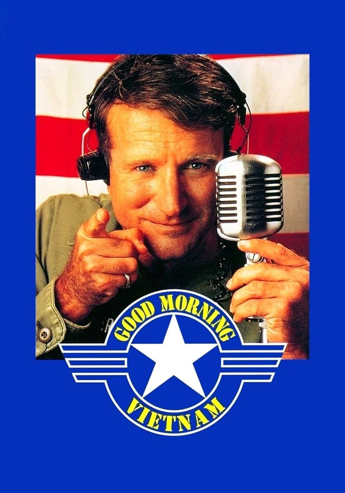
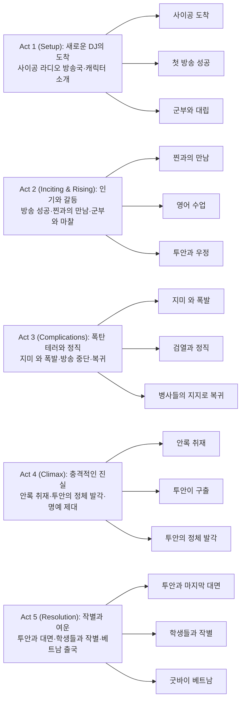

1965년 베트남 사이공, 전쟁의 포성이 울려퍼지는 가운데 한 DJ의 목소리가 병사들에게 희망을 전한다. "Good morning, Vietnam!" 로빈 윌리엄스의 천재적 즉흥 연기가 빛나는 이 영화는 단순한 전쟁 영화를 넘어 인간의 따뜻함과 전쟁의 복잡성을 동시에 포착한 걸작이다.

> **"Good morning, Vietnam! Hey, this is not a test. This is rock and roll!"**  
> - 에이드리언 크로나우어

## 개요

### 영화 정보

* **제목**: Good Morning, Vietnam / 굿모닝 베트남
* **감독**: 배리 레빈슨 (Barry Levinson)
* **각본**: 미치 마코위츠 (Mitch Markowitz)
* **원안**: 에이드리언 크로나우어 (Adrian Cronauer)
* **주연**: 로빈 윌리엄스, 포레스트 휘태커, 브루노 커비, J.T. 월시, 친타라 수카파타나
* **음악**: 알렉스 노스 (Alex North)
* **촬영**: 피터 소바 (Peter Sova)
* **편집**: 스투 린더 (Stu Linder)
* **장르**: 전쟁, 드라마, 코미디
* **상영시간**: 121분
* **개봉일**: 1987.12.23 (미국)
* **제작사**: 터치스톤 픽처스, 실버 스크린 파트너스 III
* **배급사**: 부에나 비스타 픽처스
* **제작비**: 약 1,300만 달러
* **흥행**: 약 1억 2,390만 달러
* **평점**: 로튼 토마토 90%, 메타크리틱 67/100

### 추천 대상

* **로빈 윌리엄스 팬**: 그의 즉흥 연기와 코미디 재능이 최고조에 달한 대표작
* **전쟁 영화를 새로운 시각으로 보고 싶은 관객**: 전투가 아닌 일상에 초점을 맞춘 독특한 접근
* **인간 드라마를 좋아하는 관객**: 웃음과 감동이 교차하는 균형 잡힌 서사

### 작품 소개

**굿모닝 베트남**은 실제 DJ 에이드리언 크로나우어의 경험을 바탕으로 한 전쟁 드라마 코미디다. 1965년 베트남 전쟁 중 사이공의 미군 라디오 방송국을 배경으로, 파격적인 DJ가 병사들에게 웃음과 희망을 전하는 동시에 전쟁의 복잡한 현실과 마주하는 이야기를 그린다.

배리 레빈슨 감독은 전투 장면보다는 일상생활에 초점을 맞춰 베트남 전쟁을 새로운 시각으로 접근했다. 로빈 윌리엄스의 즉흥 연기와 코미디 재능이 최대한 발휘된 이 작품은 그의 대표작 중 하나로 여겨지며, 골든 글로브 남우주연상 수상과 아카데미 남우주연상 후보에 오르는 등 큰 성공을 거두었다.

---

## 구조 분석

## 영화의 전체 내용 (스포일러 포함)

이 섹션은 영화를 이미 관람한 관객을 위한 상세한 줄거리입니다. **스포일러가 100% 포함**되어 있으니 주의하세요.

1965년 베트남 전쟁이 한창인 사이공. 한 DJ가 도착하면서 미군 라디오 방송국에 새로운 바람이 불기 시작한다. 그는 병사들에게 웃음과 희망을 전하지만, 그 과정에서 전쟁의 복잡한 현실과 인간관계의 비극을 마주하게 된다.

### Act 1 (Setup): 새로운 DJ의 도착

**[S01] 사이공 공항 도착**: 1965년, 미공군 일등병 에이드리언 크로나우어(로빈 윌리엄스)가 사이공 공항에 도착한다. 순수하고 친근한 일등병 에드워드 가를릭(포레스트 휘태커)이 그를 맞이하며 라디오 방송국으로 안내한다.

**[S02] 방송국 첫날**: 크로나우어는 AFRS(Armed Forces Radio Service) 방송국의 동료들을 만난다. 규정에 얽매인 스티븐 하우크 중위(브루노 커비)와 권위적인 딕슨 상사(J.T. 월시)는 그를 경계하지만, 테일러 준장(노블 윌링햄)은 새로운 DJ를 환영한다.

**[S03] 첫 방송 - "Good Morning, Vietnam!"**: 크로나우어의 첫 방송이 시작된다. "굿모닝 베트남!"이라는 강렬한 인사와 함께 록앤롤 음악, 즉흥 개그, 다양한 성대모사가 펼쳐진다. 병사들은 열광하지만 하우크와 딕슨은 불편해한다.

**[S04] 병사들의 반응**: 방송은 즉각 병사들 사이에서 큰 인기를 얻는다. 크로나우어의 자유분방한 스타일은 전쟁의 스트레스에 시달리는 병사들에게 웃음과 위안을 제공한다.

**[S05] 검열과의 싸움**: 하우크는 크로나우어의 뉴스 원고를 검열하며 중요한 정보를 삭제한다. 크로나우어는 이에 불만을 표하지만 어쩔 수 없이 따라야 한다.

### Act 2 (Inciting & Rising): 인기와 갈등

**[S06] 찐과의 첫 만남**: 사이공 거리에서 크로나우어는 아름다운 베트남 여성 찐(친타라 수카파타나)을 발견하고 첫눈에 반한다. 그녀를 따라가지만 말을 걸지 못한다.

**[S07] 영어 교실 접근**: 크로나우어는 찐이 다니는 영어 교실을 찾아가 선생을 뇌물로 설득하고 대신 수업을 맡는다. 그는 학생들에게 미국 속어와 유머를 가르치며 인기를 얻는다.

**[S08] 투안과의 만남**: 수업 후 찐의 오빠 투안(톰 T. 트란)이 나타나 크로나우어를 경계한다. 크로나우어는 그에게 친절하게 대하며 우정을 쌓기 시작한다.

**[S09] 지미 와 바 방문**: 크로나우어는 투안을 미군 바 지미 와에 데려간다. 그곳에서 인종 차별적 발언을 하는 백인 병사들과 충돌이 일어나고, 대규모 싸움으로 번진다.

**[S10] 딕슨의 질책**: 딕슨은 크로나우어를 사건의 책임자로 몰아세운다. 크로나우어는 자신이 단지 친구를 데려왔을 뿐이라고 항변하지만 경고를 받는다.

**[S11] 찐과의 데이트**: 투안의 주선으로 크로나우어는 찐과 하루를 함께 보낸다. 하지만 찐은 그에게 로맨틱한 감정을 보이지 않고 거리를 둔다.

**[S12] 지미 와 폭발 사건**: 어느 날 크로나우어는 지미 와에서 휴식을 취하고 있다. 투안이 갑자기 나타나 찐이 밖에서 기다린다며 그를 끌어낸다. 그가 나온 직후 건물이 폭발하며 두 명의 병사가 사망한다.

### Act 3 (Complications): 폭탄 테러와 정직

**[S13] 충격과 의무감**: 크로나우어는 큰 충격을 받는다. 투안이 자신을 구해준 것에 감사하면서도, 폭발 사건을 병사들에게 알려야 한다는 책임감을 느낀다.

**[S14] 미드포인트 - 검열된 뉴스 보도 시도**: 크로나우어는 방송 중 지미 와 폭발 사건을 보도하려 한다. 하지만 딕슨이 방송국 신호를 차단하고, 크로나우어를 방송 부스에서 끌어낸다.

**[S15] 정직 처분**: 딕슨은 크로나우어를 정직시킨다. 크로나우어는 진실을 알릴 권리를 주장하지만 군 명령 앞에 무력하다.

**[S16] 하우크의 실패한 방송**: 하우크가 크로나우어의 시간대를 맡지만, 폴카 음악과 재미없는 개그로 병사들의 비난을 받는다. 방송국에는 크로나우어의 복귀를 요구하는 전화와 편지가 쏟아진다.

**[S17] 테일러의 개입**: 테일러 준장은 하우크에게 크로나우어를 복직시키라고 명령한다. 하지만 크로나우어는 더 이상 문제를 일으키고 싶지 않아 거부한다.

**[S18] 병사들과의 만남**: 교통 체증 중 크로나우어는 전선으로 향하는 1사단 병사들을 만난다. 가를릭의 설득으로 그는 즉석 방송을 해주며 병사들에게 웃음을 선사한다.

**[S19] 복귀 결심**: 많은 병사들이 돌아오지 못할 것임을 깨달은 크로나우어는 자신의 역할이 얼마나 중요한지 다시 한 번 깨닫는다. 그는 방송에 복귀하고 루이 암스트롱의 "What a Wonderful World"를 헌정한다.

### Act 4 (Climax): 충격적인 진실

**[S20] 위험한 취재 승인**: 딕슨은 크로나우어를 제거할 기회를 노린다. 크로나우어가 전선 취재를 요청하자, 딕슨은 베트콩이 장악한 위험 지역 안록(An Lộc)으로 루트를 배정한다.

**[S21] 지뢰 폭발**: 안록으로 가는 길에서 크로나우어와 가를릭의 지프가 지뢰를 밟는다. 두 사람은 부상을 입고 베트콩 순찰대의 위협에 노출된다.

**[S22] 투안의 구조**: 위기의 순간, 투안이 밴을 몰고 나타나 두 사람을 구출한다. 크로나우어는 영어 수업에 나타나지 않은 자신을 투안이 어떻게 찾았는지 의아해한다.

**[S23] 클라이맥스 - 투안의 정체 발각**: 사이공으로 돌아온 크로나우어에게 딕슨은 충격적인 진실을 알려준다. 투안의 본명은 판 둑 토(Phan Duc To)이며, 지미 와 폭탄 테러의 주범인 베트콩 요원이라는 것이다. 안록에서 구조한 것도 우연이 아니었다.

**[S24] 명예 제대 통보**: 딕슨은 크로나우어를 명예 제대 조치하며 조용히 떠날 것을 명령한다. 테일러 준장도 이번에는 도울 수 없다고 말하지만, 딕슨을 괌으로 전출시키는 것으로 작은 복수를 한다.

### Act 5 (Resolution): 작별과 여운

**[S25] 찐을 찾아가다**: 크로나우어는 찐을 찾아가 투안을 만나게 해달라고 간청한다. 찐은 처음에 거부하지만 결국 동의한다.

**[S26] 투안과의 대면**: 뒷골목에서 투안과 마주친 크로나우어는 분노와 배신감으로 그를 추격한다. 투안은 미군이 자신의 마을을 파괴하고 어머니와 친구들을 죽였다고 외친다. 미국이 자신의 진짜 적이라고.

**[S27] 우정의 의미**: 투안은 사라지기 전 안록에서 크로나우어를 구한 것은 우정 때문이었다고 말한다. 이 말은 크로나우어에게 전쟁의 복잡성과 인간관계의 비극을 깨닫게 한다.

**[S28] 마지막 야구 게임**: 공항으로 가기 전, 크로나우어는 영어 수업 학생들과 소프트볼 게임을 한다. 웃음과 눈물이 교차하는 감동적인 작별 시간이다.

**[S29] 작별 메시지**: 크로나우어는 가를릭에게 작별 메시지를 담은 테이프를 남긴다. 테이프는 "굿바이 베트남!"으로 시작해 모든 병사들이 안전하게 집으로 돌아가기를 바라는 따뜻한 메시지로 끝난다.

**[S30] 엔딩 - 새로운 시작**: 가를릭이 새로운 DJ가 되어 크로나우어의 테이프를 방송한다. 크로나우어는 비행기에 올라 베트남을 떠나고, 그의 유산은 방송국과 병사들의 마음에 남는다.

---

## 캐릭터 분석

### 에이드리언 크로나우어 (로빈 윌리엄스)

로빈 윌리엄스는 크로나우어 역할을 통해 자신의 스탠드업 코미디 재능과 연기력을 완벽하게 결합시켰다. 영화 속 모든 라디오 방송 장면은 윌리엄스의 즉흥 연기로 이루어졌으며, 이는 그의 천재적 재능을 여실히 보여준다.

윌리엄스는 단순히 웃음만 주는 것이 아니라 전쟁의 참혹함을 목격하고 성장해가는 인물의 내적 변화를 섬세하게 표현한다. 특히 친구라고 믿었던 투안의 정체를 알게 되는 장면에서의 배신감과 절망은 관객의 마음을 울린다.

### 에드워드 가를릭 (포레스트 휘태커)

포레스트 휘태커는 순수하고 선량한 가를릭을 통해 전쟁 속에서도 변하지 않는 인간의 순수함을 보여준다. 크로나우어의 가장 충실한 친구이자 지지자로서 그의 든든한 동반자 역할을 한다.

휘태커의 연기는 과장되지 않으면서도 캐릭터의 순수함과 따뜻함을 자연스럽게 전달한다. 마지막 장면에서 크로나우어의 후임 DJ가 되어 그의 정신을 이어받는 모습은 감동적이다.

### 스티븐 하우크 중위 (브루노 커비)

브루노 커비는 규정에 얽매인 전형적인 군인 캐릭터를 연기하면서도 단순한 악역이 아닌 나름의 신념을 가진 인물로 그려낸다. 크로나우어와의 대립을 통해 자유와 규율 사이의 갈등을 상징한다.

### 투안/판 둑 토 (톰 T. 트란)

투안 역할은 베트남 전쟁의 복잡성을 상징하는 가장 중요한 캐릭터 중 하나다. 친구와 적, 개인과 이념 사이의 갈등을 보여주며 전쟁이 만들어내는 인간관계의 비극을 형상화한다.

---

## 영상미와 음악

### 시각 효과 / 촬영 / 미학

**색감과 톤**: 피터 소바의 촬영은 1960년대 베트남의 이국적 풍경을 생생하게 담아낸다. 사이공의 거리는 따뜻한 색조로 표현되어 열대 기후의 습기와 열기를 느끼게 하며, 라디오 방송국의 어두운 부스와 대비를 이룬다.

**카메라 워크**: 크로나우어의 방송 장면에서는 즉흥 연기를 포착하기 위해 자유로운 핸드헬드 카메라 기법을 사용한다. 이는 다큐멘터리 스타일의 생동감을 더하며, 윌리엄스의 에너지를 효과적으로 전달한다.

**미장센**: 라디오 방송국의 좁은 부스는 크로나우어의 창의성이 제한된 공간에 갇혀 있음을 상징한다. 반면 사이공 거리의 개방된 공간은 자유와 문화적 다양성을 나타낸다.

**시대 재현**: 1960년대 베트남의 분위기를 재현하기 위해 태국에서 촬영했으며, 의상, 소품, 차량 등 디테일한 시대 고증이 돋보인다. 미군 기지와 베트남 거리의 대비는 두 문화의 충돌을 시각적으로 표현한다.

### 알렉스 노스의 음악

**스코어 스타일**: 알렉스 노스의 오리지널 스코어는 17분으로 짧지만 효과적이다. 재즈와 오케스트라를 결합한 스타일로 1960년대 분위기를 조성하면서도 전쟁의 긴장감을 유지한다.

**1960년대 팝 음악**: 영화의 진짜 음악적 주인공은 당대의 팝 음악이다. The Beach Boys, James Brown, Martha Reeves & The Vandellas 등의 곡들은 단순한 배경음악을 넘어 시대적 아이덴티티와 캐릭터의 감정을 표현하는 핵심 장치다.

**"What a Wonderful World"의 상징성**: 루이 암스트롱의 이 곡은 영화의 아이러니를 완벽하게 포착한다. 전쟁의 참혹함 속에서 아름다운 세상을 노래하는 이 곡은 인간의 희망과 전쟁의 비극을 동시에 표현한다. 이 영화를 통해 20년 만에 재조명받아 미국 차트 32위에 오르는 성과를 거뒀다.

**사운드 디자인**: 라디오 방송의 생동감 넘치는 사운드는 청취자가 실제로 방송을 듣는 듯한 몰입감을 준다. 마이크의 특성과 방송 장비의 사운드를 정교하게 재현했다.

---

## 주제 의식

### 전쟁 속 인간성

**굿모닝 베트남**은 전쟁의 잔혹함보다는 그 속에서도 변하지 않는 인간의 따뜻함과 유머에 주목한다. 크로나우어의 방송은 병사들에게 웃음과 희망을 주는 소중한 시간이며, 이는 전쟁 중에도 인간다움을 잃지 않으려는 노력을 상징한다.

### 소통과 이해

언어와 문화의 장벽을 넘어선 진정한 소통의 가능성을 탐구한다. 크로나우어와 베트남 학생들 사이의 교감, 투안과의 우정은 서로 다른 배경의 사람들도 이해할 수 있음을 보여준다.

### 권위에 대한 저항

군대의 경직된 시스템과 검열에 맞서는 크로나우어의 모습은 개인의 자유와 표현의 중요성을 강조한다. 그의 반항은 단순한 일탈이 아니라 인간적 가치를 지키려는 노력이다.

---

## 역사적 맥락과 의의

### 실화의 각색

실제 에이드리언 크로나우어는 영화 속 인물만큼 유머러스하지 않았다고 한다. 하지만 영화는 그의 경험을 바탕으로 베트남 전쟁의 인간적 면모를 효과적으로 그려냈다.

### 베트남 전쟁 영화의 새로운 접근

1980년대 후반, 베트남 전쟁은 여전히 민감한 주제였다. 《플래툰》, 《풀 메탈 재킷》 등과 달리 이 영화는 코미디를 통해 전쟁을 다루어 새로운 관점을 제시했다.

---

## 성과와 영향

### 박스오피스 성공

1300만 달러의 제작비로 전 세계적으로 1억 2천만 달러 이상의 수익을 올리며 대성공을 거두었다. 이는 베트남 전쟁 소재 영화로는 이례적인 성과였다.

### 로빈 윌리엄스의 커리어

이 영화는 로빈 윌리엄스에게 첫 아카데미상 남우주연상 후보를 안겨주며 그의 연기자로서의 위상을 확고히 했다. 코미디언에서 진정한 배우로의 전환점이 된 작품이다.

### 사운드트랙의 성공

영화 사운드트랙은 루이 암스트롱의 "What a Wonderful World"를 새롭게 부활시켰다. 이 곡은 영화를 통해 새로운 생명을 얻으며 많은 사람들에게 사랑받게 되었다.

---

## 종합 평가

### 최종 평점: ★★★★★ (5.0/5.0)

**장점**:
- **로빈 윌리엄스의 천재적 연기**: 즉흥 코미디와 정통 드라마 연기의 완벽한 조화, 그의 대표작
- **독창적인 전쟁 영화 접근**: 전투가 아닌 일상에 초점을 맞춘 새로운 시각
- **균형 잡힌 톤**: 웃음과 감동, 코미디와 드라마의 절묘한 균형
- **시대적 분위기 재현**: 1960년대 베트남과 팝 음악의 생생한 묘사
- **의미 있는 메시지**: 전쟁 속 인간성, 소통의 중요성, 우정과 배신의 복잡성
- **뛰어난 기술적 완성도**: 촬영, 편집, 사운드 디자인의 완성도

**단점**:
- **일부 예측 가능한 전개**: 전형적인 드라마 구조를 따르는 부분
- **로맨스 라인의 부족**: 찐과의 관계가 충분히 발전하지 못함
- **베트남 시점의 제한**: 주로 미군 관점에서 전개되는 서사

### 한 줄 평

"로빈 윌리엄스의 즉흥 코미디와 전쟁의 비극이 만나 웃음과 눈물로 인간성을 노래하는 불멸의 걸작."

### 추천 작품

- 《굿 윌 헌팅》(1997): 로빈 윌리엄스의 또 다른 대표작으로 코미디와 드라마의 균형이 돋보임
- 《플래툰》(1986): 같은 시기 개봉한 베트남 전쟁 영화, 전투 장면에 초점
- 《풀 메탈 재킷》(1987): 스탠리 큐브릭의 베트남 전쟁 영화, 군대 시스템 비판
- 《포레스트 검프》(1994): 베트남 전쟁을 포함한 미국 현대사를 다룬 드라마
- 《굿모닝 타이완》(실제 존재하지 않음): 이 영화의 속편 시나리오가 작성되었으나 제작되지 않음

### 관람 전 체크리스트

- **사전 지식이 필요한가?** 베트남 전쟁에 대한 기본 지식이 있으면 좋지만 필수는 아님. 영화 자체로 충분히 이해 가능
- **어린이와 함께 볼 수 있는가?** R등급 (청소년 관람불가). 전쟁 폭력, 욕설, 성적 언급이 포함됨
- **특정 요소를 기대해도 되는가?** 로빈 윌리엄스의 즉흥 코미디, 1960년대 팝 음악, 감동적인 드라마 전개
- **쿠키 영상이 있는가?** 없음
- **속편 가능성은?** 없음. 1992년 《굿모닝 시카고》 시나리오가 작성되었으나 제작 취소됨

### 인상적인 장면들

**[S03] 첫 방송 장면**: "굿모닝 베트남!"으로 시작되는 크로나우어의 첫 방송은 영화의 톤을 완벽하게 설정하는 명장면이다. 윌리엄스의 에너지가 폭발하는 순간.

**[S07] 영어 수업**: 베트남 학생들에게 미국 속어를 가르치는 장면은 문화 간 소통의 재미와 의미를 동시에 보여주는 따뜻한 장면.

**[S12] 지미 와 폭발**: 투안이 크로나우어를 구해내는 장면은 영화의 전환점이 되며 긴장감을 극대화한다.

**[S23] 투안의 정체 발각**: 친구가 적이었다는 충격적 반전은 전쟁의 복잡성을 압축적으로 보여준다.

**[S26] 투안과의 마지막 대면**: 진실을 알게 된 후 투안과의 대결은 전쟁이 만든 인간관계의 비극을 가슴 아프게 그린다.

**[S30] 작별 방송**: 가를릭이 들려주는 크로나우어의 마지막 메시지는 따뜻하고 감동적인 마무리를 제공한다.

---

## 결론

**굿모닝 베트남**은 로빈 윌리엄스의 대표작이자 베트남 전쟁 영화의 독특한 걸작이다. 배리 레빈슨 감독은 전쟁의 참혹함을 직접적으로 보여주는 대신 일상 속에서 벌어지는 인간 드라마에 초점을 맞춰 새로운 관점을 제시했다.

로빈 윌리엄스는 이 영화를 통해 단순한 코미디언이 아닌 진정한 배우임을 증명했다. 그의 즉흥 연기는 자연스럽고 진정성 있으며, 동시에 깊은 감정적 울림을 제공한다. 웃음과 눈물이 교차하는 그의 연기는 관객들에게 잊을 수 없는 인상을 남긴다.

영화는 전쟁이라는 극한 상황에서도 변하지 않는 인간의 따뜻함과 유머의 힘을 보여준다. 크로나우어의 방송은 단순한 오락이 아니라 절망적인 현실에서 희망을 찾게 해주는 소중한 시간이었다.

**굿모닝 베트남**의 가장 큰 성취는 복잡하고 민감한 베트남 전쟁을 인간적 관점에서 접근하여 보편적 감동을 이끌어낸 것이다. 이념과 국경을 넘어선 인간 대 인간의 이해와 소통의 가능성을 보여주며, 전쟁의 진정한 비극은 사람들 사이의 연결고리가 끊어지는 것임을 깨닫게 한다.

30여 년이 지난 지금도 이 영화가 주는 메시지는 여전히 유효하다. 서로 다른 배경의 사람들이 이해하고 소통할 수 있다는 희망, 그리고 가장 절망적인 상황에서도 웃음과 따뜻함을 잃지 않는 인간의 불굴의 정신은 시대를 초월한 가치다.

로빈 윌리엄스의 "Good morning, Vietnam!"이라는 외침은 단순한 인사말을 넘어 희망과 저항의 상징이 되었다. 이 영화는 전쟁 영화의 새로운 가능성을 제시했으며, 코미디와 드라마의 완벽한 조화로 관객들에게 잊을 수 없는 감동을 선사한다.

*"Good morning, Vietnam! And good morning to cinema!"*

---

## 참고 문헌 및 출처

- [Good Morning, Vietnam — Wikipedia](https://en.wikipedia.org/wiki/Good_Morning,_Vietnam)
- [Good Morning, Vietnam — IMDb](https://www.imdb.com/title/tt0093105/)
- [Good Morning, Vietnam — Rotten Tomatoes](https://www.rottentomatoes.com/m/good_morning_vietnam)
- [The 60th Academy Awards (1988) — Oscars.org](https://www.oscars.org/oscars/ceremonies/1988)
- [AFI's 100 Years...100 Laughs — American Film Institute](https://www.afi.com/afis-100-years-100-laughs/) 