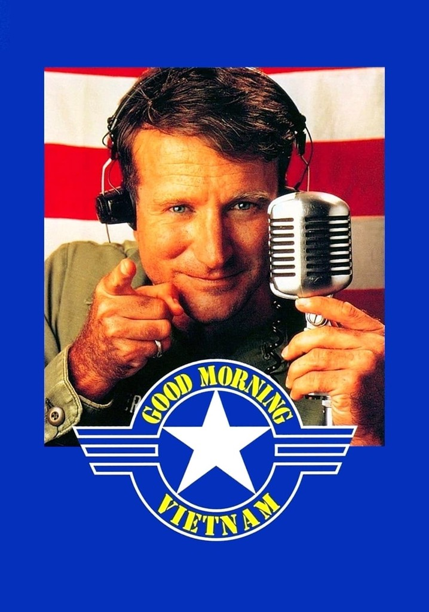
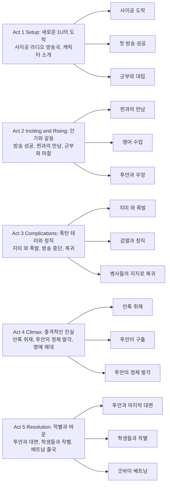

1965년 베트남 사이공, 전쟁의 포성이 울려퍼지는 가운데 한 DJ의 목소리가 병사들에게 희망을 전한다. "Good morning, Vietnam!" 로빈 윌리엄스의 천재적 즉흥 연기가 빛나는 이 영화는 단순한 전쟁 영화를 넘어 인간의 따뜻함과 전쟁의 복잡성을 동시에 포착한 걸작이다.

> **"Good morning, Vietnam! Hey, this is not a test. This is rock and roll!"**  
> — 에이드리언 크로나우어

## 개요

### 영화 정보

* **제목**: Good Morning, Vietnam / 굿모닝 베트남
* **감독**: 배리 레빈슨 (Barry Levinson)
* **각본**: 미치 마코위츠 (Mitch Markowitz)
* **원안**: 에이드리언 크로나우어 (Adrian Cronauer)
* **주연**: 로빈 윌리엄스, 포레스트 휘태커, 브루노 커비, J.T. 월시, 친타라 수카파타나
* **음악**: 알렉스 노스 (Alex North)
* **촬영**: 피터 소바 (Peter Sova)
* **편집**: 스투 린더 (Stu Linder)
* **장르**: 전쟁, 드라마, 코미디
* **상영시간**: 121분
* **개봉일**: 1987.12.23 (미국)
* **제작사**: 터치스톤 픽처스, 실버 스크린 파트너스 III
* **배급사**: 부에나 비스타 픽처스
* **제작비**: 약 1,300만 달러
* **흥행**: 약 1억 2,390만 달러
* **평점**: 로튼 토마토 90%, 메타크리틱 67/100

### 추천 대상

* **로빈 윌리엄스 팬**: 그의 즉흥 연기와 코미디 재능이 최고조에 달한 대표작
* **전쟁 영화를 새로운 시각으로 보고 싶은 관객**: 전투가 아닌 일상과 라디오에 초점을 맞춘 독특한 접근
* **인간 드라마를 좋아하는 관객**: 웃음과 감동이 교차하는 균형 잡힌 서사

## 구조 분석

```mermaid
flowchart LR
    Act1["Act 1 Setup: 새로운 DJ의 도착</br>사이공 라디오 방송국, 캐릭터 소개"]
    Act2["Act 2 Inciting and Rising: 인기와 갈등</br>방송 성공, 찐과의 만남, 군부와 마찰"]
    Act3["Act 3 Complications: 폭탄 테러와 정직</br>지미 와 폭발, 방송 중단, 복귀"]
    Act4["Act 4 Climax: 충격적인 진실</br>안록 취재, 투안의 정체 발각, 명예 제대"]
    Act5["Act 5 Resolution: 작별과 여운</br>투안과 대면, 학생들과 작별, 베트남 출국"]
    Act1 --> Act1a["사이공 도착"]
    Act1 --> Act1b["첫 방송 성공"]
    Act1 --> Act1c["군부와 대립"]
    Act2 --> Act2a["찐과의 만남"]
    Act2 --> Act2b["영어 수업"]
    Act2 --> Act2c["투안과 우정"]
    Act3 --> Act3a["지미 와 폭발"]
    Act3 --> Act3b["검열과 정직"]
    Act3 --> Act3c["병사들의 지지로 복귀"]
    Act4 --> Act4a["안록 취재"]
    Act4 --> Act4b["투안이 구출"]
    Act4 --> Act4c["투안의 정체 발각"]
    Act5 --> Act5a["투안과 마지막 대면"]
    Act5 --> Act5b["학생들과 작별"]
    Act5 --> Act5c["굿바이 베트남"]
```

## 영화의 전체 내용 (스포일러 포함)

이 섹션은 영화를 이미 관람한 관객을 위한 상세한 줄거리입니다. **스포일러가 100% 포함**되어 있으니 주의하세요.

1965년 베트남 전쟁이 한창인 사이공. 한 DJ가 도착하면서 미군 라디오 방송국에 새로운 바람이 불기 시작한다. 그는 병사들에게 웃음과 희망을 전하지만, 그 과정에서 전쟁의 복잡한 현실과 인간관계의 비극을 마주하게 된다.

### Act 1 (Setup): 새로운 DJ의 도착

**크로나우어의 사이공 부임과 AFRS 방송국 적응, 첫 방송의 성공과 군 상층부와의 마찰이 그려진다.**

**[S01] 사이공 공항 도착**: 1965년, 미공군 일등병 에이드리언 크로나우어(로빈 윌리엄스)가 사이공 공항에 도착한다. 순수하고 친근한 일등병 에드워드 가를릭(포레스트 휘태커)이 그를 맞이하며 라디오 방송국으로 안내한다.

**[S02] 방송국 첫날**: 크로나우어는 AFRS(Armed Forces Radio Service) 방송국의 동료들을 만난다. 규정에 얽매인 스티븐 하우크 중위(브루노 커비)와 권위적인 딕슨 상사(J.T. 월시)는 그를 경계하지만, 테일러 준장(노블 윌링햄)은 새로운 DJ를 환영한다.

**[S03] 첫 방송 - "Good Morning, Vietnam!"**: 크로나우어의 첫 방송이 시작된다. "굿모닝 베트남!"이라는 강렬한 인사와 함께 록앤롤 음악, 즉흥 개그, 다양한 성대모사가 펼쳐진다. 병사들은 열광하지만 하우크와 딕슨은 불편해한다.

**[S04] 병사들의 반응**: 방송은 즉각 병사들 사이에서 큰 인기를 얻는다. 크로나우어의 자유분방한 스타일은 전쟁의 스트레스에 시달리는 병사들에게 웃음과 위안을 제공한다.

**[S05] 검열과의 싸움**: 하우크는 크로나우어의 뉴스 원고를 검열하며 중요한 정보를 삭제한다. 크로나우어는 이에 불만을 표하지만 어쩔 수 없이 따라야 한다.

### Act 2 (Inciting & Rising): 인기와 갈등

**찐을 향한 크로나우어의 관심, 영어 수업과 투안과의 우정, 지미 와 폭발까지 인기와 갈등이 겹친다.**

**[S06] 찐과의 첫 만남**: 사이공 거리에서 크로나우어는 아름다운 베트남 여성 찐(친타라 수카파타나)을 발견하고 첫눈에 반한다. 그녀를 따라가지만 말을 걸지 못한다.

**[S07] 영어 교실 접근**: 크로나우어는 찐이 다니는 영어 교실을 찾아가 선생을 뇌물로 설득하고 대신 수업을 맡는다. 그는 학생들에게 미국 속어와 유머를 가르치며 인기를 얻는다.

**[S08] 투안과의 만남**: 수업 후 찐의 오빠 투안(톰 T. 트란)이 나타나 크로나우어를 경계한다. 크로나우어는 그에게 친절하게 대하며 우정을 쌓기 시작한다.

**[S09] 지미 와 바 방문**: 크로나우어는 투안을 미군 바 지미 와에 데려간다. 그곳에서 인종 차별적 발언을 하는 백인 병사들과 충돌이 일어나고, 대규모 싸움으로 번진다.

**[S10] 딕슨의 질책**: 딕슨은 크로나우어를 사건의 책임자로 몰아세운다. 크로나우어는 자신이 단지 친구를 데려왔을 뿐이라고 항변하지만 경고를 받는다.

**[S11] 찐과의 데이트**: 투안의 주선으로 크로나우어는 찐과 하루를 함께 보낸다. 하지만 찐은 그에게 로맨틱한 감정을 보이지 않고 거리를 둔다.

**[S12] 지미 와 폭발 사건**: 어느 날 크로나우어는 지미 와에서 휴식을 취하고 있다. 투안이 갑자기 나타나 찐이 밖에서 기다린다며 그를 끌어낸다. 그가 나온 직후 건물이 폭발하며 두 명의 병사가 사망한다.

### Act 3 (Complications): 폭탄 테러와 정직

**폭발 보도 시도와 검열, 정직, 하우크의 실패한 방송, 병사들과의 만남을 거쳐 복귀까지.**

**[S13] 충격과 의무감**: 크로나우어는 큰 충격을 받는다. 투안이 자신을 구해준 것에 감사하면서도, 폭발 사건을 병사들에게 알려야 한다는 책임감을 느낀다.

**[S14] 미드포인트 - 검열된 뉴스 보도 시도**: 크로나우어는 방송 중 지미 와 폭발 사건을 보도하려 한다. 하지만 딕슨이 방송국 신호를 차단하고, 크로나우어를 방송 부스에서 끌어낸다.

**[S15] 정직 처분**: 딕슨은 크로나우어를 정직시킨다. 크로나우어는 진실을 알릴 권리를 주장하지만 군 명령 앞에 무력하다.

**[S16] 하우크의 실패한 방송**: 하우크가 크로나우어의 시간대를 맡지만, 폴카 음악과 재미없는 개그로 병사들의 비난을 받는다. 방송국에는 크로나우어의 복귀를 요구하는 전화와 편지가 쏟아진다.

**[S17] 테일러의 개입**: 테일러 준장은 하우크에게 크로나우어를 복직시키라고 명령한다. 하지만 크로나우어는 더 이상 문제를 일으키고 싶지 않아 거부한다.

**[S18] 병사들과의 만남**: 교통 체증 중 크로나우어는 전선으로 향하는 1사단 병사들을 만난다. 가를릭의 설득으로 그는 즉석 방송을 해주며 병사들에게 웃음을 선사한다.

**[S19] 복귀 결심**: 많은 병사들이 돌아오지 못할 것임을 깨달은 크로나우어는 자신의 역할이 얼마나 중요한지 다시 한 번 깨닫는다. 그는 방송에 복귀하고 루이 암스트롱의 "What a Wonderful World"를 헌정한다.

### Act 4 (Climax): 충격적인 진실

**안록 취재, 지뢰와 투안의 구출, 그리고 투안이 베트콩 요원이라는 충격적 진실이 밝혀진다.**

**[S20] 위험한 취재 승인**: 딕슨은 크로나우어를 제거할 기회를 노린다. 크로나우어가 전선 취재를 요청하자, 딕슨은 베트콩이 장악한 위험 지역 안록(An Lộc)으로 루트를 배정한다.

**[S21] 지뢰 폭발**: 안록으로 가는 길에서 크로나우어와 가를릭의 지프가 지뢰를 밟는다. 두 사람은 부상을 입고 베트콩 순찰대의 위협에 노출된다.

**[S22] 투안의 구조**: 위기의 순간, 투안이 밴을 몰고 나타나 두 사람을 구출한다. 크로나우어는 영어 수업에 나타나지 않은 자신을 투안이 어떻게 찾았는지 의아해한다.

**[S23] 클라이맥스 - 투안의 정체 발각**: 사이공으로 돌아온 크로나우어에게 딕슨은 충격적인 진실을 알려준다. 투안의 본명은 판 둑 토(Phan Duc To)이며, 지미 와 폭탄 테러의 주범인 베트콩 요원이라는 것이다. 안록에서 구조한 것도 우연이 아니었다.

**[S24] 명예 제대 통보**: 딕슨은 크로나우어를 명예 제대 조치하며 조용히 떠날 것을 명령한다. 테일러 준장도 이번에는 도울 수 없다고 말하지만, 딕슨을 괌으로 전출시키는 것으로 작은 복수를 한다.

### Act 5 (Resolution): 작별과 여운

**투안과의 마지막 대면, 학생들과의 작별, 굿바이 베트남 메시지로 이야기가 마무리된다.**

**[S25] 찐을 찾아가다**: 크로나우어는 찐을 찾아가 투안을 만나게 해달라고 간청한다. 찐은 처음에 거부하지만 결국 동의한다.

**[S26] 투안과의 대면**: 뒷골목에서 투안과 마주친 크로나우어는 분노와 배신감으로 그를 추격한다. 투안은 미군이 자신의 마을을 파괴하고 어머니와 친구들을 죽였다고 외친다. 미국이 자신의 진짜 적이라고.

**[S27] 우정의 의미**: 투안은 사라지기 전 안록에서 크로나우어를 구한 것은 우정 때문이었다고 말한다. 이 말은 크로나우어에게 전쟁의 복잡성과 인간관계의 비극을 깨닫게 한다.

**[S28] 마지막 야구 게임**: 공항으로 가기 전, 크로나우어는 영어 수업 학생들과 소프트볼 게임을 한다. 웃음과 눈물이 교차하는 감동적인 작별 시간이다.

**[S29] 작별 메시지**: 크로나우어는 가를릭에게 작별 메시지를 담은 테이프를 남긴다. 테이프는 "굿바이 베트남!"으로 시작해 모든 병사들이 안전하게 집으로 돌아가기를 바라는 따뜻한 메시지로 끝난다.

**[S30] 엔딩 - 새로운 시작**: 가를릭이 새로운 DJ가 되어 크로나우어의 테이프를 방송한다. 크로나우어는 비행기에 올라 베트남을 떠나고, 그의 유산은 방송국과 병사들의 마음에 남는다.

---

## 캐릭터 분석

### 에이드리언 크로나우어 / 로빈 윌리엄스

**개요**: 미공군 AFRS DJ. 사이공에 부임해 "Good morning, Vietnam!"으로 병사들에게 웃음과 록앤롤을 전하는 자유분방한 인물이다. 군 규정과 검열과는 맞서고, 베트남인 학생들과 영어 수업으로 소통을 시도한다.

**성장 곡선**: 초반에는 규칙을 무시하고 오직 방송과 웃음에만 집중한다. 지미 와 폭발과 정직을 겪으며 현실의 무게를 느끼고, 전선으로 향하는 병사들과 만난 뒤 자신의 역할을 다시 받아들인다. 투안의 정체를 알게 된 뒤에는 분노와 배신감 속에서도 전쟁이 만든 비극을 직시하고, 작별 메시지로 병사들에게 희망을 남긴다.

**동기와 욕망**: 병사들에게 웃음과 위안을 주고 싶어 하며, 진실을 알리는 방송을 하고 싶어 한다. 찐에 대한 로맨틱한 감정과 베트남인들과의 진정한 교류에 대한 욕구도 보인다.

**갈등 구조**: 군 상층부(딕슨, 하우크)와의 검열·규칙 갈등, 개인의 자유와 군대 질서 사이의 갈등, 친구로 믿었던 투안의 배신과 이념과 우정 사이의 갈등.

**상징적 의미**: 전쟁 속에서도 유머와 인간성을 지키려는 저항자이자, 소통과 진실을 추구하다 체제에 짓밟히는 인물. 코미디와 드라마의 경계에 선 '전쟁 속 DJ'의 상징이다.

로빈 윌리엄스는 라디오 방송 장면 대부분을 즉흥으로 연기했으며, 골든 글로브 남우주연상 수상과 아카데미 남우주연상 후보에 올랐다.

### 에드워드 가를릭 / 포레스트 휘태커

**개요**: 일등병으로 크로나우어의 전담 드라이버이자 가장 가까운 동료. 순수하고 성실하며 크로나우어를 끝까지 지지한다.

**성장 곡선**: 처음에는 새로 온 DJ를 안내하는 조용한 조력자다. 크로나우어가 정직당하고 좌절할 때 설득하고, 전선으로 가는 병사들 앞에서 그가 즉석 방송을 하도록 이끈다. 마지막에는 크로나우어의 후임 DJ가 되어 "굿바이 베트남" 테이프를 방송하며 정신을 이어받는다.

**동기와 욕망**: 크로나우어의 방송이 병사들에게 얼마나 중요한지 믿고, 그가 다시 마이크 앞에 서길 바란다. 전쟁 속에서도 인간적인 유대를 지키고 싶어 한다.

**갈등 구조**: 군인으로서의 복종과 크로나우어에 대한 충성 사이에서 후자를 선택한다. 직접적인 대립보다는 조용한 지지자로 서서 갈등을 완화한다.

**상징적 의미**: 전쟁 속에서 변하지 않는 순수함과 우정, 그리고 크로나우어의 유산을 이어받는 '다음 세대'를 상징한다.

### 스티븐 하우크 중위 / 브루노 커비

**개요**: AFRS 방송국의 중위로, 규정과 원고 검열을 철저히 따른다. 크로나우어의 자유로운 방송 스타일에 반대하는 대표 인물이다.

**성장 곡선**: 처음부터 끝까지 규칙 준수와 검열을 고수한다. 크로나우어 정직 후 그의 시간대를 맡지만 폴카와 어색한 개그로 병사들의 반발을 사고, 결국 테일러 준장의 지시로 크로나우어를 복직시키라는 명을 받는다. 캐릭터 자체의 큰 변화보다는 '규율 대 자유'의 한 축을 담당한다.

**동기와 욕망**: 군 방송의 규정을 지키고, 위에서 내려온 지침에 맞는 방송을 하고 싶어 한다. 악의가 아니라 신념에 따른 행동이다.

**갈등 구조**: 크로나우어와의 방송 철학 갈등. 자신이 맡은 방송이 병사들에게 외면당하는 수치심과 좌절.

**상징적 의미**: 군대와 검열 체제, '규율과 통제'를 상징한다. 단순 악역이 아니라 체제를 대표하는 인물로, 코미디의 상대역을 이룬다.

### 투안 / 판 둑 토 / 톰 T. 트란(톰 트란)

**개요**: 찐의 오빠로, 영어 수업을 통해 크로나우어와 가까워진 베트남인 청년. 실제 정체는 베트콩 요원 판 둑 토(Phan Duc To)다.

**성장 곡선**: 처음에는 크로나우어를 경계하는 오빠로 등장한다. 지미 와에 갔다가 크로나우어를 폭발 직전에 끌어내 구하고, 안록에서도 그를 구출한다. 정체가 드러난 뒤 크로나우어와의 마지막 대면에서 "미군이 내 마을을 파괴하고 어머니와 친구를 죽였다"며 적대와 한을 토로하지만, "너를 구한 것은 우정 때문이었다"고 말하며 사라진다.

**동기와 욕망**: 이념으로서는 베트콩 요원으로 미군에 맞선다. 개인적으로는 크로나우어와의 우정을 완전히 부정하지 못하고, 그를 살려준 선택을 한다.

**갈등 구조**: 적(미군)과 친구(크로나우어) 사이의 내적 갈등. 임무와 개인적 유대 사이의 갈등. 전쟁이 만든 '적과 동지'의 이중성.

**상징적 의미**: 전쟁의 복잡성과 인간관계의 비극을 상징한다. 친구이자 적인 존재를 통해 영화는 단순한 선악 구도를 넘어선다.

---

## 영상미와 음악

### 시각 효과 / 촬영 / 미학

**색감과 톤**: 피터 소바의 촬영은 1960년대 베트남의 이국적 풍경을 생생하게 담아낸다. 사이공의 거리는 따뜻한 색조로 표현되어 열대 기후의 습기와 열기를 느끼게 하며, 라디오 방송국의 어두운 부스와 대비를 이룬다.

**카메라 워크**: 크로나우어의 방송 장면에서는 즉흥 연기를 포착하기 위해 자유로운 핸드헬드 카메라 기법을 사용한다. 다큐멘터리 스타일의 생동감을 더하며, 윌리엄스의 에너지를 효과적으로 전달한다.

**미장센**: 라디오 방송국의 좁은 부스는 크로나우어의 창의성이 제한된 공간에 갇혀 있음을 상징한다. 반면 사이공 거리의 개방된 공간은 자유와 문화적 다양성을 나타낸다.

**시대 재현**: 1960년대 베트남 분위기를 재현하기 위해 태국에서 촬영했으며, 의상, 소품, 차량 등 디테일한 시대 고증이 돋보인다. 미군 기지와 베트남 거리의 대비는 두 문화의 충돌을 시각적으로 표현한다.

### 음악감독의 음악

**스코어 스타일**: 알렉스 노스의 오리지널 스코어는 17분으로 짧지만 효과적이다. 재즈와 오케스트라를 결합한 스타일로 1960년대 분위기를 조성하면서도 전쟁의 긴장감을 유지한다.

**1960년대 팝 음악**: 영화의 음악적 핵심은 당대 팝이다. The Beach Boys, James Brown, Martha Reeves & The Vandellas 등의 곡은 단순한 배경음악을 넘어 시대적 아이덴티티와 캐릭터의 감정을 표현하는 장치다.

**"What a Wonderful World"의 상징성**: 루이 암스트롱의 이 곡은 전쟁의 참혹함 속에서 아름다운 세상을 노래하는 아이러니를 포착한다. 이 영화를 통해 20년 만에 재조명받아 미국 차트 32위에 오르는 성과를 거뒀다.

**사운드 디자인**: 라디오 방송의 생동감 넘치는 사운드는 청취자가 실제로 방송을 듣는 듯한 몰입감을 준다. 마이크와 방송 장비의 사운드를 정교하게 재현했다.

---

## 종합 평가

### 최종 평점: ★★★★☆ (4.0/5.0)

**장점**:
- 로빈 윌리엄스의 즉흥 코미디와 정통 드라마 연기의 조화, 골든 글로브·아카데미 후보에 빛나는 대표작
- 전투가 아닌 일상과 라디오에 초점을 맞춘 독창적인 전쟁 영화 접근
- 웃음과 감동, 코미디와 드라마의 균형 잡힌 톤
- 1960년대 베트남과 팝 음악의 생생한 시대적 분위기 재현
- 전쟁 속 인간성, 소통의 중요성, 우정과 배신의 복잡성을 다룬 의미 있는 메시지
- 촬영, 편집, 사운드 디자인의 뛰어난 완성도

**단점**:
- 일부 예측 가능한 드라마 구조와 전형적인 전개
- 찐과의 로맨스 라인이 충분히 발전하지 못함
- 주로 미군 시점에서 서사가 전개되어 베트남 시선은 제한적

### 한 줄 평

"로빈 윌리엄스의 즉흥 코미디와 전쟁의 비극이 만나, 웃음과 눈물로 인간성을 노래하는 불멸의 걸작."

### 추천 작품

- 《굿 윌 헌팅》(1997): 로빈 윌리엄스의 또 다른 대표작으로 코미디와 드라마의 균형이 돋보이는 작품
- 《플래툰》(1986): 같은 시기 개봉한 베트남 전쟁 영화로, 전투와 병사들의 일상에 초점
- 《풀 메탈 재킷》(1987): 스탠리 큐브릭의 베트남 전쟁 영화, 군대 시스템과 전쟁의 비인간성 비판
- 《포레스트 검프》(1994): 베트남 전쟁을 포함한 미국 현대사를 다룬 드라마

### 관람 전 체크리스트

- **사전 지식이 필요한가?** 베트남 전쟁에 대한 기본 지식이 있으면 좋지만 필수는 아님. 영화만으로도 충분히 이해 가능하다.
- **어린이와 함께 볼 수 있는가?** R등급(청소년 관람불가). 전쟁 폭력, 욕설, 성적 언급이 포함된다.
- **특정 요소를 기대해도 되는가?** 로빈 윌리엄스의 즉흥 코미디, 1960년대 팝 음악, 감동적인 드라마 전개를 기대해도 좋다.
- **쿠키 영상이 있는가?** 없다.
- **속편 가능성은?** 없다. 1992년 《굿모닝 시카고》 시나리오가 작성되었으나 제작 취소되었다.

---

## 결론

**굿모닝 베트남**은 로빈 윌리엄스의 대표작이자 베트남 전쟁 영화의 독특한 걸작이다. 배리 레빈슨 감독은 전쟁의 참혹함을 직접적으로 보여주는 대신, 일상 속 라디오와 인간 드라마에 초점을 맞춰 새로운 관점을 제시했다. 로빈 윌리엄스는 이 영화를 통해 코미디언을 넘어 진정한 연기자임을 증명했고, 전쟁이라는 극한 상황에서도 변하지 않는 인간의 따뜻함과 유머의 힘을 보여준다. 이념과 국경을 넘어선 인간 대 인간의 이해와 소통의 가능성, 그리고 "Good morning, Vietnam!"이라는 희망의 메시지는 시대를 초월한 가치로 남는다.

---

## 참고 문헌 및 출처

- [Good Morning, Vietnam — Wikipedia](https://en.wikipedia.org/wiki/Good_Morning,_Vietnam)
- [Good Morning, Vietnam — Rotten Tomatoes](https://www.rottentomatoes.com/m/good_morning_vietnam)
- [Good Morning, Vietnam — IMDb](https://www.imdb.com/title/tt0093105/)
- [The 60th Academy Awards (1988) — Oscars.org](https://www.oscars.org/oscars/ceremonies/1988)
- [AFI's 100 Years...100 Laughs — American Film Institute](https://www.afi.com/afis-100-years-100-laughs/)
