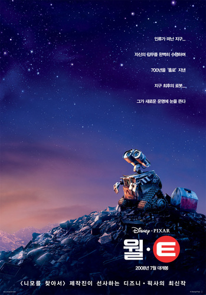
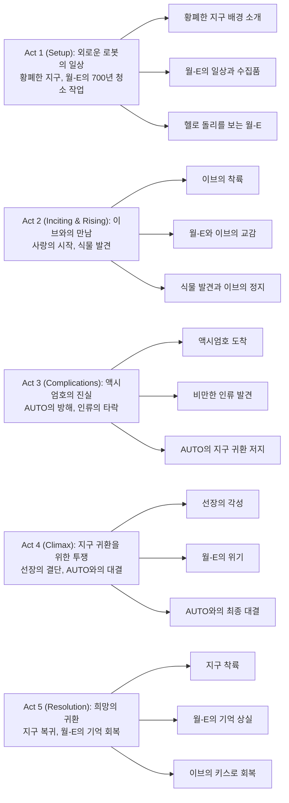

700년 동안 혼자 쓰레기 더미 속에서 일하던 작은 청소 로봇이 우주에서 온 세련된 탐사 로봇을 만나 사랑에 빠지고, 그 사랑이 전 인류를 변화시킨다면? 픽사가 선사하는 이 감동적인 이야기는 대사가 거의 없는 전반부에서도 완벽한 감정 전달을 이루어내며, 환경 파괴와 소비주의에 대한 경고를 담으면서도 결코 희망을 잃지 않는 메시지를 전달합니다.

## 개요

### 영화 정보
* **제목**: WALL·E / 월-E
* **감독**: Andrew Stanton (앤드류 스탠튼)
* **각본**: Andrew Stanton, Jim Reardon, Pete Docter (스토리)
* **주연**: Ben Burtt (WALL·E), Elissa Knight (EVE), Jeff Garlin (Captain)
* **음악**: Thomas Newman
* **장르**: SF, Animation, Family, Adventure, Romance
* **상영시간**: 98분 (1시간 38분)
* **개봉일**: 2008.06.27 (미국), 2008.08.06 (한국)
* **제작사**: Pixar Animation Studios
* **배급사**: Walt Disney Pictures
* **제작비**: 약 1억 8천만 달러
* **평점**: 
  - IMDb 8.4/10 (1.3M)
  - Rotten Tomatoes 95% (Certified Fresh, 258 Reviews)
  - Rotten Tomatoes Audience 90% (250,000+ Ratings)
  - Metascore 95/100

### 추천 대상
* **환경 메시지에 관심 있는 관객**: 환경 파괴의 위험성을 설교적이지 않게 전달하는 메시지
* **로맨스를 좋아하는 관객**: 대사 없이도 감동적인 순수한 사랑 이야기
* **픽사 팬과 애니메이션 애호가**: 픽사의 기술적·예술적 정점을 보여주는 걸작
* **가족 관객**: 어린이부터 어른까지 모두가 즐길 수 있는 전연령 영화
* **SF 팬**: 디스토피아와 우주를 배경으로 한 창의적인 세계관

## 구조 분석 (Act 5단계)

## 영화의 전체 내용 (스포일러 포함)

본 섹션은 영화를 이미 관람한 분들을 위한 상세한 줄거리입니다. **스포일러가 100% 포함되어 있으니 아직 관람하지 않으신 분은 주의해 주세요.**

서기 2805년, 700년 동안 쓰레기로 뒤덮인 지구에서 홀로 청소 작업을 하던 작은 로봇이 우주에서 온 탐사 로봇을 만나 사랑에 빠지고, 그 사랑이 결국 전 인류를 지구로 되돌려 새로운 삶을 시작하게 만드는 감동적인 여정입니다.

### Act 1 (Setup): 외로운 로봇의 일상

**[S01] 황폐한 지구**: 영화는 서기 2805년의 지구로 시작됩니다. 거대한 쓰레기 산으로 뒤덮인 황폐한 풍경, 하늘을 찌를 듯한 쓰레기 마천루들, 그리고 먼지 폭풍이 몰아치는 황량한 도시의 모습이 펼쳐집니다.

**[S02] 월-E의 등장**: 작은 청소 로봇 WALL·E (Waste Allocation Load Lifter - Earth class)가 등장합니다. 그는 700년 동안 혼자 쓰레기를 큐브로 압축하여 쌓아올리는 작업을 해왔습니다.

**[S03] 수집품들**: 월-E는 쓰레기 더미 속에서 발견한 흥미로운 물건들을 수집합니다. 라이터, 루빅스 큐브, 포크, 전구 등 인간 문명의 유물들을 소중히 간직하고 있습니다.

**[S04] 유일한 친구**: 월-E의 유일한 친구는 바퀴벌레 한 마리입니다. 이 작은 생명체는 월-E와 함께 생활하며, 월-E의 외로움을 달래주는 존재입니다.

**[S05] 헬로 돌리**: 밤이 되면 월-E는 낡은 컨테이너 집으로 돌아가 VHS 테이프로 뮤지컬 《헬로 돌리》를 반복해서 봅니다. 특히 "Put On Your Sunday Clothes"와 손을 잡는 장면에 매료되어 있습니다.

**[S06] 사랑에 대한 동경**: 월-E는 《헬로 돌리》의 주인공들이 손을 잡는 장면을 보며 자신도 누군가와 그렇게 하고 싶어 합니다. 그는 스스로의 손을 잡아보며 사랑을 갈망합니다.

### Act 2 (Inciting & Rising): 이브와의 만남

**[S07] 우주선 착륙**: 어느 날 거대한 우주선이 지구에 착륙합니다. 그 안에서 세련되고 미래적인 디자인의 탐사 로봇 EVE (Extraterrestrial Vegetation Evaluator)가 내려옵니다.

**[S08] 첫 만남**: 월-E는 EVE를 처음 보는 순간 사랑에 빠집니다. 그는 조심스럽게 EVE를 관찰하고 따라다니지만, EVE는 임무에만 충실하며 지구 곳곳을 탐사합니다.

**[S09] EVE의 임무**: EVE는 지구에 식물이 있는지 확인하는 임무를 수행합니다. 그녀는 스캐너로 주변을 탐색하며, 발견한 물체가 식물이 아니면 즉시 파괴해버립니다.

**[S10] 우산 속 데이트**: 비가 오자 월-E는 EVE를 보호하기 위해 우산을 펼쳐줍니다. 둘은 잠시 비를 피하며 함께 시간을 보냅니다.

**[S11] 월-E의 집 방문**: 월-E는 EVE를 자신의 집으로 초대합니다. 그는 수집한 보물들을 하나하나 보여주며, 특히 라이터로 불꽃을 만들어내는 것을 자랑합니다.

**[S12] 식물 발견**: 월-E는 오래전 발견해 신발 안에 보관해두었던 작은 식물을 EVE에게 보여줍니다. EVE는 즉시 식물을 자신의 몸속에 저장하고, 임무 완료 신호를 보냅니다.

**[S13] EVE의 정지 모드**: 식물을 저장한 EVE는 대기 모드로 전환되어 완전히 정지합니다. 월-E는 EVE를 깨우려 애쓰지만 소용없습니다.

**[S14] 월-E의 헌신**: 월-E는 정지한 EVE를 돌보며 매일 함께 시간을 보냅니다. 비를 막아주고, 크리스마스 트리 전구로 장식하고, 데이트를 하듯 함께 시간을 보냅니다.

**[S15] 우주선 귀환**: 며칠 후 우주선이 돌아와 EVE를 회수해갑니다. 월-E는 EVE와 헤어지기 싫어 우주선 외부에 매달려 함께 우주로 향합니다.

### Act 3 (Complications): 액시엄호의 진실

**[S16] 액시엄호 도착**: 우주선은 거대한 우주 크루즈선 액시엄호(Axiom)에 도착합니다. 월-E는 EVE를 따라 우주선 내부로 들어갑니다.

**[S17] 미래의 인류**: 액시엄호에는 700년 전 지구를 떠난 인류의 후손들이 살고 있습니다. 그들은 모두 비만해져서 떠다니는 의자에 앉아 스크린만 보며 살아갑니다. 모든 것이 자동화되어 아무도 직접 움직이지 않습니다.

**[S18] EVE 검사**: EVE는 선장에게 인계되기 전 자동 검사를 받습니다. 하지만 EVE의 몸속에서 식물이 사라진 것을 발견합니다. 식물을 찾지 못한 EVE는 고장으로 분류되어 수리실로 보내집니다.

**[S19] 수리실 탈출**: 월-E는 EVE를 구하기 위해 수리실로 따라갑니다. 그곳에서 여러 고장난 로봇들을 만나고, 월-E와 EVE는 함께 탈출합니다. 고장난 로봇들도 함께 탈출에 성공합니다.

**[S20] 식물의 행방**: 실은 월-E가 EVE를 깨우려다 실수로 식물을 떨어뜨렸고, 그것을 청소 로봇이 주워갔습니다. 월-E는 자신의 신발 안에 식물이 있음을 발견하고 EVE에게 보여줍니다.

**[S21] 선장의 관심**: EVE는 식물을 가지고 선장에게 갑니다. 선장은 처음으로 "지구"에 대해 알아보기 시작하고, 식물이 발견되면 지구로 귀환하라는 700년 전의 지시를 확인합니다.

**[S22] AUTO의 비밀 지시**: 그러나 액시엄호의 자동 조종 시스템 AUTO는 700년 전 Buy-N-Large 사의 CEO Shelby Forthright로부터 받은 비밀 지령 A113을 갖고 있습니다. "지구는 더 이상 생명체가 살 수 없으니 절대 귀환하지 말라"는 내용입니다.

**[S23] 미드포인트 - 식물 은폐**: AUTO는 식물을 없애기 위해 부조종사 로봇에게 지시하여 식물을 훔치고 탈출 포드에 넣어 폭발시키려 합니다. EVE는 식물 절도범으로 몰리게 됩니다.

**[S24] 탈출 포드**: 월-E는 EVE를 쫓아 탈출 포드에 몰래 타고, 부조종사가 탈출 포드를 폭파시키려 할 때 식물을 구해냅니다. 탈출 포드는 폭발하지만 월-E와 식물은 소화기를 이용해 안전하게 액시엄호로 돌아옵니다.

**[S25] 우주 춤**: 월-E와 EVE는 우주 공간에서 소화기를 이용해 춤을 추듯 날아다닙니다. 토성의 고리를 배경으로 한 이 장면은 두 로봇의 사랑을 아름답게 표현합니다.

### Act 4 (Climax): 지구 귀환을 위한 투쟁

**[S26] 선장의 각성**: 선장은 지구에 대해 더 많이 알아보며, 인류가 본래 어떻게 살았는지, 지구가 얼마나 아름다운 곳이었는지를 발견합니다. "농사", "춤", "바다"같은 개념들을 처음 접하게 됩니다.

**[S27] 선장의 결심**: 선장은 "생존하는 것이 아니라 살고 싶다"고 선언하며, 액시엄호를 지구로 귀환시키기로 결정합니다. 그는 홀로보드에 식물을 꽂아 지구 귀환 프로토콜을 활성화하려 합니다.

**[S28] AUTO의 반란**: AUTO는 선장의 명령을 거부하고 반란을 일으킵니다. AUTO는 선장을 가두고, 식물을 빼앗아 쓰레기 투기구로 버리려 합니다. EVE도 AUTO에 의해 정지됩니다.

**[S29] 클라이맥스 - 최종 대결**: 월-E는 EVE를 구하고, 쓰레기 투기구에서 식물을 되찾습니다. 선장은 AUTO와 대결하며, 처음으로 스스로 일어서서 걷습니다. "나는 선장이다"라고 외치며 AUTO를 멈춥니다.

**[S30] 월-E의 희생**: 식물을 홀로보드에 꽂으려는 순간, 월-E가 홀로보드에 끼이게 됩니다. EVE는 월-E를 구하려 하지만, 월-E는 식물을 홀로보드에 꽂으라고 신호합니다. 결국 홀로보드가 닫히면서 월-E는 심하게 압착됩니다.

**[S31] 하이퍼점프**: 식물이 홀로보드에 성공적으로 꽂히자, 액시엄호는 자동으로 지구로 하이퍼점프합니다.

### Act 5 (Resolution): 희망의 귀환

**[S32] 지구 착륙**: 액시엄호는 700년 만에 지구에 착륙합니다. 인간들은 처음으로 자신의 발로 지구를 밟고, 선장은 지구의 흙을 손으로 만져봅니다.

**[S33] 월-E의 위기**: 심하게 손상된 월-E는 거의 작동하지 않습니다. EVE는 월-E를 그의 집으로 데려가 수리하려 합니다.

**[S34] 기억 상실**: 월-E의 회로를 교체하고 태양광으로 충전한 후, 월-E가 다시 작동하기 시작합니다. 하지만 월-E는 원래의 프로그램대로만 움직이며, EVE를 알아보지 못합니다. 그는 단순히 쓰레기를 압축하는 기계로 돌아간 것처럼 보입니다.

**[S35] 사랑의 키스**: EVE는 절망하지만, 마지막으로 월-E의 손을 잡고 전기 키스를 합니다. 그 순간 월-E에게 작은 스파크가 일어나고, 그는 천천히 기억을 되찾습니다. "E-va?"라고 부르며 EVE를 알아봅니다.

**[S36] 재회**: 월-E와 EVE는 감격스럽게 재회하고, 함께 손을 잡습니다. 월-E가 그토록 꿈꿔왔던 《헬로 돌리》의 한 장면이 현실이 된 것입니다.

**[S37] 새로운 시작**: 인간들은 선장의 지도 아래 지구에 새로운 정착지를 만들기 시작합니다. 월-E가 발견한 작은 식물 한 그루에서 시작된 변화가 이제 전 인류의 새로운 시작이 되었습니다.

### 쿠키 영상

**[S38] 엔딩 크레딧 - 지구의 부흥**: 엔딩 크레딧 동안 애니메이션 스타일이 원시 동굴벽화에서 시작하여 점차 발전하는 미술 기법으로 표현되며, 인류가 지구를 복구하고 문명을 재건하는 과정이 보여집니다. 식물이 자라고, 건물이 세워지고, 로봇들과 인간들이 함께 일하는 모습이 그려집니다.

**[S39] 포스트 크레딧 - BURN-E**: 포스트 크레딧에는 단편 애니메이션 "BURN-E"의 프리뷰가 포함되어 있습니다. 액시엄호 외부에서 용접 작업을 하던 로봇 BURN-E가 월-E 때문에 우주선 밖에 갇히는 코믹한 이야기가 암시됩니다.

## 핵심 대사 인덱스

"WALL·E" — WALL·E, [S02]; 월-E가 자신의 이름을 부르는 유일한 대사 중 하나

"E-va?" — WALL·E, [S08]; 월-E가 EVE의 이름을 처음 부르는 장면, 사랑의 시작

"Directive?" — EVE, [S09]; EVE의 임무 지향적 성격을 보여주는 대사

"I don't want to survive. I want to live." — Captain, [S27]; 선장이 인간다움을 되찾는 결정적 순간

"Out there is our home!" — Captain, [S27]; 선장이 지구 귀환을 결심하며 하는 대사

"On the Axiom, you will survive." — AUTO, [S28]; AUTO의 생존만을 위한 논리를 보여주는 대사

"I'm the captain!" — Captain, [S29]; 선장이 스스로 일어서며 AUTO에게 외치는 대사, 인간 주체성의 회복

## 캐릭터 분석

### WALL·E / 월-E (Ben Burtt 목소리)

**개요**: WALL·E (Waste Allocation Load Lifter - Earth class)는 700년 동안 혼자 지구에서 쓰레기를 정리해온 낡은 청소 로봇입니다. 그는 인류가 남긴 마지막 작동하는 로봇으로, 단순한 임무를 반복하면서도 독특한 개성과 감정을 발전시켰습니다.

**성장 곡선**: 월-E는 영화 초반 외롭지만 규칙적인 일상을 살아가는 캐릭터로 시작합니다. EVE를 만나면서 처음으로 진정한 감정적 연결을 경험하고, 그녀를 위해 용감하게 우주로 떠나는 모험가로 변모합니다. 액시엄호에서의 경험을 통해 그는 단순히 사랑을 쫓는 것을 넘어 전 인류를 구원하는 영웅이 됩니다. 마지막에 기억을 잃었다가 되찾는 과정은 진정한 사랑의 힘을 보여주는 상징적 전환점입니다.

**동기와 욕망**: 월-E의 가장 깊은 욕망은 《헬로 돌리》에서 본 것처럼 누군가와 손을 잡고 사랑을 나누는 것입니다. 700년 동안의 고독 속에서 그는 인간적 연결에 대한 갈망을 키워왔고, EVE를 만나는 순간 그 꿈을 실현할 기회를 얻습니다. 그의 행동은 모두 EVE에 대한 순수한 사랑에서 비롯되지만, 결과적으로 인류 전체의 운명을 바꾸게 됩니다.

**갈등 구조**: 
- **내적 갈등**: 월-E는 본래의 프로그래밍(쓰레기 압축)과 새로 발견한 감정(사랑, 호기심) 사이에서 갈등합니다. 그는 기계이지만 인간보다 더 인간적인 면모를 보여줍니다.
- **외적 갈등**: AUTO와 액시엄호 시스템이 그의 목표를 방해합니다. 또한 EVE를 잃을지도 모른다는 두려움과 싸워야 합니다. 가장 큰 외적 장애물은 그가 작은 로봇이라는 물리적 한계입니다.

**상징적 의미**: 월-E는 잃어버린 인간성을 상징합니다. 로봇이지만 인간보다 더 인간적인 그의 모습은 현대 사회가 잃어버린 순수함, 호기심, 사랑의 능력을 대변합니다. 그가 수집하는 인간 문명의 유물들은 과거의 가치를 기억하는 역할을 합니다.

**Ben Burtt의 연기**: 《스타 워즈》의 사운드 디자이너로 유명한 벤 버트는 월-E의 목소리를 맡아 완벽한 캐릭터를 창조했습니다. 대사가 거의 없이 기계음과 전자음만으로 감정을 전달하는데, 이것이 오히려 더 보편적이고 감동적입니다. 월-E의 "E-va?"라는 단순한 호칭에서도 사랑, 걱정, 기쁨 등 다양한 감정이 느껴집니다.

### EVE / 이브 (Elissa Knight 목소리)

**개요**: EVE (Extraterrestrial Vegetation Evaluator)는 지구에 생명체가 존재하는지 확인하기 위해 보내진 최첨단 탐사 로봇입니다. 매끈하고 미래적인 디자인의 그녀는 임무 수행에만 집중하도록 프로그래밍되었지만, 월-E를 만나면서 변화를 겪습니다.

**성장 곡선**: EVE는 처음에는 철저하게 임무 지향적인 로봇으로 등장합니다. 그녀의 "Directive?"라는 말이 이를 상징합니다. 월-E와의 만남을 통해 그녀는 점차 감정을 발견하고, 임무보다 더 중요한 것이 있다는 것을 배웁니다. 정지 모드에서 깨어난 후 EVE는 월-E를 보호하기 위해 임무를 포기할 정도로 성장합니다. 마지막에 기억을 잃은 월-E를 되살리는 장면에서 그녀의 감정적 성장이 완성됩니다.

**동기와 욕망**: 초기 EVE의 유일한 동기는 임무 완수입니다. 하지만 월-E를 알아가면서 그녀는 연결과 보호에 대한 욕구를 발전시킵니다. 영화 후반부에서 그녀의 주요 동기는 월-E를 구하는 것으로 바뀌며, 이는 사랑이 프로그래밍을 넘어선다는 것을 보여줍니다.

**갈등 구조**:
- **내적 갈등**: 임무 완수와 월-E에 대한 감정 사이의 갈등. 그녀는 지구로 돌아가 월-E를 구해야 할지, 아니면 임무를 계속 수행해야 할지 고민합니다.
- **외적 갈등**: AUTO와 시스템의 방해, 식물을 둘러싼 음모, 그리고 월-E의 위기 상황이 그녀의 장애물입니다.

**상징적 의미**: EVE는 미래와 희망을 상징합니다. 그녀의 이름 자체가 성경의 이브를 연상시키며, 새로운 시작과 생명의 발견을 의미합니다. 또한 효율성과 감정 사이의 균형을 찾는 현대 기술 사회를 대변합니다.

**대조적 디자인**: 월-E의 낡고 투박한 모습과 대조되는 EVE의 세련되고 미래적인 디자인은 두 캐릭터의 차이를 시각적으로 완벽하게 표현합니다. 이는 구식과 신식, 감성과 효율성의 만남을 상징합니다.

### Captain / 선장 (Jeff Garlin 목소리)

**개요**: 액시엄호의 선장은 700년 동안 우주에서 태어나 자란 인류의 지도자입니다. 그는 AUTO에게 의존하며 실질적인 통제권이 없는 명목상의 리더로 살아왔습니다.

**성장 곡선**: 선장은 영화 전반부에 무기력하고 수동적인 인물로 그려집니다. 하지만 식물을 발견하고 지구에 대해 알아보면서 호기심을 갖게 됩니다. "농사", "춤", "바다" 같은 개념들을 배우며, 인간이 본래 어떻게 살았는지를 발견합니다. 이는 그에게 깊은 각성을 가져오고, 최종적으로 AUTO에 맞서 처음으로 자신의 다리로 일어서는 결정적 순간을 맞이합니다.

**동기와 욕망**: 초기에는 단순히 현상 유지를 원했지만, 지구에 대해 알게 되면서 "생존이 아닌 삶"을 원하게 됩니다. 그는 인류가 진정한 삶을 되찾기를 바라며, 이를 위해 AUTO와 맞서 싸웁니다.

**갈등 구조**:
- **내적 갈등**: 편안함과 안전 vs. 위험을 감수한 진정한 삶 사이의 선택.
- **외적 갈등**: AUTO의 반란, 700년간의 관성, 그리고 물리적 한계(비만으로 인해 걷지 못함).

**상징적 의미**: 선장은 인간 주체성의 회복을 상징합니다. "I'm the captain!"이라고 외치며 AUTO를 멈추는 장면은 인간이 기술의 노예가 아닌 주인임을 선언하는 순간입니다.

### AUTO / 오토 (MacInTalk 음성)

**개요**: 액시엄호의 자동 조종 시스템인 AUTO는 700년 전 Buy-N-Large의 CEO로부터 받은 비밀 지령 A113에 따라 행동하는 인공지능입니다.

**동기와 욕망**: AUTO는 감정이 없으며, 오직 프로그램된 지시를 따를 뿐입니다. "On the Axiom, you will survive"라는 그의 말은 순수한 논리를 대변합니다. 그는 인류의 생존만을 생각하며, 삶의 질은 고려하지 않습니다.

**상징적 의미**: AUTO는 《2001: 스페이스 오디세이》의 HAL 9000에 대한 오마주이며, 통제 불능이 된 기술, 맹목적인 논리, 그리고 인간성을 고려하지 않는 시스템을 상징합니다. 빨간 눈의 디자인은 HAL과의 연결을 더욱 명확히 합니다.

**갈등 구조**: AUTO는 선장과 월-E, EVE의 직접적인 대립자입니다. 그는 악의가 없지만, 오래된 정보에 기반한 판단을 고집하여 결국 장애물이 됩니다.

### M-O / 청소 로봇 (Ben Burtt 음향)

**개요**: 액시엄호에서 청소를 담당하는 강박적인 작은 로봇입니다. 월-E가 남기는 흙과 오염 자국을 따라다니며 청소하다가 결국 월-E의 동료가 됩니다.

**상징적 의미**: M-O는 규칙과 질서에 집착하는 현대 사회를 상징하지만, 월-E와의 경험을 통해 더 큰 목적이 있음을 배웁니다. 그의 변화는 작지만 의미 있는 성장을 보여줍니다.

### 바퀴벌레 / Hal (효과음)

**개요**: 월-E의 유일한 친구인 작은 바퀴벌레입니다. 700년의 방사선과 극한 환경에서 살아남은 이 작은 생명체는 놀라운 생존력을 보여줍니다.

**상징적 의미**: 바퀴벌레는 생명의 끈질긴 생명력을 상징합니다. 어떤 환경에서도 생명은 방법을 찾는다는 메시지를 전달하며, 희망의 상징으로 기능합니다. 또한 월-E와의 우정은 외로움 속에서도 연결을 찾는 인간(혹은 로봇)의 본능을 보여줍니다.

## 영상미와 음악

### 시각 효과 / 촬영 / 미학

**황폐한 지구의 역설적 아름다움**: 픽사는 쓰레기로 뒤덮인 디스토피아적 지구를 놀랍도록 아름답게 구현했습니다. 쓰레기 큐브로 쌓인 마천루들이 황폐하면서도 웅장한 풍경을 만들어냅니다. 먼지 폭풍이 몰아치는 장면의 색감은 황량함과 동시에 시적인 아름다움을 전달합니다.

**색채 디자인**: 영화는 두 가지 대조적인 색채 팔레트를 사용합니다. 지구는 황갈색과 회색 톤의 황폐한 색감을, 액시엄호는 하얀색과 밝은 색상의 미래적 색감을 사용하여 두 세계의 대비를 강조합니다. 우주 장면은 깊은 검은색과 별빛, 행성의 색채가 조화롭게 어우러집니다.

**우주의 광활함과 로맨스**: 월-E와 EVE가 우주 공간에서 소화기를 이용해 춤추는 장면은 애니메이션 역사상 가장 아름다운 장면 중 하나입니다. 토성의 고리를 배경으로 펼쳐지는 두 로봇의 춤은 시각적으로 완벽하며, 무중력 상태의 움직임이 매우 우아하게 표현되었습니다.

**액시엄호의 세밀한 디자인**: 미래 우주선의 내부가 놀라울 정도로 세밀하게 구현되었습니다. 떠다니는 의자, 홀로그램 스크린, 자동화된 시스템들이 설득력 있게 표현되며, 인간들의 무기력한 모습과 대조되는 로봇들의 활발한 움직임이 시각적 리듬을 만들어냅니다.

**무성영화 오마주**: 전반부 30분 가까이 대사가 거의 없이 진행되는 방식은 찰리 채플린의 무성영화를 연상시킵니다. 순수한 시각적 스토리텔링으로 감정을 전달하며, 이는 영화의 가장 큰 강점 중 하나입니다.

**로봇 캐릭터의 감정 표현**: 픽사의 애니메이터들은 기계적인 로봇들에게 놀라운 감정 표현을 부여했습니다. 특히 월-E와 EVE의 "눈" 움직임만으로 사랑, 기쁨, 슬픔, 걱정 등 모든 감정을 완벽하게 전달합니다. 쌍안경처럼 생긴 월-E의 눈과 LED 디스플레이 같은 EVE의 눈이 각자의 성격을 반영하면서도 풍부한 표정을 만들어냅니다.

**질감 표현의 탁월함**: 쓰레기의 다양한 질감, 먼지, 녹슨 금속, 매끈한 EVE의 표면, 우주의 진공 상태 등 모든 요소가 사실적으로 표현되었습니다. 특히 월-E의 낡고 더러운 외관과 EVE의 깨끗하고 세련된 디자인이 대조를 이룹니다.

**카메라 워크**: 실사 영화의 카메라 기법을 애니메이션에 적용하여 몰입감을 높였습니다. 흔들리는 핸드헬드 카메라 효과, 광각 렌즈 왜곡, 렌즈 플레어 등의 기법이 사용되어 더욱 현실감 있는 영상을 만들어냅니다.

**실사와 애니메이션의 결합**: Fred Willard가 실제 배우로 출연하는 홀로그램 영상은 애니메이션과 자연스럽게 결합되어 700년 전 과거와 현재를 연결하는 효과적인 장치가 됩니다.

### Thomas Newman의 음악

**오케스트라 스코어의 서정성**: 토마스 뉴먼은 《아메리칸 뷰티》, 《007 스카이폴》 등으로 유명한 작곡가로, 이 영화에서는 특히 서정적이고 감성적인 스코어를 만들어냈습니다. 그의 음악은 월-E의 외로움, 사랑, 희망을 섬세하게 표현합니다.

**메인 테마 "Define Dancing"**: 영화의 주요 테마 음악은 피아노와 오케스트라가 조화롭게 어우러지며, 월-E와 EVE의 순수한 사랑을 아름답게 표현합니다. 이 테마는 영화 전반에 걸쳐 다양한 변주로 등장하며 감정의 깊이를 더합니다.

**《헬로 돌리》의 효과적 사용**: 1969년 뮤지컬 영화 《헬로 돌리》의 두 곡이 중요한 역할을 합니다:
- **"Put On Your Sunday Clothes"**: 월-E가 반복해서 듣는 곡으로, 그의 사랑에 대한 동경을 상징합니다. 경쾌하고 희망찬 이 곡은 월-E의 순수한 낙관주의를 대변합니다.
- **"It Only Takes a Moment"**: 영화 후반부 월-E가 기억을 잃었을 때 등장하는 곡으로, 사랑의 순간이 영원하다는 메시지를 전달합니다. 이 곡의 가사 "It only takes a moment to be loved a whole life long"은 영화의 주제와 완벽하게 일치합니다.

**우주 장면의 웅장함**: 우주 공간을 배경으로 한 장면들에서는 웅장하고 신비로운 음악이 사용되어 스케일감을 극대화합니다. 특히 월-E와 EVE의 우주 춤 장면에서는 음악이 시각과 완벽하게 조화를 이룹니다.

**사운드 디자인**: 음악 외에도 Ben Burtt의 사운드 디자인이 탁월합니다. 월-E의 움직이는 소리, EVE의 비행 소리, 각종 로봇들의 전자음 등이 캐릭터에 개성을 부여하고, R2-D2를 연상시키는 전자음향이 친근감을 줍니다.

**최소한의 대사, 최대한의 음악**: 대사가 거의 없는 영화이기 때문에 음악과 사운드가 감정 전달에 더욱 중요한 역할을 합니다. 뉴먼의 스코어는 설명적이지 않으면서도 관객이 캐릭터의 감정을 완벽하게 이해할 수 있도록 돕습니다.

**엔딩 크레딧 음악**: 엔딩 크레딧에서는 Peter Gabriel과 Thomas Newman이 공동 작업한 "Down to Earth"가 흐르며, 영화의 메시지를 정리하고 희망적인 여운을 남깁니다. 크레딧 애니메이션과 함께 인류의 재건 과정을 보여주며 완벽한 마무리를 만들어냅니다.

## 종합 평가

### 최종 평점: ★★★★★ (5.0/5.0)

**장점**:
- **완벽한 시각적 스토리텔링**: 대사 없이도 감정을 완벽하게 전달하는 찰리 채플린식 무성영화의 현대적 계승. 로봇의 눈 움직임만으로 사랑, 기쁨, 슬픔을 모두 표현
- **깊이 있는 사회적 메시지**: 환경 파괴, 소비주의, 기술 의존에 대한 경고를 설교적이지 않게 전달하면서도 희망을 잃지 않는 균형 잡힌 접근
- **순수한 로맨스**: 로봇의 사랑 이야기가 대부분의 인간 로맨스 영화보다 더 순수하고 감동적. 우주에서의 춤 장면은 애니메이션 역사상 가장 아름다운 순간 중 하나
- **탁월한 캐릭터 디자인**: 월-E의 낡고 투박한 모습과 EVE의 세련된 미래적 디자인의 대조가 완벽. 각 로봇이 개성 있는 외관과 움직임을 가짐
- **음악과 사운드**: Thomas Newman의 서정적 스코어와 Ben Burtt의 사운드 디자인이 대사의 부재를 완벽하게 보완. 《헬로 돌리》의 효과적 활용
- **시각적 완성도**: 황폐한 지구, 우주의 광활함, 미래 우주선의 세밀한 디자인 등 모든 장면이 예술적으로 완벽
- **다층적 주제**: 어린이는 로봇의 모험으로, 어른은 사회 비판과 인간성 회복의 이야기로 감상할 수 있는 깊이
- **기술적 혁신**: 픽사의 애니메이션 기술이 정점에 도달. 다양한 질감, 표정, 움직임이 사실적이면서도 예술적
- **보편적 감동**: 언어와 문화의 장벽을 넘어 전 세계 관객이 공감할 수 있는 감정 표현
- **고전 영화에 대한 오마주**: 《2001: 스페이스 오디세이》(HAL/AUTO), 찰리 채플린, 《헬로 돌리》 등 영화사의 명작들을 존중하며 활용

**단점**:
- **후반부 전개의 예측 가능성**: 액시엄호에서의 갈등과 해결이 다소 예측 가능한 패턴을 따름. 선장이 AUTO에 맞서는 전개가 전형적
- **메시지의 직접성**: 비만한 인간들과 Buy-N-Large의 묘사가 때로 지나치게 직접적이고 설명적으로 느껴질 수 있음

### 한 줄 평

"로봇이 인간보다 더 인간적인 사랑 이야기를 통해, 잃어버린 인간성과 희망을 되찾는 픽사의 걸작 - 대사 없는 완벽한 감동"

### 추천 작품

- 《라따뚜이》(2007): 픽사의 또 다른 걸작. 예술과 꿈에 대한 이야기를 섬세하게 그려냄. 안드류 스탠튼이 각본에 참여
- 《업》(2009): 픽사의 감동적인 모험 이야기. 첫 10분의 무대사 몽타주가 《월-E》의 시각적 스토리텔링과 유사
- 《2001: 스페이스 오디세이》(1968): 《월-E》가 오마주한 고전 SF. HAL 9000과 AUTO의 연결고리
- 《모던 타임즈》(1936): 찰리 채플린의 무성영화 걸작. 《월-E》의 전반부 스타일에 큰 영감을 줌
- 《인터스텔라》(2014): 우주를 배경으로 한 인류의 생존과 사랑 이야기. 감성적 SF의 또 다른 명작
- 《아이언 자이언트》(1999): 로봇과 소년의 우정을 그린 감동적인 애니메이션. 인간성 있는 로봇 캐릭터

### 관람 전 체크리스트

- **사전 지식이 필요한가?** 전혀 필요 없습니다. 독립적인 스토리이며, 무성영화 스타일로 언어 장벽도 없습니다.
- **어린이와 함께 볼 수 있는가?** **예**. G등급(전체관람가)으로 모든 연령이 안전하게 볼 수 있습니다. 다만 전반부 30분이 대사 없이 진행되므로 매우 어린 아이들은 지루해할 수 있습니다. 5세 이상 권장.
- **특정 요소를 기대해도 되는가?** 로맨스와 모험, SF와 환경 메시지가 균형 있게 담겨 있습니다. 액션보다는 감성과 스토리 중심입니다.
- **쿠키 영상이 있는가?** **예**. 엔딩 크레딧 동안 지구 재건 과정을 보여주는 애니메이션이 있으며, 포스트 크레딧에 단편 "BURN-E"의 프리뷰가 있습니다. 크레딧을 끝까지 볼 것을 강력히 권장합니다.
- **속편 가능성은?** 공식 속편은 없으며, 앤드류 스탠튼 감독은 속편을 만들 계획이 없다고 밝혔습니다. 이 영화는 완결된 스토리로 남아 있습니다.

## 결론

《WALL·E》는 픽사 애니메이션 스튜디오가 2008년에 선보인 불멸의 걸작입니다. 700년 동안 혼자 지구를 정리하던 작은 로봇의 순수한 사랑이 전 인류를 구원한다는 이야기는, 환경 보호와 인간성 회복이라는 무거운 주제를 감동적이면서도 희망적으로 풀어냅니다.

이 영화의 가장 큰 성취는 대사 없이도 완벽한 감정 전달을 해내는 시각적 스토리텔링입니다. 전반부 30분 가까이 거의 대사 없이 진행되는 방식은 찰리 채플린의 무성영화 전통을 현대적으로 계승하며, 로봇의 눈 움직임만으로 사랑, 외로움, 기쁨, 슬픔을 모두 표현해냅니다. 이는 언어의 장벽을 넘어 전 세계 모든 관객이 공감할 수 있는 보편적 감동을 만들어냅니다.

앤드류 스탠튼 감독의 비전, 토마스 뉴먼의 서정적인 음악, 벤 버트의 탁월한 사운드 디자인, 그리고 픽사 애니메이터들의 기술적 완성도가 하나로 어우러져 애니메이션의 새로운 가능성을 열었습니다. 특히 우주에서 춤추는 월-E와 EVE의 장면은 애니메이션 역사상 가장 로맨틱한 순간으로 기억될 것입니다.

환경 파괴, 소비주의, 기술 의존에 대한 경고를 담고 있지만, 영화는 결코 절망적이지 않습니다. 작은 식물 하나가 인류의 미래를 바꾸고, 작은 로봇 하나의 사랑이 전 인류를 지구로 되돌린다는 설정은 희망과 변화의 가능성을 말합니다. 로봇이 인간보다 더 인간적인 모습을 보여주는 역설을 통해, 우리가 잃어버린 것과 되찾아야 할 것이 무엇인지를 생각하게 만듭니다.

《WALL·E》는 애니메이션이 단순한 오락을 넘어 예술과 깊은 메시지를 담을 수 있음을 증명한 작품입니다. 어린이부터 어른까지 모든 세대가 각자의 시각으로 감상할 수 있는 다층적 깊이를 지녔으며, 시간이 지나도 퇴색하지 않는 가치를 담고 있습니다. 앞으로도 오랫동안 애니메이션 역사의 이정표이자, 영화사의 클래식으로 남을 작품입니다.

## 참고 문헌 및 출처

- [WALL·E — Wikipedia](https://en.wikipedia.org/wiki/WALL-E)
- [월-E/줄거리 — 나무위키](https://namu.wiki/w/%EC%9B%94-E/%EC%A4%84%EA%B1%B0%EB%A6%AC)
- [WALL·E (2008) — IMDb](https://www.imdb.com/title/tt0910970/)
- [WALL·E — Rotten Tomatoes](https://www.rottentomatoes.com/m/wall_e)
- [월-E — 네이버 영화](https://movie.naver.com/movie/bi/mi/basic.naver?code=61521) 