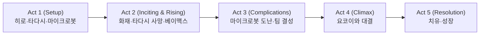

## 개요

### 영화 정보
* **제목**: Big Hero 6 / 빅 히어로 6
* **감독**: Don Hall (돈 홀), Chris Williams (크리스 윌리엄스)
* **각본**: Jordan Roberts, Robert L. Baird, Daniel Gerson
* **주연**: Ryan Potter (히로), Scott Adsit (베이맥스), Jamie Chung (고고), T.J. Miller (프레드)
* **음악**: Henry Jackman
* **장르**: 애니메이션, 액션, 코미디, 가족
* **상영시간**: 102분
* **개봉일**: 2014.11.07 (미국)
* **제작사**: Walt Disney Animation Studios
* **배급사**: Walt Disney Studios Motion Pictures

### 추천 대상
* **가족·애니메이션 팬**: 디즈니·마블 협업, 베이맥스와 치유 서사
* **STEM·로봇 관심**: 과학·기술·팀워크 메시지

## 구조 분석 (Act 5단계)

## 작품 개요

**빅 히어로 6**는 2014년 디즈니 애니메이션 스튜디오가 제작한 3D 컴퓨터 애니메이션으로, 마블 코믹스의 동명 작품을 원작으로 한 첫 번째 디즈니-마블 협업 작품이다. 돈 홀과 크리스 윌리엄스가 공동 연출했으며, 전 세계적으로 6억 5천만 달러 이상의 박스오피스를 기록하며 제87회 아카데미 애니메이션상을 수상했다.

## 영화의 전체 내용

**[S01]** 가상의 도시 샌프란소쿄(San Fransokyo)에 사는 14세 천재 소년 히로 하마다(라이언 포터)는 로봇 격투기에서 돈을 벌며 재능을 낭비하고 있다. 형 타다시(다니엘 헤니)는 히로를 샌프란소쿄 공과대학의 로봇 연구실로 데려가 진정한 과학의 즐거움을 보여준다.

**[S02]** 히로는 대학 입학을 위해 마이크로봇이라는 혁신적인 발명품을 선보이지만, 전시회 중 화재가 발생하고 타다시는 교수를 구하려다 목숨을 잃는다. 절망에 빠진 히로 앞에 타다시가 만든 의료진단 로봇 베이맥스(스콧 애즈트)가 나타난다.

**[S03]** 베이맥스는 부드러운 비닐로 만들어진 풍선 같은 외형의 개인 헬스케어 로봇으로, 환자를 돌보고 치료하는 것이 주요 기능이다. 히로는 베이맥스와 함께 자신의 마이크로봇이 도난당했음을 발견하고, 타다시의 대학 친구들과 함께 슈퍼히어로 팀을 결성해 음모를 파헤치기 시작한다. (이후 요코이 교수와의 대결·치유와 성장으로 이어진다.)

## 캐릭터 분석

### 히로 하마다 (라이언 포터)
14세 로봇 공학 천재. 형의 죽음 후 트라우마를 겪다가 베이맥스와 팀과 함께 성장한다.

### 베이맥스 (스콧 애즈트)
타다시가 개발한 개인 헬스케어 로봇. 부드럽고 따뜻한 치유형 캐릭터로, 전투 업그레이드 후에도 본성은 유지된다.

### 고고·와사비·허니 레몬·프레드
각각 스피드·플라즈마·화학·화염 등 개성 있는 능력과 성격으로 팀을 이룬다.

## 주요 등장인물

**히로 하마다 (라이언 포터)**
- 14세의 로봇 공학 천재 소년
- 형의 죽음으로 트라우마에 빠졌다가 베이맥스를 통해 치유받음
- 마이크로봇의 발명가이자 빅 히어로 6의 리더

**베이맥스 (스콧 애즈트)**
- 타다시가 개발한 개인 헬스케어 로봇
- 부드럽고 따뜻한 성격의 치유형 캐릭터
- 히로에 의해 전투용으로 업그레이드되지만 본성은 변하지 않음

**고고 토마고 (제이미 청)**
- 아드레날린 중독의 스피드광
- 전자기 서스펜션 자전거 바퀴로 고속 이동
- 냉정하지만 팀원들을 아끼는 캐릭터

**와사비 (데이먼 웨인즈 주니어)**
- 깔끔함을 추구하는 완벽주의자
- 플라즈마 블레이드를 무기로 사용
- 이름과 달리 와사비를 싫어함

**허니 레몬 (제네시스 로드리게스)**
- 화학을 전공하는 밝고 긍정적인 성격
- 화학 반응을 이용한 다양한 폭탄 제작
- 팀의 무드메이커 역할

**프레드 (T.J. 밀러)**
- 학교 마스코트이자 만화 매니아
- 몬스터 슈트를 입고 화염 방사와 점프 능력 사용
- 의외로 부유한 가정 출신

## 영상미와 음악

헨리 잭맨의 스코어와 폴 아웃 보이 엔딩곡, 베이맥스 효과음이 감정과 액션을 뒷받침한다. 아래 연출·음악 섹션 참고.

## 연출과 영상미

돈 홀과 크리스 윌리엄스 감독은 디즈니의 전통적 스토리텔링과 마블의 슈퍼히어로 장르를 절묘하게 결합했다. 샌프란소쿄라는 가상의 도시는 샌프란시스코의 지형과 일본의 건축양식을 융합하여 독특하면서도 친숙한 느낌을 준다.

베이맥스의 캐릭터 디자인은 특히 주목할 만하다. 하얀 비닐 풍선 같은 외형은 위협적이지 않으면서도 포근함을 주며, 의료진단 로봇의 기능과 완벽하게 조화를 이룬다. 움직임도 부드럽고 느릿해서 보는 이로 하여금 안정감을 느끼게 한다.

액션 시퀀스는 각 캐릭터의 개성을 잘 살려 설계됐다. 미시적 로봇들의 집합체가 만들어내는 거대한 구조물들과 베이맥스의 비행 신은 시각적 스펙터클과 감정적 몰입을 동시에 제공한다.

## 주제 의식

### 상실과 치유

영화의 핵심 주제는 사랑하는 사람을 잃은 슬픔과 그 치유 과정이다. 히로가 형의 죽음으로 겪는 트라우마는 많은 관객들이 공감할 수 있는 보편적 경험이며, 베이맥스를 통한 치유 과정은 깊은 감동을 준다.

### 기술과 인간성의 조화

로봇과 인공지능이 인간을 대체하는 것이 아니라 보완하고 치유하는 존재로 그려진다. 베이맥스는 첨단 기술이지만 무엇보다 따뜻한 인간미를 지닌 캐릭터로 표현된다.

### 복수와 용서

빌런 요코이 교수의 복수심과 히로의 분노는 대비를 이루며, 복수의 악순환을 끊고 용서와 이해로 나아가는 성장의 메시지를 전달한다.

### 팀워크와 우정

각기 다른 개성과 특기를 가진 인물들이 모여 하나의 팀을 이루는 과정에서 다양성의 가치와 협력의 중요성을 보여준다.

## 연기와 캐릭터 분석

**라이언 포터**는 히로의 복잡한 감정 변화를 설득력 있게 표현한다. 천재 소년의 자신감에서 상실의 아픔, 그리고 성장을 통한 성숙까지의 여정을 섬세하게 연기했다.

**스콧 애즈트**의 베이맥스는 영화의 진정한 스타다. 로봇임에도 불구하고 가장 인간적인 따뜻함을 보여주며, 단조로울 수 있는 캐릭터에 놀라운 깊이를 부여했다.

조연 캐릭터들도 각자의 개성이 뚜렷하다. **제이미 청**의 고고는 쿨하면서도 열정적이고, **T.J. 밀러**의 프레드는 코믹 릴리프 역할을 완벽하게 소화한다.

## 음악과 사운드

헨리 잭맨의 음악은 감정적 순간들을 효과적으로 뒷받침한다. 베이맥스의 테마는 부드럽고 따뜻한 멜로디로 캐릭터의 본질을 잘 표현하며, 액션 시퀀스에서는 웅장하면서도 희망적인 톤을 유지한다.

폴 아웃 보이의 엔딩 곡 'Immortals'는 영화의 슈퍼히어로적 면모를 강조하면서도 젊은 관객층에게 어필하는 현대적 사운드를 제공한다.

베이맥스의 목소리 톤과 효과음은 캐릭터의 매력을 배가시킨다. 공기가 빠지는 소리나 비닐이 부딪히는 효과음들이 베이맥스의 풍선 같은 특성을 청각적으로 강조한다.

## 기술적 완성도

### 애니메이션 기술

디즈니의 최신 애니메이션 기술이 집약된 작품이다. 베이맥스의 반투명한 비닐 질감, 마이크로봇들의 유기적 움직임, 샌프란소쿄의 세밀한 배경 등 모든 요소가 기술적으로 완성도가 높다.

### 캐릭터 디자인

동양과 서양의 미학을 조화롭게 결합한 캐릭터 디자인이 돋보인다. 특히 베이맥스의 단순하면서도 표현력 풍부한 디자인은 애니메이션 역사상 최고의 캐릭터 중 하나로 평가받는다.

### 월드 빌딩

샌프란소쿄는 현실적이면서도 환상적인 도시로 구현됐다. 일본의 전통 건축과 현대적 마천루가 조화를 이루며, 다문화가 자연스럽게 공존하는 미래 도시의 모습을 보여준다.

## 사회적 반향과 의미

### 다양성의 대표작

디즈니 역사상 가장 다양한 인종과 문화적 배경을 가진 주인공들이 등장하는 작품이다. 아시아계 주인공, 아프리카계, 라틴계 캐릭터들이 자연스럽게 어우러져 다문화 사회의 긍정적 모델을 제시한다.

### STEM 교육의 중요성

과학, 기술, 공학, 수학 분야에 대한 관심을 높이는 데 기여했다. 영화 속 캐릭터들이 모두 과학기술 분야의 전문가들로 등장하며, 특히 젊은 관객들에게 과학에 대한 긍정적 인식을 심어준다.

### 정신건강에 대한 인식

히로의 트라우마와 치유 과정을 세심하게 다루며, 정신건강의 중요성과 적절한 도움 받기의 필요성을 강조한다. 베이맥스는 일종의 치료사 역할을 하며 치유의 과정을 보여준다.

## 문화적 영향

**빅 히어로 6**는 디즈니가 마블을 인수한 후 첫 번째 결과물로서 두 브랜드의 성공적 융합을 보여줬다. 기존 디즈니의 가족 친화적 가치와 마블의 슈퍼히어로 세계관이 조화롭게 결합된 새로운 장르를 개척했다.

베이맥스는 로봇 캐릭터의 새로운 전형을 제시했다. 기존의 강력하고 위협적인 로봇과 달리 부드럽고 따뜻한 도우미 로봇의 이미지를 확립하며, 실제 의료용 로봇 개발에도 영감을 제공했다.

## 장점과 한계

### 장점
- 완벽한 캐릭터 디자인과 매력적인 베이맥스
- 다양성과 포용성을 자연스럽게 구현
- 감정적 깊이와 오락성의 훌륭한 균형
- 뛰어난 기술적 완성도

### 한계
- 예측 가능한 플롯 전개
- 일부 조연 캐릭터들의 상대적 얕은 깊이
- 마블 원작과의 차이로 인한 팬들의 아쉬움

## 후속작과 확장

영화의 성공으로 디즈니 XD에서 TV 시리즈가 제작됐으며, 디즈니 파크에서도 베이맥스를 테마로 한 어트랙션이 개장했다. 또한 다양한 상품화를 통해 베이맥스는 디즈니의 새로운 대표 캐릭터로 자리잡았다.

## 단편 애니메이션 'Feast'

본편 앞에 상영된 단편 애니메이션 **Feast**도 주목할 만하다. 개의 시점에서 그려진 6분짜리 작품으로, 음식을 통해 한 가족의 변화를 그려낸 감동적인 이야기다. 이 작품 역시 아카데미 단편 애니메이션상을 수상했다.

## 비교 분석

### 다른 디즈니 애니메이션과의 차별점
《겨울왕국》, 《라푼젤》과 달리 공주 서사가 아닌 과학기술과 슈퍼히어로를 다룬 작품으로, 특히 남성 관객층에게도 어필할 수 있는 새로운 방향성을 제시했다.

### 마블 영화와의 연관성
실사 마블 영화들과는 별개의 독립적 세계관을 구축하면서도, 마블 특유의 유머와 액션을 애니메이션에 맞게 재해석했다.

## 종합 평가

* **최종 평점**: 5/5
* **한 줄 평**: 디즈니와 마블의 완벽한 융합. 베이맥스와 함께하는 치유와 성장의 아름다운 여정.
* **장점**: 베이맥스 캐릭터, 다양성·포용성, 감정과 오락의 균형, 기술적 완성도.
* **단점**: 예측 가능한 플롯, 일부 조연 깊이 부족.
* **추천 작품**: 《겨울왕국》, 《주토피아》, 《인크레더블》
* **관람 전 체크리스트**: 가족 관람 가능. 상실·화재 장면 일부 있음.

**빅 히어로 6**는 디즈니 애니메이션의 새로운 가능성을 보여준 기념비적 작품이다. 베이맥스는 기술과 인간성이 조화를 이룬 미래에 대한 희망적 비전을 제시하며, 아카데미 애니메이션상 수상으로 완성도를 인정받았다.

## 참고 문헌 및 출처

1. [Big Hero 6 (2014) - IMDb](https://www.imdb.com/title/tt2245084/)
2. [Big Hero 6 - Rotten Tomatoes](https://www.rottentomatoes.com/m/big_hero_6)
3. [Big Hero 6 - Box Office Mojo](https://www.boxofficemojo.com/title/tt2245084/)
4. [Walt Disney Animation Studios - Big Hero 6](https://www.disneyanimation.com/projects/big-hero-6) 