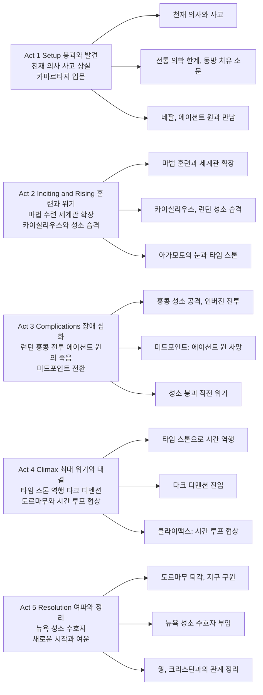

마블 시네마틱 유니버스(MCU)에 **마법**과 **다중 우주**를 공식적으로 도입한 《닥터 스트레인지》(2016)는 스콧 데릭슨 감독, 베네딕트 컴버배치 주연으로 2016년 10월 개봉한 마블 스튜디오 14번째 작품이다. 오만했던 천재 신경외과의 스티븐 스트레인지가 교통사고로 손의 미세 조정 능력을 잃은 뒤, 치유를 찾아 네팔의 카마르타지에 이르고 에이션트 원에게서 마법을 배우며 강력한 마법사로 거듭나는 오리진 스토리를 그린다. 현실이 뒤틀리는 인버전·미러 디멘션·다크 디멘션의 시각 효과와, 힘 대신 지성으로 승부하는 시간 루프 클라이맥스, 교만에서 겸손으로의 성장 메시지가 어우러져 MCU에서도 독보적인 톤을 이룬다.

## 개요

### 영화 정보

* **제목**: Doctor Strange / 닥터 스트레인지
* **감독**: Scott Derrickson (스콧 데릭슨)
* **각본**: Scott Derrickson, C. Robert Cargill, Jon Spaihts
* **주연**: Benedict Cumberbatch (스티븐 스트레인지), Tilda Swinton (에이션트 원), Chiwetel Ejiofor (칼 모르도), Rachel McAdams (크리스틴 팔머), Benedict Wong (웡), Mads Mikkelsen (카이실리우스)
* **음악**: Michael Giacchino (마이클 지아치노)
* **촬영**: Ben Davis (벤 데이비스)
* **장르**: 액션, 판타지, SF, 슈퍼히어로
* **상영시간**: 115분 (1시간 55분)
* **개봉일**: 2016.10.25 (한국), 2016.11.04 (미국)
* **제작사**: Marvel Studios, Walt Disney Pictures
* **배급사**: Walt Disney Studios Motion Pictures
* **제작비**: 약 1억 6,500만 달러
* **흥행**: 전세계 약 6억 7,700만 달러
* **평점**: 로튼 토마토 89%, IMDb 7.5/10, 메타크리틱 72
* **MCU 위치**: 페이즈 3, 14번째 작품

### 추천 대상

* **MCU·마블 팬**: 타임 스톤(인피니티 스톤)과 마법 세계관이 처음 등장하는 필수 편. 《인피니티 워》《엔드게임》 이전 시청 권장.
* **비주얼·VFX 애호가**: 도시가 접히고 뒤틀리는 인버전, 미러 디멘션, 다크 디멘션 등 MCU 내 최고 수준의 시각 연출.
* **성장 서사·캐릭터 드라마 선호자**: 교만한 천재가 상실을 겪고 자아를 내려놓으며 성장하는 과정이 분명하게 그려짐.
* **오컬트·마법물 좋아하는 관객**: 스콧 데릭슨 감독의 공포·오컬트 경험이 반영된 이질감과 긴장감.

## 구조 분석 (Act 5)

## 영화의 전체 내용 (스포일러 포함)

《닥터 스트레인지》는 표면적으로 '천재가 상실을 겪고 마법사로 거듭나 위협에 맞선다'는 MCU 오리진 서사를 따르지만, 그 핵심은 **자아를 내려놓을 때 비로소 진정한 힘이 열린다**는 영적·심리적 성장이다. 스티븐 스트레인지는 손과 정체성을 잃은 뒤 카마르타지에서 '에고의 죽음'을 배우며, 최종적으로 힘이 아닌 **시간 루프와 협상**으로 도르마무를 물리친다. 아래는 Act 1부터 Act 5까지 장면 비트 [S01]~[S23]으로 재구성한 전체 내용이다.

### Act 1 (Setup): 붕괴와 발견

**[S01] 뉴욕 병원 — 천재 신경외과의**: 뉴욕의 병원에서 스티븐 스트레인지(베네딕트 컴버배치)는 수술실에서만큼은 완벽한 컨트롤을 자랑하는 천재 신경외과의다. "어떤 신경 한 가닥도 놓치지 않는다"는 자신감과 오만함은 환자 생명을 구하는 실력과 한몸이지만, 동료이자 연인에 가까운 크리스틴 팔머(레이첼 맥아담스)와의 관계에서는 감정을 내려놓지 못한다.

**[S02] 어려운 케이스만 고르는 남자**: 차가운 선택—어려운 수술만 골라 받고, 명예와 성공에만 집중하는—이 그를 정의한다. 크리스틴이 관계를 정리하려 할 때도 스트레인지는 수술과 논문에만 몰두하며 회피한다.

**[S03] 교통사고 — 양손의 상실**: 밤중 고속도로에서 의학 논문을 보다가 교통사고를 당한 스트레인지는 양손의 미세 운동 신경을 심각하게 손상한다. 수술과 재활을 거쳐도 전통 의학으로는 수술 복귀가 불가능하다는 판정을 받으며, 그는 자존심과 삶의 의미를 동시에 잃는다.

**[S04] 정체성의 위기**: "나는 손이 아니라, 이 손으로 하는 일이 나다"라는 인식이 무너지면서 정체성의 위기가 찾아온다. 재활과 시술을 거듭해도 개선이 없자, 스트레인지는 마지막 희망으로 "동방의 치유법" 소문을 쫓아 네팔로 향한다.

**[S05] 카마르타지 — 네팔 입문**: 자존심을 굽히고 찾아간 곳은 **카마르타지(Kamar-Taj)**—에이션트 원이 이끄는 비밀의 마법 수행장이다. 문 앞에서 퇴짜를 맞다가 결국 문을 두드리고 들어선다.

**[S06] 에이션트 원과의 만남**: 카마르타지에서 스트레인지는 에이션트 원(틸다 스윈턴)과 마스터 웡(베네딕트 웡)을 만난다. 처음에는 "손만 고치면 된다"고 생각했던 그는, 영적 에너지와 다중 우주, 현실을 조작하는 마법이 실재한다는 사실을 목격하고 세계관이 흔들린다.

**[S07] 가르침 — 자아를 내려놓을 때**: 에이션트 원은 그에게 **"자아를 내려놓을 때 비로소 진정한 힘을 쓸 수 있다"**는 가르침을 전하며 훈련의 문을 연다. "네가 알던 세계는 빙산의 일각에 불과하다"는 말은 스트레인지에게 인지의 한계를 받아들이는 첫걸음이 된다.

### Act 2 (Inciting & Rising): 훈련과 위기

**[S08] 마법 훈련 — 기초부터**: 스트레인지는 카마르타지에서 차원 이동, 에너지 방패, 무기 소환 등 마법의 기초부터 단련한다. 타고난 집중력과 기억력으로 빠르게 성장하지만, "자아를 죽여야 진정한 힘이 열린다"는 에이션트 원의 가르침과는 거리가 있다.

**[S09] 모르도와의 갈등**: 한편 **모르도**(치웨텔 에지오포)는 에이션트 원의 오래된 제자로, "자연의 법칙을 거스르는 마법"에 회의를 품고 스트레인지와의 갈등을 키워간다.

**[S10] 카이실리우스와 어둠의 차원**: 과거 에이션트 원의 제자였던 **카이실리우스**(마드스 미켈센)는 시간과 죽음에 대한 공포로 **어둠의 차원(Dark Dimension)**의 지배자 **도르마무(Dormammu)**와 계약을 맺고, 영생을 얻는 대가로 지구의 세 성소(뉴욕, 런던, 홍콩)를 파괴해 지구를 다크 디멘션에 병합하려 한다.

**[S11] 런던 성소 습격**: 카이실리우스 일당은 런던 성소를 습격한다. 스트레인지는 **아가모토의 눈(Eye of Agamotto)**—실제로는 **타임 스톤(Time Stone)**, 인피니티 스톤 중 하나—을 접하게 되고, 성소 수호의 무게를 깨닫기 시작한다.

**[S12] 홍콩으로 — 실전 투입**: 이어서 홍콩 성소가 공격당한다. 스트레인지는 아가모토의 눈을 지키며 마법 실전에 뛰어든다. **인버전(Inversion)**으로 도시가 접히고 뒤틀리는 전투, **미러 디멘션(Mirror Dimension)**에서 벌어지는 공간 붕괴 연출이 영화의 시각적 아이덴티티를 이룬다.

### Act 3 (Complications): 장애 심화와 미드포인트

**[S13] 홍콩 성소 전투 — 인버전**: 스트레인지는 전투를 거치며 점점 "자아를 내려놓는" 쪽으로 성장해 간다. 도시가 접히고 건물이 뒤틀리는 가운데 카이실리우스 측과 격돌한다.

**[S14] 미드포인트 — 에이션트 원의 죽음**: 에이션트 원이 카이실리우스에게 치명상을 입고, 뉴욕 병원 옥상에서 스트레인지와 크리스틴이 지켜보는 가운데 숨을 거둔다. 그녀는 "이 순간을 두려워하지 마라"며 스트레인지에게 마지막 가르침을 남기고, 다크 디멘션의 힘을 빌려 장수해 온 자신의 비밀을 드러낸다. 스트레인지는 더 이상 '스승'에 의존할 수 없음을 깨닫고 스스로 선택해야 하는 전환점에 선다.

**[S15] 성소 붕괴 직전**: 홍콩 성소가 붕괴 직전까지 가며 지구 전체가 도르마무에게 노출될 위기에 처한다. 스트레인지는 타임 스톤 사용을 결심한다.

### Act 4 (Climax): 최대 위기와 대결

**[S16] 타임 스톤 역행 — 홍콩 복구**: 스트레인지는 타임 스톤을 사용해 **시간을 역행**시켜 도시와 성소를 복구한다. 붕괴된 건물과 피해가 거꾸로 되감기듯 복원되는 연출이 관객에게 강한 인상을 남긴다.

**[S17] 카이실리우스의 소멸**: 카이실리우스는 다크 디멘션의 힘에 삼켜져 소멸하고, 스트레인지는 남은 위협—도르마무 자체—을 막기 위해 **다크 디멘션**으로 스스로 들어간다.

**[S18] 클라이맥스 — 도르마무와 시간 루프 협상**: 다크 디멘션에서는 시간이 흐르지 않는다. 스트레인지는 타임 스톤으로 **시간 루프**를 걸어, "네가 물러날 때까지 무한히 이 순간을 반복하겠다"고 선언한다. 시간에 길들지 않은 도르마무는 결국 무한 반복에 지쳐 퇴각을 선언하고, 지구 침공은 막힌다. 힘으로가 아니라 **지성과 인내**로 적을 이긴 해결책은 MCU 클라이맥스 중에서도 독창적으로 회자된다.

### Act 5 (Resolution): 여파와 정리

**[S19] 지구 구원 — 도르마무 퇴각**: 스트레인지는 다크 디멘션에서 돌아와 동료들과 재회한다. 모르도는 "자연의 법칙을 거스른다"며 스트레인지와 결별하고, 적대적 위치로 선을 긋는다. 후속작 《닥터 스트레인지: 대혼돈의 멀티버스》의 복선이 된다.

**[S20] 뉴욕 성소 수호자**: 스트레인지는 뉴욕 성소의 수호 마법사로 남는다. "시간 스톤을 잘 쓰게 되었군"이라는 웡의 한 마디와 함께, 그는 이후 어벤져스의 일원으로 MCU 중심에 서게 될 운명을 암시한다.

**[S21] 엔딩 — 크리스틴과의 관계**: 크리스틴 팔머와의 관계는 새로운 형태로 이어질 가능성을 열어둔 채 영화는 끝난다. 스트레인지는 더 이상 "손으로 정의되던 남자"가 아니라, 마법으로 세상을 지키는 수호자로 자리 잡는다. (엔딩)

### 쿠키 영상

**[S22] 미드 크레딧 — 토르 의뢰**: 스트레인지와 웡이 성소에서 대화하던 중, 토르가 맥주를 들고 나타나 "오딘을 찾는 중"이라며 스트레인지에게 협력을 요청한다. 《토르: 라그나로크》와의 연결고리.

**[S23] 포스트 크레딧 — 모르도의 결심**: 모르도가 "지구에 마법사가 너무 많다"며 한 남자의 마법을 빼앗아 가는 장면. 속편에서의 악역 전환을 암시한다.

## 핵심 대사 인덱스

"Arrogance and fear still keep you from learning the simplest and most significant lesson of all." — 에이션트 원, [S07]; 자아를 내려놓을 때 비로소 힘이 열린다는 핵심 가르침.

"It's not about you." — 에이션트 원, [S14]; 죽음 직전 스트레인지에게 남긴 말. 수호자로서의 책임을 일깨움.

"Dormammu, I've come to bargain." — 스티븐 스트레인지, [S18]; 시간 루프 클라이맥스의 상징적 대사. 힘이 아닌 협상으로 적을 물리침.

"We never lose our demons. We only learn to live above them." — 에이션트 원, [S06]; 두려움과 과거와의 관계를 받아들이는 성장 테마.

## 캐릭터 분석

### 스티븐 스트레인지 / Stephen Strange (Benedict Cumberbatch)

**개요**: 전직 천재 신경외과의. 교통사고로 양손의 미세 조정 능력을 잃은 뒤 카마르타지에서 마법을 배우며, 자아와 통제에 대한 집착을 내려놓는 과정에서 강력한 마법사로 성장한다. MCU의 수호 마법사이자 타임 스톤의 수호자로 자리 잡는다.

**성장 곡선**: 오만한 천재 의사 → 사고로 정체성 붕괴 → 카마르타지 입문과 저항 → "자아를 내려놓을 때 힘이 열린다"는 가르침 수용 → 런던·홍콩 전투에서 수호자로서의 책임 감수 → 에이션트 원 사망으로 독립적 선택 → 도르마무와의 시간 루프 협상으로 힘이 아닌 지성으로 승리 → 뉴욕 성소 수호자로 정체성 재정립.

**동기와 욕망**: 초반에는 "손을 고치고 다시 수술대로 돌아가는 것"이었으나, 점차 "더 큰 세계를 지키는 것"으로 전환된다. 크리스틴에 대한 미련은 남지만, 자신의 역할을 수호자로 받아들인다.

**갈등 구조**: 내적 갈등은 에고—통제와 완벽에 대한 집착—와 겸손·내려놓음 사이의 긴장이다. 외적 갈등은 카이실리우스·도르마무와의 대결, 그리고 모르도와의 이념 충돌이다.

**상징적 의미**: "손이 나다"는 정체성이 무너진 뒤, "마법으로 지키는 자"로 재정의되는 인물. MCU에서 과학(아이언 맨)과 신화(토르) 사이에 위치한 **마법·영적 차원**의 대표자.

**배우 연기**: 컴버배치는 스트레인지의 날카로운 유머, 오만함, 그리고 점진적인 겸손으로의 전환을 설득력 있게 연기하며, MCU 캐스팅 중에서도 가장 캐릭터와 궁합이 좋은 편으로 꼽힌다.

### 에이션트 원 / Ancient One (Tilda Swinton)

**개요**: 카마르타지를 이끄는 대마법사. 다중 우주와 어둠의 차원을 수호하며, 스트레인지에게 "자아를 내려놓을 때 비로소 힘이 열린다"는 가르침을 전한다. 자신도 다크 디멘션의 힘을 일부 빌려 장수를 유지해 온 비밀이 드러나며, 모르도와 스트레인지에게 각각 다른 영향을 미친다.

**성장 곡선**: 영화 내에서는 성장보다는 **폭로**의 인물. "자연 법칙을 지키는 스승"으로 보였으나, 사실 어둠의 차원의 힘을 빌려 오래 살아온 것이 드러나고, 죽음 직전 "이 순간을 두려워하지 마라"며 스트레인지에게 마지막 가르침을 남긴다.

**동기와 욕망**: 지구와 다중 우주를 도르마무로부터 지키는 것. 그 대가로 자연 법칙에 어긋나는 수단(다크 디멘션의 힘)을 썼다는 점이 모르도의 배신 동기가 된다.

**갈등 구조**: 가르침("자연을 거스르지 마라")과 자신의 선택(어둠의 힘을 빌린 장수) 사이의 위선으로 비춰질 수 있는 긴장. 그럼에도 그녀의 죽음은 스트레인지가 스스로 선택하게 만드는 촉매가 된다.

**상징적 의미**: 완벽한 스승이 아니라, 선택과 희생을 통해 제자에게 "두려움 없이 순간을 받아들이라"는 메시지를 남기는 인물. MCU에서 지혜와 비밀의 상징.

**배우 연기**: 틸다 스윈턴은 에이션트 원의 초월적이면서도 인간적인 면을 동시에 구현해, 원작 백인 남성 캐릭터를 재해석한 캐스팅 논란 속에서도 연기력으로 설득력을 확보했다.

### 칼 모르도 / Karl Mordo (Chiwetel Ejiofor)

**개요**: 에이션트 원의 제자. 처음에는 스트레인지의 동료 수호자로 나서지만, "자연 법칙을 거스르는 마법"과 에이션트 원의 위선(다크 디멘션 힘 차용)에 회의를 품고 결말부에서 적대적 위치로 선을 긋는다.

**성장 곡선**: 원칙주의적 수호자 → 에이션트 원의 비밀 폭로로 신뢰 붕괴 → 스트레인지의 타임 스톤 사용을 "법칙 위반"으로 간주 → "지구에 마법사가 너무 많다"며 마법을 빼앗는 자로 전환(포스트 크레딧). 속편의 주요 적대자로 부상한다.

**동기와 욕망**: "자연의 균형"과 "법칙의 준수". 그가 보기에 스트레인지와 에이션트 원은 모두 편의를 위해 법칙을 거스르는 자들이다.

**갈등 구조**: 내적 갈등은 스승과 동료에 대한 신뢰 vs 원칙. 외적 갈등은 스트레인지·에이션트 원과의 이념 충돌이다.

**상징적 의미**: "선의의 수호자"가 신뢰를 잃었을 때 극단적 원칙주의(마법사 제거)로 기울 수 있음을 보여주는 인물. MCU의 도덕적 회색지대를 확장한다.

### 카이실리우스 / Kaecilius (Mads Mikkelsen)

**개요**: 과거 에이션트 원의 제자. 사랑하는 이들의 죽음과 시간에 대한 공포로 도르마무와 계약해 영생을 추구하며, 세 성소를 파괴해 지구를 다크 디멘션에 병합하려 하는 악역이다.

**성장 곡선**: 영화 내에서는 이미 "타락한 제자"로 고정된 상태. "시간이 우리를 잡아먹는다"는 그의 말은 스트레인지가 나중에 "시간"을 무기로 쓰는 것과 대비되어, 같은 두려움(시간·죽음)에 대한 서로 다른 대응을 보여준다.

**동기와 욕망**: 죽음과 시간으로부터의 탈출. 영생을 위해 도르마무에게 지구를 바치려 한다.

**갈등 구조**: 에이션트 원·카마르타지와의 대립. 스트레인지는 "시간을 받아들이고" 타임 스톤으로 협상을 하며, 카이실리우스는 "시간을 거부하고" 도르마무에 의존하다 소멸한다.

**상징적 의미**: 두려움(죽음·시간)을 받아들이지 못하고 외부 힘에 의존한 결과 파멸하는 인물. 스트레인지의 반대편 거울이다.

**배우 연기**: 마드스 미켈센은 제한된 비중 안에서 카이실리우스의 고통과 집착을 담담하게 전달해, 단순한 "나쁜 놈"을 넘어선 비극적 악역으로 자리 잡았다.

### 웡 / Wong (Benedict Wong)

**개요**: 카마르타지의 도서관을 지키는 마스터. 스트레인지에게 성소와 아가모토의 눈, 타임 스톤의 무게를 전달한다. 말수는 적지만 신뢰와 유머로 MCU 후속작까지 이어지는 캐릭터의 기반을 만든다.

**성장 곡선**: 경계하는 수호자 → 스트레인지와의 전투·희생을 거치며 신뢰 구축 → "시간 스톤을 잘 쓰게 되었군"이라며 인정. 영화 후반부터는 스트레인지의 가장 가까운 동료로 자리 잡는다.

**상징적 의미**: 원칙과 유머를 겸비한 "진정한 수호자"의 모습. 모르도와 대비되어, 법칙을 지키되 유연하게 동료를 받아들이는 인물로 그려진다.

## 영상미와 음악

### 시각 효과 / 촬영 / 미학

* **인버전(Inversion)**: 도시가 접히고 뒤틀리는 연출은 《인셉션》의 접는 도시를 연상시키면서도, 만화 원작의 LSD적 비주얼에 가깝게 구현했다. 건물과 도로가 한꺼번에 붕괴·재구성되는 장면은 영화의 시각적 아이덴티티를 이룬다. 벤 데이비스(Ben Davis)의 촬영은 2.35:1 스코프 비율과 IMAX 장면을 활용해 몰입감을 높인다.
* **미러 디멘션·다크 디멘션**: 성소 간 이동과 전투 장면에서 공간과 시간이 동시에 왜곡되는 연출이 반복된다. 시각 효과팀은 실사 세트와 VFX를 결합해 관객이 "그 공간 안에 있다"고 느끼도록 설계했으며, IMAX·큐브릭 비율로 촬영된 장면은 넓은 화면에서 감상할 때 효과가 크다. 2017년 아카데미 시각효과상 후보에 올랐다.
* **색감·조명**: 카마르타지와 네팔은 따뜻한 등불과 황금빛, 뉴욕 병원은 차가운 청백색, 다크 디멘션은 보라·검정의 초현실적 톤으로 구분된다.
* **의상·메이크업**: 클로크 오브 레비테이션(Cloak of Levitation), 아가모토의 눈(Eye of Agamotto) 등 아이템이 시각적 상징으로 작동하며, 카이실리우스 측의 "어둠에 물든" 눈 연출은 악역의 이질감을 강조한다.

### 음악: Michael Giacchino

* **음악 스타일**: 시타르·동양 악기를 활용해 카마르타지와 네팔의 분위기를 잡고, 전투와 클라이맥스에서는 오케스트라로 긴장감을 높인다. 마이클 지아치노는 《미션 임파서블》《스타트렉》 등에서 쌓은 경험을 살려 서사와 호흡을 맞춘다.
* **주요 테마**: 스트레인지의 여정—붕괴, 발견, 성장—을 반복·변주하며 서사와 맞닿아 있다. 마블 스튜디오 사상 처음으로 개봉 전 OST가 공개되는 등 음악에 대한 기대가 컸다.
* **사운드트랙 특징**: 동양과 서양 악기의 혼합, 액션 시퀀스에서의 리듬과 브라스 활용이 영화의 톤과 잘 조화된다. 사운드 디자인과 음향 믹싱이 차원 이동·주문 연출과 결합되어 몰입도를 높인다.

## 종합 평가

### 최종 평점: ★★★★★ (5.0/5.0)

**장점**:
* **인버전·미러 디멘션·다크 디멘션** 등 마법 전투의 비주얼이 MCU 내에서도 독보적이다.
* **"시간 루프로 적을 지치게 만든다"**는 클라이맥스는 힘 대신 지성으로 승부하는 해결책이라 새롭고 기억에 남는다.
* 컴버배치의 캐릭터 연기와 데릭슨의 오컬트 톤이 맞아떨어져, 슈퍼히어로 오리진 중에서도 성장 서사가 분명한 편이다.
* 타임 스톤과 인피니티 스톤을 도입한 MCU 세계관 확장의 핵심 작품이다.
* 에이션트 원·모르도·카이실리우스 등 보조 인물의 동기와 갈등이 선명해 서사 깊이가 있다.

**단점**:
* 전반적인 구조는 기존 마블 오리진(재능 있는 인물 → 상실 → 새로운 세계관 수용 → 위기 해결)을 충실히 따르기 때문에, 스토리 자체의 신선함보다는 "마법"이라는 소재와 비주얼에서 차별점이 난다.
* MCU 연동을 위한 타임 스톤 노출이 다소 노골적이라는 지적이 있다.
* 크리스틴 팔머의 비중이 상대적으로 적어 로맨스 라인이 약하다는 의견이 있다.

### 한 줄 평

"MCU에 마법과 다중 우주를 열어 준, 비주얼과 성장 서사가 모두 빛나는 오리진 스토리. 힘으로가 아니라 시간 루프와 협상으로 이기는 클라이맥스가 기억에 남는다."

### 추천 작품

* 《인셉션》(Inception, 2010): 공간·시간 왜곡과 현실의 경계를 다루는 SF. 인버전 연출의 참고선으로 자주 거론된다.
* 《아이언 맨》(Iron Man, 2008): MCU 오리진의 원형. 천재의 상실과 재정의 구조를 비교해 보면 재미있다.
* 《토르》(Thor, 2011): 신화·다차원·겸손의 성장 서사. MCU 내 마법·신성 축의 또 다른 출발점이다.
* 《닥터 스트레인지: 대혼돈의 멀티버스》(2022): 속편. 멀티버스와 모르도의 복귀가 이 편의 결말에서 이어진다.

### 관람 전 체크리스트

* **사전 지식이 필요한가?** 권장. MCU 페이즈 1~2를 본 뒤 보면 타임 스톤·인피니티 스톤 맥락이 잘 잡힌다. 필수는 아님.
* **어린이와 함께 볼 수 있는가?** 주의. 12세 이상 관람가(미국 PG-13). 어둠의 차원·도르마무 등 약간의 공포 톤과 폭력 연출 있음.
* **특정 요소를 기대해도 되는가?** 가능. 마법 배틀, 도시 뒤틀림(인버전), 성장 서사, 마이클 지아치노 음악을 기대해도 좋다.
* **쿠키 영상이 있는가?** 있음. 미드 크레딧: 토르 등장(《토르: 라그나로크》 연결). 포스트 크레딧: 모르도 복선(속편 악역 전환).
* **속편 가능성은?** 완료. 《닥터 스트레인지: 대혼돈의 멀티버스》 2022년 개봉.

## 참고 문헌 및 출처

- [Doctor Strange (2016) — IMDb](https://www.imdb.com/title/tt1211837/)
- [Doctor Strange — Rotten Tomatoes](https://www.rottentomatoes.com/m/doctor_strange_2016)
- [Doctor Strange (2016 film) — Wikipedia](https://en.wikipedia.org/wiki/Doctor_Strange_(2016_film))
- [Doctor Strange — Marvel Cinematic Universe Wiki (Fandom)](https://marvelcinematicuniverse.fandom.com/wiki/Doctor_Strange_(film))

## 결론

《닥터 스트레인지》는 MCU에 마법과 다중 우주를 공식적으로 끌어온 기념비적인 작품이다. 시각적으로는 인버전과 미러 디멘션으로 "현실이 뒤틀리는" 경험을 선사하고, 서사적으로는 교만한 천재가 자아를 내려놓고 성장하는 과정을 설득력 있게 그려 낸다. 타임 스톤과 도르마무와의 시간 루프 대결은 힘보다 지성으로 승부하는 해결책으로 기억에 남으며, 이후 《인피니티 워》《엔드게임》으로 이어지는 MCU 사가의 핵심 축을 이 작품이 놓았다고 해도 과언이 아니다. 마블 세계관을 따라가는 관객이라면 꼭 한 번 관람할 만한 필수편이다.
