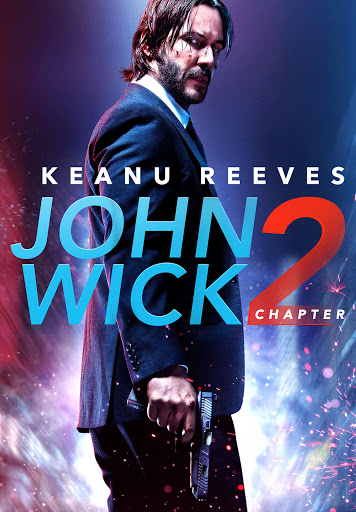

강렬한 액션과 독특한 세계관으로 많은 팬을 사로잡은 영화, **존 윅 - 리로드**는 '존 윅' 시리즈의 두 번째 작품이다. 독특한 네오 누아르 스타일과 현란한 액션 장면들로 다시 한번 관객을 압도하는 이 영화는 전설적인 킬러 존 윅의 새로운 여정을 그린다. 개와 복수를 위해 싸우던 존 윅은 이번엔 더 깊은 세계 속으로 들어가며, 과거와 얽힌 의무를 지우기 위해 또다시 총을 손에 쥐게 된다.

||
|:---:|
||

## 등장 인물

- **존 윅** (키아누 리브스): 과거의 삶을 떠나 평화로운 삶을 꿈꿨던 전설적인 킬러.
- **산티노 디 안토니오** (리카르도 스카마르시오): 존에게 새로운 미션을 제안하며 그의 과거를 되살리는 인물.
- **윈스턴** (이언 맥셰인): 킬러들이 모이는 콘티넨탈 호텔의 관리인으로, 존과 복잡한 관계를 맺고 있는 인물.
- **아레즈** (루비 로즈): 산티노의 오른팔이자 뛰어난 무술 실력을 갖춘 암살자.
- **카시안** (커먼): 존과 맞서는 암살자이자 경쟁자.
- **찰론스** (랜스 레딕): 존의 지원을 돕는 콘티넨탈 호텔의 직원.

## 서론

‘존 윅 - 리로드’는 2017년 개봉한 액션 스릴러 영화로, 감독은 차드 스타헬스키이다. 전작의 성공에 힘입어 더욱 스케일이 커진 이 작품은 키아누 리브스, 이언 맥셰인, 리카르도 스카마르시오, 커먼 등의 배우가 출연하며, 국제적인 배경과 복잡한 세계관을 통해 존 윅의 이야기를 한층 깊이 있게 확장했다. 이 영화는 '킬러의 세계'에 대한 독창적인 설정과 스토리 전개로 많은 액션 팬들에게 강한 인상을 남긴다.

## 영화 내용

### **도입부 (Exposition)**

이야기는 평범한 일상을 바라던 존 윅이 예전 동료 산티노의 요청으로 인해 과거로 돌아가는 장면으로 시작된다. 존은 산티노에게 피의 맹세를 한 과거를 떠올리게 되고, 그를 거부할 수 없는 상황에 처하게 된다.

### **발단 (Inciting Incident)**

존은 산티노의 의뢰를 받아들일 수밖에 없는 상황에 놓이며, 그에게 맡겨진 임무는 거부할 수 없는 무거운 사명이다. 산티노는 가족을 배신하고 자리를 차지하기 위해 자신의 누나를 제거하려는 계획을 세운다. 이로 인해 존은 깊은 고뇌에 빠진다.

### **상승 액션 (Rising Action)**

존은 산티노의 누나를 제거하고, 그에 대한 보복으로 암살자들의 표적이 된다. 이에 따라 끊임없이 이어지는 추격과 전투에서 살아남기 위한 싸움이 시작된다. 이 과정에서 콘티넨탈 호텔의 규칙을 깨뜨릴지에 대한 갈등과 고민이 전개된다.

### **클라이맥스 (Climax)**

갈등이 최고조에 이르는 순간, 존은 콘티넨탈 호텔 내에서 산티노와의 결판을 짓는다. 이는 호텔 규칙을 어긴 중대한 사건으로, 그의 운명에 커다란 변화를 일으키는 계기가 된다.

### **하강 액션 (Falling Action)**

호텔의 규칙을 어긴 존은 자신이 속해 있던 세계로부터 추방당하고, 모든 암살자의 표적이 되는 처지에 놓인다. 이는 그가 앞으로의 여정에서 끊임없는 위험에 처하게 됨을 암시한다.

### **결말 (Resolution)**

영화는 존이 여전히 살아남기 위해 싸워야 하는 상황에서 끝이 나며, 다음 시리즈를 암시하는 열린 결말로 마무리된다.

## 주제 및 메시지

존 윅 - 리로드는 '복수'와 '충성', '의무'라는 테마를 다루며, 킬러들의 세계에 깊게 뿌리내린 규칙과 인간적 갈등을 탐구한다. 현대 사회에서의 명예와 책임, 그리고 이를 지키기 위한 개인의 희생을 상징적으로 표현한다.

## 세부 분석

### **연출 및 연기**

차드 스타헬스키 감독은 특유의 리듬감 있는 연출로 액션 장면에 몰입감을 더했으며, 키아누 리브스는 절제된 감정 표현으로 캐릭터의 깊이를 더했다.

### **촬영 및 시각 효과**

독특한 네온 컬러와 어둡고 고딕한 시각 요소는 영화의 분위기를 효과적으로 조성하며, 빠른 카메라 움직임과 정확한 총기 사용은 액션의 리얼리티를 높인다.

### **음악 및 사운드**

타일러 베이츠와 조엘 J. 리처드의 음악은 존의 고독과 긴장감을 극대화하며, 총격과 격투 사운드가 생동감 있게 연출된다.

### **편집 및 내러티브 구조**

편집의 흐름이 부드러워 사건 전개가 자연스럽게 이어지며, 과거와 현재가 겹치는 장면 연출은 복잡한 내러티브를 돋보이게 한다.

## 개인적인 평가

### **장단점**

액션과 세계관 확장에 대한 시도는 긍정적이나, 다소 단순한 서사 구조는 비판적 평가를 받을 수 있다.

### **감상 포인트**

콘티넨탈 호텔의 규칙과 세계관의 확장, 킬러의 코드를 탐구하는 장면들이 인상적이다. 강렬한 액션과 독특한 설정이 매력적인 영화이다.

## 결론

존 윅 - 리로드는 액션과 감정, 세계관이 조화된 완성도 높은 영화로, 관객에게 강렬한 시각적, 감정적 경험을 선사한다. 더 나아가 이 영화는 존 윅의 다음 여정에 대한 궁금증을 남기며, 그가 이 세계에서 어떤 운명을 맞게 될지에 대한 기대감을 불러일으킨다.