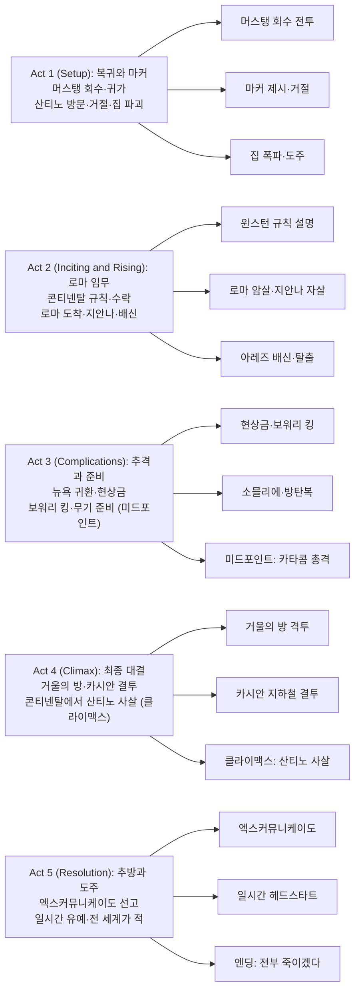

『존 윅: 리로드』(John Wick: Chapter 2)는 2014년 전작의 세계관을 확장하며, 은퇴를 꿈꾸던 존 윅이 과거의 피 맹세(marker) 때문에 다시 한 번 킬러의 세계로 발을 들이게 되는 이야기다. 차드 스타헬스키 감독과 키아누 리브스의 조합은 전작보다 더 넓은 무대(뉴욕·로마)와 더 많은 적을 내세우며, 콘티넨탈 호텔의 규칙과 하이 테이블의 질서가 서사를 이끈다. 강렬한 건 파 액션, 거울의 방 격투, 지하 카타콤 추격전이 122분 내내 이어지며 속편다운 스케일 업을 보여준다.

## 개요

### 영화 정보

* **제목**: John Wick: Chapter 2 / 존 윅: 리로드
* **감독**: Chad Stahelski (차드 스타헬스키)
* **각본**: Derek Kolstad (데릭 콜스타드)
* **주연**: Keanu Reeves (존 윅), Riccardo Scamarcio (산티노 디 안토니오), Ian McShane (윈스턴), Ruby Rose (아레즈), Common (카시안), Laurence Fishburne (보워리 킹), Lance Reddick (캐론)
* **음악**: Tyler Bates, Joel J. Richard (타일러 베이츠, 조엘 J. 리처드)
* **촬영**: Dan Laustsen (댄 라우스트센)
* **장르**: 액션, 스릴러, 범죄, 네오 누아르
* **상영시간**: 122분
* **개봉일**: 2017.02.10 (미국), 2017.02.08 (한국 등 APAC·EMEA 선개봉)
* **제작사**: Thunder Road Pictures, 87eleven, Summit Entertainment
* **배급사**: Lionsgate
* **제작비**: 약 4천만 달러
* **흥행**: 북미 약 9,202만 달러, 전세계 약 1억 7,434만 달러
* **평점**: IMDb 7.4/10, Metacritic 75, Rotten Tomatoes 89% (토마토미터)

### 추천 대상

* **전작 『존 윅』을 본 관객**: 콘티넨탈·마커·하이 테이블 등 세계관이 확장되며 연속성 있는 재미가 있다.
* **건 파·실사 액션을 선호하는 관객**: 총격·격투·차량 추격이 장면 단위로 정교하게 설계되어 있다.
* **네오 누아르·스타일리시 액션을 좋아하는 관객**: 어두운 톤, 네온, 거울의 방·카타콤 등 비주얼이 강하다.

## 구조 분석

```mermaid
flowchart LR
    Act1["Act 1 (Setup): 복귀와 마커</br>머스탱 회수·귀가</br>산티노 방문·거절·집 파괴"]
    Act2["Act 2 (Inciting and Rising): 로마 임무</br>콘티넨탈 규칙·수락</br>로마 도착·지안나·배신"]
    Act3["Act 3 (Complications): 추격과 준비</br>뉴욕 귀환·현상금</br>보워리 킹·무기 준비 (미드포인트)"]
    Act4["Act 4 (Climax): 최종 대결</br>거울의 방·카시안 결투</br>콘티넨탈에서 산티노 사살 (클라이맥스)"]
    Act5["Act 5 (Resolution): 추방과 도주</br>엑스커뮤니케이도 선고</br>일시간 유예·전 세계가 적"]
    Act1 --> Bit1["머스탱 회수 전투"]
    Act1 --> Bit2["마커 제시·거절"]
    Act1 --> Bit3["집 폭파·도주"]
    Act2 --> Bit4["윈스턴 규칙 설명"]
    Act2 --> Bit5["로마 암살·지안나 자살"]
    Act2 --> Bit6["아레즈 배신·탈출"]
    Act3 --> Bit7["현상금·보워리 킹"]
    Act3 --> Bit8["소믈리에·방탄복"]
    Act3 --> Bit9["미드포인트: 카타콤 총격"]
    Act4 --> Bit10["거울의 방 격투"]
    Act4 --> Bit11["카시안 지하철 결투"]
    Act4 --> Bit12["클라이맥스: 산티노 사살"]
    Act5 --> Bit13["엑스커뮤니케이도"]
    Act5 --> Bit14["일시간 헤드스타트"]
    Act5 --> Bit15["엔딩: 전부 죽이겠다"]
```

## 영화의 전체 내용 (스포일러 포함)

『존 윅: 리로드』는 전작 종료 며칠 뒤, 존이 다시 한 번 “한 건”을 치르게 되고 그 대가로 전 세계 암살자의 표적이 되는 과정을 그린다. 피 맹세(marker)라는 불가역적 계약, 콘티넨탈의 규칙, 그리고 그 규칙을 스스로 어기며 내려가는 존의 선택이 서사의 축이다.

### Act 1 (Setup): 복귀와 마커

**[S01] 차량 추격 — 머스탱 회수**: 전작에서 타라소프 일당에게 빼앗긴 1969년 머스탱을 되찾기 위해 존은 아브람 타라소프의 차고를 습격한다. 오토바이와 차량이 뒤섞인 추격전 끝에 존은 머스탱을 탈환하고, 아브람에게 목숨을 살려준다.

**[S02] 귀가 — 무기 매장**: 상처를 치료한 존은 집으로 돌아와 총과 탄약을 땅속에 묻으며 완전한 은퇴를 결심한다. 전작의 복수와 정리가 끝난 뒤 남은 것은 아내의 유품과 새로 받은 개 한 마리뿐이다.

**[S03] 산티노 방문 — 마커 제시**: 이탈리아 마피아 보스 산티노 디 안토니오가 존의 집을 찾아온다. 과거 존이 은퇴할 수 있게 도와준 대가로 쓴 “피의 맹세” 마커를 들이밀며, 한 건만 수행하면 빚을 갚겠다고 요구한다. 존은 거절한다.

**[S04] 집 파괴 — 강제 수락**: 산티노는 거절을 용납하지 않고 부하들을 보내 존의 집에 로켓을 쏜다. 존은 개과 함께 간신히 탈출하고, 윈스턴에게 연락해 상황을 전달한다.

**[S05] 콘티넨탈 — 규칙의 무게**: 뉴욕 콘티넨탈 호텔에서 윈스턴은 존에게 이 세계의 규칙을 상기시킨다. 마커를 거절하면 “엑스커뮤니케이도”가 되어 모든 암살자의 표적이 되며, 그건 죽음과 같다. 존은 어쩔 수 없이 산티노의 의뢰를 수락한다. 임무는 산티노의 누나 지안나 디 안토니오를 제거하는 것이다. 지안나는 하이 테이블의 자리 중 하나를 갖고 있으며, 산티노는 그 자리를 차지하려 한다.

### Act 2 (Inciting & Rising): 로마 임무

**[S06] 로마 도착 — 콘티넨탈 로마**: 존은 로마의 콘티넨탈에 도착한다. 수하 캐론과 비슷한 역할의 줄리어스와 무기 담당 “소믈리에”를 만나 방탄 소재의 정장과 무기를 받는다.

**[S07] 지안나와의 만남 — 파티**: 지안나가 참석한 갈라 파티로 향한 존은 그녀와 단독으로 마주한다. 지안나는 존이 온 이유를 알고 스스로 목숨을 끊어, 존이 직접 손을 대지 않아도 되게 한다.

**[S08] 배신 — 아레즈와 부하들**: 임무는 technically 완수됐지만, 산티노는 존을 살려두지 않기로 한다. 산티노의 오른팔이자 무언의 암살자 아레즈가 이끄는 무장 세력이 존을 공격한다. 존은 로마 시가와 지하 카타콤을 가로질러 도주한다.

**[S09] 카타콤 총격전**: 지하 카타콤과 클럽에서 존은 산티노의 부하들과 격렬한 총격전을 벌인다. 산티노의 경호원 카시안과도 여러 차례 부딪치며, 계단과 통로를 이용한 격투가 이어진다.

**[S10] 카시안과의 첫 대면 — 피할 수 없는 적**: 카시안은 지안나의 경호원이자 존과 동등한 실력의 킬러다. 로마에서의 첫 접전 후 카시안은 존을 끝까지 추적할 것임을 보인다.

### Act 3 (Complications): 추격과 준비

**[S11] 뉴욕 귀환 — 현상금**: 존이 뉴욕으로 돌아오자 산티노는 존의 목에 700만 달러 현상금을 건다. 전 세계의 암살자와 정보원이 존을 노리기 시작한다.

**[S12] 보워리 킹 — 거리의 왕**: 존은 과거 자신이 목숨을 구해준 “보워리 킹”을 찾아간다. 로렌스 피시번이 연기한 보워리 킹은 거리의 거지·정보원 네트워크를 통솔하며, 빚을 갚기 위해 존에게 산티노의 위치 정보를 건넨다.

**[S13] 소믈리에 재회 — 무기와 방탄복**: 뉴욕에서도 존은 무기 전문가 소믈리에(피터 세라피노위츠)를 다시 만나 다양한 총기와 방탄 정장을 준비한다. “총의 종류는 와인처럼 골라야 한다”는 대사와 함께 장면이 진행된다.

**[S14] 미드포인트 — 카타콤·지하 전투의 정점**: 로마 카타콤과 뉴욕 지하 구조물을 오가며 존은 수많은 암살자와 격투한다. 미드포인트로서 “한 건을 끝냈지만 오히려 전 세계가 적이 된” 전환점이 고착화된다.

**[S15] 박물관·콘서트장 — 연속 추격**: 존은 공공 장소에서도 끊임없이 습격받는다. 박물관과 콘서트 홀을 배경으로 한 액션이 이어지며, 관객과 보안을 사이에 두고 적과 대치하는 구조가 반복된다.

### Act 4 (Climax): 최종 대결

**[S16] 거울의 방 — 시각적 클라이맥스**: 존과 적들이 거울과 유리로 이루어진 공간에서 격투한다. 반사와 실루엣으로 누가 어디에 있는지 흐려지는 연출이 긴장감을 높이고, 존은 수적 열세를 극복하며 적을 제거한다.

**[S17] 카시안과 지하철 결투**: 뉴욕 지하철에서 존과 카시안이 최종적으로 격돌한다. 총과 격투가 혼합된 일대일 대결 끝에 카시안이 쓰러지고, 존은 그를 죽이지 않고 떠난다. 카시안은 “직업적 예의”를 말하며 존을 보내지만, 결국 상처로 사망한다.

**[S18] 클라이맥스 — 콘티넨탈에서 산티노 사살**: 존은 산티노가 있는 뉴욕 콘티넨탈 호텔로 찾아간다. “콘티넨탈 안에서는 사업(살인)을 할 수 없다”는 규칙이 있음에도 존은 산티노를 총으로 사살한다. 이는 이 세계에서 가장 큰 금기를 어기는 행위다.

**[S19] 윈스턴의 선고**: 윈스턴은 존에게 규칙 위반에 대한 대가를 선고한다. 1시간의 헤드스타트를 주고, 그 후엔 “엑스커뮤니케이도”로 선언해 전 세계 모든 콘티넨탈과 암살자의 표적이 되게 한다.

### Act 5 (Resolution): 추방과 도주

**[S20] 엑스커뮤니케이도 선고**: 윈스턴이 공식적으로 존을 엑스커뮤니케이도로 선포한다. 전 세계 암살자에게 존의 사진과 현상금이 배포된다.

**[S21] 한 시간의 유예**: 존은 부상당한 채로 호텔을 나선다. 윈스턴이 건넨 시계를 보며 “일시간만 있으면 된다”고 말하고, 존은 “그 다음엔?”이라고 묻는다.

**[S22] 엔딩 — “전부 죽이겠다”**: 존이 대답한다. “I’ll kill them all.(전부 죽이겠다.)” 개와 함께 센트럴 파크 인근을 걸어가며 영화는 끝나고, 다음 편에서 전 세계와의 전쟁이 펼쳐질 것임을 암시한다.

---

## 캐릭터 분석

### 존 윅 / John Wick (Keanu Reeves)

**개요**: 전설적인 킬러였으나 아내의 죽음 후 은퇴해 조용히 살려 했던 인물. 전작에서 복수를 마친 뒤에도 과거의 “피 맹세” 때문에 한 건을 수행해야 하고, 그 결과 배신당해 전 세계의 적이 된다.

**성장 곡선**: 은퇴 시도 → 마커로 인한 강제 복귀 → 로마 임무 수행 후 배신당함 → 현상금과 추격 속에서 생존 → 규칙을 스스로 어기고 산티노를 제거 → 엑스커뮤니케이도가 되어 “전부 죽이겠다”는 결심으로 이어짐. 한 번도 완전히 빠져나오지 못하는 킬러 세계의 대리인이다.

**동기와 욕망**: 처음에는 “한 건만 하고 다시 은퇴”하려 하나, 산티노의 배신으로 불가능해진다. 이후 목표는 산티노 제거와 생존으로 수렴한다.

**갈등 구조**: 외적으로는 산티노·아레즈·카시안·수많은 암살자와의 대립, 내적으로는 “규칙을 지켜야 하는 세계”와 “자신을 배신한 자를 반드시 제거해야 한다”는 신념의 충돌. 콘티넨탈에서 산티노를 쏘는 선택은 규칙보다 개인적 정의를 택한 순간이다.

**상징적 의미**: “한 번 발을 들인 세계에서는 완전히 빠져나올 수 없다”는 메시지. 마커·콘티넨탈·하이 테이블이라는 규칙이 오히려 존을 옭죄고, 그는 그 규칙을 깨는 순간 완전한 추방을 맞는다.

**키아누 리브스의 연기**: 대사는 적고 동작과 표정으로 “지치지 않는 킬러”와 “평화를 원하는 한 인간”의 이중성을 담는다. 격투와 총기 handling에서 직접 수행한 스턴트 비중이 높아 신뢰감을 준다.

### 산티노 디 안토니오 / Santino D'Antonio (Riccardo Scamarcio)

**개요**: 이탈리아 카모라 계열의 보스. 과거 존이 은퇴할 수 있게 도와준 대가로 마커를 가지고 있어, 존에게 누나 지안나 암살을 강요한다. 지안나를 제거한 뒤에는 존마저 제거해 흔적을 없애려 한다.

**성장 곡선**: 마커로 존을 압박 → 존의 로마 임무 “완수” 후 배신·현상금 → 뉴욕 콘티넨탈로 피신 → 존에게 콘티넨탈 안에서 사살당함.

**동기와 욕망**: 하이 테이블의 자리(지안나의席位)를 차지하는 것, 그리고 그 과정을 알고 있는 존을 제거하는 것.

**갈등 구조**: 존과의 물리적·규칙적 대립. 콘티넨탈은 “사업 금지 구역”이므로 그 안에 있으면 안전하다고 믿지만, 존은 규칙을 어기고 그를 제거한다.

**상징적 의미**: “빚을 갚는 자”를 배신하는 자. 마커라는 계약은 존에게는 의무이지만 산티노에게는 도구일 뿐이며, 그 비대칭이 폭력으로 터진다.

### 윈스턴 / Winston (Ian McShane)

**개요**: 뉴욕 콘티넨탈 호텔의 지배자. 암살자들의 규칙과 중립 지대를 관리하며, 존과도 오래된 관계를 유지한다. 존에게 마커를 거절할 수 없음을 알려주고, 나중에는 규칙 위반에 대해 엑스커뮤니케이도를 선고한다.

**성장 곡선**: 존에게 “마커를 지켜야 한다”고 설득 → 존이 콘티넨탈 안에서 산티노를 죽이자, 규칙에 따라 엑스커뮤니케이도 선언 → 대신 1시간의 헤드스타트를 주어 존에게 유리한 조건을 만들어 줌.

**동기와 욕망**: 이 세계의 질서(콘티넨탈·규칙)를 유지하는 것. 개인적 호의와 규칙 사이에서 규칙을 선택하되, 1시간의 여유는 “선의”로 해석 가능하다.

**갈등 구조**: 존에 대한 개인적 신뢰와 “콘티넨탈 안에서는 살인 금지”라는 규칙 사이. 선고는 불가피하나, 헤드스타트는 존에게 주는 마지막 배려다.

**상징적 의미**: 규칙의 수호자이자, 그 규칙이 존을 내쫓는 도구가 되는 아이러니. 시리즈가 이어질수록 윈스턴의 진짜 입장이 더 드러난다.

### 아레즈 / Ares (Ruby Rose)

**개요**: 산티노의 오른팔이자 무언의 암살자. 수화로 소통하며, 로마에서 존을 배신한 공격을 이끌고 직접 격투에도 참여한다. 존과 여러 차례 맞서다 최종적으로 존에게 제거된다.

**동기와 욕망**: 산티노에 대한 충성과 존 제거라는 임무 수행.

**상징적 의미**: 말이 없이 행동으로만 보여 주는 “완벽한 도구” 같은 악역. 무언의 캐릭터가 오히려 위협감을 더한다.

## 영상미와 음악

### 시각 효과 / 촬영 / 미학

댄 라우스트센의 촬영은 전작과 이어지는 네오 누아르 톤을 유지한다. 어두운 실내, 네온 포인트, 비와 거울·유리가 반복되며 “킬러의 세계”가 일상과 겹쳐 있으면서도 구분되는 공간으로 그려진다.

**주요 시각·액션 하이라이트**:
- **로마 카타콤**: 실제 로마 지하와 세트를 결합한 카타콤·나이트클럽. 좁은 통로와 계단에서의 총격·격투가 롱테이크에 가깝게 설계되어 몰입감을 준다.
- **거울의 방**: 미러 볼룸 형태의 공간에서 존과 적들이 격투한다. 반사와 실루엣으로 위치가 흐려져 시각적 긴장과 함께 “누가 어디서 쏘는가”가 강조된다.
- **방탄 정장**: 소믈리에 장면에서 소개되는 방탄 소재 정장은 이후 총격전에서 탄환을 막는 “실용적 아이템”이 되며, 영화만의 킬러 aesthetic을 완성한다.
- **총기·격투 choreography**: 건 파 스타일을 유지하며, 총과 근접 격투가 자연스럽게 전환된다. 키아누 리브스의 직접 연기 비중이 높아 리얼리티가 살아 있다.

색감은 뉴욕의 어두운 톤과 로마의 네온·석조가 대비되고, 액션 장면에서는 조명이 움직이며 리듬감을 만든다.

### 음악: Tyler Bates & Joel J. Richard

타일러 베이츠와 조엘 J. 리처드가 담당한 스코어는 전작의 모티프를 이어가며 존의 고독과 긴장감을 강화한다. 전자악기와 오케스트라가 섞인 액션 트랙은 총격과 격투의 리듬과 맞물리고, 정적일 때는 미니멀한 신시사이저로 불안감을 높인다. “John Wick” 테마가 재등장해 캐릭터와 세계관의 연속성을 청각적으로 이어준다.

## 종합 평가

### 최종 평점: ★★★★☆ (4.0/5.0)

**장점**:
- 전작 대비 확장된 세계관(로마, 마커, 하이 테이블, 보워리 킹)으로 시리즈의 규칙과 스케일이 분명해짐
- 카타콤·거울의 방·지하철 등 장면별로 차별화된 액션 블록과 건 파 choreography의 완성도
- 콘티넨탈 “사업 금지” 규칙을 존이 스스로 깨는 선택이 서사적 클라이맥스로 기능함
- 키아누 리브스의 신체 연기와 직접 스턴트 비중으로 액션에 대한 몰입감이 높음
- 소믈리에·보워리 킹 등 조연이 세계관과 분위기를 잘 보완함

**단점**:
- 전작의 “개와 아내에 대한 복수”보다 이번 동기는 “마커·배신”에 치우쳐 감정적 동일시가 다소 약해진다는 의견이 있음
- 중간 구간(뉴욕 귀환 후~거울의 방 전)의 추격전이 길게 느껴질 수 있음
- 지안나·카시안 등 일부 캐릭터의 비중이 서사상 짧게 끝나 아쉬울 수 있음

### 한 줄 평

"피의 맹세는 갚았지만, 배신한 자를 제거한 대가로 전 세계가 적이 된 존 윅의 두 번째 라운드."

### 추천 작품

- 《존 윅》(John Wick, 2014): 시리즈의 시작. 개와 아내에 대한 복수와 콘티넨탈 세계관의 도입.
- 《존 윅: 챕터 3》(John Wick: Chapter 3 – Parabellum, 2019): 엑스커뮤니케이도 선고 직후, 1시간의 헤드스타트가 끝나며 펼쳐지는 연속편.
- 《매드 맥스: 분노의 도로》(Mad Max: Fury Road, 2015): 말이 적고 액션과 세계관으로 압도하는 블록버스터. 존 윅 시리즈를 좋아한다면 추천.
- 《올드 가드》(The Old Guard, 2020): 불멸의 전사들과 규칙 있는 액션 세계관. 넷플릭스 오리지널.

### 관람 전 체크리스트

- 사전 지식이 필요한가? **전작 『존 윅』 관람 권장** (콘티넨탈·윈스턴·존의 과거 맥락 이해에 유리)
- 어린이와 함께 볼 수 있는가? **비권장** (R 등급. 총기·격투·폭력이 지속적으로 등장)
- 특정 요소를 기대해도 되는가? **가능** (건 파, 네오 누아르 비주얼, 세계관 확장, 속편 연계)
- 쿠키 영상이 있는가? **없음** (엔딩 후 별도 영상 없음)
- 속편 가능성은? **구현됨** (Chapter 3, Chapter 4 등 속편 개봉)

## 참고 문헌 및 출처

- [John Wick: Chapter 2 (2017) — IMDb](https://www.imdb.com/title/tt4425200/)
- [John Wick: Chapter 2 — Rotten Tomatoes](https://www.rottentomatoes.com/m/john_wick_chapter_2)
- [John Wick: Chapter 2 — Box Office Mojo](https://www.boxofficemojo.com/title/tt4425200/)

## 결론

『존 윅: 리로드』는 “한 건만 하고 은퇴하겠다”는 존의 의도와 “마커·배신·규칙”으로 대표되는 세계의 법칙이 충돌하는 이야기다. 전작이 “개와 아내에 대한 복수”라는 단순하고 강한 동기로 시작했다면, Chapter 2는 그 세계관을 확장해 콘티넨탈·하이 테이블·마커라는 규칙을 전면에 내세우고, 존이 그 규칙을 어기는 순간 완전히 “밖”으로 내쫓기는 구조를 만든다. 액션은 카타콤·거울의 방·지하철 등 장면별로 차별화되어 있고, “I’ll kill them all”로 이어지는 엔딩은 Chapter 3로의 자연스러운 연결고리가 된다. 건 파와 네오 누아르를 좋아하는 관객에게 추천한다.
