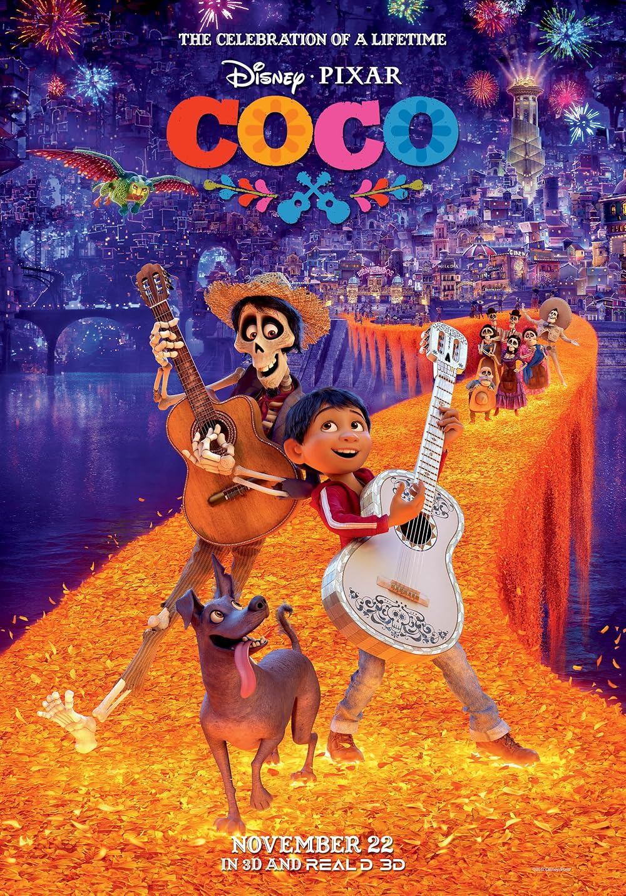
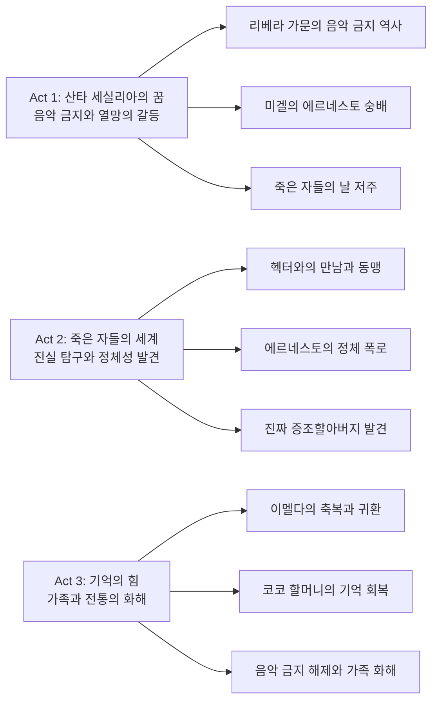
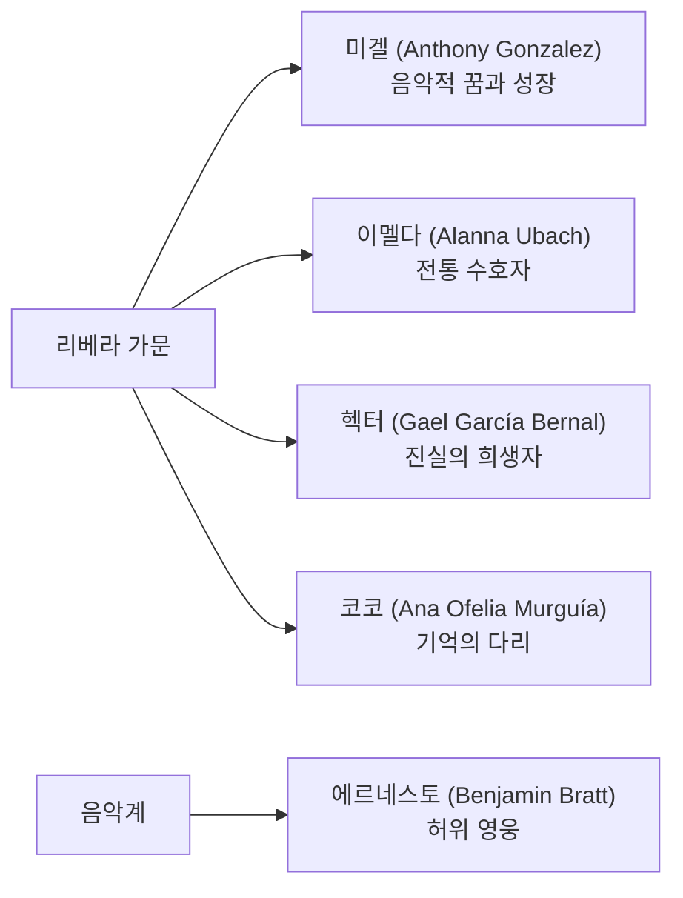

픽사 애니메이션 스튜디오의 2017년 작품 *Coco*는 멕시코의 전통 명절인 '죽은 자들의 날(Día de los Muertos)'을 배경으로 펼쳐지는 가족 애니메이션의 걸작이다. 리 언크리치 감독과 아드리안 몰리나 공동감독이 만들어낸 이 작품은 단순한 어린이 영화를 넘어서, 문화적 깊이와 철학적 성찰을 담은 현대 애니메이션의 새로운 기준점을 제시한다. 음악을 꿈꾸는 12세 소년 미겔의 여정을 통해 가족의 의미, 기억의 힘, 그리고 꿈과 전통 사이의 조화를 탐구하는 이 영화는 시각적 화려함과 정서적 깊이를 동시에 만족시키는 예술 작품이다.

||
|:---:|
||

## 개요

### 영화 정보
* 제목: Coco / 코코
* 감독: 리 언크리치 (Lee Unkrich), 아드리안 몰리나 (Adrian Molina, 공동감독)
* 주연: 안소니 곤살레스 (Anthony Gonzalez), 가엘 가르시아 베르날 (Gael García Bernal), 벤자민 브랫 (Benjamin Bratt)
* 장르: 애니메이션, 판타지, 뮤지컬, 가족영화
* 상영시간: 106분
* 개봉일: 2017.10.27 (미국), 2017.12.21 (한국)
* 제작비: 1억 7천 5백만 달러
* 박스오피스: 8억 7백만 달러 (전 세계)

### 추천 대상
* **가족 관객**: 전 연령층이 함께 즐길 수 있는 감동적인 스토리와 교훈
* **문화 애호가**: 멕시코 전통문화와 죽은 자들의 날에 대한 깊이 있는 탐구
* **애니메이션 팬**: 픽사의 최고 수준 3D 애니메이션 기술과 시각적 스펙터클

## 완전 스토리 로드맵

**🎬 스포일러 전체 공개 - 이미 영화를 본 독자를 위한 완전한 줄거리 재구성**

### 3막 구조 분석

### **Act 1: 산타 세실리아의 꿈**

**가문의 저주 같은 음악 금지**

멕시코의 작은 마을 산타 세실리아에서 리베라 가문은 대대로 구두 제작으로 생계를 이어가고 있다. 이 가문에는 절대 불문율이 하나 있는데, 바로 음악을 금지하는 것이다. 이 금기의 시작은 96년 전, 미겔의 증조할머니 이멜다의 남편이 음악에 대한 꿈을 좇아 아내와 어린 딸 코코를 버리고 떠났던 사건에서 비롯된다.

가족의 마트리아크인 아부엘리타(미겔의 할머니)는 "음악은 가족을 갈라놓는다"며 철저히 음악을 금지한다. 그녀는 손자 미겔이 길거리 음악가의 구두를 닦아주는 것조차 용납하지 않으며, 심지어 미겔이 유리병으로 소리를 내는 것도 막는다. 가족 모두가 이 규칙을 지키며 신발 제작에만 매진하지만, 미겔만은 예외다.

**은밀한 음악적 열정**

12세 소년 미겔은 집 다락방에 에르네스토 데 라 크루즈의 비밀 제단을 만들어놓고, 직접 제작한 기타로 몰래 연습한다. 에르네스토는 산타 세실리아 출신으로 멕시코 역사상 가장 위대한 음악가가 된 전설적 인물이다. "Remember Me", "Un Poco Loco" 같은 명곡들로 전 세계를 매혹시켰던 그는 1942년 무대에서 종이 떨어져 죽는 비극적 사고로 세상을 떠났다.

미겔은 "Seize your moment(순간을 잡아라)"라는 에르네스토의 철학에 깊이 공감하며, 언젠가는 자신도 위대한 뮤지션이 되겠다는 꿈을 품는다. 그의 유일한 동반자는 털 없는 멕시코 국견인 단테뿐이다. 이 개는 미겔의 음악을 함께 들어주는 유일한 가족 구성원이다.

**운명적 발견과 재앙의 시작**

죽은 자들의 날, 가족들이 오프렌다(제단)를 준비하는 동안 미겔은 우연히 증조할머니 이멜다의 사진 액자가 깨지는 것을 목격한다. 액자 뒤에 숨겨진 부분을 발견한 미겔은 놀라운 사실을 알게 된다. 사진에서 얼굴이 찢어진 이멜다의 남편이 에르네스토 데 라 크루즈의 상징적인 해골 기타를 들고 있는 것이다.

이 발견으로 미겔은 자신이 에르네스토의 증손자라고 확신하게 된다. 그는 가족들에게 이 사실을 알리지만, 아부엘리타는 격분하여 미겔의 수제 기타를 부수어버린다. "네가 음악가가 되는 일은 절대 없을 것이다!"라는 할머니의 선언에 미겔은 "이 가족의 일원이 되고 싶지 않아!"라고 소리치며 집을 뛰쳐나간다.

### 핵심 대사 모음

**에르네스토의 거짓 철학**
- "Seize your moment! (순간을 잡아라!)"
- "Remember me, though I have to travel far, remember me... (내가 멀리 떠나야 하더라도 나를 기억해줘...)"

**헥터의 진심 어린 고백**
- "Nothing's more important than family. (가족보다 소중한 건 없어.)"
- "I just wanted to go back home. (난 그냥 집에 돌아가고 싶었어.)"

**이멜다의 깨달음**
- "I thought you left us. (당신이 우리를 버렸다고 생각했어.)"
- "Music had torn apart our family... I was wrong. (음악이 우리 가족을 갈라놓았다고... 내가 틀렸어.)"

**미겔의 성장**
- "Family's supposed to support you! (가족은 서로를 지지해줘야 하는 거잖아!)"
- "I'm proud to be a Rivera. (저는 리베라 가문의 일원인 게 자랑스러워요.)"

### 상징적 장면 분석

**마리골드 다리**: 산 자와 죽은 자를 연결하는 이 다리는 기억이라는 보이지 않는 끈이 얼마나 강력한지를 시각화한다. 사랑과 기억만이 두 세계를 이어주는 유일한 통로임을 상징한다.

**오프렌다의 사진들**: 사진은 단순한 추억을 넘어서 영혼의 생존과 직결되는 생명선이다. 디지털 시대에 사라져가는 물리적 사진의 중요성을 강조하며, 가족사 보존의 의미를 재조명한다.

**헥터의 기타와 에르네스토의 기타**: 같은 모양이지만 완전히 다른 의미를 가진 두 기타는 진정성과 허위, 사랑과 야욕의 대비를 상징한다.

## 등장인물 심층 분석

### 캐릭터 관계도

### **주인공: 미겔 리베라 (Anthony Gonzalez)**

**캐릭터 개요**
* 기본 설정: 12세, 구두 제작업 가문의 아들, 음악에 대한 숨겨진 열정
* 핵심 목표: 가족의 반대를 무릅쓰고 뮤지션이 되기
* 주요 갈등: 꿈과 가족 전통 사이의 갈등

**성장 곡선**
* 반항적 소년 → 진실 탐구자 → 가족의 가치를 이해하는 성숙한 개인
* **핵심 성장 메시지**: 진정한 꿈은 가족을 버리는 것이 아니라 가족과 함께 이루어가는 것

**동기와 욕망**
* 표면적 목표: 유명한 뮤지션이 되어 에르네스토처럼 인정받기
* 내면적 욕구: 자신의 정체성을 찾고 가족 안에서 받아들여지기
* 두려움: 평생 이해받지 못하고 꿈을 포기해야 하는 것

**갈등 구조**
* vs 자신: 가족에 대한 사랑과 음악적 꿈 사이의 내적 갈등
* vs 타인: 가족의 음악 금지 정책과 사회적 기대에 대한 저항
* vs 상황: 죽은 자들의 세계에서 살아남기 위한 생존 투쟁

**상징적 의미**
미겔은 전통과 개인의 꿈 사이에서 고민하는 현대 청소년의 보편적 상징이다. 그의 여정은 서구 개인주의와 라틴 아메리카 집단주의 문화 간의 조화 가능성을 보여준다.

## 요소별 심층 분석

### 기술 요소 분석 테이블

| 기술 요소 | 혁신점/특징 | 시각적/청각적 효과 | 제작 의의 |
|-----------|-------------|-------------------|-----------|
| 3D 애니메이션 | 해골 캐릭터의 복잡한 구조 구현 | 생동감 있는 뼈 움직임과 분리/조립 | 픽사 기술력의 새로운 도전 영역 |
| 색채 디자인 | 생자와 사자 세계의 극명한 대비 | 따뜻한 오렌지 vs 차가운 블루 | 감정적 몰입도 극대화 |
| 문화적 고증 | 멕시코 전통 예술과 건축의 정밀 재현 | 알레브리헤, 오프렌다의 사실적 표현 | 문화적 존중과 교육적 가치 |
| 음향 설계 | 멕시코 전통악기와 현대 오케스트라의 조화 | 몰입감 있는 문화적 사운드스케이프 | 음악 장르 영화로서의 완성도 |

### 연기 & 캐스팅 분석 테이블

| 배우 | 캐릭터 | 연기력 평가 | 캐스팅 적합성 | 특별한 점 |
|------|---------|-------------|---------------|-----------|
| Anthony Gonzalez | 미겔 | 9/10 | 완벽 | 실제 12세 소년의 순수함과 열정을 완벽 표현 |
| Gael García Bernal | 헥터 | 10/10 | 완벽 | 라틴 배우로서의 문화적 진정성과 감정 표현력 |
| Benjamin Bratt | 에르네스토 | 8/10 | 매우 좋음 | 카리스마 있는 악역으로의 완벽한 변신 |
| Alanna Ubach | 이멜다 | 9/10 | 완벽 | 강인함과 모성애의 균형 있는 표현 |
| Ana Ofelia Murguía | 코코 | 9/10 | 완벽 | 노인 캐릭터의 자연스러운 연기 |

### 연출 & 각본 분석

**연출의 강점과 약점 분석**

리 언크리치 감독은 『토이 스토리 3』에서 보여준 감정적 깊이를 『코코』에서도 완벽하게 구현한다. 특히 문화적 민감성을 고려한 세심한 연출이 돋보인다. 그는 멕시코 문화를 관광객의 시선이 아닌 내부자의 관점에서 다루며, 스테레오타입을 피하고 진정성 있는 묘사에 집중한다.

각본의 3막 구조는 고전적이지만 효과적이다. 특히 2막에서의 진실 폭로는 관객의 예상을 뒤엎으면서도 복선에 의해 논리적으로 뒷받침된다. 가족 드라마와 판타지 어드벤처의 균형도 뛰어나다.

**각본의 강점과 약점 분석**

각본가들은 복잡한 가족 관계를 명확하게 정리하여 전달하는 데 성공했다. 특히 헥터의 정체성 반전은 영화사에 길이 남을 훌륭한 트위스트 중 하나다. 하지만 일부 캐릭터(특히 미겔의 부모들)의 개성이 부족한 점은 아쉽다.

### 음악 & 사운드 분석

**특징적 음악 요소와 대표곡 분석**

마이클 지아키노의 음악은 멕시코 전통 음악의 정수를 현대적으로 재해석한 걸작이다. 특히 "Remember Me"는 같은 멜로디가 다른 맥락에서 완전히 다른 의미를 갖게 되는 음악적 서사의 완벽한 예시다. 에르네스토 버전의 화려한 공연용 편곡과 헥터의 소박한 자장가 버전은 각각 허영과 진심을 대변한다.

"Un Poco Loco"는 라틴 음악의 활력과 즐거움을 완벽하게 포착하며, "La Llorona"는 전통 멕시코 민요의 애절함을 현대적으로 재해석한다. 사운드 디자인에서도 죽은 자들의 세계를 표현하는 독특한 음향 효과들이 인상적이다.

## 비교 분석

### 동일 감독/제작사 작품과의 비교

**픽사 애니메이션 스튜디오 계보 내에서의 위치**

『코코』는 『토이 스토리』 시리즈의 감정적 깊이와 『몬스터 주식회사』의 상상력 있는 세계관 구축을 결합한 작품이다. 특히 리 언크리치 감독의 전작 『토이 스토리 3』와 비교해보면, 둘 다 "놓아주기"와 "성장"을 다루지만 『코코』는 더 나아가 "기억하기"와 "연결하기"에 중점을 둔다.

『인사이드 아웃』과 비교해도 흥미로운 지점들이 있다. 두 작품 모두 내면의 여정을 다루지만, 『인사이드 아웃』이 개인의 심리에 집중한다면 『코코』는 집단적 기억과 문화적 정체성을 탐구한다.

### 동일 장르 작품과의 비교

**가족 애니메이션으로서의 비교 분석**

디즈니의 『모아나』(2016)와 비교해보면, 두 작품 모두 전통 문화를 현대적으로 재해석하지만 접근 방식이 다르다. 『모아나』가 개인의 영웅적 여정에 집중한다면, 『코코』는 가족과 공동체의 집단적 치유에 초점을 맞춘다.

드림웍스의 『슈렉』 시리즈와 비교하면 문화적 표현 방식의 차이가 극명하다. 『슈렉』이 서구 중심적 패러디에 의존한다면, 『코코』는 멕시코 문화를 내재적 관점에서 진정성 있게 그려낸다.

### 동시대 경쟁작과의 비교

**2017년 애니메이션 작품들과의 비교**

같은 해 개봉한 『리메임버 미』, 『보스 베이비』, 『이모지 무비』와 비교해보면 『코코』의 예술적 완성도가 얼마나 뛰어난지 알 수 있다. 『코코』만이 유일하게 문화적 깊이와 보편적 감동을 동시에 성취했다.

실사 영화와 비교해도 2017년은 『코코』가 가족 영화의 최고봉을 차지한 해였다. 『원더 우먼』이나 『스타워즈: 라스트 제다이』 같은 블록버스터들이 화제를 모았지만, 순수한 감동과 예술적 완성도에서는 『코코』를 따라올 작품이 없었다.

## 숨겨진 레이어

### 상징적 의미

**죽음에 대한 멕시코적 관점의 현대적 해석**

『코코』에서 죽음은 끝이 아닌 다른 형태의 삶으로 표현된다. 이는 아즈텍과 마야 문명부터 이어져 온 멕시코의 죽음관을 반영한다. 죽은 자들의 세계가 산 자들의 세계보다 더 화려하고 활기찬 것은 죽음에 대한 두려움을 없애고 오히려 삶의 연장선으로 보는 관점을 시각화한 것이다.

**기억과 망각의 변증법**

영화에서 "기억되는 것"과 "잊혀지는 것"은 단순한 개인적 차원을 넘어선다. 헥터의 "최종 죽음"은 개인사가 역사에서 지워지는 과정을 상징한다. 특히 에르네스토가 헥터의 노래를 훔친 것은 문화적 전유(Cultural Appropriation)의 메타포로 해석될 수 있다.

### 사회적/문화적 맥락

**라틴 아메리카 이민자들의 문화적 정체성**

미국에서 제작된 이 영화가 멕시코 문화를 다룬다는 것 자체가 중요한 의미를 갖는다. 트럼프 시대의 반이민 정서 속에서 『코코』는 라틴 문화의 아름다움과 가치를 전 세계에 알리는 역할을 했다. 미겔이 두 세계를 오가는 여정은 이민자 2-3세들이 경험하는 문화적 혼재감을 은유한다.

**가족 중심 문화 vs 개인주의 문화**

서구의 개인주의적 가치관과 라틴 아메리카의 집단주의적 가족관의 대립과 조화를 다룬다. 미겔의 갈등은 현대 사회의 보편적 문제인 "개인의 꿈 vs 가족의 기대" 구조를 문화적 특수성 안에서 해결하는 모범 사례를 제시한다.

### 현대적 메시지

**디지털 시대의 기억 보존**

실물 사진이 디지털화되면서 사라져가는 현실에서, 오프렌다의 사진들은 물리적 기억 매체의 중요성을 강조한다. 헥터의 사진이 물에 젖어 손상되는 장면은 디지털 데이터의 손실 가능성을 암시하기도 한다.

**예술의 진정성과 상업성**

에르네스토와 헥터의 대비는 현대 예술계의 핵심 쟁점을 다룬다. 진정한 예술가는 명성을 위해 창작하는가, 아니면 사랑하는 사람들을 위해 창작하는가? 스트리밍과 SNS 시대에 더욱 중요해진 질문이다.

## 종합 평가

**최종 평점: ★★★★★ (5/5)**

### 한 줄 평
"가족과 전통의 소중함을 죽은 자들의 화려한 세계를 통해 완벽하게 그려낸 픽사의 또 다른 걸작"

### 추천 작품
1. **『리메임버 미』(2017)** - 기억과 가족을 다룬 유사 테마
2. **『토이 스토리 3』(2010)** - 동일 감독의 전작, 성장과 이별의 이야기
3. **『모아나』(2016)** - 전통 문화의 현대적 해석
4. **『인사이드 아웃』(2015)** - 내면 여정과 감정의 탐구
5. **『업』(2009)** - 세대간 이해와 꿈의 실현

### 관람 전 체크리스트
- [ ] 멕시코의 죽은 자들의 날 문화에 대한 기본 지식 습득
- [ ] 라틴 음악, 특히 마리아치에 대한 이해
- [ ] 픽사 애니메이션의 감정적 몰입도에 대한 심리적 준비
- [ ] 가족 관계에 대한 개인적 성찰
- [ ] 문화적 다양성에 대한 열린 마음

**결론적으로 『코코』는 단순한 애니메이션을 넘어서 문화적 교육과 감정적 치유를 동시에 제공하는 예술 작품이다. 멕시코 문화에 대한 깊은 존중과 이해를 바탕으로 제작된 이 영화는 전 세계 관객들에게 가족의 의미와 기억의 소중함을 새롭게 일깨워준다. 시각적 화려함과 음악적 완성도, 그리고 무엇보다 진정성 있는 스토리텔링이 조화를 이룬 픽사의 대표작 중 하나로 평가받을 만하다.**
