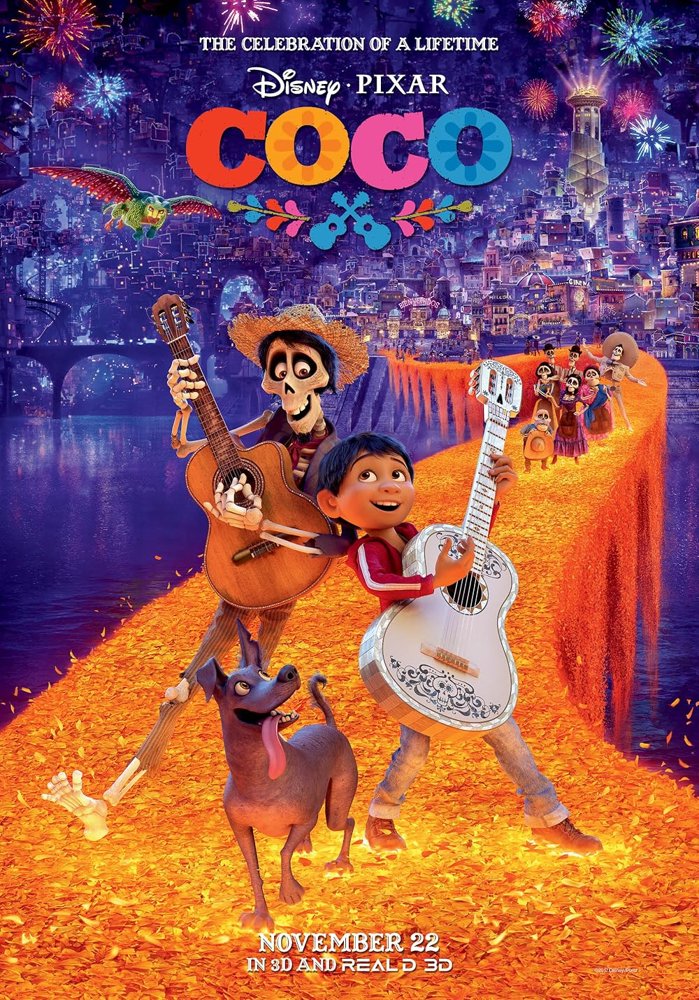
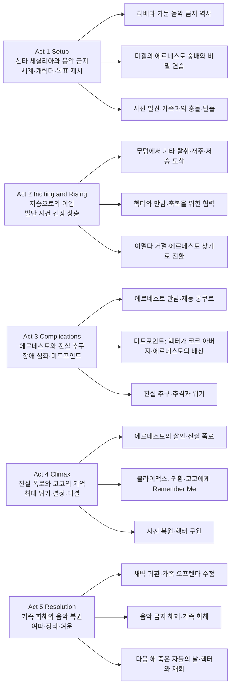
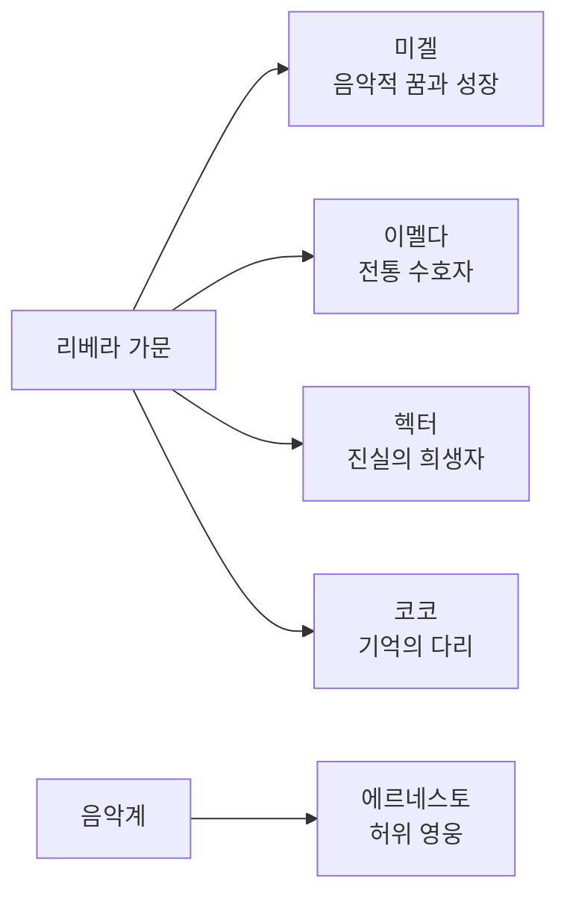

픽사 애니메이션 스튜디오의 2017년 작품 *Coco*는 멕시코의 전통 명절 '죽은 자들의 날(Día de los Muertos)'을 배경으로 펼쳐지는 가족 애니메이션의 걸작이다. 리 언크리치 감독과 아드리안 몰리나 공동감독이 이끈 이 작품은 음악을 꿈꾸는 소년 미겔이 저승을 오가며 진짜 조상을 찾고, 가족의 금기와 상처를 기억과 용서로 풀어가는 이야기다. 문화적 깊이와 시각·음악의 완성도를 모두 갖춘 현대 애니메이션의 대표작으로 꼽힌다.

## 개요

### 영화 정보
* **제목**: Coco / 코코
* **감독**: 리 언크리치 (Lee Unkrich), 아드리안 몰리나 (Adrian Molina, 공동감독)
* **각본**: 아드리안 몰리나, 매튜 알드리치 (Matthew Aldrich), 제이슨 카츠 (Jason Katz), 리 언크리치
* **주연**: 안소니 곤살레스 (Anthony Gonzalez, 미겔), 가엘 가르시아 베르날 (Gael García Bernal, 헥터), 벤자민 브랫 (Benjamin Bratt, 에르네스토 데 라 크루즈), 알라나 우바치 (Alanna Ubach, 이멜다), 아나 오펠리아 무르기아 (Ana Ofelia Murguía, 코코)
* **음악**: 마이클 지아키노 (Michael Giacchino), 제르맹 프랑코 (Germaine Franco), 크리스틴 앤더슨로페즈·로버트 로페즈 (주제곡 "Remember Me")
* **장르**: 애니메이션, 판타지, 뮤지컬, 가족, 모험
* **상영시간**: 105분
* **개봉일**: 2017.10.27 (멕시코), 2017.11.22 (미국), 2017.12.21 (한국)
* **제작사**: 픽사 애니메이션 스튜디오, 월트 디즈니 픽처스
* **배급사**: 월트 디즈니 스튜디오 모션 픽처스
* **제작비**: 약 1억 7,500만 달러
* **평점**: 로튼 토마토 97%, IMDb 8.4/10, 메타크리틱 81점

### 추천 대상
* **가족 관객**: 전 연령이 함께 볼 수 있는 감동과 교훈, 죽음과 기억을 따뜻하게 다룬 접근
* **문화·다큐 관심자**: 멕시코 '죽은 자들의 날'과 전통 음악·오프렌다에 대한 진정성 있는 묘사
* **애니메이션·픽사 팬**: 3D 연출, 색채, 캐릭터 연출과 "Remember Me"를 비롯한 음악 완성도

## 구조 분석 (Act 5)

```mermaid
flowchart LR
    Act1["Act 1 Setup</br>산타 세실리아와 음악 금지</br>세계·캐릭터·목표 제시"]
    Act2["Act 2 Inciting and Rising</br>저승으로의 이입</br>발단 사건·긴장 상승"]
    Act3["Act 3 Complications</br>에르네스토와 진실 추구</br>장애 심화·미드포인트"]
    Act4["Act 4 Climax</br>진실 폭로와 코코의 기억</br>최대 위기·결정·대결"]
    Act5["Act 5 Resolution</br>가족 화해와 음악 복권</br>여파·정리·여운"]
    Act1 --> A1["리베라 가문 음악 금지 역사"]
    Act1 --> A2["미겔의 에르네스토 숭배와 비밀 연습"]
    Act1 --> A3["사진 발견·가족과의 충돌·탈출"]
    Act2 --> B1["무덤에서 기타 탈취·저주·저승 도착"]
    Act2 --> B2["헥터와 만남·축복을 위한 협력"]
    Act2 --> B3["이멜다 거절·에르네스토 찾기로 전환"]
    Act3 --> C1["에르네스토 만남·재능 콩쿠르"]
    Act3 --> C2["미드포인트: 헥터가 코코 아버지·에르네스토의 배신"]
    Act3 --> C3["진실 추구·추격과 위기"]
    Act4 --> D1["에르네스토의 살인·진실 폭로"]
    Act4 --> D2["클라이맥스: 귀환·코코에게 Remember Me"]
    Act4 --> D3["사진 복원·헥터 구원"]
    Act5 --> E1["새벽 귀환·가족 오프렌다 수정"]
    Act5 --> E2["음악 금지 해제·가족 화해"]
    Act5 --> E3["다음 해 죽은 자들의 날·헥터와 재회"]
```

## 영화의 전체 내용 (스포일러 포함)

이하 내용은 이미 영화를 본 독자를 위한 **전체 스포일러**가 포함된 줄거리다. Act 1부터 Act 5까지 장면 비트 [S01]~[S29]로 서술하며, 미드포인트와 클라이맥스는 명시한다.

---

### Act 1 (Setup): 산타 세실리아의 꿈

세계와 리베라 가문의 음악 금지, 미겔의 숨은 꿈, 그리고 죽은 자들의 날 전날의 사진 발견·가족과의 충돌까지가 1막을 이룬다.

**[S01] 산타 세실리아 소개**: 멕시코 작은 마을 산타 세실리아. 거리에는 마리아치와 꽃장식이 넘치고, 리베라 가문은 대대로 구두 제작으로 이름을 알린다.

**[S02] 리베라 가문과 음악 금지**: 가문에는 절대 규칙이 하나 있다. 음악 금지. 아부엘리타(할머니)는 손자들이 음악에 손댈 때마다 채찍(chancla)으로 제재한다. 이 금기는 96년 전, 증조할머니 이멜다의 남편이 음악의 꿈을 좇아 아내와 딸 코코를 두고 떠난 일에서 비롯되었다.

**[S03] 미겔의 비밀**: 12세 미겔은 다락방에 전설의 가수 에르네스토 데 라 크루즈의 비밀 제단을 만들고, 직접 만든 기타로 몰래 연습한다. 에르네스토는 "Remember Me", "Un Poco Loco"로 유명해졌다가 1942년 무대에서 종에 깔려 죽은 인물이다. 미겔은 "Seize your moment(순간을 잡아라)"라는 그의 말을 신조로 삼는다. 유일한 동료는 털 없는 멕시코 개 단테다.

**[S04] 죽은 자들의 날 준비**: 가족은 오프렌다(제단)를 꾸미며 조상들의 사진을 올린다. 미겔은 참여를 거부하고 음악 콩쿠르에 나가겠다고 하지만, 기타가 없어 막막해진다.

**[S05] 이멜다 사진과 찢긴 얼굴**: 오프렌다의 이멜다 사진 액자가 깨지면서, 미겔은 액자 뒤에 숨겨진 부분을 발견한다. 사진에서 얼굴이 찢겨 나간 이멜다의 남편이 **에르네스토의 상징인 해골 기타**를 들고 있다.

**[S06] 미겔의 확신**: 미겔은 자신이 에르네스토의 증손자라고 확신하고, 가족에게 "나는 데 라 크루즈의 피"라고 말한다.

**[S07] 충돌과 기타 파괴**: 아부엘리타는 격분해 미겔의 수제 기타를 부순다. "이 가족에서 음악가가 되는 일은 절대 없을 것이다." 미겔은 "이 가족의 일원이 되고 싶지 않아!"라고 외치며 집을 뛰쳐나간다.

**[S08] 무덤으로**: 미겔은 에르네스토의 무덤에서 기타를 빌리려고 묘지를 찾아간다.

---

### Act 2 (Inciting & Rising): 저승으로

기타를 건드리며 저주에 걸린 미겔이 저승(죽은 자들의 세계)에 떨어지고, 헥터와 손을 잡으며 축복을 구하는 과정이 2막이다.

**[S09] 기타 탈취와 저주**: 무덤에서 에르네스토의 기타를 손에 넣은 순간, 미겔은 살아 있는 몸으로 저승의 존재들이 보이기 시작한다. 기타를 훔친 대가로 새벽이 되기 전에 살아 있는 가족의 축복을 받지 못하면 영원히 해골이 되어 저승에 갇힌다.

**[S10] 저승 입성**: 마리골드 꽃잎 다리를 건너 미겔은 죽은 자들의 세계에 들어선다. 화려한 색채의 도시, 해골로 된 주민들, 오프렌다에 사진이 있는 자만이 그 다리를 건널 수 있다는 규칙을 알게 된다.

**[S11] 헥터와 만남**: 저승에서 사진이 훼손되어 다리를 못 건너는 한 해골, 헥터가 미겔을 구해준다. 헥터는 매년 다리를 건너려다 실패하는데, 살아 있는 가족 중 누군가가 자신의 사진을 오프렌다에 올려줘야만 가능하다. 그런데 세상에서 자신을 기억하는 사람이 거의 없어 "최종 죽음"에 가까워지고 있다.

**[S12] 거래**: 헥터는 미겔을 에르네스토에게 데려가 주는 대신, 미겔이 귀환하면 자신의 사진을 오프렌다에 올려달라고 제안한다. 미겔은 에르네스토에게서 축복을 받으면 새벽 전에 돌아갈 수 있다고 믿고 수락한다.

**[S13] 이멜다와의 대면**: 먼저 만난 것은 리베라 가문의 조상들. 증조할머니 이멜다(저승에서의 모습)는 미겔에게 축복을 주되, **조건**을 건다. "음악을 영원히 포기할 것." 미겔은 거부하고, 에르네스토에게서 무조건적인 축복을 받기로 결심한다.

**[S14] 에르네스토 찾기**: 헥터는 에르네스토가 저승에서 매년 거대한 파티를 연다고 알려준다. 둘은 그 파티가 열리는 곳을 찾아 나선다.

**[S15] 추격과 재회 시도**: 이멜다와 가족들이 미겔을 쫓지만, 미겔과 헥터는 프리다 칼로 같은 인물들의 도움을 받으며 에르네스토의 파티 장소로 향한다.

---

### Act 3 (Complications): 에르네스토와 진실

에르네스토를 만나고 재능 콩쿠르에 나서는 것까지 순조로워 보이지만, 미드포인트에서 헥터의 정체와 에르네스토의 배신이 드러나 이야기가 반전한다.

**[S16] 에르네스토와의 만남**: 미겔은 에르네스토 데 라 크루즈(저승의 해골)를 만난다. 에르네스토는 "너는 데 라 크루즈의 피"라며 미겔을 환영하고, 새벽 전에 무대에 함께 서자고 제안한다.

**[S17] 재능 콩쿠르**: 에르네스토의 파티에서 열리는 재능 콩쿠르에 미겔이 나선다. 헥터는 무대 뒤에서 기다리다가, 에르네스토의 오프렌다에 있는 한 사진을 발견한다. 그 사진은 **헥터 자신**의 얼굴이 찢겨 나간 모습이다. 즉, 에르네스토는 헥터의 옛 파트너였고, 헥터가 죽은 뒤 그의 노래와 기타를 가로챈 인물이라는 복선이 놓인다.

**[S18] 미드포인트 — 헥터가 코코의 아버지·에르네스토의 배신**: 헥터가 진실을 털어놓는다. 자신은 이멜다의 남편이자 **코코의 아버지**다. 고향으로 돌아가려다 에르네스토에게 독이 든 술을 먹고 죽었고, 에르네스토는 그의 곡과 기타를 훔쳐 스타가 됐다. 이멜다와 코코는 그동안 헥터가 가족을 버렸다고만 알고 있었고, 그래서 오프렌다에서 그의 사진을 찢어버린 것이다. 이제 코코(할머니)만이 헥터를 기억하는 마지막 사람인데, 그녀가 망각이 진행되며 헥터는 "최종 죽음" 직전에 있다.

**[S19] 진실 추구와 추격**: 미겔은 에르네스토에게 진실을 묻고, 에르네스토는 헥터를 감금한 뒤 미겔만 데리고 무대로 나가려 한다. 이멜다와 가족, 그리고 단테(저승에서 영혼 동물로 등장)의 도움으로 미겔과 헥터는 탈출하고, 에르네스토의 과거 범행을 세상에 알리기로 한다.

**[S20] 콘서트장으로**: 에르네스토의 대형 콘서트가 열리는 곳으로 미겔과 헥터, 이멜다 일행이 향한다. 한편 헥터는 기억을 잃어가며 점점 사라져 간다.

---

### Act 4 (Climax): 진실 폭로와 코코의 기억

에르네스토의 살인과 표절이 폭로되고, 미겔이 저승에서 돌아와 코코에게 "Remember Me"를 불러 기억을 되살리는 장면이 클라이맥스다.

**[S21] 에르네스토의 진실 폭로**: 콘서트 중 미겔이 무대 위에서 에르네스토가 헥터를 독살하고 노래를 훔쳤다고 고발한다. 녹화 영상이 재생되며 저승의 관중들이 에르네스토를 배신자로 규탄하고, 에르네스토는 오프렌다에서 사진이 떨어져 "최종 죽음"으로 소멸한다.

**[S22] 이멜다의 축복과 귀환**: 이멜다는 "음악 금지" 조건 없이 미겔에게 축복을 준다. "가족을 잊지 마라." 미겔은 헥터의 사진을 되찾아 들고 마리골드 다리를 건너 저승에서 돌아온다. 새벽이 되기 직전이다.

**[S23] 클라이맥스 — 코코에게 Remember Me**: 현실 세계로 돌아온 미겔은 할머니 코코의 방으로 달려간다. 코코는 이미 거의 헥터를 기억하지 못하고, 방 안의 서랍에 있던 찢긴 사진 조각도 그대로다. 미겔은 에르네스토가 아닌 **헥터가 부르던 버전**의 "Remember Me"(자장가)를 코코에게 불러 준다. "내가 멀리 떠나야 하더라도, 나를 기억해 줘." 코코의 눈에 생기가 돌아오고, 그녀는 "Papa…?"라고 중얼거리며 서랍에서 아버지 헥터의 사진 조각을 꺼내 붙인다.

**[S24] 사진 복원과 헥터 구원**: 가족들이 모인 자리에서 미겔이 복원한 사진(헥터의 얼굴이 붙은 이멜다 가족 사진)을 오프렌다에 올린다. 저승에서 사라져 가던 헥터는 다시 형태를 되찾고, 다음 해 다리를 건널 수 있게 된다.

---

### Act 5 (Resolution): 가족 화해와 음악 복권

음악 금지가 해제되고, 다음 해 죽은 자들의 날에 헥터가 가족과 재회하는 것으로 이야기가 마무리된다.

**[S25] 새벽과 가족의 반응**: 다음 날 아침, 리베라 가문은 코코가 아버지 헥터를 기억하게 된 사실과 미겔이 진짜 조상을 찾아온 이야기를 받아들인다.

**[S26] 오프렌다 수정과 음악 복권**: 가족은 오프렌다에 헥터의 사진을 정식으로 올리고, 이멜다와 헥터가 나란히 있는 가족사가 복원된다. 아부엘리타는 "이제 이 집에서는 음악이 금지가 아니다"라고 선언하며, 가문의 음악 금기가 끝난다.

**[S27] 가족과의 화해**: 미겔은 가족 앞에서 기타를 치고 노래하며, 리베라 가문의 일원이자 음악가로서 인정받는다.

**[S28] 다음 해 죽은 자들의 날**: 1년이 지난 죽은 자들의 날. 리베라 가문의 오프렌다에는 이멜다, 헥터, 코코(그동안 세상을 떠남)를 비롯한 조상들의 사진이 함께 걸려 있다.

**[S29] 엔딩 — 저승에서의 재회**: 저승에서 헥터와 이멜다는 코코를 마리골드 다리 건너 맞이한다. 미겔은 살아 있는 세계에서 기타를 연주하며 "Remember Me"를 부르고, 코코와 헥터는 저승에서 함께 그 노래를 듣는다. 가족의 기억과 음악이 세대와 세계를 이어 주는 것으로 영화는 막을 내린다.

---

## 핵심 대사 인덱스

* "Seize your moment! (순간을 잡아라!)" — 에르네스토 데 라 크루즈, [S03]; 미겔이 믿었던 철학이 결국 허위 영웅의 말이었음이 드러남.
* "Nothing's more important than family. (가족보다 소중한 건 없어.)" — 헥터, [S12]; 진정한 조상의 가치관.
* "Remember me, though I have to travel far. Remember me… (내가 멀리 떠나야 하더라도 나를 기억해 줘.)" — 헥터·코코·미겔, [S23]; 자장가 버전이 기억과 구원의 매개가 됨.
* "I'm proud to be a Rivera. (저는 리베라 가문의 일원인 게 자랑스러워요.)" — 미겔, [S27]; 꿈과 가족의 화해.

---

## 캐릭터 분석

### 미겔 리베라 (안소니 곤살레스)

**개요**: 12세 소년. 리베라 가문의 구두 제작 전통 속에서 태어났지만, 음악에 대한 열정을 숨겨 왔다. 에르네스토 데 라 크루즈를 우상으로 삼아 기타와 노래를 몰래 연습한다.

**성장 곡선**: "진짜 조상은 명성이 아니라 나를 기억해 주는 사람"이라는 걸 저승 여정을 통해 깨닫는다. 반항적 소년 → 진실을 추구하는 탐구자 → 가족과 음악을 함께 선택하는 성숙한 일원으로 변화한다.

**동기와 욕망**: 표면적으로는 에르네스토처럼 유명한 뮤지션이 되는 것, 내면적으로는 가족 안에서 자신의 꿈이 인정받는 것. 두려움은 평생 이해받지 못하고 음악을 포기하는 것이다.

**갈등 구조**: 꿈(음악) vs 가문의 금기(전통), 진짜 조상(헥터) vs 허위 영웅(에르네스토), 그리고 새벽 전 축복을 받지 못하면 저승에 갇히는 시간적 제약.

**상징적 의미**: 전통과 개인의 꿈 사이에서 고민하는 청소년의 보편적 상징. 이민·이중문화 가정에서 정체성을 찾는 과정과도 겹쳐 읽힐 수 있다.

---

### 헥터 (가엘 가르시아 베르날)

**개요**: 저승에 사는 해골. 생전에는 이멜다의 남편이자 코코의 아버지였고, 에르네스토와 함께 음악을 만들었으나 고향으로 돌아가기 전 독살당했다. 노래와 기타는 에르네스토에게 도용되었고, 가족은 그를 "버린 남자"로만 기억해 오프렌다에서 사진을 찢어버렸다.

**성장 곡선**: "자신을 기억해 주는 사람"을 찾기 위해 미겔과 거래하던 존재에서, 미겔과 이멜다를 통해 진실이 밝혀지고 가족의 기억과 용서를 되찾는 인물로 완결된다.

**동기와 욕망**: 매년 다리를 건너 딸 코코와 가족을 만나고 싶어 한다. 세상에서 자신을 기억하는 이가 사라지면 "최종 죽음"이 되어 소멸한다는 공포와 싸운다.

**갈등 구조**: 시간(기억 소멸)과의 싸움, 에르네스토에 대한 분노와 복수보다는 "기억되기"에 대한 간절함.

**상징적 의미**: 잊힌 조상, 왜곡된 역사 속에서 진실을 되찾는 존재. "Remember Me"는 그에게 있어 생존과 사랑의 동일시다.

---

### 이멜다 (알라나 우바치)

**개요**: 미겔의 증조할머니. 생전에 남편(헥터)이 음악 때문에 가족을 버렸다고 믿고, 리베라 가문에 음악 금지를 내린 인물이다. 저승에서는 해골이지만 왕족 같은 위엄과 채찍(chancla)으로 손자들을 훈육하는 할머니의 이미지를 유지한다.

**성장 곡선**: "음악 = 가족을 갈라놓는 것"이라는 고정관념에서, 헥터의 진실(독살·도용)을 알게 되며 "음악이 아니라 배신이 가족을 갈라놓았다"고 재해석한다. 마지막에는 조건 없이 미겔에게 축복을 주고, 저승에서 헥터·코코와 다시 가족이 된다.

**동기와 욕망**: 가문의 단합과 자녀(코코) 보호. 남편에 대한 분노와 상처는 진실을 알기 전까지 그대로 유지된다.

**갈등 구조**: 미겔의 꿈(음악) vs 자신이 세운 가문 규율, 헥터에 대한 용서 vs 과거 상처.

**상징적 의미**: 전통을 지키는 강한 어머니이자, 진실 앞에서 규칙을 바꾸는 유연한 수호자.

---

### 에르네스토 데 라 크루즈 (벤자민 브랫)

**개요**: 멕시코의 전설적 가수. 실제로는 파트너 헥터를 독살하고 그의 노래와 기타를 훔쳐 스타가 됐다. 저승에서도 거대한 오프렌다와 파티를 누리지만, 진실이 폭로된 뒤 관중에게 배신자로 낙인찍히고 오프렌다에서 사진이 떨어져 "최종 죽음"으로 소멸한다.

**동기와 욕망**: 명예와 인기. 헥터의 재능을 빼앗아 자신의 것으로 만들고, 미겔까지 "데 라 크루즈의 피"로 이용하려 한다.

**상징적 의미**: 진정성 없는 명성, 기억과 역사 왜곡의 상징. "Remember Me"를 공연용으로만 쓰는 인물과, 자장가로 딸에게 부르는 헥터의 대비가 영화의 테마를 선명히 한다.

---

### 코코 (아나 오펠리아 무르기아)

**개요**: 미겔의 할머니(리베라 가문의 마트리아크 아부엘리타의 어머니). 고령으로 기억이 흐려져 가며, 아버지 헥터에 대한 기억도 사라져 간다. 영화 제목 'Coco'는 그녀의 이름에서 왔다.

**성장 곡선**: 망각 속에 있다가 미겔이 "Remember Me"를 불러 주며 "Papa?"라고 반응하고, 서랍에서 헥터의 사진 조각을 꺼내 붙여 준다. 그 한 장면으로 저승의 헥터가 구원되고, 가족사가 복원된다.

**상징적 의미**: 기억의 마지막 다리. "기억되는 한 존재한다"는 영화의 핵심 메시지를 몸으로 보여주는 인물.

---

## 캐릭터 관계도

```mermaid
graph LR
    Rivera["리베라 가문"] --> Miguel["미겔</br>음악적 꿈과 성장"]
    Rivera --> Imelda["이멜다</br>전통 수호자"]
    Rivera --> Hector["헥터</br>진실의 희생자"]
    Rivera --> Coco["코코</br>기억의 다리"]
    MusicWorld["음악계"] --> Ernesto["에르네스토</br>허위 영웅"]
```

---

## 영상미와 음악

### 시각 효과 / 촬영 / 미학
* **색채**: 산 자의 세계(산타 세실리아)는 따뜻한 오렌지·노랑·마리골드, 저승은 네온과 보라·청록이 섞인 화려한 도시로 대비되어 감정과 세계관을 구분한다.
* **해골 캐릭터**: 픽사는 해골의 뼈 구조·분리·조립을 3D로 세밀히 구현해, 공포가 아니라 유머와 감정 표현에 쓰인다.
* **문화적 고증**: 멕시코의 알레브리헤(환상 동물 조각), 오프렌다, 마리골드 다리, 전통 의상·건축을 내부자 시선으로 재현해 스테레오타입을 피했다.
* **의상·소품**: 이멜다의 채찍(chancla), 에르네스토와 헥터의 해골 기타 등이 서사와 정체성에 연결된다.

### 음악감독의 음악
* **"Remember Me"**: 에르네스토의 화려한 공연 버전과 헥터의 자장가 버전이 같은 멜로디로 허영과 진심을 대비한다. 클라이맥스에서 미겔이 코코에게 부르는 자장가 버전이 기억과 구원의 매개가 된다.
* **"Un Poco Loco"**: 라틴 리듬과 코미디가 결합된 넘버로, 미겔과 헥터의 유대를 보여준다.
* **"La Llorona"** 등 전통 멕시코 민요를 현대적으로 편곡해 분위기와 문화적 깊이를 더했다.
* 마이클 지아키노·제르맹 프랑코의 오케스트레이션과 멕시코 악기의 조화가 세계관을 일관되게 만든다.

---

## 종합 평가

### 최종 평점: ★★★★★ (5.0/5.0)

**장점**:
* 가족·기억·죽음·문화를 한 편에 녹여 내는 주제와 서사 완성도
* "Remember Me"의 이중 버전과 헥터 정체성 반전을 활용한 감동적 클라이맥스
* 멕시코 '죽은 자들의 날'과 오프렌다에 대한 존중 있는 묘사와 시각·음악적 구현
* 전 연령이 함께 볼 수 있는 접근성과 감동의 깊이

**단점**:
* 미겔의 부모 등 일부 조연의 개성은 상대적으로 약함
* 2막 중반까지의 구조는 전형적인 "저승 모험" 패턴에 가깝고, 미드포인트 이후 반전에서 차별화됨

### 한 줄 평

"가족과 기억, 죽은 자들의 날을 한 편에 담은 픽사의 감동 걸작. 같은 노래가 허영과 진심으로 갈라지는 순간이 잊히지 않는다."

### 추천 작품
* 《토이 스토리 3》(2010): 동일 감독(리 언크리치), 성장·이별·놓아주기
* 《인사이드 아웃》(2015): 내면 여정과 감정, 기억의 역할
* 《모아나》(2016): 전통 문화와 청년 주인공의 정체성 탐구

### 관람 전 체크리스트
* **사전 지식이 필요한가?** 필수는 아니나, '죽은 자들의 날'(Día de los Muertos)과 오프렌다에 대해 알면 문화적 맥락을 더 잘 즐길 수 있다.
* **어린이와 함께 볼 수 있는가?** 가능하다. 등급 PG(미국), 전체관람가(한국). 죽음·해골이 나오지만 공포보다는 기억과 가족에 초점이 있다.
* **특정 요소를 기대해도 되는가?** 음악(특히 "Remember Me"), 멕시코 문화 재현, 반전과 클라이맥스의 감동을 기대해도 좋다.
* **쿠키 영상이 있는가?** 엔딩 크레딧 후 제작진이 조상들에게 바치는 오프렌다 모자이크 영상이 있다.
* **속편 가능성은?** 공식 속편 계획은 없었으며, 단일 완결로 설계된 작품에 가깝다.

---

## 참고 문헌 및 출처

- [Coco (2017) — IMDb](https://www.imdb.com/title/tt2380307/)
- [Coco — Rotten Tomatoes](https://www.rottentomatoes.com/m/coco_2017)
- [Coco — Box Office Mojo](https://www.boxofficemojo.com/title/tt2380307/)
