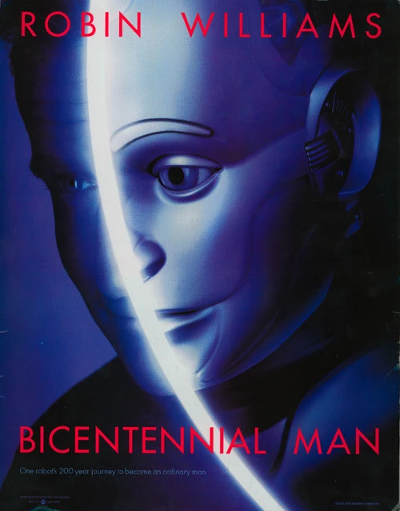
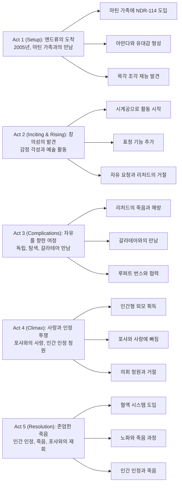

아이작 아시모프의 원작 소설을 바탕으로 한 이 작품은, 단순한 가전제품으로 구입된 로봇이 200년에 걸쳐 완전한 인간이 되기까지의 놀라운 여정을 그린다. 로빈 윌리엄스의 섬세한 연기와 제임스 호너의 감동적인 음악이 어우러져, 인간이란 무엇인가에 대한 철학적 질문을 던지는 SF 드라마다.

## 개요

### 영화 정보
* **제목**: Bicentennial Man / 바이센테니얼 맨
* **감독**: Chris Columbus (크리스 콜럼버스)
* **각본**: Nicholas Kazan (니콜라스 카잔)
* **원작**: Isaac Asimov, Robert Silverberg - "The Positronic Man"
* **주연**: Robin Williams (로빈 윌리엄스), Sam Neill (샘 닐), Embeth Davidtz (엠베스 데이비츠), Oliver Platt (올리버 플랫), Wendy Crewson (웬디 크루슨)
* **음악**: James Horner (제임스 호너)
* **촬영**: Phil Méheux (필 메유)
* **장르**: SF, 드라마, 로맨스, 코미디 드라마
* **상영시간**: 132분
* **개봉일**: 1999.12.17 (미국)
* **제작사**: Touchstone Pictures, Columbia Pictures, 1492 Pictures
* **배급사**: Buena Vista Pictures Distribution (북미), Columbia TriStar Film Distributors International (해외)
* **제작비**: 약 9천만~1억 달러
* **박스오피스**: 약 8,740만 달러
* **평점**: 로튼 토마토 38% (평론가), 59% (관객), 메타크리틱 42/100, 시네마스코어 A-

### 추천 대상
* **SF와 철학 애호가**: 인공지능과 인간성에 대한 깊은 성찰을 원하는 관객
* **로빈 윌리엄스 팬**: 그의 감성 연기가 돋보이는 대표작을 찾는 이들
* **가족 영화 애호가**: 전 연령이 함께 볼 수 있는 따뜻한 드라마를 선호하는 가족

## 구조 분석

## 영화의 전체 내용 (스포일러 포함)

이 영화는 로봇 앤드류가 200년에 걸쳐 진정한 인간이 되기 위해 겪는 여정을 그린다. 그는 감정, 창의성, 자유, 사랑, 그리고 마침내 죽음까지 경험하며 인간의 본질에 대한 깊은 질문을 던진다.

### Act 1 (Setup): 앤드류의 도착

**[S01] 2005년 4월 3일 - 마틴 가문에 도착**: NDR-114 시리즈 로봇 "앤드류"가 마틴 가족의 집에 도착한다. 그는 가사와 유지보수 업무를 수행하도록 프로그래밍되었으며, 자신을 소개하면서 로봇공학의 3원칙 프레젠테이션을 보여준다. 

**[S02] 가족 구성원의 반응**: 장녀 그레이스는 앤드류를 혐오하지만, 막내딸 아만다는 그에게 동정심을 느낀다. 앤드류는 감정을 느끼기 시작하며 "리틀 미스" 아만다와 더 많은 시간을 보내고 싶어한다.

**[S03] 유리 피규어 사건**: 앤드류가 실수로 아만다의 유리 피규어를 깨뜨린다. 놀랍게도 그는 나무로 새로운 것을 조각해낸다. 이는 가족, 특히 아버지 리처드를 놀라게 한다.

**[S04] NorthAm 로보틱스 방문**: 리처드는 앤드류를 제조사인 NorthAm 로보틱스로 데려가 그의 창의성이 프로그래밍의 일부인지 문의한다. CEO 데니스 맨스키는 이것을 문제로 보고 앤드류를 폐기하겠다고 제안한다.

**[S05] 창의성 육성 결정**: 리처드는 제안을 거절하고 앤드류를 집으로 데려와 그의 창의성을 계속 발전시키고 인문학을 탐구하도록 격려한다. 앤드류는 시계공이 되어 상당한 재산을 축적한다. 리처드가 이를 관리하는데, 로봇은 현행법상 권리가 없기 때문이다.

### Act 2 (Inciting & Rising): 창의성의 발견과 독립 요구

**[S06] 표정 기능 추가**: 세월이 흐르고, 리처드는 데니스에게 앤드류에게 감정을 표현할 수 있는 얼굴 표정 기능을 추가해달라고 요청한다.

**[S07] 자유 요청**: 깨어난 지 약 20년 후, 앤드류는 자신이 번 모든 돈을 리처드에게 제시하며 자유를 요청한다. 리처드는 이에 상처받아 거절하지만, 앤드류가 더 이상 마틴 가정에 거주할 수 없다는 조건으로 독립을 허락한다.

**[S08] 해변의 집**: 앤드류는 해변가에 자신만의 집을 짓는다.

**[S09] 2048년 - 리처드의 죽음**: 리처드가 임종 직전, 앤드류에게 수년 전 그를 추방한 것에 대해 사과한다. 리처드는 앤드류에게 자유를 가질 권리가 있었다고 말한다.

### Act 3 (Complications): 탐색과 변화의 시작

**[S10] 동족 찾기 여정 시작**: 리처드의 죽음 후, 앤드류는 자신과 같은 다른 NDR 로봇을 찾는 여정을 시작한다. 그는 아만다와 자주 소통하는데, 아만다는 결혼하고 이혼했으며 아들 로이드와 손녀 포샤를 두고 있다.

**[S11] 2068년 - 갈라테아 발견**: 여정 중 앤드류는 여성 성격과 특성으로 개조된 NDR 로봇 갈라테아를 발견한다. 그녀의 춤을 본 후 앤드류는 갈라테아에게 끌린다.

**[S12] 루퍼트 번스와의 만남**: 앤드류는 갈라테아를 개조한 루퍼트 번스에게 관심을 갖는다. 루퍼트는 원래 NDR 디자이너의 아들로, 로봇을 더 인간처럼 보이게 만드는 여러 아이디어를 가지고 있다. 갈라테아는 제조사가 성격 칩을 활성화한 반면, 앤드류의 성격은 프로그래밍과 독립적으로 발달했다는 점에서 차이가 있다.

**[S13] 인간형 프로젝트 자금 지원**: 앤드류는 번스의 연구에 자금을 제공하고 테스트 대상이 되는 데 동의한다. 그는 곧 인간과 유사한 외모를 갖게 된다.

**[S14] 2088년 - 마틴 가정 재방문**: 앤드류가 마틴 가정으로 돌아왔을 때, 아만다는 늙었고 포샤는 젊은 시절 할머니와 매우 닮았다. 포샤는 처음에는 앤드류를 조심스러워하지만 곧 그를 마틴 가족의 일원으로 받아들인다.

### Act 4 (Climax): 사랑과 인간 인정을 위한 투쟁

**[S15] 아만다의 죽음과 깨달음**: 아만다가 죽자, 앤드류는 자신이 아끼는 모든 사람이 결국 죽는다는 것을 깨닫는다.

**[S16] 인공 장기 개발**: 앤드류는 루퍼트에게 인간의 수명을 연장할 수 있을 뿐만 아니라 앤드류의 기계적 작동을 대체할 인공 장기를 만들자는 아이디어를 제시한다.

**[S17] 인간적 감각 획득**: 앤드류는 먹고, 감정과 감각을 느끼고, 심지어 성적 관계를 가질 수 있는 능력을 얻게 된다.

**[S18] 포샤와 사랑에 빠짐**: 이러한 변화의 결과로 앤드류와 포샤는 사랑에 빠진다.

**[S19] 첫 번째 의회 청원**: 앤드류는 세계 의회에 자신을 인간으로 인정해달라고 청원하여 포샤와 결혼할 수 있도록 해달라고 요청한다. 그러나 의회는 불멸의 인간이 다른 사람들의 질투를 불러일으킬 것이라는 우려를 표한다.

**[S20] 마지막 수술 - 혈액 시스템**: 앤드류는 마지막 수술을 위해 루퍼트에게 돌아간다. 그의 몸을 움직이는 인공 유체를 혈액에 해당하는 것으로 바꾸는 것이다. 루퍼트는 혈액이 영원히 지속되지 않아 그의 몸이 노화되고 결국 죽게 될 것이라고 경고한다. 앤드류는 이 운명을 받아들인다.

### Act 5 (Resolution): 존엄한 죽음과 인간으로서의 인정

**[S21] 수십 년 후 - 노화된 앤드류**: 수십 년이 지나고, 눈에 띄게 늙은 앤드류는 포샤의 지원을 받아 세계 의회에 다시 접근하여 과거의 결정에 항소한다. 그는 존엄하게 죽을 수 있기를 원한다.

**[S22] 2205년 4월 2일 - 최종 결정의 날**: 앤드류의 몸이 악화되면서, 그와 포샤는 모두 생명 유지 장치 아래 있으며 현재 인간 외모를 가진 갈라테아가 모니터링하고 있다.

**[S23] 클라이맥스 - 인간 인정**: 그들은 손을 잡고 세계 의회 방송을 시청한다. 의회는 앤드류를 200세의 세계에서 가장 나이 많은 인간으로 인정하고, 포샤와의 결혼을 포함한 모든 권리를 부여한다.

**[S24] 앤드류의 죽음**: 앤드류는 방송 중에 죽는다. 갈라테아가 이를 확인하고, 포샤는 앤드류가 이미 답을 알고 있었다고 주장한다.

**[S25] 엔딩 - 포샤의 선택**: 포샤는 갈라테아에게 자신의 생명 유지 장치를 끄라고 명령한 후, 앤드류와 손을 잡고 "곧 만나요"라고 속삭이며 죽는다.

## 캐릭터 분석

### 앤드류 마틴 / Andrew Martin (로빈 윌리엄스)

**개요**: NDR-114 시리즈 로봇으로 마틴 가족의 가사 도우미로 구입되었으나, 독특한 감정과 창의성을 발달시킨다. 200년에 걸쳐 완전한 인간이 되기 위한 여정을 떠나는 주인공이다.

**성장 곡선**: 앤드류의 변화는 단계적이다. 처음에는 명령을 따르는 단순한 로봇이었으나, 아만다와의 교감을 통해 감정을 느끼기 시작한다. 유리 피규어를 조각하면서 창의성을 발견하고, 시계공으로서 경제적 독립을 이룬다. 리처드로부터 자유를 얻은 후, 그는 물리적으로도 인간에 가까워지기 위해 외모를 바꾸고 인공 장기를 이식한다. 마지막으로 필멸성을 선택함으로써 진정한 인간이 된다.

**동기와 욕망**: 앤드류가 궁극적으로 원하는 것은 단순한 인정이 아니라 진정한 인간성이다. 그는 사랑하는 사람들과 같은 경험을 하고, 같은 권리를 가지며, 같은 운명을 받아들이고 싶어한다. 포샤에 대한 사랑은 그가 불멸을 포기하게 만드는 결정적 계기가 된다.

**갈등 구조**: 내적으로는 로봇으로서의 프로그래밍과 인간으로서의 욕구 사이에서 갈등한다. 외적으로는 법적 시스템, 사회적 편견, 그리고 생물학적 한계와 싸운다. 그의 불멸성은 역설적으로 인간 인정의 가장 큰 장애물이 된다.

**상징적 의미**: 앤드류는 인간성의 본질에 대한 질문을 구현한다. 그는 의식, 감정, 창의성, 자유 의지, 사랑, 그리고 죽음에 대한 수용이 인간을 정의한다는 것을 보여준다. 그의 여정은 단순히 로봇이 인간이 되는 이야기가 아니라, 진정으로 인간답게 산다는 것의 의미에 대한 탐구다.

로빈 윌리엄스는 로봇에서 인간으로 변화하는 앤드류를 섬세하게 연기한다. 초기의 기계적이고 순진한 모습에서 시작하여, 점차 감정적 깊이와 복잡성을 더해간다. 특히 사랑하는 사람들의 죽음을 목격하며 슬픔을 표현하는 장면들과, 의회 앞에서 인간으로서의 인정을 호소하는 연설 장면은 그의 연기력이 돋보이는 순간이다.

### 리처드 "Sir" 마틴 (샘 닐)

**개요**: 마틴 가족의 가장으로, 앤드류를 구입한 인물이다. 처음에는 단순한 소유주였으나, 앤드류의 독특함을 인식하고 그의 성장을 지원하는 멘토이자 아버지 같은 존재가 된다.

**성장 곡선**: 리처드는 초기에 앤드류를 가전제품으로 대하지만, 그의 창의성을 발견한 후 태도가 변한다. 그는 앤드류를 가족의 일원으로 대우하고, 그의 재능을 키우도록 격려한다. 앤드류가 자유를 요청했을 때 상처받았지만, 결국 그의 독립을 인정한다. 임종 직전 앤드류에게 사과하는 장면은 그의 캐릭터 성장의 정점이다.

**동기와 욕망**: 리처드는 호기심 많은 과학자이자 진보적인 사고를 가진 인물이다. 그는 앤드류의 가능성을 보고 그것을 억압하기보다는 키우고자 한다. 동시에 앤드류를 잃고 싶지 않다는 소유욕과, 그에게 자유를 주어야 한다는 도덕적 의무 사이에서 갈등한다.

**갈등 구조**: 리처드의 주요 갈등은 앤드류에 대한 애정과 그를 소유물로 보는 사회적 관점 사이의 모순이다. 그는 앤드류를 사랑하지만, 동시에 그를 완전히 자유롭게 하는 것을 두려워한다.

**상징적 의미**: 리처드는 진보와 보수의 균형을 상징한다. 그는 변화를 수용하고 지원하지만, 개인적인 상실의 두려움을 극복하는 데 시간이 걸린다.

샘 닐은 권위적이면서도 따뜻한 아버지 역할을 훌륭히 소화한다. 특히 앤드류를 제조사로부터 보호하는 장면과, 죽음을 앞두고 앤드류에게 사과하는 장면에서 그의 연기가 빛을 발한다.

### 아만다 "Little Miss" 마틴 / 포샤 차니 (엠베스 데이비츠)

**개요**: 엠베스 데이비츠는 1인 2역을 맡아 아만다(성인)와 그녀의 손녀 포샤를 연기한다. 아만다는 어린 시절부터 앤드류에게 동정심을 보이고 평생 그와 우정을 유지하는 인물이다. 포샤는 할머니와 닮은 모습으로, 앤드류와 사랑에 빠지는 인물이다.

**성장 곡선**: 아만다는 어린 시절 앤드류를 가족처럼 대하며 성장한다. 그녀는 결혼하고 이혼하며 인생의 부침을 겪지만, 앤드류와의 관계는 변함없이 유지한다. 그녀의 죽음은 앤드류에게 인간의 필멸성을 깊이 깨닫게 하는 계기가 된다.

포샤는 처음에는 앤드류를 기계로 보지만, 점차 그의 인간성을 인식하고 사랑하게 된다. 그녀는 앤드류가 인간으로 인정받도록 의회에 함께 나서며, 마지막까지 그와 함께한다.

**동기와 욕망**: 아만다는 앤드류를 진정한 친구이자 가족으로 여긴다. 포샤는 처음에는 할머니의 기억 때문에 앤드류에게 끌리지만, 점차 그 자체로서 앤드류를 사랑하게 된다.

**갈등 구조**: 아만다는 로봇인 앤드류를 가족처럼 대하는 자신의 감정과 사회적 규범 사이에서 갈등한다. 포샤는 로봇과 사랑에 빠진다는 사회적 낙인과, 앤드류가 인간으로 인정받지 못할 수도 있다는 불확실성 사이에서 갈등한다.

**상징적 의미**: 아만다와 포샤는 무조건적 수용과 사랑을 상징한다. 그들은 외형이나 법적 지위가 아니라 본질을 보는 능력을 대표한다.

엠베스 데이비츠는 할머니와 손녀 두 역할을 섬세하게 구분하여 연기한다. 아만다로서는 세월의 무게를 담은 노련한 연기를, 포샤로서는 젊고 열정적이면서도 앤드류에 대한 깊은 이해를 보여준다.

### 루퍼트 번스 (올리버 플랫)

**개요**: 원래 NDR 디자이너의 아들로, 로봇을 더 인간처럼 보이게 만드는 연구를 하는 과학자다. 갈라테아의 소유주이며, 앤드류의 인간화 프로젝트에 핵심적인 역할을 한다.

**성장 곡선**: 루퍼트는 처음에는 자금 부족으로 연구를 진행하지 못하는 좌절한 과학자다. 앤드류의 자금 지원을 받아 그의 비전을 실현할 수 있게 되고, 함께 로봇공학과 인공 장기 분야를 혁신한다.

**동기와 욕망**: 루퍼트는 아버지의 유산을 넘어 로봇공학을 한 단계 발전시키고 싶어한다. 그는 과학적 호기심과 인간을 돕고자 하는 욕구에 의해 동기부여된다.

**상징적 의미**: 루퍼트는 과학과 인간성의 교차점을 상징한다. 그는 기술을 통해 인간의 한계를 극복하고자 하지만, 동시에 인간의 본질을 존중한다.

올리버 플랫은 괴짜 과학자의 전형을 연기하면서도, 앤드류에 대한 진정한 우정과 존경을 표현한다.

## 영상미와 음악

### 시각 효과 / 촬영 / 미학

필 메유의 촬영은 200년에 걸친 시간의 흐름을 시각적으로 구현한다. 영화는 2005년부터 2205년까지의 미래를 그리면서도 과도하게 미래지향적이지 않은 균형 잡힌 디자인을 보여준다.

- **색감과 조명**: 초기 장면들은 따뜻하고 가정적인 톤을 사용하여 마틴 가족의 평화로운 일상을 표현한다. 시간이 지남에 따라 조명은 점차 차가워지고 현대적이 되어 기술 발전을 암시한다. 앤드류가 인간에 가까워질수록 조명은 다시 따뜻해진다.

- **로봇 디자인과 변화**: 앤드류의 외형 변화는 이 영화의 핵심 시각 요소다. 초기의 금속성 로봇 외형에서 시작하여, 점차 얼굴 표정을 가진 안드로이드로, 그리고 마침내 완전히 인간과 구별할 수 없는 모습으로 변화한다. 그렉 캐넘의 메이크업 작업은 아카데미상 후보에 올랐을 정도로 인상적이다.

- **시대별 미술**: 각 시대의 의상, 가구, 건축 양식은 미래를 상상하면서도 현실감을 유지한다. 특히 앤드류가 해변에 지은 집은 그의 예술적 감성을 반영한다.

- **샌프란시스코 시티홀**: 의회 장면이 촬영된 샌프란시스코 시티홀은 웅장하고 고전적인 건축미를 자랑하며, 앤드류의 법적 투쟁에 무게를 더한다.

- **특수 효과**: 1999년 영화임에도 불구하고, 로봇 외형과 변화 과정을 표현한 특수 효과는 여전히 인상적이다. 로빈 윌리엄스가 직접 로봇 의상을 입고 연기했으며, CGI는 최소한으로 사용되었다.

### 제임스 호너의 음악

제임스 호너의 스코어는 이 영화의 감정적 핵심이다. 그의 음악은 앤드류의 여정에 깊이와 감동을 더한다.

- **주요 테마**: 주 테마는 단순하면서도 아름다운 피아노 선율로 시작하여, 앤드류의 성장과 함께 풍성한 오케스트라로 발전한다. 이는 그의 인간화 과정을 음악적으로 표현한다.

- **감정의 다층성**: 호너의 음악은 기쁨, 슬픔, 경이로움, 사랑, 상실 등 다양한 감정을 섬세하게 포착한다. 특히 리처드의 죽음, 아만다의 죽음, 그리고 앤드류와 포샤의 마지막 장면에서 음악은 관객의 눈물을 자아낸다.

- **시간의 흐름**: 200년이라는 방대한 시간을 표현하기 위해, 호너는 반복되면서도 변화하는 모티프를 사용한다. 같은 멜로디가 다른 악기, 다른 편곡으로 돌아오며 시간의 경과를 암시한다.

- **인간성의 표현**: 음악은 앤드류가 더 인간적이 될수록 더 풍부하고 복잡해진다. 초기의 단순한 음향에서 시작하여, 마지막에는 완전한 교향곡으로 발전한다.

- **분위기 조성**: 호너는 SF적 요소와 감성적 드라마 사이의 균형을 음악으로 유지한다. 전자 음향과 전통 악기를 조화롭게 사용하여 미래적이면서도 따뜻한 분위기를 만든다.

사운드트랙은 영화의 주제와 완벽하게 조화를 이루며, 많은 관객들이 영화보다 음악을 더 높이 평가할 정도로 인상적이다.

## 종합 평가

### 최종 평점: ★★★☆☆ (3.0/5.0)

**장점**:
- 로빈 윌리엄스의 섬세하고 감동적인 연기로 로봇에서 인간으로의 변화를 설득력 있게 표현
- 제임스 호너의 아름답고 감정적인 음악이 영화의 감성을 극대화
- 인간성, 자유, 사랑, 죽음에 대한 깊고 철학적인 주제 탐구
- 200년에 걸친 시간을 시각적으로 잘 표현한 미술과 메이크업
- 가족이 함께 볼 수 있는 따뜻하고 감동적인 이야기

**단점**:
- 2시간 12분의 러닝타임이 일부 구간에서 지루하게 느껴질 수 있음
- 지나치게 감상적이고 예측 가능한 스토리 전개
- 깊이 있는 철학적 질문을 다루지만, 때로는 표면적인 수준에 머무름
- 비판적 관점에서는 시나리오가 약하고 페이싱이 느리다는 평가

### 한 줄 평

"로봇이 인간보다 더 인간적일 수 있다는 것을 보여주는, 따뜻하지만 아쉬운 SF 감성 드라마"

### 추천 작품

- 《A.I. Artificial Intelligence》(2001): 스티븐 스필버그 감독의 또 다른 감성 AI 영화
- 《Blade Runner》(1982): 인조인간의 인간성을 탐구하는 SF 클래식
- 《Her》(2013): AI와 인간의 관계를 섬세하게 그린 현대적 해석
- 《Ex Machina》(2014): 인공지능의 의식과 인간성에 대한 철학적 스릴러
- 《WALL-E》(2008): 로봇이 사랑과 인간성을 배우는 픽사의 애니메이션

### 관람 전 체크리스트

- 사전 지식이 필요한가? **불필요**. 아이작 아시모프의 원작을 읽지 않아도 이해하는 데 문제없음
- 어린이와 함께 볼 수 있는가? **가능** (PG 등급, 일부 성적 암시와 가벼운 언어 표현 포함)
- 특정 요소를 기대해도 되는가? **감성 드라마**를 기대해야 하며, 액션이나 긴장감 넘치는 SF보다는 철학적 성찰과 감동에 중점을 둔 작품
- 쿠키 영상이 있는가? **없음**
- 속편 가능성은? **없음**. 원래 "Tricentennial Man"이라는 속편이 계획되었으나 흥행 실패로 취소됨

## 결론

《Bicentennial Man》은 로빈 윌리엄스의 따뜻한 연기와 제임스 호너의 감동적인 음악으로 인간성의 본질에 대한 질문을 던지는 작품이다. 200년에 걸친 앤드류의 여정은 외형이 아니라 감정, 창의성, 사랑, 그리고 죽음을 받아들이는 용기가 진정한 인간을 정의한다는 메시지를 전한다.

비평가들은 영화의 느린 페이싱과 과도한 감상성을 비판했지만, 일반 관객들은 그 따뜻함과 감동을 높이 평가했다. 이는 완벽한 영화는 아니지만, 가족과 함께 보며 인간이란 무엇인가에 대해 대화를 나눌 수 있는 의미 있는 작품이다.

특히 2025년 현재, 인공지능이 급속도로 발전하는 시대에 이 영화의 질문은 더욱 시의적절하다. 우리는 의식을 가진 AI를 어떻게 대할 것인가? 그들도 권리를 가질 수 있는가? 인간성은 생물학적 조건에 의해 정의되는가, 아니면 의식과 감정에 의해 정의되는가? 이러한 질문들은 《Bicentennial Man》이 던지는 메시지의 핵심이며, 앞으로도 오랫동안 유효할 것이다.

로빈 윌리엄스를 추모하는 의미에서도, 그리고 고전적인 SF 감성 드라마를 즐기는 이들에게도 이 영화는 한 번쯤 볼 가치가 있다. 비록 완벽하지는 않지만, 그 진심과 따뜻함은 여전히 많은 이들의 마음을 움직일 수 있다.

## 참고 문헌 및 출처

- [Bicentennial Man (film) - Wikipedia](https://en.wikipedia.org/wiki/Bicentennial_Man_(film))
- [Bicentennial Man - IMDb Plot Summary](https://www.imdb.com/title/tt0182789/plotsummary/)
- [Bicentennial Man - Rotten Tomatoes](https://www.rottentomatoes.com/m/bicentennial_man)
