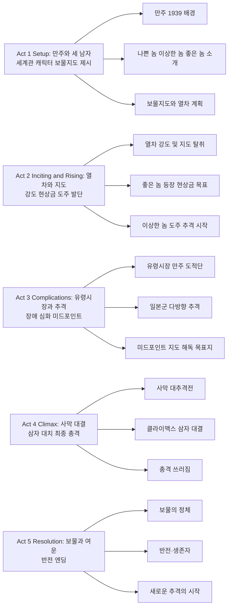

《The Good, The Bad, The Weird》(놈놈놈)은 김지운 감독이 2008년 선보인 '김치 웨스턴'이다. 세르조 레오네의 《좋은 놈 나쁜 놈 이상한 놈》에 오마주하면서 1939년 일제 강점기 만주를 배경으로, 현상금 사냥꾼·킬러·도둑 세 남자가 보물지도를 두고 쫓고 쫓기는 대서사극을 그린다. 열차 강도, 유령시장, 사막 대추격까지 정우성·이병헌·송강호 삼자의 케미와 김지운식 연출이 결합된 한국형 액션 걸작이다.

## 개요

### 영화 정보
* **제목**: The Good, The Bad, The Weird / 좋은 놈, 나쁜 놈, 이상한 놈 (놈놈놈)
* **감독**: Kim Jee-woon (김지운)
* **각본**: Kim Jee-woon, Kim Min-suk (김지운, 김민석)
* **주연**: Jung Woo-sung (정우성, 도원), Lee Byung-hun (이병헌, 창이), Song Kang-ho (송강호, 태구)
* **음악**: Dalpalan, Jang Young-gyu (달파란, 장영규)
* **촬영**: Lee Mo-gae (이모개)
* **편집**: Nam Na-young (남나영)
* **미술**: Cho Hwa-sung (조화성)
* **장르**: Western, Action, Adventure, Comedy, Thriller
* **상영시간**: 139분 (한국판), 129분 (국제판)
* **개봉일**: 2008.07.17 (한국), 2008.05.24 (칸 영화제), 2010.04.23 (미국)
* **제작사**: Barunson E&A, Grimm Pictures, CJ Entertainment
* **배급사**: CJ Entertainment
* **제작비**: 약 1,000만 달러
* **평점**: IMDb 7.2/10, Rotten Tomatoes 81%, Metascore 69, 2008년 한국 흥행 2위

### 추천 대상
* **웨스턴·액션 팬**: 스파게티 웨스턴 오마주와 말·오토바이·차량이 뒤섞인 대규모 추격전
* **한국 영화 애호가**: 정우성·이병헌·송강호 삼자의 연기와 김지운 감독의 스타일리시한 연출
* **코미디와 스릴을 함께 원하는 관객**: 유쾌한 캐릭터와 긴장감 넘치는 전개가 공존
* **역사·만주 배경에 관심 있는 관객**: 1930년대 말 만주의 혼란과 다층 세력 구도

## 구조 분석 (Act 5단계)

## 영화의 전체 내용 (스포일러 포함)

아래 내용은 이미 관람한 독자를 위한 상세 줄거리입니다. **스포일러가 전부 포함되어 있으니 미관람 시 주의하세요.**

1939년 만주, 일본군·만주 도적·현상금 사냥꾼·킬러가 한 장의 보물지도를 두고 격돌한다. '이상한 놈' 태구가 지도를 손에 넣으면서 좋은 놈 도원, 나쁜 놈 창이, 그리고 일본군과 만주 도적단까지 한꺼번에 추격전에 휘말린다. 유령시장을 거쳐 사막까지 이어지는 대추격 끝에 세 남자는 '보물'이 있는 곳에서 최종 대결을 펼친다.

### Act 1 (Setup): 만주와 세 남자

**[S01] 만주 1939**: 1939년, 제2차 세계대전 직전 만주 사막과 황야가 펼쳐진다. 일본 제국주의의 그림자 아래 한인·중국인·일본인·도적들이 뒤섞여 살고 있다.

**[S02] 나쁜 놈 창이**: 킬러이자 도적 두목인 박창이(이병헌)가 일본 관료가 소지한 보물지도를 빼앗기 위해 열차 습격을 준비한다. 냉혈하고 스타일리시한 인물로 그려진다.

**[S03] 이상한 놈 태구**: 홍후자(도적) 윤태구(송강호)는 같은 열차를 노리며 돈과 보물에 눈이 달려 있다. 때로는 코믹하고 때로는 치밀한 모습을 보인다.

**[S04] 좋은 놈 도원**: 현상금 사냥꾼 박도원(정우성)은 창이의 현상금을 노리고 만주를 누비며 그를 추적하고 있다. 냉정하고 실력 있는 '좋은 놈'이다.

**[S05] 보물지도의 비밀**: 일본 측은 그 지도가 '일본 제국을 구할' 비밀과 연결된다고 믿고, 만주 도적들은 유령시장에서 지도를 거래하려 한다. 태구는 청나라가 멸망 직전 숨긴 금은보화가 있다고 믿는다.

### Act 2 (Inciting & Rising): 열차와 지도

**[S06] 열차 강도**: 창이 일당이 열차를 습격하고 일본·만주 경비와 민간인을 무자비하게 제거한다. 동시에 태구도 열차 안에서 물건을 털며 보물지도를 손에 넣는다.

**[S07] 좋은 놈의 등장**: 도원이 현장에 나타나 창이의 현상금을 노리고 개입한다. 열차 안은 창이·도원·태구가 뒤엉킨 혼전이 된다.

**[S08] 지도 탈취와 도주**: 태구는 지도를 챙겨 혼란을 틈타 도망친다. 창이와 도원은 서로를 견제하면서도 태구를 쫓기 시작한다.

**[S09] 네 번째 세력**: 만주 도적단도 보물지도를 유령시장에서 팔려는 목적으로 태구를 노린다. 일본군 역시 지도를 되찾기 위해 추격대를 보낸다.

**[S10] 추격의 서막**: 태구는 동료 망길(류승수) 등과 함께 지도를 풀어보며 보물 위치를 찾고, 창이·도원·도적단·일본군이 각각 그를 추적한다.

### Act 3 (Complications): 유령시장과 추격

**[S11] 유령시장**: 태구는 유령시장(흑시)에 들러 지도 거래나 정보를 구하려 하고, 이곳에서 다양한 세력이 교차한다.

**[S12] 만주 도적단**: 김판주(송영창)가 이끄는 만주 도적단이 태구와 지도를 노린다. 일본군도 유령시장 일대를 수색한다.

**[S13] 연쇄 격돌**: 도원은 창이를 잡으려 하고, 창이는 태구의 지도를 빼앗으려 하며, 태구는 살아남기 위해 온갖 수단을 쓴다. 총격전과 격투가 이어진다.

**[S14] 미드포인트 - 지도 해독과 목표지**: 지도의 의미가 풀리고, 보물이 묻힌 것으로 알려진 사막 한곳이 최종 목표로 확정된다. 모든 세력이 그곳을 향해 몰린다.

**[S15] 대규모 추격 준비**: 일본군 대부대, 창이 일당, 도원, 태구와 망길, 만주 도적단이 말·오토바이·차량을 동원해 사막으로 향하는 대추격이 시작된다.

### Act 4 (Climax): 사막 대결

**[S16] 사막 추격전**: 광활한 만주 사막에서 일본군·도적단·창이·도원·태구가 한꺼번에 격돌한다. 말과 오토바이, 차량이 뒤섞인 대규모 액션이 펼쳐진다.

**[S17] 일본군과 도적단 소멸**: 일본군이 도적단 대부분을 쓰러뜨리고, 도원은 폭발물 등으로 일본군을 물리친다. 창이 일당도 점차 줄어들고, 도주하려는 부하를 창이가 직접 제거한다.

**[S18] 세 남자만 남음**: 결국 보물이 있다고 표시된 자리까지 도달하는 것은 도원, 창이, 태구 세 사람뿐이다.

**[S19] 클라이맥스 - 보물의 정체**: 세 사람이 도착한 '보물'의 위치는 텅 빈 구덩이에 가깝이 막혀 있는 허무한 공간이다. 보물은 없고, 서로에 대한 원한만 남는다.

**[S20] 과거의 진실**: 창이는 태구를 '손가락 자른 놈'으로 알아본다. 수년 전 칼부림에서 창이의 손가락을 잘랐던 인물이 태구였고, 도원이 창이로 알고 있던 그 '손가락 자른 놈'도 사실 태구였다는 반전이 드러난다.

**[S21] 삼자 대치와 총격**: 복수와 이해관계가 겹치며 세 사람은 멕시칸 스탠드오프처럼 서로를 겨누다가 동시에 총을 쏜다. 세 사람 모두 쓰러진다.

### Act 5 (Resolution): 보물과 여운

**[S22] 쓰러진 세 남자**: 도원, 창이, 태구는 모래 위에 쓰러져 죽어 가며, 그들이 목숨을 걸었던 '쓸모없는 구덩이'만 남는다.

**[S23] 엔딩 - 반전**: 갑자기 그 구덩이에서 원유(crude oil)가 분출한다. 보물은 금은보화가 아니라 미래의 '검은 황금'이었던 셈이다. 도원과 태구는 살아남고, 태구는 다시 도망치며 도원이 그 뒤를 쫓는 것으로 이야기가 끝난다.

**[S24] 한국판 대안 엔딩**: 한국 극장판에서는 태구가 방탄용 금속판을 재킷 안에 숨겨 살아남고, 창이 시체에서 다이아몬드를 발견해 웃다가 일본군에 포위된다. 실수로 점화한 다이너마이트로 일본군을 흩어버리고, 크레딧과 함께 현상금이 배로 오른 태구를 도원이 쫓는 장면으로 이어진다.

### 쿠키 영상

본작에는 미드·포스트 크레딧 장면이 없으며, 한국판은 크레딧 중 태구의 도주와 도원의 추격이 이어지는 연장 엔딩이 있다.

## 핵심 대사 인덱스

"사람들은 죽을 걸 알면서도, 영원히 살 것처럼 산다. 웃기지." — 창이, [S02]; 나쁜 놈의 냉소적 세계관

"손가락 자른 놈." — 창이, [S20]; 과거의 원한과 정체성 반전

## 캐릭터 분석

### 박도원 / 좋은 놈 (정우성)

**개요**: 현상금 사냥꾼. 창이의 현상금을 노리고 만주를 쫓아다니며, 냉정하고 실력 있는 '선의의 사냥꾼'으로 그려진다.

**성장 곡선**: 처음에는 단순히 현상금이라는 목표만 있으나, 태구·창이와 얽히면서 '좋은 놈'으로서의 선과 의리가 상황과 충돌한다. 최종 삼자 대결에서도 목숨을 건 선택을 하고, 엔딩에서 태구를 다시 쫓는 것은 현상금만이 아닌 '끝내야 할 일'에 대한 집착으로 읽힌다.

**동기와 욕망**: 창이를 잡아 현상금을 받는 것. 법과 질서 쪽에 선 인물로, 하지만 만주라는 무법지대에서 자신만의 규칙으로 행동한다.

**갈등 구조**: 창이를 잡아야 하는데 태구가 지도를 가져 도주하면서 목표가 꼬인다. 나중에는 '손가락 자른 놈'이 창이가 아니라 태구였음을 알게 되어 정체성과 원한이 뒤섞인 대결로 치닫는다.

**상징적 의미**: 클래식 웨스턴의 '선한 사냥꾼'을 한국적 맥락으로 재해석한 인물. 완전한 선은 아니지만, 나쁜 놈·이상한 놈과 대비되는 '기준선' 역할을 한다.

**정우성의 연기**: 과하지 않은 카리스마와 액션으로 '좋은 놈'의 냉정함과 결의를 잘 담았다. 송강호·이병헌과의 삼자 구도에서 무게감을 맞춘다.

### 박창이 / 나쁜 놈 (이병헌)

**개요**: 보물지도를 노리는 킬러이자 도적 두목. 일본 측에 고용되어 지도를 가져오려 하나, 태구에게 선수를 빼앗긴다.

**성장 곡선**: 처음에는 단순한 '나쁜 놈'으로 보이지만, 중후반 과거가 드러나며 '손가락 자른 놈'에 대한 집착이 복수의 동기임이 밝혀진다. 보물보다 원한이 더 큰 인물로, 최종 대결에서 그 원한이 폭발한다.

**동기와 욕망**: 보물지도 확보(고용주의 목적)와, 자신의 손가락을 잘랐던 태구에 대한 복수. 체면과 잔인성으로 세력을 유지한다.

**갈등 구조**: 도원(현상금 사냥꾼), 태구(지도 소유자), 일본군·도적단과 모두 이해가 엇갈린다. 부하를 배신자로 간주해 직접 제거하는 등 내부의 적도 다룬다.

**상징적 의미**: '나쁜 놈'의 전형—목적을 위해 수단을 가리지 않지만, 과거의 트라우마에 묶여 있어 완전한 악당이라기보다 비극적 복수자에 가깝다.

**이병헌의 연기**: 스타일리시한 악역으로 김지운 감독과의 호흡이 잘 맞는다. 《달콤한 인생》《악마를 보았다》와 이어지는 '냉혈한이지만 매력적인' 캐릭터 라인을 유지한다.

### 윤태구 / 이상한 놈 (송강호)

**개요**: 홍후자(도적)로, 열차에서 보물지도를 훔쳐 도주한다. 돈과 보물에 대한 욕심과 생존 본능이 강하고, 코믹하면서도 위기 때는 치밀한 면모를 보인다.

**성장 곡선**: '이상한 놈'으로 시작해 도둑·사기꾼 같은 이미지지만, 과거에 창이의 손가락을 자른 인물이었다는 게 뒤늦게 드러나며 '위험한 놈'의 이력이 더해진다. 최종적으로는 보물이 허무한 것임을 보고도 살아남아, 한국판에서는 도원에게 다시 쫓기며 '추격의 반복'으로 남는다.

**동기와 욕망**: 청나라가 숨긴 금은보화를 찾아 한탕 하려는 것. 그 과정에서 수단과 방법을 가리지 않지만, 기본적으로는 생존과 이익 추구에 충실한 인물이다.

**갈등 구조**: 도원·창이·일본군·만주 도적단 모두에게 쫓기며, 지도를 지키거나 팔아넘기거나 해독하는 과정에서 끊임없이 위기에 빠진다. 내적 갈등보다는 외부 압력이 캐릭터를 움직인다.

**상징적 의미**: '이상한 놈'—선과 악의 이분법에 잘 안 들어가는, 기회주의적이지만 인간미 있는 인물. 웨스턴의 'ugly'를 한국식으로 '이상한'으로 바꾼 유쾌한 캐스팅이다.

**송강호의 연기**: 코미디와 긴장감을 오가며 영화의 리듬을 이끈다. 정우성·이병헌과의 삼자 대비가 선명하고, '김치 웨스턴'의 유머와 액션을 대표하는 캐릭터를 완성한다.

## 영상미와 음악

### 시각 효과 / 촬영 / 미학

**만주 공간**: 중국 간쑤 등에서 촬영된 사막과 황야는 클래식 웨스턴의 광활한 배경을 연상시키며, 1930년대 만주의 혼란을 시각적으로 담았다. 먼지와 볕, 말과 오토바이·차량이 한 화면에 어우러진다.

**촬영**: 이모개(이모게)의 카메라워크는 열차 강도·유령시장·사막 추격에서 빠른 컷과 워킹, 액션 연출과 호흡을 맞춘다. 웨스턴의 와이드 샷과 근접 격투·총격 장면이 교차한다.

**미장센과 의상**: 동양과 서양이 섞인 의상(한복·중국복·일본군·웨스턴 복장), 유령시장과 열차 세트는 시대와 장소감을 살린다. 조화성(미술)의 세트가 장면마다 스케일을 준다.

**특수효과**: 실사 스턴트와 폭발·말 낙마 등이 중심이고, CGI는 보조 수준으로 사용되어 액션의 리얼리티를 유지한다.

### 음악감독의 음악

**달파란·장영규**: 웨스턴 기타와 동양적 리듬이 섞인 스코어로, 스파게티 웨스턴의 분위기를 한국·만주 맥락으로 재해석했다. 추격과 대치 장면에서 텐션과 유머를 함께 올린다.

**주요 테마**: 말 달리기·추격·대결 장면에 반복되는 모티프가 액션의 리듬과 맞물린다. 레오네 작품의 모리콘에 대한 오마주 느낌을 주면서도 독자적인 톤을 유지한다.

**사운드**: 총격·폭발·엔진 소리 등 사운드 디자인이 액션의 몰입감을 높인다.

## 종합 평가

### 최종 평점: ★★★★☆ (4.0/5.0)

**장점**:
- **삼자 구도의 완성도**: 정우성·이병헌·송강호의 '좋은 놈·나쁜 놈·이상한 놈' 캐스팅과 연기가 웨스턴 오마주를 한국적으로 소화한다.
- **대규모 액션**: 열차 강도, 유령시장 격돌, 사막 대추격까지 세트피스가 크고 리듬이 빠르다. 말·오토바이·차량이 한꺼번에 등장하는 장면이 인상적이다.
- **김지운식 연출**: 《달콤한 인생》《악마를 보았다》로 이어지는 스타일리시한 연출과 편집(남나영)이 액션과 톤을 통일한다.
- **반전과 여운**: '보물'이 금은보화가 아니라 원유라는 반전, 그리고 살아남은 자들의 새 추격은 허무함과 유쾌함을 동시에 남긴다.
- **촬영·미술·음악**: 이모개의 촬영, 조화성의 미술, 달파란·장영규의 음악이 장르 분위기를 살린다.

**단점**:
- **플롯 밀도**: 보물지도를 둘러싼 추격이 주를 이루어 캐릭터 심화나 서사 깊이는 제한적이다. 일부에선 후반 피로감을 언급하기도 한다.
- **폭력성**: 총격·칼부림·인명 손실이 많아 폭력에 민감한 관객에게는 부담될 수 있다.
- **한국판·국제판 차이**: 상영시간과 엔딩이 달라, 본인이 보는 버전에 따라 인상이 다소 달라질 수 있다.

### 한 줄 평

"1939년 만주, 보물지도를 둘러싼 좋은 놈·나쁜 놈·이상한 놈의 쫓고 쫓기는 김치 웨스턴—정우성·이병헌·송강호와 김지운 감독의 액션 케미."

### 추천 작품

- 《좋은 놈 나쁜 놈 이상한 놈》(1966): 세르조 레오네 원작. 본작의 직접적 오마주 대상.
- 《달콤한 인생》(2005): 김지운 감독, 이병헌 주연. 스타일리시한 한국 액션·멜로.
- 《악마를 보았다》(2010): 김지운 감독. 한국형 스릴러·복수물.
- 《곡성》(2016): 한국형 장르 혼합. 다른 맛의 '한국 웨스턴'에 가까운 분위기를 원할 때.
- 《밀정》(2016): 일제 시대 배경 액션·드라마.

### 관람 전 체크리스트

- **사전 지식이 필요한가?** 필요 없음. 레오네 작품을 알면 오마주를 더 즐기지만, 모르더라도 독립적으로 감상 가능하다.
- **어린이와 함께 볼 수 있는가?** **비권장**. 폭력·총격·살인이 많아 15세 이상·성인 관람에 적합하다.
- **특정 요소를 기대해도 되는가?** 웨스턴·액션·코미디·한국 영화 스타일을 기대하면 만족도가 높다. 깊은 인물 드라마보다는 '쫓고 쫓기는 액션'에 초점이 있다.
- **쿠키 영상이 있는가?** **없음**. 한국판은 크레딧과 함께 연장 엔딩(태구 도주·도원 추격)이 이어진다.
- **속편 가능성은?** 공식 속편 계획은 없으며, 엔딩은 '새 추격의 시작'으로 열린 결말을 남긴다.

## 결론

《The Good, The Bad, The Weird》는 김지운 감독이 스파게티 웨스턴을 1939년 만주로 가져와 '김치 웨스턴'으로 재해석한 작품이다. 보물지도 한 장을 두고 펼쳐지는 열차 강도, 유령시장, 사막 대추격은 정우성·이병헌·송강호의 삼자 구도와 맞물려 한국 액션 영화의 스케일과 연출력을 보여준다. 보물이 금은보화가 아니라 원유라는 반전과, 살아남은 자들이 다시 쫓고 쫓기는 엔딩은 허무함과 유쾌함을 동시에 남기며 오래 기억에 남는다. 웨스턴과 한국형 액션을 함께 즐기고 싶은 관객에게 추천한다.

## 참고 문헌 및 출처

- [The Good, the Bad, the Weird (2008) — IMDb](https://www.imdb.com/title/tt0901487/)
- [The Good, the Bad, the Weird — Rotten Tomatoes](https://www.rottentomatoes.com/m/the_good_the_bad_the_weird)
- [The Good, the Bad, the Weird — Wikipedia](https://en.wikipedia.org/wiki/The_Good,_the_Bad,_the_Weird)
