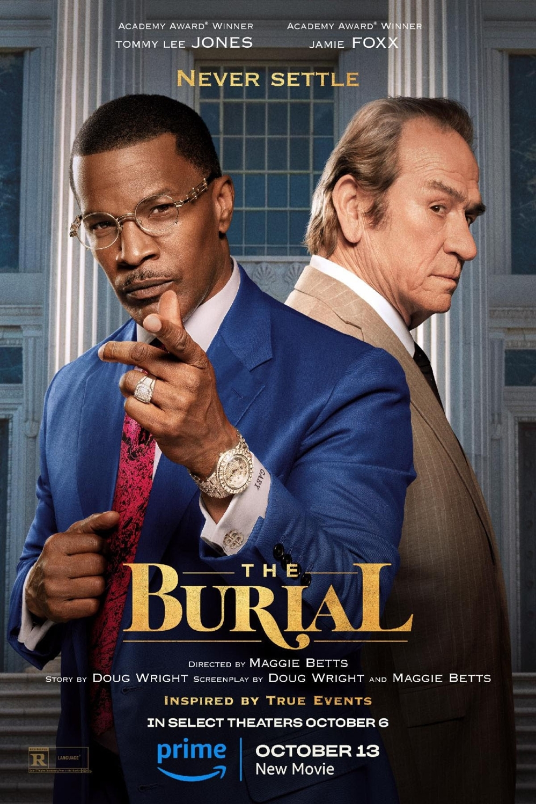
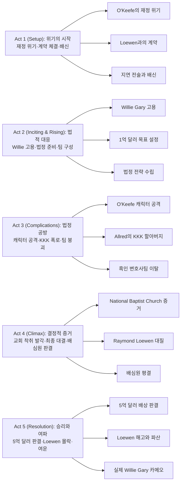

영화 **The Burial (2023)**는 실화를 바탕으로 한 법정 드라마로, 파산 위기에 처한 장례식장 주인과 화려한 변호사가 대기업의 부정에 맞서 싸우는 감동적인 이야기를 담고 있습니다. Maggie Betts 감독의 섬세한 연출과 Jamie Foxx, Tommy Lee Jones의 환상적인 연기 케미스트리가 돋보이는 작품입니다.

## 개요

### 영화 정보
* **제목**: The Burial / 더 베리얼
* **감독**: Maggie Betts
* **각본**: Doug Wright, Maggie Betts
* **원작**: Jonathan Harr의 The New Yorker 기사 "The Burial" (1999)
* **주연**: Jamie Foxx (Willie E. Gary 역), Tommy Lee Jones (Jeremiah O'Keefe 역)
* **조연**: Jurnee Smollett (Mame Downes 역), Alan Ruck (Mike Allred 역), Mamoudou Athie (Hal Dockins 역), Pamela Reed (Annette O'Keefe 역), Bill Camp (Raymond Loewen 역)
* **음악**: Michael Abels
* **촬영**: Maryse Alberti
* **편집**: Lee Percy, Jay Cassidy
* **장르**: 법정 드라마, 전기 영화, 드라마
* **상영시간**: 126분 (2시간 6분)
* **등급**: R (언어)
* **개봉일**: 
  - 2023.09.11 (토론토 국제영화제)
  - 2023.10.06 (미국 극장 제한 개봉)
  - 2023.10.13 (Prime Video 스트리밍)
* **제작사**: Amazon MGM Studios, Double Nickel Entertainment, Foxxhole Productions, Maven Screen Media, Bobby Shriver Productions
* **배급사**: Amazon Prime Video
* **제작비**: 약 3,250만 달러
* **평점**: 
  - Rotten Tomatoes 92% (비평가 122명)
  - Rotten Tomatoes 83% (관객 500+ 평점)
  - Metacritic 74/100

### 추천 대상
* **법정 드라마 팬**: 치밀한 법적 공방과 극적인 반전이 가득한 실화 기반 법정 드라마
* **사회 정의에 관심 있는 관객**: 인종 차별과 기업 부패에 맞선 정의 구현의 감동적인 이야기
* **연기력을 중시하는 관객**: Jamie Foxx와 Tommy Lee Jones의 환상적인 케미스트리와 연기력

## 구조 분석

## 영화의 전체 내용 (스포일러 포함)

이 영화는 1995년 미시시피를 배경으로, 파산 위기에 처한 장례식장 주인이 대기업을 상대로 벌이는 법정 투쟁을 그립니다. 실화를 바탕으로 한 이 이야기는 단순한 계약 분쟁을 넘어 인종 차별, 기업 부패, 그리고 정의 구현이라는 더 큰 주제를 다룹니다.

### Act 1 (Setup): 위기의 시작

**[S01] 1995년 미시시피 - O'Keefe의 장례식장**: Jeremiah Joseph O'Keefe는 미시시피에서 여러 개의 장례식장을 운영하는 사업가입니다. 그러나 사업 파트너가 폰지 사기에 연루되면서 큰 재정적 손실을 입게 됩니다.

**[S02] 미시시피 주 보험위원회 압박**: 재정 문제로 인해 미시시피 주 보험위원회로부터 압박을 받게 된 O'Keefe는 사업의 일부를 매각해야 하는 상황에 처합니다.

**[S03] Raymond Loewen과의 만남**: O'Keefe는 캐나다의 대형 장례업체 Loewen Group의 CEO Raymond Loewen과 협상을 시작합니다. 3개의 장례식장을 매각하기로 계약을 체결합니다.

**[S04] 구두 합의 - 장례 보험 금지**: O'Keefe는 계약 조건으로 Loewen Group이 자신의 영역에서 장례 보험을 판매하지 않을 것을 요구하고, Loewen은 이에 구두로 동의합니다.

**[S05] 4개월 후 - 대금 지연**: 계약 체결 후 4개월이 지났지만 Loewen Group은 3개 장례식장에 대한 대금을 지불하지 않습니다.

**[S06] 배신의 발각**: 더 심각한 것은 Raymond Loewen이 구두 합의를 어기고 장례 보험을 판매하기 시작했다는 사실입니다.

**[S07] Hal Dockins의 분석**: 젊은 변호사 Hal Dockins는 이것이 단순한 지연이 아니라 의도적인 전략임을 간파합니다. Loewen은 O'Keefe를 파산시켜 더 낮은 가격에 전체 사업을 인수하려는 계획입니다.

### Act 2 (Inciting & Rising): 법적 대응

**[S08] Willie E. Gary를 찾아서**: Dockins의 제안으로 O'Keefe는 플로리다의 유명한 인신상해 변호사 Willie E. Gary를 찾아갑니다. Dockins는 백인 계약 변호사 Mike Allred만으로는 흑인이 많을 것으로 예상되는 배심원단을 설득하기 어려울 것이라고 판단합니다.

**[S09] Willie Gary의 등장**: Willie E. Gary는 화려한 옷차림과 카리스마 넘치는 언변으로 유명한 변호사입니다. 그는 롤스로이스를 타고 다니며, 자신의 성공을 과시하는 스타일입니다.

**[S10] 첫 미팅 - 800만 달러 vs 1억 달러**: Mike Allred는 현실적으로 800만 달러의 합의금을 목표로 제안하지만, Willie Gary는 자신감 넘치게 1억 달러를 받아낼 수 있다고 장담합니다.

**[S11] 큰 결단 - 집을 담보로**: 거액의 잠재적 보상에 흥분한 O'Keefe는 Willie Gary를 수석 변호사로 임명하고, 변호사 비용을 마련하기 위해 자신의 집까지 재담보로 맡깁니다.

**[S12] Loewen의 대응 - 흑인 변호사팀**: Loewen Group도 유사한 전략을 취합니다. 배심원단 구성을 고려하여 유능한 흑인 여성 변호사 Mame Downes를 중심으로 한 변호사팀을 고용합니다.

**[S13] 법정 준비**: Willie Gary는 자신의 흑인 법률팀을 데려와 사건을 준비합니다. 그의 팀은 화려하고 공격적인 스타일로 유명합니다.

**[S14] 전략 수립**: Gary와 Dockins는 단순한 계약 위반을 넘어 Loewen Group의 기업 부패와 인종 차별적 관행을 공격하는 전략을 세웁니다.

### Act 3 (Complications): 법정 공방

**[S15] 재판 시작**: 법정에 모든 당사자들이 모입니다. 분위기는 긴장감으로 가득 차 있습니다.

**[S16] Mame Downes의 공격**: Mame Downes는 O'Keefe의 캐릭터를 공격하기 시작합니다. 그녀는 O'Keefe의 재정 문제가 자업자득임을 주장합니다.

**[S17] 중죄범과의 거래 폭로**: Downes는 O'Keefe의 재정 문제가 현재 유죄 판결을 받은 중죄범과의 사업 거래에서 비롯되었다고 폭로합니다. 이는 O'Keefe의 신뢰성에 큰 타격을 줍니다.

**[S18] Gary에 대한 비난**: O'Keefe는 법정에서의 불리한 상황을 Willie Gary 탓으로 돌리기 시작합니다. 그는 Gary의 화려한 스타일이 백인 판사와 일부 배심원들에게 부정적으로 비칠 수 있다고 우려합니다.

**[S19] 리더십 교체**: 갈등이 고조되고, O'Keefe는 Willie Gary를 수석 변호사 자리에서 물러나게 하고 Mike Allred를 다시 수석 변호사로 임명합니다.

**[S20] Dockins의 발견**: 한편 Dockins는 Loewen이 소수 인종 커뮤니티에 과다 청구하는 관행이 있다는 중요한 증인을 찾아냅니다.

**[S21] KKK 폭로**: 그러나 Mame Downes는 강력한 반격을 준비합니다. 그녀는 Mike Allred의 할아버지가 Ku Klux Klan(KKK) 회원이었다는 사실을 법정에서 폭로합니다.

**[S22] Allred의 당황**: 이 폭로로 Allred는 당황하고, 법정의 분위기는 급격히 변합니다. 흑인 배심원들의 표정이 굳어집니다.

**[S23] 미드포인트 - Gary의 옹호**: Willie Gary는 일어나서 Allred를 옹호합니다. 그는 할아버지의 과거가 손자의 현재를 정의할 수 없다고 열변을 토합니다. 그러나 이 행동은 예상치 못한 결과를 낳습니다.

**[S24] 흑인 법률팀의 이탈**: Gary가 백인 변호사 Allred를 옹호한 것에 분노한 그의 흑인 법률팀이 사건에서 손을 떼고 떠나버립니다.

**[S25] Allred의 결단**: Allred는 자신이 이 사건에 너무 많은 부담이 되고 있음을 깨닫습니다. 그는 팀의 승소 가능성을 높이기 위해 스스로 사건에서 물러나기로 결정합니다.

**[S26] 최악의 상황**: O'Keefe는 사건을 완전히 포기하려 합니다. 집까지 담보로 잡힌 상황에서 패소하면 모든 것을 잃게 될 것이기 때문입니다.

### Act 4 (Climax): 결정적 증거

**[S27] Dockins의 마지막 노력**: 포기 직전, Dockins는 끈질긴 조사를 통해 결정적인 단서를 찾아냅니다. 그것은 흑인 National Baptist Church와 관련된 것입니다.

**[S28] 교회 착취 증거**: Dockins는 Loewen Group이 National Baptist Church 회원들을 착취하여 과도하게 비싼 장례 패키지를 흑인 커뮤니티에 판매했다는 증거를 발견합니다.

**[S29] 증인 출석**: 교회 관계자들이 법정에 증인으로 출석합니다. 그들은 Loewen이 어떻게 신뢰를 이용해 과도한 가격을 청구했는지 증언합니다.

**[S30] Raymond Loewen 대질**: Willie Gary는 Raymond Loewen을 증인석으로 불러냅니다. 그는 교회 착취 혐의에 대해 질문합니다.

**[S31] 클라이맥스 - 무반성의 순간**: Raymond Loewen은 법정에서 자신의 행동에 대해 아무런 반성이나 후회를 보이지 않습니다. 그는 단지 사업이었을 뿐이라고 냉담하게 말합니다.

**[S32] 배심원단의 반응**: Loewen의 무반성한 태도를 본 배심원들의 표정이 변합니다. 특히 흑인 배심원들은 분노와 실망을 감추지 못합니다.

**[S33] 최종 변론**: Willie Gary는 감동적인 최종 변론을 합니다. 그는 이것이 단순한 계약 분쟁이 아니라 정의와 인간의 존엄성에 관한 문제라고 역설합니다.

**[S34] 배심원 평의**: 배심원단이 평의를 위해 퇴장합니다. 법정에 긴장감이 감돕니다.

**[S35] 평결 선고**: 배심원단이 돌아옵니다. 그들은 O'Keefe에게 유리한 판결을 내립니다. 보상금 1억 달러, 징벌적 손해배상 4억 달러, 총 5억 달러의 배상 판결입니다.

### Act 5 (Resolution): 승리와 여파

**[S36] 법정의 환호**: O'Keefe와 그의 팀은 환호합니다. Willie Gary와 O'Keefe는 서로를 껴안으며 승리를 축하합니다.

**[S37] 언론의 주목**: 이 판결은 전국적인 뉴스가 됩니다. 5억 달러 배상은 당시 민사 소송 역사상 가장 큰 배상금 중 하나였습니다.

**[S38] O'Keefe 가족의 안도**: O'Keefe의 아내 Annette와 가족들은 안도의 한숨을 쉽니다. 그들의 집과 사업이 구원받았습니다.

**[S39] 2년 후 - Loewen의 몰락**: 자막으로 후일담이 전달됩니다. 2년 후, Raymond Loewen은 CEO 자리에서 해고되었습니다.

**[S40] Loewen Group의 파산**: Loewen Group은 결국 파산 신청을 하게 됩니다. 거대 기업의 몰락은 업계에 큰 충격을 줍니다.

**[S41] O'Keefe의 새로운 시작**: O'Keefe는 자신의 사업을 다시 안정시키고, 지역 사회에 계속 기여합니다.

**[S42] Willie Gary의 명성**: Willie Gary는 이 사건으로 더욱 유명해지며, 소외된 사람들의 편에 서는 변호사로서의 명성을 확고히 합니다.

**[S43] 엔딩 - 실제 Willie Gary 카메오**: 엔딩 크레딧이 올라간 후, 실제 Willie E. Gary가 카메오로 등장합니다. 그는 카메라를 향해 미소를 지으며, 이것이 실화임을 상기시킵니다.

## 캐릭터 분석

### Willie E. Gary (Jamie Foxx)

**개요**: 플로리다 출신의 화려하고 카리스마 넘치는 인신상해 전문 변호사. 가난한 흑인 가정에서 태어나 자수성가한 인물로, 자신의 성공을 자랑스럽게 여기며 과시하는 스타일입니다.

**성장 곡선**: 영화 초반 Willie는 자신감과 화려함으로 가득한 인물로 등장합니다. 그러나 법정에서의 어려움과 팀의 이탈을 겪으며, 그는 더 깊은 내면과 진정한 정의감을 드러냅니다. 특히 Mike Allred를 옹호하는 장면에서 그는 인종을 넘어선 인간애를 보여주며, 단순한 화려한 변호사를 넘어 진정한 정의의 수호자로 성장합니다.

**동기와 욕망**: 표면적으로는 큰 사건과 큰 승리를 추구하지만, 내면 깊은 곳에는 소외된 사람들을 돕고 불의에 맞서고자 하는 진정한 정의감이 있습니다. 그는 또한 흑인으로서 백인 중심 사회에서 성공했다는 것을 증명하고 싶어합니다.

**갈등 구조**: 
- **외적 갈등**: Loewen Group과 그들의 변호사팀, 특히 Mame Downes와의 법정 대결
- **내적 갈등**: 화려한 겉모습과 진정한 정의 사이의 균형, 자신의 흑인 정체성과 보편적 정의 사이의 선택

**상징적 의미**: Willie Gary는 미국 드림의 상징이자, 동시에 인종 차별을 극복한 성공 사례를 대표합니다. 그의 화려한 옷차림과 롤스로이스는 단순한 과시가 아니라, 흑인도 성공할 수 있다는 메시지를 담고 있습니다.

**Jamie Foxx의 연기**: Jamie Foxx는 Willie Gary의 화려함과 카리스마를 완벽하게 체현합니다. 그의 연기는 코미디와 진지함을 절묘하게 오가며, 특히 법정에서의 열변 장면은 그의 연기 경력에서 손꼽히는 순간입니다. 비평가들은 이를 "Ray 이후 최고의 연기"라고 평가했습니다.

### Jeremiah O'Keefe (Tommy Lee Jones)

**개요**: 미시시피의 백인 장례식장 주인. 대대로 이어져 온 가족 사업을 운영하며, 전통적인 남부 신사의 모습을 지닌 인물입니다.

**성장 곡선**: 영화 초반 O'Keefe는 고집 세고 보수적인 남부 백인으로 등장합니다. 그는 Willie Gary를 단지 전략적 선택으로만 고용하며, 인종적 편견을 완전히 벗어나지 못한 모습을 보입니다. 그러나 법정 투쟁을 겪으며 그는 Willie의 진정한 가치를 인정하게 되고, 자신의 편견을 극복하며 진정한 동반자 관계를 형성합니다.

**동기와 욕망**: 가족 사업을 지키고, 자신의 명예를 회복하고자 합니다. 그는 단순히 돈이 아니라 자신이 평생 쌓아온 신뢰와 유산을 지키고자 합니다.

**갈등 구조**:
- **외적 갈등**: Loewen Group과의 법적 분쟁, 재정적 파산 위기
- **내적 갈등**: 자신의 인종적 편견과 Willie Gary에 대한 신뢰 사이의 갈등, 자존심과 현실적 필요 사이의 고민

**상징적 의미**: O'Keefe는 변화하는 미국 남부를 상징합니다. 그는 전통적 가치관을 지니고 있지만, 변화와 다양성을 받아들여야만 생존할 수 있다는 것을 깨닫습니다.

**Tommy Lee Jones의 연기**: Tommy Lee Jones는 과묵하지만 강인한 O'Keefe를 설득력 있게 연기합니다. 그의 얼굴에 새겨진 주름 하나하나가 캐릭터의 고민과 성장을 표현합니다. Jamie Foxx와의 대비되는 연기 스타일은 두 캐릭터의 차이를 더욱 부각시킵니다.

### Mame Downes (Jurnee Smollett)

**개요**: Loewen Group을 대표하는 유능한 흑인 여성 변호사. 냉철하고 공격적인 법정 전술로 유명합니다.

**성장 곡선**: Mame은 영화 내내 일관되게 강력한 대립자로 등장합니다. 그녀는 자신의 직업적 의무를 충실히 수행하지만, 영화 후반부로 갈수록 자신이 옹호하는 회사의 부도덕성과 자신의 정체성 사이의 갈등을 내면적으로 겪는 듯한 미묘한 표정을 보입니다.

**동기와 욕망**: 흑인 여성으로서 백인 남성 중심의 법조계에서 성공하기를 원합니다. 그녀는 자신의 능력을 증명하고, 고액 의뢰인을 확보하여 지위를 공고히 하고자 합니다.

**갈등 구조**:
- **외적 갈등**: Willie Gary 및 O'Keefe 팀과의 법정 대결
- **내적 갈등**: 직업적 의무와 인종적 정체성 사이의 갈등, 부유한 의뢰인을 위해 흑인 커뮤니티를 상대로 싸워야 하는 도덕적 딜레마

**상징적 의미**: Mame은 시스템 안에서 성공한 소수자가 직면하는 복잡한 윤리적 문제를 상징합니다. 그녀는 자신의 성공을 위해 자신의 커뮤니티를 희생시켜야 하는가라는 질문을 제기합니다.

**Jurnee Smollett의 연기**: Jurnee Smollett은 Mame의 강인함과 내면의 갈등을 섬세하게 표현합니다. 그녀의 연기는 단순한 악역을 넘어 복잡한 인간을 만들어냅니다.

### Hal Dockins (Mamoudou Athie)

**개요**: O'Keefe의 젊은 백인 변호사. 사건의 복잡성을 가장 먼저 파악하고 Willie Gary를 영입하는 등 전략적 사고를 보여줍니다.

**성장 곡선**: 초반에는 조용하고 배경에 머무는 캐릭터지만, 영화가 진행되며 그의 조사 능력과 전략적 사고가 사건의 승리에 결정적 역할을 한다는 것이 드러납니다. 그는 진정한 숨은 영웅입니다.

**상징적 의미**: Dockins는 겸손하고 묵묵히 일하는 진정한 프로페셔널을 상징합니다. 그는 화려함보다 실질적 성과를 중시합니다.

**Mamoudou Athie의 연기**: Mamoudou Athie는 절제된 연기로 캐릭터의 지적 능력과 헌신을 효과적으로 전달합니다.

### Mike Allred (Alan Ruck)

**개요**: O'Keefe의 계약 전문 백인 변호사. 전통적이고 보수적인 법률 접근 방식을 취합니다.

**성장 곡선**: Allred는 자신의 가족사(KKK 할아버지)로 인해 사건에 부담이 된다는 것을 깨닫고, 팀의 승리를 위해 스스로 물러나는 성숙함을 보여줍니다.

**상징적 의미**: Allred는 과거의 죄가 현재에 미치는 영향과, 그것을 어떻게 극복할 것인가에 대한 질문을 던집니다.

**Alan Ruck의 연기**: Alan Ruck은 Allred의 당혹감과 도덕적 고뇌를 설득력 있게 표현합니다.

### Raymond Loewen (Bill Camp)

**개요**: Loewen Group의 CEO. 냉정하고 계산적인 사업가로, 이윤만을 추구합니다.

**성장 곡선**: Loewen은 영화 내내 변화하지 않는 대립자로 남습니다. 그의 무반성한 태도는 오히려 그의 몰락을 자초합니다.

**상징적 의미**: Loewen은 무자비한 기업 탐욕과 인간성 상실을 상징합니다. 그는 윤리와 인간 존엄성보다 이윤을 우선시하는 현대 자본주의의 어두운 면을 대표합니다.

**Bill Camp의 연기**: Bill Camp은 Loewen의 냉담함과 오만함을 효과적으로 표현하여, 관객이 그를 증오하게 만드는 데 성공합니다.

## 영상미와 음악

### 시각 효과 / 촬영 / 미학

**촬영감독 Maryse Alberti의 작업**: Maryse Alberti는 다큐멘터리적 리얼리즘과 극영화적 미학을 절묘하게 결합합니다. 그녀는 핸드헬드 카메라와 자연광을 적극 활용하여 사건의 실제성을 강조합니다.

**색감과 조명**: 영화는 미시시피 남부의 따뜻하고 황금빛 색조를 활용합니다. 법정 장면에서는 더 차가운 블루 톤을 사용하여 긴장감을 조성합니다. Willie Gary의 화려한 옷차림은 의도적으로 배경과 대비되어 그의 캐릭터를 부각시킵니다.

**카메라 워크**: 법정 장면에서는 클로즈업을 많이 사용하여 캐릭터들의 미묘한 표정 변화를 포착합니다. 배심원들의 반응 샷은 사건의 전환점을 효과적으로 전달합니다.

**구도와 프레이밍**: Willie와 O'Keefe의 투샷은 두 사람의 관계 변화를 시각적으로 표현합니다. 초반에는 분리되어 프레임되던 두 사람이 점차 같은 프레임 안에서 균형을 이루며 나타납니다.

**미장센**: 법정 세트는 전통적인 미국 법정의 위엄을 충실히 재현하면서도, 배심원석에 특별한 조명을 주어 그들의 중요성을 강조합니다. O'Keefe의 장례식장은 남부의 전통적 가치와 가족 유산을 상징하는 소품들로 채워져 있습니다.

**의상 디자인**: Willie Gary의 화려한 맞춤 정장, 금시계, 그리고 액세서리는 그의 캐릭터를 정의하는 중요한 요소입니다. 이는 Tommy Lee Jones가 입는 절제된 남부 신사 스타일과 극명하게 대비됩니다.

### 음악감독 Michael Abels의 음악

**음악 스타일**: Michael Abels (영화 *Get Out*, *Us* 작곡가)는 남부 가스펠, 재즈, 그리고 오케스트라를 혼합한 독특한 사운드를 창조합니다.

**주요 테마**: Willie Gary의 테마는 경쾌하고 활기찬 재즈와 가스펠 요소를 포함하여 그의 카리스마와 낙관주의를 표현합니다. O'Keefe의 테마는 더 전통적이고 절제된 현악 중심의 멜로디로 그의 뿌리와 전통을 나타냅니다.

**법정 장면의 음악**: 긴장감 있는 법정 장면에서는 미니멀한 타악기와 저음 현악이 사용되어 긴장감을 고조시킵니다. 결정적 순간에는 음악이 완전히 사라져 대사와 배우들의 연기에 집중하게 합니다.

**감정의 고조**: 영화의 클라이맥스인 판결 장면에서는 가스펠 합창과 오케스트라가 결합하여 감동과 승리의 순간을 극대화합니다.

**문화적 요소**: 흑인 교회 음악과 남부 블루스 요소를 적절히 활용하여 영화의 문화적 배경과 인종적 주제를 음악적으로 표현합니다.

## 종합 평가

### 최종 평점: ★★★★☆ (4.2/5.0)

**장점**:
- **환상적인 연기 케미스트리**: Jamie Foxx와 Tommy Lee Jones의 대조적이지만 완벽하게 조화로운 연기는 영화의 가장 큰 자산입니다. 두 배우의 연기력은 영화를 한 단계 끌어올립니다.
- **실화의 감동**: 실제 사건을 바탕으로 한 이야기는 허구보다 더 극적이고 감동적입니다. 정의가 승리한다는 메시지는 관객에게 희망과 카타르시스를 제공합니다.
- **균형 잡힌 톤**: 무거운 주제(인종 차별, 기업 부패)를 다루면서도 유머와 경쾌함을 잃지 않습니다. 이는 관객이 2시간 이상의 러닝타임을 지루하지 않게 느끼도록 합니다.
- **사회적 의미**: 1995년의 이야기지만 현대에도 여전히 관련성 있는 인종, 정의, 기업 윤리에 대한 질문을 던집니다.
- **탄탄한 각본**: Doug Wright와 Maggie Betts의 각본은 복잡한 법적 사건을 일반 관객이 이해하기 쉽게 풀어내면서도 깊이를 잃지 않습니다.

**단점**:
- **예측 가능한 구조**: 법정 드라마의 전형적인 공식을 따르기 때문에, 장르에 익숙한 관객에게는 결말과 전개가 다소 예측 가능할 수 있습니다.
- **캐릭터 깊이의 불균형**: Willie Gary와 O'Keefe에 초점이 맞춰져 있어, Mame Downes나 Hal Dockins 같은 흥미로운 조연 캐릭터들의 내면이 충분히 탐구되지 못합니다.

### 한 줄 평

"정의를 향한 열정과 인간애가 빛나는 감동적인 법정 드라마로, Jamie Foxx와 Tommy Lee Jones의 연기만으로도 충분히 볼 가치가 있다."

### 추천 작품

- **《Erin Brockovich》(2000)**: 실화를 바탕으로 한 법정 드라마로, 평범한 사람이 대기업과 싸워 승리하는 이야기. Julia Roberts의 오스카 수상작.
- **《Dark Waters》(2019)**: 기업의 환경 오염에 맞서 싸우는 변호사의 실화. 유사한 다윗과 골리앗 구조.
- **《A Civil Action》(1998)**: Jonathan Harr의 또 다른 저서를 원작으로 한 법정 드라마. 환경 소송을 다룬 작품.
- **《The Lincoln Lawyer》(2011)**: 카리스마 넘치는 변호사가 주인공인 법정 드라마. Matthew McConaughey 주연.
- **《Marshall》(2017)**: 흑인 변호사 Thurgood Marshall의 실화를 다룬 법정 드라마. Chadwick Boseman 주연.

### 관람 전 체크리스트

- **사전 지식이 필요한가?** 아니요. 영화는 모든 배경 정보를 충분히 설명하며, 법률 지식이 없어도 쉽게 이해할 수 있습니다.
- **어린이와 함께 볼 수 있는가?** 등급은 R (언어)입니다. 욕설이 포함되어 있어 13세 미만에게는 권장하지 않습니다. 청소년에게는 인종 차별과 정의에 대해 이야기할 좋은 기회가 될 수 있습니다.
- **특정 요소를 기대해도 되는가?** 예. 강력한 연기, 감동적인 스토리, 그리고 사회 정의에 대한 의미 있는 메시지를 기대할 수 있습니다. 다만 액션이나 시각 효과를 기대한다면 실망할 수 있습니다.
- **쿠키 영상이 있는가?** 예. 엔딩 크레딧 후 실제 Willie E. Gary의 카메오가 있습니다.
- **속편 가능성은?** 없음. 실화를 바탕으로 한 완결된 이야기입니다.

## 결론

**The Burial**은 실화의 힘과 배우들의 뛰어난 연기력이 결합된 성공적인 법정 드라마입니다. Maggie Betts 감독은 무거운 주제(인종 차별, 기업 부패, 경제적 불평등)를 다루면서도 영화를 지나치게 교훈적이거나 무겁게 만들지 않습니다. 대신 그녀는 인간적인 이야기와 유머를 통해 관객의 마음을 움직입니다.

Jamie Foxx는 Willie E. Gary라는 캐릭터에 생명을 불어넣습니다. 그의 연기는 화려함과 깊이를 모두 갖추고 있으며, 단순한 모방이 아닌 진정한 창조입니다. Tommy Lee Jones는 과묵하지만 강인한 O'Keefe를 통해 변화와 성장의 여정을 설득력 있게 보여줍니다. 두 배우의 케미스트리는 영화의 핵심이며, 그들의 상호작용만으로도 영화는 충분한 가치를 지닙니다.

영화가 던지는 질문들은 1995년의 미시시피를 넘어 오늘날에도 여전히 관련성이 있습니다. 정의는 무엇인가? 인종은 우리의 관계와 결정에 어떤 영향을 미치는가? 기업의 이윤 추구는 어디까지 정당화될 수 있는가? 이러한 질문들에 대해 영화는 명확한 답을 제시하기보다는, 관객 스스로 생각하고 토론할 여지를 남깁니다.

법정 드라마 장르의 팬이라면, 그리고 사회 정의와 인간 드라마에 관심이 있다면, **The Burial**은 놓쳐서는 안 될 작품입니다. Prime Video에서 편안하게 스트리밍할 수 있다는 접근성도 큰 장점입니다. 이 영화는 단순한 오락을 넘어, 우리 사회와 우리 자신에 대해 생각하게 만드는 의미 있는 경험을 제공합니다.

최종적으로, **The Burial**은 정의가 여전히 가능하다는 희망의 메시지를 전달합니다. 비록 그 길이 험난하고, 때로는 예상치 못한 동료와 함께 걸어가야 할지라도, 진실과 정의는 결국 승리할 수 있다는 것을. 그리고 그 승리는 단순히 법정에서의 승리가 아니라, 인간으로서의 성장과 이해, 그리고 진정한 연대의 승리라는 것을 이 영화는 아름답게 보여줍니다.

## 참고 문헌 및 출처

- [The Burial (film) — Wikipedia](https://en.wikipedia.org/wiki/The_Burial_(film))
- [The Burial — Rotten Tomatoes](https://www.rottentomatoes.com/m/the_burial_2023)
- [The Burial — The New Yorker (Jonathan Harr, 1999)](https://www.newyorker.com/magazine/1999/11/01/the-burial)
- [The Burial — Prime Video](https://www.primevideo.com/)
- [The Burial — Toronto International Film Festival](https://www.tiff.net/events/the-burial)