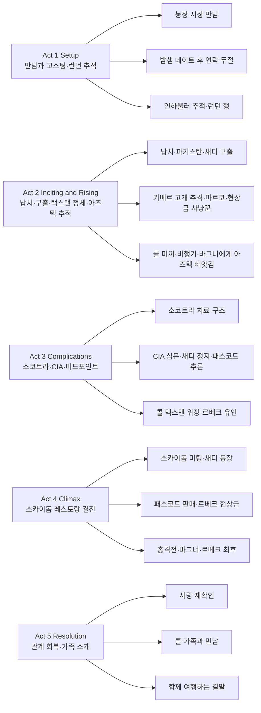

『Ghosted』(고스트드)는 2023년 애플 TV+에서 공개된 미국 로맨틱 액션 코미디다. 덱스터 플레처 감독, 크리스 에반스와 아나 데 아르마스 주연으로, 농장에서 일하는 평범한 남자 콜이 하루 만에 반한 여인 새디가 사실 CIA의 전설적 요원 '택스맨'이라는 걸 알게 되며 벌어지는 국제 모험을 그린다. "고스팅"당한 남자가 인하울러 추적기를 따라 런던까지 갔다가 오히려 납치당하는 설정이 코미디와 액션의 출발점이 된다.

## 개요

### 영화 정보

* **제목**: Ghosted / 고스트드
* **감독**: Dexter Fletcher (덱스터 플레처)
* **각본**: Rhett Reese, Paul Wernick, Chris McKenna, Erik Sommers
* **주연**: Chris Evans (Cole Turner), Ana de Armas (Sadie Rhodes), Adrien Brody (Leveque), Mike Moh (Wagner)
* **음악**: Lorne Balfe
* **촬영**: Salvatore Totino
* **장르**: Action, Romance, Adventure, Comedy
* **상영시간**: 116분 (1시간 56분)
* **개봉일**: 2023.04.21 (미국·Apple TV+ 스트리밍)
* **제작사**: Skydance Media, Studio Concierge, Apple Original Films
* **배급사**: Apple TV+
* **평점(참고)**: Rotten Tomatoes 25%, IMDb 5.8/10, Metacritic 34/100

### 추천 대상

* **로맨틱 액션·코미디 팬**: 비밀 요원과 일반인의 케미, 국제적인 추격과 위기 속 로맨스
* **크리스 에반스·아나 데 아르마스 팬**: 캡틴 아메리카와 대비되는 '평범한 남자' 연기와 여성 액션 히어로
* **가벼운 오락 선호 관객**: 심각한 사전 지식 없이 부담 없이 볼 수 있는 스트리밍용 액션 로맨스

## 구조 분석

## 영화의 전체 내용

이 영화는 농장 청년 콜이 하루 만에 사랑에 빠진 새디에게 연락이 두절되자, 인하울러에 든 추적기를 따라 런던으로 갔다가 오히려 '택스맨'으로 오인되어 납치당하고, 진짜 택스맨인 새디와 함께 생화학 무기 '아즈텍'을 둘러싼 국제 음모를 막으며 사랑과 신뢰를 되찾는 **로맨틱 액션 코미디**다. 스포일러를 포함한 전체 내용을 Act 단위로 정리한다.

### Act 1 (Setup): 만남과 고스팅, 런던 추적

**[S01] 워싱턴 D.C. 농장 시장 — 첫 만남**: 워싱턴 D.C.의 농장 시장에서 농업 관련 저술가이자 로맨티스트인 콜 터너(크리스 에반스)가 자주 여행한다는 직장인 새디 로즈(아나 데 아르마스)를 만난다. 둘은 대화를 나누며 끌리고, 데이트로 이어진다.

**[S02] 밤샘 데이트 — 하룻밤과 이별**: 콜과 새디는 밤새 함께 시간을 보내고 친밀한 관계를 맺는다. 새디는 새벽에 일이 있다며 자리를 뜨고, 콜은 집으로 돌아간 뒤 그녀에게 문자를 보내지만 답이 오지 않는다.

**[S03] 가족과의 대화 — 고스팅 의심**: 콜의 동생 매티는 새디가 콜을 "고스팅"한 것 같다고 말한다. 부모는 오히려 콜에게 새디를 놀래켜 주러 직접 찾아가라고 권한다. 콜이 새디 가방에 두고 온 자신의 인하울러를 추적해 보니 위치가 런던으로 나온다.

**[S04] 런던 행 — 서프라이즈 방문**: 콜은 런던으로 날아가 새디를 찾아 서프라이즈하려 한다. 인하울러 추적 위치를 따라가지만, 그곳에서 그를 기다리는 건 새디가 아니라 무장한 남자들이었다.

### Act 2 (Inciting & Rising): 납치, 구출, 택스맨 정체, 아즈텍 추적

**[S05] 납치 — 파키스탄으로**: 콜은 런던에서 납치되어 파키스탄으로 옮겨진다. 납치범들은 그를 CIA의 전설적 요원 "택스맨"으로 믿고, 생화학 무기 '아즈텍'을 여는 패스코드를 묻기 위해 고문을 준비한다.

**[S06] 새디의 등장 — 구출과 정체 공개**: 곤충으로 고문하려는 순간 새디가 나타나 콜을 구출한다. 그녀가 바로 진짜 "택스맨"이며 CIA 요원이라는 사실이 드러난다. 콜은 충격과 배신감을 느낀다.

**[S07] 키베르 고개 추격 — 르베크와 아즈텍**: 새디와 콜은 키베르 고개를 통한 추격전에서 간신히 도주한다. 적들은 전 프랑스 정보부 요원 르베크(애드리언 브로디)의 수하로, 르베크는 훔친 생화학 무기 '아즈텍'을 판매하려 하나 패스코드가 필요하다.

**[S08] 마을에서의 재회 — 마르코**: 인근 마을에 도착한 콜과 새디는 서로에게 한 거짓말을 두고 말다툼한다. 새디의 옛 연인이자 연락책인 마르코(마완 켄자리)가 등장해, 새디는 임무를 연인보다 우선한다는 경고를 하며 자신의 잘린 손을 보여 준다. 마르코는 콜을 집으로 보내 주기로 한다.

**[S09] 현상금 사냥꾼 — 연쇄 습격**: 르베크가 콜의 목에 현상금을 걸면서 여러 현상금 사냥꾼이 콜을 노린다. 습격 과정에서 마르코는 죽고, 사냥꾼들끼리 서로 격돌해 몰살된다. 새디는 르베크가 패스코드를 원한다는 걸 알고, 아즈텍을 되찾기 위해 콜을 미끼로 쓰기로 한다.

**[S10] 르베크에게 콜 인도 — 비행기**: 새디는 콜을 르베크에게 넘기고, 르베크는 아즈텍이 든 잠긴 케이스와 함께 부하 바그너(마이크 모)를 비행기에 새디, 콜과 함께 남긴다. 비행기 안에서 바그너는 콜 휴대폰에 있는 콜과 새디의 침대 사진을 발견해 두 사람의 관계를 알아챈다.

**[S11] 정체 탄로 — 낙하**: 위장이 들통 나자 새디와 콜은 비행기에서 낙하산으로 탈출한다. 부상한 새디와 함께 콜은 아즈텍 케이스를 붙잡고 소코트라 섬에 착지한다.

**[S12] 소코트라 — 치료와 재결합**: 소코트라에서 콜은 농업·식물 지식으로 새디의 상처를 치료하고, 아즈텍 케이스를 지키려 한 점으로 그녀의 신뢰를 얻는다. 둘은 감정적으로 다시 가까워진다. 르베크의 부대가 습격하고, 바그너가 케이스를 빼앗아 달아난 뒤 미군에 의해 콜과 새디는 구조된다.

### Act 3 (Complications): CIA, 정지, 패스코드 추론, 르베크 유인

**[S13] CIA 본부 — 심문과 새디 정지**: CIA 본부에서 콜은 거짓말 탐지기 심문을 받고 민간인임이 확인된다. 새디가 임무를 위해 그를 희생할 각오가 있었다는 말에 콜은 상처받는다. 아즈텍을 잃은 책임으로 새디는 업무 정지되고, CIA는 일시적으로 콜을 새디와 대립시키려 한다.

**[S14] 패스코드 추론 — 콜의 아이디어**: 콜은 새디의 미션 보고서 사진 속 이상한 작물을 보고, 그 작물과 연관된 패스코드를 추론해 낸다. 이 정보를 바탕으로 기관은 콜이 다시 택스맨 행세를 하며 르베크를 유인하는 작전에 합의한다.

**[S15] 미드포인트 — 스카이돔 미끼 작전**: 콜은 패스코드를 판매한다는 제안으로 르베크를 회전 레스토랑 '스카이돔'에 있는 아즈텍 구매 희망자 미스터 우타미와의 만남으로 유인한다. 콜을 감시하던 요원들은 르베크 측에 의해 제거된다.

### Act 4 (Climax): 스카이돔 레스토랑 결전

**[S16] 스카이돔 미팅 — 르베크·우타미**: 콜은 스카이돔 레스토랑에서 르베크와 우타미를 만난다. 르베크는 콜을 완전히 통제한 상태로 패스코드 거래를 진행하려 한다.

**[S17] 새디 등장 — 신뢰 회복**: 새디가 나타나 콜 곁에 선다. 그녀는 자신이 진짜 택스맨이라며 우타미에게 패스코드를 1천만 달러에 판매한다. 곧바로 그 돈으로 르베크에게 현상금을 걸어, 레스토랑은 현상금 사냥꾼들로 뒤덮인다.

**[S18] 총격전 — 콜과 새디 협력**: 총격전이 벌어지고, 콜은 비록 경험은 없지만 본능적으로 새디를 보조하며 적을 쓰러뜨리고 샷건으로 엄호한다. 우타미의 경호원들과 현상금 사냥꾼들을 넘어가며 둘은 협력한다.

**[S19] 바그너와의 격투 — 기계실**: 바그너가 콜을 기계실로 끌어당겨 일대일 격투를 벌인다. 싸움 중 레스토랑 회전 메커니즘이 손상되고, 르베크는 우타미를 쏘아 죽인다. 콜은 바그너를 회전 기계에 밀어 넣어 죽인다.

**[S20] 클라이맥스 — 르베크의 최후**: 콜이 돌아와 새디가 르베크를 추격하는 것을 돕는다. 회전이 빨라지는 레스토랑 벽면에서의 추격 끝에 새디는 르베크를 유리창 너머로 밀어 추락사시키고, 콜을 닻처럼 붙잡은 채 아즈텍 장치를 간신히 건진다.

### Act 5 (Resolution): 관계 회복과 새로운 시작

**[S21] 사랑 재확인 — 공식 커플**: 위기 이후 콜과 새디는 관계를 재정의하고 공식적으로 연인이 된다.

**[S22] 콜의 가족과 만남**: 새디는 콜의 가족을 만난다. 콜의 부모와 동생 매티 앞에서 둘의 관계가 소개된다.

**[S23] 엔딩 — 함께 여행**: 콜은 농업 연구를 위해, 새디는 "고객을 잡는" 임무를 위해 여행하는 삶을 선택하고, 서로의 일정에 맞춰 함께할 시간을 만든다는 식으로 영화는 끝난다. 마지막에는 데이트 중에도 CIA 업무 연락이 오는 유머로 마무리된다.

## 캐릭터 분석

### 콜 터너 (Cole Turner) / 농장 청년·저술가 (Chris Evans)

**개요**: 워싱턴 D.C. 인근에서 농장을 돌보며 농업 관련 책을 쓰는 로맨티스트. 사랑에 빠지면 적극적으로 다가가지만, 연락이 끊기면 불안해하며 인하울러 추적까지 동원해 런던까지 찾아가는 집착에 가까운 행동을 보인다. 전형적인 "평범한 남자"가 예상치 못한 첩보 세계에 휘말려 점점 팀원으로 성장하는 구조다.

**성장 곡선**: 로맨틱한 평범인(데이트) → 납치·구출(공포·배신감) → 미끼·탈출(협력·재결합) → CIA·작전(능동적 참여) → 스카이돔 결전(전투 보조·신뢰) → 연인·가족 소개(관계 확정). 처음에는 새디에게 끌려다니지만, 소코트라에서의 역할과 패스코드 추론, 최종 전투에서의 보조로 "동등한 파트너"에 가까워진다.

**동기와 욕망**: "진짜 사랑과 인정"을 원한다. 새디에게 고스팅당했다고 느끼자 직접 찾아가고, 그녀가 요원이라는 걸 알았을 때도 관계를 포기하지 않고 함께 위기를 겪으며 그녀의 신뢰를 되찾는다.

**갈등 구조**: 사랑하는 여자가 거짓말과 비밀의 세계에 살고, 자신은 그 세계의 도구(미끼)로 쓰일 수 있다는 불안. 새디가 "임무를 위해 그를 희생할 수 있었다"는 CIA 심문 결과에 상처받지만, 그녀가 스카이돔에서 자신을 구하러 온 것을 보고 화해한다.

**상징적 의미**: "일상인"이 겪는 이중성—로맨스와 집착, 무력함과 성장. 크리스 에반스의 캡틴 아메리카 이미지와 대비되는 "싸움 못 하는 남자" 역할로 코미디와 동질감을 만든다.

크리스 에반스는 코미디 타이밍과 당혹스러운 반응을 잘 살리며, 액션에서는 새디의 보조 역할을 자연스럽게 소화한다.

### 새디 로즈 (Sadie Rhodes) / CIA 요원 '택스맨' (Ana de Armas)

**개요**: 자주 여행한다고만 말하는 수수께끼 같은 여성으로 콜과 만나 하룻밤을 보낸 뒤 연락을 끊는다. 정체는 CIA의 전설적 요원 "택스맨"으로, 생화학 무기 아즈텍과 르베크를 추적하는 임무 중이다. 감정보다 임무를 우선해 온 과거가 마르코의 경고와 CIA 심문 장면에서 드러난다.

**성장 곡선**: 임무 중심·거리 두기(고스팅) → 구출·정체 공개(콜에 대한 책임) → 미끼 사용(임무 vs 연인) → 부상·소코트라(콜에 대한 신뢰·재결합) → 정지·콜 추론(파트너십 인정) → 스카이돔(콜 구하기·관계 선택) → 가족 소개(삶에 콜 포함). 끝까지 "임무만 하는 요원"이 아니라 콜을 선택하는 인물로 바뀐다.

**동기와 욕망**: 임무 성공과 세계를 위협하는 무기 제거. 동시에 깊은 관계와 동반자를 갈망하지만, 위험한 일 때문에 거리를 두어 왔다. 콜과의 경험을 통해 "함께하는 삶"을 선택한다.

**갈등 구조**: 임무(아즈텍·르베크)와 개인 감정(콜)의 충돌. 콜을 미끼로 쓸 때와, 그를 구하러 스카이돔에 올라가는 선택에서 이 갈등이 극명하게 드러난다.

**상징적 의미**: "여성 액션 히어로"와 "사랑을 막아온 요원"의 결합. 아나 데 아르마스는 액션과 감정 연기 모두에서 카리스마와 취약함을 보여 준다.

### 르베크 (Leveque) / 전 프랑스 정보부·무기상 (Adrien Brody)

**개요**: 전 프랑스 정보 요원으로, 훔친 생화학 무기 '아즈텍'을 판매하려 하는 악당. 패스코드를 알려주는 "택스맨"을 찾기 위해 콜을 납치하고, 이후 현상금으로 콜을 노리게 하며, 스카이돔에서 최종 거래와 결전을 벌인다. 수단을 가리지 않고 냉정한 인물로 그려진다.

**성장 곡선**: 서사상 성장보다는 "위협의 상승"에 가깝다. 파키스탄에서 콜을 고문하려 하고, 바그너를 통해 아즈텍을 확보한 뒤 스카이돔에서 구매자와 거래하려 하나, 새디의 현상금·총격전·회전 레스토랑 추격 끝에 유리창 밖으로 떨어져 사망한다.

**동기와 욕망**: 아즈텍 판매로 이익과 권력을 얻는 것. 택스맨(패스코드)에 대한 집착이 줄거리의 축을 이룬다.

**갈등 구조**: CIA·새디·콜과의 대립. 부하 바그너는 그에게 인정받으려 하지만 자주 실패하고, 최종적으로는 새디와 콜의 협력에 의해 제거된다.

**상징적 의미**: "국가를 배신한 정보 요원"과 "생화학 무기 거래상"이라는 전형적 악역. 애드리언 브로디의 연기로 냉혹함과 일정한 품격이 더해진다.

### 바그너 (Wagner) / 르베크의 부하 (Mike Moh)

**개요**: 르베크의 심복으로, 비행기에서 콜과 새디의 관계를 눈치채고 아즈텍 케이스를 빼앗아 도주한다. 소코트라 습격 후 르베크 편으로 케이스를 가져가고, 스카이돔 결전에서 콜과 기계실에서 격투하다 회전 메커니즘에 휘말려 사망한다. 주인에게 인정받으려 하지만 번번이 어긋나는 역할로, 액션과 코미디를 잇는 캐릭터다.

## 영상미와 음악

### 시각 효과 / 촬영 / 미학

덱스터 플레처 감독과 촬영감독 살바토레 토티노는 **로케이션의 다양성**을 활용한다. 워싱턴 D.C. 농장 시장, 런던, 파키스탄·키베르 고개(실제 촬영은 미국), 소코트라(세트), CIA 본부, 스카이돔 회전 레스토랑까지 공간이 자주 바뀌어 국제 첩보물 느낌을 준다. 액션은 **핸드헬드와 넓은 샷**을 섞어 추격과 격투의 속도감을 살린다. 스카이돔 결전에서는 회전하는 레스토랑과 유리창 파손, 기계실 격투로 클라이맥스를 시각화한다. VFX는 낙하산, 폭발, 총격 등 액션 연출을 보조하며, 전반적으로 밝고 세련된 색감으로 로맨틱 코미디 쪽에 무게를 둔다.

### 음악

로른 밸페(Lorne Balfe)의 음악은 **액션·스파이물 스타일의 오케스트라와 전자 사운드**를 섞는다. 추격과 전투 장면에서는 긴장감과 리듬을, 콜과 새디의 관계 장면에서는 감성적인 모티프를 사용해 장르를 넘나든다. 사운드트랙에는 포르투갈. 더 맨(Portugal. The Man)의 "Feel It Still" 등 현대 팝·록이 삽입되어 분위기를 가볍게 만든다.

## 종합 평가

### 최종 평점: ★★★☆☆ (3.0/5.0)

**장점**:
- 크리스 에반스와 아나 데 아르마스의 케미와 역할 반전(평범한 남자 vs 비밀 요원)으로 보는 재미
- 인하울러 추적·고스팅·미끼 등 로맨스와 액션을 엮는 설정의 유머
- 국제 로케이션과 스카이돔 결전 등 다양한 액션·공간 활용
- 스트리밍용으로 부담 없이 볼 수 있는 러닝타임과 톤

**단점**:
- 비평계에서 지적된 대로 액션·로맨스·코미디가 하나의 완결된 톤으로 정리되기보다 표면적으로 오간다는 인상
- 르베크·아즈텍 등 악당·맥거핀의 깊이는 제한적
- 일부 액션과 전개가 클리셰에 의존

### 한 줄 평

"고스팅당한 남자가 인하울러로 런던까지 쫓았다가 납치되고, 진짜 CIA 요원 연인과 생화학 무기 싸움에 휘말리는 가벼운 로맨틱 액션 코미디."

### 추천 작품

- 《True Lies》(1994): 비밀 요원 남편과 평범한 아내의 첩보 액션 코미디. 아널드 슈워제네거·제이미 리 커티스.
- 《Knight and Day》(2010): 비밀 요원과 일반인이 얽히는 국제 액션 로맨스. 톰 크루즈·카메론 디아즈.
- 《Mr. & Mrs. Smith》(2005): 서로 정체를 숨긴 킬러 부부의 액션 로맨스 코미디. 브래드 피트·안젤리나 졸리.
- 《The Gray Man》(2022): 크리스 에반스·아나 데 아르마스가 함께 출연한 네트플릭스 액션 스릴러.

### 관람 전 체크리스트

- 사전 지식이 필요한가? **아니오.** 독립적으로 감상 가능하다.
- 어린이와 함께 볼 수 있는가? **PG-13.** 폭력·액션·일부 언어·성적 암시가 있어 연령 확인 후 관람 권장.
- 특정 요소를 기대해도 되는가? **로맨스·액션·코미디 혼합, 스타 케미, 국제 로케이션.**
- 쿠키 영상이 있는가? **아니오.**
- 속편 가능성은? **공식 속편 계획은 없으나, 스트리밍 기록이 좋아 동일 팀 재편 가능성은 있음.**

## 참고 문헌 및 출처

- [Ghosted (2023) — IMDb](https://www.imdb.com/title/tt15326988/)
- [Ghosted — Rotten Tomatoes](https://www.rottentomatoes.com/m/ghosted_2023)
- [Ghosted (2023 film) — Wikipedia](https://en.wikipedia.org/wiki/Ghosted_(2023_film))
- [Ghosted — Apple TV+](https://tv.apple.com/us/movie/ghosted/umc.cmc.6nodv9rf3ltfk2ar3pfc8hced)

## 결론

『Ghosted』는 "고스팅당한 남자가 인하울러로 여자를 쫓다가 오히려 납치당한다"는 설정을 출발점으로, 로맨스와 국제 첩보 액션을 섞은 스트리밍용 로맨틱 액션 코미디다. 크리스 에반스는 캡틴 아메리카와 대비되는 평범하고 덜렁대는 남자 역할로, 아나 데 아르마스는 비밀 요원 '택스맨'으로 액션과 감정 연기를 함께 보여 준다. 서사와 비평적 깊이보다는 장르 클리셰와 스타 케미, 다양한 로케이션과 스카이돔 결전 같은 액션으로 즐기는 작품이다. 사전 지식 없이 부담 없이 볼 수 있으므로, 로맨틱 액션·코미디와 두 배우를 좋아하는 관객에게 추천할 만하다.
