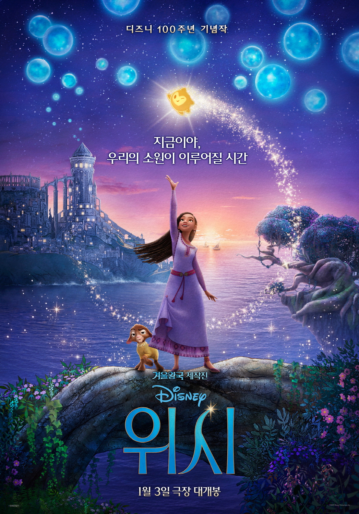
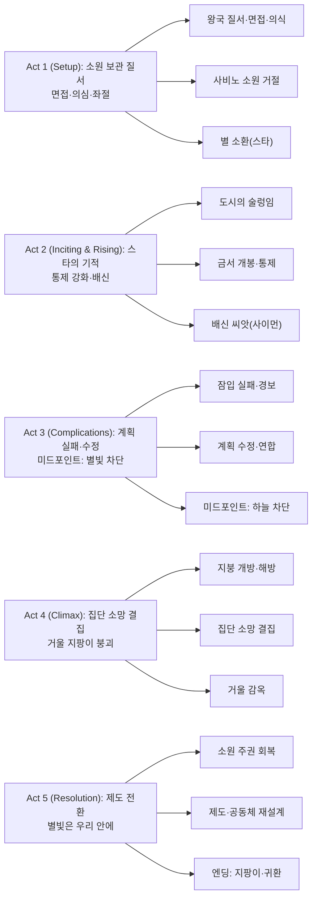

디즈니 100주년을 맞아 탄생한 오리지널 뮤지컬 애니메이션 ‘위시’는 왜 우리가 여전히 별에 소원을 비는지, 그 마음의 기원을 동화적 상상력으로 되짚는다. 지중해의 섬 왕국 로사스에서, 소녀 아샤가 하늘의 별 ‘스타’를 불러내며 시작되는 이야기. 이 영화는 수채화풍 질감과 현대 CG를 접목한 2.55:1 화면비, 그리고 주제가 "This Wish"로 디즈니의 오래된 주문을 새롭게 울린다.

||
|:---:|
|Wish|

## 개요

### 영화 정보
* 제목: Wish / 위시
* 감독: 크리스 벅(Chris Buck), 폰 베라순톤(Fawn Veerasunthorn)
* 주연: 아리아나 더보즈(아샤), 크리스 파인(매그니피코), 앨런 튜딕(발렌티노)
* 장르: 애니메이션, 판타지, 뮤지컬, 어드벤처, 코미디, 패밀리
* 상영시간: 95분(일부 지역 표기 87분)
* 개봉일: 2023.11.22(미국) / 2024.01.03(대한민국)

### 추천 대상
* **디즈니 레거시 팬**: "별에 비는 마음"의 원점과 수많은 레거시 이스터에그를 즐기고 싶은 관객
* **온 가족 관람층**: 경쾌한 넘버·선명한 갈등·안전한 메시지로 함께 보기 좋은 선택
* **아트/기술 관심자**: 수채화풍 질감 렌더링과 넓은 화면비에서 빚어지는 색감·광원 표현

## Plot-DeepDive

### Act 1 (Setup) — 소원을 보관하는 왕국, 의심이 시작되다
> 요약: 지중해 섬의 로사스 왕국은 왕 매그니피코가 백성의 소원을 보관하고 한 달에 하나씩만 이뤄 준다. 아샤는 할아버지 사비노의 소원을 이루고자 견습 면접에 나가지만, 왕의 통치 논리를 목격하며 의심을 품는다. 소원 의식에서 사비노의 소원이 공개적으로 거절되자, 그녀는 밤하늘에 간절한 소원을 올린다.

- [S01] 로사스 성·낮 — 왕궁 전경과 항만 시장이 같은 프레임에 펼쳐진다. 왕은 "소원 보관"의 원리를 연설하며 시민에게 평온을 약속한다. 아샤는 사비노의 소원을 떠올리며 면접 준비를 한다. 연설의 박수 뒤, 광장이 잠깐 정적을 품는다.
- [S02] 왕실 서재·오후 — 아샤는 견습 면접에서 왕의 선별 기준을 묻고, "소원은 마음의 가장 좋은 부분"이라는 말을 꺼낸다. 매그니피코는 모호한 소원은 위험하다고 단언한다. 둘의 대화는 미소를 유지하지만 온도가 내려간다.
- [S03] 의식장·해질녘 — 월례 의식에서 왕은 화려한 제스처로 소원 구슬을 떠올린다. 사비노의 차례가 오자, 왕은 "영감을 주고 싶다"는 소원을 모호하다며 보류한다. 관중의 탄성 속에 사비노의 눈빛이 흔들린다.
- [S04] 해변 절벽·밤 — 낙담한 아샤는 바람이 거센 절벽에서 별을 올려다본다. 그녀는 "부디 이 왕국의 마음을 보여 달라"고 말하며 손을 들어 올린다. 고요한 순간, 하늘이 흔들리듯 밝아진다.
- [S05] 숲 가장자리·밤 — 별 ‘스타’가 유성처럼 내려와 생명감을 터트린다. 동물들이 말을 시작하고, 염소 발렌티노의 굵은 저음이 모두를 놀라게 한다("이게 내 목소리라고?"). 아샤는 스타와 눈을 맞추며 손을 맞댄다.
- [S06] 성의 고탑·동시 — 다른 프레임에서 매그니피코는 이상한 기척을 느끼고 창문을 닫는다. 왕은 금지된 서가에서 어둠의 마법서 표지를 손가락으로 더듬는다. 아마야는 그를 말리지만, 그는 "질서를 지키려면 힘이 필요해"라며 시선을 떼지 않는다.

### Act 2 (Inciting & Rising) — 스타의 기적, 통제의 강화
> 요약: 스타의 마법으로 로사스가 술렁이는 가운데, 왕은 통제를 강화하고 금서를 펼친다. 아샤는 가벼운 기적을 통해 희망을 퍼뜨리려 하지만, 친구 사이먼의 배신으로 체포 위기에 몰린다. 왕은 기사 작위를 미끼로 사람들을 자기 편으로 묶어 가기 시작한다.

- [S07] 마을 골목·이른 새벽 — 스타는 공중에 별가루를 흩뿌리며 벽화 같은 빛 점을 남긴다. 아이들이 웃음으로 따라가고, 음악적 동기(Welcome to Rosas)가 변주된다. 아샤는 희망이 전염되는 모습을 보며 결심을 굳힌다.
- [S08] 사비노의 집·아침 — 아샤는 조심스레 사비노의 소원 구슬을 되찾아 기억을 돌려준다. 사비노는 "영감을 주는 건 당신이야"라고 말하며 눈시울을 붉힌다. 가족은 잠깐의 기쁨과 불안을 동시에 느낀다.
- [S09] 왕실 집무실·오전 — 매그니피코는 금서의 첫 장을 펼치고, 보랏빛 문양이 방 전체로 퍼진다. 거울 표면이 살아 움직이며 음성을 속삭인다. 그는 "위협을 소멸시키겠다"고 독백한다.
- [S10] 제빵소(달리아 근무)·정오 — 아샤는 친구들을 모아 계획을 공유한다. 달리아는 밀가루 손을 털며 "천장을 열어 소원을 풀자"고 즉흥 전략을 세운다. 모두의 표정에 두려움과 흥분이 교차한다.
- [S11] 경비초소·오후 — 왕의 포고령이 나붙고, 별을 숨기거나 돕는 자는 반역자로 간주된다. 경비들은 창문을 봉하고, 광장에는 검은 깃발이 올라간다. 군중의 웅성거림이 낮은 불안으로 이어진다.
- [S12] 항구 창고·해질녘 — 아샤와 스타는 소원 구슬 상자를 숨기고 탈출 루트를 확인한다. 발렌티노는 "계획에 간식 시간은 있냐"고 중얼거린다. 멀리서 종소리가 불길하게 울린다.
- [S13] 성 내부 통로·밤 — 아샤 일행은 별빛을 최소화해 암흑 통로를 지난다. 천장의 구조를 파악해 도르래 위치를 표시한다. 음악이 점차 빠르게 고조된다.
- [S14] 성 광장·같은 밤 — 사이먼이 경비대에게 정보를 넘긴다. 왕은 사이먼에게 기사 계급을 약속하며 은밀한 마법 표식을 새긴다. 사이먼의 눈동자에 초록빛 광택이 스친다.

### Act 3 (Complications) — 미드포인트: 신뢰의 파열과 계획의 수정
> 요약: 배신과 오판으로 첫 잠입은 실패하고, 왕의 힘은 급격히 증폭된다(미드포인트). 아샤는 신뢰를 회복하며 계획을 수정하고, 아마야는 왕의 변질을 확인해 내면의 결단을 준비한다.

- [S15] 비밀 서고·심야 — 왕은 유리 돔 안의 소원들을 검은 실선으로 연결한다. 어둠의 문양이 성벽으로 번지고, 별빛이 눌린다. 그는 "모두의 최선은 내가 정한다"고 중얼거린다.
- [S16] 탑 아래 회랑·심야 — 아샤가 천장 도르래를 당기자 작은 균열만 생긴다. 구조 계산이 빗나갔고, 경보의 종이 울린다. 일행은 후퇴 신호를 보낸다.
- [S17] 숲 외곽·새벽 — 도주 중, 사이먼이 길을 막는다. 그는 한순간 망설이지만, 왕의 마법 표식이 눈매를 굳힌다. 아샤는 숲 동물들과 협공해 그를 제압한다.
- [S18] 해안 동굴·아침 — 모두가 지쳐 숨을 고르며 실패 원인을 짚는다. 달리아는 구조물을 더 크게 열 방법을 제안하고, 가보는 경비 교대 시간을 기록한다. 팀은 장비·시간·사람 배치를 재조정한다.
- [S19] 왕실 침전·오전 — 아마야는 남편의 책상에서 금서의 흔적을 발견한다. 그녀는 창밖의 암흑 문양을 바라보며 눈을 감는다. 흔들리던 충성은 책임감으로 바뀐다.
- [S20] 광장 지하구·해질녘 — 두 번째 잠입을 위해 지하 배수로를 연다. 스타는 어둠 속에서도 미세한 빛 선을 뿌려 길을 표시한다. 음악은 웅장한 합창으로 변한다(미드포인트 직전 긴장 최고조).
- [S21] 성 중앙홀·밤 — 미드포인트: 왕이 탑으로 올라가 소원 에너지를 흡수하고 하늘을 가린다. 별빛이 사라지자 시민들은 소원을 비빌 하늘을 잃는다. 아샤는 처음으로 절망의 침묵을 마주한다.

### Act 4 (Climax) — 별빛 없는 밤, 집단의 의지
> 요약: 왕은 절대 통치를 완성하려 하고, 아샤는 개인의 소원에서 집단의 소망으로 초점을 전환한다. 모두가 각자의 소원을 ‘자기 것’으로 받아들일 때 힘이 발생한다. 성의 지붕은 열리고, 별빛 대신 사람들 마음의 빛이 왕을 무너뜨린다.

- [S22] 성 옥상 난간·연속 — 매그니피코가 마지막 봉인을 시도한다. 거대한 거울 지팡이가 도시 전체를 비춘다. 그는 "내가 정한다, 누가 무엇을 받을지"라고 외친다.
- [S23] 도시 골목·동시 — 달리아와 친구들이 사다리·도르래·줄을 동원해 지붕을 연다. 가보는 불평을 던지지만, 손놀림은 정확하다. 작은 구멍으로 소원 구슬들이 떼지어 떠오른다.
- [S24] 성 내부 계단·동시 — 스타가 쇠사슬을 흔들며 구속을 헐겁게 만든다. 발렌티노는 "계획에 동물 임무가 이렇게 많을 줄은 몰랐지"라며 투덜거린다. 쇠사슬이 끊어지는 소리와 함께 합창이 치고 들어온다.
- [S25] 탑 정상·절정 직전 — 아샤가 왕과 정면으로 마주한다. 그녀는 "소원은 누구의 것인가요?"라고 묻는다. 왕의 얼굴이 일순 흔들리지만, 금서 문양이 다시 그의 눈을 채운다.
- [S26] 도시 전역·클라이맥스 — 아샤는 광장과 골목을 향해 외친다: "당신들의 미래를 당신들이 빌어요." 시민들은 제각각의 소원을 입 밖으로 내며 손을 들어 올린다. 하늘이 가려진 밤, 사람들의 목소리가 별빛이 된다(클라이맥스).
- [S27] 탑 정상·클라이맥스 해결 — 집단의 소망이 왕의 마법을 역행시킨다. 거울 지팡이가 균열되고, 왕은 자신이 만든 거울 공간에 갇힌다. 덮였던 하늘이 서서히 개간다.

### Act 5 (Resolution) — 소원은 우리에게 있다
> 요약: 왕국은 별빛 없는 별을 배운다. 아마야는 공동체 중심의 통치로 전환하고, 아샤는 ‘영감을 주는’ 사람이 된다. 스타는 지팡이를 남기고 하늘로 돌아가지만, 모두는 더 이상 하늘만 바라보지 않는다.

- [S28] 성 광장·아침 — 시민들이 각자의 소원을 되찾아 품에 안는다. 속삭임이 웃음으로 바뀐다. 잔잔한 현악이 울린다.
- [S29] 알현실·낮 — 아마야는 임시 통치자로서 소원 심사를 폐지하고, 멘토·길드·학교로 소원 지원체계를 전환한다. 벽의 포고문이 바람에 떨어진다. 왕좌는 비어 있지만 공간은 더 충만하다.
- [S30] 해변 절벽·황혼 — 스타는 아샤에게 지팡이를 건네고 하늘로 돌아간다. 아샤는 미소로 손을 흔들며, 마을 쪽으로 몸을 돌린다. 마지막 햇빛이 수면에 별처럼 반짝인다(엔딩).

### 핵심 대사 인덱스
- "소원은 마음의 가장 좋은 부분이에요." — 아샤, [S02]; 신념
- "모호한 소원은 위험하다." — 매그니피코, [S02]; 통제
- "당신들의 미래를 당신들이 빌어요." — 아샤, [S26]; 집단의지
- "내가 정한다, 누가 무엇을 받을지." — 매그니피코, [S22]; 권력
- "영감을 주는 건 바로 너야." — 사비노, [S08]; 전승
- "이게 내 목소리라고?" — 발렌티노, [S05]; 코믹

## 구조 분석(보조 도식)

## 캐릭터 분석

### 아샤(Asha)
- **개요**: 17세 이상주의자. ‘영감을 주고 싶다’는 모호해 보이는 소원을 현실로 번역하는 사람.
- **성장 곡선**: 개인의 소망 → 공동체의 소망으로 초점 확장. 의심이 확신으로 굳어짐.
- **동기·욕망**: 사비노의 소원을 통해 타인의 가능성을 깨우는 일.
- **갈등 구조**: 통제·선별로 군림하는 체제 vs. 소원 주권을 되돌리려는 시민성.
- **상징**: 별을 부르는 ‘목소리’— 소망을 언어로 바꾸는 능력.

### 매그니피코(King Magnifico)
- **개요**: 선의로 출발했으나 통치 기술로 타락한 마법사 왕.
- **성장(퇴행) 곡선**: 보호 → 선별 → 독점 → 흡수. 금서가 내면의 공포를 증폭.
- **동기·욕망**: 혼돈을 제거하고 질서를 유지하려는 집착(안전의 과잉).
- **갈등 구조**: 개인 자유와 공공 안전의 경계. 모호함을 혐오하는 리더십의 위험.
- **상징**: 거울 지팡이— 반사된 권력, 자기 확증 편향.

### 스타(Star)
- **개요**: 말없는 우주적 존재. 가능성과 상상력의 촉매.
- **기능**: 내적 욕망을 가시화, 공동체를 연결하는 신호탄.
- **상징**: 외부 구원 아닌 ‘내부의 빛’을 깨우는 트리거.

### 아마야(Queen Amaya)
- **개요**: 공감 능력이 높고, 변화의 순간에 제동을 거는 양심.
- **전환점**: 금서 흔적 목격 후, 체제 유지와 시민 보호 사이에서 시민을 선택.
- **의미**: 통치의 연속성— 인물 교체보다 제도 교체가 핵심임을 보여 줌.

## 종합 평가

- **평점**: 7.2/10
- **한 줄 평**: 디즈니의 오래된 주문을 재생성한 합창—별빛이 아니라, 우리가 별이라는 메시지.
- **추천 작품**: 모아나, 주토피아, 라푼젤(세계 구축·주제 인접성)
- **관람 전 체크리스트**:
  - **레거시 이스터에그**: 엔딩 크레딧과 장면 곳곳에 전작 오마주 존재
  - **음악 취향**: 팝 성향의 넘버—취향 따라 호불호 가능
  - **연령 적합성**: PG(테마 요소·완만한 액션)

## 참고 문헌 / 출처
- [R1] Wish (film) — Wikipedia (`https://en.wikipedia.org/wiki/Wish_(film)`) | Accessed: 2025-08-29
- [R2] Wish — Official Site (Disney) (`https://movies.disney.com/wish`) | Accessed: 2025-08-29
- [R3] Wish (2023) — IMDb (`https://www.imdb.com/title/tt11304740/`) | Accessed: 2025-08-29
- [R4] Wish (2023) — Rotten Tomatoes (`https://www.rottentomatoes.com/m/wish_2023`) | Accessed: 2025-08-29
- [R5] Wish — Box Office Mojo (`https://www.boxofficemojo.com/title/tt11304740/`) | Accessed: 2025-08-29
- [R6] 위시 (영화) — 한국어 위키백과 (`https://ko.wikipedia.org/wiki/위시_(영화)`) | Accessed: 2025-08-29
