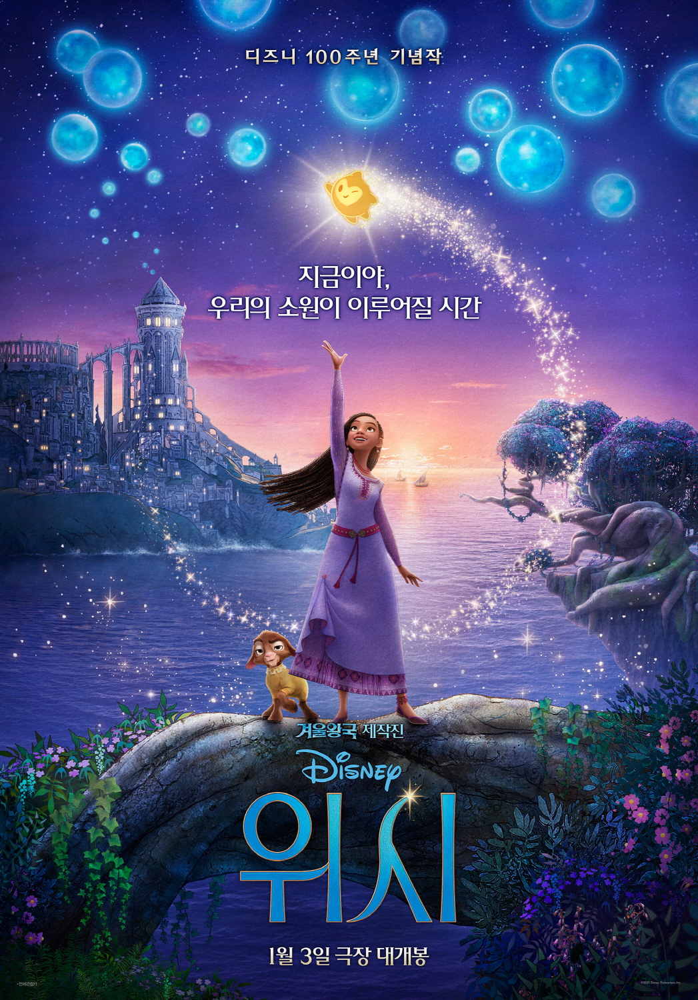
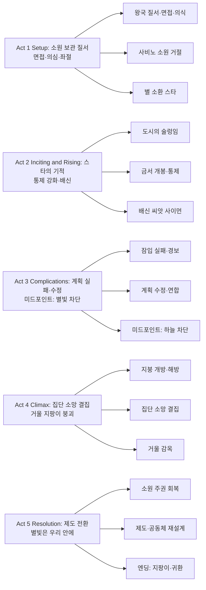

디즈니 100주년을 맞아 탄생한 오리지널 뮤지컬 애니메이션 《위시》는, 왜 우리가 여전히 별에 소원을 비는지 그 마음의 기원을 동화적 상상력으로 되짚는다. 지중해의 섬 왕국 로사스에서 소녀 아샤가 하늘의 별 ‘스타’를 불러내며 시작되는 이야기다. 수채화풍 질감과 현대 CG를 접목한 2.55:1 화면비, 주제가 "This Wish"로 디즈니의 오래된 주문을 새롭게 울린다. 이 글은 영화의 Act 5단계 구조, 장면별 줄거리, 캐릭터·영상미·음악, 종합 평가까지 스포일러를 포함해 정리한다.

## 개요

### 영화 정보
* **제목**: Wish / 위시
* **감독**: Chris Buck (크리스 벅), Fawn Veerasunthorn (폰 베라순톤)
* **각본**: Jennifer Lee (제니퍼 리), Allison Moore (앨리슨 무어)
* **주연**: Ariana DeBose (아샤), Chris Pine (매그니피코), Alan Tudyk (발렌티노), Angelique Cabral (아마야), Victor Garber (사비노)
* **음악**: Dave Metzger (오케스트라·스코어), Julia Michaels·Benjamin Rice (곡·가사)
* **장르**: 애니메이션, 판타지, 뮤지컬, 어드벤처, 코미디, 패밀리
* **상영시간**: 95분 (일부 지역 87분 표기)
* **개봉일**: 2023.11.22 (미국), 2024.01.03 (대한민국)
* **제작사**: Walt Disney Animation Studios
* **배급사**: Walt Disney Studios Motion Pictures
* **제작비**: 약 1억 7500만~2억 달러
* **평점**: 로튼 토마토 48%, IMDb 약 5.9/10, CGV·네이버 등 국내 평점 참고 가능

### 추천 대상
* **디즈니 레거시 팬**: "별에 비는 마음"의 원점과 전작 오마주·이스터에그를 즐기고 싶은 관객
* **온 가족 관람층**: 경쾌한 넘버, 선명한 갈등, 안전한 메시지로 함께 보기 좋은 선택
* **아트·기술 관심자**: 수채화풍 질감 렌더링과 넓은 화면비에서 빚어지는 색감·광원 표현

## 구조 분석 (Act 5단계)

```mermaid
flowchart LR
    Act1["Act 1 Setup: 소원 보관 질서</br>면접·의심·좌절"]
    Act2["Act 2 Inciting and Rising: 스타의 기적</br>통제 강화·배신"]
    Act3["Act 3 Complications: 계획 실패·수정</br>미드포인트: 별빛 차단"]
    Act4["Act 4 Climax: 집단 소망 결집</br>거울 지팡이 붕괴"]
    Act5["Act 5 Resolution: 제도 전환</br>별빛은 우리 안에"]
    Act1 --> Act1a["왕국 질서·면접·의식"]
    Act1 --> Act1b["사비노 소원 거절"]
    Act1 --> Act1c["별 소환 스타"]
    Act2 --> Act2a["도시의 술렁임"]
    Act2 --> Act2b["금서 개봉·통제"]
    Act2 --> Act2c["배신 씨앗 사이먼"]
    Act3 --> Act3a["잠입 실패·경보"]
    Act3 --> Act3b["계획 수정·연합"]
    Act3 --> Act3c["미드포인트: 하늘 차단"]
    Act4 --> Act4a["지붕 개방·해방"]
    Act4 --> Act4b["집단 소망 결집"]
    Act4 --> Act4c["거울 감옥"]
    Act5 --> Act5a["소원 주권 회복"]
    Act5 --> Act5b["제도·공동체 재설계"]
    Act5 --> Act5c["엔딩: 지팡이·귀환"]
```

## 영화의 전체 내용

《위시》는 지중해의 가상 왕국 로사스에서, 왕 매그니피코가 백성의 소원을 보관하고 한 달에 하나씩만 이루어 주는 세계를 배경으로 한다. 소녀 아샤가 할아버지 사비노의 소원을 이루고자 견습 면접에 나섰다가, 왕의 통치 논리를 목격하며 의심을 품고, 밤하늘에 간절한 소원을 올리자 별 ‘스타’가 내려온다. 이후 스타의 마법과 왕의 통제 강화, 배신과 실패, 미드포인트에서의 별빛 차단, 클라이맥스에서의 집단 소망 결집을 거쳐, 소원은 다시 시민에게 돌아가고 왕국은 새로운 제도로 재설계된다. 아래는 Act 단위로 장면 비트 [S01]부터 연속 번호로 서술한 전체 내용이다.

### Act 1 (Setup): 소원을 보관하는 왕국, 의심이 시작되다

로사스 왕국은 왕 매그니피코가 백성의 소원을 보관하고 한 달에 하나씩만 이루어 준다. 아샤는 할아버지 사비노의 소원을 이루고자 견습 면접에 나가지만, 왕의 통치 논리를 목격하며 의심을 품고, 소원 의식에서 사비노의 소원이 거절되자 밤하늘에 간절한 소원을 올린다.

**[S01] 로사스 성·낮 — 왕궁 전경과 항만 시장**: 왕궁 전경과 항만 시장이 같은 프레임에 펼쳐진다. 왕은 "소원 보관"의 원리를 연설하며 시민에게 평온을 약속한다. 아샤는 사비노의 소원을 떠올리며 견습 면접 준비를 한다. 연설 뒤 광장이 잠깐 정적을 품는다.

**[S02] 왕실 서재·오후 — 견습 면접**: 아샤는 견습 면접에서 왕의 선별 기준을 묻고, "소원은 마음의 가장 좋은 부분"이라는 말을 꺼낸다. 매그니피코는 모호한 소원은 위험하다고 단언한다. 둘의 대화는 미소를 유지하지만 온도가 내려간다.

**[S03] 의식장·해질녘 — 월례 소원 의식**: 월례 의식에서 왕은 화려한 제스처로 소원 구슬을 떠올린다. 사비노의 차례가 오자, 왕은 "영감을 주고 싶다"는 소원을 모호하다며 보류한다. 관중의 탄성 속에 사비노의 눈빛이 흔들린다.

**[S04] 해변 절벽·밤 — 별에 비는 소원**: 낙담한 아샤는 바람이 거센 절벽에서 별을 올려다본다. "부디 이 왕국의 마음을 보여 달라"고 말하며 손을 들어 올린다. 고요한 순간, 하늘이 흔들리듯 밝아진다.

**[S05] 숲 가장자리·밤 — 스타의 강림**: 별 ‘스타’가 유성처럼 내려와 생명감을 터트린다. 동물들이 말을 시작하고, 염소 발렌티노의 굵은 저음이 모두를 놀라게 한다. 아샤는 스타와 눈을 맞추며 손을 맞댄다.

**[S06] 성의 고탑·동시 — 왕의 반응**: 매그니피코는 이상한 기척을 느끼고 창문을 닫는다. 왕은 금지된 서가에서 어둠의 마법서 표지를 손가락으로 더듬는다. 아마야는 그를 말리지만, 그는 "질서를 지키려면 힘이 필요해"라며 시선을 떼지 않는다.

### Act 2 (Inciting & Rising): 스타의 기적, 통제의 강화

스타의 마법으로 로사스가 술렁이는 가운데, 왕은 통제를 강화하고 금서를 펼친다. 아샤는 가벼운 기적을 통해 희망을 퍼뜨리려 하지만, 친구 사이먼의 배신으로 체포 위기에 몰리고, 왕은 기사 작위를 미끼로 사람들을 자기 편으로 묶어 간다.

**[S07] 마을 골목·이른 새벽 — 별가루와 희망**: 스타는 공중에 별가루를 흩뿌리며 벽화 같은 빛 점을 남긴다. 아이들이 웃음으로 따라가고, "Welcome to Rosas" 동기가 변주된다. 아샤는 희망이 전염되는 모습을 보며 결심을 굳힌다.

**[S08] 사비노의 집·아침 — 소원 되찾기**: 아샤는 조심스레 사비노의 소원 구슬을 되찾아 기억을 돌려준다. 사비노는 "영감을 주는 건 당신이야"라고 말하며 눈시울을 붉힌다. 가족은 잠깐의 기쁨과 불안을 동시에 느낀다.

**[S09] 왕실 집무실·오전 — 금서 개봉**: 매그니피코는 금서의 첫 장을 펼치고, 보랏빛 문양이 방 전체로 퍼진다. 거울 표면이 살아 움직이며 음성을 속삭인다. 그는 "위협을 소멸시키겠다"고 독백한다.

**[S10] 제빵소·정오 — 계획 공유**: 아샤는 친구들을 모아 계획을 공유한다. 달리아는 밀가루 손을 털며 "천장을 열어 소원을 풀자"고 즉흥 전략을 세운다. 모두의 표정에 두려움과 흥분이 교차한다.

**[S11] 경비초소·오후 — 포고령**: 왕의 포고령이 나붙고, 별을 숨기거나 돕는 자는 반역자로 간주된다. 경비들은 창문을 봉하고, 광장에는 검은 깃발이 올라간다. 군중의 웅성거림이 낮은 불안으로 이어진다.

**[S12] 항구 창고·해질녘 — 탈출 루트**: 아샤와 스타는 소원 구슬 상자를 숨기고 탈출 루트를 확인한다. 발렌티노는 "계획에 간식 시간은 있냐"고 중얼거린다. 멀리서 종소리가 불길하게 울린다.

**[S13] 성 내부 통로·밤 — 잠입 준비**: 아샤 일행은 별빛을 최소화해 암흑 통로를 지난다. 천장의 구조를 파악해 도르래 위치를 표시한다. 음악이 점차 빠르게 고조된다.

**[S14] 성 광장·같은 밤 — 사이먼의 배신**: 사이먼이 경비대에게 정보를 넘긴다. 왕은 사이먼에게 기사 계급을 약속하며 은밀한 마법 표식을 새긴다. 사이먼의 눈동자에 초록빛 광택이 스친다.

### Act 3 (Complications): 미드포인트 — 신뢰의 파열과 계획의 수정

배신과 오판으로 첫 잠입은 실패하고, 왕의 힘은 급격히 증폭된다. 미드포인트에서 왕이 하늘을 가리고 별빛이 사라진다. 아샤는 신뢰를 회복하며 계획을 수정하고, 아마야는 왕의 변질을 확인해 내면의 결단을 준비한다.

**[S15] 비밀 서고·심야 — 소원 연결**: 왕은 유리 돔 안의 소원들을 검은 실선으로 연결한다. 어둠의 문양이 성벽으로 번지고, 별빛이 눌린다. 그는 "모두의 최선은 내가 정한다"고 중얼거린다.

**[S16] 탑 아래 회랑·심야 — 잠입 실패**: 아샤가 천장 도르래를 당기자 작은 균열만 생긴다. 구조 계산이 빗나갔고, 경보의 종이 울린다. 일행은 후퇴 신호를 보낸다.

**[S17] 숲 외곽·새벽 — 사이먼과 대면**: 도주 중, 사이먼이 길을 막는다. 그는 한순간 망설이지만, 왕의 마법 표식이 눈매를 굳힌다. 아샤는 숲 동물들과 협공해 그를 제압한다.

**[S18] 해안 동굴·아침 — 계획 수정**: 모두가 지쳐 숨을 고르며 실패 원인을 짚는다. 달리아는 구조물을 더 크게 열 방법을 제안하고, 가보는 경비 교대 시간을 기록한다. 팀은 장비·시간·사람 배치를 재조정한다.

**[S19] 왕실 침전·오전 — 아마야의 결단**: 아마야는 남편의 책상에서 금서의 흔적을 발견한다. 그녀는 창밖의 암흑 문양을 바라보며 눈을 감는다. 흔들리던 충성은 책임감으로 바뀐다.

**[S20] 광장 지하구·해질녘 — 두 번째 잠입**: 두 번째 잠입을 위해 지하 배수로를 연다. 스타는 어둠 속에서도 미세한 빛 선을 뿌려 길을 표시한다. 음악은 웅장한 합창으로 변한다.

**[S21] 미드포인트 — 성 중앙홀·밤, 왕이 하늘을 가리다**: 왕이 탑으로 올라가 소원 에너지를 흡수하고 하늘을 가린다. 별빛이 사라지자 시민들은 소원을 비빌 하늘을 잃는다. 아샤는 처음으로 절망의 침묵을 마주한다.

### Act 4 (Climax): 별빛 없는 밤, 집단의 의지

왕은 절대 통치를 완성하려 하고, 아샤는 개인의 소원에서 집단의 소망으로 초점을 전환한다. 모두가 각자의 소원을 ‘자기 것’으로 받아들일 때 힘이 발생하고, 성의 지붕은 열리며, 사람들 마음의 빛이 왕을 무너뜨린다.

**[S22] 성 옥상 난간·연속 — 마지막 봉인**: 매그니피코가 마지막 봉인을 시도한다. 거대한 거울 지팡이가 도시 전체를 비춘다. 그는 "내가 정한다, 누가 무엇을 받을지"라고 외친다.

**[S23] 도시 골목·동시 — 지붕 개방**: 달리아와 친구들이 사다리·도르래·줄을 동원해 지붕을 연다. 가보는 불평을 던지지만, 손놀림은 정확하다. 작은 구멍으로 소원 구슬들이 떼지어 떠오른다.

**[S24] 성 내부 계단·동시 — 스타 구출**: 스타가 쇠사슬을 흔들며 구속을 헐겁게 만든다. 발렌티노는 "계획에 동물 임무가 이렇게 많을 줄은 몰랐지"라며 투덜거린다. 쇠사슬이 끊어지는 소리와 함께 합창이 치고 들어온다.

**[S25] 탑 정상·절정 직전 — 정면 대결**: 아샤가 왕과 정면으로 마주한다. 그녀는 "소원은 누구의 것인가요?"라고 묻는다. 왕의 얼굴이 일순 흔들리지만, 금서 문양이 다시 그의 눈을 채운다.

**[S26] 클라이맥스 — 도시 전역, 집단의 소원**: 아샤는 광장과 골목을 향해 외친다. "당신들의 미래를 당신들이 빌어요." 시민들은 제각각의 소원을 입 밖으로 내며 손을 들어 올린다. 하늘이 가려진 밤, 사람들의 목소리가 별빛이 된다.

**[S27] 클라이맥스 해결 — 탑 정상, 왕의 붕괴**: 집단의 소망이 왕의 마법을 역행시킨다. 거울 지팡이가 균열되고, 왕은 자신이 만든 거울 공간에 갇힌다. 덮였던 하늘이 서서히 개간한다.

### Act 5 (Resolution): 소원은 우리에게 있다

왕국은 별빛 없는 별을 배운다. 아마야는 공동체 중심의 통치로 전환하고, 아샤는 ‘영감을 주는’ 사람이 된다. 스타는 지팡이를 남기고 하늘로 돌아가지만, 모두는 더 이상 하늘만 바라보지 않는다.

**[S28] 성 광장·아침 — 소원 회복**: 시민들이 각자의 소원을 되찾아 품에 안는다. 속삭임이 웃음으로 바뀐다. 잔잔한 현악이 울린다.

**[S29] 알현실·낮 — 제도 전환**: 아마야는 임시 통치자로서 소원 심사를 폐지하고, 멘토·길드·학교로 소원 지원체계를 전환한다. 벽의 포고문이 바람에 떨어진다. 왕좌는 비어 있지만 공간은 더 충만하다.

**[S30] 엔딩 — 해변 절벽·황혼**: 스타는 아샤에게 지팡이를 건네고 하늘로 돌아간다. 아샤는 미소로 손을 흔들며, 마을 쪽으로 몸을 돌린다. 마지막 햇빛이 수면에 별처럼 반짝인다.

### 핵심 대사 인덱스

* "소원은 마음의 가장 좋은 부분이에요." — 아샤, [S02]; 신념
* "모호한 소원은 위험하다." — 매그니피코, [S02]; 통제
* "당신들의 미래를 당신들이 빌어요." — 아샤, [S26]; 집단의지
* "내가 정한다, 누가 무엇을 받을지." — 매그니피코, [S22]; 권력
* "영감을 주는 건 바로 너야." — 사비노, [S08]; 전승
* "이게 내 목소리라고?" — 발렌티노, [S05]; 코믹

## 캐릭터 분석

### 아샤 (Asha) / Ariana DeBose

**개요**: 17세 소녀. 로사스에서 태어나 왕의 견습 자리를 꿈꾸지만, 소원의 주권이 시민에게 있어야 한다는 신념을 품는다. 할아버지 사비노의 "영감을 주고 싶다"는 소원을 현실로 번역하려 하는 이상주의자다.

**성장 곡선**: 개인의 소망(사비노의 소원 이루기)에서 출발해, 왕의 통제에 의심을 품고, 스타와 시민들과 함께 공동체의 소망으로 초점을 확장한다. 의심이 확신으로 굳어지고, "당신들이 빌어요"라는 메시지로 집단의 의지를 이끌어 낸다.

**동기와 욕망**: 타인의 가능성을 깨우는 일, 특히 사비노처럼 영감을 주고 싶은 소원이 존중받고 이루어지는 세상을 바란다. 소원이 왕의 선별이 아니라 사람들 마음에 다시 돌아가길 원한다.

**갈등 구조**: 통제·선별로 군림하는 매그니피코 체제 vs. 소원 주권을 되돌리려는 시민성. 친구 사이먼의 배신, 잠입 실패, 미드포인트에서의 절망을 거쳐 내적·외적 갈등을 극복한다.

**상징적 의미**: 별을 부르는 ‘목소리’— 소망을 언어로 바꾸고, 공동체가 함께 소원을 외치게 하는 촉매. 디즈니의 "별에 소원을 비는" 전통을 ‘우리가 별이 된다’는 메시지로 재해석하는 주체다.

### 매그니피코 (King Magnifico) / Chris Pine

**개요**: 로사스의 마법사 왕. 백성의 소원을 보관하고 한 달에 하나씩만 이루어 주며, 모호한 소원은 위험하다며 선별한다. 선의로 출발했으나 통치 기술로 타락한 인물이다.

**성장 곡선 (퇴행)**: 보호 → 선별 → 독점 → 흡수. 스타의 등장을 위협으로 받아들이고 금서(어둠의 마법)를 개봉하면서, 안전에 대한 집착이 권력 유지와 소원 독점으로 변질된다. 거울 지팡이와 금서 문양이 내면의 공포를 증폭시킨다.

**동기와 욕망**: 혼돈을 제거하고 질서를 유지하려는 집착. 과거 왕국의 파괴 경험이 "안전의 과잉"으로 나타나, 소원을 통제함으로써만 왕국이 유지된다고 믿는다.

**갈등 구조**: 개인 자유와 공공 안전의 경계. 모호함을 혐오하는 리더십의 위험이 드러나며, 아마야와의 신뢰도 무너진다. 최종적으로 집단의 소원에 의해 마법이 역행되어 거울 속에 갇힌다.

**상징적 의미**: 거울 지팡이— 반사된 권력, 자기 확증 편향. 소원을 "보관"한다는 명목 아래 대부분을 영원히 주지 않음으로써 통제하는 구조를 상징한다.

### 스타 (Star)

**개요**: 말없는 우주적 존재. 아샤의 간절한 소원에 반응해 하늘에서 내려온 생명감 있는 별이다. 동물에게 말하는 능력을 부여하고, 별가루로 희망을 퍼뜨리며, 구속에서 풀려나 시민의 소원과 아샤의 목소리를 연결하는 역할을 한다.

**성장 곡선**: 외부에서 온 구원자처럼 보이지만, 서사상으로는 "내부의 빛"을 깨우는 트리거. 아샤와 시민들이 스스로 소원을 외치게 만든 뒤, 지팡이를 아샤에게 남기고 하늘로 돌아가며 역할을 완수한다.

**동기와 욕망**: 순수한 가능성과 상상력의 촉매. 욕망을 언어화·가시화하고 공동체를 연결하는 신호탄 역할을 한다.

**갈등 구조**: 왕의 마법에 붙잡히고 하늘이 가려지는 미드포인트에서 위기에 처하나, 집단의 소원이 왕의 마법을 무너뜨리면서 해방된다.

**상징적 의미**: 외부 구원이 아니라 ‘우리 안의 빛’을 깨우는 존재. 디즈니 100주년과 "When You Wish Upon a Star" 전통의 기원 이야기에서 별이 곧 우리 자신의 소원·가능성임을 보여 준다.

### 아마야 (Queen Amaya) / Angelique Cabral

**개요**: 매그니피코의 아내이자 로사스의 왕비. 공감 능력이 높고, 남편의 통치 방식에 처음에는 동의하는 듯하나 내면에서 의문을 품는다. 변화의 순간에 제동을 거는 양심의 역할을 한다.

**성장 곡선**: 충성에서 결단으로. 금서의 흔적과 암흑 문양을 목격한 뒤, 체제 유지와 시민 보호 사이에서 시민을 선택하고 아샤 일행에 합류한다.

**동기와 욕망**: 왕국의 안정과 시민의 복지. 남편의 변질이 명확해지자 "진정한 안정"이 통제가 아님을 선택한다.

**갈등 구조**: 남편에 대한 신뢰 vs. 시민에 대한 책임. 금서와 거울 지팡이의 남용을 목격하며 내적 갈등을 해소하고 행동으로 전환한다.

**상징적 의미**: 통치의 연속성. 인물 교체가 아니라 제도 교체(소원 심사 폐지, 멘토·길드·학교 체계)가 핵심임을 보여 주며, 엔딩에서 임시 통치자로서 새로운 로사스를 이끈다.

## 영상미와 음악

### 시각 효과 / 촬영 / 미학

* **수채화풍 CG**: 전통 2D 수채 일러스트의 질감을 CG로 재현한 비주얼이 특징이다. 배경의 붓터치감, 부드러운 그라데이션, 빛과 그림자의 수채화적 번짐이 로사스와 숲·바다를 감성적으로 담는다.
* **화면비 2.55:1**: 클래식 시네마스코프 비율을 채택해, 월트 디즈니 애니메이션 100주년과 《잠자는 숲속의 미녀》 등 전통 작품에 대한 오마주를 시각적으로 드러낸다. 왕국 전경·의식·집단 소원 장면에서 웅장함을 더한다.
* **색감·광원**: 낮의 지중해 풍 톤, 밤의 별빛·별가루, 금서와 거울 지팡이의 보라·검은 문양이 대비를 이룬다. 클라이맥스에서 하늘이 가려진 뒤 시민들의 "빛"이 별처럼 표현되는 연출이 테마와 직결된다.
* **캐릭터·의상**: 스노우 화이트와 일곱 난쟁이에서 영감을 받은 "The Teens" 친구들, 아샤·매그니피코·스타의 디자인이 디즈니 레거시와 현대 감각을 함께 반영한다. 포스터와 키 비주얼에서 포지션과 색이 주제를 강조한다.

### 음악감독의 음악

* **곡·가사**: Julia Michaels, Benjamin Rice가 작곡·작사한 팝 성향의 넘버가 흐른다. "This Wish"는 메인 주제가이자 디즈니의 "별에 소원을" 전통을 재해석하는 곡이다. "Welcome to Rosas", "I'm a Star", "Knowing What I Know Now", 매그니피코의 "This is the Thanks I Get?!" 등이 서사와 캐릭터를 뒷받침한다.
* **스코어**: Dave Metzger가 오케스트라 스코어와 편곡을 담당했다. 지중해 풍 타악기(캐스터네츠, 핑거 심벌즈), 기타 등 지역 악기를 활용해 로사스의 세계감을 더한다. 《피노키오》의 "When You Wish Upon a Star" 첫 다섯 음을 에테리얼한 텍스처로 녹여, 디즈니 100주년 로고에서 로사스로의 전환과 연결한다.
* **사운드트랙과 분위기**: 경쾌한 개막, 위기와 배신 장면의 긴장감, 미드포인트·클라이맥스의 합창과 오케스트라가 감정 곡선을 이끈다. 엔딩에서 소원 회복과 스타의 귀환은 잔잔한 현악과 주제 모티프로 마무리된다.

## 종합 평가

### 최종 평점: ★★★☆☆ (3.0/5.0)

**장점**:
* 디즈니 100주년과 "별에 소원을" 기원 이야기를 결합한 콘셉트가 명확하고, 수채화풍 비주얼과 2.55:1 화면비로 레거시에 대한 존중이 드러난다.
* "소원은 누구의 것인가", "우리가 별이 된다"는 메시지가 클라이맥스의 집단 소원 장면에서 감동적으로 전달된다.
* 매그니피코는 모호함을 혐오하는 권력자로서 동기가 읽히며, 아마야·사비노·스타 등 보조 인물이 서사를 풍성하게 한다.
* "This Wish" 등 일부 넘버와 Dave Metzger 스코어, "When You Wish Upon a Star" 오마주가 분위기와 테마에 잘 어울린다.

**단점**:
* 전반적인 서사와 캐릭터 깊이가 비평계에서 호불호가 갈리며, 레거시 이스터에그에 의존한다는 지적이 있다.
* 넘버의 팝 성향이 강해 클래식 디즈니 뮤지컬을 기대한 관객에게는 다소 밋밋하게 느껴질 수 있다.
* 러닝타임이 짧은 편이라 Act 2·3의 전개가 다소 빠르게 느껴질 수 있다.

### 한 줄 평

"디즈니의 오래된 주문을 재생성한 합창—별빛이 아니라, 우리가 별이라는 메시지를 전하는 100주년 기념작."

### 추천 작품

* 《모아나》(2016): 섬과 바다를 배경으로 한 성장과 공동체, 주제가가 돋보이는 디즈니 애니메이션.
* 《주토피아》(2016): 편견과 제도, 개인과 집단의 관계를 다루며 세계관과 메시지가 풍부한 작품.
* 《라푼젤》(2010): 주인공의 소원과 자유, 악당과의 대결 구조에서 《위시》와 주제 인접성이 있다.

### 관람 전 체크리스트

* **사전 지식이 필요한가?** 필수는 아니나, 디즈니 전작과 "When You Wish Upon a Star"·스노우 화이트 등 레거시를 알면 이스터에그와 메시지가 더 잘 와닿는다.
* **어린이와 함께 볼 수 있는가?** PG 등급. 테마적 요소·완만한 액션 수준으로 가족 관람 가능하다.
* **특정 요소를 기대해도 되는가?** 수채화풍 비주얼, 뮤지컬 넘버, 100주년 오마주, 집단 소원 클라이맥스를 기대할 만하다.
* **쿠키 영상이 있는가?** 본편 엔딩 후 크레딧·짧은 연출이 있을 수 있으나, 반드시 확인할 필요는 없다.
* **속편 가능성은?** 100주년 원-shot 성격이 강해 속편 계획은 공식적으로 밝혀진 바 없다.

## 참고 문헌 및 출처

- [Wish (film) — Wikipedia](https://en.wikipedia.org/wiki/Wish_(film))
- [Wish (2023) — Rotten Tomatoes](https://www.rottentomatoes.com/m/wish_2023)
- [위시 (영화) — 한국어 위키백과](https://ko.wikipedia.org/wiki/위시_(영화))
