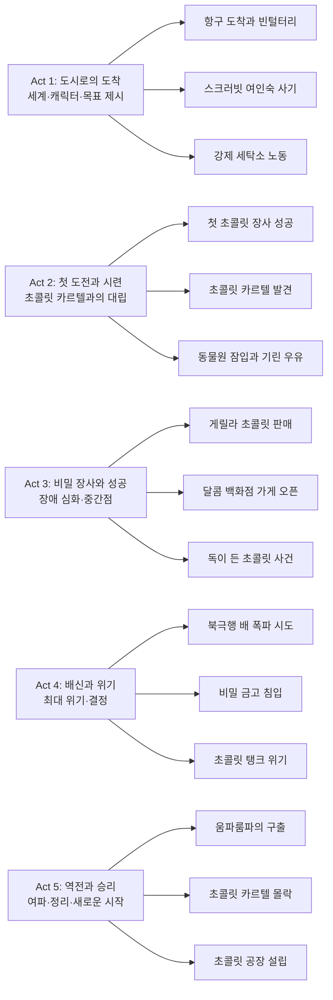

『Wonka』는 로알드 달의 『찰리와 초콜릿 공장』에 등장하는 윌리 웡카의 젊은 시절을 그린 뮤지컬 판타지 영화다. 티모시 샬라메가 야심 찬 젊은 초콜릿 마법사를 연기하며, 폴 킹 감독(『패딩턴』 시리즈)의 따뜻하고 환상적인 연출이 돋보인다. 이 영화는 단순한 프리퀄을 넘어 꿈과 희망, 우정의 가치를 전하는 감동적인 모험 이야기로, 가족 모두가 즐길 수 있는 작품이다.

## 개요

### 영화 정보
* **제목**: Wonka (웡카)
* **감독**: Paul King (폴 킹)
* **각본**: Paul King, Simon Farnaby (원작: Roald Dahl)
* **주연**: Timothée Chalamet, Calah Lane, Keegan-Michael Key, Paterson Joseph, Matt Lucas, Mathew Baynton, Olivia Colman, Hugh Grant
* **음악**: Joby Talbot
* **장르**: Musical, Fantasy, Family, Adventure, Comedy
* **상영시간**: 116분 (1시간 56분)
* **개봉일**: 2023.12.15 (미국), 2024.01.31 (한국)
* **제작사**: Warner Bros., Village Roadshow Pictures, The Roald Dahl Story Company
* **배급사**: Warner Bros. Pictures
* **제작비**: 약 1억 2,500만 달러
* **전세계 박스오피스**: 약 6억 3,450만 달러
* **평점**: IMDb 6.9/10 (183K), 로튼 토마토 신선도 91% (관객 89%)

### 추천 대상
* **가족 관객**: 따뜻한 가족 영화로 어린이부터 어른까지 모두 즐길 수 있는 작품
* **뮤지컬 팬**: 환상적인 음악과 춤이 가득한 브로드웨이 스타일의 뮤지컬 영화
* **로알드 달 팬**: 『찰리와 초콜릿 공장』의 프리퀄로 웡카의 탄생 이야기를 확인
* **티모시 샬라메 팬**: 샬라메의 매력적인 연기와 노래를 감상할 수 있는 기회

## 완전 스토리 로드맵

**스포일러 전체 공개 - 이미 영화를 본 독자를 위한 완전한 줄거리 재구성**

이 섹션은 영화를 이미 관람한 분들을 위해 작성되었으며, 100% 스포일러를 포함합니다.

### 5막 구조 분석

## 영화의 전체 내용 (스포일러 포함)

### Act 1: 도시로의 도착 - Setup

**[S01] 항구 도착**: 7년간의 긴 항해 끝에 윌리 웡카(Timothée Chalamet)가 유럽의 한 도시 항구에 도착한다. 그의 꿈은 어머니와의 약속대로 이 도시의 유명한 '달콤 백화점(Galeries Gourmet)'에서 초콜릿 가게를 열어 성공하는 것이다. 모자에서 찻주전자를 꺼내 핫초코를 만들어 마시는 장면은 그의 마법 같은 능력을 보여주는 첫 장면이다.

**[S02] 첫날의 낭비**: 웡카는 12개의 소버린 은화를 가지고 도시를 돌아다니다가 하루 만에 거의 다 소비한다. 지도 구입, 구두닦이, 호박 깨뜨린 변상, '망상 금지' 조항 위반 벌금 등으로 9개의 은화를 날린다. 남은 3개 중 2개는 노숙자에게 기부하고, 마지막 하나는 실수로 하수구에 빠뜨려 완전히 빈털터리가 된다.

**[S03] 블리처와의 만남**: 벤치에서 노숙을 시도하던 웡카는 강아지 티들스를 산책시키던 블리처(Tom Davis)를 만난다. 블리처는 그를 도와줄 사람을 소개해주겠다며 '스크러빗 여인숙'으로 안내한다.

**[S04] 스크러빗 여인숙의 덫**: 스크러빗 부인(Olivia Colman)이 운영하는 여인숙에서 웡카는 진을 대접받고 따뜻한 난로 옆에서 몸을 녹인다. 부인은 '사업가 패키지'를 제안하며 계약서에 서명하라고 한다. 소녀 누들(Calah Lane)이 작은 글씨를 읽으라고 경고하지만, 웡카는 문맹이라 제대로 읽지 못하고 서명한다.

**[S05] 계약의 함정 발각**: 다음 날 웡카가 1소버린을 내려 하자, 스크러빗 부인은 추가 요금(술값, 난로 사용료, 계단 사용료, 미니바 등)을 청구하며 빚이 1만 소버린으로 불어난다. 하루 1소버린씩 갚으면 27년 4개월 16일이 걸린다는 말에 웡카는 충격을 받는다.

**[S06] 세탁소의 노예들**: 웡카는 세탁물 투입구로 던져져 지하 세탁소에 갇힌다. 그곳에서 같은 처지의 다른 노동자들을 만난다: 전직 회계사 애버커스 크런치(Jim Carter), 배관공 파이퍼 벤츠, 이혼한 코미디언 래리 처클스워스, 과묵한 전화 교환수 로티 벨(Rakhee Thakrar).

### Act 2: 첫 도전과 시련 - Inciting & Rising

**[S07] 탈출 계획 수립**: 그날 밤 웡카는 초콜릿 제조기를 꺼내고 '구름 뒤 한 줄기 희망' 초콜릿을 만든다. 누들과 대화하며 자신의 과거를 들려준다 - 어머니는 요리사였고, 생일마다 초콜릿을 만들어줬으며, "세상의 모든 좋은 것은 꿈에서 시작되었단다"라는 유언을 남겼다.

**[S08] 첫 번째 계략**: 웡카는 블리처와 스크러빗 부인을 서로에게 관심을 갖게 만들어 감시를 느슨하게 한다. 누들은 모노클 교수가 그린 바이에른 귀족 그림이 블리처와 비슷하다며 '폰 블리치 남작'이라고 속인다. 스크러빗 부인은 이에 홀딱 반한다.

**[S09] 첫 초콜릿 장사**: 누들이 끄는 세탁물 수레에 숨어 탈출한 웡카는 달콤 백화점 앞에서 '두둥실 초코(Hoverchoc)'를 선보인다. 공중에 떠오르는 초콜릿에 사람들이 모이고, 초콜릿 카르텔의 삼사장(슬러그워스, 프로드노즈, 피켈그루버)도 이를 목격한다.

**[S10] 카르텔의 시식**: 슬러그워스(Paterson Joseph)가 내려와 시식하더니 "지금까지 먹어본 초콜릿 중 최악"이라 평가한다. 하지만 곧 삼사장 모두가 공중으로 떠오르며, 사람들은 초콜릿을 사기 위해 몰려든다. 경찰서장과 애퍼블 경관이 나타나 수입을 압류하고 웡카를 쫓아낸다.

**[S11] 초콜릿 카르텔의 음모**: 성당 지하에 위치한 카르텔 본부에서 삼사장은 경찰서장(Keegan-Michael Key)에게 웡카를 도시에서 내쫓으라고 청탁한다. 경찰서장은 처음엔 거절하지만, 초콜릿 1800상자와 신축성 좋은 양복을 제안받고 수락한다.

**[S12] 자동 세탁기 발명**: 웡카는 세탁소 자재로 자동 세탁기를 만들어 일을 처리한다. 강아지 티들스를 동력원으로 사용하는 이 기계 덕분에 생산량이 30% 증가한다.

**[S13] 동물원 잠입 계획**: 웡카는 기린 우유가 필요하다고 말하고, 누들은 동물원에 기린이 있다고 알려준다. 둘은 동물원 경비원 바질에게 '화려한 밤 산책' 초콜릿(술 초콜릿)을 먹여 잠재운다.

**[S14] 기린 아비게일**: 동물원에 잠입한 둘은 기린 아비게일을 찾아 아카시아 민트 초콜릿을 먹이고 젖을 짠다. 이 과정에서 누들은 자신의 어머니가 목걸이 반지만 남기고 떠났으며 "책이 가득한 집에서 엄마와 다시 만나는 게 꿈"이라고 말한다. 웡카는 "널 세탁소에서 영영 썩게 두지 않을게"라며 새끼손가락 맹세를 건다.

**[S15] 경찰서장의 물고문**: 풍선을 타고 탈출한 둘은 백화점 유리 지붕에 도착하지만, 경찰서장이 나타나 웡카를 분수대에 처박아 물고문한다. "더 이상 초콜릿을 팔지 말라"는 경고와 함께 곤봉으로 머리를 때린다.

### Act 3: 비밀 장사와 성공 - Complications

**[S16] 크런치의 과거**: 세탁소로 돌아온 웡카에게 크런치는 자신의 과거를 들려준다. 그는 슬러그워스의 임시 회계사였다가 비밀 장부를 발견했고, 안경을 그 위에 두는 실수로 쫓겨났다.

**[S17] 게릴라 초콜릿 장사**: 웡카와 세탁소 직원들은 길거리에서 초콜릿을 팔다가 경찰이 오면 호루라기 소리에 하수구로 도망치는 방식으로 장사를 시작한다. '기린 우유 마카롱'(자신감이 북돋는 초콜릿), '자라나라 에클레어'(머리카락이 자라는 초콜릿) 등을 팔며 큰 인기를 얻는다.

**[S18] 경찰의 추적 강화**: 경찰서장은 하수구를 감시하라고 명령한다. 이때 서장은 카르텔에게 받은 초콜릿을 너무 많이 먹어 차가 찌그러질 정도로 뚱뚱해진 상태다.

**[S19] 움파룸파의 등장**: 밤마다 웡카의 초콜릿을 훔치던 주황색 난쟁이가 드디어 정체를 드러낸다. 움파룸파(Hugh Grant)는 웡카가 7년 전 룸파랜드에서 카카오 열매 4개를 훔쳐 자신이 쫓겨났다며, 천 배로 갚을 때까지 복수하겠다고 선언한다.

**[S20] 달콤 백화점 가게 오픈**: 웡카는 번 돈으로 달콤 백화점의 가게를 일주일간 빌려 장사를 준비한다. 가게 안은 모두 초콜릿으로 만들어진 아름다운 공간이고, 사람들이 몰려든다.

**[S21] 독이 든 초콜릿 사건**: 손님들이 초콜릿을 먹자 갑자기 파란 수염이 자라고 얼굴이 녹색으로 변한다. 웡카는 자신이 넣지 않은 '설인의 땀' 발모제가 들어간 것을 알아차린다. 이는 스크러빗 부인과 블리처가 초콜릿 카르텔과 짜고 한 일이었다.

### Act 4: 배신과 위기 - Climax

**[S22] 카르텔의 제안**: 망한 가게에 앉아있던 웡카에게 삼사장이 찾아와 제안한다. "네가 도시를 떠나고 두 번 다시 초콜릿을 만들지 않는다면, 네 친구들을 세탁소에서 풀어줄게." 웡카는 동료들을 위해 조건을 수락한다.

**[S23] 북극행 배의 폭탄**: 웡카가 탄 북극행 배에는 프리미엄 이코노미석이라는 이름의 판자만 있다. 움파룸파도 몰래 탑승했는데, 조타실에서 산처럼 쌓인 다이너마이트를 발견한다. 두 사람은 폭발 직전 바다로 뛰어들어 겨우 살아남는다. 웡카는 6km를 수영해 다시 도시로 돌아온다.

**[S24] 누들의 정체 발각**: 다음 날 아침, 스크러빗 부인은 카르텔에게서 받은 돈으로 직원들을 모두 풀어주지만 누들만은 슬러그워스가 특별히 요청했다며 붙잡는다. 웡카와 동료들이 돌아와 누들을 구출한다.

**[S25] 금고 침입 작전**: 웡카 일행은 기린 아비게일을 성당으로 데려와 아카시아 민트로 줄리어스 신부를 쫓아낸다. 500명의 수도사들이 기린을 피해 도망치는 장면이 펼쳐진다.

**[S26] 비밀 장부 발견**: 웡카와 누들은 금고에서 비밀 장부를 발견하지만, 기다리고 있던 삼사장에게 발각된다. 이때 슬러그워스는 충격적인 진실을 밝힌다 - 누들은 자신의 조카였다. 누들의 아버지(지베디)는 일찍 죽었고, 슬러그워스가 유산을 독차지하기 위해 갓난아기 누들을 세탁소에 버린 것이었다.

**[S27] 초콜릿 탱크 위기**: 웡카와 누들은 초콜릿 원액이 가득 찬 거대한 탱크에 갇혀 익사 위기에 처한다. 슬러그워스는 웡카가 움파룸파에게 준 초콜릿 병을 모두 먹어버린다.

### Act 5: 역전과 승리 - Resolution

**[S28] 움파룸파의 구출**: 움파룸파는 자신의 초콜릿을 훔쳐먹은 삼사장에게 천 배로 복수하겠다며 등장한다. 그는 줄리어스 신부를 빈 병으로 기절시키고 탱크의 배수구를 열어 웡카와 누들을 구한다.

**[S29] 장부 전달과 체포**: 웡카와 누들은 비밀 장부를 애퍼블 경관에게 전달한다. 장부에는 경찰서장의 이름도 포함되어 있어 서장도 함께 체포된다.

**[S30] 삼사장의 최후**: 삼사장은 웡카가 만든 특별한 '두둥실 초코'를 먹고 공중으로 떠오른다. 이 초콜릿은 효과가 더 나중에 나타나지만 더 강력하게 만들어진 것이었다. 얼어붙은 분수대를 붙잡으려 하지만, 웡카의 동료들이 대량의 초콜릿 원액을 분출시켜 얼음을 깨뜨리자 그대로 날아가버린다.

**[S31] 초콜릿 분수대**: 시민들은 분수대에서 쏟아지는 초콜릿 원액을 즐긴다. 웡카는 어머니의 유품 초콜릿을 꺼내고, 그 속에 담긴 메시지를 읽는다: "중요한 건 초콜릿이 아니라, 그것을 함께 나누는 사람들이란다."

**[S32] 누들의 재회**: 로티 벨이 오후 내내 전화를 걸어 누들의 어머니 도로시 스미스를 찾아낸다. 누들은 도서관에서 일하는 어머니와 재회한다 - 책이 가득한 집에서 엄마를 만나는 꿈이 이루어진 것이다.

**[S33] 움파룸파와의 동업**: 웡카는 움파룸파에게 마지막 빚진 초콜릿을 건네고 시식부서 자리를 제안한다. 웡카는 버려진 성을 매입해 초콜릿 공장으로 개조하고, 공장 간판에 불이 들어오며 영화는 끝난다.

### 쿠키 영상

**[S34] 동료들의 후일담**: 엔딩 크레딧에서 움파룸파가 등장해 후일담을 들려준다. 크런치와 벤츠는 가족에게 돌아가고, 로티는 전화 교환원으로 복직했으며, 래리는 전처와 재결합한다.

**[S35] 악당들의 몰락**: 스크러빗 부인과 블리처는 증거인멸을 위해 설인의 땀 발모제를 마시지만, 오히려 변한 피부색과 털이 증거가 되어 체포된다. 두 사람은 끌려가기 직전 키스로 서로의 마음을 확인한다.

## 캐릭터 분석

### 윌리 웡카 / Willy Wonka (Timothée Chalamet)

**개요**: 젊고 순수한 초콜릿 마법사, 꿈과 희망으로 가득 찬 낙천주의자

**성장 곡선**: 순진한 꿈꾸는 청년 → 시련을 겪는 모험가 → 우정의 가치를 배우는 리더 → 초콜릿 제국의 창시자

웡카는 어머니와의 약속을 지키기 위해 7년간의 항해 끝에 도시에 도착한 청년이다. 그의 가장 큰 특징은 어떤 시련 속에서도 희망을 잃지 않는 낙천적인 성격이다. 문맹이고 세상 물정을 모르지만, 초콜릿 제조에 관해서는 천재적인 재능을 지녔다.

**동기와 욕망**: 
- 표면적 목표: 달콤 백화점에 초콜릿 가게 열기
- 내면적 욕구: 어머니와의 약속 지키기, 소속감과 가족 찾기
- 두려움: 어머니를 실망시키는 것, 혼자 남겨지는 것

**갈등 구조**:
- vs 자신: 문맹과 세상 물정 모름
- vs 타인: 초콜릿 카르텔과 부패한 권력
- vs 상황: 빈곤과 강제 노동

**상징적 의미**: 웡카는 순수한 꿈과 창의력의 화신이다. 그는 돈이나 권력이 아닌 초콜릿이 주는 기쁨을 추구하며, 이는 자본주의와 독점에 대한 저항을 상징한다.

**연기 평가**: 티모시 샬라메는 웡카의 순수함과 매력을 완벽하게 구현했다. 그의 노래 실력이 브로드웨이 배우 수준은 아니지만, 캐릭터의 순진함을 표현하는 데는 오히려 도움이 되었다. 특히 눈빛 연기와 몸짓으로 웡카의 호기심과 열정을 생생하게 전달했다.

### 누들 / Noodle (Calah Lane)

**개요**: 스크러빗 여인숙의 고아 소녀, 웡카의 첫 친구이자 조력자

**성장 곡선**: 희망 없는 고아 → 웡카와의 모험 동반자 → 진실 발견 → 어머니와의 재회

누들은 오랫동안 세탁소에 갇혀 지낸 고아 소녀로, 처음엔 냉소적이고 의심 많은 성격이다. 하지만 웡카를 만나면서 점차 희망과 꿈을 되찾는다. 그녀는 영리하고 현실적이어서 순진한 웡카를 도와주는 중요한 역할을 한다.

**동기와 욕망**:
- 표면적 목표: 세탁소에서 탈출하기
- 내면적 욕구: 어머니 찾기
- 두려움: 영원히 세탁소에 갇히는 것

**상징적 의미**: 누들은 희망을 잃은 모든 고아들의 대변자다. 그녀의 여정은 포기하지 않으면 꿈이 이루어질 수 있다는 메시지를 전달한다.

**연기 평가**: 신인 배우 Calah Lane은 누들의 복잡한 감정을 섬세하게 표현했다. 특히 웡카와의 케미스트리가 자연스러워 두 사람의 우정이 진정성 있게 느껴진다.

### 슬러그워스 / Slugworth (Paterson Joseph)

**개요**: 초콜릿 카르텔의 리더, 냉혹한 사업가, 누들의 삼촌

**성장 곡선**: 독점적 사업가 → 웡카에 의한 위협 인지 → 극단적 수단 동원 → 파멸

슬러그워스는 초콜릿 카르텔을 이끄는 냉혹한 사업가다. 그는 동생의 유산을 독차지하기 위해 조카를 버린 비정한 인물이며, 경쟁자를 제거하기 위해서는 수단과 방법을 가리지 않는다.

**상징적 의미**: 슬러그워스는 탐욕과 독점, 부패한 권력을 상징한다. 그는 초콜릿이 주는 기쁨보다는 돈과 권력에만 관심이 있다.

### 경찰서장 / Chief of Police (Keegan-Michael Key)

**개요**: 부패한 경찰서장, 초콜릿 중독자

**성장 곡선**: 원칙 있는 경찰관 → 초콜릿 유혹에 넘어감 → 완전히 부패 → 체포

경찰서장은 처음에는 원칙을 지키려 하지만, 초콜릿 유혹에 넘어가 점점 부패해간다. 그는 초콜릿 1800상자를 받고 웡카를 탄압하는 데 동의하며, 결국 150파운드(68kg)나 찌게 된다.

**상징적 의미**: 권력의 부패와 유혹의 위험성을 상징한다. 그의 비만은 탐욕의 시각적 표현이다.

### 움파룸파 / Oompa Loompa (Hugh Grant)

**개요**: 주황색 난쟁이, 룸파랜드에서 온 카카오 지킴이

**성장 곡선**: 복수심에 불타는 자 → 웡카의 진심 이해 → 동업자

움파룸파는 웡카가 카카오 열매를 훔쳐 쫓겨난 뒤 복수를 다짐한다. 하지만 웡카의 순수한 열정과 초콜릿에 대한 사랑을 보며 마음을 바꾼다. 그는 결정적인 순간에 웡카를 구출하고 함께 초콜릿 공장을 운영하기로 한다.

**상징적 의미**: 용서와 화해의 상징이다. 복수보다 협력이 더 나은 결과를 가져온다는 메시지를 전달한다.

**연기 평가**: Hugh Grant는 CGI로 축소된 모습으로 등장하지만, 그의 독특한 영국식 유머와 찰진 대사 전달이 캐릭터에 생명을 불어넣었다. 특히 '움파룸파' 노래 장면이 인상적이다.

### 스크러빗 부인 / Mrs. Scrubitt (Olivia Colman)

**개요**: 여인숙 겸 세탁소 운영자, 탐욕스러운 사기꾼

스크러빗 부인은 사람들을 사기성 계약으로 속여 세탁소에 가두고 강제 노동을 시키는 악덕 사업가다. 그녀는 귀족에 대한 환상이 있어 블리처가 귀족이라는 거짓말에 쉽게 속아넘어간다.

**상징적 의미**: 자본주의의 어두운 면, 착취와 사기를 상징한다.

**연기 평가**: Olivia Colman은 악독하지만 어딘가 우스꽝스러운 캐릭터를 완벽하게 소화했다. 특히 블리처와의 로맨스 장면에서 코미디 연기가 돋보인다.

## 영상미와 음악

### 시각 효과 / 촬영 / 미학

『Wonka』는 폴 킹 감독의 전작 『패딩턴』 시리즈와 마찬가지로 화려하고 아름다운 비주얼이 특징이다. 1930년대 유럽 도시를 배경으로 한 미술 디자인은 환상적이면서도 현실감 있게 구현되었다.

**색감과 조명**: 영화 전체는 따뜻하고 밝은 색감으로 가득하다. 특히 초콜릿 장면에서는 갈색, 금색, 붉은색이 주를 이루며 달콤함을 시각적으로 표현한다. 반면 세탁소는 어둡고 차가운 청회색 톤으로 대비를 이룬다.

**세트 디자인**: 달콤 백화점은 아르누보 양식의 건축물로 화려하고 웅장하다. 웡카의 초콜릿 가게는 모두 실제 초콜릿과 사탕으로 만들어진 듯한 디테일을 자랑한다. 시계탑 내부의 기계 장치들도 정교하게 표현되었다.

**의상과 메이크업**: 1930년대 패션을 충실히 재현하면서도 판타지적 요소를 가미했다. 웡카의 보라색 코트와 실크 해트는 Gene Wilder의 오리지널 의상을 현대적으로 재해석한 것이다. 블리처의 바이에른 전통 의상과 스크러빗 부인의 화려한 드레스도 인상적이다.

**특수효과**: CGI와 실제 세트를 적절히 혼합했다. 두둥실 초콜릿으로 공중에 떠오르는 장면, 기린 아비게일, 움파룸파는 모두 CGI로 구현되었지만 자연스럽게 통합되었다.

### 음악과 사운드

Joby Talbot이 작곡하고 Neil Hannon이 편곡한 음악은 브로드웨이 뮤지컬 스타일의 화려하고 경쾌한 멜로디가 특징이다.

**주요 뮤지컬 넘버**:

1. **"Pure Imagination (Opening Titles Version)"**: Leslie Bricusse와 Anthony Newley의 오리지널 곡을 재편곡한 오프닝. 웡카의 테마를 설정하는 중요한 곡이다.

2. **"A Hatful of Dreams"** (모자 가득한 꿈): 웡카가 항구에 도착하며 부르는 첫 솔로 넘버. 그의 꿈과 희망을 표현하는 경쾌한 곡으로, 티모시 샬라메의 목소리가 순수함을 잘 전달한다.

3. **"Welcome to Scrubbit's"**: 스크러빗 여인숙을 소개하는 코미디 넘버. Olivia Colman과 Tom Davis의 연기가 빛나는 장면이다.

4. **"Hoverchocs"** (두둥실 초코): 웡카의 첫 초콜릿 장사 장면. 경쾌하고 중독성 있는 멜로디가 초콜릿의 마법을 표현한다.

5. **"You've Never Had Chocolate Like This"** (이런 초콜릿은 처음이야): 영화의 하이라이트 넘버. 게릴라 초콜릿 장사 장면에서 나오며, 앙상블 캐스트 전체가 참여하는 화려한 뮤지컬 시퀀스다.

6. **"For a Moment"** (잠시나마): 웡카와 누들이 풍선을 타고 날아다니는 장면의 발라드. 영화에서 가장 감동적인 순간 중 하나다.

7. **"Oompa Loompa"**: Hugh Grant가 부르는 캐릭터 넘버. 1971년 오리지널 영화의 곡을 재해석했으며, 코믹하면서도 캐릭터의 동기를 설명하는 중요한 곡이다.

**사운드 디자인**: 초콜릿 제조 소리, 기계 소리, 시계 소리 등 다양한 음향효과가 정교하게 믹싱되어 몰입감을 높인다. 특히 움파룸파의 피리 소리와 기린 아비게일의 울음소리가 인상적이다.

### 음악의 한계

일부 평론가들은 새로운 곡들이 오리지널 『찰리와 초콜릿 공장』의 명곡 "Pure Imagination"이나 "The Candy Man" 같은 곡들에 비해 기억에 남지 않는다고 평가한다. 실제로 영화를 본 후 며칠 지나면 멜로디가 잘 기억나지 않는다는 지적이 있다.

## 종합 평가

### 최종 평점: ★★★★☆ (4.0/5.0)

**장점**:
- **환상적인 비주얼**: 화려하고 아름다운 미술과 세트 디자인이 영화의 가장 큰 강점이다
- **티모시 샬라메의 연기**: 순수하고 매력적인 웡카 캐릭터를 완벽하게 구현했다
- **따뜻한 메시지**: 꿈, 우정, 가족의 가치를 전하는 진심 어린 스토리텔링
- **가족 친화적**: 어린이부터 어른까지 모두 즐길 수 있는 건전한 콘텐츠
- **휴 그랜트의 움파룸파**: 예상 밖의 캐스팅이 큰 성공을 거두었다

**단점**:
- **기억에 남지 않는 음악**: 오리지널만큼 강력한 인상을 주지 못하는 뮤지컬 넘버들
- **예측 가능한 플롯**: 전형적인 언더독 스토리로 새로움이 부족하다
- **Gene Wilder와의 비교**: 오리지널의 광기 어린 매력과 어두운 톤이 그리워지는 순간들
- **길이**: 116분의 러닝타임이 어린 관객에게는 다소 길게 느껴질 수 있다

### 한 줄 평

"순수한 꿈과 우정의 마법이 가득한 환상적인 뮤지컬 프리퀄로, Gene Wilder의 유산을 존중하면서도 티모시 샬라메만의 매력으로 새롭게 태어난 웡카의 탄생 이야기"

### 추천 작품

- **『찰리와 초콜릿 공장』**(2005) - Tim Burton 감독, Johnny Depp 주연의 전작
- **『Willy Wonka & the Chocolate Factory』**(1971) - Gene Wilder의 전설적인 오리지널
- **『패딩턴』**(2014) - 폴 킹 감독의 전작, 비슷한 톤과 스타일
- **『패딩턴 2』**(2017) - 폴 킹 감독의 전작, 더욱 완성도 높은 가족 영화
- **『The Greatest Showman』**(2017) - 비슷한 스타일의 뮤지컬 영화
- **『Mary Poppins Returns』**(2018) - 클래식 뮤지컬의 현대적 재해석

### 관람 전 체크리스트

- **사전 지식 필요 여부**: 『찰리와 초콜릿 공장』을 몰라도 즐길 수 있지만, 알고 보면 더 재미있다
- **어린이 관람**: **가능** (전체관람가, 7세 이상 권장)
- **뮤지컬 팬**: 브로드웨이 스타일의 화려한 뮤지컬 넘버를 기대해도 좋다
- **쿠키 영상**: **있음** - 엔딩 크레딧 중간에 움파룸파의 노래와 악당들의 후일담이 나온다
- **속편 가능성**: 박스오피스 성공으로 속편 가능성이 높다

## 결론

『Wonka』는 Gene Wilder의 전설적인 연기를 뛰어넘기보다는, 그 유산을 존중하면서 새로운 세대를 위한 웡카를 제시하는 데 성공한 작품이다. 티모시 샬라메는 Gene Wilder의 광기 어린 매력 대신 순수하고 낙천적인 젊은 웡카를 창조했으며, 이는 프리퀄로서 적절한 선택이었다.

폴 킹 감독은 『패딩턴』 시리즈에서 보여준 따뜻하고 환상적인 연출 스타일을 이 영화에서도 그대로 유지했다. 화려한 비주얼, 섬세한 캐릭터 묘사, 진심 어린 메시지 전달은 그의 시그니처이며, 『Wonka』에서도 이러한 강점이 빛을 발한다.

영화의 가장 큰 성공은 어린이와 어른 모두를 만족시키는 균형잡힌 스토리텔링이다. 어린이들은 화려한 비주얼과 재미있는 캐릭터들을 즐길 수 있고, 어른들은 사회 비판적 요소(독점, 부패, 착취)와 깊이 있는 감정선을 읽어낼 수 있다.

음악이 오리지널만큼 기억에 남지 않고, 플롯이 다소 예측 가능하다는 단점에도 불구하고, 『Wonka』는 가족 모두가 극장에서 함께 즐길 수 있는 드문 영화다. 특히 코로나19 팬데믹 이후 가족 관객을 위한 양질의 콘텐츠가 부족했던 시기에 나온 이 영화는 그 자체로 큰 의미가 있다.

결론적으로, 『Wonka』는 완벽한 영화는 아니지만, 순수한 꿈과 희망, 그리고 우정의 가치를 전하는 따뜻한 작품이다. Gene Wilder의 웡카를 그리워하는 이들에게는 다소 아쉬울 수 있지만, 새로운 세대를 위한 웡카를 찾는 이들에게는 만족스러운 선택이 될 것이다.

## 참고 문헌 및 출처

- [웡카/줄거리 - 나무위키](https://namu.wiki/w/%EC%9B%A1%EC%B9%B4/%EC%A4%84%EA%B1%B0%EB%A6%AC)
- [Wonka (2023) - IMDb](https://www.imdb.com/title/tt6166392/)
- [Wonka - Rotten Tomatoes](https://www.rottentomatoes.com/m/wonka_2023)
- [Wonka (2023) - Box Office Mojo](https://www.boxofficemojo.com/title/tt6166392/)
- [Wonka Official Website](http://www.wonkamovie.com/)
