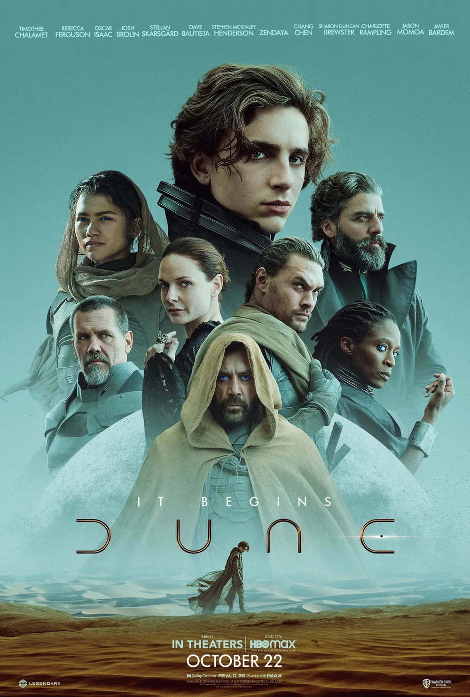
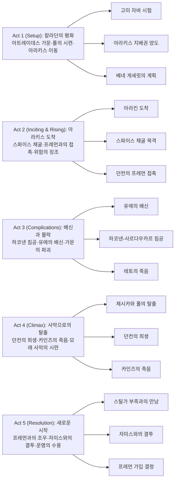

드니 빌뇌브가 연출한 『듄』은 프랭크 허버트의 불멸의 고전 SF 소설을 영상으로 구현한 대서사시이다. 이 영화는 복잡한 정치적 음모, 종교적 예언, 환경적 메시지를 담고 있으며, 사막 행성 아라키스를 배경으로 아트레이데스 가문의 상속자 폴 아트레이데스가 가문의 몰락 속에서 예언된 구원자로 거듭나는 장대한 여정을 그린다.

## 개요

### 영화 정보

* **제목**: Dune / 듄
* **감독**: Denis Villeneuve (드니 빌뇌브)
* **각본**: Jon Spaihts, Denis Villeneuve, Eric Roth
* **원작**: Frank Herbert의 소설 "Dune" (1965)
* **주연**: Timothée Chalamet (폴 아트레이데스), Rebecca Ferguson (레이디 제시카), Oscar Isaac (레토 아트레이데스), Josh Brolin (거니 할렉), Stellan Skarsgård (바론 하코넨), Dave Bautista (라반), Zendaya (차니), Jason Momoa (던컨 아이다호), Javier Bardem (스틸가), Charlotte Rampling (모히암 수녀), Sharon Duncan-Brewster (카인즈 박사)
* **촬영**: Greig Fraser
* **편집**: Joe Walker
* **음악**: Hans Zimmer
* **장르**: SF, 액션, 드라마, 서사시
* **상영시간**: 155분
* **개봉일**: 2021.09.03 (베니스 영화제), 2021.10.22 (미국)
* **제작사**: Legendary Pictures
* **배급사**: Warner Bros. Pictures
* **제작비**: 약 1.65억 달러
* **박스오피스**: 전세계 약 4.11억 달러
* **평점**: 로튼 토마토 83%, 메타크리틱 74/100, IMDb 8.0/10

### 추천 대상

* **SF 서사시 애호가**: 장대한 스케일의 세계관과 복잡한 정치적 음모를 즐기는 관객
* **시각적 예술 감상자**: IMAX 촬영과 뛰어난 프로덕션 디자인을 선호하는 관객
* **철학적 주제 탐구자**: 운명, 자유의지, 권력, 생태학 등 깊이 있는 주제를 다루는 영화를 찾는 관객
* **원작 팬**: 프랭크 허버트의 소설을 사랑하는 독자
* **드니 빌뇌브 팬**: 감독의 이전 작품(블레이드 러너 2049, 컨택트, 시카리오)을 좋아하는 관객

## 구조 분석

## 영화의 전체 내용 (스포일러 포함)

이 섹션은 영화를 이미 관람한 관객을 위한 상세한 줄거리 분석입니다. 영화는 폴 아트레이데스가 자신의 정체성과 운명을 발견하고 받아들이는 과정을 따라가며, 가문의 영광과 몰락, 그리고 새로운 시작을 그립니다. 각 Act는 폴의 성장 단계와 밀접하게 연결되어 있으며, 그의 여정은 개인적 성장에서 우주적 운명으로 확장됩니다.

### Act 1 (Setup): 칼라단의 평화

폴의 훈련과 시험, 아라키스로의 이동 준비를 다루는 도입부입니다.

**[S01] 차니의 꿈**: 영화는 차니(젠데이아)의 내레이션으로 시작된다. 사막 행성 아라키스와 프레먼족의 삶을 소개하며, 누군가가 그들을 구원할 것이라는 예언을 암시한다. 폴은 차니의 환영을 꿈에서 본다.

**[S02] 칼라단의 아침**: 물의 행성 칼라단에서 폴 아트레이데스(티모시 샬라메)가 깨어난다. 그는 레이디 제시카(레베카 퍼거슨)와 함께 베네 게세릿 훈련을 받는다. 제시카는 폴에게 "The Voice"라는 특별한 기술을 가르친다.

**[S03] 고미 자바 시험**: 수녀장 모히암(샬롯 램플링)이 칼라단에 도착하여 폴에게 고미 자바 시험을 실시한다. 상자 속에 손을 넣은 폴은 극심한 고통을 느끼지만, 본능을 억제하고 시험을 통과한다. 모히암은 폴이 퀘사츠 헤더락일 가능성을 확인한다.

**[S04] 레토 공작의 고민**: 레토 공작(오스카 아이작)은 황제 샤담 4세로부터 아라키스의 지배권을 받았다는 소식을 듣는다. 그는 이것이 함정일 수 있음을 알지만, 거절할 수 없다. 거니 할렉(조시 브롤린), 던컨 아이다호(제이슨 모모아), 투피르 하왓(스티븐 맥킨리 헨더슨) 등 충신들과 회의한다.

**[S05] 던컨의 선발대**: 던컨 아이다호가 아라키스로 선발대를 이끌고 출발한다. 그는 프레먼족과 접촉하여 동맹을 모색하는 임무를 받는다.

**[S06] 아라키스로의 출발**: 아트레이데스 가문 전체가 칼라단을 떠나 아라키스로 향한다. 폴은 차니의 환영을 계속 보며, 피와 전쟁으로 뒤덮인 미래를 예지한다.

### Act 2 (Inciting & Rising): 아라키스 도착

아라키스에 도착한 아트레이데스 가문이 새로운 환경에 적응하고 위험을 감지하기 시작합니다.

**[S07] 아라킨 도착**: 아트레이데스 가문이 아라키스의 수도 아라킨에 도착한다. 사막의 가혹한 환경과 스파이스의 중요성이 소개된다. 행성 생태학자 카인즈 박사(샤론 던컨-브루스터)가 그들을 맞이한다.

**[S08] 저택 탐색**: 폴과 제시카는 새로운 거처를 둘러본다. 프레먼 가정부 샤다웃 메이프스가 제시카에게 크리스나이프를 선물하며, 제시카가 예언된 인물일지도 모른다는 암시를 준다.

**[S09] 헌터-시커 암살 시도**: 밤에 폴의 침실에 헌터-시커(소형 암살 드론)가 침입한다. 폴은 훈련받은 반사신경으로 이를 격퇴하지만, 누군가 내부에 배신자가 있음을 깨닫는다.

**[S10] 스파이스 채굴 현장**: 레토, 폴, 거니, 카인즈가 오니톱터를 타고 사막의 스파이스 채굴 현장을 시찰한다. 거대한 샌드웜이 접근하자 채굴 작업이 중단되고, 레토는 모든 인원을 구출하기 위해 위험을 무릅쓴다. 폴은 처음으로 스파이스에 직접 노출되며 강력한 환영을 본다.

**[S11] 던컨의 귀환**: 던컨이 프레먼족과의 접촉에 성공하고 돌아온다. 그는 프레먼이 강력한 전사들이며, 그들이 폴과 제시카를 예언된 인물로 여긴다고 보고한다.

**[S12] 기디 프라임의 음모**: 하코넨 행성 기디 프라임에서 바론 하코넨(스텔란 스카스가드)이 조카 라반(데이브 바티스타)과 멘탯 피터 드 브리스와 함께 아트레이데스 가문을 무너뜨릴 계획을 세운다. 그들은 유에 박사(장첸)를 배신자로 심어두었다.

**[S13] 프레먼과의 만남**: 레토가 프레먼 지도자 스틸가(하비에르 바르뎀)와 비밀리에 만난다. 레토는 동맹을 제안하지만, 스틸가는 신중한 태도를 보인다. 폴은 프레먼들이 자신을 "리산 알 가이브"(예언의 음성)로 부르는 것을 듣는다.

### Act 3 (Complications): 배신과 몰락

하코넨의 침공과 유에의 배신으로 아트레이데스 가문이 몰락합니다.

**[S14] 미드포인트 - 유에의 배신**: 밤에 유에 박사가 레토 공작을 마비시킨다. 유에는 바론에게 붙잡힌 자신의 아내를 구하기 위해 배신했다고 고백한다. 그는 레토의 이빨 하나를 독가스 캡슐로 바꾸고, 레토에게 바론을 암살할 기회를 준다.

**[S15] 하코넨-사르다우카르 침공**: 하코넨 군대와 황제의 사르다우카르 병력이 아라킨을 공격한다. 아트레이데스 가문의 방어막이 무력화되고, 전투가 벌어진다. 거니, 던컨, 투피르는 각각 흩어져 저항한다.

**[S16] 레토의 죽음**: 바론이 레토를 심문하려 하자, 레토는 독가스 이빨을 깨물어 바론을 암살하려 한다. 폭발로 피터 드 브리스는 죽지만, 바론은 서스펜서 장치로 떠올라 간신히 살아남는다.

**[S17] 폴과 제시카의 포획**: 유에가 폴과 제시카를 마취시키지만, 그들에게 프레맨킷(사막 생존 도구)을 몰래 준다. 하코넨 병사들이 두 사람을 사막 깊숙이 버리라는 명령을 받는다.

**[S18] The Voice 탈출**: 오니톱터 안에서 제시카가 깨어나 The Voice를 사용하여 하코넨 병사들을 조종한다. 폴과 제시카는 병사들을 제압하고 사막으로 탈출한다.

**[S19] 사막의 밤**: 폴과 제시카는 텐트를 치고 밤을 보낸다. 폴은 스파이스에 노출되어 더욱 강력한 환영을 본다. 그는 자신의 이름으로 우주 전역에서 성전이 벌어지는 끔찍한 미래를 본다.

### Act 4 (Climax): 사막으로의 탈출

생존자들이 각자의 방식으로 저항하고 희생하는 클라이맥스입니다.

**[S20] 바론의 명령**: 바론이 조카 라반을 아라키스의 새로운 통치자로 임명한다. 라반은 스파이스 생산을 재개하고 모든 비용을 회수하라는 명령을 받는다.

**[S21] 던컨의 추적**: 던컨이 오니톱터를 타고 폴과 제시카를 찾아낸다. 그들은 사막의 한 생태학 연구소로 피신한다.

**[S22] 카인즈의 합류**: 카인즈 박사가 연구소에서 그들과 합류한다. 카인즈는 프레먼과 깊은 유대를 가진 인물로, 폴에게 아라키스의 생태학과 샌드웜에 대해 설명한다.

**[S23] 클라이맥스 - 던컨의 최후**: 사르다우카르 병사들이 연구소를 포위한다. 던컨은 폴과 제시카를 도망시키기 위해 홀로 남아 사르다우카르와 싸운다. 던컨은 여러 명을 쓰러뜨리지만, 결국 압도적인 수에 희생된다. 폴은 절친한 친구의 죽음을 목격한다.

**[S24] 카인즈의 희생**: 카인즈도 사르다우카르에게 붙잡히지만, 샌드웜을 부르는 비트를 작동시킨다. 거대한 샌드웜이 나타나 카인즈와 사르다우카르들을 모두 집어삼킨다.

**[S25] 깊은 사막으로**: 폴과 제시카는 깊은 사막으로 더 깊이 들어간다. 폴은 샌드워킹(샌드웜을 유인하지 않는 걸음법)을 자연스럽게 터득한다. 그들은 프레먼 부족과 마주칠 것을 예감한다.

### Act 5 (Resolution): 새로운 시작

폴이 프레먼과 조우하고 자신의 운명을 받아들이기 시작합니다.

**[S26] 프레먼 부족과의 조우**: 스틸가가 이끄는 프레먼 부족이 폴과 제시카를 발견한다. 차니도 그 부족에 속해 있으며, 폴은 그녀를 꿈에서 본 바로 그 여성임을 알아본다.

**[S27] 스틸가의 결정**: 스틸가는 두 사람을 부족에 받아들이고 싶어하지만, 프레먼 전사 자미스(밥스 올루산모쿤)가 도전한다. 자미스는 스틸가의 리더십에 의문을 제기하며, 폴에게 결투를 신청한다.

**[S28] 결투 준비**: 제시카는 폴을 말리려 하지만, 폴은 결투를 받아들인다. 프레먼의 규칙에 따라, 이는 죽음의 결투가 될 것이다.

**[S29] 엔딩 - 자미스와의 결투**: 폴과 자미스가 크리스나이프를 들고 대결한다. 폴은 처음에는 주저하지만, 결국 자미스를 죽인다. 이는 폴의 첫 살인이며, 그의 결백한 시절이 끝나는 순간이다.

**[S30] 프레먼 가입**: 스틸가가 폴을 받아들인다. 제시카의 만류에도 불구하고, 폴은 프레먼에 합류하기로 결심한다. 차니가 폴을 바라보며, 그들의 여정이 이제 시작됨을 암시한다.

**[S31] 폴의 결의**: 폴은 아버지의 꿈인 아라키스에 평화를 가져오겠다고 다짐한다. 영화는 폴이 사막을 바라보는 장면에서 끝나며, "이것은 시작에 불과하다"라는 메시지를 남긴다.

## 캐릭터 분석

영화의 등장인물들은 각각 복잡한 내면과 상징적 의미를 지니고 있으며, 폴의 여정과 밀접하게 연결되어 있습니다.

**폴 아트레이데스 (Paul Atreides)**

||
|:---:|
|폴 아트레이데스 (Paul Atreides)|

폴은 변화와 성장의 상징이다. 예지 능력과 베네 게세릿 혈통으로 인해 특별한 운명을 지니고 태어났지만, 그의 여정은 자신의 내면을 탐구하고, 실제로 리더십을 발휘하는 과정을 통해 그 운명을 받아들이는 것이다. 폴의 캐릭터는 자기 인식의 중요성과 함께, 진정한 리더가 되기 위해 필요한 공감능력과 자기희생을 강조한다. 그는 또한 예언과 운명에 대한 신화적 요소를 통해 인간이 직면할 수 있는 선택과 책임의 문제를 탐구한다.

**레토 아트레이데스 (Leto Atreides)**

||
|:---:|
|레토 아트레이데스 (Leto Atreides)|

레토 공작은 이상적인 리더의 모델을 제시한다. 그는 정의와 명예를 중시하며, 권력을 행사함에 있어서도 도덕적 원칙을 유지하려 한다. 레토의 리더십은 그의 가문과 아라키스의 사람들 사이에서 존경을 받으며, 그의 통치 아래에서 아트레이데스 가문은 번영을 꿈꾼다. 그러나 그의 이상주의는 또한 그와 그의 가문에게 치명적인 취약점이 되기도 한다. 레토의 캐릭터는 권력과 도덕 사이의 긴장과, 이상주의적 리더십이 현실 정치에서 어떻게 작용하는지를 탐구한다.

**레이디 제시카 (Lady Jessica)**

||
|:---:|
|레이디 제시카 (Lady Jessica)|

레이디 제시카는 강력한 여성 캐릭터로, 사랑과 충성심, 그리고 강력한 개인적 능력 사이에서 갈등한다. 베네 게세릿의 훈련을 받은 그녀는 폴의 능력을 이해하고 지도하는 데 중요한 역할을 하지만, 동시에 그녀의 선택이 가져올 후과에 대해서도 깊이 고민한다. 제시카의 여정은 여성의 역할, 권력, 그리고 모성에 대한 탐구로, 그녀는 자신의 운명을 스스로 선택하려는 강인한 의지를 보여준다.

**던컨 아이다호 (Duncan Idaho)**

||
|:---:|
|던컨 아이다호 (Duncan Idaho)|

던컨 아이다호는 충성과 용기의 상징이다. 아트레이데스 가문에 대한 그의 무한한 충성심은 그가 어떠한 위험에도 맞서 싸울 준비가 되어 있음을 보여준다. 던컨은 폴에게 중요한 롤모델이자 친구로, 그의 전사로서의 기술과 명예 있는 행동은 폴이 추구해야 할 리더십의 한 형태를 제시한다.

**바론 블라디미르 하코넨 (Baron Vladimir Harkonnen)**

||
|:---:|
|바론 블라디미르 하코넨 (Baron Vladimir Harkonnen)|

바론 하코넨은 영화의 주요 반대자로, 그의 캐릭터는 권모술수와 탐욕의 극단적인 예를 보여준다. 그는 무자비하고 계산적이며, 자신의 목표를 달성하기 위해서라면 어떠한 잔혹한 행위도 서슴지 않는다. 바론의 캐릭터는 권력의 부패와 악의 본성을 탐구하며, 그의 행동은 폴과 아트레이데스 가문에 대한 중요한 도전을 제시한다.

**차니 (Chani)**

||
|:---:|
|차니 (Chani)|

차니는 폴의 사랑과 동반자로, 프레먼족의 강인함과 생존 의지를 대표한다. 그녀는 폴에게 아라키스의 실상과 프레먼족의 문화를 가르치며, 폴이 자신의 운명을 받아들이고 진정한 리더가 되는 데 중요한 역할을 한다. 차니의 캐릭터는 사랑과 충성심, 그리고 개인적 강인함의 중요성을 강조한다.

이 등장인물들은 각각 『듄』의 복잡한 세계관과 이야기 속에서 중요한 역할을 하며, 그들의 상호작용과 개인적 여정은 영화의 깊이와 다층적인 의미를 더한다.

## 영상미와 음악

### 시각 효과 / 촬영 / 미학

촬영감독 그레이그 프레이저는 IMAX 카메라(Arri Alexa LF)를 사용하여 아라키스의 광활한 사막과 거대한 구조물들을 장엄하게 포착했다. 영화는 1.90:1(일반 IMAX)과 1.43:1(듀얼 레이저 IMAX) 화면비를 사용하여 사막의 웅장함을 극대화한다.

**색감과 톤**: 칼라단은 차갑고 우울한 회색-파란색 톤으로, 아라키스는 뜨겁고 건조한 황금빛-주황색으로 대비된다. 기디 프라임은 흑백에 가까운 무채색으로 하코넨의 냉혹함을 상징한다.

**미장센과 프로덕션 디자인**: 프로덕션 디자이너 파트리스 베르메트는 메소포타미아 지구라트, 이집트 건축, 브라질과 소련의 브루탈리스트 건축에서 영감을 받았다. 모든 세트는 최소한의 CG로 실제감을 극대화하도록 설계되었다.

**VFX와 샌드웜**: DNEG가 1,200개 이상의 VFX 샷을 제작했다. 샌드웜은 나무 껍질과 진흙 평지의 질감을 기반으로 디자인되었으며, 실제 사막 촬영과 CG를 완벽히 혼합하여 압도적인 존재감을 창조했다. 프레이저는 그린스크린 대신 "샌드스크린"(모래색 배경)을 사용하여 자연스러운 합성을 가능하게 했다.

**의상 디자인**: 재클린 웨스트와 밥 모건은 중세 시대, 발렌시아가, 베두인, 투아레그 문화에서 영감을 받았다. 스틸슈트는 150벌 이상 제작되었으며, 기능성과 미적 완성도를 동시에 추구했다.

### Hans Zimmer의 음악

한스 짐머는 Christopher Nolan의 『Tenet』(2020) 작업을 거절하면서까지 『듄』의 음악에 집중했다. 그는 David Lynch의 1984년 영화를 보지 않았으며, 유타 사막에서 일주일을 보내며 영감을 받았다.

**악기와 사운드**: 짐머는 서양 오케스트라의 전통적인 악기를 피하고, 영화를 위해 특별히 제작된 악기들을 사용했다. 아트레이데스 가문을 위해서는 빌뇌브의 제안으로 백파이프 30대를 에든버러에서 녹음했으며, 이는 "고대적이고 유기적인" 느낌을 준다.

**보컬과 합창**: 보컬리스트 Loire Cotler가 프레먼의 목소리를 담당했으며, 기타리스트 Guthrie Govan도 참여했다. 첫 번째 트레일러를 위해 짐머는 FaceTime으로 32명의 합창단을 지휘하여 Pink Floyd의 "Eclipse"를 커버했다.

**음악적 테마**: 각 가문과 캐릭터는 고유한 음악적 정체성을 가진다. 폴의 테마는 불확실성과 점차 깨어나는 힘을 반영하며, 바론의 테마는 어둡고 위협적이다. 전체적으로 영화는 웅장하면서도 신비로운 사운드스케이프를 구축한다.

**수상**: 짐머의 스코어는 아카데미 최우수 작곡상을 수상했으며, 그래미상에도 노미네이트되었다.

## 종합 평가

### 최종 평점: ★★★★☆ (4.2/5.0)

**장점**:
- IMAX 촬영을 통한 압도적인 시각적 장관과 뛰어난 프로덕션 디자인
- 한스 짐머의 혁신적이고 웅장한 스코어
- 티모시 샬라메, 레베카 퍼거슨을 비롯한 앙상블 캐스트의 훌륭한 연기
- 원작의 복잡한 세계관을 영상으로 성공적으로 구현
- 아카데미 6관왕(촬영, 편집, 음향, 음악, 프로덕션 디자인, 시각효과)의 기술적 완성도
- 정치적 음모, 생태학, 식민주의, 운명과 자유의지 등 깊이 있는 주제 탐구

**단점**:
- 2부작의 첫 번째 부분으로 미완성된 스토리(속편이 필수)
- 복잡한 세계관으로 인해 원작을 모르는 관객에게는 다소 어려울 수 있음
- 다소 느린 템포와 긴 러닝타임(155분)
- 중동 및 이슬람 문화에 대한 오리엔탈리즘 논란(MENA 배우의 부족)

### 한 줄 평

"드니 빌뇌브가 장인 정신으로 빚어낸 시각적 걸작이자, 원작에 대한 존중과 현대적 재해석이 조화를 이룬 SF 서사시의 새로운 이정표."

### 추천 작품

- 《블레이드 러너 2049》(2017): 드니 빌뇌브 감독의 이전 SF 걸작으로, 마찬가지로 시각적 완성도와 철학적 주제를 탐구한다.
- 《로렌스 of 아라비아》(1962): 사막을 배경으로 한 서사시의 고전으로, 『듄』의 시각적 영감의 원천 중 하나.
- 《스타워즈: 새로운 희망》(1977): 조지 루카스가 『듄』의 영향을 받아 만든 작품으로, 사막 행성과 예언된 구원자 이야기가 유사하다.
- 《지옥의 묵시록》(1979): 폴의 심리적 여정과 전쟁의 광기를 탐구하는 면에서 유사성이 있다.

### 관람 전 체크리스트

- 사전 지식이 필요한가? **부분적으로 필요**. 원작 소설이나 이전 영화(1984, 2000)를 알면 도움이 되지만, 영화 자체만으로도 이해 가능하다.
- 어린이와 함께 볼 수 있는가? **12세 이상 관람가** (미국 PG-13). 폭력 장면과 긴장감 있는 장면이 있으나, 과도하지는 않다.
- 특정 요소를 기대해도 되는가? **IMAX 상영 강력 추천**. 영화의 시각적 장관을 제대로 경험하려면 IMAX 극장 관람이 필수적이다.
- 쿠키 영상이 있는가? **없음**. 크레딧 후 추가 장면은 없다.
- 속편 가능성은? **확정**. 『듄: 파트 2』는 2024년 3월 1일에 개봉되었으며, 『듄: 메시아』를 기반으로 한 3부작 완결편이 제작 중이다.

## 참고 문헌 및 출처

- [Dune (2021 film) — Wikipedia](https://en.wikipedia.org/wiki/Dune_(2021_film))
- [Dune Review — Rotten Tomatoes](https://www.rottentomatoes.com/m/dune_2021)
- [Denis Villeneuve on Making Dune — The Hollywood Reporter](https://www.hollywoodreporter.com/movies/movie-features/making-of-dune-denis-villeneuve-1235051936/)
- [How Hans Zimmer Conjured the Otherworldly Sounds of Dune — The New York Times](https://www.nytimes.com/2021/10/22/movies/dune-hans-zimmer.html)
- [Dune Production Design — Empire Magazine](https://www.empireonline.com/movies/features/dune-production-design/)

하코넨 가문은 잔인하고 권모술수가 뛰어난 가문으로, 이전에 아라키스를 지배했었다. 황제는 하코넨 가문과 비밀리에 협력하여 아트레이데스 가문을 함정에 빠뜨리고, 자신의 권력을 유지하려 한다. 이러한 배신은 황제가 자신의 지위를 유지하기 위해 어떠한 수단도 사용할 준비가 되어 있음을 보여준다.

**가문들 사이의 균형과 긴장**

『듄』에서 가문들 사이의 관계는 끊임없이 변화하는 균형과 긴장의 상태에 있다. 각 가문은 자신들의 이익을 위해 다른 가문이나 황제와 협력하거나 대립하는 전략을 사용한다. 이러한 정치적 게임은 권력, 자원, 그리고 영향력을 둘러싼 복잡한 무대를 제공하며, 이는 영화의 주요 테마 중 하나이다.

## 베네 게세릿(Bene Gesserit)

||
|:---:|
|베네 게세릿(Bene Gesserit)|

베네 게세릿(Bene Gesserit)은 『듄』 시리즈에서 중요한 역할을 하는 가상의 여성 조직으로, 광범위한 정치적, 사회적 영향력을 행사하며 우주 전역에 걸쳐 그들의 의제를 추진한다. 이 조직은 고도로 훈련된 여성들로 구성되어 있으며, 그들은 물리적, 정신적 능력을 극대화하기 위한 엄격한 훈련을 받는다. 베네 게세릿은 『듄』 시리즈에서 중요한 비밀 조직으로, 그들의 복잡한 목표와 전략은 작품 전체의 중심적인 테마 중 하나다. 그들은 우주의 권력 구조와 인간의 진화에 깊은 영향을 미치며, 그 과정에서 도덕적, 철학적 질문을 제기한다. 베네 게세릿의 존재는 우리에게 권력의 본성, 인간의 욕망, 그리고 미래를 형성하기 위한 우리의 노력에 대해 생각해 볼 기회를 제공한다.

**목표와 철학**

베네 게세릿의 궁극적인 목표는 인간 진화를 지휘하고, 우주적 규모의 평화와 안정을 유지하는 것이다. 이를 위해 그들은 정치적 결혼, 유전학, 그리고 사회적 조작을 통해 근본적인 변화를 이끌어내려 한다. 베네 게세릿은 자신들의 믿음과 목표를 실현하기 위해 "긴 시야"를 갖추고, 장기적인 계획을 세우며 행동한다.

**능력**

베네 게세릿의 구성원들은 몸과 마음을 제어하는 데 있어 비범한 능력을 발휘한다. 이들은 목소리를 조절하여 타인의 행동을 조종할 수 있는 '음성' 기술, 극도로 향상된 감각, 그리고 거의 초인적인 신체 능력을 가진다. 또한, 그들은 자신의 기억 속에 존재하는 여러 세대에 걸친 조상들의 기억을 접근할 수 있는 '다중 생애' 기술을 사용한다.

**정치적 역할**

베네 게세릿은 우주 정치에 깊숙이 개입한다. 그들은 결혼을 통한 동맹, 비밀 정보의 수집, 그리고 유력한 인물들에 대한 조언을 통해 권력 구조 내에서 영향력을 행사한다. 이 조직은 자신들의 목표를 달성하기 위해 다양한 가문과 황제 사이의 관계를 조작하고, 때로는 직접적으로 정치적 결정에 개입하기도 한다.

**퀘사츠 헤더락 계획**

베네 게세릿의 가장 야심 찬 프로젝트 중 하나는 퀘사츠 헤더락(Kwisatz Haderach)의 창조다. 이는 남성 베네 게세릿이자, 시공간을 넘나들며 미래를 볼 수 있는 존재를 만드는 것을 목표로 한다. 폴 아트레이데스는 이 계획의 예기치 않은 결과로, 그가 퀘사츠 헤더락로 여겨지게 된다. 그의 등장은 베네 게세릿의 계획과 그들이 우주에 미치는 영향에 근본적인 변화를 가져온다.

## 폴 아트레이데스의 여정

폴은 예지 능력과 특별한 운명을 지닌 인물로서, 영화는 그의 성장과 변화를 추적한다. 폴은 처음에는 자신의 역할과 운명에 대해 회의적이지만, 점차 자신이 아트레이데스 가문의 리더이자 예언된 '마하디'라는 것을 받아들인다. 그의 여정은 자기 발견, 권력의 획득, 그리고 궁극적으로는 그의 가문과 아라키스 행성의 운명을 결정짓는 길이 된다.

## 정치적 및 환경적 주제

영화는 권력의 정치학과 자원의 중요성을 탐구한다. 아트레이데스 가문과 경쟁 가문인 하코넨 가문 간의 갈등은 권력을 장악하기 위한 냉혹한 전략과 배신을 보여준다. 또한, 아라키스의 환경적 조건과 스파이스의 채취는 지구의 자원 고갈과 환경 파괴에 대한 은유로 해석될 수 있다. 폴의 여정은 또한 지역 주민인 프레먼족과의 관계를 통해 식민지주의와 저항의 주제를 탐구한다.

## 종교적 및 철학적 요소

『듄』은 종교적 신념과 예언의 힘을 중요한 요소로 다룬다. 프레먼족은 폴을 그들의 예언된 구원자로 보지만, 폴 자신은 자신의 역할과 그것이 가져올 결과에 대해 깊이 고민한다. 이는 운명과 자유 의지 사이의 긴장과 인간이 자신의 운명을 어떻게 형성할 수 있는지에 대한 철학적 질문을 제기한다.

『듄』은 종교적 및 철학적 요소가 풍부하게 얽혀 있는 작품으로, 다양한 신념 체계와 철학적 사상을 통해 깊이 있는 메시지와 테마를 탐구한다. 이러한 요소들은 작품의 세계관을 구성하고, 등장인물들의 동기와 행동, 그리고 스토리의 전개에 중대한 영향을 미친다. 여기서는 몇 가지 주요 종교적 및 철학적 요소에 대해 자세히 분석해 보겠다.

**메시아주의**

『듄』에서는 폴 아트레이데스가 프레먼족의 예언된 구원자, 즉 마하디(Mahdi)로 여겨지는 메시아주의적 테마가 중요한 역할을 한다. 이는 폴이 자신의 정체성과 운명을 받아들이는 과정에서 중심적인 충돌을 일으킨다. 메시아주의적 신념은 폴이 프레먼족과 깊은 유대를 맺게 하며, 그들의 저항 운동에 정당성을 부여한다. 이러한 요소는 리더십과 구원의 개념, 그리고 예언이 실현되는 과정에서의 개인과 사회의 역할에 대한 탐구를 가능하게 한다.

**종교적 융합**

작품 속에서 다양한 종교적 요소가 융합되어 나타난다. 프레먼족의 신념 체계는 이슬람, 기독교, 유대교 등 지구의 여러 종교에서 영향을 받은 것으로 묘사되며, 이는 우주적 규모의 종교적 신념 체계를 형성한다. 이러한 종교적 융합은 다양한 문화와 신념이 충돌하고 협력하는 우주적 규모의 사회를 상상하게 만들며, 종교가 사회적 결속과 정체성 형성에 어떻게 기여하는지를 보여준다.

**환경주의와 생태학**

아라키스(듄)의 환경과 그에 대한 프레먼족의 적응은 작품의 중심적인 테마 중 하나이며, 이는 종교적 및 철학적 사상과 깊이 연결되어 있다. 프레먼족은 극한의 환경에서 생존하기 위해 자연과 조화를 이루는 방법을 개발했으며, 이는 거의 종교적인 신념 체계로 발전한다. 이러한 생태학적 접근은 인간과 자연의 관계, 그리고 지속 가능한 삶의 방식에 대한 깊은 사색을 유도한다.

**운명과 자유 의지**

폴의 여정은 운명과 자유 의지 사이의 긴장을 탐구한다. 폴은 자신이 예언된 운명을 따를 것인지, 아니면 자신의 경로를 선택할 것인지 사이에서 갈등한다. 이러한 주제는 인간의 행동이 미래에 어떤 영향을 미치는지, 그리고 개인이 자신의 운명을 어느 정도까지 제어할 수 있는지에 대한 철학적 질문을 제기한다.

**권력과 윤리**

『듄』은 권력의 본성과 그것을 행사하는 방식에 대한 윤리적 질문을 다룬다. 베네 게세릿, 황제, 그리고 다양한 가문들의 행동은 권력을 얻고 유지하기 위한 다양한 전략을 보여주며, 이는 종종 윤리적 고민과 충돌을 야기한다. 이러한 요소는 권력과 도덕성 사이의 관계, 그리고 리더십이 가져야 할 윤리적 책임에 대한 탐구를 가능하게 한다.

이와 같이, 『듄』은 종교적 및 철학적 요소를 통해 인간의 본성, 사회적 구조, 그리고 우리가 사는 세계에 대한 깊이 있는 사색을 제공한다. 이러한 요소들은 작품에 풍부한 다층성을 부여하며, 독자와 관객으로 하여금 보다 깊은 의미와 메시지를 탐색하도록 유도한다.

## 결론

『듄』은 단순한 공상과학 영화를 넘어, 권력, 자원, 정체성, 운명에 대한 깊이 있는 탐구를 제공한다. 폴 아트레이데스의 개인적인 여정은 광대한 우주적 배경과 얽히며, 복잡한 세계관 속에서 다양한 주제를 탐색한다. 이 영화는 시청자로 하여금 인간의 본성, 사회적 구조, 그리고 우리가 사는 세계에 대해 다시 생각해 보게 만든다.