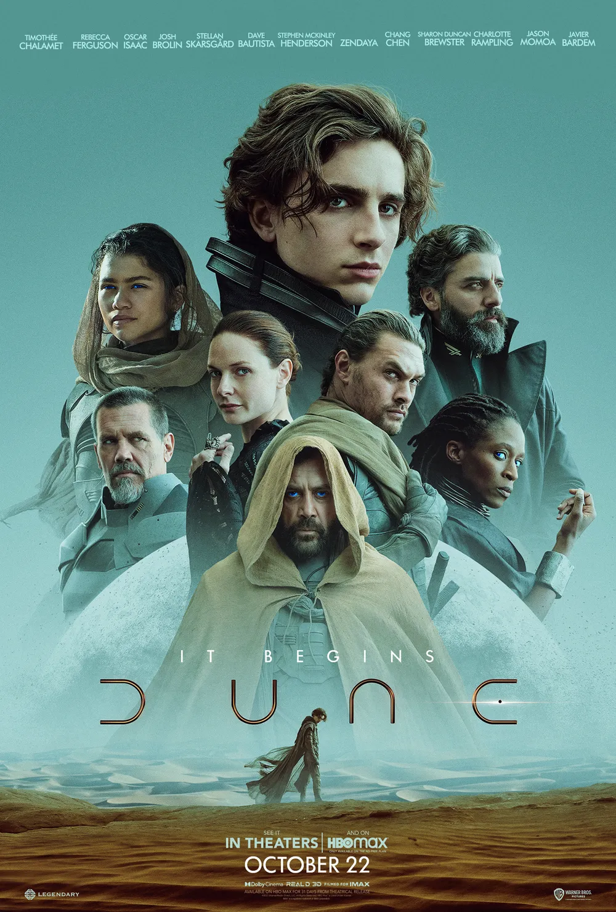
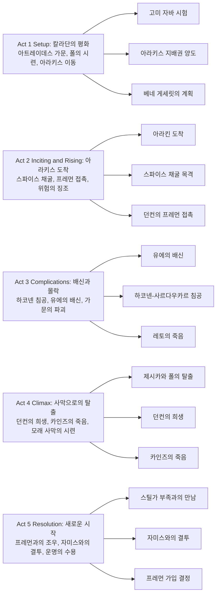

드니 빌뇌브가 연출한 『듄』(2021)은 프랭크 허버트의 고전 SF 소설을 영상으로 구현한 대서사시다. 복잡한 정치적 음모, 종교적 예언, 환경·식민주의 메시지를 담으며, 사막 행성 아라키스를 배경으로 아트레이데스 가문의 상속자 폴이 가문의 몰락 속에서 예언된 구원자로 거듭나는 여정을 그린다. IMAX 촬영과 한스 짐머의 사운드스케이프로 원작의 분위기와 규모를 현대적으로 재해석했다.

## 개요

### 영화 정보

* **제목**: Dune / 듄 (Dune: Part One)
* **감독**: Denis Villeneuve (드니 빌뇌브)
* **각본**: Jon Spaihts, Denis Villeneuve, Eric Roth
* **원작**: Frank Herbert 소설 "Dune" (1965)
* **주연**: Timothée Chalamet (폴 아트레이데스), Rebecca Ferguson (레이디 제시카), Oscar Isaac (레토 아트레이데스), Josh Brolin (거니 할렉), Stellan Skarsgård (바론 하코넨), Dave Bautista (라반), Zendaya (차니), Jason Momoa (던컨 아이다호), Javier Bardem (스틸가), Charlotte Rampling (모히암 수녀), Sharon Duncan-Brewster (카인즈 박사)
* **촬영**: Greig Fraser
* **편집**: Joe Walker
* **음악**: Hans Zimmer
* **장르**: SF, 액션, 드라마, 서사시
* **상영시간**: 155분 (2시간 35분)
* **개봉일**: 2021.09.03 (베니스 영화제), 2021.10.22 (미국)
* **제작사**: Legendary Pictures
* **배급사**: Warner Bros. Pictures
* **제작비**: 약 1.65억 달러
* **박스오피스**: 전세계 약 4.11억 달러
* **평점**: 로튼 토마토 83%, 메타크리틱 74/100, IMDb 8.0/10

### 추천 대상

* **SF 서사시 애호가**: 장대한 스케일의 세계관과 복잡한 정치·음모를 즐기는 관객
* **시각·음향 감상자**: IMAX 촬영과 프로덕션 디자인, 한스 짐머 사운드를 선호하는 관객
* **철학·주제 탐구자**: 운명, 자유의지, 권력, 생태학을 다루는 영화를 찾는 관객
* **원작 팬**: 프랭크 허버트 소설을 사랑하는 독자
* **드니 빌뇌브 팬**: 《블레이드 러너 2049》《시카리오》《컨택트》 등을 좋아하는 관객

## 구조 분석

```mermaid
flowchart LR
    Act1["Act 1 Setup: 칼라단의 평화</br>아트레이데스 가문, 폴의 시련, 아라키스 이동"]
    Act2["Act 2 Inciting and Rising: 아라키스 도착</br>스파이스 채굴, 프레먼 접촉, 위험의 징조"]
    Act3["Act 3 Complications: 배신과 몰락</br>하코넨 침공, 유에의 배신, 가문의 파괴"]
    Act4["Act 4 Climax: 사막으로의 탈출</br>던컨의 희생, 카인즈의 죽음, 모래 사막의 시련"]
    Act5["Act 5 Resolution: 새로운 시작</br>프레먼과의 조우, 자미스와의 결투, 운명의 수용"]
    Act1 --> Setup1["고미 자바 시험"]
    Act1 --> Setup2["아라키스 지배권 양도"]
    Act1 --> Setup3["베네 게세릿의 계획"]
    Act2 --> Rising1["아라킨 도착"]
    Act2 --> Rising2["스파이스 채굴 목격"]
    Act2 --> Rising3["던컨의 프레먼 접촉"]
    Act3 --> Comp1["유에의 배신"]
    Act3 --> Comp2["하코넨-사르다우카르 침공"]
    Act3 --> Comp3["레토의 죽음"]
    Act4 --> Climax1["제시카와 폴의 탈출"]
    Act4 --> Climax2["던컨의 희생"]
    Act4 --> Climax3["카인즈의 죽음"]
    Act5 --> Res1["스틸가 부족과의 만남"]
    Act5 --> Res2["자미스와의 결투"]
    Act5 --> Res3["프레먼 가입 결정"]
```

## 영화의 전체 내용 (스포일러 포함)

이 섹션은 이미 관람한 관객을 위한 상세 줄거리다. 영화는 폴 아트레이데스가 정체성과 운명을 발견·수용하는 과정을 따라가며, 가문의 영광과 몰락, 그리고 새로운 시작을 그린다. 각 Act는 폴의 성장 단계와 연결되어 있고, 여정은 개인적 성장에서 우주적 운명으로 확장된다.

### Act 1 (Setup): 칼라단의 평화

폴의 훈련과 시험, 아라키스로의 이동 준비를 다루는 도입부다.

**[S01] 차니의 꿈**: 영화는 차니(젠데이아)의 내레이션으로 시작한다. 사막 행성 아라키스와 프레먼족의 삶을 소개하며, 누군가 그들을 구원할 것이라는 예언을 암시한다. 폴은 차니의 환영을 꿈에서 본다.

**[S02] 칼라단의 아침**: 물의 행성 칼라단에서 폴 아트레이데스(티모시 샬라메)가 깨어난다. 그는 레이디 제시카(레베카 퍼거슨)와 함께 베네 게세릿 훈련을 받으며, 제시카는 폴에게 "The Voice"를 가르친다.

**[S03] 고미 자바 시험**: 수녀장 모히암(샬롯 램플링)이 칼라단에 도착해 폴에게 고미 자바 시험을 실시한다. 상자 속에 손을 넣은 폴은 극심한 고통을 느끼지만 본능을 억제하고 시험을 통과한다. 모히암은 폴이 퀘사츠 헤더락일 가능성을 확인한다.

**[S04] 레토 공작의 고민**: 레토 공작(오스카 아이작)은 황제 샤담 4세로부터 아라키스의 지배권을 받았다는 소식을 듣는다. 함정일 수 있음을 알지만 거절할 수 없고, 거니 할렉(조시 브롤린), 던컨 아이다호(제이슨 모모아), 투피르 하왓(스티븐 맥킨리 헨더슨) 등 충신들과 회의한다.

**[S05] 던컨의 선발대**: 던컨 아이다호가 아라키스로 선발대를 이끌고 출발한다. 프레먼족과 접촉해 동맹을 모색하는 임무를 맡는다.

**[S06] 아라키스로의 출발**: 아트레이데스 가문 전체가 칼라단을 떠나 아라키스로 향한다. 폴은 차니의 환영을 계속 보며, 피와 전쟁으로 뒤덮인 미래를 예지한다.

### Act 2 (Inciting & Rising): 아라키스 도착

아라키스에 도착한 아트레이데스 가문이 새 환경에 적응하고 위험을 감지하기 시작하는 구간이다.

**[S07] 아라킨 도착**: 아트레이데스 가문이 아라키스의 수도 아라킨에 도착한다. 사막의 가혹한 환경과 스파이스의 중요성이 소개되고, 행성 생태학자 카인즈 박사(샤론 던컨-브루스터)가 그들을 맞이한다.

**[S08] 저택 탐색**: 폴과 제시카는 새 거처를 둘러본다. 프레먼 가정부 샤다웃 메이프스가 제시카에게 크리스나이프를 선물하며, 제시카가 예언된 인물일 수 있다는 암시를 준다.

**[S09] 헌터-시커 암살 시도**: 밤에 폴의 침실에 헌터-시커(소형 암살 드론)가 침입한다. 폴은 훈련된 반사신경으로 격퇴하지만, 내부에 배신자가 있음을 깨닫는다.

**[S10] 스파이스 채굴 현장**: 레토, 폴, 거니, 카인즈가 오니톱터를 타고 사막의 스파이스 채굴 현장을 시찰한다. 거대한 샌드웜이 접근하자 채굴이 중단되고, 레토는 모든 인원을 구출하기 위해 위험을 무릅쓴다. 폴은 처음으로 스파이스에 직접 노출되며 강력한 환영을 본다.

**[S11] 던컨의 귀환**: 던컨이 프레먼족과의 접촉에 성공하고 돌아온다. 프레먼이 강력한 전사들이며, 폴과 제시카를 예언된 인물로 여긴다고 보고한다.

**[S12] 기디 프라임의 음모**: 하코넨 행성 기디 프라임에서 바론 하코넨(스텔란 스카스가드)이 조카 라반(데이브 바티스타)과 멘탯 피터 드 브리스와 함께 아트레이데스 가문을 무너뜨릴 계획을 세운다. 유에 박사(장첸)를 배신자로 심어두었다.

**[S13] 프레먼과의 만남**: 레토가 프레먼 지도자 스틸가(하비에르 바르뎀)와 비밀리에 만난다. 레토는 동맹을 제안하지만 스틸가는 신중한 태도를 보인다. 폴은 프레먼들이 자신을 "리산 알 가이브"(예언의 음성)로 부르는 것을 듣는다.

### Act 3 (Complications): 배신과 몰락

하코넨의 침공과 유에의 배신으로 아트레이데스 가문이 몰락하는 구간이다.

**[S14] 미드포인트 - 유에의 배신**: 밤에 유에 박사가 레토 공작을 마비시킨다. 유에는 바론에게 붙잡힌 아내를 구하기 위해 배신했다고 고백한다. 그는 레토의 이빨 하나를 독가스 캡슐로 바꾸고, 레토에게 바론을 암살할 기회를 준다.

**[S15] 하코넨-사르다우카르 침공**: 하코넨 군대와 황제의 사르다우카르 병력이 아라킨을 공격한다. 아트레이데스 가문의 방어막이 무력화되고 전투가 벌어진다. 거니, 던컨, 투피르는 각각 흩어져 저항한다.

**[S16] 레토의 죽음**: 바론이 레토를 심문하려 하자, 레토는 독가스 이빨을 깨물어 바론을 암살하려 한다. 폭발로 피터 드 브리스는 죽지만, 바론은 서스펜서 장치로 떠올라 간신히 살아남는다.

**[S17] 폴과 제시카의 포획**: 유에가 폴과 제시카를 마취시키지만, 그들에게 프레맨킷(사막 생존 도구)을 몰래 준다. 하코넨 병사들이 두 사람을 사막 깊숙이 버리라는 명령을 받는다.

**[S18] The Voice 탈출**: 오니톱터 안에서 제시카가 깨어나 The Voice로 하코넨 병사들을 조종한다. 폴과 제시카는 병사들을 제압하고 사막으로 탈출한다.

**[S19] 사막의 밤**: 폴과 제시카는 텐트를 치고 밤을 보낸다. 폴은 스파이스에 노출되어 더욱 강력한 환영을 본다. 자신의 이름으로 우주 전역에서 성전이 벌어지는 끔찍한 미래를 목격한다.

### Act 4 (Climax): 사막으로의 탈출

생존자들이 각자의 방식으로 저항하고 희생하는 클라이맥스 구간이다.

**[S20] 바론의 명령**: 바론이 조카 라반을 아라키스의 새 통치자로 임명한다. 라반은 스파이스 생산을 재개하고 비용을 회수하라는 지시를 받는다.

**[S21] 던컨의 추적**: 던컨이 오니톱터를 타고 폴과 제시카를 찾아낸다. 그들은 사막의 한 생태학 연구소로 피신한다.

**[S22] 카인즈의 합류**: 카인즈 박사가 연구소에서 그들과 합류한다. 카인즈는 프레먼과 깊은 유대를 가진 인물로, 폴에게 아라키스의 생태학과 샌드웜에 대해 설명한다.

**[S23] 클라이맥스 - 던컨의 최후**: 사르다우카르 병사들이 연구소를 포위한다. 던컨은 폴과 제시카를 도망시키기 위해 홀로 남아 사르다우카르와 싸운다. 여러 명을 쓰러뜨리지만 결국 압도적인 수에 희생된다. 폴은 절친한 친구의 죽음을 목격한다.

**[S24] 카인즈의 희생**: 카인즈도 사르다우카르에게 붙잡히지만, 샌드웜을 부르는 비트를 작동시킨다. 거대한 샌드웜이 나타나 카인즈와 사르다우카르들을 모두 집어삼킨다.

**[S25] 깊은 사막으로**: 폴과 제시카는 깊은 사막으로 더 들어간다. 폴은 샌드워킹(샌드웜을 유인하지 않는 걸음법)을 자연스럽게 터득한다. 그들은 프레먼 부족과 마주칠 것을 예감한다.

### Act 5 (Resolution): 새로운 시작

폴이 프레먼과 조우하고 자신의 운명을 받아들이기 시작하는 마무리 구간이다.

**[S26] 프레먼 부족과의 조우**: 스틸가가 이끄는 프레먼 부족이 폴과 제시카를 발견한다. 차니도 그 부족에 속해 있으며, 폴은 그녀를 꿈에서 본 바로 그 여성임을 알아본다.

**[S27] 스틸가의 결정**: 스틸가는 두 사람을 부족에 받아들이고 싶어하지만, 프레먼 전사 자미스(밥스 올루산모쿤)가 도전한다. 자미스는 스틸가의 리더십에 의문을 제기하며 폴에게 결투를 신청한다.

**[S28] 결투 준비**: 제시카는 폴을 말리지만, 폴은 결투를 받아든다. 프레먼의 규칙에 따라 죽음의 결투가 된다.

**[S29] 엔딩 - 자미스와의 결투**: 폴과 자미스가 크리스나이프를 들고 대결한다. 폴은 처음에는 주저하지만 결국 자미스를 죽인다. 폴의 첫 살인이자 결백한 시절이 끝나는 순간이다.

**[S30] 프레먼 가입**: 스틸가가 폴을 받아들인다. 제시카의 만류에도 폴은 프레먼에 합류하기로 결심한다. 차니가 폴을 바라보며, 그들의 여정이 이제 시작됨을 암시한다.

**[S31] 폴의 결의**: 폴은 아버지의 꿈인 아라키스에 평화를 가져오겠다고 다짐한다. 영화는 폴이 사막을 바라보는 장면에서 끝나며, "이것은 시작에 불과하다"라는 메시지를 남긴다.

## 핵심 대사 인덱스

"I must not fear. Fear is the mind-killer." — 레이디 제시카, [S02]; 베네 게세릿 리타니. 두려움을 통제하는 맨트라.

"Dreams are messages from the deep." — 사르다우카르 사제, 오프닝; 예언과 무의식에 대한 영화의 테마를 암시.

"A great man doesn't seek to lead; he's called to it." — 레토 공작, [S04]; 폴에게 리더십이 선택이 아니라 소명임을 전달.

"This is only the beginning." — 차니, [S31]; 속편과 폴의 성장을 예고하는 마지막 대사.

## 캐릭터 분석

### 폴 아트레이데스 (Paul Atreides) — Timothée Chalamet

**개요**: 아트레이데스 가문의 상속자. 베네 게세릿 혈통과 레토 공작의 아들로, 예지와 The Voice의 씨앗을 지닌 청년.

**성장 곡선**: 칼라단의 훈련받은 귀족에서 고미 자바 시험 통과, 아라키스 이주, 가문 몰락과 사막 생존, 자미스와의 결투를 거쳐 프레먼에 합류하기까지. 예언을 거부하다가 점차 "리산 알 가이브"로서의 운명을 받아들인다.

**동기와 욕망**: 아버지의 기대에 부응하고 가문을 지키려 했으나, 배신과 죽음 뒤에는 생존과 정의(아라키스에 평화)를 추구한다. 동시에 성전의 환영에 대한 공포와 책임감이 겹친다.

**갈등 구조**: 내적으로는 운명 대 자유의지, 구원자 신화 대 파괴적 성전; 외적으로는 하코넨·황제·사르다우카르, 그리고 프레먼 내부의 불신(자미스)과 맞선다.

**상징적 의미**: 메시아/반메시아 서사의 중심. 예언된 구원자이자 동시에 성전을 불러일으킬 수 있는 인물로, 권력·종교·식민주의 비판의 초점이 된다.

### 레토 아트레이데스 (Duke Leto Atreides) — Oscar Isaac

**개요**: 아트레이데스 가문의 공작. 황제로부터 아라키스 통치권을 받아 이주하나, 함정에 빠져 몰락한다.

**성장 곡선**: 영화 내에서는 "성장"보다는 일관된 원칙의 리더. 유에의 배신과 바론 암살 시도, 실패한 독가스로 인한 죽음까지 변치 않는 명예와 책임감을 보인다.

**동기와 욕망**: 가문의 안전과 아라키스의 공정한 통치. 프레먼과의 동맹을 통한 장기적 평화. 아들 폴에게 진정한 리더십을 물려주려 한다.

**갈등 구조**: 황제의 음모, 하코넨의 적의, 내부 배신(유에). 이상주의적 리더십이 현실 정치의 배신과 폭력에 부딪힌다.

**상징적 의미**: "선한 통치자"의 이상과 그 한계. 권력과 도덕의 긴장, 그리고 그가 죽은 뒤에도 폴에게 남기는 유산(아라키스에 평화)의 상징.

### 레이디 제시카 (Lady Jessica) — Rebecca Ferguson

**개요**: 레토의 연인이자 폴의 어머니. 베네 게세릿 훈련을 받았으나 딸 대신 아들을 낳아 예언을 어긴 인물. The Voice와 신체·정신 훈련을 폴에게 전수한다.

**성장 곡선**: 가문의 보호자이자 폴의 스승에서, 몰락 후에는 사막 생존과 탈출의 동반자. 폴이 프레먼에 합류하는 것을 반대하지만 결국 그의 선택을 인정하는 쪽으로 흐른다.

**동기와 욕망**: 폴과 레토를 지키는 것. 동시에 베네 게세릿 계획과 충돌하는 모성애와 자유의지(아들을 낳은 선택)로 인한 불안.

**갈등 구조**: 베네 게세릿의 기대와 개인적 사랑, 폴의 운명을 앞당길지 말지에 대한 내적 갈등. 외적으로는 하코넨·사르다우카르와의 생존 투쟁.

**상징적 의미**: 여성의 주체성, 모성, 그리고 종교/권력 구조에 대한 저항. "전사 사제"로서의 역할이 영화에서 강조된다.

### 던컨 아이다호 (Duncan Idaho) — Jason Momoa

**개요**: 아트레이데스 가문의 검술가이자 폴의 멘토. 프레먼과의 첫 접촉을 맡고, 나중에 폴과 제시카를 구하러 왔다가 사르다우카르와의 전투에서 전사한다.

**동기와 욕망**: 가문과 폴에 대한 절대적 충성. 프레먼과의 동맹을 통해 아라키스에서의 입지를 만들려 한다.

**상징적 의미**: 충성과 희생의 상징. 폴에게는 친구이자 롤모델이며, 그의 죽음은 폴이 "어린 시절"을 넘어서는 전환점이 된다.

### 바론 블라디미르 하코넨 (Baron Vladimir Harkonnen) — Stellan Skarsgård

**개요**: 하코넨 가문의 수장. 아라키스 통치권을 빼앗긴 뒤 황제와 결탁해 아트레이데스를 제거하고 재침공한다.

**동기와 욕망**: 아라키스와 스파이스에 대한 통제, 아트레이데스 가문의 말살. 권력과 복수.

**갈등 구조**: 레토의 독가스 암살 시도에서 간신히 살아남고, 조카 라반을 현지 통치자로 두며 원격에서 조종한다.

**상징적 의미**: 탐욕과 잔혹성의 화신. 권력의 부패와 악의 극단적 형태로, 폴과 아트레이데스 가문의 대립축을 이룬다.

### 차니 (Chani) — Zendaya

**개요**: 프레먼족 소녀. 폴의 꿈과 예지에 반복적으로 등장하며, 영화 말미에 스틸가 부족의 일원으로 등장해 폴과 대면한다.

**동기와 욕망**: 부족과 아라키스의 생존. 폴에 대한 호기심과 예언에 대한 회의·기대가 섞여 있다.

**상징적 의미**: 폴의 운명과 사랑의 대상이자, 프레먼족의 목소리와 저항의 상징. "이것은 시작에 불과하다"라는 마지막 대사로 속편과 폴-차니 관계를 예고한다.

## 영상미와 음악

### 시각 효과 / 촬영 / 미학

촬영감독 그레이그 프레이저는 IMAX 카메라(Arri Alexa LF)로 아라키스의 광활한 사막과 거대한 구조물을 장엄하게 담았다. 1.90:1(일반 IMAX)과 1.43:1(듀얼 레이저 IMAX) 화면비로 사막의 스케일을 극대화했다.

**색감과 톤**: 칼라단은 차갑고 우울한 회색-파란 톤, 아라키스는 뜨겁고 건조한 황금빛-주황으로 대비된다. 기디 프라임은 흑백에 가까운 무채색으로 하코넨의 냉혹함을 강조한다.

**미장센과 프로덕션 디자인**: 프로덕션 디자이너 파트리스 베르메트는 메소포타미아 지구라트, 이집트·브라질·소련 브루탈리즘 건축에서 영감을 받았다. 세트는 최소한의 CG로 실재감을 높이도록 설계되었다.

**VFX와 샌드웜**: DNEG가 1,200개 이상의 VFX 샷을 담당했다. 샌드웜은 나무 껍질과 진흙 평지의 질감을 기반으로 디자인되었고, 실제 사막 촬영과 CG를 결합해 압도적인 존재감을 만들었다. 프레이저는 그린스크린 대신 "샌드스크린"(모래색 배경)을 사용해 자연스러운 합성을 꾀했다.

**의상**: 재클린 웨스트와 밥 모건은 중세, 발렌시아가, 베두인·투아레그 문화를 참고했다. 스틸슈트만 150벌 이상 제작되었으며 기능성과 미적 완성도를 함께 추구했다.

### Hans Zimmer의 음악

한스 짐머는 크리스토퍼 놀란의 《Tenet》(2020) 작업을 거절하고 『듄』에 집중했다. 데이비드 린치 1984년 영화는 의도적으로 보지 않았고, 유타 사막에서의 체험을 음악에 반영했다.

**악기와 사운드**: 서양 오케스트라 전통 악기를 피하고, 영화를 위해 제작·조합한 악기와 소리를 사용했다. 아트레이데스 가문에는 빌뇌브 제안으로 에든버러에서 녹음한 백파이프 30대가 "고대적이고 유기적인" 느낌을 준다.

**보컬과 합창**: Loire Cotler가 프레먼의 목소리를 담당했고, 기타리스트 Guthrie Govan 등이 참여했다.

**음악적 테마**: 가문·캐릭터별 고유 테마. 폴은 불확실성과 깨어나는 힘, 바론은 어둡고 위협적인 톤으로 대비된다. 전편에 걸쳐 웅장하고 신비로운 사운드스케이프를 구축했다.

**수상**: 아카데미 최우수 작곡상 수상, 그래미상 노미네이트.

## 종합 평가

### 최종 평점: ★★★★☆ (4.2/5.0)

**장점**:
- IMAX 촬영과 프로덕션 디자인으로 완성된 압도적인 시각적 규모
- 한스 짐머의 혁신적이고 웅장한 스코어
- 티모시 샬라메, 레베카 퍼거슨을 비롯한 앙상블 연기의 일관성
- 원작의 복잡한 세계관을 영상으로 성공적으로 압축·재해석
- 아카데미 6관왕(촬영, 편집, 음향, 음악, 프로덕션 디자인, 시각효과)에 드는 기술적 완성도
- 정치적 음모, 생태학, 식민주의, 운명과 자유의지 등 주제의 깊이

**단점**:
- 2부작 1편이라 스토리가 미완결(속편 관람 필요)
- 원작을 모르는 관객에게는 세계관과 용어가 부담될 수 있음
- 템포가 느리고 러닝타임이 길어(155분) 일부 관객에게는 지루할 수 있음
- 중동·이슬람 문화 오마주에 대한 오리엔탈리즘 논란(MENA 배우 비중 등)

### 한 줄 평

"드니 빌뇌브가 장인 정신으로 빚은 시각적 걸작이자, 원작에 대한 존중과 현대적 재해석이 맞닿은 SF 서사시의 새 이정표."

### 추천 작품

- 《블레이드 러너 2049》(2017): 같은 감독의 SF 걸작. 시각과 철학적 주제에서 연속선상에 있다.
- 《로렌스 오브 아라비아》(1962): 사막 서사시의 고전으로, 『듄』의 시각·구도에 영향을 준 작품.
- 《스타워즈: 새로운 희망》(1977): 루카스가 『듄』에서 받은 영향이 드러나는 사막 행성·예언된 영웅 서사.
- 《인터스텔라》(2014): 우주·시간·인류 운명을 다루는 SF로, 분위기와 스케일 면에서 비교 대상이 된다.

### 관람 전 체크리스트

- 사전 지식이 필요한가? **부분적으로 유리**. 원작 소설이나 이전 영화(1984, 2000)를 알면 이해도가 올라가지만, 영화만으로도 추론 가능하다.
- 어린이와 함께 볼 수 있는가? **미국 PG-13, 12세 이상 권장**. 폭력·긴장 장면이 있으나 과도하지는 않다.
- 특정 요소를 기대해도 되는가? **IMAX 상영 강력 추천**. 시각·음향을 제대로 느끼려면 IMAX 관람이 적합하다.
- 쿠키 영상이 있는가? **없음**. 크레딧 후 추가 장면은 없다.
- 속편 가능성은? **확정**. 《듄: 파트 2》는 2024년 3월 개봉되었고, 《듄: 메시아》 기반 3부작 완결편이 제작 중이다.

## 결론

『듄』(2021)은 "영화화 불가능"으로 불리던 프랭크 허버트의 소설을, 대규모 예산과 현대 기술로 설득력 있게 옮긴 2부작의 1편이다. 폴 아트레이데스의 성장과 가문의 몰락, 프레먼과의 만남까지를 다루며, 클라이맥스는 던컨과 카인즈의 희생, 자미스와의 결투로 마무리된다. 스토리만 보면 서두르지 않고 세계관과 인물을 쌓는 "설정편"에 가깝지만, IMAX 화면과 한스 짐머의 사운드로 원작의 분위기와 규모를 충실히 전달한다. 운명과 자유의지, 식민주의와 생태, 메시아 신화에 대한 경고 같은 주제는 속편과 함께 읽을 때 더 선명해진다. SF 서사시와 시각·음향을 중시하는 관객에게 추천한다.

## 참고 문헌 및 출처

- [Dune (2021 film) — Wikipedia](https://en.wikipedia.org/wiki/Dune_(2021_film))
- [Dune (2021) — Rotten Tomatoes](https://www.rottentomatoes.com/m/dune_2021)
- [Dune: Part One — IMDb](https://www.imdb.com/title/tt1160419/)
