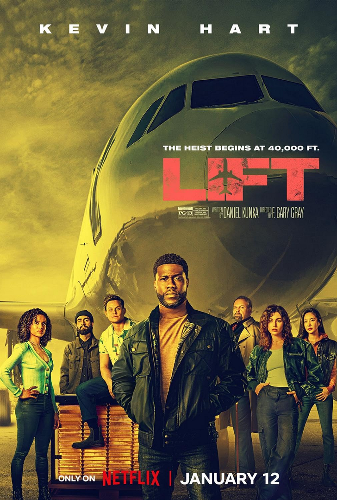
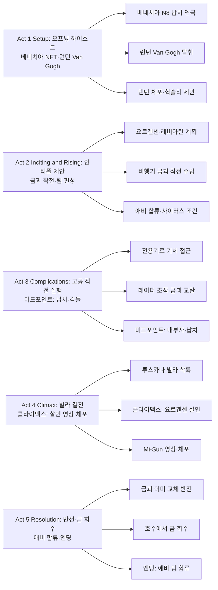

넷플릭스에서 2024년 1월 공개된 《리프트(Lift)》는 케빈 하트가 이끄는 국제 하이스트 팀이 인터폴과 손을 잡고, 상공 12,000m 여객기에서 5억 달러 규모의 금괴를 훔쳐 테러리스트 자금을 차단하는 이야기다. F. 게리 그레이 감독의 《이탈리안 잡》《세트 잇 오프》에 이은 세 번째 하이스트 영화로, 고공 비행기라는 밀폐 공간과 첨단 기술을 활용한 작전이 특징이다. 본문은 개요, Act 5단계 구조, 장면별 전체 내용(스포일러 포함), 캐릭터 분석, 영상미·음악, 종합 평가까지 규칙에 맞춰 정리한다.

## 개요

### 영화 정보
* **제목**: Lift / 리프트 (리프트: 비행기를 털어라)
* **감독**: F. Gary Gray (F. 게리 그레이)
* **각본**: Daniel Kunka (다니엘 쿤카)
* **주연**: Kevin Hart (사이러스), Gugu Mbatha-Raw (애비), Sam Worthington (헉슬리), Vincent D'Onofrio (덴턴), Úrsula Corberó (카밀라), Billy Magnussen (매그너스), Yun Jee Kim (미선), Viveik Kalra (루크), Jacob Batalon (N8), Jean Reno (요르겐센)
* **음악**: Dominic Lewis, Guillaume Roussel
* **촬영**: Bernhard Jasper
* **장르**: 액션, 코미디, 범죄, 스릴러, 드라마
* **상영시간**: 107분 (1h 47m)
* **개봉일**: 2024.01.12 (넷플릭스 전세계)
* **제작사**: HartBeat Productions, Genre Films, 6th & Idaho
* **배급사**: Netflix
* **제작비**: 약 1억 달러
* **평점**: 로튼 토마토 31%, IMDb 5.6/10, 메타크리틱 40/100

### 추천 대상
* **하이스트·오션스 일레븐 팬**: 팀 플레이, 기술 기반 작전, 반전이 있는 구조를 좋아하는 관객
* **케빈 하트·경쾌한 액션 선호자**: 코미디와 액션이 섞인 넷플릭스 킬링타임용 영화를 찾는 관객
* **고공·비행기 액션 매니아**: 40,000ft 상공, 기내·화물칸 액션과 시각 연출을 기대하는 관객

## 구조 분석 (Act 5단계)

## 영화의 전체 내용

《리프트》는 국제 도둑 사이러스 팀이 베네치아·런던에서 NFT·명화 탈취를 성공시키지만 덴턴이 인터폴에 체포되면서, 헉슬리의 제안으로 테러리스트 요르겐센의 금괴를 비행기에서 훔치는 미션에 투입되는 이야기다. 고공에서 전용기를 이용해 레이더를 속이고 기내 금괴를 만지는 작전, 내부자와의 격돌, 투스카나 빌라에서의 결전을 거쳐 마지막에 “금은 이미 바꿔 둔 상태”라는 반전으로 마무리된다. 아래는 Act 단위로 장면 비트 [S01]부터 연속 번호로 서술한 전체 내용이다.

### Act 1 (Setup): 오프닝 하이스트 — 베네치아와 런던

팀 리더 사이러스, 파일럿 카밀라, 해커 미선, 금고털이 매그너스, 엔지니어 루크, 내부자 덴턴이 베네치아에서 NFT 아티스트 N8의 “납치” 연극을 벌이고, 런던에서는 Van Gogh 작품을 탈취한다. 인터폴 요원 애비(사이러스의 전 연인)가 덴턴을 체포하고, 상사 헉슬리가 팀에게 금괴 탈취 미션을 제안한다.

**[S01] 베네치아·경매장 — N8 NFT 전시**: NFT 아티스트 N8의 전시회가 카메라와 보안에 둘러싸인 가운데 열린다. 사이러스 팀은 “유명 작품은 도난 후 가치가 오른다”는 논리로 N8을 노린다.

**[S02] 베네치아·동시 — N8 가짜 납치**: 팀이 N8을 “납치”하는 연극을 펼친다. 소동으로 N8의 NFT 가격이 폭등하고, 팀은 Van Gogh를 블랙마켓에 팔아 번 2천만 달러로 N8 NFT를 사들인다.

**[S03] 런던·갤러리 — Van Gogh 탈취**: 런던에서 Van Gogh 작품 탈취가 동시에 진행된다. 덴턴의 내부 정보와 팀의 역할 분담으로 작전이 성공한다.

**[S04] 베네치아·이후 — N8과 정산**: N8은 “납치” 후 약속된 몫 2천7백만 달러를 받고 팀과 함께 축하한다. N8의 NFT는 8천9백만 달러로 뛰었고, 팀은 두 작전을 통해 자금과 인맥을 확보한다.

**[S05] 인터폴·런던 — 애비의 추적**: 인터폴 요원 애비 글래드웰이 덴턴을 범행에 연루된 인물로 특정하고, 증거를 확보한다.

**[S06] 런던·체포 — 덴턴 구속**: 애비가 덴턴을 체포한다. 사이러스와 애비는 과거 연인 사이였고, 둘 사이에 긴장이 있다.

**[S07] 인터폴 본부 — 헉슬리의 제안**: 애비의 상사 헉슬리 사령관이 팀을 기소 대신 “한 번의 미션”에 투입하려 한다. 목표는 억만장자 라스 요르겐센이 테러 단체 레비아탄에 지급할 5억 달러 상당의 금괴를 빼앗는 것이다.

### Act 2 (Inciting & Rising): 금괴 작전과 팀 편성

요르겐센은 레비아탄과 손잡고 유럽에 대규모 홍수를 일으켜 주가 조작으로 이익을 보려 한다. 금괴는 런던 금고에서 취리히 은행으로 상업 여객기로 이송되며, 법적으로 압수할 수 없어 사이러스 팀이 “비행 중”에 훔쳐야 한다. 사이러스는 면죄와 함께 애비가 팀에 합류할 것을 조건으로 건다.

**[S08] 인터폴·브리핑 — 요르겐센·레비아탄**: 헉슬리가 요르겐센과 레비아탄의 계획을 설명한다. 금괴는 무법적 결제 수단으로 사용될 예정이다.

**[S09] 런던·금고 — 금괴 이송 계획**: 요르겐센 측이 런던 금고에서 취리히 행 상업기로 금괴를 실어 나르는 일정이 공개된다. 팀은 “기체가 공중에 있는 동안”만 접근할 수 있다고 결론한다.

**[S10] 작전 회의 — 고공 하이스트 아이디어**: 전용기를 타깃 여객기 바로 아래로 띄워, 해커 미선이 레이더를 조작해 비행기가 원래 노선을 유지하는 것처럼 보이게 하고, 실제로는 비밀 활주로로 유도하는 안을 세운다.

**[S11] 몰센·전용기 — 장비 확보**: 부유한 미술 수집가 몰센에게 전용기를 빌리기 위해 사이러스가 N8에게 몰센 전용 NFT 작품을 만들어 주기로 약속한다.

**[S12] 팀 편성·애비 합류**: 사이러스는 애비가 작전에 참여해야 한다고 고집한다. 애비는 인터폴 커버와 정보를 제공하는 역할로 팀에 합류한다.

**[S13] 일정 변경 — 요르겐센의 움직임**: 요르겐센이 조직 내 스파이를 제거하고 금괴 이송 일정을 앞당긴다. 팀은 짧아진 시간에 맞춰 준비를 마친다.

### Act 3 (Complications): 고공 작전 실행 — 미드포인트

전용기가 타깃기 아래로 접근하고, 미선이 레이더 스왑을 수행한다. 매그너스가 기내 금고를 열고 금괴를 다루는 사이, 요르겐센 측 내부자가 작전을 방해하고 납치·격돌이 일어난다.

**[S14] 공중·전용기 — 타깃기 접근**: 카밀라가 조종하는 전용기가 금괴를 실은 여객기 바로 아래로 붙어 비행한다. 기내 통신·레이더 조작 준비가 이루어진다.

**[S15] 레이더·해킹 — 미선의 스왑**: 미선이 레이더 신호를 바꿔 지상에서는 여객기가 원래 노선을 비행하는 것처럼 보이게 한다. 드론 등으로 추가 기만이 가해진다.

**[S16] 기내·화물/금고 — 매그너스·금괴**: 매그너스가 기내 금고를 열고 금괴에 접근한다. 영상에서는 잠시 다른 쪽으로 시선이 돌아가며, 이후 반전을 위한 복선이 놓인다.

**[S17] 미드포인트 — 내부자·납치와 격돌**: 요르겐센의 부하들이 기내에서 작전을 간파하고, 전용기와 여객기 모두를 장악하려 든다. 격투와 납치가 벌어지고, 매그너스·애비·사이러스·카밀라 등이 위기에 빠진다.

**[S18] 착륙·유도 — 비밀 활주로**: 납치된 상태로 비행기는 요르겐센이 지정한 비밀 장소(이후 투스카나 빌라 인근)로 유도된다. 매그너스는 도중 탈출하고, 나머지는 금괴와 함께 제트기로 이송된다.

**[S19] NATO·격추 명령**: 금괴가 요르겐센에게 넘어가는 것을 막으려 헉슬리가 NATO에 격추를 요청한다. 항공 관제 연락원 해리가 조종사에게 “인질 탑승” 사실을 알려 격추가 중단되도록 돕는다.

**[S20] 기내·추가 격투**: 팀과 요르겐센 측이 기내에서 다시 격돌하고, 제트기가 요르겐센 빌라 부지에 불시착한다.

### Act 4 (Climax): 투스카나 빌라 — 클라이맥스와 체포

빌라에서 요르겐센이 레비아탄 대표를 살해하고, 경찰과 헉슬리가 도착한다. 팀은 Mi-Sun이 제트기 하부 화면에 올린 요르겐센의 살인 영상으로 그를 체포시키고, 애비는 헉슬리의 격추 결정에 분노해 인터폴을 그만둔다.

**[S21] 빌라·정원 — 착륙과 포위**: 제트기가 요르겐센의 투스카나 빌라에 크래시 랜딩한다. 애비·사이러스·카밀라가 총구에 잡힌다.

**[S22] 빌라 내부 — 레비아탄과 결별**: 요르겐센이 레비아탄 측과 거래가 틀어지자 그 대표를 직접 살해한다. 팀은 그 순간을 목격한다.

**[S23] 클라이맥스 — 경찰 도착·자기방어 주장**: 이탈리아 카라비니에리와 헉슬리가 현장에 도착한다. 요르겐센은 “침입자에 대한 자기방어”라고 주장한다.

**[S24] Mi-Sun·영상 재생**: 미선이 제트기 하부에 장착된 카메라로 녹화된 요르겐센의 살인 장면을 재생해 경찰과 헉슬리에게 보여 준다. 요르겐센은 체포된다.

**[S25] 애비·헉슬리**: 애비는 자신까지 희생하려 한 격추 명령을 알게 되고 헉슬리를 때리며, 인터폴 사임을 선언한다.

### Act 5 (Resolution): 반전 — 금은 이미 훔쳐진 상태

몇 주 후, 사이러스는 애비에게 “금괴는 이미 비행기 위에서 가짜로 바꿔 둔 것”이라고 고백한다. 매그너스가 금고를 연 뒤 진짜 금은 기체 밖으로 빼내 루크가 지상에서 인수했고, 가짜(철괴 도금)만 레비아탄·요르겐센 측에 남겼다. 팀은 산중 호수 등에 숨겨 둔 금을 회수하고, 애비는 사이러스 팀에 합류하며 관계를 재개한다.

**[S26] 수주 후·회수 장소 — 고백**: 사이러스가 애비에게 비행기 위에서 이미 금을 바꿔 뺐다고 말한다. 관객과 애비가 함께 반전을 확인한다.

**[S27] 호수·산중 — 금 회수**: 팀이 호수나 지정 장소에서 빼둔 금괴를 회수한다. 헉슬리에게는 가짜 금괴만 넘기는 형식으로 마무리할 수 있음을 암시한다.

**[S28] 엔딩 — 팀과 애비**: 사이러스와 애비가 다시 연인·파트너로 가까워지고, 애비는 팀의 일원이 되어 다음 작전을 기대하는 톤으로 영화가 끝난다.

## 캐릭터 분석

### 사이러스 웨이테이커(Cyrus Whitaker) / Kevin Hart

**개요**: 국제적으로 이름난 하이스트 리더. 덴턴, 카밀라, 미선, 매그너스, 루크, N8 등 전문 인력과 네트워크를 갖추고 있으며, “도둑이지만 악당을 막는” 쪽에 서서 인터폴과의 거래를 받아들인다.

**성장 곡선**: 오프닝에서는 단순한 “돈 되는” 작전(명화·NFT)을 이끌다가, 헉슬리 제안 이후 “테러 방지”라는 목표와 애비에 대한 감정을 동시에 품고 작전을 수행한다. 최종 반전에서 팀이 처음부터 금을 바꿔 둔 것을 밝히며, 관객과 애비 모두를 속여 온 “슬리이트 오브 핸드” 리더로서의 면모를 보여 준다.

**동기와 욕망**: 팀의 자유(면죄)와 애비와의 재결합 기회. 동시에 “세상을 더 나쁜 놈들로부터 훔치는” 자기 정당화를 추구한다.

**갈등 구조**: 인터폴(헉슬리)과의 신뢰 문제, 요르겐센 측 내부자·무력에 따른 작전 붕괴 위기, 애비와의 과거·현재 감정선이 얽힌다.

**상징적 의미**: “선한 도둑” 클리셰를 2020년대식 팀 하이스트와 OTT 오락성으로 재해석한 캐릭터. 케빈 하트의 코미디 톤과 진지한 리더 역할의 균형이 연기 포인트다.

### 애비 글래드웰(Abby Gladwell) / Gugu Mbatha-Raw

**개요**: 인터폴 요원이자 사이러스의 전 연인. 덴턴 체포를 통해 사이러스 팀과 다시 맞닥뜨리고, 헉슬리의 지시로 팀에 합류해 작전의 “공식 커버”와 정보를 제공한다.

**성장 곡선**: 법과 질서 쪽(인터폴)에 있다가, 헉슬리가 인질이 탄 기체까지 격추하려 한 사실을 알고 조직에 대한 신뢰를 잃는다. 요르겐센 체포 후 인터폴을 떠나 사이러스 팀에 합류하며, “규칙 안”에서 “규칙 밖”으로 이동하는 선택을 한다.

**동기와 욕망**: 처음에는 체포·정의 실현, 이후에는 테러 방지와 사이러스에 대한 미련. 최종적으로는 팀과의 유대와 새로운 정체성(도둑 팀 일원)을 선택한다.

**갈등 구조**: 인터폴 vs. 사이러스, 상사(헉슬리)에 대한 신뢰 붕괴, 자신의 정체성(수사관 vs. 작전 참여자) 갈등.

**상징적 의미**: “법의 편”에서 “도둑 편”으로 넘어가는 전환을 담당해, 영화의 도덕적 회색지대와 로맨스 라인을 동시에 짊어진다. 구구 음바타-로의 액션·감정 연기가 캐릭터를 지탱한다.

### 라스 요르겐센(Lars Jorgensen) / Jean Reno

**개요**: 프랑스·이탈리아계 억만장자 은행가이자 테러리스트 후원자. 레비아탄에게 5억 달러 규모의 금괴를 대가로 유럽 대규모 홍수 공격을 주문해, 주가 조작으로 이익을 얻으려 한다.

**성장 곡선**: 영화 내에서는 이미 “완성된” 악당으로 등장한다. 레비아탄과의 거래가 틀어지자 대표를 직접 살해하고, 경찰 도착 시 “침입자에 대한 자기방어”로 둔갑하려 하나 Mi-Sun의 영상에 의해 체포된다.

**동기와 욕망**: 금융·테러를 통한 막대한 이익, 통제와 폭력에 대한 집착.

**갈등 구조**: 사이러스 팀(금괴 탈취)·레비아탄(거래 파기)·법 집행 기관(체포)과의 대립. 내부 스파이 제거로 일정을 앞당기는 등 전략적 행동을 보인다.

**상징적 의미**: 2000년대형 “부유한 악당” 클리셰를 유지하며, 장르노의 카리스마로 위협감을 채운다. 복선 없이 후반에 비중이 커지는 점은 서사상 한계로 지적되기도 한다.

### 덴턴(Denton) / Vincent D'Onofrio

**개요**: 사이러스 팀의 내부자·변장 전문가. 베네치아·런던 작전에서 정보와 변장으로 팀을 돕다가 애비에게 체포되고, 그를 빌미로 팀 전체가 인터폴 미션에 끌려든다.

**성장 곡선**: 체포→헉슬리와의 거래→팀의 일원으로 금괴 작전 참여. 개인 심화보다는 “팀의 한 칸”으로서 기능하며, 변장·정보 역량이 작전 단계마다 짧게 부각된다.

**동기와 욕망**: 팀의 면죄와 자유, 그리고 다음 작전까지 이어지는 “일하는 도둑”으로서의 정체성.

**갈등 구조**: 인터폴에 잡힌 상태에서 팀을 구하기 위해 미션을 수락한다는 외적 압박. 내적 갈등은 최소한으로 처리된다.

**상징적 의미**: 하이스트 영화의 “전문가 조합” 중 한 명으로, 변장·정보 담당의 전형을 2020년대 팀 구성에 맞게 재현한다.

## 영상미와 음악

### 시각 효과 / 촬영 / 미학

* **공간 활용**: F. 게리 그레이는 《이탈리안 잡》《세트 잇 오프》에서 보여 준 공간 감각을 이어, 베네치아 경매장·런던 인터폴·기내·화물칸·비행기 날개·투스카나 빌라까지 장소별로 압축감과 스케일을 다르게 잡는다. 기내 복도·화물칸 격투는 좁은 공간에서의 카메라 워크와 스틸리캠을 활용한다.
* **색채·조명**: 경매장은 황금빛 웜톤, 인터폴 본부는 청색 톤, 기내·화물칸은 중립 회색과 어두운 조명으로 긴장감을 낸다. 폭발·위기 장면에서는 적색으로 전환되는 구도가 쓰인다. 과거 회상은 세피아 톤으로 현재와 구분된다.
* **세트·VFX**: 실제 A380 축소 세트와 실물에 가까운 기내 세트를 활용했다는 제작 비화가 있으며, 고공 낙하·비행 연출에는 CG가 사용된다. 비평에서는 일부 CG 완성도에 대한 아쉬움도 언급된다.

### 음악감독의 음악

* **Dominic Lewis, Guillaume Roussel**: 액션·하이스트 장면에 맞는 리드미컬한 오케스트라와 전자 사운드가 결합된다. 오프닝 작전부터 고공 격투·빌라 클라이맥스까지 템포와 다이나믹이 장면과 맞춰진다.
* **사운드트랙**: 영화 내 삽입곡으로는 《Edamame》(bbno$, Rich Brian 등) 등이 사용되며, 트레일러·프로모에서도 현대 팝·힙합 톤이 쓰인다.
* **분위기**: 코미디와 액션의 비율에 맞춰 경쾌한 구간과 긴장감 구간이 번갈아 나오며, 엔딩은 팀 회수·로맨스 재결합에 맞는 밝은 톤으로 마무리된다.

## 종합 평가

### 최종 평점: ★★★☆☆ (3.0/5.0)

**장점**:
* 고공 비행기 하이스트라는 공간·시간 제약이 분명한 설정으로, 《이탈리안 잡》식 팀 하이스트와 2020년대 기술(NFT, 레이더 해킹, 드론)을 결합한 오락성이 있다.
* 오프닝 베네치아·런던 이중 작전과 최종 “금은 이미 바꿔 둔 것” 반전으로, 관객 시선을 돌리는 하이스트 영화의 관례를 충실히 따른다.
* 케빈 하트의 리더 역할과 구구 음바타-로의 액션·감정선, 장르노의 악당 연기가 장면마다 안정적인 톤을 준다.
* 넷플릭스 공개 후 다수 국가 TOP 10 진입 등 시청률은 호조였으며, 경쾌한 주말용 액션 코미디로의 위치가 분명하다.

**단점**:
* 캐릭터 심화가 부족하고, 애비·사이러스 과거사, 요르겐센·레비아탄 등장 시점과 동기가 서사적으로 얕다는 비판이 있다.
* 플롯이 예측 가능한 하이스트 공식에 머물며, 《오션스 일레븐》《레드 노티스》 등과 비교해 새로움이 제한적이라는 지적이 있다.
* 일부 고공·CG 연출에서 완성도가 아쉽다는 평가가 있다.

### 한 줄 평

"12,000m 상공에서 벌어지는 오션스 일레븐 — 반전은 있지만, 캐릭터보다 장르 클리셰에 충실한 넷플릭스 하이스트 오락."

### 추천 작품

* 《오션스 일레븐》(2001): 팀 하이스트와 역할 분담, 반전 구조의 교과서.
* 《이탈리안 잡》(2003): F. 게리 그레이 감독, 베네치아·금괴·팀 하이스트.
* 《레드 노티스》(2021): 넷플릭스 대형 액션 코미디, 도둑·요원·반전 구조.

### 관람 전 체크리스트

* **사전 지식이 필요한가?** 필요 없다. 하이스트·인터폴·테러리스트 자금 차단 정도의 배경만 있으면 충분하다.
* **어린이와 함께 볼 수 있는가?** PG-13(미국) 수준. 폭력·언어·일부 연출이 있어 가족 관람 시 등급 확인을 권한다.
* **특정 요소를 기대해도 되는가?** 고공 액션, 팀 플레이, 반전, 케빈 하트 코미디·로맨스 라인을 기대할 만하다.
* **쿠키 영상이 있는가?** 본편 엔딩 후 반드시 확인해야 할 쿠키 영상은 공식적으로 밝혀진 바 없다.
* **속편 가능성은?** 엔딩이 “다음 작전”을 암시하나, 속편 제작 여부는 공식 발표가 없다.

## 참고 문헌 및 출처

- [Lift (2024) — IMDb](https://www.imdb.com/title/tt14371878/)
- [Lift (2024) — Rotten Tomatoes](https://www.rottentomatoes.com/m/lift_2024)
- [Lift (2024 film) — Wikipedia](https://en.wikipedia.org/wiki/Lift_(2024_film))
- [Lift Ending Explained — Netflix Tudum](https://www.netflix.com/tudum/articles/lift-ending-explained)
- [리프트: 비행기를 털어라 — TMDB](https://www.themoviedb.org/movie/955916-lift?language=ko-KR)
