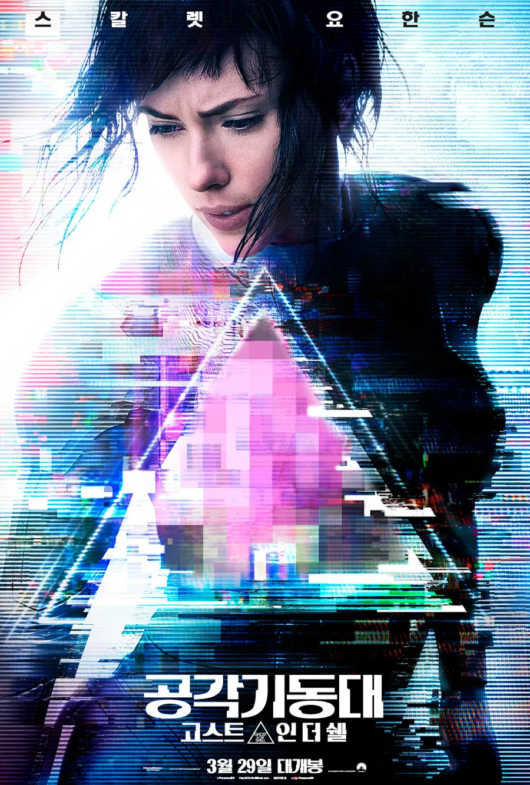
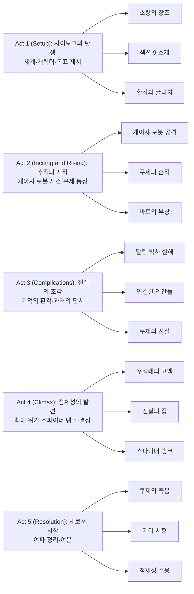

근미래, 인간과 기계의 경계가 희미해진 세상. 사이버 증강이 보편화된 도시에서 완전한 사이보그 신체를 가진 최초의 존재인 소령 미라 킬리안이 섹션 9의 대테러 요원으로 활약한다. 그녀는 반복되는 환각과 조각난 기억에 시달리며, 자신의 과거와 정체성의 진정한 의미를 추적하게 된다. 마사무네 시로의 상징적인 만화와 1995년 애니메이션을 실사화한 이 작품은 화려한 비주얼과 함께 "고스트(영혼)와 셸(몸)", "기억이 나를 정의하는가"라는 철학적 질문을 던진다.

## 개요

### 영화 정보
* **제목**: Ghost in the Shell / 공각기동대
* **감독**: Rupert Sanders (루퍼트 샌더스)
* **각본**: Jamie Moss, William Wheeler, Ehren Kruger
* **원작**: Masamune Shirow(마사무네 시로) 만화 『Ghost in the Shell』
* **주연**:
  - Scarlett Johansson (스칼렛 요한슨) — Major Mira Killian / Motoko Kusanagi
  - Takeshi Kitano (기타노 다케시) — Chief Daisuke Aramaki
  - Michael Pitt (마이클 핏) — Hideo Kuze
  - Pilou Asbæk (필루 아스벡) — Batou
  - Juliette Binoche (줄리엣 비노쉬) — Dr. Ouelet
  - Chin Han (친 한) — Togusa
* **음악**: Clint Mansell, Lorne Balfe
* **촬영**: Jess Hall
* **편집**: Neil Smith, Billy Rich
* **장르**: SF, 액션, 스릴러, 사이버펑크
* **상영시간**: 107분
* **개봉일**: 2017년 3월 16일 (일본 도쿄), 2017년 3월 31일 (미국)
* **제작사**: Paramount Pictures, DreamWorks Pictures, Amblin Partners, Reliance Entertainment
* **배급사**: Paramount Pictures
* **제작비**: 약 1억 1천만 달러
* **흥행**: 전세계 약 3억 7천만 달러
* **평점**: Rotten Tomatoes 43% (평론가) / 51% (관객), IMDb 6.3/10, Metacritic 52/100

### 추천 대상
* **사이버펑크·SF 팬**: 《블레이드 러너》, 《매트릭스》를 좋아하는 관객에게 추천한다.
* **비주얼·VFX 중시 관객**: 홀로그램 미래 도시, 광학 미채, 사이보그 디자인 등 화려한 시각 연출을 즐기고 싶은 사람.
* **원작·애니메이션 팬**: 1995년 《공각기동대》 애니와 만화의 실사화에 관심 있는 팬 (각색·논란에 대한 열린 시각 권장).

## 구조 분석 (Act-first 보조 도식)

```mermaid
flowchart LR
    Act1["Act 1 (Setup): 사이보그의 탄생</br>세계·캐릭터·목표 제시"]
    Act2["Act 2 (Inciting and Rising): 추적의 시작</br>게이샤 로봇 사건·쿠제 등장"]
    Act3["Act 3 (Complications): 진실의 조각</br>기억의 환각·과거의 단서"]
    Act4["Act 4 (Climax): 정체성의 발견</br>최대 위기·스파이더 탱크·결정"]
    Act5["Act 5 (Resolution): 새로운 시작</br>여파·정리·여운"]
    Act1 --> A1["소령의 창조"]
    Act1 --> A2["섹션 9 소개"]
    Act1 --> A3["환각과 글리치"]
    Act2 --> B1["게이샤 로봇 공격"]
    Act2 --> B2["쿠제의 흔적"]
    Act2 --> B3["바토의 부상"]
    Act3 --> C1["달린 박사 살해"]
    Act3 --> C2["연결된 인간들"]
    Act3 --> C3["쿠제의 진실"]
    Act4 --> D1["우엘레의 고백"]
    Act4 --> D2["진실의 집"]
    Act4 --> D3["스파이더 탱크"]
    Act5 --> E1["쿠제의 죽음"]
    Act5 --> E2["커터 처형"]
    Act5 --> E3["정체성 수용"]
```

## 영화의 전체 내용 (스포일러 포함)

이 섹션은 이미 영화를 관람한 관객을 위한 것으로, **전체 스포일러**를 포함합니다.

근미래, 인간의 신체는 사이버 증강 기술로 개선되고 있다. 한카 로보틱스는 인간의 뇌를 인공 신체(shell)에 통합하는 비밀 프로젝트를 진행하며, 테러 공격의 유일한 생존자인 소녀의 뇌를 최초의 완전한 사이보그로 만든다. 그 소녀는 ‘미라 킬리안’이라는 이름으로 섹션 9의 소령이 되지만, 자신의 과거와 기억에 대한 의문에 휩싸이게 된다.

### Act 1 (Setup): 사이보그의 탄생

**[S01] 소령의 창조**: 한카 로보틱스의 우엘레 박사는 사이버 테러 공격으로 중상을 입은 소녀의 뇌를 구출한다. CEO 커터는 우엘레의 반대에도 불구하고 이 소녀를 대테러 요원으로 활용하기로 결정한다. 소녀의 뇌는 완전한 인공 신체에 이식되고, 그녀는 미라 킬리안이라는 새로운 이름을 받는다.

**[S02] 1년 후, 섹션 9**: 킬리안은 소령 계급으로 대테러 부서 섹션 9에서 근무한다. 그녀는 바토, 토구사와 함께 아라마키 국장 휘하에서 일하며, 도시의 위험한 범죄자들을 막는 임무를 수행한다.

**[S03] 환각과 글리치**: 소령은 자신의 과거에 대한 환각을 경험한다. 우엘레 박사는 이를 시스템 글리치로 치부하지만, 소령은 자신의 기억이 불완전하다는 것을 느낀다.

### Act 2 (Inciting & Rising): 추적의 시작

**[S04] 한카 비즈니스 컨퍼런스**: 섹션 9 팀은 한카 로보틱스 행사에서 테러 공격을 막는다. 소령은 로봇 게이샤가 인질을 살해한 후 이를 파괴한다.

**[S05] 쿠제의 흔적**: 게이샤 로봇이 쿠제라는 정체불명의 해커에 의해 조종되었다는 것이 밝혀진다. 소령은 프로토콜을 위반하고 로봇의 AI에 "다이브"하여 정보를 얻으려 한다.

**[S06] 역해킹 시도**: 쿠제는 역해킹을 시도하고, 바토가 소령을 강제로 분리시킨다. 소령의 무모한 행동에 커터는 분노하며 섹션 9를 폐쇄하겠다고 위협한다.

**[S07] 야쿠자 나이트클럽**: 팀은 해커의 흔적을 야쿠자 나이트클럽으로 추적하지만 함정에 빠진다. 폭발로 바토의 눈이 파괴되고 소령의 신체도 손상된다.

### Act 3 (Complications): 진실의 조각

**[S08] 달린 박사 살해**: 쿠제는 섹션 9의 한카 컨설턴트 달린 박사를 추적하여 살해한다. 팀은 그녀의 살인이 다른 한카 고위 연구원들의 죽음과 연결되어 있음을 발견한다.

**[S09] 우엘레 박사 암살 시도**: 쿠제는 두 명의 위생 작업자를 조종하여 우엘레 박사를 살해하려 한다. 사이버 눈을 장착한 바토와 수리된 소령이 이를 막는다.

**[S10] 심문과 자살**: 팀이 조종당한 작업자를 심문하는 동안, 쿠제가 그를 통해 말을 하고 그를 자살하도록 강요한다. 토구사가 해킹의 출처를 비밀 장소로 추적한다.

**[S11] 미드포인트 - 연결된 인간들**: 팀은 대규모로 정신적으로 연결된 인간들을 발견한다. 이들은 즉석 신호 네트워크로 사용되고 있었다. 소령이 포획되고, 쿠제가 자신을 드러낸다. 이야기는 "진실 탐구"로 전환된다.

**[S12] 쿠제의 진실**: 쿠제는 소령과 같은 프로젝트의 실패한 실험체임을 밝힌다. 그는 소령에게 자신의 기억을 의심하고 약물 복용을 중단하라고 촉구한다. 약물이 실제로는 기억을 차단하는 데 사용되고 있었다. 쿠제는 소령을 풀어주고 탈출한다.

### Act 4 (Climax): 정체성의 발견

**[S13] 우엘레의 고백**: 소령은 우엘레 박사를 대면한다. 우엘레는 소령 이전에 98명의 실험체가 사망했으며, 소령의 기억이 모두 이식된 것임을 인정한다.

**[S14] 탈출과 우엘레의 죽음**: 커터는 소령을 제거하기로 결정하고 우엘레에게 소령을 죽이라고 명령한다. 대신 우엘레는 소령에게 주소를 주고 탈출을 돕는다. 커터는 우엘레를 살해하지만 소령에게 책임을 전가한다.

**[S15] 진실의 집**: 소령은 주소지의 아파트를 찾아간다. 그곳에서 한 과부를 만나는데, 그녀는 딸 모토코 쿠사나기가 1년 전 가출했고 체포되었으며, 구금 중 "자살"했다고 말한다.

**[S16] 아라마키의 추적**: 소령은 아라마키에게 연락하고, 아라마키는 커터가 원격으로 그들의 대화를 엿듣도록 허용한다. 커터의 부하들이 섹션 9 팀을 매복 공격하지만, 바토, 토구사, 아라마키가 이를 격퇴한다.

**[S17] 기억의 은신처**: 소령은 자신의 기억을 따라 모토코가 마지막으로 목격된 은신처로 향한다. 그곳에서 쿠제와 재회하고, 둘 다 반증강주의 급진파였으며 한카에 의해 납치되어 실험체가 되었음을 회상한다.

**[S18] 클라이맥스 - 스파이더 탱크**: 커터가 그들을 죽이기 위해 "스파이더 탱크"를 배치한다. 쿠제가 거의 죽을 뻔하자 소령이 탱크의 모터 제어 센터를 찢어내지만 한 팔을 잃는다. 영화의 최고 긴장감이 집중되는 장면이다.

### Act 5 (Resolution): 새로운 시작

**[S19] 쿠제의 죽음**: 치명상을 입은 쿠제는 소령에게 함께 이 세상을 떠나자고 요청하지만, 소령은 거절한다. 소령은 쿠제에게 그가 항상 자신의 고스트 안에 함께 할 것이라고 말한다. 한카 저격수가 쿠제를 사살한다.

**[S20] 커터의 처형**: 바토와 팀이 소령을 구출한다. 아라마키는 소령의 동의 하에 커터를 처형한다.

**[S21] 엔딩 - 진정한 정체성**: 다음 날, 수리된 소령은 일본인 모토코로서의 진정한 정체성을 받아들인다. 그녀는 어머니와 재회하고 섹션 9로 복귀한다.

## 캐릭터 분석

### Major Mira Killian / Motoko Kusanagi (Scarlett Johansson)

**개요**: 영화의 주인공으로, 인간의 뇌를 가진 최초의 완전한 사이보그. 한카 로보틱스가 사이버 테러 공격의 생존자로 소개한 소녀의 뇌를 이용해 만든 대테러 요원이다. 섹션 9에서 국장 아라마키, 동료 바토·토구사와 함께 위험한 적과 맞선다.

**성장 곡선**: 소령은 영화 초반 자신의 정체성에 의문을 품지 않는 완벽한 병기로 시작한다. 반복되는 환각과 기억의 조각을 통해 점차 자신의 과거를 의심하기 시작하고, 쿠제와의 만남은 그녀에게 진실을 깨닫는 전환점이 된다. 최종적으로 자신이 일본인 반정부 활동가 모토코 쿠사나기였음을 받아들이며, 주어진 정체성에서 진정한 자아를 찾아가는 과정을 완성한다.

**동기와 욕망**: 처음에는 한카와 섹션 9에 충성하며 범죄자를 막는 것이 목표였지만, 점차 자신의 진실한 과거를 알고 싶어한다. "나는 누구인가?", "왜 만들어졌는가?"에 대한 답을 찾는 것이 그녀의 핵심 동기가 된다.

**갈등 구조**:
- **내적 갈등**: 주어진 기억과 반복되는 환각 사이의 괴리, 자신이 인간인지 기계인지에 대한 정체성 혼란.
- **외적 갈등**: 한카 로보틱스와 커터의 통제, 쿠제를 추적하면서 마주하는 진실, 자신을 제거하려는 조직과의 전투.

**상징적 의미**: 소령은 기술 시대의 인간성에 대한 은유다. 완전히 인공적인 신체를 가졌지만 인간의 영혼(고스트)을 간직한 그녀는 육체와 정신, 기계와 인간, 주어진 정체성과 진정한 자아 사이의 경계를 탐구한다.

**배우 연기**: 스칼렛 요한슨은 감정을 절제하면서도 깊이 있는 연기를 보여준다. 사이보그의 무감정함과 인간적인 혼란을 동시에 표현하며, 액션에서는 강인함을, 진실을 마주하는 장면에서는 취약함을 잘 드러낸다.

### Chief Daisuke Aramaki (Takeshi Kitano)

**개요**: 섹션 9의 설립자이자 리더. 가장 위험한 기술적 위협으로부터 세계를 보호하는 엘리트 부대를 이끈다. 소령을 한 명의 인간으로 대하며, 커터의 압력에서도 그녀를 지키려 한다.

**성장 곡선**: 아라마키는 영화 내내 흔들림 없는 리더이자 소령의 보호자 역할을 한다. 처음부터 소령의 가치를 인정하고, 클라이맥스에서는 소령의 동의 하에 직접 커터를 처형함으로써 정의를 실현한다.

**동기와 욕망**: 팀의 안전과 정의 실현. 소령을 도구가 아닌 인간으로 대하며, 그녀가 진실을 찾도록 돕는 것.

**갈등 구조**: 한카와의 계약 관계와 내부 정의감 사이의 긴장. 커터의 협박에도 섹션 9와 소령을 지키려 한다.

**상징적 의미**: 부패한 기업 권력에 맞서는 인간적 도덕성과 충성심을 상징한다. 기타노 다케시의 최소한의 대사와 카리스마는 원작에 대한 경의를 담는다.

### Hideo Kuze (Michael Pitt)

**개요**: 영화의 주요 적대자이자 비극적 인물. 소령과 같은 한카의 실험 프로젝트에서 탄생한 실패한 피험자로, 여러 신체에 분산된 형태로 존재하며 한카의 범죄를 폭로하려 한다.

**성장 곡선**: 쿠제는 처음에는 신비로운 사이버 테러리스트로만 등장하지만, 점차 그의 동기가 복수가 아닌 진실 폭로와 소령의 각성임이 드러난다. 한카의 과학자들을 제거하면서도 소령에게 기억을 의심하라고 경고한다.

**동기와 욕망**: 한카 로보틱스에 대한 복수와 소령이 진실을 알도록 돕는 것. 소령과 함께했던 반증강주의 활동가로서의 과거를 되찾고 싶어한다.

**갈등 구조**: 한카에 의해 만들어진 괴물이 되었지만 인간성을 잃지 않으려는 내적 갈등, 소령을 깨우치면서도 그녀와 대립해야 하는 외적 갈등.

**상징적 의미**: 기업의 무분별한 실험이 만들어낸 비극을 상징한다. 소령의 "또 다른 가능성"—진실을 받아들이지 못했을 때의 모습—을 보여주는 거울이기도 하다.

### Batou (Pilou Asbæk)

**개요**: 섹션 9의 요원이자 소령의 가장 가까운 동료. 사이버 증강을 받았지만 대부분 인간의 신체를 유지하고 있으며, 소령의 든든한 지원자이자 인간성의 닻 역할을 한다.

**성장 곡선**: 게이샤 로봇 사건에서 눈을 잃은 후 사이버 눈을 장착하면서 인간과 기계의 경계를 더 가깝게 경험한다. 소령이 무모한 행동을 할 때마다 그녀를 구하고, 끝까지 그녀를 신뢰한다.

**동기와 욕망**: 팀과 소령의 안전. 소령이 "병기"가 아닌 동료로 남도록 돕는 것.

**갈등 구조**: 규칙 준수와 소령에 대한 충성 사이의 긴장. 역해킹 시 그녀를 강제로 분리시키는 등 팀을 지키기 위한 선택을 한다.

**상징적 의미**: 증강된 인간성을 대표한다. 기술을 받아들이면서도 인간적 감정과 유대를 잃지 않는 인물이다.

### Dr. Ouelet (Juliette Binoche)

**개요**: 소령을 만든 한카 로보틱스의 수석 과학자. 소령을 자신의 창조물이자 딸처럼 여기며, 98명의 실패한 실험체 이후 유일한 "성공"인 소령에 대한 죄책감과 애정을 품는다.

**성장 곡선**: 처음에는 한카의 프로젝트에 충실한 과학자로 보이지만, 점차 소령에 대한 애정과 윤리적 죄책감이 드러난다. 커터의 명령을 거역하고 소령에게 탈출 경로를 알려주며, 자신은 커터에게 살해당한다.

**동기와 욕망**: 과학적 성취와 소령의 안전. 그녀의 창조물이 단순한 병기가 아닌 한 명의 인간임을 인정하는 것.

**갈등 구조**: 한카·커터에 대한 복종과 소령에 대한 모성적 보호 본능 사이의 갈등. 최종적으로 소령을 선택한다.

**상징적 의미**: 과학의 양면성을 상징한다. 생명을 구하려는 선한 의도로 시작했지만 윤리적 경계를 넘었고, 최종적으로는 속죄로 자신의 죄를 인정한다.

### Cutter (Peter Ferdinando)

**개요**: 한카 로보틱스의 CEO. 소령을 병기로만 보며 그녀의 인간성을 인정하지 않는다. 기업 이익을 위해 인간을 실험 대상으로 사용하는 비윤리적 결정을 내린다.

**동기와 욕망**: 한카의 프로젝트 성공과 대테러 병기의 활용. 진실이 드러날 위험이 커지자 소령과 우엘레를 제거하려 한다.

**상징적 의미**: 인간을 도구로만 보는 냉혹한 기업 권력을 상징한다. 기술 발전의 어두운 면—이윤을 위해 인간성을 희생하는 모습—을 보여준다.

## 영상미와 음악

### 시각 효과 / 촬영 / 미학

`Ghost in the Shell` (2017)은 시각적으로 압도적인 사이버펑크 미학을 구현한다. 촬영감독 Jess Hall은 홍콩의 빽빽한 건물들을 배경으로 거대한 홀로그램 광고판으로 장식된 미래 도시를 창조한다. 색감은 차가운 청색·보라색 톤이 지배적이며, 기술적이고 비인간적인 세계감을 강조한다.

**주요 시각적 특징**:
- **홀로그램 도시**: 거대한 3D 홀로그램 광고가 도시를 뒤덮으며, 《블레이드 러너》를 연상시키는 네온 조명의 미래상을 제시한다.
- **광학 미채 (Thermoptic Camouflage)**: 소령의 투명화 슈트는 물결치는 시각 효과로 표현되며, 영화의 가장 상징적인 비주얼 중 하나다.
- **사이보그 신체**: 소령의 창조 장면은 순백의 인공 신체가 단계적으로 조립되는 과정을 보여주며, 아름답고도 불안한 이미지를 만든다.
- **뇌 다이빙**: 소령이 AI나 다른 사람의 정신에 접속할 때의 시각적 표현은 추상적이고 몽환적이다.
- **스파이더 탱크**: 최종 전투의 거대한 기계 거미는 압도적인 규모와 세밀한 CG로 구현되었다.

**미장센**: 프로덕션 디자이너 Jan Roelfs는 미래적이면서도 낯익은 도시 환경을 창조한다. 홍콩 야우마테이·조던 지역의 실제 촬영과 뉴질랜드 웰링턴 세트 촬영을 결합해 설득력 있는 미래 도시를 만든다. 원작 애니메이션의 상징적 장면(소령이 건물에서 뛰어내리는 장면, 게이샤 로봇의 얼굴이 열리는 장면 등)이 실사로 재현된다.

**VFX**: 최첨단 시각 효과로 원작의 아이콘을 충실히 옮겼다. HPA 어워드 컬러 그레이딩 부문 수상 작품이다.

### 음악감독의 음악

**Clint Mansell**과 **Lorne Balfe**의 음악은 영화의 분위기를 결정짓는 핵심 요소다.

**음악 스타일**: 전자음악과 오케스트라를 결합한 하이브리드 스코어. 신시사이저와 현악기가 조화를 이루며 미래적이면서도 감성적인 사운드를 만든다.

**주요 테마**:
- **메인 테마**: 원작 애니메이션 川井憲次(Kenji Kawai)의 상징적 코러스 곡 "Making of a Cyborg"를 오마주하며, 일본 전통 음악 요소를 현대적으로 재해석한다.
- **액션 테마**: 강렬한 전자 비트와 드럼이 특징이며, 긴장감 넘치는 추격·전투 장면을 뒷받침한다.
- **감성 테마**: 소령이 자신의 과거를 회상하는 장면에서는 섬세한 피아노와 현악이 사용되어 인간적 감정을 표현한다.

**사운드 디자인**: 소령의 인공 신체 움직임, 홀로그램의 전자음, 사이버 접속 시의 디지털 사운드 등이 세밀하게 디자인되어 미래 세계를 실감나게 만든다. 영화의 철학적 질문(정체성, 기억)을 강조하는 내성적·명상적 구간과 액션 구간의 대비가 뚜렷하다.

## 종합 평가

### 최종 평점: ★★★☆☆ (3.0/5.0)

**장점**:
- **탁월한 비주얼**: 사이버펑크 미학을 완벽히 구현한 화려하고 세밀한 미래 도시·사이보그 디자인.
- **스칼렛 요한슨의 연기**: 사이보그의 무감정함과 인간적 혼란을 동시에 표현한 설득력 있는 연기.
- **원작에 대한 헌사**: 1995년 애니메이션의 상징적 장면들을 충실히 재현한 오마주.
- **철학적 주제**: 정체성, 의식, 기억, 인간성에 대한 질문을 제기하여 단순 액션을 넘어선다.
- **음악과 사운드**: 몰입도 높은 스코어와 정교한 사운드 디자인.

**단점**:
- **단순화된 줄거리**: 원작의 복잡한 철학적 논의가 과도하게 단순화되어 깊이가 부족하다.
- **캐릭터 개발 부족**: 주인공 외 대부분의 캐릭터가 평면적이며 깊이 있게 탐구되지 않는다.
- **예측 가능한 전개**: 정체성 발견의 여정이 다소 뻔하고 놀라움이 적다.
- **화이트워싱 논란**: 일본 캐릭터를 백인 배우가 연기한 것에 대한 비판이 지속되었다.
- **페이싱**: 중반부가 다소 느리게 진행되며 긴장감이 떨어지는 순간이 있다.

### 한 줄 평

"시각적으로 압도적이지만 철학적 깊이는 표면에 머무른, 아름다운 껍데기(Shell)."

### 추천 작품

- **《블레이드 러너 2049》(2017)**: 비슷한 시기 사이버펑크 걸작. 인간성과 정체성에 대한 더 깊은 탐구를 원한다면 추천.
- **《공각기동대》(1995)**: 본작의 원작 애니메이션. 철학적으로 훨씬 더 깊이 있는 탐구를 제공한다.
- **《엑스 마키나》(2014)**: AI와 의식에 대한 사려 깊은 SF 스릴러.
- **《매트릭스》(1999)**: 현실과 정체성에 대한 질문을 다룬 혁신적 SF 액션.
- **《알리타: 배틀 엔젤》(2019)**: 일본 만화 실사화, 사이보그 소녀의 정체성 탐구.

### 관람 전 체크리스트

- **사전 지식이 필요한가?** 아니오. 독립된 이야기로 이해 가능하다. 다만 1995년 애니메이션을 먼저 보면 원작과의 차이를 비교하는 재미가 있다.
- **어린이와 함께 볼 수 있는가?** 부분적. PG-13 등급으로 폭력·선정적 요소(투명화 슈트)가 있어 12–13세 이상 권장.
- **특정 요소를 기대해도 되는가?** 화려한 비주얼과 액션은 기대해도 좋다. 원작 수준의 철학적 깊이는 기대하지 않는 것이 좋다.
- **쿠키 영상이 있는가?** 없음.
- **속편 가능성은?** 낮음. 흥행·평가가 기대에 미치지 못해 속편 제작 가능성은 거의 없다.

## 결론

`Ghost in the Shell` (2017)은 시각적 완성도와 철학적 야심 사이에서 갈등하는 영화다. 루퍼트 샌더스 감독은 원작 만화와 애니메이션의 상징적 이미지들을 실사로 구현하는 데 성공했으며, 사이버펑크 미학의 정수를 보여준다. 스칼렛 요한슨은 감정을 절제하면서도 설득력 있는 연기로 소령에 생명을 불어넣는다.

영화는 "나는 누구인가?", "기억이 나를 정의하는가?", "육체가 없어도 인간일 수 있는가?"라는 질문을 제기하지만, 이 질문들은 깊이 있게 탐구되기보다 액션과 시각 효과에 묻힌다. 원작의 복잡한 철학적 논의는 할리우드 블록버스터 공식에 맞춰 단순화되며, 그 과정에서 많은 것이 빠진다. 그럼에도 사이버펑크·SF 팬에게는 홀로그램 도시, 정교한 사이보그 디자인, 몰입도 높은 음악이 시각적 향연을 선사한다. 화이트워싱 논란은 영화가 짊어져야 할 또 다른 부담이었으며, 스토리 내에서 "실제로는 일본인이었다"는 반전으로 다루려 한 시도는 오히려 논란을 키웠다. 최종적으로 《공각기동대》 (2017)는 아름답지만 불완전한 실사화다. 원작 팬은 실망할 수 있으나, 비주얼과 정체성 테마를 좋아하는 관객은 여전히 즐길 요소를 찾을 수 있다.

## 참고 문헌 및 출처

- [Ghost in the Shell (2017 film) — Wikipedia](https://en.wikipedia.org/wiki/Ghost_in_the_Shell_(2017_film))
- [Ghost in the Shell (2017) — IMDb](https://www.imdb.com/title/tt1219827/)
- [Ghost in the Shell (2017) — Rotten Tomatoes](https://www.rottentomatoes.com/m/ghost_in_the_shell_2017)
