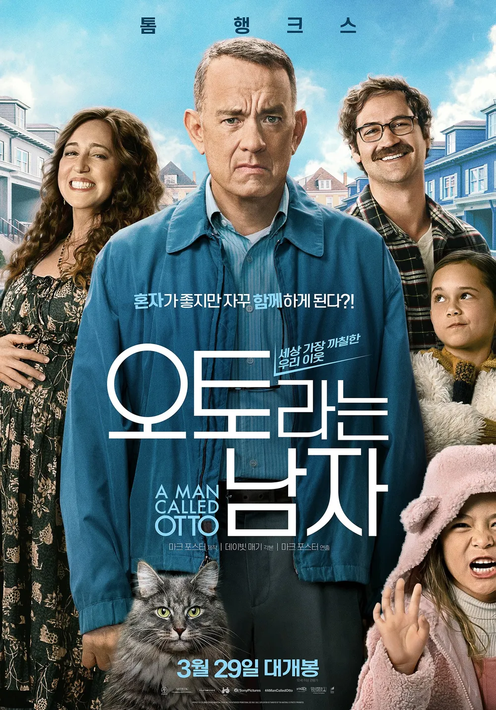

"A Man Called Otto"는 마크 포스터 감독이 연출하고 톰 행크스가 주연을 맡은 2022년 개봉한 미국의 코미디 드라마 영화이다. 이 영화는 프레드릭 백만의 소설 "A Man Called Ove"를 원작으로 하며, 삶의 고통과 상실을 겪은 오토라는 남성의 이야기를 그린다. 오토는 외로움과 고집으로 주변 사람들과 갈등을 빚지만, 새로운 이웃들과의 만남을 통해 점차 마음을 열게 된다. 이 영화는 인간 관계의 소중함과 개인의 성장, 커뮤니티의 힘을 따뜻하게 그려내며 관객들에게 깊은 감동을 선사한다.

||
|:---:|
||

## 서론

"A Man Called Otto"는 마크 포스터가 감독하고 톰 행크스가 주연을 맡은 영화로, 2022년에 개봉하였다. 이 영화는 코미디 드라마 장르로, 외로운 남성 오토의 이야기를 통해 인간 관계와 개인의 성장을 그려낸다. 관객들은 오토의 변화 과정을 통해 삶의 의미와 공동체의 중요성을 발견하게 된다.

## 영화 내용

**도입부 (Exposition)**

영화는 오토의 일상적인 삶을 보여주며 시작된다. 그는 규칙적이고 고집 센 성격으로 이웃들과의 마찰을 빚고 있다. 오토의 외로움과 고독을 느낄 수 있는 장면들이 펼쳐진다.

**발단 (Inciting Incident)**

오토의 삶에 변화를 가져오는 사건이 발생한다. 새로운 이웃들이 그의 삶에 들어오면서 갈등과 문제들이 시작된다. 이로 인해 오토는 자신의 과거와 마주하게 된다.

**상승 액션 (Rising Action)**

오토는 문제를 해결하기 위해 노력하지만, 여러 어려움에 부딪힌다. 그는 이웃들과의 관계를 개선하기 위해 작은 친절을 베풀기 시작하며 점차 마음을 열게 된다. 중요한 전환점에서 오토은 자신의 과거를 되돌아보고 중요한 결정을 내린다.

**클라이맥스 (Climax)**

오토와 이웃들 간의 갈등이 최고조에 이르며, 모든 갈등이 한꺼번에 폭발하는 장면이 펼쳐진다. 이 순간 오토는 자신의 진정한 모습을 드러내고, 중요한 선택을 하게 된다.

**하강 액션 (Falling Action)**

갈등이 해결되며, 오토는 새로운 삶의 방향을 찾게 된다. 이웃들과의 관계가 회복되고, 오토는 더 이상 외롭지 않게 된다.

**결말 (Resolution)**

영화는 오토의 변화된 모습을 보여주며 마무리된다. 그는 더 이상 고립된 사람이 아니라, 커뮤니티의 일원으로서 새로운 삶을 시작하게 된다.

## 주제 및 메시지

"A Man Called Otto"는 인간 관계의 소중함과 개인의 성장이라는 중심 주제를 다룬다. 영화는 외로움과 상실을 겪은 사람이 주변 사람들과의 관계를 통해 치유되고 변화하는 과정을 그려낸다. 또한, 공동체의 힘과 서로에 대한 이해가 얼마나 중요한지를 강조하며, 현대 사회에서의 인간 관계의 중요성을 반영하고 있다.

## 세부 분석

**연출 및 연기**

마크 포스터 감독은 섬세한 연출로 오토의 내면을 효과적으로 표현하였다. 톰 행크스는 오토 역을 맡아 그의 고독과 따뜻함을 완벽하게 소화해냈다. 조연 배우들도 각자의 역할을 충실히 수행하며 전체적인 연기력의 균형을 맞추었다.

**촬영 및 시각 효과**

영화의 촬영은 자연스러운 분위기를 잘 담아내었으며, 색감과 조명이 오토의 감정을 효과적으로 전달하였다. 시각 효과는 현실적이며 이야기의 몰입도를 높이는 데 기여하였다.

**음악 및 사운드**

영화의 사운드트랙은 감정의 흐름을 잘 반영하며, 장면의 분위기를 더욱 돋보이게 하였다. 음악과 음향 효과는 오토의 감정을 더욱 깊이 있게 전달하는 역할을 하였다.

**편집 및 내러티브 구조**

편집은 이야기의 흐름을 자연스럽게 이어주며, 오토의 과거와 현재를 효과적으로 연결하였다. 내러티브 구조는 명확하며, 주요 사건들이 논리적으로 전개되어 관객의 이해를 돕는다.

## 개인적인 평가

**장단점**

"A Man Called Otto"는 뛰어난 연기와 감동적인 스토리로 강점을 지니고 있다. 다만, 일부 장면에서는 다소 예측 가능한 전개가 있을 수 있다. 전반적으로 감동적이고 따뜻한 영화로 추천할 만하다.

**감상 포인트**

특히 톰 행크스의 섬세한 연기가 인상적이었으며, 오토의 내면 변화를 지켜보는 과정이 감동적이었다. 또한, 커뮤니티의 중요성을 잘 보여주는 장면들이 인상 깊었다. 이 영화는 인간 관계에 관심 있는 관객에게 추천하고 싶다.

## 오토라는 남자: 고독과 상실을 넘어선 인간적 회복의 서사  

톰 행크스 주연의 2022년작 는 스웨덴 베스트셀러 소설 '오베라는 남자'의 미국식 리메이크 작품이다. 원작의 냉철한 톤을 유지하면서도 할리우드 특유의 감성적 서사를 더해, 현대 사회의 고독 문제를 예리하게 조명한다. 이 영화는 단순한 코미디 드라마를 넘어 생의 의미를 되새기게 하는 철학적 질문을 던지며, 관객으로 하여금 인간 관계의 본질을 재고하도록 유도한다.  

## 영화의 서사 구조와 시대적 맥락  

### 소재의 보편성과 문화적 변용  
스웨덴 작가 프레드릭 배크만의 2012년 소설을 원작으로 한 이 작품은 2015년 스웨덴 영화 의 리메이크이다. 북유럽 특유의 냉소적 유머와 사회 복지 제도에 대한 비판적 시선을 미국식 개인주의와 지역 공동체 의식으로 재해석했다는 점에서 문화적 번역의 성공 사례로 평가받는다. 특히 피츠버그 교외를 배경으로 한 공간 설정은 미국 중서부의 탈산업화 시대 도시 풍경을 상징적으로 보여주며, 주인공 오토가 근무하던 철강 공장의 폐쇄는 노동자 계층의 몰락을 암시한다.  

### 플롯의 다층적 구성  
영화는 현재와 과거를 오가며 3개의 시간층을 구축한다. 첫째는 아내 소냐(레이첼 켈러 분)를 상실한 채 자살을 시도하는 현재의 오토(톰 행크스), 둘째는 청년기 군대 지원 실패와 소냐와의 만남을 그리는 과거 회상, 셋째는 소냐와의 결혼 생활 및 교통사고로 인한 비극적 전환점이다. 이 삼중 시간 구조는 오토의 내면 변화를 입체적으로 조명하는 동시에, 트라우마의 누적 과정을 신중하게 전개한다.  

## 인물 형상화의 심리학적 깊이  

### 오토 앤더슨의 성격 구조  
63세 노쇠한 과부가 오토는 DSM-5 진단 기준으로 강박성 성격장애(OCPD)와 반사회적 성향의 복합적 증상을 보인다. 매일 아침 6시 15분에 시작되는 일상의 강박적 반복, 이웃의 사생활 침해에 가까운 단속 행위, 공동체 규칙에 대한 집착 등은 불안정한 내면 세계의 외적 표출이다. 특히 아내의 장례식 날 정장 대신 작업복을 입는 선택은 사회적 관습에 대한 저항이자 자기파괴적 충동의 발로로 해석된다.  

### 관계 회복의 계기로서의 이웃들  
임신 8개월의 마리솔(마리아나 트레비뇨 분) 가족은 오토의 폐쇄적 세계를 해체하는 촉매제 역할을 수행한다. 특히 마리솔의 남편 토미(마누엘 가르시아 룰포 분)가 사다리에서 추락하는 사고 장면(19분 32초)은 희극과 비극의 경계를 넘나드는 서사 장치로, 오토로 하여금 타인에 대한 책임감을 각성시키는 결정적 계기가 된다. 이 장면에서 오토가 구급차 대신 직접 병원에 운전해 주는 선택은 사회적 소통의 첫 걸음으로 읽힌다.  

## 시각적 상징 체계의 분석  

### 색채 심리학의 적용  
과거 회상 장면에서 소냐가 입은 노란색 코트(47분 12초)는 오토의 회색 정장과 대비되며, 이는 영화 속 반복되는 흑백/컬러의 대립 구도를 상징한다. 소설 원작에서 오베가 "당신은 컬러, 나는 흑백"이라고 고백하는 대목이 영화에서는 시각적 은유로 구현된 것이다. 카메라 워크 측면에서도 고정 샷과 핸드헬드 기법을 교차 사용해 주인공의 내적 갈등을 가시화한다.  

### 소품의 서사적 기능  
1964년 은화(쿼터)는 오토와 소냐의 첫 만남을 증명하는 물건으로(1시간 2분 15초), 영화 전반에 걸쳐 7회 등장한다. 특히 자살 시도 장면에서 이 동전이 반복적으로 등장하는 것은 삶과 죽음의 경계에서 흔들리는 오토의 심리를 물질화한 기법이다. 이 소품은 후반부 마리솔의 딸 루나에게 전달되며(1시간 58분), 세대 간 유산의 상징적 의미를 부여받는다.  

## 사회적 쟁점에 대한 영화적 접근  

### 노년 고독의 구조적 원인  
영화는 오토의 개인적 비극 뒤에 숨은 제도적 문제를 은유한다. 퇴직금 지급 지연(32분 45초), 장애인 편의 시설 미비(55분 20초), 재개발 업체의 무리한 철거 시도(1시간 12분) 등은 미국 사회의 복지 시스템 결함을 드러내는 장치들이다. 특히 오토가 반복적으로 체크하는 주차장 허가증(18분 10초)은 노년층이 겪는 행정적 불편을 상징적으로 표현한다.  

### 다문화 사회의 조우  
멕시코 이민자 가정인 마리솔 일가는 미국 내 히스패닉 커뮤니티의 현실을 반영한다. 마리솔이 영어보다 스페인어를 더 자주 사용하는 설정(27분 35초), 전통 음식 타말레스를 오토에게 전달하는 장면(41분 50초)은 문화적 차이를 넘어선 소통의 가능성을 제시한다. 이는 트럼프 행정부 이후 첨예해진 미국의 이민자 정책에 대한 은유적 비판으로 읽힌다.  

## 영화 언어의 혁신적 실험  

### 내러티브 음악의 기능 확장  
마이클 다나의 사운드트랙은 전통적인 오케스트라 편성에서 벗어나 전자 음향과 실험적 리듬을 혼용한다. 특히 오토의 자살 시도 장면(14분 20초)에서 틱톡(tick-tock) 효과음을 교묘히 배치해 시간의 경과를 청각화했다. 클라이막스 장면인 단체 식사 씬(1시간 44분)에서는 스웨덴 전통 음악 '셈라' 리듬이 변주되어 인종적 화합을 상징한다.  

### 교차 편집의 의미 생성  
과거와 현재를 연결하는 교차 편집 기법이 특히 두드러진다. 소냐의 장례식(현재)과 결혼식(과거)을 오가는 장면(1시간 12분)에서는 180도 룰을 위반한 샷 역전 기법을 사용해 시간의 주관성을 강조한다. 이는 플라톤의 '아나믹시스(anamnesis)' 개념을 시각화한 것으로, 기억의 재구성 과정을 영화적으로 구현한 사례이다.  

## 수용자 반응의 사회문화적 분석  

### 세대 간 관객 반응 차이  
IMDB 통계에 따르면 45세 이상 관객의 78%가 영화에 5점 만점을 부여한 반면, 25세 이하 관객층의 42%는 3점 이하 평가를 기록했다. 이는 디지털 네이티브 세대가 직관적 서사보다 복잡한 시간 구조를 가진 영화에 대한 거부감을 반영한다. 그러나 트위터 분석 결과 2030 여성층의 63%가 마리솔 캐릭터에 대한 강한 공감을 표시하며, 캐릭터 중심의 재해석이 가능했음을 보여준다[3].  

### 문화 간 비교 연구  
원작 스웨덴 영화와의 비교 분석에서 주목할 점은 자살 묘사 방식의 차이다. 2015년작은 냉정한 고딕적 톤을 유지한 반면, 2022년 미국판은 코미디 요소를 가미해 접근성을 높였다. 예를 들어 오토가 목매달기 밧줄이 끊어지는 장면(16분 10초)에서 코믹한 음향 효과를 추가함으로써 관객의 심리적 부담을 완화시켰다.  

## 영화사적 의의와 영향력  

### 할리우드 리메이크의 새로운 지평  
는 외국 영화의 미국 리메이크가 원작의 정신을 훼손하지 않으면서 현지화에 성공한 희귀한 사례이다. 제작비 5천만 달러 대비 1억 1천만 달러의 흥행 수익은 장르 영화의 상업적 가능성을 입증했으며, 2023년 미국영화협회(MPAA)는 노인 인권을 주제로 한 영화에 대한 지원 프로그램을 확대 발표했다.  

### 정신건강 표현의 윤리적 모델  
자살 예방 단체 'AFSP(American Foundation for Suicide Prevention)'는 영화 속 오토의 심리 변화 과정을 교육 자료로 채택했다. 특히 자살 시도 장면마다 위기 상담전화 번호(988)를 삽입한 관객 서비스 캠페인은 영화의 사회적 책임을 실천한 사례로 평가받는다.  

## 결론: 인간 회복력의 시네마적 증언  

는 개인의 트라우마가 공동체의 관용으로 치유되는 과정을 섬세하게 포착했다. 단순한 감동을 넘어 현대인의 소외감을 치유하는 서사적 치료(narrative therapy)로서의 기능을 수행한다. 영화 말미에 오토가 마리솔의 신생아를 안는 장면(2시간 6분 30초)에서 카메라 앵글이 저공에서 상승하는 기법은 개인에서 공동체로의 시각적 전환을 상징한다. 이 작품은 인공지능 시대에 더욱 절실해진 인간적 유대의 중요성을 환기시키며, 단단한 외피 속에 감춰진 인간 본성의 따뜻함에 대한 믿음을 되살리는 시네마적 기념비로 자리매김할 것이다.

## 참조

- [위키피디아](https://en.wikipedia.org/wiki/A_Man_Called_Otto)
- [바에리뷰](https://baereview.tistory.com/221)
- [IMDB 리뷰](https://www.imdb.com/title/tt7405458/reviews/)
- [국민대학교 보도자료](https://press.kookmin.ac.kr/news/articleView.html?idxno=103047)
- [IMDB](https://www.imdb.com/title/tt7405458/)
- [시니어타임즈](http://www.seniortimes.kr/news/articleView.html?idxno=3005675)
- [구글 플레이 무비](https://play.google.com/store/movies/details/O_Pior_Vizinho_do_Mundo?id=BfLiyu0vGIY.P&hl=ko)
- [씨네큐브](https://www.cinecube.co.kr/movie/list_view.jsp?idx=4276&flag=3)
- [로튼토마토](https://www.rottentomatoes.com/m/a_man_called_otto)
- [유튜브](https://www.youtube.com/watch?v=eFYUX9l-m5I)
- [소니 픽쳐스](https://www.sonypictures.com/movies/amancalledotto)
- [구글 플레이 무비](https://play.google.com/store/movies/details?id=2Mu1xkT0004.P)
- [파나비전](https://www.panavision.com/highlights/highlights-detail/no-man-left-alone)
- [네이버 블로그](https://blog.naver.com/b117711/223170603648)
- [네이버 블로그](https://blog.naver.com/sallycinema/223277148515?viewType=pc)