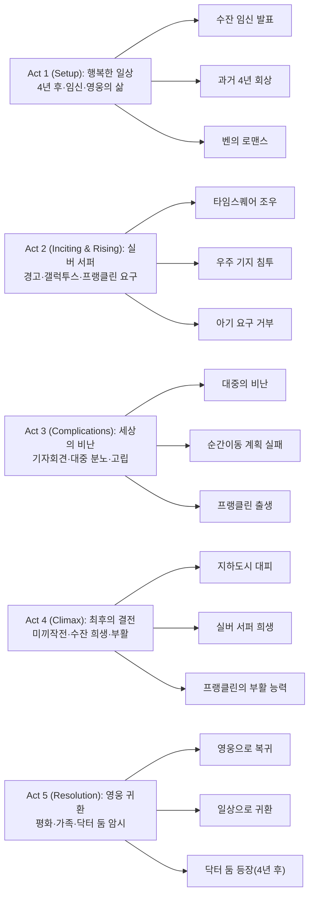

마블 시네마틱 유니버스(MCU)가 새로운 시대를 여는 문을 활짝 열었다. 2025년 7월, 페이즈 6의 포문을 여는 《판타스틱 4: 새로운 출발》(The Fantastic Four: First Steps)은 단순한 슈퍼히어로 영화가 아닌, 마블 코믹스의 '첫 가족'을 MCU에 정식으로 편입시키는 역사적인 작품이다. 1960년대의 레트로퓨처리즘 미학과 현대적인 가족 드라마가 만나 탄생한 이 영화는, 우주 방사능 사고로 초능력을 얻은 네 명의 우주 비행사가 지구를 위협하는 우주적 존재 갤럭투스에 맞서며 진정한 가족이 되어가는 과정을 그려낸다.

||
|:---:|
|판타스틱 4: 새로운 출발 포스터|

## 개요

### 영화 정보

* **제목**: The Fantastic Four: First Steps / 판타스틱 4: 새로운 출발
* **감독**: 맷 샤크먼 (Matt Shakman)
* **각본**: 조시 프리드먼, 에릭 피어슨, 제프 캐플런, 이언 스프링거
* **주연**: 페드로 파스칼, 바네사 커비, 에번 모스배크랙, 조셉 퀸, 줄리아 가너
* **음악**: 마이클 지아키노
* **장르**: 액션, SF, 슈퍼히어로, 가족드라마
* **상영시간**: 114분
* **개봉일**: 2025년 7월 24일 (한국), 2025년 7월 25일 (미국)
* **제작사**: 마블 스튜디오
* **배급사**: 월트 디즈니 스튜디오스 모션 픽처스
* **제작비**: 약 2억 달러 이상
* **평점**: 로튼 토마토 82%, 네이버 8.37/10, CGV 골든에그 85%

### 추천 대상

* **마블 팬**: MCU 페이즈 6의 시작을 알리는 중요한 작품으로, 멀티버스 사가와 어벤져스의 미래를 암시하는 복선들이 가득합니다.
* **가족 영화 애호가**: 슈퍼히어로 액션 속에 녹아든 따뜻한 가족애와 유대감의 메시지가 인상적이며, 전 연령대가 함께 즐길 수 있습니다.
* **레트로 SF 매니아**: 1960년대 레트로퓨처리즘 미학과 클래식한 SF 비주얼이 돋보이며, 현대 기술로 재현한 빈티지 감성이 매력적입니다.

## 구조 분석

## 영화의 전체 내용 (스포일러 포함)

영화는 판타스틱 포가 탄생한 지 4년 후, 1964년 지구 828을 배경으로 시작된다. 네 사람은 이미 뉴욕의 영웅으로 자리 잡았으며, TV 쇼 "테드 길버트 쇼"에서도 그들의 활약이 소개될 정도다.

### Act 1 (Setup): 행복한 일상과 새로운 생명

**[S01] 평화로운 저녁**: 리드 리처드(페드로 파스칼)와 수잔 스톰(바네사 커비)은 백스터 빌딩에서 저녁 식사를 준비하며 평온한 일상을 보낸다. 결혼한 지 4년이 된 두 사람의 행복한 모습이 드러난다.

**[S02] 임신 발표**: 수잔은 2년 동안 시도한 끝에 드디어 임신했다는 소식을 리드에게 전한다. 리드는 두 부모 모두 유전적 변이가 있어 아기가 어떻게 태어날지 몰라 긴장하지만, 동시에 기뻐한다. 수잔은 부모 역할을 할 준비가 되어 있다고 안심시킨다.

**[S03] 테드 길버트 쇼 회상**: TV에서는 판타스틱 포의 지난 4년간 활약이 요약된다. 리드, 수잔, 조니 스톰(조셉 퀸), 벤 그림(에번 모스배크랙)은 우주 임무 중 코스믹 레이에 노출되어 각각 신축성, 투명화/포스필드, 발화/비행, 암석 피부와 괴력을 얻었다. 이들은 '미스터 판타스틱', '인비저블 우먼', '휴먼 토치', '더 씽'으로 불리며 뉴욕을 지키고 있다.

**[S04] 몰 맨과의 과거**: 회상을 통해 판타스틱 포가 지하 도시 서브터래니아의 지배자 몰 맨(폴 월터 하우저)과 싸워 그를 물리친 과거가 드러난다. 수잔은 몰 맨과 평화 협정을 중재하여 그의 존경을 받게 되었다.

**[S05] 가족에게 알리는 임신 소식**: 리드와 수잔이 벤과 조니에게 임신 소식을 알릴 때, 벤은 수잔의 표정만 보고도 즉시 알아챈다. 로봇 조수 H.E.R.B.I.E.와 함께 모두가 기뻐하며 축하한다.

**[S06] 준비 과정**: 시간이 흐르며 팀은 아기 맞이 준비에 여념이 없다. 벤과 H.E.R.B.I.E.는 집을 아기에게 안전한 공간으로 만들고, 리드는 아기의 DNA를 분석하며 특수 포드를 만든다. 또한 순간이동 기계 완성에도 몰두한다.

**[S07] 벤의 로맨스**: 거리에서 벤이 아이들에게 자동차를 들어올리는 초능력을 보여주며 인기를 얻는다. 그 과정에서 아이들의 선생님 레이첼 로즈만(나타샤 리온)과 만나 사랑에 빠진다. 벤에게도 행복이 찾아온 것이다.

### Act 2 (Inciting & Rising): 실버 서퍼의 경고

**[S08] 폭풍의 징조**: 출산일이 가까워지자 판타스틱 포는 도시 한가운데 이상한 폭풍우가 몰려오는 것을 감지하고 타임스퀘어로 출동한다.

**[S09] 실버 서퍼 등장**: 타임스퀘어에서 은빛으로 빛나는 외계 존재 실버 서퍼(줄리아 가너)와 조우한다. 그녀는 자신이 섬기는 갈락투스(랄프 이네슨)가 지구를 파괴하러 온다고 경고한다. 지구는 멸망할 운명이라는 것이다.

**[S10] 불길한 메시지**: 실버 서퍼는 떠나면서 조니에게 모국어로 "함께 죽으라(Die with yours)"는 말을 남긴다. 조니는 불꽃을 내뿜으며 그녀를 쫓지만 갑작스러운 말에 당황해 보드에서 떨어지고 놓치고 만다.

**[S11] 증거 확인**: 리드는 데이터를 분석하여 다른 행성들이 갈락투스의 공격으로 파괴된 것을 확인한다. 위협이 실제임을 깨닫는다.

**[S12] 우주로 출발**: 리드는 지구를 지키겠다고 약속하며 판타스틱 포와 함께 우주로 출발한다. 갈락투스를 직접 만나 협상하기 위해서다.

**[S13] 갈락투스의 행성 포식**: 판타스틱 포는 갈락투스가 행성을 먹어치우는 장면을 목격하고 경악한다. 우주적 규모의 파괴력에 압도당한다.

**[S14] 갈락투스의 기지 침투**: 실버 서퍼를 따라 갈락투스의 우주 기지에 도착한다. 거대하고 유기적인 외계 기술로 가득 찬 공간이다.

**[S15] 충격적인 제안**: 갈락투스는 지구를 살려주는 조건으로 수잔과 리드 부부의 아기를 요구한다. 아기에게는 갈락투스의 행성 굶주림을 완화할 수 있는 특별한 힘이 있다는 것이다.

**[S16] 거부와 결단**: 판타스틱 포는 아기를 포기할 수 없다고 단호히 거부한다. 돌아오는 길에 수잔은 아들의 이름을 프랭클린이라 짓기로 결심한다.

### Act 3 (Complications): 세상의 비난과 선택

**[S17] 기자회견**: 지구로 돌아온 판타스틱 포는 기자회견을 연다. 리드는 갈락투스에 맞서 싸웠으나 승리하지 못했고, 아기를 희생시키는 대신 지구를 지키기 위해 싸우기로 했다고 밝힌다.

**[S18] 대중의 분노**: 예상과 달리 대중의 반응은 싸늘하다. 사람들은 아기 한 명을 희생하면 지구 전체를 구할 수 있는데 왜 거부했냐며 판타스틱 포를 비난한다. 영웅에서 이기적인 부모로 낙인찍힌다.

**[S19] 고립과 압박**: 판타스틱 포는 대중의 비난과 정부의 압박 속에서 고립된다. 실버 서퍼가 아기를 요구하는 것은 과하다고 항의하지만 통하지 않는다.

**[S20] 순간이동 계획**: 리드는 지구 전체를 다른 우주로 순간이동시키는 대담한 계획을 세운다. 맨해튼에 거대한 차원 이동 다리를 설치하기 시작한다.

**[S21] 다리 파괴**: 하지만 실버 서퍼가 나타나 다리를 파괴한다. 갈락투스는 지구가 도망치는 것을 허락하지 않는다.

**[S22] 조니의 조사**: 조니는 실버 서퍼의 과거를 조사한다. 그녀의 본명은 샬라-발이며, 자신의 딸과 행성을 구하기 위해 영혼을 팔아 갈락투스의 전령이 되기로 희생했다는 사실을 발견한다. 실버 서퍼 역시 희생자였던 것이다.

**[S23] 미드포인트 - 프랭클린 출생**: 혼란 속에서 수잔이 프랭클린을 출산한다. 아기는 건강하게 태어나지만, 이제 갈락투스의 표적이 되었다.

### Act 4 (Climax): 최후의 결전

**[S24] 미끼 작전**: 판타스틱 포는 프랭클린을 미끼로 삼아 갈락투스를 유인하기로 결심한다. 위험한 계획이지만 다른 방법이 없다.

**[S25] 지하 도시 대피**: 판타스틱 포는 예전에 적이었던 몰 맨과 협력하여 뉴욕 시민들을 지하 도시 서브터래니아로 대피시킨다. 수잔과의 신뢰 덕분에 몰 맨이 동의한 것이다.

**[S26] 갈락투스 도착**: 공백 상태가 된 도심에 갈락투스가 나타난다. 거대한 인간형 존재가 하늘을 가득 채운다. 프랭클린이 머무는 백스터 빌딩까지 찾아온다.

**[S27] 타임스퀘어 전투**: 판타스틱 포는 갈락투스에 맞서 전력을 다해 싸운다. 조니는 불꽃으로 공격하고, 벤은 지상에서 건물 잔해를 던지며, 리드는 신축성으로 갈락투스의 움직임을 방해한다.

**[S28] 수잔의 방벽**: 수잔은 거대한 투명 방벽을 만들어 갈락투스를 밀어낸다. 그녀의 능력이 최대로 발휘되는 순간이다. 그 사이 리드는 백스터 빌딩에서 프랭클린을 구출한다.

**[S29] 조니의 희생**: 조니가 자신을 희생해 갈락투스를 막으려는 순간, 실버 서퍼가 나타나 조니를 대신 밀쳐낸다.

**[S30] 실버 서퍼의 희생**: 실버 서퍼는 자신의 딸을 위해 희생했던 것처럼, 이번에는 다른 가족을 위해 희생하기로 결심한다. 그녀는 갈락투스를 다른 우주로 끌고 들어가며 함께 사라진다. 감동적이고 비극적인 순간이다.

**[S31] 클라이맥스 - 수잔의 죽음**: 판타스틱 포가 힘을 합쳐 프랭클린을 구하고 갈락투스를 격퇴하는 데 성공한다. 하지만 수잔은 너무 많은 힘을 써서 쓰러진다. 리드는 울부짖으며 그녀를 안지만, 수잔은 숨을 거둔다. 영화의 가장 슬픈 순간이다.

**[S32] 기적의 부활**: 프랭클린이 울기 시작하고, 갑자기 아기의 손에서 빛이 뿜어져 나온다. 프랭클린은 초능력을 사용해 자신의 어머니를 되살린다. 수잔이 눈을 뜨고, 가족은 다시 하나가 된다. 생명과 희망의 메시지가 전달된다.

### Act 5 (Resolution): 영웅의 귀환과 새로운 위협

**[S33] 영웅으로 복귀**: 뉴욕 시민들은 다시 판타스틱 포를 영웅으로 맞이한다. 이전의 비난은 사라지고, 지구를 구한 영웅으로 찬사를 받는다.

**[S34] 테드 길버트 쇼 재출연**: 판타스틱 포는 다시 테드 길버트 쇼에 출연할 준비를 한다. 일상이 돌아온 것이다.

**[S35] 긴급 신호**: 출연 준비 중 긴급 신호를 받고 환타스틱 카(Fantastic Car)로 출동한다. 리드, 벤, 조니는 프랭클린용 유아 카시트를 설치하고 함께 또 다른 임무를 떠난다. 이제 프랭클린도 팀의 일원이다.

**[S36] 평화로운 엔딩**: 영화는 판타스틱 포가 가족으로서, 그리고 영웅으로서 계속 활약할 것임을 보여주며 따뜻하게 끝난다.

### 쿠키 영상

**[S37] 미드 크레딧 - 닥터 둠의 등장**: 4년 후. 수 스톰은 이제 유아가 된 프랭클린에게 책을 읽어준다. 그녀가 잠시 부엌으로 물을 가지러 간 사이, 방으로 돌아와 낯선 인물을 마주한다. 녹색 망토를 입고 금속 마스크를 든 인물이 프랭클린 옆에 서 있다. 닥터 둠(로버트 다우니 주니어)이다. 그의 등장은 앞으로의 위협과 속편을 암시하며 긴장감을 조성한다.

**[S38] 포스트 크레딧 - 애니메이션**: 지구 828의 세계관 내에서 제작된 판타스틱 포 애니메이션의 인트로가 TV 화면에서 재생된다. 화려한 애니메이션 시퀀스가 흐른 뒤, 로봇 H.E.R.B.I.E.가 TV를 끄며 장면이 마무리된다. 판타스틱 포가 문화적 현상이 되었음을 보여주는 유쾌한 장면이다.

## 캐릭터 분석

### 리드 리처드 / 미스터 판타스틱 (페드로 파스칼)

**개요**: 천재 과학자이자 판타스틱 포의 리더. 신체를 자유자재로 늘리고 변형할 수 있는 능력을 가진 미스터 판타스틱. 수잔의 남편이자 곧 태어날 프랭클린의 아버지.

**성장 곡선**: 영화는 이미 4년간 영웅으로 활동한 성숙한 리드의 모습에서 시작한다. 하지만 아버지가 되는 과정에서 새로운 도전에 직면한다. 갤럭투스가 아들을 요구할 때, 그는 과학자로서의 합리성과 아버지로서의 본능 사이에서 갈등한다. 결국 지구 전체보다 가족을 선택하는 용기를 보이며, 인간적인 영웅으로 거듭난다.

**동기와 욕망**: 가족을 지키는 것이 최우선이다. 과학자로서 지구를 구할 방법을 찾고자 하지만, 아들을 희생시키는 것만은 절대 받아들일 수 없다. 순간이동 기술을 완성하려는 것도 가족을 안전하게 지키기 위함이다.

**갈등 구조**: 개인적 도덕(가족 보호)과 공적 책임(지구 보호) 사이의 갈등. 대중과 정부의 압박, 아내의 출산과 전투의 위기가 동시에 닥치는 극한 상황.

**상징적 의미**: 신축성 있는 몸은 부모로서의 유연성과 적응력을 상징한다. 과학적 해법을 찾되 인간적 가치를 잃지 않는 균형잡힌 영웅.

페드로 파스칼은 이미 성숙한 영웅의 모습과 아버지가 되는 두려움을 동시에 보여주며, 깊이 있는 연기를 선사한다.

### 수잔 스톰 / 인비저블 우먼 (바네사 커비)

**개요**: 과학자이자 리드의 아내. 투명화와 포스필드(투명한 방벽) 생성 능력을 가진 인비저블 우먼. 프랭클린의 어머니이자 판타스틱 포의 정신적 지주.

**성장 곡선**: 4년간의 영웅 활동을 통해 이미 강력한 전사로 성장한 상태다. 영화는 그녀가 임신과 모성을 경험하며 한 단계 더 성장하는 과정을 그린다. 아기를 지키기 위해 몰 맨과의 평화를 중재했던 과거는 그녀의 외교적 능력을 보여준다. 갤럭투스와의 최종 전투에서 거대한 방벽으로 갤럭투스를 밀어내는 모습은 어머니의 강인함을 상징한다.

**동기와 욕망**: 태어날 아들을 지키는 것이 모든 것보다 중요하다. 영웅으로서의 책임과 어머니로서의 본능이 충돌하지 않고 하나로 통합된다. 세상을 구하는 것도 결국 아들이 살아갈 세상을 지키기 위함이다.

**갈등 구조**: 임신한 상태에서 전투에 참여해야 하는 육체적 한계. 대중의 비난 속에서도 아들을 포기할 수 없는 어머니로서의 확고한 의지. 최종 전투에서 생명을 다해 가족을 지킨다.

**상징적 의미**: 투명 방벽은 어머니의 보호본능과 희생을 상징한다. 보이지 않지만 가장 강한 힘, 죽음조차 뛰어넘는 모성애를 대변한다. 그녀의 죽음과 부활은 생명의 순환과 가족의 유대를 보여준다.

바네사 커비는 임산부의 취약함과 전사의 강인함을 동시에 연기하며, 영화 최고의 감동을 선사한다. 특히 프랭클린에 의해 부활하는 장면은 눈물없이 볼 수 없다.

### 조니 스톰 / 휴먼 토치 (조셉 퀸)

**개요**: 수잔의 동생이자 판타스틱 포의 막내. 몸에 불을 붙이고 하늘을 날아다니는 휴먼 토치. 조카 프랭클린을 아끼는 삼촌이자 팀의 분위기 메이커.

**성장 곡선**: 4년간의 영웅 활동으로 이미 책임감 있는 모습을 보이지만, 여전히 가족 중 가장 충동적이다. 실버 서퍼의 과거를 조사하며 희생과 가족애의 의미를 깨닫는다. 갤럭투스와의 최종 전투에서 스스로를 희생하려는 순간, 그는 진정한 영웅으로 거듭난다 (비록 실버 서퍼가 그를 막지만).

**동기와 욕망**: 누나 수잔과 조카 프랭클린을 지키는 것이 최우선이다. 실버 서퍼의 메시지 "함께 죽으라(Die with yours)"의 의미를 이해하려 노력하며, 가족과 함께 있는 것의 가치를 배운다.

**갈등 구조**: 실버 서퍼를 추격하다 놓친 자책감. 가족을 지키지 못할까 하는 두려움. 자신을 희생해야 할지 말아야 할지의 선택.

**상징적 의미**: 불과 비행은 젊은 열정과 용기를 상징한다. 동시에 그의 불꽃은 가족을 위한 따뜻한 빛이기도 하다.

조셉 퀸은 코믹한 매력과 진지한 감정을 완벽하게 조화시키며, MCU에 활력을 불어넣는다. 특히 실버 서퍼의 과거를 밝혀내는 장면에서 그의 연기력이 돋보인다.

### 벤 그림 / 더 씽 (에번 모스배크랙)

**개요**: 리드의 절친이자 판타스틱 포의 파워하우스. 온몸이 오렌지색 바위로 변한 더 씽. H.E.R.B.I.E.와 함께 백스터 빌딩을 관리하며, 프랭클린을 위해 집을 안전하게 만드는 다정한 삼촌.

**성장 곡선**: 4년간의 영웅 활동으로 자신의 외모를 어느 정도 받아들인 상태다. 영화는 그가 새로운 사랑을 찾고 더 깊은 행복을 경험하는 과정을 그린다. 선생님 레이첼과의 로맨스는 외모를 넘어선 진정한 사랑의 가능성을 보여준다. 아이들에게 존경받고 사랑받는 모습은 그가 진정한 영웅임을 증명한다.

**동기와 욕망**: 리드의 가족을 자신의 가족처럼 지키고 싶어 한다. 프랭클린을 위해 집을 안전하게 만들고, 레이첼과의 관계를 통해 자신도 행복할 자격이 있음을 깨닫는다.

**갈등 구조**: 과거의 고통은 극복했지만, 여전히 자신이 정상적인 사랑을 받을 수 있을지 의심한다. 레이첼이 그를 있는 그대로 받아들이면서 내면의 평화를 찾는다.

**상징적 의미**: 바위 같은 외형은 변치 않는 충성심과 신뢰를 상징한다. 조니가 말했듯이 그는 팀의 "록(rock)"이자 기둥이다. 외모와 관계없이 내면의 아름다움이 진정한 가치임을 보여준다.

에번 모스배크랙은 CGI 너머로 따뜻한 감정을 완벽하게 전달한다. 특히 레이첼과의 첫 만남 장면과 아이들과 노는 장면은 캐릭터의 인간미를 드러낸다.

### 갤럭투스, 실버 서퍼 & 프랭클린

**갤럭투스 (랄프 이네슨)**: 행성을 먹어치우는 우주적 존재. 거대한 인간형 실루엣으로 등장하며, 그의 존재만으로도 압도적인 위협을 전달한다. 프랭클린의 힘을 갈구하는 이유는 자신의 끝없는 굶주림을 완화하기 위함이다. 단순한 악당이 아니라 우주의 섭리 같은 존재로, 선악을 넘어선 자연의 힘을 상징한다.

**실버 서퍼 / 샬라-발 (줄리아 가너)**: 갤럭투스의 전령. 본명은 샬라-발이며, 자신의 딸과 행성을 구하기 위해 영혼을 팔아 갤럭투스의 전령이 되었다. 영화 최고의 비극적 캐릭터로, 자신이 겪은 희생의 아픔을 다른 가족(판타스틱 포)에게는 강요하고 싶지 않아 갈등한다. 최종 전투에서 조니를 대신해 갤럭투스와 함께 다른 우주로 사라지는 그녀의 희생은 영화에서 가장 감동적인 순간 중 하나다. 줄리아 가너의 차가우면서도 깊은 슬픔을 담은 연기가 캐릭터에 생명을 불어넣는다.

**프랭클린 리처드**: 리드와 수잔의 아들. 태어날 때부터 우주적 규모의 초능력을 가진 존재다. 갤럭투스조차 탐내는 힘을 가졌으며, 죽은 어머니를 되살릴 수 있는 생명의 능력을 보여준다. 아직 아기지만, 그의 존재는 MCU의 미래를 바꿀 핵심 요소다. 닥터 둠이 4년 후 그를 찾아온 것은 프랭클린의 힘이 멀티버스 사가의 중요한 열쇠임을 암시한다.

**상징적 의미**: 갤럭투스는 막을 수 없는 운명과 자연의 법칙을 상징한다. 실버 서퍼는 부모의 희생과 강요된 복종 사이의 갈등을 대변하며, 동시에 구원의 가능성도 보여준다. 프랭클린은 희망과 생명, 그리고 미래를 상징하는 존재다.

## 영상미와 음악

### 레트로퓨처리즘 미학

영화는 1960년대를 배경으로 하지만, 실제 역사와는 다른 평행 우주를 그린다. 빈티지한 우주선 디자인, 클래식한 의상, 레트로한 색감은 《인터스텔라》와 《2001: 스페이스 오디세이》의 오마주처럼 느껴진다. 동시에 현대적인 CGI 기술이 조화를 이루어 독특한 시각적 경험을 선사한다.

특히 갤럭투스 우주선의 디자인은 유기적이면서도 기계적이며, 마치 살아있는 생명체처럼 느껴진다. 타임스퀘어 전투 장면은 《어벤져스》의 뉴욕 전투를 연상시키지만, 1960년대 감성으로 재해석하여 신선함을 더한다.

### 마이클 지아키노의 음악

마이클 지아키노는 클래식 오케스트라와 빈티지 신디사이저를 결합하여 독특한 사운드를 만들어냈다. 판타스틱 포의 테마는 웅장하면서도 따뜻하며, 가족애를 강조한다. 전투 장면에서는 긴장감 넘치는 리듬으로, 감정적인 순간에서는 서정적인 선율로 관객의 마음을 사로잡는다.

특히 벤이 가족과 재회하는 장면의 음악은 단순한 피아노 선율로 시작하여 점차 풀 오케스트라로 확장되며, 감동을 극대화한다.

## 종합 평가

### 최종 평점: ★★★★☆ (4.0/5.0)

**장점**:
- 부모됨과 가족애를 중심으로 한 감동적인 스토리
- 이미 형성된 팀의 성숙한 모습을 보여주는 신선한 접근
- 수잔의 희생과 프랭클린의 부활 장면의 강력한 감정선
- 실버 서퍼의 비극적 과거와 최후의 희생
- 1960년대 레트로퓨처리즘 미학
- 벤의 로맨스 서브플롯
- 뛰어난 연기와 케미스트리
- 마이클 지아키노의 감동적인 음악
- 닥터 둠의 등장으로 MCU 미래 암시

**단점**:
- 액션 분량이 매우 부족 (블록버스터치고는 액션이 적음)
- 갤럭투스 서사가 단순함 (프랭클린 요구만이 목적)
- 대중의 비난 시퀀스가 지나치게 짧음
- 능력 획득 과정이 회상으로만 처리되어 아쉬움
- 몰 맨 캐릭터의 활용도가 낮음

### 한 줄 평

"슈퍼히어로 액션보다 가족 드라마에 집중한 따뜻한 MCU의 새 출발. 액션은 적지만 감동은 크다."

### 추천 작품

- 《인크레더블》(2004): 슈퍼히어로 가족의 일상과 갈등을 다룬 픽사의 명작
- 《인터스텔라》(2014): 우주와 가족애를 결합한 SF 걸작
- 《어벤져스》(2012): MCU의 팀 히어로물 정석
- 《스파이더맨: 홈커밍》(2017): 젊고 신선한 MCU 히어로의 성장기

### 관람 전 체크리스트

- MCU 사전 지식이 없어도 독립적으로 즐길 수 있는가? **예**
- 어린이와 함께 볼 수 있는가? **예** (12세 이상 관람가, 가족 영화로 적합)
- 액션을 기대해도 되는가? **부분적** (액션보다 드라마 비중이 높음)
- 쿠키 영상이 있는가? **예** (2개, 반드시 끝까지 시청)
- 속편 가능성은? **높음** (어벤져스: 둠스데이로 연결)

## 결론

《판타스틱 4: 새로운 출발》은 대규모 기원 스토리 대신 이미 형성된 가족의 이야기를 선택한 과감한 영화다. 오리진을 건너뛰고 4년 후부터 시작하는 구성은 신선하며, 부모가 되는 과정을 통해 캐릭터의 새로운 면모를 보여준다. 액션보다 감정에 집중한 선택은 호불호가 갈릴 수 있지만, MCU에 새로운 방향성을 제시한다.

영화의 핵심은 "가족"이다. 판타스틱 포는 어벤져스와 달리 혈연과 우정으로 맺어진 진정한 가족이다. 갤럭투스가 프랭클린을 요구할 때, 리드와 수잔이 보여주는 선택은 부모라면 누구나 공감할 수 있는 본능이다. 지구 전체보다 자식이 우선이라는 것, 그것이 이기적이라는 비난을 받더라도 포기할 수 없다는 것. 이 영화는 그 감정을 솔직하게 그려낸다.

수잔의 죽음과 프랭클린의 부활 장면은 영화 최고의 순간이다. 생명의 기적, 가족의 유대, 희망의 메시지가 모두 담겨 있다. 실버 서퍼의 희생 또한 같은 맥락이다. 자신의 딸을 위해 희생했던 그녀가, 다른 가족을 지키기 위해 다시 한 번 희생하는 모습은 눈물없이 볼 수 없다.

지구 828이라는 평행 우주 설정은 흥미롭다. MCU 메인 세계관과 분리하면서도 나중에 멀티버스를 통해 연결될 여지를 남겨둔 것이다. 프랭클린의 우주적 능력과 닥터 둠의 등장은 《어벤져스: 둠스데이》(2026)와 《어벤져스: 시크릿 워즈》(2027)로 이어질 대서사의 시작을 알린다.

로튼 토마토 82%, 관객 평점 8점대는 영화가 평단과 대중 모두에게 인정받았음을 보여준다. 액션을 기대한 관객에게는 아쉬울 수 있지만, 가족 영화로서는 완벽하다.

닥터 둠 역의 로버트 다우니 주니어는 MCU의 새로운 장을 여는 열쇠다. 4년 후 프랭클린을 찾아온 그의 등장은 앞으로 펼쳐질 위협의 규모를 암시한다.

판타스틱 포의 이야기는 이제 시작이다. 그들은 영웅이기 전에 가족이며, 그 가족애가 MCU의 새로운 중심이 될 것이다.

## 참고 문헌 및 출처

- [판타스틱4 새로운 출발 관람평 줄거리 결말 리뷰 닥터 둠 is 환타스틱 — HAMAWIKI](https://hamawiki.com/m/%ED%8C%90%ED%83%80%EC%8A%A4%ED%8B%B14-%EC%83%88%EB%A1%9C%EC%9A%B4-%EC%B6%9C%EB%B0%9C-%EA%B4%80%EB%9E%8C%ED%8F%89-%EC%A4%84%EA%B1%B0%EB%A6%AC-%EA%B2%B0%EB%A7%90-%EB%A6%AC%EB%B7%B0/)
- [판타스틱 4: 새로운 출발 — 위키백과, 우리 모두의 백과사전](https://ko.wikipedia.org/wiki/%ED%8C%90%ED%83%80%EC%8A%A4%ED%8B%B1_4:_%EC%83%88%EB%A1%9C%EC%9A%B4_%EC%B6%9C%EB%B0%9C)
- [판타스틱 4 새로운 출발: 개봉일, 줄거리, 출연진, 쿠키영상 정리 — 배완의 블로그](https://baewan.tistory.com/entry/%ED%8C%90%ED%83%80%EC%8A%A4%ED%8B%B1-4-%EC%83%88%EB%A1%9C%EC%9A%B4-%EC%B6%9C%EB%B0%9C-%EA%B0%9C%EB%B4%89%EC%9D%BC-%EC%A4%84%EA%B1%B0%EB%A6%AC-%EC%B6%9C%EC%97%B0%EC%A7%84-%EC%BF%A0%ED%82%A4%EC%98%81%EC%83%81-%EC%A0%95%EB%A6%AC)

