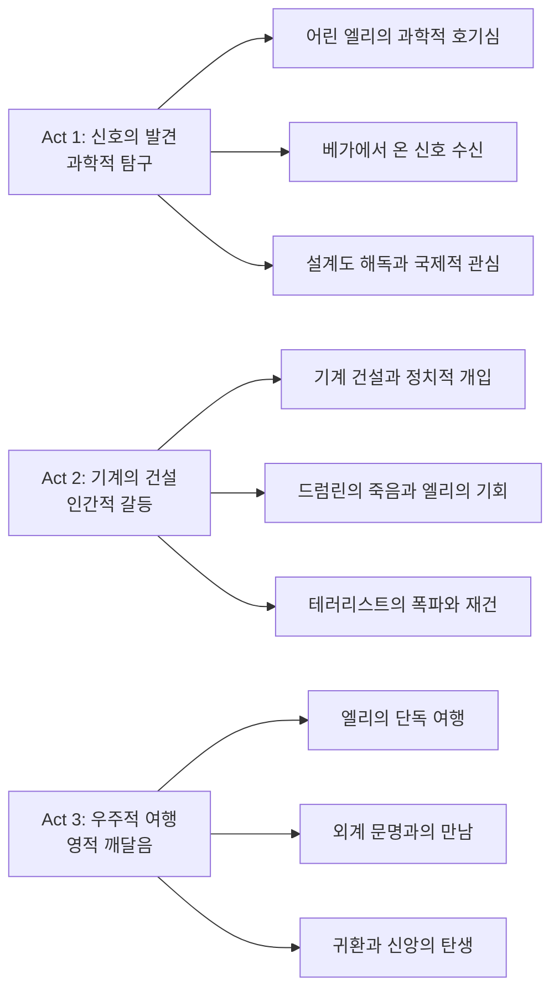
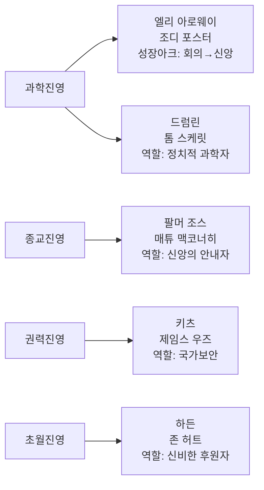

칼 세이건의 동명 소설을 원작으로 한 로버트 저메키스 감독의 《콘택트》(1997)는 과학과 신앙의 대립이라는 인류 최대의 철학적 질문을 외계 문명과의 첫 접촉이라는 SF적 상상력으로 풀어낸 걸작이다. 조디 포스터의 캐리어 하이 연기와 함께 우주의 광대함 앞에서 인간 존재의 의미를 탐구하는 깊이 있는 성찰을 제공한다.

||
|:---:|
||

## 개요

### 영화 정보
* 제목: Contact / 콘택트
* 감독: 로버트 저메키스 (Robert Zemeckis)
* 주연: 조디 포스터, 매튜 맥코너히, 톰 스케릿, 존 허트
* 장르: SF, 드라마, 미스터리, 스릴러
* 상영시간: 150분
* 개봉일: 1997.07.11

### 추천 대상
* **SF 장르 애호가**: 철학적 깊이와 과학적 엄밀성을 겸비한 하드 SF의 정수
* **드라마 선호층**: 인간 내면의 갈등과 성장을 섬세하게 그린 character study
* **성인 관객**: 과학과 종교라는 복합적 주제를 다룬 지적 탐구의 여정

## 완전 스토리 로드맵

### 3막 구조 분석

### Act별 상세 분석

**Act 1: 신호의 발견** (1막 - 50분)
어린 엘리가 아마추어 무선 통신으로 먼 곳의 사람들과 교신하며 보여주는 호기심은 영화 전체의 모티프를 제시한다. 아버지의 갑작스러운 죽음은 그녀로 하여금 과학을 통해 우주의 비밀을 찾고자 하는 동기를 부여한다. 성인이 된 엘리가 SETI 프로젝트에서 베가 성계로부터 온 신호를 발견하는 순간은 인류 역사상 가장 중요한 발견 중 하나로 그려진다. 신호 안에 숨겨진 히틀러 올림픽 영상은 외계인들이 지구의 첫 번째 TV 방송을 받았다는 설정으로, 시간과 공간의 개념을 효과적으로 전달한다.

**Act 2: 기계의 건설** (2막 - 60분)
신호 해독 후 발견된 복잡한 설계도는 인류가 이해할 수 없는 초고도 기술을 담고 있다. 국제적 컨소시엄을 통한 거대 기계 건설 과정에서 정치적 권력 다툼과 종교적 논란이 동시에 터져 나온다. 드럼린과 엘리 사이의 권력 갈등은 과학계 내부의 정치적 현실을 보여주며, 팔머 조스와의 로맨스는 과학과 종교라는 상반된 세계관 사이의 긴장을 개인적 차원에서 구현한다. 종교적 광신도에 의한 첫 번째 기계 폭파는 인류의 진보를 가로막는 맹신의 위험성을 경고한다.

**Act 3: 우주적 여행** (3막 - 40분)
하든의 비밀 기계를 통한 엘리의 단독 여행은 영화의 클라이맥스다. 외계 문명이 만든 가상현실에서 돌아가신 아버지와의 재회는 과학적 발견이 궁극적으로 인간적 치유와 연결됨을 보여준다. "우리는 혼자가 아니다"라는 메시지는 단순히 외계 생명체의 존재를 넘어서 인간 존재의 근본적 외로움에 대한 위안이다.

## 등장인물 심층 분석

### 캐릭터 관계도

### 주인공 분석

**엘리 아로웨이 (조디 포스터)**
- **캐릭터 개요**: 어린 시절 아버지를 잃고 과학에서 위안을 찾은 천체물리학자로, SETI 프로젝트를 통해 외계 지능체의 신호를 탐지하는 데 평생을 바친 인물이다.
- **성장 곡선**: 경험적 증거만을 신뢰하는 rigid한 과학자에서 증거 없는 믿음을 받아들이는 신앙인으로 변모한다. 이는 과학과 종교의 대립을 개인적 성장의 관점에서 해결하는 탁월한 캐릭터 설계다.
- **동기와 욕망**: 표면적으로는 외계 생명체의 존재를 증명하고자 하지만, 근본적으로는 우주에서 인류의 외로움을 해결하고자 하는 실존적 탐구를 수행한다.
- **갈등 구조**: 과학적 객관성과 개인적 신념 사이의 내적 갈등, 남성 중심 학계에서의 성차별, 정치적 권력과 순수 학문의 충돌
- **상징적 의미**: 현대인의 영적 공허와 초월적 경험에 대한 갈망을 대변하며, 과학과 종교의 화해 가능성을 보여주는 mediator 역할을 한다.

조디 포스터는 이 역할에서 《양들의 침묵》에서 보여준 지적 강인함을 한층 성숙하게 발전시켜, 과학자의 논리적 사고와 인간의 감정적 연약함을 완벽하게 균형 잡는다. 특히 웜홀 여행 시퀀스에서 보여주는 경이와 두려움의 복합적 감정 표현은 SF 장르 연기의 새로운 기준을 제시한다.

## 요소별 심층 분석

### 기술 요소 분석 테이블

| 기술 요소 | 혁신점/특징 | 시각적/청각적 효과 | 제작 의의 |
|-----------|-------------|-------------------|-----------|
| CGI와 실사 합성 | 실제 클린턴 대통령 영상과 CGI 결합 | 정치적 현실성 극대화 | deepfake 기술의 선구 |
| 웜홀 시각화 | 킵 손 이론물리학자 자문 참여 | 과학적 정확성과 시각적 장관 | 《인터스텔라》의 이론적 토대 |
| 카메라 워크 | 오프닝 지구 → 우주 zoom out | 우주적 스케일 감각 구현 | Kubrick적 거시적 시각 계승 |
| 사운드 디자인 | 전파 잡음과 신호음의 대비 | 청각적 서스펜스와 과학적 사실성 | 사일런스의 극적 활용 |

### 연기 & 캐스팅 분석 테이블

| 배우 | 캐릭터 | 연기력 평가 | 캐스팅 적합성 | 특별한 점 |
|------|---------|-------------|---------------|-----------|
| 조디 포스터 | 엘리 아로웨이 | 9.5/10 | 완벽 | 지적 카리스마와 감정적 취약성의 균형 |
| 매튜 맥코너히 | 팔머 조스 | 8.5/10 | 우수 | 종교인의 진정성 있는 표현, 향후 철학적 연기의 토대 |
| 톰 스케릿 | 드럼린 | 8/10 | 우수 | 정치적 과학자의 복합적 면모 구현 |
| 존 허트 | 하든 | 9/10 | 완벽 | 신비로운 캐릭터의 압도적 카리스마 |

### 연출 & 각본 분석

**연출의 강점과 약점 분석**
로버트 저메키스는 《백 투 더 퓨처》 시리즈에서 보여준 대중적 감각을 유지하면서도 《포레스트 검프》의 휴머니즘을 한층 심화시켰다. 특히 과학적 디테일을 통한 리얼리즘 구축과 철학적 주제 의식의 조화는 그의 연출 역량이 절정에 달했음을 보여준다. Mise-en-scène의 관점에서 아레시보 천문대의 거대한 접시와 인간의 미시적 존재를 대비시키는 시각적 구성은 탁월하다. 다만 150분의 긴 러닝타임에서 중반부 정치적 서브플롯이 다소 산만하게 느껴지는 것은 편집상의 아쉬움으로 남는다.

**각본의 강점과 약점 분석**
칼 세이건의 원작을 각색한 제임스 V. 하트와 마이클 골든버그의 각본은 복잡한 과학적 개념을 대중이 이해할 수 있도록 번역하는 데 성공했다. 특히 과학과 종교의 대립을 이분법적 갈등이 아닌 상호 보완적 관계로 승화시킨 것은 narrative theory 관점에서 탁월한 성취다. 하지만 엘리와 팔머의 로맨스 서브플롯의 필연성이 다소 약하게 느껴지는 것은 구조적 한계점이다.

### 음악 & 사운드 분석

**특징적 음악 요소와 대표곡 분석**
앨런 실베스트리의 스코어는 《백 투 더 퓨처》 시리즈의 모험적 색채에서 벗어나 훨씬 장엄하고 사색적인 톤을 구축한다. 특히 엘리의 우주 여행 시퀀스에서 사용된 오케스트랄 음악은 Hans Zimmer의 《인터스텔라》 스코어를 예견하는 우주적 숭고함을 담고 있다. 

전파 신호음과 정적(silence)의 대비를 통한 사운드 디자인은 John Cage의 실험 음악을 연상시키는 모던한 접근이다. 특히 첫 번째 신호 수신 장면에서 잡음 속에서 패턴을 찾아내는 과정은 청각적 서스펜스의 정수를 보여준다.

## 비교 분석

### 동일 감독/제작사 작품과의 비교

로버트 저메키스의 필모그래피에서 《콘택트》는 그의 기술적 혁신성과 휴머니즘이 가장 균형 잡힌 작품이다. 《백 투 더 퓨처》 시리즈의 오락성, 《포레스트 검프》의 감동, 《캐스트 어웨이》의 실존적 고독감을 모두 아우르는 종합적 성취라 할 수 있다. 

Auteur Theory의 관점에서 볼 때, 저메키스의 시그니처인 "기술과 감정의 조화"가 가장 정교하게 구현된 작품이다. 특히 실제 역사적 인물(클린턴 대통령)과 가상의 서사를 seamless하게 결합하는 기법은 《포레스트 검프》에서 개발된 것을 한층 정교화한 것이다.

### 동일 장르 작품과의 비교

1970년대 하드 SF 영화의 계보에서 《콘택트》는 스탠리 큐브릭의 《2001: 스페이스 오디세이》(1968)와 스티븐 스필버그의 《미지와의 조우》(1977)의 직계 후손이다. 

큐브릭의 철학적 엄밀성과 스필버그의 대중적 감동을 절묘하게 결합했으며, 특히 외계 문명을 악의적 침입자가 아닌 지혜로운 조언자로 그린 점에서 《미지와의 조우》의 계보를 잇는다. 하지만 종교적 차원을 정면으로 다룬 점에서는 두 전작을 능가하는 야심적 시도를 보여준다.

Genre Theory의 관점에서 《콘택트》는 하드 SF의 과학적 엄밀성과 philosophical SF의 사변적 성격을 동시에 만족시키는 hybrid genre의 성공 사례다.

### 동시대 경쟁작과의 비교

1997년은 《타이타닉》, 《맨 인 블랙》, 《로스트 월드: 쥬라기 공원 2》 등 블록버스터가 극장가를 장악한 해였다. 이 가운데 《콘택트》는 가장 지적이고 철학적인 접근을 보여주며, 단순한 스펙터클이 아닌 사유의 즐거움을 추구했다. 

특히 《맨 인 블랙》과 비교할 때, 같은 외계인 소재를 다루면서도 완전히 다른 차원의 성찰을 제공한다는 점에서 장르 영화의 다양성을 보여주는 사례다. 이는 1990년대 할리우드가 상업성과 예술성을 동시에 추구했던 황금기의 특징을 잘 보여준다.

## 숨겨진 레이어

### 상징적 의미

영화 전반에 걸쳐 반복되는 "동심원" 모티프는 우주의 구조적 질서와 인간 인식의 한계를 동시에 상징한다. 오프닝의 지구 → 태양계 → 은하계로 확장되는 카메라 워크, 아레시보 천문대의 거대한 접시, 그리고 외계 문명이 만든 가상현실의 구형 공간은 모두 이 동심원 구조를 반복한다. 

이는 미시에서 거시로 이어지는 우주의 fractal 구조를 암시하며, 동시에 인간의 지각이 자신을 중심으로 한 동심원적 제약을 벗어나기 어렵다는 인식론적 한계를 표현한다. Representation Theory의 관점에서 이는 인간중심주의적 사고의 한계를 시각적으로 형상화한 것이다.

엘리가 아버지와 재회하는 해변 장면에서의 모래알 하나하나는 칼 세이건의 유명한 명언 "우리는 별의 물질로 만들어졌다"를 시각화한다. 개별 인간의 미시적 존재와 우주의 거시적 질서가 동일한 원소로 연결되어 있다는 범신론적 세계관을 제시하는 것이다.

### 사회적/문화적 맥락

1990년대 후반은 냉전 종료 이후 미국이 유일 초강대국으로 부상하면서도 동시에 종교 근본주의의 부활과 과학 기술에 대한 회의가 동시에 나타났던 시기다. 《콘택트》는 이런 시대적 배경에서 과학과 종교의 화해를 모색하는 작품으로 읽힌다.

특히 종교적 테러리스트 캐릭터는 9/11 이전임에도 불구하고 종교적 극단주의의 위험성을 예견적으로 경고한다. 이는 Cultural Studies의 관점에서 예술 작품이 갖는 사회적 예언 기능을 보여주는 사례다.

또한 여성 과학자 엘리가 남성 중심의 학계와 정치권에서 겪는 차별과 배제는 1990년대 3세대 feminism의 쟁점을 반영한다. 조디 포스터라는 강인한 여성 배우의 캐스팅은 이런 젠더 이슈를 더욱 부각시킨다.

### 현대적 메시지

팬데믹과 기후 변화, AI의 급속한 발전으로 과학의 역할이 재조명받는 현재, 《콘택트》의 메시지는 더욱 절실하게 다가온다. 과학적 사실과 개인적 신념 사이의 갈등은 백신 거부, 기후 변화 부정 등 현재 우리가 직면한 문제들과 직결된다.

특히 "증거 없는 믿음"을 긍정적으로 그린 것은 과학만능주의에 대한 성찰을 제공한다. 엘리가 자신의 경험을 증명할 수 없음을 받아들이면서도 그 경험의 진실성을 의심하지 않는 결말은, 과학적 방법론의 한계를 인정하면서도 인간 경험의 고유한 가치를 옹호하는 균형 잡힌 시각을 제시한다.

## 제작 비하인드

### 제작 과정의 특별함

칼 세이건은 제작 과정에서 과학적 정확성을 위해 직접 자문을 제공했으며, 심지어 CGI 기술로 구현된 과학적 시각화의 정확성까지 검토했다. 실제로 영화에서 구현된 과학적 시각화 기법들은 후에 《인터스텔라》(2014)에서 킵 손(Kip Thorne)이 참여한 웜홀 시각화 등에 영향을 준 선구적 성취가 되었다.

아레시보 천문대에서의 촬영은 실제 관측 일정을 피해 진행되었으며, 세트가 아닌 실제 과학 장비를 배경으로 촬영함으로써 하드 SF 장르의 사실성을 극대화했다. 이는 《2001: 스페이스 오디세이》 이후 가장 과학적으로 엄밀한 SF 영화라는 평가를 받는 근거가 되었다.

### 캐스팅 스토리

조디 포스터는 이 역할을 위해 실제 천체물리학 수업을 수강했으며, 실제 SETI 연구소를 방문해 여성 과학자들과 인터뷰를 진행했다. 그녀의 캐릭터 준비 과정은 단순한 배역 연구를 넘어서 진정한 method acting의 사례로 기록된다.

매튜 맥코너히의 캐스팅은 당시로서는 파격적인 선택이었다. 주로 로맨틱 코미디에 출연했던 그가 철학적 종교인 역할을 맡은 것은 그의 배우 인생에서 중요한 전환점이 되었으며, 후에 《인터스텔라》, 《트루 디텍티브》에서 보여준 철학적 연기의 토대가 되었다.

### 기술적 혁신

《콘택트》는 영화 역사상 최초로 실제 정치인(클린턴 대통령)의 기존 영상을 CGI로 조작해 가상의 상황에 삽입한 작품이다. 이는 현재의 deepfake 기술의 원시적 형태로, AI 기반 영상 조작 기술의 선구가 되었다.

웜홀 여행 시퀀스는 당시로서는 최첨단 CGI 기술을 동원했지만, 동시에 practical effect와의 절묘한 결합을 통해 현실감을 잃지 않았다. 특히 조디 포스터의 얼굴에 나타나는 중력 효과는 실제 물리 법칙을 고려한 메이크업과 CGI의 결합으로 구현되었다.

## 종합 평가

**최종 평점: ★★★★☆ (4.5/5)**

《콘택트》는 1990년대 미국 영화계가 달성한 지적 성취의 정점 중 하나다. 칼 세이건의 과학적 엄밀성과 로버트 저메키스의 대중적 감각, 그리고 조디 포스터의 배우적 카리스마가 완벽하게 결합되어 SF 장르의 새로운 지평을 열었다.

특히 과학과 종교의 이분법적 대립을 넘어서 상호 보완적 관계로 승화시킨 철학적 성취는 단순한 오락 영화를 넘어선 문화적 기여를 만들어냈다. André Bazin의 리얼리즘 이론과 Sergei Eisenstein의 몽타주 이론을 현대적으로 재해석한 영상 언어, Laura Mulvey의 시선 이론을 의식한 여성 주인공의 능동적 재현은 영화사적 의의를 더한다.

150분의 긴 러닝타임에도 불구하고 지루함을 느끼게 하지 않는 탄탄한 서사 구조와, 스펙터클과 휴머니즘의 균형 잡힌 조화는 블록버스터 영화의 모범 사례다. 다만 일부 정치적 서브플롯의 산만함과 로맨스 라인의 필연성 부족은 완벽함을 저해하는 요소다.

그럼에도 불구하고 이 영화는 SF 장르가 단순한 escapism을 넘어서 철학적 성찰의 매체가 될 수 있음을 보여준 기념비적 작품이다. 현재의 관점에서 보면 기후 변화, 팬데믹, AI 등의 과학적 이슈들이 사회적 논란을 일으키는 상황에서 《콘택트》가 제시한 "과학과 신앙의 조화"라는 메시지는 더욱 절실한 현재적 의미를 갖는다.

### 한 줄 평
"우주의 광대함 앞에서 인간의 외로움을 달래는 것은 과학적 발견이 아니라 타자와의 소통이라는 것을 깨닫게 하는 우주적 규모의 성장 소설"

### 추천 작품
- **《2001: 스페이스 오디세이》** (1968): 철학적 SF의 고전이자 《콘택트》의 정신적 선조
- **《미지와의 조우》** (1977): 외계 문명과의 평화적 접촉을 다룬 스필버그의 걸작
- **《인터스텔라》** (2014): 과학과 감정의 현대적 결합을 보여주는 놀란의 야심작
- **《아이 엠 레전드》** (2007): 과학자 주인공의 고독한 투쟁을 그린 포스트 아포칼립스
- **《어라이벌》** (2016): 언어학적 접근의 외계 접촉을 다룬 현대 SF의 수작

### 관람 전 체크리스트
- [ ] 칼 세이건의 원작 소설 《코스모스》 읽기 (선택사항이지만 강력 추천)
- [ ] 1990년대 SETI 프로젝트와 아레시보 천문대에 대한 기본 지식
- [ ] 150분 러닝타임에 대한 심리적 준비와 집중력 확보
- [ ] 과학과 종교에 대한 열린 마음과 성찰적 자세
- [ ] 철학적 질문을 즐길 수 있는 사색적 분위기 조성