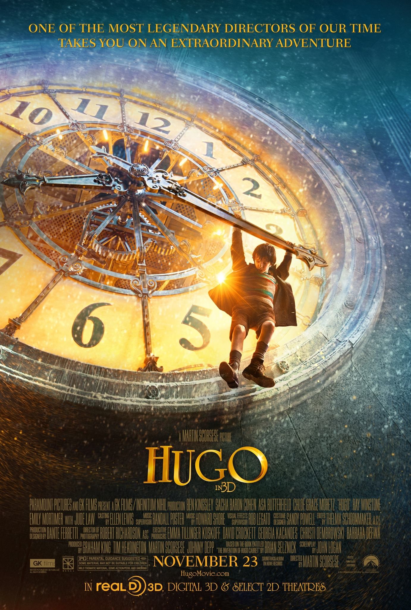
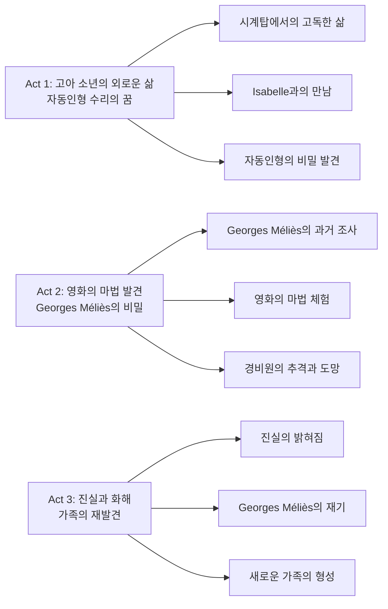
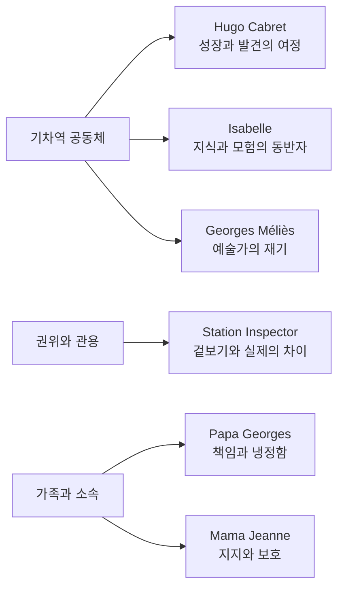

『Hugo』는 Martin Scorsese 감독이 선사하는 마법 같은 모험 영화로, 1930년대 파리 기차역을 배경으로 영화의 역사와 마법을 탐구하는 작품이다. 이 영화는 단순한 가족 영화를 넘어 초기 영화의 선구자 Georges Méliès에 대한 오마주이자, 영화 예술의 소중함과 보존의 중요성을 강조하는 메타시네마적 작품이다. 고아 소년 Hugo의 여정을 통해 영화의 마법과 역사를 재발견하는 놀라운 모험을 그린다.

||
|:---:|
|Hugo (2011) - Martin Scorsese의 영화에 대한 영화|

## 개요

### 영화 정보
* **제목**: Hugo (휴고)
* **감독**: Martin Scorsese
* **주연**: Asa Butterfield, Chloë Grace Moretz, Ben Kingsley, Sacha Baron Cohen
* **장르**: Drama, Adventure, Family, Fantasy
* **상영시간**: 126분
* **개봉일**: 2011.11.23 (미국), 2012.01.12 (한국)
* **제작사**: Paramount Pictures, GK Films
* **음악**: Howard Shore

### 추천 대상
* **영화사 애호가**: 초기 영화의 선구자 Georges Méliès에 대한 오마주
* **가족 관객**: 따뜻한 가족 드라마와 모험 요소
* **기술 매니아**: 3D 기술과 시각효과의 혁신적 활용
* **예술 애호가**: 영화 예술의 보존과 가치에 대한 메시지

## 완전 스토리 로드맵

**🎬 스포일러 전체 공개 - 이미 영화를 본 독자를 위한 완전한 줄거리 재구성**

### 3막 구조 분석

### **Act 1: 고아 소년의 외로운 삶**

**시계탑에서의 고독한 삶**

1930년대 파리 기차역의 시계탑 내부에서 12세 고아 소년 Hugo Cabret가 혼자 살아간다. 아버지가 박물관 화재로 사망한 후, 숙부와 함께 시계탑에서 살게 된 Hugo는 숙부마저 사라지자 혼자서 기차역의 모든 시계를 관리하며 살아간다. 이 장면에서 가장 인상적인 순간은 "모든 기계에는 목적이 있다. 시계는 시간을 알려주고, 기차는 사람들을 데려다 준다. 그럼 나는 무엇을 위한 것일까?"라는 Hugo의 독백으로, 고아 소년의 존재론적 고민과 자동인형 수리에 대한 집착의 근원을 보여준다.

시각적으로는 시계탑 내부의 복잡한 톱니바퀴와 기계 장치들이 Hugo의 외로움과 기계에 대한 천재적 재능을 상징적으로 표현한다. Howard Shore의 음악은 시계의 똑딱거리는 소리와 조화를 이루며 고독한 분위기를 조성한다. 특히 자동인형이 그려낸 그림이 Georges Méliès의 '달 세계 여행'의 한 장면이라는 복선은 후에 영화의 핵심 비밀으로 발전된다.

**Isabelle과의 운명적 만남**

Hugo가 자동인형을 작동시키기 위해 필요한 열쇠 모양의 부품을 찾던 중, 장난감 가게 주인 Georges Méliès의 대녀 Isabelle을 만나게 된다. Isabelle은 자동인형을 작동시킬 수 있는 열쇠를 가지고 있었고, 두 사람은 함께 자동인형의 비밀을 풀기 시작한다. "나는 모험을 원해. 하지만 책에서만 읽을 수 있었어."라는 Isabelle의 대사는 그녀의 모험에 대한 갈망과 Hugo와의 만남이 가져올 변화를 암시한다.

**자동인형의 비밀 발견**

자동인형이 작동하면서 그려낸 그림은 초기 영화의 선구자 Georges Méliès의 작품 '달 세계 여행'의 한 장면이었다. 이는 Georges Méliès가 과거 유명한 영화 감독이었음을 암시하는 중요한 복선이다. 자동인형의 정교한 움직임과 그려내는 그림의 아름다움은 영화의 마법을 상징적으로 보여주며, Hugo와 Isabelle의 호기심을 자극한다.

### **Act 2: 영화의 마법 발견**

**Georges Méliès의 과거 조사**

Hugo와 Isabelle은 Georges Méliès의 과거를 조사하며, 그가 영화의 마법사로 불리던 시절의 영광과 그 후 잊혀진 역사를 발견한다. Isabelle의 도서관에서 발견한 영화사 책을 통해 Georges Méliès가 500편 이상의 영화를 만들었지만 대부분이 잊혀지거나 파괴되었다는 사실을 알게 된다. "영화는 마법이야. 꿈을 현실로 만들어주는 마법."이라는 Hugo의 대사는 영화의 본질적 매력과 Georges Méliès의 예술에 대한 경외심을 표현한다.

**영화의 마법 체험**

Hugo와 Isabelle이 Georges Méliès의 영화를 직접 체험하는 장면에서 영화의 마법이 시각적으로 구현된다. 특히 '달 세계 여행'의 재현 장면에서는 초기 영화의 특수효과 기법들이 아름답게 보여지며, 이는 영화사적 교육적 가치를 지닌다. "영화는 우리에게 다른 세계를 보여줘. 우리가 갈 수 없는 곳으로 데려가 줘."라는 Isabelle의 대사는 영화의 꿈꾸는 힘을 강조한다.

**경비원의 추격과 도망**

기차역 경비원은 Hugo가 고아임을 알고 그를 고아원으로 보내려고 한다. Hugo는 경비원의 추적을 피해 기차역의 복잡한 통로와 시계탑의 비밀 통로를 이용해 도망다닌다. 이러한 추격전은 영화에 긴장감을 더하며, Hugo의 기지와 용기를 보여주는 장면으로 작용한다. 경비원의 개에게 쫓기며 위험한 상황에 처하기도 하지만, 기차역의 구조를 잘 알고 있는 Hugo는 교묘하게 몸을 숨기며 위기를 모면한다.

### **Act 3: 진실과 화해**

**진실의 밝혀짐**

Hugo와 Isabelle이 Georges Méliès의 진실을 밝히는 과정에서 모든 비밀이 드러난다. Georges Méliès가 과거 유명한 영화 감독이었지만 제1차 세계대전 후 영화사가 파산하고 작품들이 파괴되면서 절망에 빠져 자신의 과거를 숨기고 살아왔다는 사실이 밝혀진다. "나는 마법사가 아니야. 그저 꿈꾸는 사람이었을 뿐이야."라는 Georges Méliès의 대사는 예술가의 고뇌와 재기 과정을 보여준다.

**Georges Méliès의 재기**

Hugo의 도움으로 Georges Méliès는 자신의 예술적 유산을 인정받게 되고, 그의 작품들이 영화사적으로 재평가받게 된다. 이 과정에서 Georges Méliès는 자신의 과거를 받아들이고 새로운 시작을 할 수 있게 된다. "영화는 우리의 꿈을 보여주는 거야. 그리고 꿈은 결코 죽지 않아."라는 메시지가 영화의 핵심 테마로 드러난다.

**새로운 가족의 형성**

영화의 마지막에서 Hugo는 Georges Méliès 가족과 함께 살게 되고, 진정한 가족을 찾게 된다. 이는 단순한 자동인형 수리를 넘어 영화의 마법과 역사를 재발견하며, 동시에 자신의 인생에도 새로운 의미를 찾아간 Hugo의 성장을 보여준다. "모든 기계에는 목적이 있다. 그리고 나의 목적은 여기 있는 것 같아."라는 Hugo의 마지막 대사는 그의 성장과 새로운 가족에 대한 감사를 표현한다.

### 핵심 대사 모음

* "모든 기계에는 목적이 있다. 시계는 시간을 알려주고, 기차는 사람들을 데려다 준다. 그럼 나는 무엇을 위한 것일까?" - Hugo
* "영화는 마법이야. 꿈을 현실로 만들어주는 마법." - Hugo
* "나는 모험을 원해. 하지만 책에서만 읽을 수 있었어." - Isabelle
* "영화는 우리에게 다른 세계를 보여줘. 우리가 갈 수 없는 곳으로 데려가 줘." - Isabelle
* "나는 마법사가 아니야. 그저 꿈꾸는 사람이었을 뿐이야." - Georges Méliès
* "영화는 우리의 꿈을 보여주는 거야. 그리고 꿈은 결코 죽지 않아." - Georges Méliès
* "모든 기계에는 목적이 있다. 그리고 나의 목적은 여기 있는 것 같아." - Hugo

### 상징적 장면 분석

**자동인형의 그림 그리기**: 자동인형이 그려내는 Georges Méliès의 영화 장면은 영화의 마법과 역사를 상징한다. 이는 단순한 기계가 아닌 예술의 힘을 보여주는 상징적 장면이다.

**시계탑의 톱니바퀴**: 시계탑 내부의 복잡한 기계 장치들은 영화의 정교한 구조와 Hugo의 내면을 상징한다. 모든 것이 연결되어 있다는 메시지를 전달한다.

**기차역의 증기기관**: 기차역의 증기기관과 기차들은 산업혁명의 상징이자 영화 기술의 발전을 상징한다.

## 등장인물 심층 분석

### 캐릭터 관계도

### **주인공: Hugo Cabret (Asa Butterfield)**

.png)

**캐릭터 개요**
* 기본 설정: 12세 고아 소년, 기계 천재, 시계탑 거주
* 핵심 목표: 아버지의 자동인형 수리
* 주요 갈등: 외로움, 가족 부재, 정체성 찾기

**성장 곡선**
* 고독한 고아 → 우정 발견 → 영화의 마법 체험 → 가족 재발견
* **핵심 성장 메시지**: 진정한 가족은 혈연이 아닌 사랑과 이해에서 온다

**동기와 욕망**
* 표면적 목표: 자동인형 수리
* 내면적 욕구: 가족과 소속감 찾기
* 두려움: 고아원으로 보내지는 것, 혼자 남겨지는 것

**갈등 구조**
* vs 자신: 자신의 존재 의미 찾기
* vs 타인: Station Inspector의 추적
* vs 상황: 고아라는 현실과 경제적 어려움

**상징적 의미**
Hugo는 모든 고아와 소외된 이들의 대변자로, 꿈과 상상력의 힘을 통해 새로운 가능성을 발견하는 현대적 영웅의 모습을 보여준다.

### **조연: Georges Méliès (Ben Kingsley)**

.png)

**캐릭터 개요**
* 기본 설정: 전 영화 감독, 장난감 가게 주인, 은둔자
* 핵심 목표: 과거 숨기기 → 예술적 재기
* 주요 갈등: 과거와 현재의 괴리, 예술가로서의 정체성

**성장 곡선**
* 절망한 은둔자 → Hugo와의 만남 → 과거 수용 → 예술적 재기
* **핵심 성장 메시지**: 예술은 결코 죽지 않으며, 새로운 세대에게 영감을 줄 수 있다

**동기와 욕망**
* 표면적 목표: 평온한 노년 생활
* 내면적 욕구: 예술적 인정과 재기
* 두려움: 과거의 실패와 상처 재현

**상징적 의미**
Georges Méliès는 잊혀진 예술가들의 대변자로, 예술의 보존과 재발견의 중요성을 상징한다.

### **조연: Isabelle (Chloë Grace Moretz)**

.png)

**캐릭터 개요**
* 기본 설정: Georges Méliès의 대녀, 독서광, 모험가
* 핵심 목표: 진짜 모험 경험하기
* 주요 갈등: 책 속 지식과 실제 경험의 괴리

**성장 곡선**
* 책 속 모험 동경 → Hugo와의 실제 모험 → 영화의 마법 발견
* **핵심 성장 메시지**: 진정한 모험은 책을 넘어 실제 경험에서 온다

**상징적 의미**
Isabelle은 지식과 경험의 연결고리 역할을 하며, 여성의 지적 호기심과 모험 정신을 대변한다.

### **조연: Station Inspector (Sacha Baron Cohen)**

.png)

**캐릭터 개요**
* 기본 설정: 기차역 경비원, 전쟁 상처, 엄격한 성격
* 핵심 목표: 규칙 준수 → Hugo 이해
* 주요 갈등: 규칙과 인정 사이의 갈등

**성장 곡선**
* 엄격한 규칙 집행자 → Hugo의 상황 이해 → 관용과 이해
* **핵심 성장 메시지**: 겉보기와 실제는 다를 수 있으며, 이해와 관용이 필요하다

**상징적 의미**
Station Inspector는 권위와 관용의 상징으로, 전쟁의 상처를 지닌 세대의 모습을 보여준다.

## 요소별 심층 분석

### 기술 요소 분석 테이블

| 기술 요소 | 혁신점/특징 | 시각적/청각적 효과 | 제작 의의 |
|-----------|-------------|-------------------|-----------|
| 3D 기술 | Martin Scorsese의 첫 3D 영화 | 깊이감 있는 기차역과 시계 장치 표현 | 영화의 마법을 현실적으로 구현 |
| 시각효과 | 자동인형의 정교한 움직임 | 기계의 아름다움과 정교함 강조 | 기계와 예술의 조화 표현 |
| 촬영 | Deep focus와 tracking shot 활용 | 기차역의 웅장함과 인물의 감정 표현 | 1930년대 파리의 분위기 재현 |
| 미술 | 아르누보 양식의 기차역 세트 | 시대적 분위기와 예술적 아름다움 조화 | 영화의 환상적 분위기 조성 |
| 음악 | Howard Shore의 클래식 스타일 | 1930년대 분위기와 영화의 마법적 요소 강조 | 감정적 몰입도 향상 |

### 연기 & 캐스팅 분석 테이블

| 배우 | 캐릭터 | 연기력 평가 | 캐스팅 적합성 | 특별한 점 |
|------|---------|-------------|---------------|-----------|
| Asa Butterfield | Hugo Cabret | 호기심과 외로움을 섬세하게 표현 | 고아 소년의 순수함과 기계 천재성 완벽 구현 | 12세 나이에 복잡한 감정 표현 능력 |
| Ben Kingsley | Georges Méliès | 예술가의 고뇌와 재기 과정을 깊이 있게 연기 | 역사적 인물의 위엄과 인간적 약점 조화 | 실제 Georges Méliès와의 유사성 |
| Chloë Grace Moretz | Isabelle | 지적 호기심과 모험 정신을 생생하게 표현 | 소녀의 순수함과 지적 성숙함의 균형 | Hugo와의 케미 완벽 |
| Sacha Baron Cohen | Station Inspector | 코미디와 드라마의 균형을 잘 맞춤 | 엄격함 뒤의 따뜻함을 자연스럽게 표현 | 전쟁 상처의 묘사가 인상적 |

### 연출 & 각본 분석

**연출의 강점과 약점 분석**

Martin Scorsese는 이 작품에서 자신의 첫 3D 영화를 시도하며 기술적 혁신을 보여준다. 특히 기차역의 웅장함과 시계 장치들의 정교한 움직임을 3D로 표현한 것은 성공적이다. 또한 Georges Méliès의 영화들을 재현한 장면들은 영화사적 교육적 가치를 지닌다.

다만, 일부 장면에서 3D 효과가 과도하게 사용되어 영화의 서사적 흐름을 방해하는 경우가 있다. 또한 가족 영화로서의 접근성과 예술 영화로서의 깊이 사이에서 균형을 맞추는 데 어려움을 보인다.

**각본의 강점과 약점 분석**

각본은 영화의 마법과 역사를 탐구하는 메타시네마적 요소를 성공적으로 구현했다. Hugo의 성장 과정과 Georges Méliès의 재기 과정이 자연스럽게 연결되며, 각 캐릭터의 동기와 갈등이 명확하게 설정되어 있다.

하지만 일부 플롯 포인트가 예측 가능하고, Station Inspector의 캐릭터 아크가 충분히 발전되지 않았다는 지적을 받는다. 또한 Georges Méliès의 실제 생애와 영화에서 묘사된 모습 사이에 차이가 있어 역사적 정확성에 대한 논란이 있다.

### 음악 & 사운드 분석

**특징적 음악 요소와 대표곡 분석**

Howard Shore가 작곡한 음악은 1930년대 파리의 분위기를 완벽하게 재현한다. 특히 시계의 똑딱거리는 소리와 조화를 이루는 음악은 영화의 분위기를 조성하는 데 중요한 역할을 한다.

주요 테마곡인 "The Thief"는 Hugo의 외로움과 모험을 표현하며, "The Movies"는 영화의 마법을 상징한다. "The Invention of Dreams"는 Georges Méliès의 예술적 영감을 표현하는 아름다운 곡이다.

## 비교 분석

### 동일 감독/제작사 작품과의 비교

**Martin Scorsese의 다른 작품들과 비교**

『Hugo』는 Martin Scorsese의 기존 작품들과는 상당히 다른 스타일을 보인다. 『Goodfellas』(1990), 『The Departed』(2006) 등에서 보여준 폭력과 범죄를 다룬 하드보일드 스타일과 달리, 『Hugo』는 가족 친화적이고 환상적인 분위기를 연출한다.

하지만 『The Aviator』(2004)에서 보여준 역사적 인물에 대한 관심과 『Shutter Island』(2010)에서 보여준 시각적 혁신은 『Hugo』에서도 계속된다. 특히 3D 기술의 활용은 Scorsese의 기술적 도전 정신을 보여준다.

**Paramount Pictures의 가족 영화들과 비교**

『Hugo』는 Paramount Pictures가 제작한 다른 가족 영화들인 『Up』(2009), 『How to Train Your Dragon』(2010)과 비교할 때 더욱 예술적이고 교육적인 가치를 지닌다. 단순한 오락을 넘어 영화사적 의미와 예술적 가치를 전달하는 점이 차별화된다.

### 동일 장르 작품과의 비교

**가족 모험 드라마와 비교**

『Hugo』는 『The Secret Garden』(1993), 『A Little Princess』(1995) 등 고아 소년/소녀를 주인공으로 한 가족 드라마들과 비교할 때 더욱 메타시네마적 특성을 지닌다. 단순한 성장 이야기를 넘어 영화 자체에 대한 탐구를 포함한다.

**역사적 배경을 다룬 가족 영화와 비교**

『The Sound of Music』(1965), 『Mary Poppins』(1964) 등 1930-40년대를 배경으로 한 가족 영화들과 비교할 때, 『Hugo』는 더욱 현실적이고 역사적으로 정확한 배경을 제공한다. 특히 영화사적 맥락을 포함한 점이 독특하다.

### 동시대 경쟁작과의 비교

**2011년 개봉작들과 비교**

2011년 개봉된 『Harry Potter and the Deathly Hallows: Part 2』, 『The Adventures of Tintin』 등과 비교할 때, 『Hugo』는 더욱 예술적이고 교육적인 가치를 지닌다. 상업적 성공보다는 예술적 완성도에 집중한 점이 특징이다.

**3D 기술을 활용한 영화들과 비교**

『Avatar』(2009) 이후 3D 붐이 일었던 시기에 개봉된 『Hugo』는 단순한 시각적 효과를 넘어 3D의 예술적 가능성을 탐구한 점이 돋보인다. 특히 기계의 정교함과 공간의 깊이감을 3D로 표현한 것은 혁신적이다.

## 숨겨진 레이어

### 상징적 의미

**기계와 예술의 조화**

영화에서 시계, 자동인형, 기차 등 기계적 요소들이 중요한 상징적 의미를 지닌다. 이들은 단순한 기계가 아닌 인간의 창의력과 예술적 영감을 상징한다. 특히 자동인형이 그려내는 그림은 기계가 예술을 창조할 수 있다는 메타포를 제공한다.

**시계와 시간의 의미**

시계는 시간의 흐름과 영화의 역사를 상징한다. Hugo가 시계를 관리하는 것은 영화의 역사를 보존하고 전달하는 역할을 의미한다. 또한 시계의 정교한 구조는 영화의 복잡한 구조와 예술적 완성도를 상징한다.

**기차역과 연결성**

기차역은 다양한 사람들이 만나는 공간으로, 영화관과 같은 문화적 교류의 장소를 상징한다. 또한 기차의 이동은 영화가 관객을 다른 세계로 데려가는 역할을 상징한다.

### 사회적/문화적 맥락

**1930년대의 사회적 배경**

영화는 1930년대 세계 대공황의 여파가 남아있던 시기를 배경으로 한다. 이 시기의 경제적 어려움과 사회적 불안은 영화에서 고아 문제와 사회적 소외로 표현된다. 또한 이 시기는 영화 산업이 무성영화에서 유성영화로 전환되는 과도기로, 영화의 변화와 발전을 상징한다.

**영화 보존의 중요성**

Georges Méliès의 작품들이 잊혀지고 파괴되는 과정은 영화사적 유산 보존의 중요성을 강조한다. 이는 현대 영화 보존 운동의 필요성을 암시하며, 문화적 유산의 소중함을 일깨워준다.

**예술가의 사회적 역할**

Georges Méliès의 재기 과정은 예술가가 사회에서 어떤 역할을 해야 하는지를 보여준다. 예술은 단순한 오락을 넘어 꿈과 희망을 제공하는 사회적 기능을 한다는 메시지를 전달한다.

### 현대적 메시지

**디지털 시대의 아날로그 가치**

디지털 기술이 발달한 현대에서 『Hugo』는 아날로그 기계의 아름다움과 가치를 재조명한다. 특히 자동인형의 정교한 움직임은 디지털 기술로는 구현할 수 없는 아날로그의 매력을 보여준다.

**가족의 재정의**

영화는 혈연이 아닌 사랑과 이해를 바탕으로 한 가족의 의미를 제시한다. Hugo가 Georges Méliès 가족과 함께하게 되는 과정은 현대 사회에서 가족의 의미가 어떻게 변화하고 있는지를 보여준다.

**예술 교육의 중요성**

영화는 예술 교육의 중요성을 강조한다. Hugo가 영화의 마법을 발견하는 과정은 예술이 아이들에게 어떤 영향을 미칠 수 있는지를 보여주며, 예술 교육의 필요성을 암시한다.

## 제작 비하인드

### 제작 과정의 특별함

**Martin Scorsese의 3D 도전**

『Hugo』는 Martin Scorsese의 첫 3D 영화로, 70세의 나이에 새로운 기술에 도전한 점이 특별하다. Scorsese는 3D 기술이 영화의 몰입감을 높이는 도구로 활용되어야 한다고 믿었으며, 이를 통해 영화의 마법을 더욱 생생하게 전달하고자 했다.

**실제 기차역에서의 촬영**

영화의 일부 장면은 실제 파리의 기차역에서 촬영되었으며, 나머지는 영국 Shepperton Studios에서 세트를 구축하여 촬영되었다. 특히 시계탑 내부의 복잡한 기계 장치들은 실제 시계 장치를 참고하여 제작되었다.

**자동인형의 제작**

영화에서 등장하는 자동인형은 실제 19세기 자동인형을 참고하여 제작되었다. 이 자동인형은 실제로 움직이며 그림을 그릴 수 있도록 특별히 제작되었으며, 영화의 핵심 소품으로 활용되었다.

### 캐스팅 스토리

**Asa Butterfield의 캐스팅**

Hugo 역할을 위해 수많은 어린 배우들이 오디션을 받았지만, Asa Butterfield의 순수함과 기계에 대한 천재적 재능을 표현할 수 있는 능력이 돋보였다. 특히 그의 파란 눈과 호기심 어린 표정이 Hugo 캐릭터에 완벽하게 맞았다.

**Ben Kingsley의 Georges Méliès 연기**

Ben Kingsley는 실제 Georges Méliès의 사진과 영상을 참고하여 그의 모습과 행동을 연구했다. 특히 Méliès의 제스처와 표정을 정확하게 재현하여 역사적 인물을 생생하게 구현했다.

**Sacha Baron Cohen의 캐릭터 변신**

코미디 배우로 알려진 Sacha Baron Cohen는 이 작품에서 드라마틱한 역할을 맡아 연기 스펙트럼을 넓혔다. Station Inspector의 엄격함과 뒤에 숨겨진 따뜻함을 자연스럽게 표현했다.

### 기술적 혁신

**3D 기술의 예술적 활용**

『Hugo』는 3D 기술을 단순한 시각적 효과가 아닌 예술적 표현 도구로 활용했다. 특히 기차역의 깊이감과 시계 장치들의 입체적 표현은 3D의 새로운 가능성을 보여준다.

**시각효과의 혁신**

자동인형의 움직임과 Georges Méliès 영화의 재현은 최신 시각효과 기술을 활용했다. 특히 초기 영화의 특수효과를 현대적 기술로 재현한 것은 영화사적 의의가 크다.

**음향 디자인의 정교함**

Howard Shore의 음악과 함께 기차역의 다양한 소리들이 정교하게 믹싱되어 영화의 몰입감을 높인다. 특히 시계의 똑딱거리는 소리와 기차의 소리가 음악과 조화를 이루는 점이 인상적이다.

## 종합 평가

**최종 평점: ★★★★☆ (4/5)**

### 한 줄 평
영화에 대한 사랑과 꿈의 마법을 전하는 아름다운 메타시네마적 작품으로, Martin Scorsese의 기술적 혁신과 예술적 열정이 완벽하게 조화를 이룬 가족 모험 드라마.

### 추천 작품
* **영화사 애호가**: 『The Artist』(2011), 『Singin' in the Rain』(1952)
* **가족 관객**: 『The Secret Garden』(1993), 『A Little Princess』(1995)
* **기술 매니아**: 『Avatar』(2009), 『Gravity』(2013)
* **예술 애호가**: 『The Red Shoes』(1948), 『Cinema Paradiso』(1988)

### 관람 전 체크리스트
* [ ] Georges Méliès의 실제 영화 작품들 미리 감상
* [ ] 1930년대 파리의 역사적 배경 이해
* [ ] 영화의 메타시네마적 특성에 대한 이해
* [ ] 3D 기술의 예술적 활용에 대한 관심
* [ ] 가족과 함께 관람할 준비

『Hugo』는 영화를 사랑하는 모든 이들에게 강력히 추천하는 작품으로, 영화의 마법과 역사를 동시에 경험할 수 있는 특별한 기회를 제공한다. Martin Scorsese 감독의 기술적 혁신과 예술적 열정이 완벽하게 조화를 이룬 이 작품은 단순한 가족 영화를 넘어 영화 예술에 대한 깊이 있는 성찰을 담고 있다.

특히 초기 영화의 선구자 Georges Méliès에 대한 오마주는 영화사적 교육적 가치를 지니며, 영화 보존의 중요성을 일깨워준다. 3D 기술의 예술적 활용과 정교한 시각효과는 현대 영화 기술의 발전을 보여주는 동시에, 아날로그 기계의 아름다움도 함께 조명한다.

『Hugo』는 영화의 마법과 역사를 동시에 경험할 수 있는 특별한 기회를 제공하며, 모든 연령대의 관객에게 꿈과 상상력의 힘을 일깨워주는 아름다운 작품이다. 