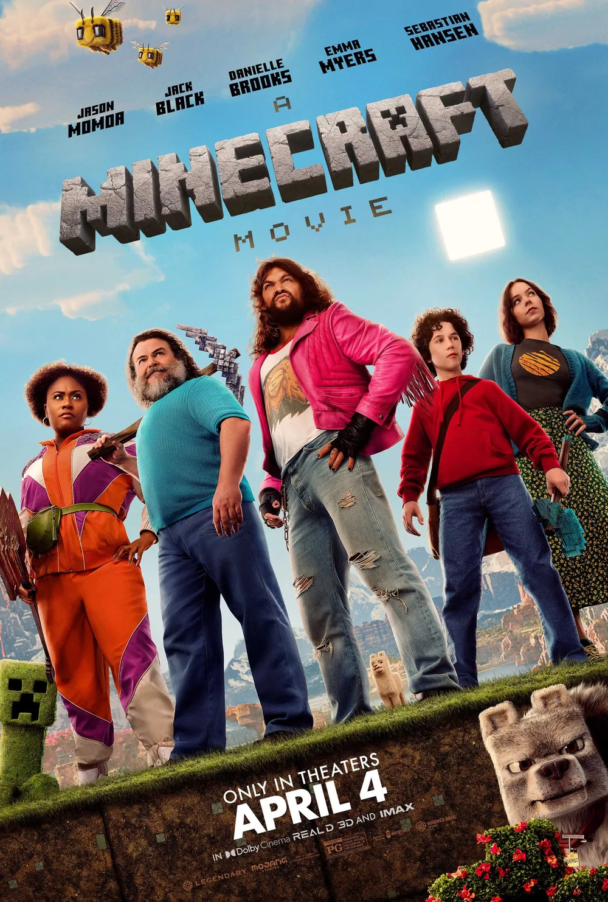
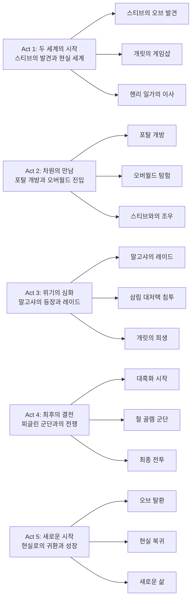

세계적 게임 마인크래프트가 드디어 실사 영화로 탄생했다. 15년간 전 세계 수억 명의 플레이어들이 사랑한 샌드박스 게임이 워너 브라더스와 레전더리 픽처스의 손을 거쳐 스크린에 모습을 드러냈다. 잭 블랙과 제이슨 모모아라는 막강한 캐스팅, 그리고 나폴레옹 다이너마이트의 자레드 헤스 감독의 독특한 감각이 더해져 게임 팬들과 가족 관객 모두를 만족시키는 작품으로 완성되었다.

## 개요

### 영화 정보
* **제목**: A Minecraft Movie / 마인크래프트 무비
* **감독**: 자레드 헤스 (Jared Hess)
* **각본**: 크리스 보우먼, 휴버트 데이비스 윙필드
* **주연**: 잭 블랙, 제이슨 모모아, 엠마 마이어스, 대니엘 브룩스, 세바스찬 유진 한센, 제니퍼 쿨리지
* **장르**: 모험, 가족, 판타지, 코미디
* **상영시간**: 100분
* **개봉일**: 2025년 4월 4일 (미국), 2025년 4월 15일 (한국)
* **제작사**: 워너 브라더스, 레전더리 픽처스
* **배급사**: 워너 브라더스
* **평점**: 로튼 토마토 55%, IMDb 6.8/10, 네이버 7.2/10

### 추천 대상
* **마인크래프트 게임 팬**: 게임 속 요소들의 실사화와 오마주가 가득한 팬 서비스
* **가족 관객**: 모든 연령대가 함께 즐길 수 있는 건전한 모험과 유머
* **창의력을 사랑하는 이들**: 블록을 쌓아 세계를 만드는 창조의 즐거움을 영화로 경험

## 구조 분석

영화는 고전적인 5막 구조를 따르면서도 마인크래프트 게임의 진행 방식을 반영한 독특한 서사 구조를 가지고 있다.

## 캐릭터 분석

### 스티브

**개요**: 영화의 첫 주인공으로, 어렸을 때부터 광산을 탐험하길 꿈꿨던 평범한 영업사원이다. 우연히 발견한 오브와 땅의 수정으로 인해 오버월드에 빠지게 되고, 그곳에서 생존 전문가로 성장한다. 파란 셔츠와 청바지라는 게임 속 스티브의 상징적 의상을 그대로 재현했다.

**성장 곡선**: 단조로운 일상을 살던 평범한 직장인에서 오버월드의 숙련된 생존자이자 수호자로 변모한다. 네더의 포탈을 여는 실수를 저지르지만, 결국 오버월드를 구하는 핵심 인물이 된다.

**동기와 욕망**: 어렸을 적 꿈인 광산 탐험을 이루고자 했으며, 오버월드에서는 이 세계를 지키고 싶은 책임감이 생긴다.

**상징적 의미**: 누구나 될 수 있는 평범한 사람이 용기와 선택으로 영웅이 될 수 있다는 마인크래프트의 핵심 메시지를 체현한다.

### 개릿 개리손 / Garrett Garrison (잭 블랙)

**개요**: 아이다호 처글라스의 폐업 직전 게임샵 '게임 오버 월드'를 운영하는 전직 오락실 게임 챔피언. 한때 '쓰레기맨'이라는 별명으로 유명했지만 지금은 한물간 중년 남성이다. 경매에서 우연히 오브와 수정을 획득하며 모험에 휘말린다.

**성장 곡선**: 돈에 집착하고 현실에서 도피하던 인물에서 동료들을 위해 자신을 희생할 줄 아는 진정한 어른으로 성장한다. 삼림 대저택에서 일행을 구하기 위해 스스로를 희생하는 순간이 가장 큰 전환점이다.

**동기와 욕망**: 처음에는 본전을 찾고 돈을 벌려는 욕심이었지만, 점차 동료들과의 우정과 성취감을 추구하게 된다.

**상징적 의미**: 실패한 과거를 가진 사람도 다시 일어설 수 있다는 희망의 메시지를 담고 있다. 잭 블랙 특유의 코믹한 연기로 영화의 유머를 책임진다.

### 헨리 / Henry

**개요**: 풍부한 창의력과 상상력을 지닌 소년으로, 항상 공책에 그림을 그리며 제트팩 같은 발명품을 만드는 것을 좋아한다. 오버월드에서 블록을 자유자재로 다루는 능력을 보여준다.

**성장 곡선**: 학교에서 너드 취급을 받던 소심한 소년에서 오버월드를 구하는 핵심 인물로 성장한다. 엔더 진주를 이용해 오브를 탈환하는 영웅적 행동을 보여준다.

**동기와 욕망**: 자신의 창의력을 인정받고 싶어하며, 상상을 현실로 만들고자 한다.

**상징적 의미**: 마인크래프트의 핵심 가치인 '창조'를 대표하는 캐릭터로, 상상력의 힘을 보여준다.

### 나탈리 / Natalie (엠마 마이어스)

**개요**: 헨리의 누나로, 동생을 보살피며 책임감 있는 모습을 보인다. 돌아가신 어머니의 유언을 따라 처글라스로 이사를 온다.

**성장 곡선**: 처음에는 동생에게 현실적이고 때로는 냉정한 말을 하던 인물이었지만, 오버월드에서의 경험을 통해 자신의 전투 능력을 발견하고 강인한 전사로 거듭난다.

**동기와 욕망**: 가족을 지키고 동생과의 관계를 회복하고자 한다.

**상징적 의미**: 책임감과 성장을 상징하며, 여성 캐릭터의 강인함을 보여준다. 엠마 마이어스의 카리스마 있는 연기가 돋보인다.

### 던 / Dawn (대니엘 브룩스)

**개요**: 처글라스의 부동산 중개업자로, 헨리 일가가 집을 구하는 것을 도와준다. 긍정적이고 활기찬 성격의 소유자다.

**성장 곡선**: 우연히 모험에 휘말렸지만, 오버월드에서 자신만의 역할을 찾아간다. 데니스와의 유대감을 형성하며 파티 기획자로서의 재능을 발견한다.

**동기와 욕망**: 새로운 경험과 즐거움을 추구하며, 동료들을 돕고자 한다.

**상징적 의미**: 예상치 못한 상황에서도 긍정적인 태도로 새로운 가능성을 찾아가는 모습을 보여준다.

### 말고샤 / Malgosha

**개요**: 피글린들의 지배자이자 네더의 마녀. 창의성과 상상력을 경멸하고 오직 황금에만 집착하는 악역이다. 오브를 이용해 오버월드를 정복하려 한다.

**동기와 욕망**: 오버월드를 손에 넣어 자신의 지배 영역을 확장하고자 한다.

**상징적 의미**: 물질적 욕망과 지배욕의 위험성을 경고하며, 창조와 상상력의 가치를 대비적으로 부각시킨다.

### 데니스 / Dennis

**개요**: 스티브가 오버월드에서 뼈다귀로 길들인 늑대. 스티브의 충실한 동료이자 친구로, 오브와 수정을 현실 세계로 운반하는 중요한 역할을 한다.

**상징적 의미**: 충성심과 우정을 상징하며, 게임 내 테이밍 시스템을 영화적으로 구현한 캐릭터다.

## 영화의 전체 내용 (스포일러 포함)

영화는 두 개의 평행한 세계를 오가며 진행된다. 먼저 스티브가 오버월드로 가는 과정, 그리고 현실 세계의 개릿과 헨리 일행이 우연히 같은 세계로 빨려들어가는 이야기가 교차 편집된다.

### Act 1 (Setup): 두 세계의 시작

**[S01] 스티브의 어린 시절**: 영화는 스티브의 내레이션으로 시작된다. 어린 시절 광부 노인에게 막혀 광산에 가지 못했던 기억.

**[S02] 성인이 된 스티브**: 영업사원으로 단조로운 삶을 살다가 다시 광산을 찾는다.

**[S03] 오브 발견**: 금지된 동굴에서 파란색 '오브(Orb)'와 '땅의 수정(Earth Crystal)'을 발견한다.

**[S04] 포탈 개방**: 수정을 오브에 꽂는 순간 포탈이 열리고 스티브는 오버월드로 빨려들어간다.

**[S05] 오버월드 적응**: 모든 것이 블록으로 된 세계. 스티브는 늑대 데니스를 길들인다.

**[S06] 네더 포탈**: 실수로 네더 포탈을 열고 피글린 마녀 말고샤를 만난다.

**[S07] 오브 탈취**: 말고샤가 오브를 빼앗지만 스티브는 다시 빼돌려 데니스에게 현실로 가져가라 명령한다.

**[S08] 현실 세계 - 개릿**: 아이다호 처글라스의 폐업 직전 게임샵 주인. 경매에서 900달러로 상자를 낙찰받는다.

**[S09] 쓰레기 발견**: 상자엔 게임기 대신 오브와 수정만 있었다.

**[S10] 헨리 일가**: 창의적인 소년 헨리와 누나 나탈리가 처글라스로 이사온다.

**[S11] 제트팩 사건**: 헨리의 제트팩이 불량배들 방해로 오작동해 나탈리 회사 프레젠테이션장을 망친다.

**[S12] 삼촌 행세**: 개릿이 34달러에 헨리의 삼촌 행세를 해준다.

### Act 2 (Inciting & Rising): 차원의 만남

**[S13] 오브와의 재회**: 헨리가 개릿 가게에서 오브를 발견한다.

**[S14] 경고 무시**: 스티브의 경고문을 무시하고 오브와 수정을 결합한다.

**[S15] 포탈 재개방**: 폐광에서 포탈이 열리고 헨리, 개릿이 빨려들어간다.

**[S16] 나탈리와 던 합류**: 헨리를 찾던 나탈리와 부동산업자 던도 포탈에 휘말린다.

**[S17] 오버월드 첫 날 밤**: 분홍 양을 NPC로 착각한 개릿. 밤이 되자 스파이더 조키가 공격한다.

**[S18] 헨리의 각성**: 나무 블록을 자유자재로 다루며 즉석 성을 지어 일행을 구한다.

**[S19] 스티브 등장**: 절체절명의 순간 스티브가 나타나 몬스터들을 물리친다.

**[S20] 수정 파괴**: 땅의 수정이 스켈레톤 화살에 깨졌다는 사실이 드러난다.

**[S21] 새로운 희망**: 삼림 대저택에 예비 수정이 있을지 모른다며 그곳으로 향한다.

### Act 3 (Complications): 위기의 심화

**[S22] 마인크래프트 교육**: 스티브가 주민 마을을 보여주고 작업대 사용법을 가르친다.

**[S23] 레이드 발생**: 말고샤가 보낸 피글린 군대가 습격한다.

**[S24] 딱지날개 탈출**: 스티브가 헨리와 개릿 등에 딱지날개를 달아준다.

**[S25] 다이아 금고**: 개릿이 보물에 눈이 멀어 스티브의 다이아 금고로 향한다.

**[S26] 그레이트 호그**: 말고샤의 생체병기가 습격하지만 레드스톤 레일로 탈출한다.

**[S27] 데니스 재회**: 나탈리와 던이 늑대 데니스를 뼈다귀로 테이밍한다.

**[S28] 삼림 대저택**: 개릿과 스티브가 우민들 주의를 끌고 헨리가 침투한다.

**[S29] 엔더맨 전투**: 창고에서 엔더맨과 눈을 마주친 헨리는 환각을 보지만 격퇴하고 엔더 진주를 얻는다.

**[S30] 치킨 조키**: 개릿이 치킨 조키와 싸우다 스티브의 도움으로 승리한다.

**[S31] 매복**: 대저택을 빠져나오지만 말고샤가 매복 중이었다.

**[S32 미드포인트 - 개릿의 희생**: 개릿이 가스트로 스티브와 헨리를 탈출시키지만 자신은 TNT 폭발에 휩쓸린다.

### Act 4 (Climax): 최후의 결전

**[S33] 구조와 화해**: 던과 나탈리가 스티브와 헨리를 구조한다. 나탈리가 헨리에게 사과한다.

**[S34] 대흑화**: 말고샤가 오브로 대흑화를 시작한다.

**[S35] "Mine & Craft"**: 스티브가 "광질해서(Mine) 만들자(Craft)"라고 외치며 전쟁 준비를 시작한다.

**[S36] 철 골렘 군단**: 철 블록으로 골렘들을 만든다. 호박이 떨어져 스피드 부츠를 놓자 슈퍼 철 골렘이 탄생한다.

**[S37] 전투 시작**: 트래비스가 실수로 쇠뇌를 발사해 슈퍼 철 골렘에 맞히며 전투가 시작된다.

**[S38] 대전투**: 골렘 부대와 나탈리의 활약. 그레이트 호그가 나타나 균형을 이룬다.

**[S39] 헨리의 도전**: 엔더 진주로 순간이동해 오브가 있는 곳까지 블록을 쌓아 올라간다.

**[S40] 위기와 구원**: 그레이트 호그에 떨어지는 순간 개릿이 가스트를 타고 나타나 구한다.

**[S41 클라이맥스 - 오브 탈환**: 헨리가 오브를 탈환하고 오버월드가 복구된다.

**[S42] 말고샤의 최후**: 네더 사마귀가 사라지자 피글린들이 좀비화되어 최후를 맞는다.

### Act 5 (Resolution): 새로운 시작

**[S43] 귀환 결심**: 나탈리의 권유로 스티브도 현실로 돌아가기로 한다.

**[S44] 현실 복귀**: 크리스탈을 통해 모두 현실로 돌아온다.

**[S45] 게임 개발**: 스티브와 개릿이 '블록 시티 배틀 버디즈'를 만들어 대박을 친다.

**[S46] 새로운 삶**: 던은 파티 기획, 나탈리는 호신술 학원, 헨리는 제트팩 완성.

**[S47] 해피 엔딩**: '디 오버 월드'로 이름 바꾼 게임샵에서 일행이 노래를 부른다.

### 쿠키 영상

**[S48] 미드 크레딧 - 주민의 청혼**: 교감과 멍청이 주민이 사랑에 빠진다. 주민은 유창한 영국식 영어를 하게 되고 교감이 청혼한다.

**[S49] 포스트 크레딧 - 알렉스 등장**: 스티브가 옛 집에서 새 주인 알렉스를 만난다. 속편을 암시하며 끝.

## 시각적 완성도와 기술적 혁신

### 블록 세계의 영화적 구현

마인크래프트 특유의 블록 스타일을 실사 영화로 구현하는 것은 전례 없는 도전이었다. 제작진은 CGI와 실제 세트를 절묘하게 조합하여 게임의 감성을 그대로 살리면서도 영화적 스펙터클을 달성했다.

특히 인상적인 것은 블록들이 실제로 쌓이고 부서지는 장면들이다. 각 블록이 가진 고유한 텍스처와 물리 법칙이 완벽하게 구현되어, 게임을 하는 듯한 몰입감을 제공한다.

### 몬스터들의 사실적 재현

크리퍼, 좀비, 스켈레톤 등 게임의 상징적 몬스터들은 실사 영화에 맞게 재디자인되었다. 특히 크리퍼의 경우 잭 블랙의 표정 연기와 CGI가 결합되어 완전히 새로운 캐릭터로 탄생했다.

몬스터들의 움직임과 소리는 게임과 동일하게 구현되어 팬들의 향수를 자극하면서도, 영화적 재미를 더했다.

### 바이옴별 환경 디자인

마인크래프트의 다양한 바이옴(생물군계)들이 영화에서 아름답게 재현되었다. 평원, 사막, 정글, 눈 덮인 툰드라 등 각 환경의 특색이 살아있으며, 실제 게임에서 탐험하는 느낌을 그대로 전달한다.

특히 네더 차원의 용암과 붉은 암석, 엔더 차원의 보라색 하늘과 떠다니는 섬들은 게임의 초현실적 아름다움을 완벽하게 구현했다.

## 자레드 헤스 감독의 연출

'나폴레옹 다이너마이트'로 유명한 자레드 헤스 감독은 이번 작품에서 자신만의 독특한 유머 감각을 마인크래프트 세계에 녹여냈다. 잭 블랙의 코믹한 연기와 헨리의 창의적인 발명품들, 그리고 게임 속 요소들을 활용한 유머가 영화 전반에 걸쳐 자연스럽게 펼쳐진다.

특히 작업대에서 아이템을 만들고, 블록을 쌓아 구조물을 짓고, 몬스터를 물리치는 게임의 핵심 메커니즘들을 영화의 서사 구조에 자연스럽게 통합시켰다. 이는 단순한 게임의 영화화가 아닌, 게임 플레이를 영화 언어로 번역하는 성공적인 시도였다.

## 음악과 사운드 디자인

### 게임 음악의 영화적 재해석

마인크래프트 게임의 상징적 음악들이 오케스트라 버전으로 재탄생했다. 특히 C418의 'Sweden'과 'Mice on Venus' 등 게임 팬들에게 친숙한 곡들이 영화의 감정적 순간들을 더욱 깊이 있게 만든다.

### 블록 사운드의 완벽한 구현

게임에서 블록을 부수고 쌓을 때 나는 특유의 소리들이 영화에서 그대로 재현되었다. 이는 게임 팬들에게 강력한 향수를 불러일으키며, 영화의 몰입도를 크게 높인다.

## 핵심 대사 인덱스

"광질해서(Mine) 만들자(Craft)" — 스티브, [S35]; 영화의 제목을 직접 언급하며 최종 결전을 준비하는 상징적 장면

"현실에서도 당신의 꿈을 펼치면요?" — 나탈리, [S43]; 스티브가 현실로 돌아가도록 설득하는 따뜻한 대사

"약간의 상상력만 있으면 제트팩을 만들 수 있다" — 헨리, [S11]; 헨리의 창의성을 보여주는 초반 대사

## 영상미와 음악

### 시각 효과 / 촬영 / 미학

마인크래프트 특유의 블록 스타일을 실사 영화로 구현하는 것은 전례 없는 도전이었다. CGI와 실제 세트를 조합하여 게임의 감성을 살리면서도 영화적 스펙터클을 달성했다. 블록들이 쌓이고 부서지는 장면, 철 골렘들의 움직임, 그레이트 호그의 위압감 등이 인상적이다.

네더의 붉은 용암과 암석, 오버월드의 다양한 바이옴(평원, 숲, 버섯 오두막), 그리고 삼림 대저택의 미로 같은 구조가 게임의 느낌을 충실하게 재현했다.

### 음악

마인크래프트 게임의 상징적 음악들이 오케스트라 버전으로 재탄생했다. 특히 C418의 'Sweden'과 'Mice on Venus' 등 게임 팬들에게 친숙한 곡들이 영화의 감정적 순간들을 더욱 깊이 있게 만든다. 블록을 부수고 쌓을 때 나는 게임 특유의 사운드도 그대로 재현되어 향수를 불러일으킨다.

## 종합 평가

### 최종 평점: ★★★☆☆ (3.5/5.0)

**장점**:
- 게임의 핵심 요소들을 영화적으로 잘 구현 (블록 쌓기, 크래프팅, 테이밍 등)
- 잭 블랙의 코믹한 연기와 캐릭터들의 성장 스토리
- Act 5단계 구조로 깔끔하게 전개되는 서사
- 실제 게임 사운드와 음악의 효과적 활용
- 마인크래프트 팬들을 위한 풍부한 이스터에그와 오마주
- 창의성과 협력의 가치를 담은 건전한 메시지

**단점**:
- 일부 장면의 과도한 코미디로 긴장감 저하
- 예측 가능한 플롯 전개와 클리셰
- 게임을 모르는 관객에게는 다소 낯선 설정들
- CGI 품질이 장면마다 편차가 있음

### 한 줄 평

"블록으로 쌓아올린 모험과 우정, 게임 팬들을 위한 충실한 실사화"

### 추천 작품

- 《슈퍼 마리오 브라더스 무비》(2023): 비슷한 시기 게임 원작 영화로 큰 성공을 거둔 작품. 가족 관객층 공략이 유사하다.
- 《레디 플레이어 원》(2018): 게임과 현실을 오가는 설정, 레퍼런스로 가득한 팬 서비스가 비슷하다.
- 《주만지: 새로운 세계》(2017): 현실 세계 사람들이 게임 세계로 들어가 모험을 펼친다는 설정이 유사하다.

### 관람 전 체크리스트

- 사전 지식이 필요한가? **아니오**, 하지만 마인크래프트 게임을 해본 경험이 있으면 더 즐겁다.
- 어린이와 함께 볼 수 있는가? **예**, 전체 관람가로 가족이 함께 보기 좋은 영화다.
- 특정 요소를 기대해도 되는가? **게임의 주요 요소들(블록, 크래프팅, 몬스터)이 충실하게 재현되었다.**
- 쿠키 영상이 있는가? **예**, 미드 크레딧과 포스트 크레딧 두 개가 있다.
- 속편 가능성은? **높음**, 포스트 크레딧에서 알렉스 등장으로 속편을 명확히 암시한다.

## 결론

마인크래프트 무비는 세계적 게임 IP를 실사 영화로 만드는 어려운 도전을 비교적 성공적으로 수행한 작품이다. 오브와 땅의 수정이라는 맥거핀을 중심으로 두 세계를 오가는 모험, 말고샤와의 대결, 그리고 철 골렘 군단의 최종 전투까지 게임의 본질을 잃지 않으면서도 영화만의 서사를 구축했다.

특히 잭 블랙이 연기한 개릿 개리손의 성장 스토리는 영화의 감정적 중심을 잡아주며, 헨리의 창의력과 나탈리의 전투력, 던의 긍정성이 조화를 이루어 팀워크의 가치를 보여준다. "광질해서(Mine) 만들자(Craft)"라는 제목 말하기 장면은 마인크래프트 정신을 완벽하게 요약한다.

비록 예측 가능한 플롯과 일부 어색한 CGI, 과도한 코미디 등의 단점이 있지만, 마인크래프트 팬들에게는 게임 속 세계를 실사로 보는 즐거움을, 가족 관객들에게는 건전한 모험과 메시지를 제공한다. 알렉스의 등장으로 속편을 예고하며, 게임 원작 영화의 새로운 가능성을 보여준 의미 있는 작품이다.

## 참고 문헌 및 출처

- [마인크래프트 무비/줄거리 - 나무위키](https://namu.wiki/w/마인크래프트%20무비/줄거리)
- [A Minecraft Movie - IMDb](https://www.imdb.com/title/tt13561658/)
- [A Minecraft Movie - Rotten Tomatoes](https://www.rottentomatoes.com/m/a_minecraft_movie) 