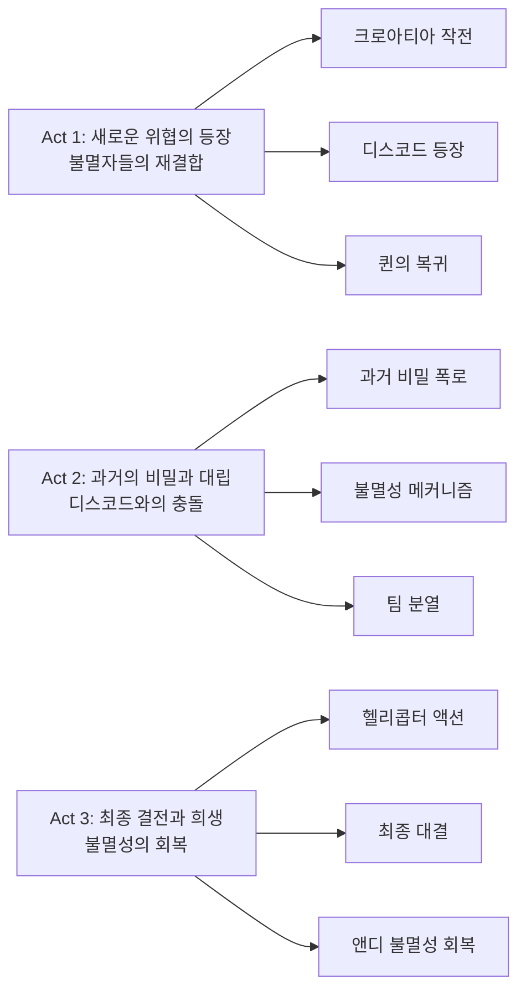

5년간의 기다림 끝에 돌아온 불멸의 전사들. 2020년 팬데믹 시기 넷플릭스의 구원투수 역할을 했던 '올드 가드'의 속편이 드디어 2025년 7월 2일 공개되었다. 샤를리즈 테론이 다시 한 번 앤디 역할을 맡고, 우마 서먼과 헨리 골딩이 새롭게 합류한 '올드 가드 2'는 과연 5년의 공백을 메울 만한 작품일까? 아쉽게도 대답은 "반반"이다.

||
|:---:|
|*The Old Guard 2 (2025) - 넷플릭스 오리지널 액션 블록버스터*|

## 개요

### 영화 정보
* 제목: The Old Guard 2 / 올드 가드 2
* 감독: 빅토리아 마호니 (Victoria Mahoney)
* 주연: 샤를리즈 테론, 우마 서먼, 키키 레인, 헨리 골딩, 치웨텔 에지오포르
* 장르: 액션, 슈퍼히어로, 판타지
* 상영시간: 105분 (1시간 45분)
* 개봉일: 2025.07.02
* 배급: 넷플릭스
* 평점: 로튼 토마토 비평가 28%, 관객 44%

### 추천 대상
* **액션 영화 팬**: 헬리콥터 액션과 격투 장면을 즐기는 관객
* **첫 번째 영화 팬**: 올드 가드 시리즈의 연속성을 원하는 관객
* **샤를리즈 테론 팬**: 액션 여왕의 새로운 모습을 보고 싶은 관객
* **넷플릭스 오리지널 애호가**: 스트리밍 플랫폼의 대작을 즐기는 관객

## 완전 스토리 로드맵

**🎬 스포일러 전체 공개 - 이미 영화를 본 독자를 위한 완전한 줄거리 재구성**

### 3막 구조 분석

### **Act 1: 새로운 위협의 등장**

**크로아티아 빌라 작전**

크로아티아의 고급 빌라에서 무기 거래를 저지하는 불멸자 팀의 작전으로 영화가 시작된다. 앤디(샤를리즈 테론), 나일(키키 레인), 조(마르완 켄자리), 니키(루카 마리넬리)가 협력하여 테러리스트들의 무기 거래를 막는다. 새롭게 합류한 코플리(치웨텔 에지오포르)와 함께하는 팀워크가 인상적이지만, '테이큰 3' 수준의 과도한 편집으로 인해 액션의 박력이 반감된다.

**디스코드의 등장**

작전 후 팀이 안전한 곳에서 휴식을 취하는 중, 갑자기 우마 서먼이 연기하는 디스코드가 등장한다. 그녀는 앤디보다도 오래된 고대의 불멸자로, "매 순간이 죽음을 향한 걸음이다"라는 대사로 시작되는 철학적 관점을 제시한다. 디스코드는 인류의 반복되는 전쟁과 폭력에 절망하여 아예 인류를 멸망시키려는 극단적인 결론에 도달한 캐릭터다.

**퀸의 복귀**

바다 밑에서 500년간 고통받던 퀸(베로니카 응오)이 복귀한다. 끊임없이 죽고 부활하기를 반복하며 광기에 빠진 그녀의 모습은 불멸이라는 '축복'이 얼마나 잔혹한 '저주'가 될 수 있는지를 보여준다. 퀸은 디스코드와 손을 잡고 세상을 파괴하려는 계획을 세운다.

### **Act 2: 과거의 비밀과 대립**

**투아의 등장과 불멸성의 비밀**

앤디의 오랜 친구이자 동료인 불멸자 투아(헨리 골딩)가 등장한다. 그는 불멸성의 비밀을 알고 있는 듯한 신비로운 캐릭터로, 새로운 불멸자가 나타날 때마다 기존의 불멸자 중 누군가는 능력을 잃는다는 충격적인 사실을 폭로한다. 이는 앤디가 불멸성을 잃은 이유를 설명해주는 핵심 설정이다.

**팀 내부의 분열**

불멸성의 메커니즘에 대한 새로운 정보로 인해 팀 내부에 혼란이 생긴다. 나일은 새로운 불멸자들의 등장이 기존 팀원들에게 위협이 될 수 있다고 우려하고, 조와 니키는 과거의 동료들이 실제로는 능력을 잃었을 가능성에 대해 의문을 제기한다.

**디스코드의 계획 폭로**

디스코드와 퀸은 세계 주요 도시들에 동시에 테러를 일으켜 인류 문명을 파괴하려는 계획을 세운다. 그들의 목표는 인류의 반복되는 폭력과 전쟁에 종지부를 찍는 것이다. 이 계획을 막기 위해 불멸자 팀은 분산되어 각각 다른 도시로 향한다.

### **Act 3: 최종 결전과 희생**

**헬리콥터 액션 시퀀스**

영화의 하이라이트인 헬리콥터 액션 시퀀스가 펼쳐진다. 테론이 직접 언급한 이 장면은 실제 헬리콥터에 매달려 촬영되었으며, '미션 임파서블' 시리즈를 연상시키는 스케일과 긴장감을 자랑한다. 앤디가 헬리콥터에 매달려 디스코드와 격투하는 장면은 영화의 가장 인상적인 순간 중 하나다.

**고대 원형경기장에서의 최종 대결**

로마의 치네치타 스튜디오에서 제작된 고대 원형경기장을 연상시키는 세트에서 앤디와 디스코드의 최종 대결이 펼쳐진다. 이 싸움은 단순한 액션을 넘어선 철학적 대화다. 절망과 희망, 파괴와 보호에 대한 근본적인 가치관의 충돌을 보여준다.

**앤디의 불멸성 회복**

부커(마티아스 슈나에르츠)의 도움으로 앤디가 다시 불멸의 능력을 얻게 되는 장면은 감정적으로 충격적이면서도 희망적이다. 이 과정에서 불멸성의 메커니즘이 더욱 자세히 설명되며, 새로운 불멸자들의 등장이 기존 불멸자들에게 미치는 영향이 명확해진다.

**클리프행어 엔딩**

영화는 세 번째 영화를 염두에 둔 클리프행어로 끝난다. 새로운 불멸자들의 등장과 함께, 불멸자들의 세계가 더욱 복잡해질 것임을 암시한다.

## 주요 등장인물

### 앤드로마케 "앤디" (샤를리즈 테론)

**캐릭터 배경**: 6000년을 살아온 고대 스키타이의 전사. 시즌1에서 불멸의 능력을 잃었지만 여전히 팀의 리더 역할을 한다. 인류의 선을 위해 수천 년간 싸워온 그녀는 이제 불멸성 없이도 팀을 이끌어야 하는 새로운 도전에 직면한다.

**연기 분석**: 테론은 이번 작품에서도 강인하면서도 취약한 캐릭터의 이중성을 완벽하게 연기한다. 불멸성을 잃은 후의 불안과 두려움, 그리고 그럼에도 불구하고 팀을 보호하려는 강인한 의지를 동시에 표현한다. 특히 헬리콥터에 매달린 액션 시퀀스는 그녀의 액션 여왕다운 면모를 다시 한 번 증명한다.

**주요 대사**: "나는 6000년을 살았지만, 이제 처음으로 진짜 죽음을 두려워한다."

**캐릭터 아크**: 불멸성 상실 → 절망과 불안 → 팀과의 유대 강화 → 새로운 불멸성 회복

### 디스코드 (우마 서먼)

**캐릭터 배경**: 앤디보다도 오래된 고대의 불멸자. 인류의 반복되는 전쟁과 폭력에 절망하여 아예 인류를 멸망시키려는 극단적인 결론에 도달한 캐릭터다. 수천 년간 인류의 악행을 지켜보며 절망에 빠진 그녀는 이제 복수를 위해 행동한다.

**연기 분석**: 서먼은 '킬 빌'에서 보여준 카리스마를 그대로 가져와 강력한 악역을 완성했다. 절망과 광기, 그리고 고대의 지혜가 뒤섞인 복잡한 캐릭터를 연기한다. "매 순간이 죽음을 향한 걸음이다"라는 대사로 시작되는 그녀의 철학은 영화 전체의 톤을 결정한다.

**주요 대사**: "매 순간이 죽음을 향한 걸음이다. 그리고 나는 그 길을 너무 오래 걸어왔다."

**캐릭터 동기**: 인류의 반복되는 폭력에 대한 절망 → 세계 멸망을 통한 종지부

### 퀸 (베로니카 응오)

**캐릭터 배경**: 시즌1에서 바다 밑 철 처녀 속에 갇혀 500년간 고통받던 불멸자. 끊임없이 죽고 부활하기를 반복하며 광기에 빠진 그녀는 이제 복수심에 불타 디스코드와 손을 잡고 세상을 파괴하려 한다.

**연기 분석**: 응고의 연기는 억압된 분노와 광기를 절묘하게 표현한다. 500년간의 고통으로 인한 정신적 불안정과 복수에 대한 집착을 자연스럽게 연기한다. 특히 광기에 빠진 순간들의 연기는 관객에게 강한 인상을 남긴다.

**주요 대사**: "500년간 죽고 살고를 반복했다. 이제 그 고통을 모두에게 돌려주겠다."

**캐릭터 트라우마**: 500년간의 고문 → 광기와 복수심 → 파괴적 행동

### 투아 (헨리 골딩)

**캐릭터 배경**: 앤디의 오랜 친구이자 동료인 불멸자. 불멸성의 비밀을 알고 있는 듯한 신비로운 캐릭터로, 새로운 불멸자들의 등장이 기존 불멸자들에게 미치는 영향을 이해하고 있다.

**연기 분석**: 골딩은 '크레이지 리치 아시안'과는 완전히 다른 모습을 보여준다. 고대의 지혜와 현대적 감각을 동시에 가진 캐릭터를 연기하며, 불멸성의 메커니즘에 대한 설명자 역할을 자연스럽게 수행한다.

**주요 대사**: "새로운 불멸자가 나타날 때마다, 기존의 누군가는 능력을 잃는다. 그것이 불멸성의 법칙이다."

**캐릭터 역할**: 지혜로운 조언자 → 불멸성 메커니즘의 해설자

### 나일 프리먼 (키키 레인)

**캐릭터 배경**: 전작에서 새롭게 합류한 전직 해병대원 출신 불멸자. 팀의 막내이자 도덕적 나침반 역할을 한다. 현대적인 군사 훈련을 받은 그녀는 팀에 새로운 전투 기술과 전략적 사고를 제공한다.

**연기 분석**: 레인은 액션 시퀀스에서 한층 성장한 연기력을 보여준다. 전직 군인의 전문성과 불멸자로서의 새로운 정체성 사이에서 균형을 찾아가는 과정을 자연스럽게 표현한다.

**주요 대사**: "나는 군인이었고, 이제 불멸자다. 하지만 도덕적 판단은 변하지 않는다."

**캐릭터 성장**: 군인 → 불멸자 → 팀의 도덕적 지도자

### 코플리 (치웨텔 에지오포르)

**캐릭터 배경**: 새롭게 합류한 불멸자 팀의 멤버. 현대적인 군사 기술과 전략적 사고를 바탕으로 팀에 기여한다. 그의 과거와 불멸자가 된 과정은 영화에서 부분적으로만 드러난다.

**연기 분석**: 에지오포르의 연기는 신뢰감과 전문성을 잘 표현한다. 팀의 새로운 멤버로서 기존 멤버들과의 관계 형성 과정을 자연스럽게 그려낸다.

**주요 대사**: "우리는 함께 더 강하다. 그것이 팀의 힘이다."

**캐릭터 역할**: 새로운 팀원 → 전략적 파트너

### 조 (마르완 켄자리)

**캐릭터 배경**: 불멸자 팀의 오랜 멤버. 앤디의 충실한 동료이자 팀의 핵심 전투원 중 하나다. 그의 과거와 불멸자가 된 과정은 시리즈에서 계속해서 조금씩 드러나고 있다.

**연기 분석**: 켄자리는 팀의 안정감을 제공하는 연기를 한다. 앤디에 대한 충성과 팀에 대한 헌신을 자연스럽게 표현한다.

**주요 대사**: "우리는 가족이다. 그 어떤 것도 우리를 갈라놓을 수 없다."

**캐릭터 역할**: 충실한 동료 → 팀의 안정감

### 니키 (루카 마리넬리)

**캐릭터 배경**: 불멸자 팀의 또 다른 멤버. 조와 함께 팀의 핵심 전투원 역할을 한다. 그의 과거와 불멸성 획득 과정은 시리즈에서 점진적으로 밝혀지고 있다.

**연기 분석**: 마리넬리는 팀의 젊은 에너지를 제공하는 연기를 한다. 전투에서의 용기와 팀에 대한 헌신을 잘 표현한다.

**주요 대사**: "우리는 함께 싸우고, 함께 살아간다."

**캐릭터 역할**: 젊은 전사 → 팀의 에너지

### 부커 (마티아스 슈나에르츠)

**캐릭터 배경**: 전작에서 앤디를 배신했던 전 불멸자. 이번 작품에서는 앤디의 불멸성 회복에 중요한 역할을 한다. 그의 과거와 현재의 행동 동기가 영화에서 중요한 역할을 한다.

**연기 분석**: 슈나에르츠는 복잡한 감정을 가진 캐릭터를 연기한다. 과거의 배신에 대한 후회와 현재의 속죄 의지를 동시에 표현한다.

**주요 대사**: "나는 실수를 했다. 이제 그것을 바로잡을 시간이다."

**캐릭터 아크**: 배신자 → 속죄자 → 구원자

### 메로 (샤를리즈 테론의 과거 모습)

**캐릭터 배경**: 앤디의 과거 모습으로, 플래시백 장면에서 등장한다. 고대 스키타이의 전사로서의 그녀의 모습을 보여준다.

**연기 분석**: 테론은 과거의 젊고 강인한 전사 모습을 연기한다. 현재의 앤디와는 다른 에너지와 카리스마를 보여준다.

**주요 대사**: "나는 불멸의 전사다. 이것이 내 운명이다."

**캐릭터 의미**: 과거의 영광 → 현재의 회귀 가능성

## 시각적 완성도와 연출

### 빅토리아 마호니의 연출력

전작의 지나 프린스-바이스우드 감독을 이어받은 빅토리아 마호니는 '스타워즈: 더 라이즈 오브 스카이워커'의 세컨 유닛 디렉터 출신이다. 그녀의 연출은 전작에 비해 더 화려하고 스케일이 크지만, 감정적 깊이 면에서는 아쉬움이 남는다.

마호니는 액션 시퀀스에서는 확실한 재능을 보여주지만, 캐릭터 간의 관계와 감정적 유대를 그려내는 부분에서는 전작에 미치지 못한다. 특히 불멸자들 사이의 가족 같은 유대감이 첫 번째 영화만큼 잘 전달되지 않는다.

### 세트 디자인과 촬영지

로마의 치네치타 스튜디오에서 대부분 촬영된 이 영화는 웅장한 스케일을 자랑한다. 20개 이상의 사운드 스테이지를 활용한 세트들은 고대 유적부터 현대적 비밀 기지까지 다양한 배경을 제공한다. 촬영 중 화재로 잠시 중단되는 우여곡절도 있었지만, 결과적으로는 시각적으로 만족스러운 완성도를 보여준다.

### 액션 시퀀스의 편집 문제

아쉽게도 액션 시퀀스의 편집은 현대 액션 영화의 고질적인 문제를 그대로 답습한다. 너무 잦은 컷과 흔들리는 카메라로 인해 액션의 흐름이 끊기고, 관객이 무엇이 일어나고 있는지 파악하기 어려운 순간들이 많다.

## 작품 평가

### 캐스팅의 승리

우마 서먼의 합류는 확실히 영화의 가장 큰 장점이다. '킬 빌'의 베아트릭스 키도를 연상시키는 그녀의 카리스마는 여전히 강력하며, 디스코드라는 캐릭터에 완벽하게 어울린다. 헨리 골딩 역시 기존의 이미지를 탈피한 새로운 모습을 보여주며 좋은 인상을 남긴다.

샤를리즈 테론은 여전히 액션 여왕다운 면모를 과시한다. 49세의 나이에도 불구하고 직접 수행한 스턴트들은 경이로울 정도다. 다만 전작에서 보여준 캐릭터의 복잡성과 깊이는 다소 줄어든 느낌이다.

### 스토리텔링의 아쉬움

5년을 기다린 속편치고는 스토리가 예측 가능하다는 점이 가장 큰 단점이다. 디스코드와 퀸의 동기는 이해할 만하지만, 그들의 계획과 목표가 명확하지 않다. 특히 세계 멸망이라는 거대한 목표에 비해 구체적인 실행 방법이나 과정이 부족하다.

불멸성의 메커니즘에 대한 새로운 설정들은 흥미롭지만, 충분히 탐구되지 못한 채 서둘러 넘어가는 느낌이다. 앤디가 불멸성을 되찾는 과정 역시 너무 쉽게 해결되어 긴장감이 떨어진다.

### 액션과 드라마의 불균형

전작이 액션과 캐릭터 드라마 사이의 균형을 잘 맞췄다면, 이번 작품은 액션에 치중하느라 캐릭터들의 내면적 성장이나 관계 발전이 부족하다. 특히 불멸자들 사이의 가족 같은 유대감이 첫 번째 영화만큼 잘 그려지지 않는다.

액션 시퀀스 자체는 스케일과 스펙터클 면에서 전작을 능가하지만, 감정적 몰입도는 떨어진다. 관객이 캐릭터들에게 감정적으로 투자할 시간이 부족한 것이다.

## 시리즈의 미래와 가능성

### 세 번째 영화의 가능성

영화 말미의 클리프행어는 분명히 세 번째 영화를 염두에 둔 것이다. 하지만 테론은 인터뷰에서 "절대 확신할 수 없다"며 신중한 입장을 보였다. 넷플릭스의 정책 변화와 이번 작품의 비교적 저조한 평점을 고려하면, 세 번째 영화의 제작 여부는 불투명하다.

빅토리아 마호니 감독 역시 다른 프로젝트 때문에 3편 연출은 어려울 것 같다고 밝혔다. 이는 시리즈의 연속성 면에서 우려스러운 부분이다.

### 확장 유니버스의 잠재력

그렉 루카의 원작 코믹스에는 아직 영화화되지 않은 풍부한 스토리가 남아있다. 불멸자들의 수천 년에 걸친 역사, 다른 불멸자들의 이야기 등은 스핀오프나 프리퀄의 소재가 될 수 있다. 하지만 이번 작품의 반응을 보면 당분간은 어려울 것 같다.

## 기술적 측면

### 특수효과와 액션 코리오그래피

불멸자들의 재생 능력을 표현하는 특수효과는 전작 수준을 유지한다. 상처가 아물고 총상이 치유되는 과정은 여전히 인상적이다. 하지만 일부 CG 작업, 특히 대규모 폭발이나 파괴 장면에서는 예산의 한계가 느껴진다.

액션 코리오그래피는 각 캐릭터의 개성을 잘 살렸다. 앤디의 고전적이면서도 효율적인 전투 스타일, 나일의 현대적인 군사 기술, 디스코드의 압도적인 파워 등이 잘 구분된다.

### 음악과 사운드 디자인

음악은 전작만큼 인상적이지 않다. 첫 번째 영화의 감정적인 순간들을 더욱 돋보이게 했던 음악적 센스가 아쉽게도 이번 작품에서는 찾기 어렵다. 액션 시퀀스의 사운드 디자인은 만족스럽지만, 전체적인 음향적 정체성은 모호하다.

## 사회적 메시지와 현대적 의미

### 여성 액션 영화의 현주소

테론은 인터뷰에서 "여성 주연의 액션 영화는 여전히 제작이 어렵다. 남성들은 쉽게 기회를 얻지만 여성들은 그렇지 않다"고 토로했다. 이는 할리우드의 성별 불평등 문제를 다시 한 번 조명한다.

'올드 가드' 시리즈는 강인한 여성 캐릭터들을 주인공으로 내세운 몇 안 되는 대작 액션 영화 중 하나다. 비록 이번 속편이 아쉬운 부분이 있지만, 이런 영화들이 계속 만들어져야 한다는 점에서 의의가 있다.

### 불멸과 인간성에 대한 철학

영화가 던지는 근본적인 질문은 "영원히 산다는 것이 축복일까, 저주일까?"다. 디스코드와 퀸의 절망, 앤디의 피로감, 그리고 나일의 새로운 희망은 모두 이 질문에 대한 다른 답변들이다.

특히 현대 사회의 반복되는 폭력과 불의에 대한 피로감은 많은 관객들에게 공감을 불러일으킬 것이다. 디스코드의 "인류는 변하지 않는다"는 절망적 관점과 앤디의 "그럼에도 우리는 계속 싸워야 한다"는 희망적 관점의 대립은 현재 우리가 직면한 여러 문제들과 맞닿아 있다.

## 결론

'올드 가드 2'는 완벽한 속편은 아니지만, 그렇다고 완전한 실패작도 아니다. 샤를리즈 테론과 우마 서먼의 카리스마, 몇몇 인상적인 액션 시퀀스, 그리고 불멸성에 대한 흥미로운 설정들은 분명히 볼 만한 가치가 있다.

하지만 5년을 기다린 속편치고는 아쉬움이 많이 남는다. 전작의 감정적 깊이와 캐릭터들 간의 유대감을 제대로 계승하지 못했고, 스토리텔링 면에서도 예측 가능한 전개가 아쉽다.

그럼에도 불구하고 이 영화는 여전히 넷플릭스에서 즐길 만한 오락영화다. 특히 액션 영화를 좋아하는 관객들이나 첫 번째 영화의 팬들에게는 추천할 만하다. 다만 너무 큰 기대는 하지 않는 것이 좋겠다.

불멸의 전사들의 이야기가 여기서 끝날지, 아니면 더 발전된 모습으로 돌아올지는 시간이 말해줄 것이다. 하지만 확실한 것은 샤를리즈 테론이 여전히 액션 장르에서 독보적인 존재감을 가지고 있다는 사실이다.

**평점: ★★★☆☆ (3/5)**

*"불멸은 축복이 아니라 책임이다. 그리고 때로는 무거운 짐이기도 하다."* 