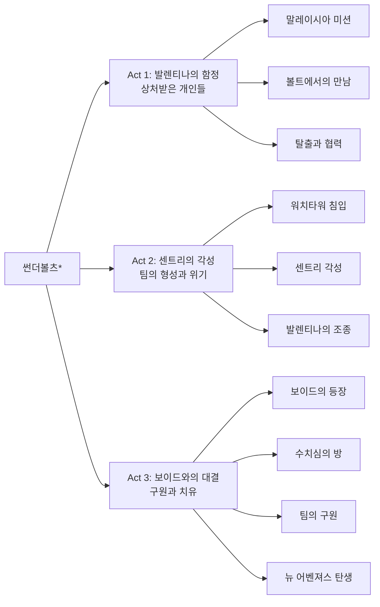
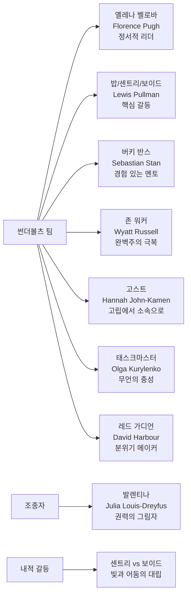

마블 시네마틱 유니버스에서 처음으로 정신 건강, 트라우마, 치유라는 테마를 본격적으로 다루는 작품이다. 각기 상처를 가진 안티히어로들이 서로의 약점을 이해하고, 팀워크를 통해 성장하며 진정한 구원과 연대를 경험한다. 화려한 액션보다는 캐릭터 내면의 변화와 심리적 갈등, 그리고 센트리/보이드라는 복합적 존재의 상징성을 통해 인간성 회복의 메시지를 전달한다. 기존 MCU와 차별화된 성숙한 스토리텔링이 돋보이며, 완벽하지 않은 영웅들이 서로를 치유하는 과정을 통해 관객에게 깊은 감동과 공감을 선사한다.

## 개요

### 영화 정보

* 제목: Thunderbolts\* / 썬더볼츠*
* 감독: 제이크 슈라이어 (Jake Schreier)
* 주연: 플로렌스 퓨, 세바스찬 스탠, 루이스 풀먼, 와이어트 러셀
* 장르: 액션 / 드라마 / 심리 스릴러
* 상영시간: 127분
* 개봉일: 2025년 5월 2일 (한국)

### **추천 대상**

* **MCU 팬들**: 새로운 방향성을 원하는 관객
* **캐릭터 드라마 선호층**: 심리적 깊이 있는 스토리를 좋아하는 관객
* **정신 건강 관심층**: 트라우마와 치유 과정에 관심 있는 관객
* **성인 관객**: 성숙한 테마를 다룬 슈퍼히어로 영화를 원하는 관객

## 완전 스토리 로드맵 (Complete Story Roadmap)

### **3막 구조 분석**

### **Act 1: 상처받은 개인들의 우연한 만남 (Setup)**

**오프닝: 말레이시아 연구소**

옐레나가 발렌티나의 지시로 "프로젝트 센트리" 관련 증거를 파괴하는 임무를 수행합니다. 이 장면에서 벽에 타버린 인체 흔적들이 나타나는데, 이는 후에 보이드의 능력을 암시하는 중요한 복선입니다. 발렌티나는 의회 탄핵 위기에 몰려 있으며, 그녀의 불법 작전들이 드러나면서 자신과 연관된 모든 증거를 없애려 합니다.

**볼트에서의 운명적 만남**

발렌티나는 의회 조사를 피하기 위해 자신의 요원들을 제거하려 합니다. 옐레나, 존 워커, 고스트, 태스크마스터를 각각 다른 핑계로 유타의 지하 시설 "볼트"로 유인합니다. 서로를 적으로 오인한 이들의 격투 중 수수께끼의 남성 "밥" (루이스 풀먼)이 등장합니다. 이때 각 캐릭터의 내면적 공허감이 드러나기 시작합니다 - 옐레나는 나타샤를 잃은 후의 외로움, 존은 캡틴 아메리카로서의 실패, 고스트의 정체성 혼란, 태스크마스터의 기억 상실로 인한 혼란 등이 미묘하게 표현됩니다.

**협력과 탈출: 첫 번째 팀워크**

시설 소각 시스템이 작동하면서 이들은 생존을 위해 협력해야 합니다. 밥과의 접촉을 통해 "수치심의 방(Room of Shame)"이라는 개념이 처음 등장하며, 각자의 트라우마가 드러나기 시작합니다. 특히 밥은 자신의 과거를 기억하지 못하면서도 깊은 죄책감과 외로움에 시달리고 있음이 드러납니다. 이 과정에서 레드 가디언(데이비드 하버)과 버키 반스(세바스찬 스탠)가 합류하며, 진정한 팀의 형태를 갖추기 시작합니다.

### **Act 2: 센트리의 각성과 팀의 심리적 성장 (Confrontation)**

**워치타워 침입과 진실의 발견**

발렌티나가 밥을 데려간 아벤져스 타워(현 워치타워)에 팀이 침입합니다. 이 과정에서 밥이 센트리 프로젝트의 생존자임이 밝혀지고, 그의 이중 정체성(센트리/보이드)의 진실이 드러납니다. 발렌티나의 비밀 실험으로 만들어진 센트리는 슈퍼맨에 버금가는 힘을 가졌지만, 그와 동시에 파괴적인 어둠의 존재인 보이드도 함께 탄생했습니다. 팀원들은 각자의 과거 실패와 상처를 마주하면서도 서로를 지지하는 모습을 보이기 시작합니다.

**센트리의 각성과 내적 갈등**

발렌티나의 조종 하에 센트리가 각성하며 압도적인 힘을 보여줍니다. 하지만 그는 발렌티나의 명령에 완전히 복종하지 않으며, 자신만의 의지를 보입니다. 이 장면에서 센트리의 복잡한 정신 상태가 드러나는데, 그는 선량한 영웅이 되고 싶어하지만 내면의 어둠(보이드)을 통제할 수 없어 괴로워합니다. 팀원들은 밥의 인간적인 면을 보며 그를 구하려는 의지를 다집니다.

**킬 스위치와 "죽음": 트라우마의 폭발**

발렌티나의 조수 멜(제랄딘 비스와나단)이 비상 킬 스위치를 작동시켜 센트리를 "죽입니다". 이는 보이드 등장의 직접적인 원인이 됩니다. 이 장면은 단순한 액션이 아니라 트라우마가 어떻게 파괴적인 힘으로 변화하는지를 상징적으로 보여줍니다.

### **Act 3: 보이드와의 대결, 구원과 치유 (Resolution)**

**보이드의 등장: 집단적 트라우마의 현현**

센트리의 죽음 후 그의 어둠 속성인 보이드가 나타나 뉴욕을 공격하기 시작합니다. 사람들을 "그림자"로 만드는 보이드의 능력은 집단적 트라우마와 절망을 상징합니다. 맨해튼이 어둠에 뒤덮이면서 주민들이 공포에 빠지는 장면은 현대 사회의 정신적 위기를 은유적으로 표현합니다. 이때 팀원들은 개별적으로 싸우는 것이 아니라 진정한 팀워크를 발휘하기 시작합니다.

**수치심의 방: 집단 치유의 과정**

팀원들이 보이드의 정신 세계인 "수치심의 방"으로 들어가 밥을 구하려 시도합니다. 이곳에서 각자의 최악의 기억과 직면하게 됩니다:

* **옐레나**: 나타샤의 죽음에 대한 죄책감과 자신만 살아남았다는 생존자 증후군
* **버키**: 윈터 솔져로서 저지른 수많은 살인에 대한 죄책감
* **존 워커**: 캡틴 아메리카로서의 실패와 분노 조절 실패
* **고스트**: 자신의 정체성에 대한 혼란과 소속감 부족
* **레드 가디언**: 가족을 지키지 못했다는 죄책감

하지만 이들은 서로의 아픔을 이해하고 지지하는 과정에서 진정한 팀이 됩니다. 이는 솔로몬 애쉬(Solomon Asch)의 사회심리학 이론을 실현한 장면으로, 개인이 그룹과 상호작용하면서 서로에게 의미를 부여하고 성장하는 과정을 보여줍니다.

**구원과 새로운 시작: 사랑의 힘**

옐레나가 밥에게 "우리는 혼자가 아니며, 내면의 공허함을 다른 사람들과 함께 나누어야 한다"고 말하며 그를 어둠에서 구해냅니다. 이는 영화 초반 그녀가 "우리는 모두 혼자"라고 말했던 것과 대비되는 중요한 변화입니다. 팀의 지지와 옐레나의 희생적 사랑으로 밥이 보이드를 극복하고 센트리로 돌아옵니다.

발렌티나의 마지막 승부수인 "뉴 어벤져스" 발표를 오히려 역이용하여, 팀은 진정한 영웅이 되기로 결심합니다. 이들은 더 이상 과거의 실패에 얽매이지 않고, 서로를 지지하는 새로운 가족이 되어 미래를 향해 나아갑니다.

**포스트 크레딧: 새로운 갈등의 씨앗**

1년 후, "뉴 어벤져스"로 활동하던 팀은 샘 윌슨(앤서니 맥키)과의 법적 분쟁에 휘말리게 됩니다. 샘이 "어벤져스" 상표권을 등록하면서 팀명 사용에 제재를 가하고, 이는 버키와 샘의 우정에 금이 가게 만듭니다. 이는 **Avengers: Doomsday**로 이어지는 새로운 갈등의 씨앗을 뿌리는 장면입니다.

### 심리학적 테마와 상징

**개인-집단 관계의 변화**

영화는 솔로몬 애쉬의 사회심리학 이론을 바탕으로, 개인이 어떻게 집단과의 상호작용을 통해 성장하는지를 보여줍니다. 각 캐릭터는 개별적인 트라우마를 가지고 있지만, 팀이 되면서 서로의 상처를 치유하고 새로운 의미를 찾게 됩니다.

**트라우마와 치유**

"수치심의 방"은 집단 상담 치료의 은유로, 개인의 트라우마가 공유되고 치유되는 과정을 상징합니다. 각자의 최악의 기억을 마주하지만, 혼자가 아니라는 사실을 깨달으면서 치유의 길을 찾습니다.

**정체성의 재구성**

모든 캐릭터가 과거의 실패한 정체성에서 벗어나 새로운 자아를 구성하는 과정을 그립니다. 특히 밥/센트리/보이드의 삼중 정체성은 인간 정신의 복잡성을 상징합니다.

**소속감과 목적의식**

영화는 인간이 혼자서는 완전할 수 없으며, 타인과의 연결을 통해 삶의 의미를 찾는다는 메시지를 전달합니다. 팀원들은 각자의 공허함을 채우기 위해 새로운 목적을 찾고, 서로에게 의미 있는 존재가 됩니다.

### 연출과 영상미

제이크 슈라이어(Jake Schreier) 감독은 액션 시퀀스보다는 캐릭터의 내면에 집중한 연출을 보여줍니다. 특히 "수치심의 방" 시퀀스에서는 각 캐릭터의 트라우마를 시각적으로 구현하여 깊은 인상을 남깁니다. 영화는 슈퍼히어로 장르의 관습을 따르면서도, 인간 드라마에 무게를 둔 균형잡힌 작품으로 평가받습니다.

**Thunderbolts**는 단순한 액션 영화를 넘어서, 현대인의 정신적 위기와 치유, 그리고 진정한 소속감에 대한 깊이 있는 성찰을 담은 작품입니다. 2025년 5월 개봉 후 "엔드게임 이후 최고의 마블 영화"라는 평가를 받으며, MCU의 새로운 방향성을 제시한 의미 있는 작품으로 기록되었습니다.

## 등장인물 심층 분석 (Character Deep Analysis)

### 캐릭터 관계도

### **주인공: 옐레나 벨로바 (플로렌스 퓨)**

**캐릭터 개요**

* 기본 설정: 27세, 전직 위도우, 현재 발렌티나 소속 요원
* 핵심 목표: 나타샤의 죽음 이후 새로운 정체성과 목적 찾기
* 주요 갈등: 복수 욕구 vs 진정한 소속감에 대한 갈망

**성장 곡선**

* 복수에 사로잡힌 고독한 암살자 → 팀을 위해 희생할 줄 아는 진정한 영웅
* **나타샤의 그림자에서 벗어나 자신만의 영웅성 확립**

**동기와 욕망**

* 표면적 목표: 발렌티나의 임무 완수, 나타샤 복수
* 내면적 욕구: 진정한 가족과 소속감
* 두려움: 또다시 사랑하는 사람을 잃는 것

**갈등 구조**

* vs 자신: 나타샤와의 비교, 정체성 혼란
* vs 타인: 발렌티나의 조종, 팀원들과의 신뢰 형성
* vs 상황: 시스템의 도구로 사용당하는 현실

**상징적 의미**

트라우마로부터 회복되는 현대인의 모습을 대표하며, 개인적 상처를 집단적 치유로 승화시키는 과정을 보여줍니다.

### 핵심 캐릭터: 밥/센트리/보이드 (루이스 풀먼)

**캐릭터 개요**

* 기본 설정: 30대 중반, 전직 마약 중독자, 센트리 프로젝트 생존자
* 핵심 목표: 자신의 어둠(보이드)과 공존하며 평범한 삶 찾기
* 주요 갈등: 엄청난 힘 vs 정신적 불안정성

**성장 아크**

* 기억 잃은 무력한 존재 → 자신의 어둠을 받아들이는 완전한 존재
* **양극성과 자기 파괴 충동을 극복하며 진정한 자아 통합**

**동기와 욕망**

* 표면적 목표: 평범하고 안전한 일상
* 내면적 욕구: 자신의 어둠과 화해, 타인과의 진정한 연결
* 두려움: 보이드의 힘으로 사랑하는 사람들을 해치는 것

**갈등 구조**

* vs 자신: 센트리(선)와 보이드(악)의 내적 대립
* vs 타인: 발렌티나의 이용, 사회의 두려움과 거부
* vs 상황: 통제할 수 없는 힘과 그로 인한 책임감

**상징적 의미**

양극성 장애, 우울증 등 정신 건강 문제를 겪는 현대인의 상징이며, 어둠을 부정하지 않고 통합하는 성숙한 자아상을 제시합니다.

### **멘토 역할: 버키 반스 (세바스찬 스탠)**

**캐릭터 개요**

* 기본 설정: 107세, 전직 윈터 솔져, 현재 의회 의원
* 핵심 목표: 과거 트라우마를 극복한 경험으로 다른 이들 돕기
* 주요 갈등: 과거와의 화해 vs 새로운 책임감

**팀에서의 역할**

트라우마 극복의 성공 사례로서 다른 팀원들에게 희망과 방향성을 제시하는 정신적 지주 역할을 담당합니다.

**관계성 분석**

* 밥과의 관계: 같은 실험 피해자로서의 동질감과 이해
* 옐레나와의 관계: 나타샤를 통한 연결고리와 보호 본능
* 존과의 관계: 캡틴 아메리카 레거시에 대한 서로 다른 해석

**독특한 특징**

완전히 회복된 트라우마 생존자의 모델을 제시하지만, 동시에 과거를 완전히 지울 수는 없다는 현실적 메시지를 전달합니다.

### **성장형 캐릭터: 존 워커 (와이어트 러셀)**

**캐릭터 개요**

* 기본 설정: 35세, 전직 캡틴 아메리카, 현재 U.S. 에이전트
* 핵심 목표: 자신만의 방식으로 진정한 영웅 되기
* 주요 갈등: 완벽한 영웅에 대한 강박 vs 현실적 한계 인정

**성장 아크**

실패한 캡틴 아메리카의 그림자 → 자신만의 영웅성을 찾는 독립적 존재
[완벽주의에서 벗어나 불완전함을 받아들이는 성숙 과정]

**독특한 특징**

"완벽한 영웅"이라는 사회적 기대에 부응하려다 실패한 경험을 통해, 진정한 영웅성은 완벽함이 아닌 선택에 있다는 메시지를 전달합니다.

### **고립형 캐릭터: 고스트 (한나 존-카멘)**

**캐릭터 개요**

* 기본 설정: 29세, 양자 불안정 능력자, 전직 용병
* 핵심 목표: 진정한 소속감과 안정적인 관계 형성
* 주요 갈등: 물리적 고립 vs 정서적 연결 욕구

**관계성 분석**

양자 불안정으로 인한 물리적 고립을 경험해온 그녀에게 썬더볼츠는 처음으로 진정한 소속감을 느낄 수 있는 가족과 같은 존재입니다.

**독특한 특징**

페이징 능력을 통한 전술적 기여뿐만 아니라, 고립과 소외를 경험한 현대인들의 심리를 대변하는 캐릭터입니다.

### 빌런

### **주요 악역: 발렌티나 알레그라 드 폰테인 (줄리아 루이스-드레이퓨스)**

**캐릭터 개요**

* 기본 설정: 50대, CIA 국장, 정치적 야심가
* 핵심 목표: 정치적 생존과 권력 확장, 완벽한 통제 가능한 슈퍼솔져 군대 창설
* 주요 동기: 의회 탄핵 위기 극복, 자신의 불법 작전들 은폐

**악역으로서의 특징**

* **조종의 달인**: 각 요원들의 약점과 트라우마를 정확히 파악하여 조종 도구로 활용
* **냉혹한 실용주의자**: 목적을 위해서는 수단과 방법을 가리지 않는 마키아벨리즘적 성격
* **정치적 카멜레온**: 위기 상황에서도 순간적으로 상황을 자신에게 유리하게 뒤바꾸는 능력

**상징적 의미**

발렌티나는 현대 사회의 **권력 시스템이 개인을 소모품으로 취급하는 현실**을 상징합니다. 그녀는 상처받은 사람들을 치유하는 대신 그들의 약점을 악용하여 더 깊은 상처를 입히는 **독성 있는 권력자**의 전형을 보여줍니다.

**최종 운명**

영화 말미에 "뉴 어벤져스" 발표를 통해 오히려 자신이 만든 팀에게 역이용당하며, 정치적 몰락의 길을 걷게 됩니다. 이는 조종하려 했던 것들이 결국 자신을 넘어서는 아이러니를 보여줍니다.

### **심리적 악역: 보이드 (The Void)**

**존재의 본질**

* 센트리(밥)의 어둠의 인격체, 트라우마와 죄책감이 물질화된 존재
* 물리적 실체이면서 동시에 정신적 개념인 **추상적 악**의 구현
* 파괴를 통해서만 존재 의미를 찾는 **순수한 파괴 충동**

**능력과 위협**

* **그림자화**: 접촉한 사람들을 그림자로 만들어 존재 자체를 소거
* **어둠 조작**: 맨해튼 전체를 어둠으로 뒤덮는 막강한 파워
* **정신 침식**: 사람들의 절망과 두려움을 먹고 자라는 능력

**상징적 의미**

보이드는 **치유되지 않은 트라우마가 어떻게 파괴적 힘으로 변모하는지**를 보여주는 메타포입니다. 현대 사회의 정신 건강 위기, 우울증, 절망감 등을 시각적으로 구현한 존재로, 단순한 물리적 악역을 넘어선 **실존적 공포**를 대변합니다.

**극복 과정**

팀원들이 "수치심의 방"에서 집단 상담 과정을 통해 보이드를 이겨내는 장면은, **개인의 어둠은 혼자서는 극복할 수 없으며 타인과의 연대를 통해서만 치유 가능하다**는 메시지를 전달합니다.

### **보조 악역: 멜 (제랄딘 비스와나단)**

**캐릭터 특성**

* 발렌티나의 충실한 조수이자 센트리 프로젝트의 기술 담당자
* 표면적으로는 순종적이지만, 킬 스위치를 작동시키는 결정적 순간에 자신만의 판단력을 보임
* **시스템의 톱니바퀴**이면서 동시에 **시스템을 파괴하는 변수**

**역할과 의미**

멜은 **"악의 평범성"**(Banality of Evil)을 상징하는 캐릭터입니다. 거대한 악에 무비판적으로 협력하는 일반인들의 모습을 보여주며, 작은 선택 하나가 어떻게 큰 변화를 만들어낼 수 있는지를 보여줍니다.

### **악역 구조의 층위**

**1차원: 개인적 악 (발렌티나)**

* 개인의 욕망과 야심에서 비롯된 악
* 전통적인 빌런의 형태로 명확한 동기와 목표

**2차원: 시스템적 악 (정부/CIA)**

* 개인을 넘어선 제도적, 구조적 악
* 발렌티나도 결국 이 시스템의 일부이자 희생자

**3차원: 실존적 악 (보이드)**

* 인간 존재 자체에 내재된 어둠과 절망
* 치유와 연대를 통해서만 극복 가능한 근본적 악

### **악역들의 상호작용**

영화는 이 세 층위의 악이 어떻게 서로 연결되고 영향을 미치는지 보여줍니다:

1. **시스템적 악**이 개인들에게 트라우마를 가함
2. **개인적 악**(발렌티나)이 이 트라우마를 악용하여 더 큰 피해를 야기
3. 치유되지 않은 트라우마가 **실존적 악**(보이드)으로 변모
4. 최종적으로 **집단적 치유**를 통해 모든 층위의 악을 극복

### **악역의 현대적 의미**

**Thunderbolts**의 악역들은 단순한 "물리쳐야 할 적"이 아닙니다. 이들은 현대 사회의 복합적 문제들을 상징합니다:

* **발렌티나**: 권력의 부패와 개인의 도구화
* **보이드**: 정신 건강 위기와 사회적 절망
* **시스템**: 개인을 소외시키는 현대 사회 구조

이러한 다층적 악역 구조를 통해 영화는 **"진정한 악과의 싸움은 물리적 대결이 아닌 심리적 치유와 사회적 연대를 통해서만 가능하다"**는 메시지를 전달합니다.

영화의 결말에서 악역들이 완전히 소멸되지 않고 변화의 가능성을 암시하는 것도, 악을 단순히 제거할 대상이 아닌 **이해하고 치유해야 할 현실의 일부**로 바라보는 성숙한 관점을 보여줍니다.

## 요소별 심층 분석 (Component Deep Dive)

### **연기 & 캐스팅 분석**

| 배우 | 캐릭터 | 연기력 평가 | 캐스팅 적합성 | 특별한 점 |
|------|---------|-------------|---------------|-----------|
| 플로렌스 퓨 | 옐레나 | ★★★★★ | 완벽 | 감정의 섬세한 변화 표현 |
| 루이스 풀먼 | 밥/센트리/보이드 | ★★★★★ | 뛰어남 | 3중 인격의 완벽한 구분 |
| 세바스찬 스탠 | 버키 | ★★★★☆ | 좋음 | 성숙한 멘토 역할 소화 |
| 와이어트 러셀 | 존 워커 | ★★★★☆ | 좋음 | 복잡한 내면 갈등 표현 |
| 줄리아 루이스 드레퓌스 | 발렌티나 | ★★★☆☆ | 아쉬움 | 캐릭터 자체의 한계 |

### **연출 & 각본 분석**

**연출의 강점:**

* **정적 카메라 워크**: 과도한 흔들림 없는 안정적인 촬영
* **심리적 공간 시각화**: "수치심의 방" 개념의 창의적 구현
* **액션과 감정의 균형**: 액션 시퀀스와 캐릭터 드라마의 적절한 조화

**연출의 약점:**

* **중반부 페이싱**: 센트리 각성 이후 급작스러운 전개
* **3막 논리성**: 심리적 공간에서의 대결이 다소 추상적

**각본의 강점:**

* **캐릭터 아크**: 각 인물의 성장 과정이 명확하고 설득력 있음
* **테마 통합**: 트라우마 치유라는 주제가 스토리 전반에 일관되게 적용
* **대사의 진정성**: 특히 옐레나의 "혼자가 아니야" 등 핵심 메시지 전달

**각본의 약점:**

* **발렌티나 캐릭터**: 설정에 비해 너무 단순하고 무능한 모습
* **우연적 전개**: 일부 스토리 진행이 우연에 의존

### **음악 & 사운드 분석**

**혁신적인 음악적 시도:**

* **Son Lux의 아방가르드 스코어**: 기존 MCU와 차별화된 실험적 음악
* **심리적 사운드스케이프**: 보이드 장면에서의 불안감 조성
* **감정적 여운**: 팀의 결속을 강조하는 따뜻한 멜로디

### **영상미 & 촬영 분석**

**촬영 기법의 특징:**

* **실질적 무게감**: CGI 과의존 탈피한 물리적 액션
* **색감 조합**: 차가운 블루 톤과 따뜻한 골드 톤의 대비
* **공간 활용**: 밀폐된 볼트 vs 개방된 뉴욕의 대조

## 비교 분석 (Comparative Analysis)

### **장르별 비교**

**vs 가디언즈 오브 갤럭시 3 (2023):**

* **공통점**: 트라우마 팀, 가족 중심 스토리
* **차이점**: 썬더볼츠는 더 현실적이고 어두운 접근
* **성취도**: 썬더볼츠가 정신 건강 측면에서 더 깊은 탐구

**vs 어벤져스 (2012):**

* **팀 형성 과정**: 어벤져스는 외부 위협, 썬더볼츠는 내적 치유
* **리더십**: 어벤져스는 토니/스티브 중심, 썬더볼츠는 수평적 관계
* **갈등 해결**: 어벤져스는 액션, 썬더볼츠는 심리적 접근

### **타 스튜디오 비교**

**vs DC 스위사이드 스쿼드 (2021):**

* **캐릭터 깊이**: 썬더볼츠가 개별 캐릭터 아크에서 우세
* **톤**: 스위사이드 스쿼드는 다크 코미디, 썬더볼츠는 진지한 드라마
* **테마**: 두 작품 모두 구원이지만 접근 방식이 다름

## 숨겨진 레이어 (Hidden Layers)

### **정신 건강 메타포**

**센트리/보이드의 상징성:**

* **센트리**: 이상적 자아, 사회적 기대
* **보이드**: 억압된 트라우마, 자기 파괴 충동
* **밥**: 진정한 자아, 불완전하지만 진실한 모습

**"수치심의 방" 개념**

심리학에서 말하는 트라우마의 재경험과 PTSD 증상을 시각적으로 구현한 혁신적 장치입니다.

### **사회적 맥락**

**포스트 어벤져스 시대**

완벽한 영웅들의 시대가 끝난 후, 상처받고 불완전한 사람들이 어떻게 서로를 구원할 수 있는지에 대한 현실적 대안을 제시합니다.

**현대 사회의 고립감**

각 캐릭터가 겪는 고립과 소외는 현대 사회의 개인주의와 사회적 단절 문제를 반영합니다.

### **시각적 상징**

**색감 상징:**

* **블루**: 우울감, 고립감
* **골드**: 희망, 연결감
* **레드**: 분노, 트라우마
* **블랙**: 보이드, 절망

**공간 상징:**

* **볼트**: 감옥 같은 과거
* **워치타워**: 감시와 통제
* **뉴욕 하늘**: 자유와 가능성

---

## 제작 비하인드 (Behind the Scenes)

### **제작 과정의 특별함**

**감독 선택의 배경**

제이크 슈라이어는 인디 영화 《로봇 앤 프랭크》(2012)로 주목받은 감독으로, 인간적 드라마에 특화된 연출력을 인정받아 선택되었습니다.

**각본가의 경험**

조안나 칼로는 넷플릭스 《보잭 홀스맨》의 작가 출신으로, 정신 건강과 트라우마를 다룬 경험이 캐릭터 개발에 큰 도움이 되었습니다.

### **캐스팅 스토리**

**루이스 풀먼의 발탁**

원래 더 유명한 배우들이 고려되었지만, 풀먼의 오디션에서 보여준 3중 인격 연기가 결정적이었습니다.

**플로렌스 퓨의 요청**

그녀는 옐레나 캐릭터에 더 많은 감정적 깊이를 부여해달라고 요청했고, 이것이 영화의 정서적 중심축 강화로 이어졌습니다.

### **기술적 혁신**

**수치심의 방 구현**

실제 세트와 LED 볼륨 기술을 결합하여 각 캐릭터의 트라우마 공간을 물리적으로 구현했습니다.

**실용 특수효과**

보이드의 그림자 효과는 CGI를 최소화하고 실제 라이팅과 연기 효과를 활용했습니다.

## 종합 평가

**Thunderbolts**는 B급 악당들이 힘을 합쳐 더 강력한 악당을 물리치는 기본 설정은 매력적이지만, 중반부 이후 스토리 진행이 너무 우연에 의존하는 구조적 문제로 인해 완성도에 아쉬움이 남는 작품이다.

영화의 가장 큰 강점은 상처받은 개인들이 팀워크를 통해 성장하는 과정을 그린 캐릭터 드라마에 있다. 각자의 트라우마와 약점을 가진 안티히어로들이 서로의 아픔을 이해하고 지지하는 과정에서 진정한 가족 같은 유대감이 형성되는 모습은 감동적이다. 특히 "수치심의 방" 시퀀스에서 각 캐릭터가 자신의 최악의 기억과 직면하는 장면은 심리적 깊이를 더해주는 성공적인 연출이다.

하지만 센트리 각성 이후부터 스토리 진행이 급격히 우연에 의존하기 시작한다. 발렌티나의 조수 멜이 갑작스럽게 킬 스위치를 작동시키는 것, 보이드가 정확히 뉴욕을 공격하는 타이밍, 팀원들이 우연히 "수치심의 방"에 들어갈 수 있는 상황 등이 모두 너무 인위적으로 느껴진다. 이러한 우연적 전개는 캐릭터들의 능동적 선택보다는 상황에 끌려다니는 수동적 모습을 만들어내며, 스토리의 설득력을 떨어뜨린다.

연기 면에서는 플로렌스 퓨와 루이스 풀먼의 뛰어난 연기가 돋보인다. 퓨는 옐레나의 복잡한 내면 변화를 섬세하게 표현했고, 풀먼은 센트리/보이드/밥의 3중 인격을 완벽하게 구분하여 연기했다. 하지만 발렌티나 캐릭터는 설정에 비해 너무 단순하고 무능한 악역으로 그려져서 아쉬움이 크다.

기술적 측면에서는 "수치심의 방"의 시각적 구현과 실용 특수효과의 활용이 인상적이다. CGI에 과도하게 의존하지 않고 실제 세트와 라이팅을 활용한 접근은 영화에 물리적 무게감을 더해준다. 하지만 중반부 이후 급격한 페이싱 변화와 3막에서의 추상적 심리적 공간 대결은 일부 관객들에게 혼란을 줄 수 있다.

결론적으로 **Thunderbolts**는 매력적인 캐릭터들과 진정성 있는 감정선을 가진 작품이지만, 스토리 구조의 우연성과 중반부 이후의 급격한 전개 변화로 인해 완성도에 한계를 보인다. B급 악당들의 팀워크와 성장이라는 기본 설정은 성공적이었지만, 이를 뒷받침하는 스토리텔링의 완성도가 따라주지 못한 것이 가장 큰 아쉬움이다.

**최종 평점: ★★★★☆ (4.2/5)**

### **한 줄 평**

MCU의 새로운 패러다임을 제시한 성숙하고 감동적인 작품이지만, 일부 구조적 아쉬움이 완벽함을 가로막는다.

### **시리즈/후속작 전망**

**속편 가능성: 95%**

* 흥행 성공과 비평적 호평으로 속편 제작 거의 확실
* 뉴 어벤져스로서의 활동 기대
* 판타스틱 포와의 대결 가능성 시사

**확장 가능성:**

* 개별 캐릭터 스핀오프 (특히 센트리/보이드)
* 미래 MCU 페이즈에서의 핵심 팀 역할
* 다크 어벤져스 vs 뉴 어벤져스 구도 가능성

### **추천 작품**

* **유사한 팀 드라마**: 《가디언즈 오브 갤럭시 3》, 《X-포스》
* **정신 건강 테마**: 《스플릿》, 《문나이트》
* **안티히어로 장르**: 《데드풀》, 《스위사이드 스쿼드》

## 참고 자료 및 출처 (References & Sources)

### **주요 참고 자료**

**공식 자료**

* [마블 스튜디오 공식 홈페이지](https://marvelstudios.com/thunderbolts) - 영화 공식 정보
* [디즈니 배급사 보도자료](https://thewaltdisneycompany.com/thunderbolts-press) - 제작 및 마케팅 정보

### **관람 전 체크리스트**

**필수 사전 지식**

* [ ] 《블랙 위도우》(2021) - 옐레나 캐릭터 이해 필수
* [ ] 《팔콘 앤 윈터 솔져》(2021) - 존 워커 배경 이해
* [ ] 《앤트맨 앤 와스프》(2018) - 고스트 캐릭터 배경

**추천 선행 관람작**

* [ ] 《가디언즈 오브 갤럭시 3》- 비슷한 트라우마 팀 드라마
* [ ] 《로건》- 성숙한 슈퍼히어로 스토리의 좋은 예시

**관람 포인트**

* [ ] 각 캐릭터의 "수치심의 방" 내용 주의 깊게 관찰
* [ ] 센트리/보이드 변화 시점의 시각적 단서들 확인
* [ ] 팀워크 형성 과정의 섬세한 변화 체크
* [ ] 포스트 크레딧 신 반드시 확인 (MCU 미래 떡밥)