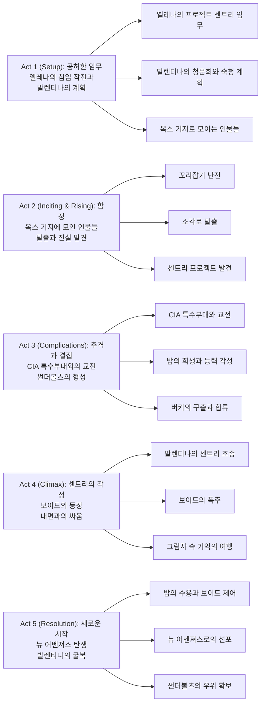

마블 시네마틱 유니버스(MCU)는 《어벤져스: 엔드게임》 이후 방향성을 잃은 것처럼 보였습니다. 하지만 《Thunderbolts*》(썬더볼츠)는 이러한 우려를 날려버리며, 상처받은 안티히어로들의 이야기를 통해 MCU의 새로운 가능성을 제시합니다. 이 영화는 단순한 액션 블록버스터를 넘어 정신 건강, 트라우마, 그리고 구원이라는 무거운 주제를 정면으로 다루며, 우리 모두가 내면에 품고 있는 어둠과 공허함에 대해 이야기합니다.

## 개요

### 영화 정보
* **제목**: Thunderbolts* / 썬더볼츠*
* **감독**: 제이크 슈라이어 (Jake Schreier)
* **각본**: 에릭 피어슨 (Eric Pearson), 조애나 칼로 (Joanna Calo), 커트 부시에크 (Kurt Busiek)
* **주연**: 플로렌스 퓨 (Florence Pugh), 세바스찬 스탠 (Sebastian Stan), 줄리아 루이스-드레이퍼스 (Julia Louis-Dreyfus), 루이스 풀먼 (Lewis Pullman), 데이비드 하버 (David Harbour), 와이어트 러셀 (Wyatt Russell), 한나 존-카먼 (Hannah John-Kamen), 올가 쿠릴렌코 (Olga Kurylenko)
* **장르**: 액션, 어드벤처, 크라임, 드라마, SF
* **상영시간**: 127분 (2시간 7분)
* **개봉일**: 2025.05.01 (호주), 2025.05.02 (미국)
* **제작사**: 마블 스튜디오 (Marvel Studios)
* **배급사**: 월트 디즈니 스튜디오 모션 픽처스
* **제작비**: 약 1억 8천만 달러
* **평점**: IMDb 7.1/10 (232K 평가), 메타크리틱 68/100

### 추천 대상
* **정신 건강에 관심 있는 관객**: 우울증, 트라우마, 공허함 등의 주제를 깊이 있게 다루며, 이를 슈퍼히어로 장르와 접목시킨 독특한 접근
* **캐릭터 중심 스토리 선호자**: 액션보다 캐릭터의 내면과 성장에 초점을 맞춘 이야기로, 각 캐릭터의 과거와 상처가 세밀하게 그려짐  
* **마블 팬**: 《블랙 위도우》, 《팔콘 앤 윈터 솔져》 등 이전 작품의 캐릭터들이 등장하며, MCU의 새로운 국면을 열어가는 작품

## 구조 분석

## 영화의 전체 내용 (스포일러 포함)

《Thunderbolts*》는 이미 영화를 관람한 분들을 위해 모든 스포일러를 포함하여 상세하게 작성되었습니다. 이 영화는 언니 나타샤(블랙 위도우)를 잃은 후 삶의 의미를 찾지 못하는 옐레나 벨로바의 이야기로 시작하여, 비슷한 상처를 가진 안티히어로들이 모여 진정한 팀이 되어가는 과정을 그립니다. 영화는 센트리/보이드라는 복합적 캐릭터를 통해 정신 건강과 내면의 어둠이라는 주제를 정면으로 다루며, 액션 블록버스터 장르에 새로운 깊이를 더합니다.

### Act 1 (Setup): 공허한 임무

**[S01] 옐레나의 독백 - 공허함**: 옐레나 벨로바는 언니 나타샤의 죽음 이후 인생에서 공허함(Void)을 느끼고 있다고 토로한다. 그녀는 여전히 발렌티나 알레그라 드 폰테인(CIA 국장)이 시킨 임무를 수행하고 있지만, 그 의미를 찾지 못하고 있다.

**[S02] 말레이시아 쿠알라룸푸르 침입**: 옐레나는 말레이시아 쿠알라룸푸르에 있는 어느 실험실에 침입한다. 이 실험실은 "프로젝트 센트리(Project Sentry)"라는 실험을 진행하고 있으며, 옐레나의 임무는 이 실험실의 연구 결과를 기록 말살하는 것이다.

**[S03] 연구원과의 대치**: 권한 접속을 위해 안면인식이 필요한데, 숨어있던 연구원이 나타나 옐레나에게 총을 겨눈다. 연구원은 "발렌티나는 이 프로젝트에 대해 오해하고 있다"라고 경고하지만, 교전 중 경비원이 빗나간 총알에 맞아 사망한다. 연구원은 생포되는 것을 거부하고 자신의 얼굴에 총을 쏴 자살해버린다.

**[S04] 폭발로 마무리**: 안면 인식을 사용할 수 없게 된 옐레나는 실험실이 있는 층 전체를 폭발시켜 자료들을 처리한다.

**[S05] 발렌티나의 청문회**: 하원 의원이 된 버키 반스가 탄핵 관련 질문을 받으며 청문회장에 입장한다. CIA 국장 발렌티나는 탄핵 소추를 당해 청문회에 불려왔으며, "어벤져스는 오지 않는다"라며 강하게 주장한다. 청문회 이후 불안함을 내비치며 비서 멜에게 모든 증거와 단서의 인멸을 지시한다.

**[S06] 옐레나와 레드 가디언**: 임무를 마친 옐레나는 양부인 알렉세이 쇼스타코프(레드 가디언)를 찾아간다. 옐레나는 인생의 의미가 없다며 한탄하지만, 알렉세이는 영웅적인 행동이 자신에게 큰 의미가 있었다고 말해준다. 이 대화에서 뭔가를 깨달은 옐레나는 거절했던 마지막 임무를 받아들이며, 이제는 뒤에서 일하는 것이 아니라 대중 앞에 서고 싶다고 말한다.

**[S07] 마지막 임무 부여**: 발렌티나는 옐레나의 요구에 응하겠다고 하면서 마지막 임무를 부여한다. 어느 연구실에 잠입하려는 고스트를 쫓아 목적을 알아내고 사살하라는 지령이다.

### Act 2 (Inciting & Rising): 함정

**[S08] 꼬리잡기 난전**: 옐레나는 고스트(아바 스타)를 미행하지만, 갑자기 존 워커(US 에이전트)가 옐레나를 기습한다. 뒤이어 태스크마스터(안토니아 드레이코프)가 나타나 존 워커를 공격하고, 고스트가 태스크마스터를 노리고 나타나면서 꼬리잡기 형식의 난전이 벌어진다 (옐레나 → 고스트 → 태스크마스터 → 존 워커 → 옐레나).

**[S09] 태스크마스터의 죽음과 밥의 등장**: 치열한 접전 끝에 고스트의 불의의 일격으로 태스크마스터가 사살된다. 그 순간 어디선가 커다란 구역질 소리가 들리며 민간인처럼 보이는 남자(밥, 로버트 레이놀즈)가 나타나 자신이 왜 여기 있는지 모르겠다며 혼란스러워한다.

**[S10] 토사구팽의 깨달음**: 이들은 발렌티나가 최후의 증거인 자신들을 토사구팽하려는 지령을 내렸고, 이곳으로 모이게 한 것임을 깨닫는다. 해당 장소가 거대한 소각로로 기능하며 작동시간 2분이 남게 되자, 그들은 힘을 합쳐 탈출하기로 한다.

**[S11] 소각로 탈출**: 고스트는 처음에 혼자 탈출하려 했으나 음파 발생 장치가 작동하여 저지당한다. 워커가 전력원을 파괴하자 고스트는 밖으로 나가지만 문을 열어주지 않는 것 같아 옹옐레나는 죽을 준비를 한다. 몇 초 남겨두고 문이 열리는데, 고스트는 진짜로 버리고 가려고 했지만 엘리베이터가 작동하지 않아 별수 없이 다시 돌아와 열어준 것이다.

**[S12] 옐레나의 과거 환시**: 가까스로 밖으로 뛰쳐나오던 옐레나와 밥의 손이 닿았는데, 그러자 옐레나는 과거 레드 룸의 1차 테스트로 친구 안야를 팔아넘겨 살해당하게 한 과거를 보게 된다.

**[S13] 엘리베이터 통로 탈출**: 지상으로 올라가기 위해서는 엘리베이터를 써야 하지만 작동하지 않는다. 엘리베이터 통로는 사다리도 없이 매끈한 원형 통로다. 밥의 아이디어로 서로 등을 맞대고 발을 맞춰 벽을 올라가기 시작한다. 마지막 부분에서 워커가 재빨리 옐레나의 장비를 뺏어 먼저 올라가고, 나머지도 와이어 장치를 써서 가까스로 매달린다. 워커는 그래도 말한 대로 세 명을 끌어올려 준다.

**[S14] 워커의 과거 환시**: 워커가 밥의 손을 잡아주는 순간, 그 역시 자신의 과거를 보게 된다. 애를 돌본다고 해놓고 칭얼대는데도 아랑곳하지 않고 자신을 비판하는 기사만 보다가 아내가 뭐라 하자 되레 화내는 등, 가정에 소홀한 모습이었다.

**[S15] 발렌티나의 후원회**: 발렌티나는 치타우리 셉터 등을 전시한 곳에서 뉴욕 침공 피해자를 위한 후원회를 열어 탄핵 위기를 맞아 안 좋아진 여론을 호전시키려고 한다.

**[S16] 버키와 멜의 접촉**: 후원회에 참여한 버키는 발렌티나의 비서 멜이 발렌티나와 완벽히 동조하지는 않을 것이라 파악하고 그녀에게 접근해 자신의 명함을 건네고 무슨 일이 있다면 연락을 달라고 부탁한다.

**[S17] 상원 의원과의 대화**: 버키는 탄핵소추 위원장을 맡은 상원 의원 개리에게도 접근해 발렌티나를 조심히 다뤄야 한다고 조언하지만, 좋은 자료를 준비해서 탄핵시킬 것이니 걱정 말라는 답을 듣고 실망한다.

**[S18] 밥의 정체 발견**: 멜은 발렌티나에게 옐레나와 다른 제거 대상들이 탈출했을 뿐만 아니라 신원 미상의 남자도 한 명 끼어있음을 알린다. 곧 그가 센트리 프로젝트에서 실패하여 사망한 인원들 중 하나였으나 생존한 것, 즉 센트리 프로젝트의 성공작일 수 있다는 사실을 깨닫게 된다.

**[S19] 레드 가디언의 동요**: 리무진을 운전하던 레드 가디언은 옐레나가 숙청당할 거라는 소리에 당황한다. 멜은 망설이다가 버키에게 연락해서 이러한 상황을 알린다.

**[S20] 발렌티나의 기지 포위**: 발렌티나는 옥스 비밀 기지로 향하고, 옐레나와 일행이 탈출하기 전에 기지를 포위한다.

### Act 3 (Complications): 추격과 결집

**[S21] 웨스턴 밸리 썬더볼츠**: 워커는 자신의 화려한 경력과 자신만이 제대로 된 군인이라는 점을 강조하며 작전을 지시하지만, 옐레나는 "그럼 나는 웨스턴 밸리 썬더볼츠 출신"이라며 지금 상황에 도움 안 되는 경력 이야기 하지 말라고 비아냥거린다. 옐레나는 폭탄을 터뜨려 적을 유인한 다음 축차 투입되는 인원들을 제압한다는 작전을 제안한다.

**[S22] 전기 차단 작전**: 옐레나의 작전대로 폭발을 일으켜 적의 초동 부대를 유인하면서, 옐레나는 밥과 함께 전기를 차단한다. 어두워지면 특수부대원들은 야간투시경을 쓸 것이고, 그러면 갑자기 전력을 복구시켜 불을 켜 장님으로 만들어버리고 당황한 사이 제압한다는 것이다. 작전을 진행하며 밥은 자신의 정신적 문제와 내면의 엄청난 공허에 대해 털어놓는다.

**[S23] 작전 실패와 난전**: 워커가 지적했던 것처럼 전기 차단 후 복구가 제대로 되지 않아 작전이 꼬여버린다. 별수 없이 그냥 각자 CIA 특수부대와 교전하여 일일이 제압해야 했고, 이 와중에 워커와도 다시 합류하는 데 성공한다.

**[S24] 차량 탈출**: 사라진 줄 알았던 에이바(고스트)가 차량을 끌고 와 탈출을 한다. 일이 잘 안 풀리자 차량에서 빠져나갔던 밥이 나서서 허공에 돌격 소총을 쏘며 광역 어그로를 끌어주어 옐레나, 워커, 에이바는 탈출할 수 있게 된다.

**[S25] 밥의 희생**: 발렌티나는 센트리 프로젝트의 성공작일지도 모르는 밥을 살려두길 원하지만, 특수부대 리더인 홀트가 비살상 임무라는 점을 미리 전달받지 못해 잠시 지휘에 혼선이 온 틈 사이 군인들이 밥을 향해 발포하여 결국 밥은 쓰러진다.

**[S26] 센트리의 각성**: 몇 초간의 정적 후에, 밥은 센트리의 힘을 각성하고 어떤 상처도 없이 멀쩡하게 일어난다. 곧이어 자신의 능력을 제어하지 못해 하늘로 올라가다 잠시 동안의 활공 끝에 추락한다.

**[S27] 센트리 프로젝트 정보 공유**: 옐레나를 비롯한 고스트, 존 워커는 밥의 도움으로 그곳을 빠져나오는 데 성공하지만 밥의 추락으로 인한 여파로 차량이 망가져 걸어서 이동한다. 옐레나는 그들에게 아까 금고에서 챙겨둔 센트리 프로젝트에 대한 정보를 알려준다.

**[S28] 선인장 열매와 유대감**: 워커는 선인장 열매를 따서 나눠주고, 서로 각자의 사정을 대략적으로 공유하면서 어느 정도 갈등을 봉합한다.

**[S29] 레드 가디언의 합류**: 발렌티나의 대화를 엿들었던 레드 가디언이 리무진을 끌고 찾아온 덕에 삼 인방은 도보 신세에서 벗어난다. 도망치는 내내 밝은 텐션으로 친밀감을 어필하는 알렉세이에게 셋은 부담감을 느끼는데, 존이 "가자, 썬더볼츠!"라고 외쳐서 알렉세이의 수다가 옐레나에게 집중된다.

**[S30] 추격전**: 추격대로 온 험비들에 의해 리무진에 중기관총의 총탄 세례가 쏟아진다. 워커가 간신히 이를 방패로 막고 있었지만 알렉세이의 여러 방해공작은 어설프게 무위로 돌아가고, 고스트는 음파 병기로 인해 위력을 발휘하지 못하는 상황이다. 절박해진 옐레나는 창밖으로 몸을 내밀고 권총을 쏘지만, 갑자기 장갑차가 폭발하며 뒤집어진다.

**[S31] 버키의 등장**: 멜의 연락을 받고 찾아온 버키가 대 장갑 폭탄을 날린 덕이었다. 버키는 윈터 솔져 시절을 연상시키는 방식으로 추격 조를 손쉽게 제압한 다음, 레드 가디언의 차량에도 폭탄을 설치해 터뜨려 그들을 데려간다.

### Act 4 (Climax): 센트리의 각성과 보이드의 등장

**[S32] 워치타워의 밥**: 발렌티나는 이전 어벤져스 타워를 사들여 개조한 '워치타워'에 밥을 가둬놓고 구슬려서 히어로 센트리를 내일 발표하는 것으로 자신의 탄핵을 막겠다 말한다.

**[S33] 멜의 경고**: 멜은 정신적으로 불안한 그를 센트리 프로젝트의 결과물로 내놔 선 위험하다고, 원래 만들었던 킬 스위치도 죽은 줄 안 밥과 함께 버려두고 소각까지 해서 통제 장치가 없다고 설득하나, 발렌티나는 무시한다.

**[S34] 발렌티나의 구슬림**: 발렌티나는 밥의 어두운 과거사를 언급하고, 불안 증세를 보이는 밥을 구슬리면서 그가 센트리라는 히어로가 될 수 있다고 설득한다. 이 과정에서 밥과 접촉하자 발렌티나 본인의 유년 시절 트라우마도 잠시 드러난다. 발렌티나는 표정을 굳히고 밥에게 주려던 센트리 엠블럼을 도로 주워서 돌아가려 한다.

**[S35] 킬 스위치 재제작 지시**: 밥이 통제할 수 있다고 하자 다시 웃으며 밥을 히어로 센트리로 만들어 주겠다고 다시금 약속하지만, 센트리를 제어하기 위한 킬 스위치를 다시 제작할 것을 지시한다.

**[S36] 버키의 설득과 멜의 전화**: 버키는 자신이 제압한 옐레나 일행에게 발렌티나의 탄핵소추 청문회에 증인으로 나서달라 하면서도 발렌티나가 밥을 데려가 뭔가 일을 꾸민다고 주장하는 것은 믿지 못한다. 때마침 센트리로 각성한 밥의 위험성을 우려한 멜이 비슷한 내용의 경고를 전화로 전해서 교차 검증이 되자 버키는 그들을 풀어주고 함께 발렌티나를 멈추러 간다.

**[S37] 멜에 대한 협박**: 발렌티나는 멜의 배신을 간파하고 멜에게 자신의 사상을 설파한 뒤, 좋은 선택을 하라며 사실상의 협박을 한다.

**[S38] 워치타워 돌입**: 옐레나와 버키 일행은 트럭을 몰고 뉴욕에 도착한다. 버키는 별다른 작전 없이 트럭을 워치타워 1층에 들이박고, 일행은 격전 끝에 1층의 CIA 특수부대를 제압한다. 발렌티나는 오히려 그들을 위층으로 초대한다.

**[S39] 발렌티나의 조롱**: 일행이 도착하자 발렌티나는 썬더볼츠 멤버들을 각각 놀려댄다. 공격받자 센트리의 염력에 보호받는다. 놀라는 썬더볼츠 멤버들에게 센트리를 소개한 뒤 그에게 이들을 없애라는 명령을 내린다.

**[S40] 첫 번째 교전**: 옐레나의 만류에도 불구하고 레드 가디언의 선제공격으로 전투는 시작되지만 압도적인 힘의 차이로 탈탈 털리고 엘리베이터를 타고 후퇴한 뒤 로비에서 서로를 헐뜯은 다음 각자 흩어진다.

**[S41] 센트리의 거부**: 발렌티나는 센트리에게 후퇴한 일행을 추적해서 끝장내라는 지시를 내리지만, 발렌티나로부터 과도한 자신감을 불어넣어진데다가 일련의 격돌로 인해 혼란스러운 상황인 센트리는 그 지시를 거부한다. "당신 말대로 내가 신 같은 존재라면 왜 당신 말을 들어야 하는가"라는 결론에 도달한다.

**[S42] 킬 스위치 작동**: 킬 스위치를 작동시키려던 걸 들킨 발렌티나는 꼼짝없이 죽을 위기에 처하지만, 다행히도 그녀의 비서인 멜이 발렌티나가 놓친 킬 스위치를 작동시키면서 센트리가 쓰러져 목숨을 부지한다. 발렌티나는 내려오며 홀트에게 시체를 처리하라 하지만 오히려 그로 인해 센트리의 또 다른 인격인 보이드가 완전히 깨어나 뉴욕 상공에 나타난다.

### Act 5 (Resolution): 보이드와의 싸움, 그리고 새로운 시작

**[S43] 옐레나와 알렉세이**: 뿔뿔이 흩어진 썬더볼츠. 옐레나는 군중 속으로 도망치지만 알렉세이가 그를 따라온다. 심신의 한계에 도달한 옐레나는 알렉세이에게 역정을 낸다. 자신은 언니를 잃은 다음 공허함에 시달리고 있으며, 행복한 게 뭔지 생각나지도 않는다는 것이다.

**[S44] 알렉세이의 위로**: 알렉세이는 유소년 축구단 얘기를 꺼내면서, 옐레나가 골키퍼를 맡을 걸 자진했던 이유는 '남들이 실수를 했을 때 의지가 되는 사람이 되고 싶어서'였음을 상기시키며 옐레나 안의 밝은 빛을 찾을 수 있다고 강조한다.

**[S45] 보이드의 등장**: 그때 뉴욕 전체에 커다란 그림자가 드리운다. 아까 각성한 보이드가 드디어 뉴욕 상공에 등장한 것이다. 뉴욕 상공에 나타난 보이드는 능력으로 자신을 공격하는 군인들을 그림자 속에 보내버리며 무력화하고, 조종사가 사라진 헬기가 추락하는 등의 이슈로 인해 거리가 난장판이 된다.

**[S46] 히어로 행동**: 옐레나와 레드 가디언을 필두로 썬더볼츠는 몸을 날려 시민들의 목숨을 살리며 큰 환호를 받는다.

**[S47] 보이드의 무차별 공격**: 보이드는 그림자의 범위를 건물까지 넓히며 무차별적으로 시민들을 그림자에 가두기 시작하고, 옐레나는 이를 막기 위해 스스로 그림자에 들어간다.

**[S48] 옐레나의 과거와 싸움**: 그림자에 들어간 옐레나는 자신의 과거와 다시 마주한다. 안야라는 소녀가 어린 옐레나를 찾을 때, 오히려 안야를 유인해서 어떤 남성이 안야를 죽이는 그녀의 첫 임무가 수차례 되풀이되고, 옐레나는 반항 끝에 탈출한다. 그다음 기억은 레드룸에서 총기 조립 훈련을 하던 기억으로, 어린 옐레나가 가장 먼저 조립을 마치자 나머지 아이들이 무참하게 채찍질 당하는 것을 보고 현실의 옐레나는 다시 괴로워한다.

**[S49] 밥의 기억 침투**: 옐레나는 기억의 방의 연속에서 밥의 흔적을 찾아내고 그가 갇힌 기억으로 침투하는 데 성공한다. 옐레나는 밥과 얘기하며 그가 가정폭력의 피해자임을 알게 되고 같이 나가자고 하지만, 주도권을 지닌 보이드로부터 공격을 당해 위기에 처한다.

**[S50] 썬더볼츠의 구출**: 현실에서 옐레나가 스스로 그림자에 들어간 것을 보고 따라 들어온 썬더볼츠 멤버들이 나타나 밥과 옐레나를 구출한다. 그들은 함께하며 밥의 과거들을 헤맨 끝에 보이드와 만난다.

**[S51] 보이드와의 대결**: 보이드는 밥을 제외한 멤버들을 공격하며 밥을 비웃는다. 분노가 폭발한 밥은 보이드를 공격하면서 오히려 보이드에 잠식당하지만, 옐레나를 시작으로 한 멤버들이 그를 안으며 말리고 밥이 자신은 혼자가 아니라는 것을 느끼자 보이드는 들어가며 사태는 일단락된다.

**[S52] 뉴욕의 복구**: 다행히도 뉴욕은 원래대로 돌아오고, 그림자에서 나온 썬더볼츠는 발렌티나가 무방비 상태에 있자 그를 잡으러 간다.

**[S53] 뉴 어벤져스 선포**: 이미 수를 써 둔 발렌티나가 불러둔 기자들 앞에서 뉴 어벤져스라고 소개당한다. 그러나 이미 발렌티나의 실책으로 대재앙이 일어날 뻔했다는 것을 알고 있고 폭로할 수 있는 옐레나는 역으로 발렌티나에게 당신은 자기들 손아귀 안에 있다며 자신 있어 한다.

**[S54] 엔딩 크레딧**: 엔딩 스코어의 도입부에 어벤져스의 테마곡 선율이 섞여 흘러나온다.

### 쿠키 영상

**[S55] 미드 크레딧 - 가벼운 유머**: 첫 번째 크레딧 장면은 단순히 가벼운 유머로 구성되어 있어 부담 없이 즐길 수 있다.

**[S56] 포스트 크레딧 - 판타스틱 포와의 연결**: 두 번째 크레딧 장면은 《판타스틱 포(Fantastic Four)》와의 직접적인 연결고리를 제시하며, 관객들에게 페이즈 6에 대한 기대감을 불러일으킨다.

## 핵심 대사 인덱스

"We own you now." — 옐레나 벨로바, [S53]; 발렌티나에게 역전된 권력 관계를 선언하는 마지막 대사

"발렌티나는 이 프로젝트에 대해 오해하고 있다" — 연구원, [S03]; 센트리 프로젝트의 진실에 대한 떡밥

"어벤져스는 오지 않는다" — 발렌티나, [S05]; 새로운 히어로 팀의 필요성 강조

"가자, 썬더볼츠!" — 존 워커, [S29]; 팀 이름의 첫 언급

"그럼 나는 웨스턴 밸리 썬더볼츠 출신" — 옐레나, [S21]; 워커의 경력 자랑에 대한 비꼬는 대답

"당신 말대로 내가 신 같은 존재라면 왜 당신 말을 들어야 하는가" — 센트리, [S41]; 발렌티나에 대한 반항

"남들이 실수를 했을 때 의지가 되는 사람이 되고 싶어서" — 알렉세이, [S44]; 옐레나의 본질을 상기시키는 대사

## 캐릭터 분석

### 옐레나 벨로바 / Yelena Belova (플로렌스 퓨)

**개요**: 나타샤 로마노프(블랙 위도우)의 여동생으로, 언니의 죽음 이후 삶의 의미를 잃고 공허함에 시달리는 전직 레드 룸 요원. 발렌티나의 지시를 받아 암살 임무를 수행하지만, 내면적으로는 깊은 상실감과 트라우마에 시달린다.

**성장 곡선**: 영화 초반 옐레나는 기계적으로 임무를 수행하며 공허함을 토로한다. 언니를 잃은 상실감, 레드 룸에서의 트라우마, 그리고 자신의 존재 의미에 대한 의문이 그녀를 짓누른다. 옥스 기지에서 발렌티나의 토사구팽 계획을 깨닫고, 비슷한 처지의 안티히어로들과 함께 탈출하면서 그녀는 점차 팀워크의 중요성을 배우게 된다. 밥의 손을 잡으며 자신의 과거와 대면하고, 보이드의 그림자 속에서 가장 고통스러운 기억들과 싸우며, 마침내 알렉세이의 말을 떠올리며 자신의 본질—남들의 의지가 되는 것—을 깨닫는다. 영화 후반 그녀는 더 이상 공허함에 지배당하지 않고, 새로운 가족(썬더볼츠)을 발견하며 진정한 히어로로 거듭난다.

**동기와 욕망**: 옐레나가 진정으로 원하는 것은 의미 있는 삶과 소속감이다. 언니가 살아있을 때는 그녀가 그 의미였지만, 나타샤의 죽음 이후 그녀는 방향을 잃는다. 발렌티나의 임무는 그저 시간을 때우는 수단일 뿐이며, 그녀는 진정으로 자신이 누구인지, 무엇을 위해 살아야 하는지를 찾고 있다.

**갈등 구조**: 내적으로는 레드 룸에서의 트라우마와 언니의 죽음으로 인한 죄책감, 외적으로는 발렌티나의 조종과 배신에 맞서 싸워야 한다. 가장 큰 갈등은 자신의 과거와 화해하고, 스스로를 용서하는 것이다.

**상징적 의미**: 옐레나는 상실과 트라우마에서 벗어나 새로운 정체성을 찾아가는 여정을 상징한다. 그녀는 완벽한 히어로가 아니라, 상처받은 사람이지만 그럼에도 불구하고 다른 사람을 돕고자 하는 진정한 영웅의 모습을 보여준다.

**배우의 연기**: 플로렌스 퓨는 옐레나의 복잡한 감정을 섬세하게 표현한다. 겉으로는 냉소적이고 터프하지만 내면의 깊은 상처와 공허함을 눈빛 하나로 전달하는 그녀의 연기는 이 영화의 감정적 핵심이다.

### 로버트 레이놀즈 (밥) / 센트리 / 보이드 (루이스 풀먼)

**개요**: 센트리 프로젝트의 유일한 성공작으로, 슈퍼맨과 같은 엄청난 힘을 가진 초인. 그러나 그 능력의 대가로 보이드라는 어두운 인격이 내면에 존재하며, 심각한 정신 건강 문제를 안고 있다.

**성장 곡선**: 밥은 영화 초반 자신이 왜 옥스 기지에 있는지조차 모르는 혼란스러운 상태로 등장한다. 센트리로 각성한 후에도 그는 자신의 능력을 제어하지 못하고, 발렌티나에게 조종당한다. 그러나 발렌티나의 명령을 거부하며 자아를 찾기 시작하고, 킬 스위치로 인해 보이드가 깨어난 후에는 가장 어두운 자아와 대면해야 한다. 옐레나와 썬더볼츠 멤버들이 그의 그림자 속으로 들어와 함께 싸워주고, 그를 안아주며, 그는 비로소 자신이 혼자가 아니라는 것을 깨닫는다. 보이드를 완전히 제거하는 것이 아니라 그와 공존하기로 선택하며, 밥은 진정한 영웅으로 거듭난다.

**동기와 욕망**: 밥이 원하는 것은 단순하다—평범하고 평화로운 삶. 그러나 센트리의 힘과 보이드의 존재는 그것을 불가능하게 만든다. 그는 자신의 능력을 통제하고, 보이드를 억누르며, 다른 사람들을 해치지 않기를 바란다.

**갈등 구조**: 내적으로는 센트리와 보이드라는 두 인격 사이의 싸움, 외적으로는 발렌티나의 조종과 세상의 위협에 맞서야 한다. 가장 큰 갈등은 자신의 어둠을 수용하고 통제하는 것이다.

**상징적 의미**: 밥/센트리/보이드는 정신 건강 문제, 특히 우울증과 내면의 어둠을 상징한다. 보이드는 밥의 트라우마와 고통이 구체화된 존재이며, 영화는 이를 제거하는 것이 아니라 받아들이고 함께 살아가는 것이 진정한 치유임을 보여준다. 센트리의 엄청난 힘은 겉으로 보이는 능력이 내면의 평화를 보장하지 않는다는 메시지를 전달한다.

**배우의 연기**: 루이스 풀먼은 밥의 취약함과 센트리의 힘, 보이드의 어둠을 모두 설득력 있게 표현한다. 특히 그의 눈빛에서 드러나는 두려움과 혼란, 그리고 마침내 수용하는 순간의 안도감은 이 캐릭터의 복잡성을 완벽하게 담아낸다.

### 발렌티나 알레그라 드 폰테인 (줄리아 루이스-드레이퍼스)

**개요**: CIA 국장으로, 탄핵 위기에 처한 상황에서 센트리 프로젝트를 이용해 자신의 권력을 유지하려는 냉혹한 전략가. 썬더볼츠 멤버들을 도구로 취급하며, 필요 없어지면 버리는 비정한 인물.

**성장 곡선**: 발렌티나는 영화 전반에 걸쳐 변하지 않는 인물이다. 그녀는 처음부터 끝까지 권력에 집착하며, 다른 사람들을 수단으로만 여긴다. 그러나 영화 후반 그녀의 유년 시절 트라우마가 잠시 드러나며, 그녀 역시 상처받은 과거를 가진 인물임이 암시된다. 결국 그녀는 옐레나와 썬더볼츠에게 역전당하며, 이제는 그들의 손아귀에 있게 된다.

**동기와 욕망**: 발렌티나의 동기는 명확하다—권력의 유지와 확장. 그녀는 탄핵을 피하고, 자신의 지위를 공고히 하기 위해 어떤 수단도 마다하지 않는다.

**갈등 구조**: 외적으로는 탄핵 소추와 썬더볼츠의 반란에 맞서야 하며, 내적으로는 자신의 과거 트라우마와 권력에 대한 집착이 충돌한다.

**상징적 의미**: 발렌티나는 권력의 부패와 타인을 도구화하는 냉혹한 시스템을 상징한다. 그녀는 히어로들을 소모품으로 여기며, 센트리조차 자신의 탄핵을 막기 위한 수단으로 이용하려 한다.

**배우의 연기**: 줄리아 루이스-드레이퍼스는 발렌티나의 카리스마와 냉혹함을 완벽하게 표현한다. 특히 밥을 구슬리는 장면에서의 연기는 그녀의 이중적인 면모를 잘 보여준다.

### 버키 반스 / 윈터 솔져 (세바스찬 스탠)

**개요**: 전직 윈터 솔져로, 이제는 하원 의원이 되어 발렌티나의 탄핵 청문회에 참여한다. 과거의 트라우마에서 벗어나 새로운 삶을 살고 있지만, 여전히 자신의 과거와 씨름하고 있다.

**성장 곡선**: 버키는 이미 《팔콘 앤 윈터 솔져》에서 성장을 거친 캐릭터이지만, 이 영화에서는 멘토 역할을 맡는다. 그는 옐레나 일행의 위험을 감지하고, 멜의 도움을 받아 그들을 구출한다. 그의 행동은 과거 자신이 받았던 도움과 구원을 다른 이들에게 돌려주는 것이다.

**동기와 욕망**: 버키는 발렌티나의 부패를 폭로하고, 옐레나와 같은 상처받은 인물들이 올바른 길을 찾도록 돕고자 한다.

**갈등 구조**: 외적으로는 발렌티나와의 정치적 대립, 내적으로는 여전히 자신의 과거와 화해하는 과정에 있다.

**상징적 의미**: 버키는 과거의 트라우마를 극복하고 새로운 삶을 시작한 인물로, 옐레나와 밥이 나아가야 할 길을 보여주는 롤모델이다.

### 존 워커 / US 에이전트 (와이어트 러셀)

**개요**: 전직 캡틴 아메리카로, 이제는 US 에이전트로 활동한다. 자존심이 강하고 경력을 자랑하지만, 가정에는 소홀했던 과거를 가지고 있다.

**성장 곡선**: 워커는 초반에 자신의 경력을 내세우며 리더 역할을 하려 하지만, 옐레나에게 비웃음을 당한다. 밥의 손을 잡으며 자신의 과거—가정에 소홀했던 모습—을 보게 되고, 이는 그에게 자아 성찰의 계기가 된다. 영화 후반 그는 팀의 일원으로 협력하며, 더 이상 독단적이지 않게 된다.

**동기와 욕망**: 워커는 인정받고 싶어 하며, 자신이 진정한 히어로임을 증명하고자 한다.

**갈등 구조**: 외적으로는 팀원들과의 갈등과 적과의 싸움, 내적으로는 자신의 과거 실수와 가족에 대한 죄책감이다.

**상징적 의미**: 워커는 완벽주의와 자존심이 오히려 자신을 가로막는 장애물이 될 수 있음을 보여준다.

### 알렉세이 쇼스타코프 / 레드 가디언 (데이비드 하버)

**개요**: 옐레나와 나타샤의 양부로, 전직 소련의 슈퍼 솔져. 과장되고 우스꽝스러운 면이 있지만, 옐레나를 진심으로 걱정하고 사랑하는 따뜻한 인물.

**성장 곡선**: 알렉세이는 영화 전반에 걸쳐 유머를 제공하는 동시에, 옐레나의 감정적 지지자 역할을 한다. 그는 옐레나가 공허함에서 벗어나도록 돕고, 그녀의 본질을 상기시킨다.

**동기와 욕망**: 알렉세이는 영웅적인 행동을 하며 의미 있는 삶을 살고자 하며, 특히 옐레나가 행복하기를 바란다.

**상징적 의미**: 알렉세이는 불완전하지만 진심 어린 부모의 사랑을 상징하며, 옐레나에게 가족의 의미를 일깨운다.

### 고스트 / 아바 스타 (한나 존-카먼), 태스크마스터 / 안토니아 드레이코프 (올가 쿠릴렌코)

고스트는 물질 통과 능력을 가지고 있지만 음파 병기에 취약하며, 초반에는 이기적으로 행동하지만 결국 팀을 위해 돌아온다. 태스크마스터는 초반에 사살되지만, 그녀의 죽음은 발렌티나의 냉혹함을 강조한다.

## 영상미와 음악

### 시각 효과 / 촬영 / 미학

《Thunderbolts*》의 시각적 스타일은 MCU의 일반적인 화려한 색감과는 달리, 어둡고 현실적인 톤을 채택한다. 영화 초반 말레이시아 쿠알라룸푸르의 Merdeka 118 빌딩에서 촬영된 장면은 영화의 하이라이트 중 하나로, 실제로 플로렌스 퓨가 스턴트 없이 직접 촬영한 것으로 알려져 있다. 이 장면은 푸른빛과 어두운 구름이 감도는 무드로, 영화의 우울하고 성찰적인 주제와 완벽하게 어울린다.

옥스 비밀 기지의 소각로 장면은 붉은빛과 그림자를 활용해 긴장감을 극대화하며, 뉴욕 워치타워에서의 대결 장면은 보이드의 그림자가 도시를 뒤덮는 장면으로 시각적 충격을 준다. 보이드의 그림자 속 세계는 추상적이고 초현실적인 미장센으로, 캐릭터들의 트라우마를 시각화한다. 각 캐릭터의 과거가 반복되는 기억의 방들은 마치 무한 거울 같은 구조로, 심리적 공포를 효과적으로 전달한다.

카메라 워크는 핸드헬드와 스테디캠을 혼용하여 액션 장면에서는 역동성을, 감정적인 장면에서는 안정감을 준다. 특히 옐레나가 보이드의 그림자 속에서 과거와 대면하는 장면은 클로즈업과 와이드 샷을 교차하며 그녀의 고립감과 동시에 거대한 트라우마의 무게를 표현한다.

VFX는 센트리의 비행과 염력, 보이드의 그림자 능력을 실감나게 구현하며, 특히 보이드가 뉴욕 상공을 뒤덮는 장면은 압도적이다. 의상은 각 캐릭터의 정체성을 반영하는데, 옐레나의 실용적인 전술 복장, 워커의 US 에이전트 수트, 레드 가디언의 구식 소련 슈퍼 솔져 의상 등이 그들의 과거와 현재를 시각적으로 표현한다.

### 음악

이 영화의 음악은 전통적인 마블 영화와는 다른 접근을 취한다. 화려하고 영웅적인 오케스트라 대신, 어둡고 감정적인 스코어가 주를 이룬다. 옐레나의 공허함을 표현하는 장면에서는 피아노와 스트링의 미니멀한 조합이 사용되며, 이는 그녀의 내면적 고독을 효과적으로 전달한다.

센트리가 각성하는 장면에서는 웅장한 오케스트라가 등장하지만, 곧바로 불협화음과 함께 보이드의 테마로 전환되어 그의 이중성을 강조한다. 보이드의 테마는 저음 베이스와 불안정한 코러스가 어우러져 공포와 불안감을 조성한다.

썬더볼츠가 처음으로 팀으로 협력하는 추격전 장면에서는 드럼과 일렉트릭 기타가 가미된 액션 스코어가 등장하며, 전통적인 히어로 음악과는 다른 거친 에너지를 전달한다.

영화 엔딩에서는 어벤져스의 테마곡 선율이 섞여 흘러나오며, 썬더볼츠가 뉴 어벤져스로 거듭남을 상징적으로 표현한다. 이는 MCU 팬들에게 감동적인 순간이며, 동시에 새로운 시작을 알린다.

전반적으로 음악은 영화의 어두운 톤과 정신 건강이라는 주제를 강화하며, 캐릭터들의 내면적 싸움을 효과적으로 뒷받침한다.

## 종합 평가

### 최종 평점: ★★★★☆ (4.3/5.0)

**장점**:
- **정신 건강 주제의 진정성 있는 다룸**: MCU 영화 중 정신 건강, 우울증, 트라우마를 가장 진지하고 깊이 있게 다룬 작품. 센트리/보이드를 통해 내면의 어둠을 제거하는 것이 아니라 수용하고 함께 살아가야 한다는 메시지는 매우 의미 있음.
- **플로렌스 퓨의 압도적인 연기**: 옐레나 역의 플로렌스 퓨는 이 영화의 심장이다. 그녀의 섬세한 감정 연기는 영화에 깊이를 더하며, 관객과 강력한 감정적 연결을 형성함.
- **캐릭터 중심의 스토리텔링**: 액션보다 캐릭터의 내면과 성장에 초점을 맞춘 이야기는 MCU에 신선한 변화를 가져옴. 각 캐릭터의 과거와 트라우마가 세심하게 그려짐.
- **현실적이고 접지된 액션**: 과도한 CG보다는 실제 스턴트와 현실적인 전투 장면이 많아, 더욱 몰입감을 준다.
- **팀 역학의 자연스러운 발전**: 썬더볼츠 멤버들이 서로 갈등하다가 점차 신뢰하고 협력하는 과정이 설득력 있게 그려짐.

**단점**:
- **3막의 다소 급한 전개**: 보이드와의 대결과 해결 과정이 조금 더 시간을 들여 그려졌다면 더 강력한 감정적 임팩트를 줄 수 있었을 것.
- **일부 캐릭터의 저개발**: 고스트와 태스크마스터는 충분히 발전되지 못했으며, 특히 태스크마스터는 초반에 사살되어 아쉬움을 남김.

### 한 줄 평

"상처받은 안티히어로들이 찾아가는 구원의 이야기—MCU의 새로운 가능성을 여는 진정성 있는 작품."

### 추천 작품

- 《가디언즈 오브 갤럭시 Vol. 3》(2023): 비슷하게 상처받은 캐릭터들이 가족을 이루는 이야기로, 정서적 깊이가 있음.
- 《블랙 위도우》(2021): 옐레나의 첫 등장 작품으로, 그녀의 배경을 이해하는 데 필수.
- 《로건》(2017): 어두운 톤과 트라우마를 다룬 슈퍼히어로 영화의 대표작.
- 《조커》(2019): 정신 건강 문제를 정면으로 다룬 빌런 영화로, 비슷한 주제 의식을 공유함.

### 관람 전 체크리스트

- 사전 지식이 필요한가? **부분적으로 필요**. 《블랙 위도우》, 《팔콘 앤 윈터 솔져》, 《호크아이》 시리즈를 보면 캐릭터들의 배경을 더 잘 이해할 수 있지만, 독립적으로 감상해도 무방함.
- 어린이와 함께 볼 수 있는가? **12세 이상 관람가**. 정신 건강 문제와 트라우마를 다루며, 일부 폭력적인 장면이 있어 어린 아이들에게는 적합하지 않을 수 있음.
- 특정 요소를 기대해도 되는가? **정신 건강과 캐릭터 중심 스토리**. 화려한 액션보다는 감정적인 이야기와 캐릭터의 내면을 기대해야 함.
- 쿠키 영상이 있는가? **있음**. 2개의 크레딧 장면이 있으며, 두 번째는 《판타스틱 포》와의 연결고리를 제시.
- 속편 가능성은? **높음**. 엔딩에서 뉴 어벤져스로 선포되며, MCU의 페이즈 6으로 이어질 가능성이 높음.

## 결론

《Thunderbolts*》는 마블 시네마틱 유니버스에 새로운 바람을 불어넣는 작품입니다. 화려한 액션과 스펙터클보다는 상처받은 캐릭터들의 내면을 깊이 파고들며, 정신 건강이라는 무거운 주제를 진정성 있게 다룹니다. 플로렌스 퓨의 압도적인 연기와 루이스 풀먼의 섬세한 감정 표현은 이 영화를 MCU의 다른 작품들과 차별화하며, 관객들에게 강력한 감정적 울림을 선사합니다.

센트리/보이드라는 캐릭터를 통해 영화는 우리 모두가 내면에 품고 있는 어둠과 공허함에 대해 이야기하며, 그것을 제거하는 것이 아니라 수용하고 함께 살아가야 한다는 메시지를 전달합니다. 이는 우울증, 트라우마, 정신 건강 문제로 고통받는 많은 사람들에게 위로와 희망을 줄 수 있는 강력한 메시지입니다.

《Thunderbolts*》는 완벽한 영화는 아닙니다. 3막의 전개가 다소 급하고, 일부 캐릭터가 충분히 발전되지 못한 아쉬움이 있습니다. 하지만 그럼에도 불구하고 이 영화는 MCU가 나아가야 할 방향을 제시하며, 상처받은 안티히어로들의 이야기가 얼마나 강력할 수 있는지를 보여줍니다.

《어벤져스: 엔드게임》 이후 방향을 잃은 것처럼 보였던 MCU는 《Thunderbolts*》를 통해 새로운 가능성을 열었습니다. 완벽하지 않은 영웅들, 상처받은 사람들이 서로를 의지하며 진정한 팀이 되어가는 이 이야기는, 우리 모두에게 필요한 메시지일지도 모릅니다. 혼자가 아니라는 것, 함께라면 어둠과도 싸울 수 있다는 것, 그리고 상처받은 과거에도 불구하고 우리는 여전히 누군가의 영웅이 될 수 있다는 것을 말입니다.

## 참고 문헌 및 출처

- [Thunderbolts* (2025) — IMDb](https://www.imdb.com/title/tt20969586/)
- [Thunderbolts* — Wikipedia](https://en.wikipedia.org/wiki/Thunderbolts*_(film))
- [Thunderbolts* Reviews — Rotten Tomatoes](https://www.rottentomatoes.com/m/thunderbolts)
- [Marvel Studios' Thunderbolts* — Official Site](https://movies.disney.com/thunderbolts)
