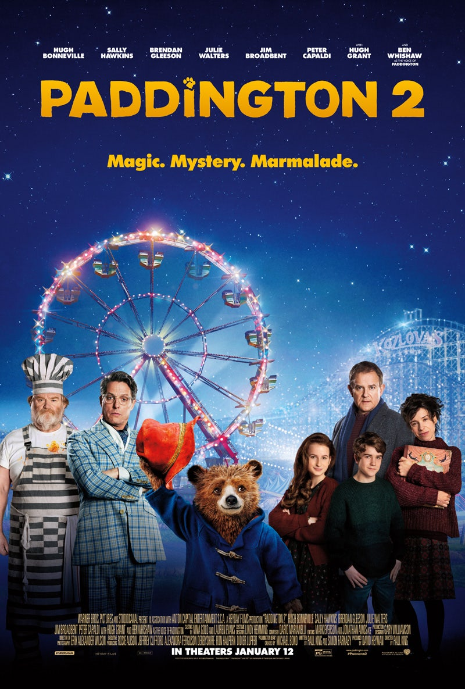
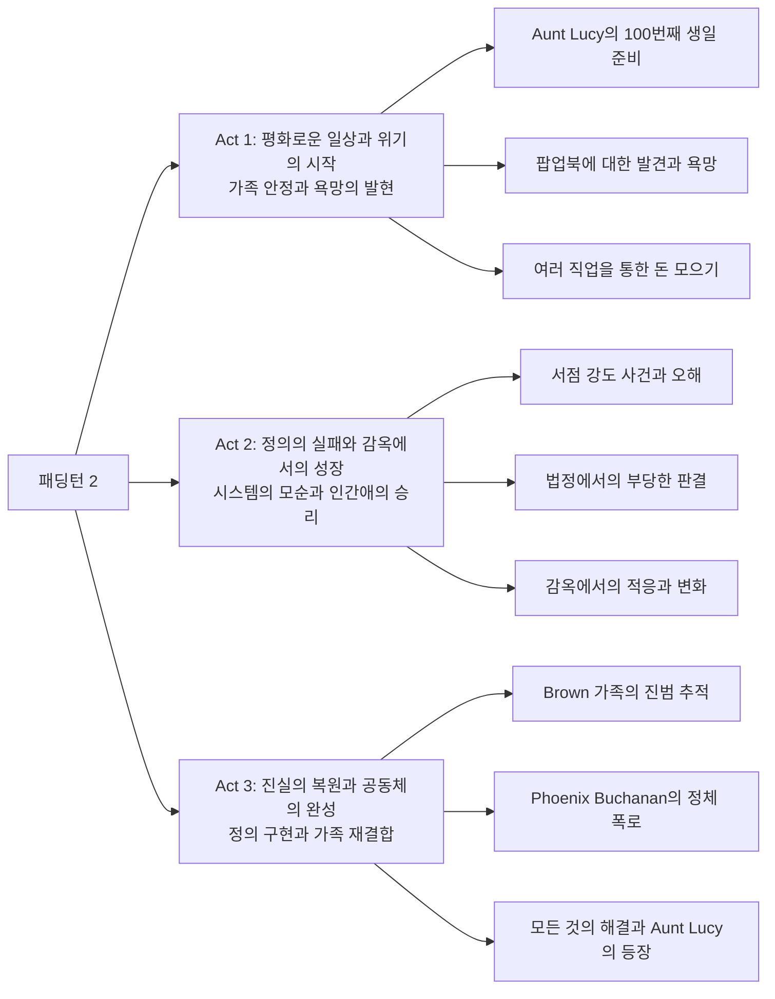
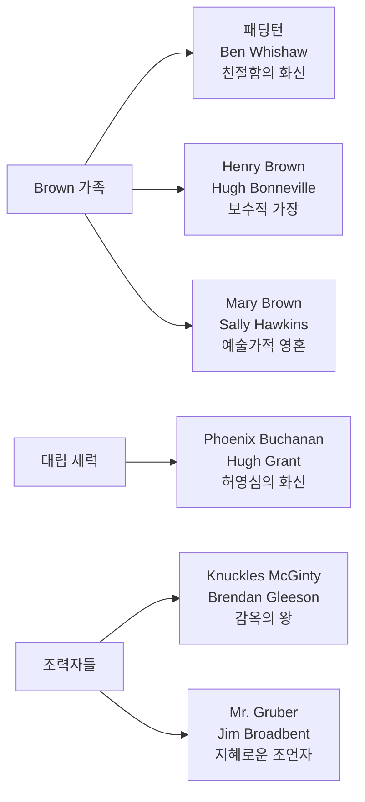

Paul King 감독의 《패딩턴 2》(2017)는 가족 영화의 새로운 지평을 연 작품이다. 전작의 성공을 발판으로 더욱 깊이 있는 사회적 메시지와 탁월한 시각적 미학을 결합하여, 단순한 어린이 영화를 넘어서 모든 연령대가 공감할 수 있는 현대적 우화로 완성되었다. 특히 이민자로서의 정체성, 사법 시스템에 대한 비판적 시각, 그리고 친절함이 가진 변화의 힘을 섬세하게 그려내며 영화사에 길이 남을 걸작으로 자리매김했다.

||
|:---:|
||

## 개요

### 영화 정보

* 제목: Paddington 2 / 패딩턴 2
* 감독: Paul King
* 주연: Ben Whishaw (패딩턴 목소리), Hugh Grant (Phoenix Buchanan), Hugh Bonneville (Henry Brown), Sally Hawkins (Mary Brown)
* 장르: 가족, 코미디, 모험
* 상영시간: 103분
* 개봉일: 2017년 11월 10일 (영국), 2018년 1월 12일 (미국)

### **추천 대상**

* **가족 관객**: 모든 연령대가 함께 즐길 수 있는 진정한 가족 영화의 완성체
* **영화 애호가**: 뛰어난 연출력과 시각적 미학을 추구하는 시네필들
* **사회 의식을 가진 관객**: 현대 사회 문제에 대한 깊이 있는 통찰을 원하는 성인 관객

## 완전 스토리 로드맵 (Complete Story Roadmap)

### **3막 구조 분석**

### **Act 1: 평화로운 일상의 균열**

**안정된 가족 생활의 묘사**
- 패딩턴이 Brown 가족과 완전히 동화된 일상
- 런던 시민으로서의 패딩턴의 위치 확립
- Aunt Lucy에 대한 그리움과 효심의 발현

**욕망의 객체로서의 팝업북**
- Mr. Gruber의 골동품 가게에서의 발견
- 팝업북을 통해 구현되는 런던의 환상적 재현
- 경제적 가치와 감정적 가치의 대비

**노동과 경제 활동의 시작**
- 이발소, 창문 청소 등 다양한 일자리 체험
- 노동을 통한 자아실현과 사회 참여
- 코미디적 상황을 통한 사회 비판의 씨앗

### **Act 2: 시스템의 폭력과 인간성의 승리**

**사법 시스템의 실패**
- 증거 부족에도 불구한 유죄 판결
- 목격자 증언의 허구성과 편견의 작동
- 개인적 원한이 공적 판단에 미치는 영향

**감옥 시스템의 현실과 변화**
- 처벌 중심의 감옥 문화
- 패딩턴의 친절함이 만들어내는 환경 변화
- Knuckles McGinty와의 관계를 통한 인간성 회복

**가족의 연대와 진실 추구**
- Brown 가족의 단결된 수사 활동
- 각 가족 구성원의 역할과 성장
- 진실에 대한 끈질긴 추구

### **Act 3: 정의의 복원과 사랑의 완성**

**악의 정체 폭로**
- Phoenix Buchanan의 이중적 인격 발견
- 과거의 영광에 대한 집착이 만든 범죄
- 예술가의 몰락과 허영심에 대한 비판

**공동체의 힘**
- 감옥 동료들의 의리와 연대
- 이웃들의 지지와 사회적 복권
- 진정한 가족의 의미 재확인

**완전한 해피엔딩**
- Aunt Lucy의 런던 방문
- 모든 갈등의 해결과 새로운 시작
- 사랑과 친절함의 최종적 승리

## 등장인물 심층 분석 (Character Deep Analysis)

### 캐릭터 관계도

### **주인공: 패딩턴 (Ben Whishaw)**

**캐릭터 개요**
* 기본 설정: 페루 출신 이민자 곰, 영국 신사의 이상을 체현
* 핵심 목표: Aunt Lucy를 위한 완벽한 선물 준비
* 주요 갈등: 선의가 오해받는 상황에서의 신념 유지

**성장 곡선**
* 안정된 가족 구성원 → 사회적 시험대 → 더욱 강화된 신념과 확장된 가족
* **신념의 불변성과 영향력의 확산**

**동기와 욕망**
* 표면적 목표: Aunt Lucy를 위한 팝업북 구매
* 내면적 욕구: 사랑받고 인정받고 싶은 이민자의 열망
* 두려움: 가족을 잃고 다시 외톨이가 되는 것

**갈등 구조**
* vs 자신: 선의가 통하지 않는 세상에서의 신념 유지
* vs 타인: 편견과 오해에 맞서는 투쟁
* vs 상황: 불공정한 시스템에 맞서는 개인의 무력감

**상징적 의미**
현대 사회의 이민자이자 타자로서, 동시에 가장 영국적인 가치(신사도, 친절함, 정중함)를 체현하는 역설적 존재. 그의 존재는 진정한 영국성이 혈통이나 출생지가 아닌 가치와 행동에 있음을 보여준다.

### **악역: Phoenix Buchanan (Hugh Grant)**

**캐릭터 개요**
* 기본 설정: 몰락한 무대 배우, 과거 영광에 사로잡힌 나르시시스트
* 핵심 목표: 과거의 명성 회복과 경제적 곤궁 해결
* 주요 갈등: 현실과 이상 사이의 괴리

**성장 곡선**
* 성공한 배우 → 몰락한 예술가 → 범죄자 → 최종적 몰락
* **자기기만의 심화와 현실 도피의 끝**

**동기와 욕망**
* 표면적 목표: 팝업북에 숨겨진 보물 획득
* 내면적 욕구: 젊은 시절의 명성과 인정 회복
* 두려움: 완전한 망각과 무가치함의 인정

**상징적 의미**
과거에 안주하며 현실을 받아들이지 못하는 현대인의 초상. 예술가의 허영심과 물질적 욕망이 결합된 부정적 인물상으로, 패딩턴의 순수함과 대조를 이룬다.

### **Henry Brown (Hugh Bonneville)**

**캐릭터 아크**
전작에서 이미 변화를 경험한 Henry는 이번 작품에서 더욱 적극적인 아버지이자 남편의 모습을 보여준다. 패딩턴이 위기에 처했을 때 가족을 이끄는 리더십을 발휘하며, 보수적 성향과 진보적 가치 사이의 균형을 찾는다.

## 요소별 심층 분석 (Component Deep Dive)

### **시각적 미학과 색상 상징주의**

| 색상 요소 | 상징적 의미 | 시각적 효과 | 내러티브 기능 |
|-----------|-------------|-------------|---------------|
| 빨간색 | 친절함과 따뜻함 | 화면의 감정적 온도 상승 | 캐릭터의 내적 변화 지시 |
| 베이지/회색 | 무관심과 냉담함 | 감정적 거리감 조성 | 갈등 상황의 시각적 표현 |
| 파스텔 톤 | 환상과 희망 | 동화적 분위기 연출 | 패딩턴의 세계관 구현 |

### **연기 & 캐스팅 분석**

| 배우 | 캐릭터 | 연기력 평가 | 캐스팅 적합성 | 특별한 점 |
|------|---------|-------------|---------------|-----------|
| Ben Whishaw | 패딩턴 | ★★★★★ | 완벽한 목소리 연기 | 순수함과 지혜의 균형 |
| Hugh Grant | Phoenix Buchanan | ★★★★★ | 자기패러디의 완성 | 코미디와 비극의 절묘한 조화 |
| Hugh Bonneville | Henry Brown | ★★★★☆ | 안정적 연기력 | 가족 드라마의 중심축 |
| Sally Hawkins | Mary Brown | ★★★★☆ | 따뜻한 모성애 구현 | 창의성과 수용성의 결합 |

### **연출 & 각본 분석**

**연출의 강점:**
* **시각적 상상력**: 팝업북 시퀀스의 환상적 연출
* **톤의 균형**: 코미디와 드라마의 완벽한 조화
* **사회적 메시지**: 무겁지 않으면서도 깊이 있는 주제 의식

**각본의 강점:**
* **캐릭터 개발**: 모든 등장인물의 명확한 동기와 아크
* **구조적 완성도**: 3막 구조의 치밀한 설계
* **대화의 자연스러움**: 연령대별 맞춤형 유머와 감동

### **음악 & 사운드 분석**

**Dario Marianelli의 음악적 특징:**
* 관현악과 재즈의 융합: 영국적 전통과 현대적 감각의 조화
* 테마 음악의 변주: 패딩턴 테마의 다양한 변형을 통한 감정 표현
* 장소성의 구현: 런던의 음향적 풍경을 음악으로 재현

## 비교 분석 (Comparative Analysis)

### **동일 감독 작품과의 비교**

**vs 패딩턴 (2014):**
* 공통점: 동일한 시각적 미학과 휴머니즘적 가치관
* 차이점: 더욱 복잡한 사회적 이슈와 성숙한 주제 의식
* 성취도: 전작의 장점을 유지하면서 깊이를 더한 완벽한 속편

### **동일 장르 작품과의 비교**

**vs 《월-E》(2008):**
* 공통점: 순수한 주인공을 통한 사회 비판
* 차이점: 더욱 현실적이고 구체적인 사회 문제 다루기
* 진화: 애니메이션과 실사의 경계를 허무는 새로운 시도

**vs 《인사이드 아웃》(2015):**
* 공통점: 가족 영화로서의 다층적 메시지
* 차이점: 내적 심리보다 외적 사회에 초점
* 성취도: 더욱 직접적이고 실천적인 사회적 메시지 전달

## 숨겨진 레이어 (Hidden Layers)

### **상징적 의미**

**팝업북의 상징성:**
* 기억과 그리움: 과거에 대한 향수와 미래에 대한 희망
* 예술과 현실: 상상력이 현실을 변화시키는 힘
* 문화적 전승: 세대 간 사랑의 전달 매체

**감옥의 상징성:**
* 사회적 배제: 타자에 대한 사회의 폭력적 대응
* 변화의 가능성: 사랑과 친절함을 통한 제도 개선
* 공동체의 의미: 진정한 가족은 혈연을 넘어선다

### **사회적/문화적 맥락**

**Brexit 시대의 이민자 서사:**
영화는 Brexit 투표 이후 제작되어 이민자에 대한 배타적 정서가 높아진 시기의 영국 사회를 반영한다. 패딩턴은 이상적인 이민자상을 제시하면서도, 동시에 사회 통합의 진정한 의미를 묻는다.

**신자유주의 사회의 사법 시스템:**
영화 속 법정 장면은 현대 사법 시스템의 문제점들을 우회적으로 비판한다. 목격자 증언의 불완전성, 판사의 개인적 편견, 증거보다 인상에 의존하는 판결 등은 실제 사법 제도의 한계를 드러낸다.

### **현대적 메시지**

**친절함의 사회적 힘:**
개인의 선의가 제도와 시스템을 변화시킬 수 있다는 메시지. 이는 단순한 이상주의가 아니라 구체적 실천을 통해 증명되는 현실적 가능성으로 제시된다.

**다문화 사회의 진정한 통합:**
진정한 사회 통합은 동화가 아닌 상호 존중과 이해를 통해 이루어진다는 메시지. 패딩턴은 영국인이 되려 하지 않으면서도 가장 영국적인 가치를 체현한다.

## 제작 비하인드 (Behind the Scenes)

### **제작 과정의 특별함**

**실사와 애니메이션의 완벽한 결합:**
패딩턴은 100% 키프레임 애니메이션으로 제작되어 모션캡처의 인위적 느낌을 피하고 순수한 애니메이션의 매력을 살렸다. 특히 털의 물리적 표현과 표정 연기의 정교함은 기술적 혁신을 보여준다.

**런던 로케이션의 의미:**
실제 런던 거리에서 촬영하여 도시의 진정성을 살리면서도, 패딩턴의 환상적 세계관과 조화를 이루도록 세심하게 설계되었다. 특히 Portobello Road와 같은 실제 장소들이 영화의 현실성을 뒷받침한다.

### **캐스팅 스토리**

**Hugh Grant의 파격적 변신:**
로맨틱 코미디의 대표 배우였던 Hugh Grant가 악역으로 변신한 것은 그의 커리어에서 중요한 전환점이었다. 자신의 페르소나를 패러디하면서도 완전히 새로운 캐릭터를 창조해냈다.

### **기술적 혁신**

**Hair Simulation Technology:**
패딩턴의 털 표현을 위해 개발된 새로운 시뮬레이션 기술은 이후 애니메이션 영화들에 큰 영향을 미쳤다. 물에 젖은 털, 바람에 날리는 털 등의 자연스러운 표현이 캐릭터의 생동감을 크게 높였다.

## 종합 평가

《패딩턴 2》는 가족 영화의 새로운 지평을 연 작품이다. 표면적으로는 사랑스러운 곰의 모험담이지만, 그 이면에는 현대 사회의 복잡한 문제들에 대한 깊이 있는 통찰이 숨어있다. 이민자 정체성, 사법 시스템의 한계, 감옥 제도의 문제점, 그리고 진정한 가족과 공동체의 의미까지 다루면서도 결코 무겁지 않은 것은 Paul King 감독의 탁월한 연출력 덕분이다.

특히 색상 상징주의를 통한 시각적 스토리텔링, Hugh Grant의 완벽한 악역 연기, 그리고 Ben Whishaw의 따뜻한 목소리 연기는 이 영화를 단순한 어린이 영화를 넘어서 모든 연령대가 즐길 수 있는 현대적 고전으로 만들어낸다.

**최종 평점: ★★★★★ (5/5)**

### **한 줄 평**

"친절함이 세상을 바꿀 수 있다는 믿음을 가장 아름답고 설득력 있게 그려낸 현대 영화의 걸작."

### **시리즈/후속작 전망**

**속편 가능성: 95%**
* 《패딩턴 인 페루》(2024) 이미 제작 완료
* 강력한 팬베이스와 지속적인 상업적 성공
* 원작 소설의 풍부한 소스 재료

**확장 가능성:**
* TV 시리즈나 스핀오프 가능성
* 뮤지컬이나 무대 작품으로의 각색
* 테마파크나 체험형 콘텐츠로의 확장

### **추천 작품**

* **유사한 휴머니즘**: 《월-E》, 《인사이드 아웃》, 《코코》
* **가족 영화 관련**: 《인크레더블》 시리즈, 《토이 스토리》 시리즈
* **영국적 정서**: 《런던 유령》, 《어바웃 타임》, 《킹스맨》

## 참고 자료 및 출처 (References & Sources)

### **관람 전 체크리스트**

**필수 사전 지식**
* [ ] 《패딩턴》(2014) - 캐릭터와 세계관 이해를 위해
* [ ] Michael Bond의 원작 소설 - 캐릭터의 원형 이해

**추천 선행 관람작**
* [ ] 《월-E》 - 순수한 주인공을 통한 사회 비판의 예
* [ ] 《인사이드 아웃》 - 가족 영화의 다층적 메시지 구현

**관람 포인트**
* [ ] 빨간색 의상의 변화와 캐릭터 아크의 연관성
* [ ] 팝업북 시퀀스의 환상적 연출 기법
* [ ] Hugh Grant의 자기패러디적 연기
* [ ] 감옥 시퀀스의 사회 비판적 메시지
* [ ] 엔딩 크레딧의 Hugh Grant 뮤지컬 넘버 확인