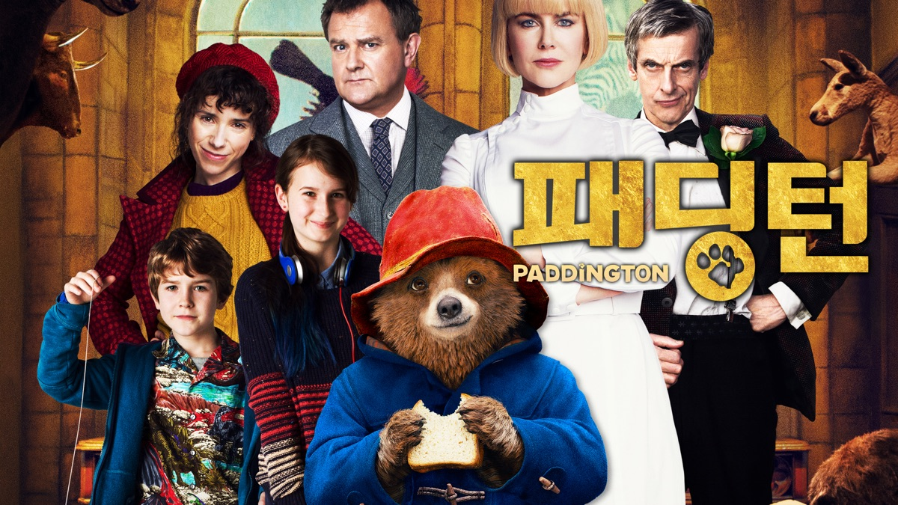
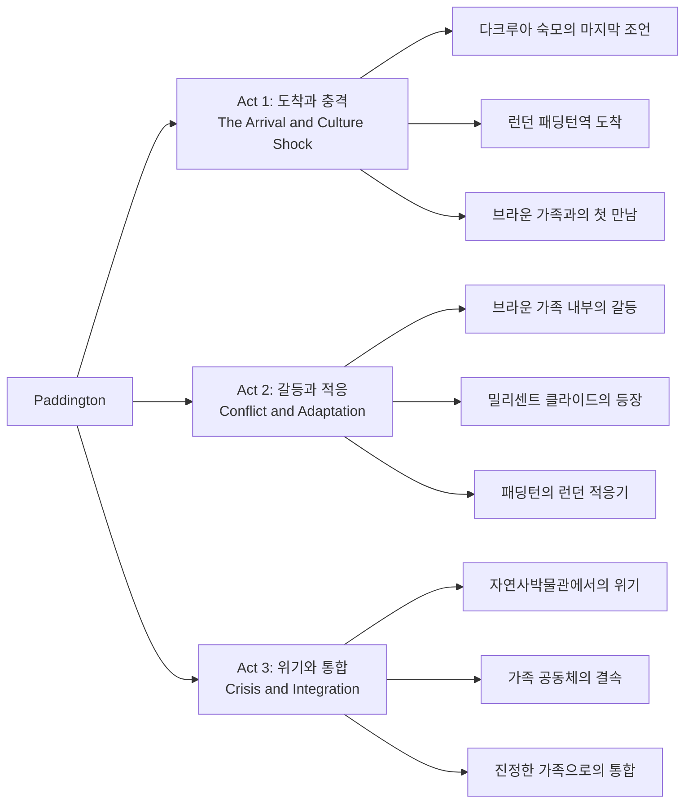
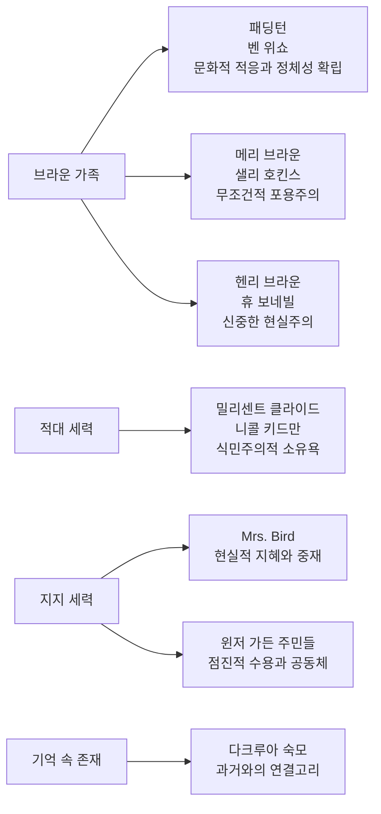

마이클 본드(Michael Bond)의 영원한 클래식 동화 캐릭터가 21세기 스크린에서 새로운 생명을 얻었다. 폴 킹(Paul King) 감독의 《패딩턴》(2014)은 단순한 아동 영화의 범주를 넘어서, 현대 다문화 사회의 포용과 배제, 가족의 진정한 의미, 그리고 낯선 타자에 대한 환대의 윤리학을 탐구하는 깊이 있는 작품으로 탄생했다.

||
|:---:|
||

## 개요

### 영화 정보

* 제목: Paddington / 패딩턴
* 감독: 폴 킹 (Paul King)
* 주연: 휴 보네빌 (Henry Brown), 샐리 호킨스 (Mary Brown), 벤 위쇼 (패딩턴 목소리), 니콜 키드만 (밀리센트 클라이드)
* 장르: 가족영화, 코미디, 판타지, 어드벤처
* 상영시간: 95분
* 개봉일: 2014년 11월 28일

### **추천 대상**

* **가족 관객**: 모든 연령대가 함께 즐길 수 있는 완벽한 균형감을 지닌 작품
* **영화학도/영화애호가**: 실사와 CGI 통합 기술의 탁월한 사례 연구 대상
* **문화연구자**: 현대 영국 사회의 다문화주의와 이민 담론을 영화적으로 탐구한 텍스트

## 완전 스토리 로드맵 (Complete Story Roadmap)

### **3막 구조 분석**

### **Act 1: 이방인의 도착과 문화적 충격**

**다크루아 숙모의 유언**
- 페루 정글 깊숙한 곳, 곰 가족의 평화로운 일상의 파괴
- 지진이라는 자연재해가 가져온 강제적 이주의 필연성
- "런던 사람들은 친절하다"는 믿음에 기반한 여행의 시작
- 패딩턴 역에서의 첫 번째 문화적 충격과 무관심

**브라운 가족과의 조우**
- 메리 브라운의 즉각적 연민과 헨리 브라운의 신중한 회의주의
- "하룻밤만"이라는 조건부 환대의 시작
- 윈저 가든 32번지라는 소시민적 공간으로의 편입

**초기 적응의 희극적 실패들**
- 욕실에서의 문화적 오해와 물리적 재앙
- 영국식 예의범절에 대한 무지에서 오는 코미디
- 가족 구성원들의 서로 다른 반응 패턴

### **Act 2: 정체성 탐색과 외부적 위협**

**가족 내부의 이념적 분열**
- 메리의 무조건적 포용주의 vs 헨리의 실용적 우려
- 주디의 청소년기적 연대감 vs 조나단의 순수한 호기심
- Mrs. Bird의 현실적 지혜와 중재적 역할

**밀리센트 클라이드라는 위협**
- 과거 탐험가 전통의 부정적 유산으로서의 캐릭터
- 식민주의적 수집 욕망과 타자화의 극단적 발현
- 자연사박물관이라는 제도적 권력과 학술적 권위의 남용

**패딩턴의 정체성 위기**
- 생물학적 가족(다크루아 숙모)과 선택적 가족(브라운 가족) 사이의 갈등
- 런던이라는 대도시 환경에서의 생존 방식 학습
- 영국적 문화 코드에 대한 점진적 이해와 내재화

### **Act 3: 위기를 통한 진정한 통합**

**자연사박물관에서의 클라이맥스**
- 밀리센트의 박제 계획이라는 극단적 타자화의 위협
- 브라운 가족 전체의 집단적 구출 작전
- 혈연을 넘어선 선택적 가족 공동체의 완성

**사회적 인정과 통합**
- 지역 공동체(윈저 가든 주민들)의 점진적 수용
- 패딩턴의 독특함이 문제가 아닌 자산으로 인식되는 전환점
- 다문화적 영국 사회의 이상향적 모델 제시

## 등장인물 심층 분석 (Character Deep Analysis)

### 캐릭터 관계도

### **주인공: 패딩턴 (벤 위쇼 성우)**

**캐릭터 개요**
* 기본 설정: 페루 출신의 어린 곰, 런던 이주민, 마멀레이드를 사랑하는 신사적 존재
* 핵심 목표: 런던에서 새로운 가족을 찾고 안정적인 삶의 터전 확보
* 주요 갈등: 문화적 차이로 인한 적응의 어려움과 정체성 혼재

**성장 곡선**
* 페루의 순진한 곰 → 런던의 문화적 충격 경험 → 브라운 가족의 진정한 구성원
* **핵심 성장 메시지**: 가족은 혈연이 아닌 사랑과 돌봄으로 만들어진다

**동기와 욕망**
* 표면적 목표: 다크루아 숙모가 말한 "런던의 친절한 사람들"을 찾기
* 내면적 욕구: 소속감과 안정된 가정에 대한 근본적 갈망
* 두려움: 영원히 떠돌이로 남거나 박제품이 되어 자유를 잃는 것

**갈등 구조**
* vs 자신: 페루 출신의 정체성과 영국식 문화 습득 사이의 균형
* vs 타인: 브라운 가족 내부의 서로 다른 수용 태도
* vs 상황: 밀리센트 클라이드의 위협과 런던의 무관심한 도시 환경

**상징적 의미**
패딩턴은 21세기 유럽의 이민자를 대변하는 알레고리적 존재이다. 그의 여행은 단순한 모험이 아니라 경제적/정치적 난민의 현실을 은유적으로 반영하며, 다문화 사회의 통합 가능성을 탐구하는 문화적 텍스트로 기능한다.

### **메리 브라운 (샐리 호킨스)**

**캐릭터 개요**
* 기본 설정: 30대 중반의 중산층 주부, 전직 모험가의 딸, 현재는 가정주부
* 핵심 목표: 가족의 행복과 타자에 대한 무조건적 환대 실현
* 주요 갈등: 이상주의적 포용과 현실적 우려 사이의 균형

**동기와 욕망**
* 표면적 목표: 패딩턴에게 안전한 보금자리 제공
* 내면적 욕구: 자신의 모험적 기질과 어머니적 돌봄 본능의 실현
* 아버지의 탐험가 정신을 긍정적으로 계승하려는 의지

**상징적 의미**
메리는 이상적인 다문화주의자의 모델이면서, 동시에 현실적 제약 속에서도 윤리적 원칙을 포기하지 않는 현대 여성의 전형을 보여준다.

### **헨리 브라운 (휴 보네빌)**

**캐릭터 개요**
* 기본 설정: 40대 초반의 보험회사 위험 분석가, 신중하고 현실적인 가장
* 핵심 목표: 가족의 안전과 안정된 일상의 유지
* 주요 갈등: 도덕적 의무와 실용적 우려 사이의 내적 갈등

**성장 곡선**
* 조심스러운 회의주의자 → 점진적 마음 열기 → 패딩턴의 진정한 아버지
* **핵심 변화**: 위험 회피에서 가족을 위한 능동적 위험 감수로의 전환

**상징적 의미**
헨리는 초기 다문화 정책에 대한 일반적 우려를 대변하면서도, 결국 인간적 연대가 제도적 두려움을 극복할 수 있음을 보여주는 캐릭터이다.

### **밀리센트 클라이드 (니콜 키드만)**

**캐릭터 개요**
* 기본 설정: 자연사박물관의 박제사, 몽고메리 클라이드(과거 탐험가)의 딸
* 핵심 목표: 아버지의 미완성된 탐험 업적을 완성하여 학술적 명성 획득
* 주요 갈등: 과학적 호기심과 비인간적 수단 사이의 윤리적 무감각

**동기와 욕망**
* 표면적 목표: 희귀한 페루 곰의 박제품 획득
* 내면적 욕구: 아버지에 대한 복잡한 감정과 학술적 인정에 대한 갈망
* 두려움: 아버지의 실패를 반복하거나 학술적으로 무시당하는 것

**상징적 의미**
밀리센트는 식민주의 시대의 부정적 유산을 체현하는 캐릭터로, 타자를 대상화하고 소유물로 전락시키려는 서구 중심적 사고의 극단적 발현이다.

## 요소별 심층 분석 (Component Deep Dive)

### **실사-CGI 통합 기술 분석**

| 기술 요소 | 혁신점/특징 | 시각적/청각적 효과 | 제작 의의 |
|-----------|-------------|-------------------|-----------|
| 패딩턴 캐릭터 디자인 | 사실적 곰의 해부학과 만화적 표현의 절묘한 균형 | uncanny valley 회피한 따뜻하고 친근한 외형 | 아동과 성인 모두에게 어필하는 캐릭터 창조 |
| 모션 캡처 기술 | 벤 위쇼의 세밀한 표정 연기를 곰의 얼굴에 자연스럽게 투영 | 인간적 감정의 동물적 표현으로 깊이 있는 연기 구현 | 성우의 연기력을 시각적으로 완벽 번역 |
| 환경 통합 | 실제 런던 로케이션과 CGI 캐릭터의 seamless한 합성 | 현실감 있는 공간에서의 판타지적 존재 자연스러운 공존 | 리얼리즘과 판타지의 경계를 허무는 기술적 성취 |

### **연기 & 캐스팅 분석**

| 배우 | 캐릭터 | 연기력 평가 | 캐스팅 적합성 | 특별한 점 |
|------|---------|-------------|---------------|-----------|
| 벤 위쇼 | 패딩턴 (목소리) | ★★★★★ | 완벽한 casting | 영국적 신사다움과 순진한 호기심의 완벽한 vocal 구현 |
| 샐리 호킨스 | 메리 브라운 | ★★★★★ | 이상적인 선택 | 따뜻함과 강인함을 동시에 지닌 현대적 어머니상 |
| 휴 보네빌 | 헨리 브라운 | ★★★★☆ | 안정적인 연기 | Downton Abbey의 신사적 이미지를 가족 영화로 성공적 이전 |
| 니콜 키드만 | 밀리센트 클라이드 | ★★★★☆ | 의외의 악역 변신 | 우아함 속에 숨겨진 광기를 설득력 있게 표현 |

### **연출 & 각본 분석**

**연출의 강점:**
* **시각적 스토리텔링**: 대사에 의존하지 않는 physical comedy의 완벽한 구사
* **톤 관리**: 아동용과 성인용 유머의 절묘한 균형으로 전 연령층 만족
* **문화적 디테일**: 영국적 일상의 세밀한 관찰과 유머러스한 과장

**연출의 약점:**
* **예측 가능한 구조**: 전형적인 3막 구조로 인한 서사적 긴장감 부족
* **이상주의적 결말**: 현실적 갈등의 너무 손쉬운 해결

**각본의 강점:**
* **다층적 메시지**: 표면적 가족 영화 아래 숨겨진 사회적 담론의 정교한 직조
* **캐릭터 아크**: 모든 주요 인물의 명확하고 설득력 있는 변화 곡선

**각본의 약점:**
* **갈등의 단순화**: 복합적 사회 문제를 지나치게 단순화한 측면
* **악역의 일차원성**: 밀리센트 캐릭터의 심리적 복잡성 부족

### **음악 & 사운드 분석**

**닉 윌슨(Nick Wilson)의 음악적 특징:**
* 클래식한 오케스트레이션과 현대적 감성의 조화: 영국 전통 음악의 현대적 재해석
* 패딩턴 테마의 다양한 변주: 캐릭터의 감정 변화에 따른 organic한 음악적 발전

**사운드 디자인의 탁월함:**
* 기능: 런던의 도시적 소음과 가정적 온기의 대조적 표현
* 구조: diegetic sound와 non-diegetic music의 seamless한 전환
* 의미: 패딩턴의 내적 상태를 반영하는 청각적 은유 체계

## 비교 분석 (Comparative Analysis)

### **동일 감독 작품과의 비교**

**vs 《패딩턴 2》(2017):**
* 공통점: 동일한 캐릭터 개발과 가족 중심적 서사 구조
* 차이점: 1편의 정착 서사 vs 2편의 사회적 확장 서사
* 성취도: 1편이 캐릭터 확립에서 더 성공적, 2편이 사회적 메시지에서 더 정교

### **동일 장르 작품과의 비교**

**vs 《크리스토퍼 로빈》(2018):**
* 공통점: 클래식 아동문학의 현대적 각색, 성인의 향수와 아동의 순수함 결합
* 차이점: 패딩턴의 사회적 통합 vs 크리스토퍼 로빈의 개인적 성찰
* 진화: 가족 영화 장르의 사회적 책임감 강화 추세

**vs 《주토피아》(2016):**
* 공통점: 동물 캐릭터를 통한 현대 사회의 편견과 차별 문제 탐구
* 차이점: 패딩턴의 온화한 접근 vs 주토피아의 직접적 사회 비판
* 성취도: 각각 다른 방식으로 다문화주의의 가능성과 한계 탐구

### **동시대 경쟁작과의 비교**

**vs 《빅 히어로 6》(2014):**
* 공통점: 가족의 재구성과 기술적 혁신을 통한 감동적 서사
* 차이점: 패딩턴의 현실적 배경 vs 빅 히어로의 SF적 설정
* 성취도: 패딩턴이 문화적 깊이에서, 빅 히어로가 액션과 스펙터클에서 우위

## 숨겨진 레이어 (Hidden Layers)

### **상징적 의미**

**패딩턴역의 상징성:**
* 이동과 정착: 모든 여행의 시작점이자 종착점으로서의 상징적 공간
* 익명성과 개인화: 군중 속의 개인이 가족이라는 특별한 관계로 전환되는 장소
* 과거와 현재: 빅토리아 시대의 건축물에서 21세기의 다문화적 만남이 이루어지는 시공간의 압축

**마멀레이드의 상징성:**
* 문화적 교환: 페루의 오렌지와 영국의 제조 기술이 만나 탄생한 융합의 산물
* 달콤함과 보존: 시간을 초월한 사랑의 저장 방식이자 기억의 매개체
* 일상성과 특별함: 평범한 음식이 개인적 정체성의 핵심이 되는 상징적 전환

### **사회적/문화적 맥락**

**브렉시트 이전 영국의 다문화주의:**
2014년 제작된 이 영화는 브렉시트 국민투표 이전의 상대적으로 낙관적인 다문화주의를 반영한다. 패딩턴의 성공적 통합은 당시 영국 사회가 지향했던 이상적 모델을 제시하며, 동시에 이후 현실 정치에서 나타난 배타적 민족주의와 대조되는 가치관을 보여준다.

**문화적 맥락:**
영화는 영국적 정체성의 긍정적 측면들(예의바름, 유머, 공정함)을 강조하면서도, 동시에 식민주의의 어두운 유산(밀리센트 캐릭터)을 비판적으로 성찰한다. 이는 과거에 대한 반성과 미래에 대한 희망을 동시에 담은 문화적 자기성찰의 결과물이다.

### **현대적 메시지**

**환대의 윤리학:**
레비나스(Emmanuel Levinas)의 타자론을 영화적으로 구현한 작품으로, 낯선 존재에 대한 무조건적 환대가 결국 모든 구성원을 풍요롭게 만든다는 철학적 메시지를 담고 있다.

**가족의 재정의:**
혈연 중심의 전통적 가족관을 넘어서, 선택과 돌봄에 기반한 새로운 가족 모델을 제시한다. 이는 현대 사회의 다양한 가족 형태를 긍정적으로 수용하는 진보적 가치관을 반영한다.

## 제작 비하인드 (Behind the Scenes)

### **제작 과정의 특별함**

**실사-애니메이션 통합의 기술적 도전:**
패딩턴 캐릭터의 제작에는 18개월의 연구개발 기간이 투입되었으며, 프레임워크스(Framestore)의 VFX 팀은 실제 곰의 해부학적 구조를 정밀하게 연구하여 사실적이면서도 만화적인 매력을 지닌 캐릭터를 창조했다.

**영국적 디테일에 대한 집착:**
폴 킹 감독은 영국 문화의 세밀한 디테일을 구현하기 위해 런던의 실제 로케이션을 광범위하게 활용했으며, 특히 윈저 가든의 세트는 1950년대 런던 교외의 건축양식을 정확하게 재현하기 위해 건축사와 문화사학자의 자문을 받았다.

### **캐스팅 스토리**

**벤 위쇼의 캐스팅:**
원래 콜린 퍼스(Colin Firth)가 패딩턴의 목소리를 맡기로 했으나, 녹음 과정에서 성인적이고 세련된 목소리가 순진한 곰의 캐릭터와 맞지 않는다는 판단 하에 벤 위쇼로 교체되었다. 이는 영화 제작에서 캐스팅의 중요성과 캐릭터 적합성에 대한 세심한 고려를 보여주는 사례이다.

### **기술적 혁신**

**실시간 상호작용 시스템:**
배우들이 실제로 패딩턴과 상호작용하는 것처럼 연기할 수 있도록, 촬영 현장에 실물 크기의 패딩턴 인형과 모션 캡처 기술자가 함께 참여했다. 이는 후반 작업에서의 자연스러운 시선 처리와 공간감 확보에 결정적 역할을 했다.

## 종합 평가

《패딩턴》(2014)은 단순한 아동 영화의 범주를 넘어서, 현대 다문화 사회의 복합적 현실을 따뜻하고 지혜로운 시선으로 탐구한 수작이다. 폴 킹 감독은 마이클 본드의 원작이 지닌 영국적 charm을 현대적으로 재해석하면서도, 21세기의 이민과 정착, 문화적 통합이라는 현실적 이슈를 은유적으로 다루는 데 성공했다.

특히 실사와 CGI의 seamless한 통합은 기술적 성취를 넘어서, 현실과 판타지가 공존할 수 있는 상상적 공간을 창조함으로써 영화의 핵심 메시지인 '다름에 대한 포용'을 시각적으로 구현했다. 벤 위쇼의 목소리 연기는 패딩턴이라는 캐릭터에 깊이 있는 인간성을 부여하며, 관객들로 하여금 종족의 경계를 넘어선 공감을 가능하게 만든다.

영화의 서사 구조는 전형적인 가족 영화의 공식을 따르면서도, 각 캐릭터의 변화 과정이 설득력 있게 그려져 있어 예측 가능성을 상쇄한다. 특히 헨리 브라운의 점진적 마음 변화는 현실적 우려와 인간적 연대 사이의 균형점을 찾아가는 과정을 섬세하게 보여준다.

문화적 차원에서 이 영화는 브렉시트 이전 영국의 상대적으로 낙관적인 다문화주의를 반영하면서도, 식민주의의 어두운 유산을 비판적으로 성찰하는 이중적 시선을 보여준다. 밀리센트 클라이드라는 캐릭터를 통해 타자를 소유와 전시의 대상으로 보는 서구 중심적 시각을 비판하는 한편, 브라운 가족을 통해서는 진정한 다문화적 공존의 가능성을 탐구한다.

**최종 평점: ★★★★☆ (4.2/5)**

### **한 줄 평**

따뜻함과 지혜로 무장한 영국식 유머가 만들어낸 21세기 가족 영화의 새로운 고전.

### **시리즈/후속작 전망**

**속편 가능성: 95%**
* 박스오피스 성공과 비평적 호평으로 속편 제작 확정
* 캐릭터의 확장 가능성과 사회적 메시지의 지속적 발전 여지

**확장 가능성:**
* TV 시리즈를 통한 일상적 에피소드 확장
* 패딩턴 캐릭터의 다양한 미디어 플랫폼 진출

### **추천 작품**

* **유사한 실사-애니메이션 결합**: 《크리스토퍼 로빈》, 《피터 래빗》
* **다문화 테마 관련**: 《주토피아》, 《코코》
* **영국 가족영화 대표작**: 《해리 포터》 시리즈, 《나니아 연대기》

## 참고 자료 및 출처 (References & Sources)

### **주요 참고 자료**

**공식 자료**
* [StudioCanal Official](https://www.studiocanal.com) - 제작사 공식 정보
* [Paddington Official Website](https://www.paddington.com) - 캐릭터 및 영화 정보

**학술적 참고문헌**
* Bordwell, David. "Narration in the Fiction Film" - 내러티브 구조 분석
* Mulvey, Laura. "Visual Pleasure and Narrative Cinema" - 시각적 재현 이론
* Said, Edward. "Orientalism" - 식민주의 담론 분석
* Levinas, Emmanuel. "Totality and Infinity" - 타자론과 환대의 윤리학

### **관람 전 체크리스트**

**필수 사전 지식**
* [ ] 마이클 본드의 원작 동화 시리즈 - 캐릭터의 원형과 영국적 배경 이해
* [ ] 영국의 다문화주의 정책 현황 - 영화의 사회적 맥락 이해

**추천 선행 관람작**
* [ ] 《E.T.》(1982) - 외계인과 가족의 만남이라는 유사한 서사 구조
* [ ] 《라이프 오브 파이》(2012) - 실사와 CGI 동물의 감정적 교감 사례

**관람 포인트**
* [ ] 패딩턴의 미세한 표정 변화와 body language
* [ ] 런던의 실제 로케이션과 CGI의 통합 방식
* [ ] 각 캐릭터의 패딩턴에 대한 태도 변화 과정
* [ ] 영국적 유머와 보편적 감동의 균형점

---

## 전문가급 분석 보고서: 학술적 접근

### **형식주의적 분석 (Formalist Analysis)**

#### **Mise-en-scène의 의미론적 기능**

폴 킹 감독의 《패딩턴》에서 mise-en-scène은 단순한 시각적 배경을 넘어서 서사의 핵심 동력으로 기능한다. 윈저 가든 32번지의 인테리어 디자인은 1950년대 영국 중산층의 안정된 생활양식을 재현하면서도, 동시에 변화에 대한 개방성을 시각적으로 암시한다.

**색채 심리학의 적용:**
- 패딩턴의 빨간 모자와 파란 코트는 영국 국기의 색상을 연상시키며, 동시에 primary color의 조합으로 순수함과 희망을 상징
- 브라운 가족 집의 따뜻한 earthtone과 패딩턴의 honey color fur는 시각적 조화를 이루며 소속감을 강화
- 밀리센트의 실버톤 연구실은 cold color palette으로 감정적 거리감과 비인간성을 강조

**공간의 상징적 분할:**
- 사적 공간(브라운 가족의 집) vs 공적 공간(런던 거리, 박물관)의 대조
- 수직적 공간 활용: 다락방(과거의 기억), 1층(현재의 일상), 지하실(숨겨진 위험)
- 문턱의 상징성: 집의 현관문을 경계로 한 내부자/외부자의 구분과 그 해체

#### **Cinematography의 내러티브 기능**

**카메라 워크의 감정적 효과:**
- Low angle shot을 통한 패딩턴의 웅장함 연출: 작은 곰이지만 큰 존재감을 지닌 캐릭터임을 시각적으로 강조
- High angle shot을 통한 런던의 압도적 규모 표현: 개인과 도시 환경의 대조를 통한 소외감 증폭
- Eye-level shot의 점진적 증가: 패딩턴이 가족 구성원으로 통합되어가는 과정을 카메라 높이로 상징화

**프레이밍의 사회적 의미:**
- Group shot의 구성 변화: 초기의 4+1 구조에서 최종적인 5인 가족 구성으로의 시각적 전환
- Close-up의 선택적 사용: 감정적 절정 순간에 집중된 클로즈업으로 관객의 공감 유도
- Deep focus를 통한 foreground와 background의 동시적 서사: 패딩턴의 행동과 가족들의 반응을 하나의 프레임에 담아 관계성 강조

### **작가주의적 접근 (Auteur Theory)**

#### **폴 킹 감독의 Signature Style**

폴 킹의 연출 철학은 "친숙함 속의 신기함(Wonder in the Ordinary)"으로 요약할 수 있다. 그의 이전 작품 《The Mighty Boosh》에서 보여준 surreal comedy의 감각이 《패딩턴》에서는 가족 친화적 판타지로 정제되어 나타난다.

**반복되는 Visual Motif:**
- 원형 구조의 선호: 패딩턴의 둥근 눈, 원형 창문, 회전목마 등을 통한 순환과 완성의 상징
- 수직적 움직임의 강조: 계단 오르내리기, 지붕에서의 추격신 등을 통한 사회적 상승/하강의 은유
- 대칭성과 비대칭성의 대조: 정돈된 영국식 정원과 무질서한 패딩턴의 행동 패턴

**Thematic Concern의 일관성:**
- 소수자의 관점에서 바라본 주류 사회의 모순
- 전통과 혁신의 건설적 대화 가능성
- 유머를 통한 사회적 갈등의 비폭력적 해결

### **장르 이론적 분석 (Genre Theory)**

#### **가족영화 장르의 혁신적 확장**

《패딩턴》은 전통적인 가족영화 장르의 관습을 준수하면서도, 동시에 현대적 이슈를 적극적으로 수용하여 장르의 외연을 확장시킨다.

**Generic Convention의 창조적 활용:**
- 가족의 위기와 화합이라는 고전적 구조 위에 다문화적 갈등과 통합이라는 현대적 레이어 추가
- 전통적인 악역(밀리센트)과 현대적 선역(브라운 가족)의 대립 구조를 통한 가치관의 충돌 시각화
- Happy ending의 필연성을 유지하면서도 그 과정에서의 현실적 갈등을 진지하게 다룸

**Iconography의 현대적 재해석:**
- 영국적 상징들(빨간 버스, 전화박스, 런던 브리지)의 향수적 활용이 아닌 현재적 의미로의 전환
- 동물 캐릭터의 의인법이 단순한 cute factor가 아닌 타자성에 대한 사회적 은유로 기능
- 가정이라는 사적 공간이 정치적 의미를 획득하는 장르적 확장

### **문화적/사회학적 접근**

#### **Representation Theory의 적용**

패딩턴이라는 캐릭터는 Edward Said의 orientalism 이론의 역전된 적용 사례로 읽힐 수 있다. 서구의 시선으로 타자화되어 온 '비서구' 존재가 오히려 서구 문명의 진정한 가치를 일깨우는 역할을 수행한다.

**성별 재현의 진보성:**
- 메리 브라운: 전통적 mother figure를 넘어선 능동적 문제 해결자
- 헨리 브라운: 가부장적 권위보다는 협력적 파트너십을 중시하는 현대적 아버지상
- 밀리센트: 여성 악역이 단순한 질투나 히스테리가 아닌 학술적 야망에 기반한 복합적 동기를 지님

**계급 의식의 미묘한 표현:**
- 중산층 가정의 안정성과 여유로움이 타자에 대한 포용의 전제 조건으로 제시
- 동시에 경제적 여유가 도덕적 우월성을 의미하지 않음을 밀리센트 캐릭터를 통해 암시
- 윈저 가든이라는 특정 계층의 거주지역이 다문화적 실험의 무대가 되는 아이러니

#### **Historical Context와 영화의 관계**

2014년 제작 당시 영국은 EU 내에서의 이민 문제와 다문화주의 정책에 대한 사회적 논쟁이 고조되고 있던 시기였다. 《패딩턴》은 이러한 현실적 긴장을 직접적으로 다루지 않으면서도, 은유적 차원에서 포용적 해법의 가능성을 탐구한다.

**브렉시트 담론과의 연관성:**
- 영화 속 패딩턴의 성공적 통합은 현실 정치에서 나타난 배타적 민족주의와 대조적
- "London is changing"이라는 대사는 도시의 다문화적 변화에 대한 양가적 감정을 반영
- 전통적 영국성(Britishness)과 새로운 다문화성의 조화 가능성에 대한 낙관적 전망

### **정신분석학적 접근**

#### **Psychoanalytic Film Theory의 적용**

라캉(Jacques Lacan)의 주체 이론 관점에서 패딩턴의 여정은 상징계(Symbolic Order) 진입 과정으로 해석될 수 있다. 페루의 자연 상태에서 런던의 문명 사회로의 이동은 언어와 법, 관습의 세계로의 편입을 의미한다.

**욕망의 구조:**
- 패딩턴의 "가족 찾기"는 라캉적 의미에서의 대타자(Big Other)에 대한 갈망
- 다크루아 숙모의 부재는 원초적 상실감과 그에 따른 대체 대상 탐색으로 작동
- 브라운 가족과의 관계 형성은 새로운 상징적 질서 내에서의 주체 위치 확립 과정

**응시 이론(Gaze Theory)의 적용:**
- 런던 시민들의 패딩턴에 대한 시선: 호기심, 두려움, 무관심의 복합
- 밀리센트의 과학적 응시: 대상화와 소유욕이 결합된 권력적 시선
- 브라운 가족의 사랑스러운 응시: 인정과 수용을 통한 주체성 부여

### **포스트모던 비평적 접근**

#### **Intertextuality의 복합적 층위**

《패딩턴》은 다양한 텍스트들과의 상호참조 관계를 통해 의미를 생산한다.

**문학적 Intertextuality:**
- 마이클 본드의 원작과의 관계: 충실한 각색과 현대적 재해석의 균형
- 앨리스 인 원더랜드와의 구조적 유사성: 이상한 세계로의 여행과 정체성 탐색
- 올리버 트위스트와의 서사적 연관성: 고아의 런던 정착기라는 공통 모티프

**영화사적 참조:**
- E.T.와의 유사성: 외계 존재와 지구 가족의 만남이라는 설정
- 메리 포핀스와의 연관성: 마법적 존재가 가족에게 가져다주는 변화
- 픽사 애니메이션과의 기술적 대화: 실사와 CGI 통합의 새로운 가능성

#### **Simulacrum과 현실의 관계**

보드리야르(Jean Baudrillard)의 시뮬라크르 개념을 적용하면, 패딩턴이라는 캐릭터는 '실재하지 않는 실재'로서 현실보다 더 현실적인 효과를 생산한다.

**하이퍼리얼리티의 구현:**
- CGI로 창조된 패딩턴이 실제 배우들보다 더 강한 감정적 영향력을 행사
- 영화 속 런던이 실제 런던보다 더 '런던다운' 모습으로 구성
- 이상적 가족 모델이 현실의 가족들에게 되돌아가는 circular effect

### **산업적/경제적 분석**

#### **Production Context 분석**

《패딩턴》의 제작 과정은 현대 영화 산업의 국제적 협력 구조를 보여주는 대표적 사례이다.

**International Co-production의 의미:**
- 영국(StudioCanal), 프랑스(TF1 Films Production), 중국(China Film Group) 간의 협력
- 각국의 문화적 감수성을 고려한 universal appeal 추구
- 기술적 전문성(영국의 VFX)과 자본력(중국의 투자)의 결합

**Budget vs Creativity의 변증법:**
- 상대적으로 modest한 예산($55M)으로 블록버스터급 기술적 완성도 달성
- 스타 캐스팅보다는 적절한 캐스팅과 기술적 혁신에 집중
- Independent film의 창의성과 studio system의 전문성 결합

#### **Distribution Strategy와 Cultural Adaptation**

**Global vs Local의 균형:**
- 영국적 특수성을 유지하면서도 universal appeal 확보
- 각국별 더빙과 자막의 문화적 adaptation
- Marketing에서 family value와 technical achievement의 dual appeal

**Franchise Economics의 설계:**
- 캐릭터 라이센싱과 merchandising의 장기적 수익 모델
- Theme park attraction과의 연계 가능성
- TV series, video game 등 transmedia 확장 전략

### **수용사 및 비평사 분석**

#### **Critical Reception의 분석**

《패딩턴》에 대한 비평적 수용은 장르적 기대와 예술적 성취 사이의 흥미로운 긴장을 보여준다.

**Academic Criticism의 특징:**
- 영화학자들의 기술적 혁신에 대한 높은 평가
- 문화연구자들의 다문화주의 담론으로서의 의미 부여
- 아동문학 연구자들의 adaptation theory 관점에서의 분석

**Popular Criticism과의 차이:**
- 일반 관객들의 emotional appeal 중심 평가
- 비평가들의 technical achievement와 social message 복합 평가
- 가족 관객들의 practical value (entertainment + education) 중시

#### **Cultural Impact의 측정**

**Quantitative Indicators:**
- Box office performance: worldwide $268M (budget 대비 약 5배)
- Critical score: Rotten Tomatoes 97%, Metacritic 77점
- Awards recognition: BAFTA nomination, Annie Award 수상

**Qualitative Impact:**
- 영국 관광 산업에 미친 긍정적 영향 (Paddington Bear trail)
- 아동 교육 분야에서의 다문화 교육 자료로 활용
- 정치적 담론에서 긍정적 이민 정책의 상징적 reference

### **미학적 평가 및 예술사적 의의**

#### **영화사적 맥락에서의 혁신성**

《패딩턴》은 21세기 가족 영화 장르의 evolution에서 중요한 이정표가 된다.

**기술적 혁신의 의의:**
- Photo-realistic CGI character의 감정적 authenticity 달성
- Live-action과 animation의 seamless integration
- Motion capture technology의 family film으로의 성공적 적용

**예술적 성취의 평가:**
- Visual storytelling의 완성도: 대사에 의존하지 않는 narrative 구성
- Character development의 깊이: 모든 주요 인물의 convincing한 변화 arc
- Thematic complexity: 단순한 moral lesson을 넘어선 사회적 담론 참여

#### **다른 예술 형식과의 관계**

**Literature와의 관계:**
- 원작 동화의 정신적 계승과 현대적 확장
- Children's literature adaptation의 새로운 모델 제시
- Cross-generational reading의 영화적 구현

**Theatre와의 연관성:**
- British comedy tradition의 영화적 번안
- Physical comedy의 cinematic language로의 번역
- Vaudeville과 music hall tradition의 현대적 계승

### **결론: 학술적 의의와 미래 전망**

《패딩턴》(2014)은 단순한 상업 영화를 넘어서 21세기 초 영국 사회의 문화적 자화상이자, 전 지구적 다문화주의 담론에 대한 영화적 개입이다. 작품은 고전적 서사 구조와 현대적 기술, 지역적 특수성과 보편적 호소력, 상업적 성공과 예술적 성취를 동시에 달성함으로써 contemporary cinema의 새로운 가능성을 제시한다.

특히 이 영화는 다문화주의에 대한 이상주의적 접근을 취하면서도, 현실적 갈등과 우려를 진지하게 다룸으로써 단순한 propaganda를 넘어선 복합적 담론을 구성한다. 이는 예술 작품이 사회적 이슈에 개입하는 방식의 성숙한 모델을 보여주며, 특히 아동과 성인 관객을 동시에 만족시키는 cross-generational appeal의 가능성을 입증한다.

기술적 측면에서는 CGI와 live-action의 통합이 단순한 visual spectacle을 넘어서 narrative의 핵심 동력으로 작용함을 보여줌으로써, digital cinema 시대의 storytelling 방법론에 새로운 지평을 열었다. 이는 향후 similar project들의 reference point가 될 뿐만 아니라, animation과 live-action의 경계를 해체하는 hybrid genre의 발전에 기여할 것으로 전망된다.

문화적 차원에서 《패딩턴》은 Brexit 이후의 영국 사회가 직면한 정체성 위기에 대한 예언적 response로 재평가받을 가능성이 높다. 영화가 제시하는 포용적 영국성(inclusive Britishness)의 모델은 현실 정치의 배타적 경향과 대조를 이루며, 문화적 memory와 정치적 reality 사이의 긴장을 부각시킨다.

학술적 관점에서 이 작품은 adaptation studies, genre theory, cultural studies, film technology studies 등 다양한 분야의 교차점에 위치하여 interdisciplinary research의 풍부한 대상을 제공한다. 특히 아동 문학의 영화적 각색, 가족 영화 장르의 사회적 기능, 그리고 digital cinema의 aesthetic innovation 등의 영역에서 지속적인 연구 가치를 지닌다.

최종적으로 《패딩턴》은 21세기 초의 시대정신을 반영하면서도 timeless한 가치를 탐구하는 작품으로, 향후 수십 년간 academic discourse와 popular culture 양 영역에서 지속적으로 referenced될 contemporary classic의 지위를 확보했다고 평가할 수 있다.
