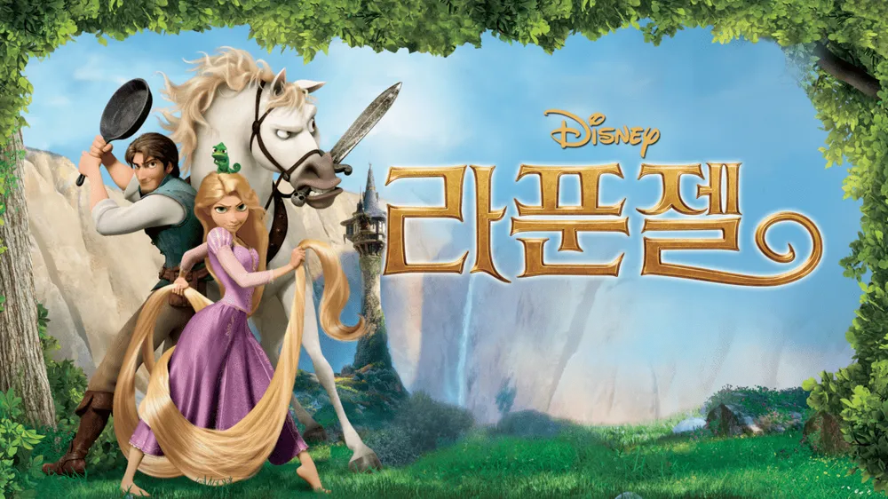
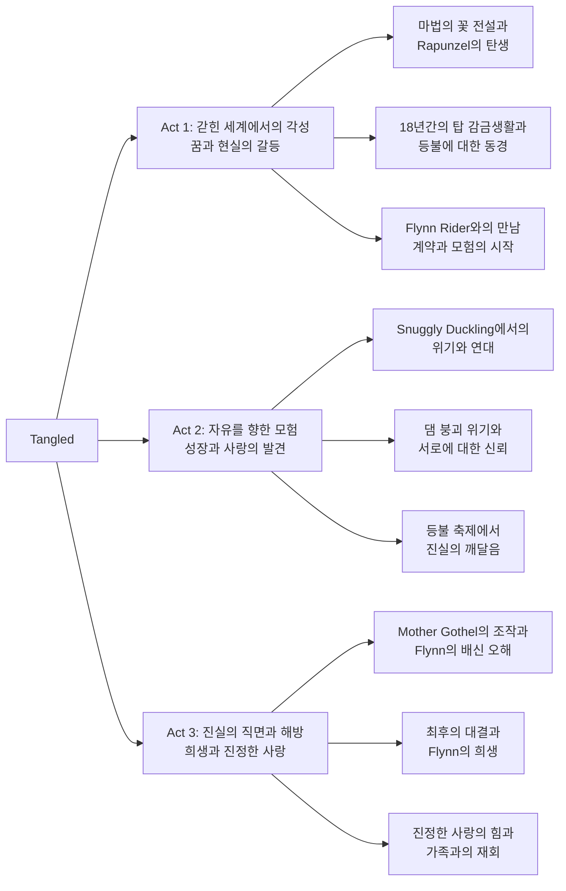
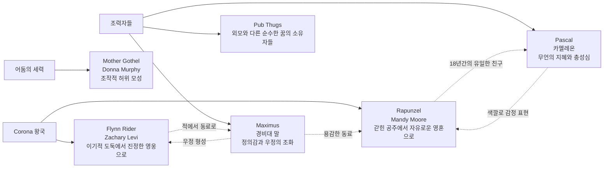

Disney Animation Studios의 창립 50주년을 기념하는 기념비적 작품 **Tangled**은 전통적인 fairy tale의 틀을 깨고 현대적 감각으로 재탄생한 혁신적인 애니메이션이다. Nathan Greno와 Byron Howard의 공동 연출로 그림 형제의 "라푼젤"을 대담하게 재해석한 이 작품은 단순한 동화 각색을 넘어 자유, 자아 발견, 진정한 사랑에 대한 깊이 있는 성찰을 담고 있다. $260 million의 제작비로 당시 최고가 애니메이션 기록을 세웠으며, 혁신적인 hair simulation 기술과 painterly rendering으로 animation 산업에 새로운 standard를 제시했다.

||
|:---:|
||

## 개요

### 영화 정보

* 제목: Tangled / 라푼젤
* 감독: Nathan Greno, Byron Howard
* 주연: Mandy Moore (Rapunzel), Zachary Levi (Flynn Rider), Donna Murphy (Mother Gothel)
* 장르: Animation, Adventure, Comedy, Family, Musical, Romance
* 상영시간: 100분
* 개봉일: 2010년 11월 24일 (미국), 2011년 1월 6일 (한국)

### **추천 대상**

* **가족 관객**: 모든 연령층이 함께 즐길 수 있는 universal appeal과 교훈적 메시지
* **Animation 애호가**: 혁신적인 3D animation 기술과 traditional hand-drawn style의 완벽한 융합
* **Musical 팬**: Alan Menken의 감동적인 music score와 memorable한 song sequence들

## 완전 스토리 로드맵 (Complete Story Roadmap)

### **3막 구조 분석**

### **Act 1: 갇힌 세계에서의 각성**

**마법의 태양 꽃 전설**
- 하늘에서 떨어진 태양의 한 방울이 치유의 꽃으로 성장
- Mother Gothel의 수백 년간 독점과 젊음 유지
- 임신한 왕비의 위기와 꽃의 치유력으로 Rapunzel 탄생

**18년간의 탑 생활**
- Rapunzel의 일상 routine과 창조적 활동들
- "When Will My Life Begin" - 억압된 에너지와 호기심 표현
- 매년 생일마다 나타나는 신비로운 등불에 대한 간절한 동경

**Flynn Rider의 등장과 거래**
- Corona 왕국 궁전에서 tiara 도난 사건
- 우연한 탑 발견과 Rapunzel과의 첫 만남
- 상호 이익을 위한 계약: tiara vs 등불 구경

### **Act 2: 자유를 향한 모험**

**첫 바깥세상 경험**
- 탑에서 내려온 Rapunzel의 복잡한 감정 - 죄책감과 해방감
- 자연과의 교감과 새로운 세계에 대한 경이로움
- Flynn과 Rapunzel 간의 점진적 신뢰 구축

**Snuggly Duckling Inn에서의 위기**
- 거칠어 보이는 thugs들과의 만남
- "I've Got a Dream" - 모든 이의 내면에 있는 순수한 꿈
- 왕국 경비대의 추격과 협력을 통한 탈출

**물에 잠긴 동굴에서의 생사 위기**
- 댐 붕괴로 인한 절체절명의 순간
- 서로의 진짜 이름을 고백하는 emotional breakthrough
- Rapunzel의 머리카락 치유력으로 Flynn 구조

### **Act 3: 진실의 직면과 해방**

**등불 축제의 환상적 순간**
- "I See the Light" - 꿈의 실현과 사랑의 확인
- 왕국 문양과 Rapunzel 그림의 일치로 정체성 각성
- Mother Gothel의 재등장과 Flynn에 대한 조작

**최후의 대결**
- Flynn이 Stabbington Brothers에게 배신당했다는 거짓 증거
- Mother Gothel의 진짜 정체와 Rapunzel 납치 진실 폭로
- Flynn의 탑 침입과 Mother Gothel의 치명적 공격

**희생과 진정한 사랑의 승리**
- Flynn의 Rapunzel 머리카락 절단 - 상대방을 위한 최대 희생
- Mother Gothel의 급속한 노화와 몰락
- Rapunzel의 눈물이 가진 마지막 치유력으로 Flynn 소생

## 등장인물 심층 분석 (Character Deep Analysis)

### 캐릭터 관계도

### **주인공: Rapunzel (Mandy Moore)**

**캐릭터 개요**
* 기본 설정: 18세, 잃어버린 Corona 왕국의 공주, 70피트 길이의 마법 머리카락 소유
* 핵심 목표: 매년 생일에 나타나는 등불의 정체를 알고 싶음
* 주요 갈등: 바깥세상에 대한 호기심 vs Mother Gothel에 대한 죄책감

**성장 곡선**
* 순종적 피해자 → 자신의 의지로 행동하는 주체 → 진정한 정체성을 찾은 공주
* **핵심 성장 메시지: 진정한 자유는 타인의 허락이 아닌 자신의 용기로 얻는 것**

**동기와 욕망**
* 표면적 목표: 등불 축제 참관
* 내면적 욕구: 진정한 자신의 정체성 발견과 소속감
* 두려움: Mother Gothel을 실망시키는 것, 바깥세상의 위험

**갈등 구조**
* vs 자신: 18년간의 조건화된 순종과 자유 의지 사이의 내적 갈등
* vs Mother Gothel: 거짓 사랑과 진정한 자아실현 사이의 대립
* vs 상황: 탑이라는 물리적 감금과 사회적 편견에 맞서는 투쟁

**상징적 의미**
억압적 환경에서 벗어나 자신만의 길을 찾고자 하는 현대 청년들의 자아실현 욕구를 대변한다. 특히 과보호 부모 밑에서 자란 아이들이 겪는 독립에 대한 갈등과 성장통을 상징적으로 그려내고 있다.

### **Flynn Rider / Eugene Fitzherbert (Zachary Levi)**

**캐릭터 개요**
* 기본 설정: 26세, 전문 도둑, 본명 Eugene Fitzherbert로 고아원 출신
* 핵심 목표: 자유롭고 부유한 삶 (표면적), 진정한 사랑과 소속감 (내면적)
* 주요 갈등: 과거의 상처로 인한 감정적 벽 vs 사랑에 대한 갈망

**성장 곡선**
* 냉소적 고립자 → 타인을 배려하는 동반자 → 자기희생적 진정한 사랑의 실천자
* **핵심 성장 메시지: 진정한 남자다움은 상대방을 위한 희생에서 완성된다**

### **Mother Gothel (Donna Murphy)**

**캐릭터 개요**
* 기본 설정: 수백 살, 마법으로 젊음을 유지하는 조작적 양육자
* 핵심 목표: 영원한 젊음과 아름다움 유지
* 주요 갈등: 진정한 사랑의 부재로 인한 공허함을 권력으로 채우려는 시도

**상징적 의미**
독성적 부모(Toxic Parenting)의 전형을 보여주며, 사랑이라는 이름으로 행하는 조작과 통제의 위험성을 경고한다. 자신의 욕구를 위해 타인을 도구화하는 자기애적 성격장애의 특징을 드러낸다.

### **Maximus (말 캐릭터)**

**캐릭터 개요**
* 기본 설정: Corona 왕국 경비대의 최고급 말, Flynn Rider를 추적하는 정의감 넘치는 경찰 말
* 핵심 목표: Flynn Rider 체포를 통한 정의 실현
* 주요 갈등: 직무 수행 vs 새로운 우정 형성 사이의 갈등

**성장 곡선**
* 적대적 추적자 → Flynn과의 우정 형성 → Rapunzel 팀의 충실한 동료
* **핵심 성장 메시지: 진정한 정의는 융통성과 이해를 통해 완성된다**

**캐릭터 특징**
* **인간적 감정**: 말이지만 인간보다 더욱 감정적이고 표현력이 풍부
* **완벽주의적 성격**: 모든 것을 규칙에 따라 처리하려는 강박적 성향
* **숨겨진 상냥함**: 겉으로는 엄격하지만 내면에는 따뜻한 마음을 가짐

**상징적 의미**
사회적 규범과 개인의 자유 사이의 갈등을 상징한다. 처음에는 규칙과 법을 절대시하지만, 점차 인간적 감정과 우정의 중요성을 깨닫게 되는 과정을 통해 관료주의적 사고에서 벗어나는 성장을 보여준다.

**주요 장면들**
* Flynn과의 첫 대면에서 보여준 적대감과 추적 본능
* 댐 붕괴 위기에서 Flynn을 구하기 위해 자신의 목숨을 걸고 뛰어든 순간
* Rapunzel을 구하기 위해 Mother Gothel과 대결하는 용감한 모습

### **Pascal (카멜레온)**

**캐릭터 개요**
* 기본 설정: Rapunzel의 18년간의 유일한 친구, 색깔 변화로 감정을 표현하는 카멜레온
* 핵심 목표: Rapunzel의 행복과 안전을 지키는 것
* 주요 갈등: Rapunzel의 안전 vs 그녀의 자유에 대한 욕구 사이의 균형

**성장 곡선**
* Rapunzel의 보호자 → Flynn과의 우정 형성 → 팀의 핵심 멤버
* **핵심 성장 메시지: 진정한 우정은 상대방의 성장을 돕는 것이다**

**캐릭터 특징**
* **무언의 지혜**: 말은 하지 않지만 상황을 정확히 파악하고 적절한 조언을 제공
* **감정 표현의 달인**: 색깔 변화를 통해 복잡한 감정을 정확히 전달
* **충성심**: Rapunzel에 대한 절대적 충성과 헌신

**상징적 의미**
진정한 우정의 상징으로, 말로 표현하지 않아도 마음으로 소통하는 깊은 유대감을 보여준다. 또한 Rapunzel의 내면의 양심과 직관을 대변하는 역할을 하며, 그녀가 잘못된 길로 가려 할 때 항상 올바른 방향을 제시한다.

**색깔 변화의 의미**
* **초록색**: 평상시의 평온한 상태
* **빨간색**: 분노나 위험 상황에 대한 경고
* **파란색**: 슬픔이나 우울함
* **노란색**: 기쁨이나 흥미
* **보라색**: 의아함이나 혼란
* **투명/흰색**: 극도의 놀람이나 충격

**주요 장면들**
* Rapunzel이 Flynn과 계약을 맺으려 할 때 보여준 우려의 표정
* Flynn이 Rapunzel을 배신할 것 같다고 생각했을 때의 분노 표현
* Mother Gothel의 조작을 눈치채고 Rapunzel에게 경고하려는 노력
* 최종 대결에서 Rapunzel을 구하기 위해 용감하게 Mother Gothel과 맞서는 모습

**캐릭터의 독특성**
Pascal은 Disney 애니메이션에서 매우 특별한 위치를 차지한다. 주인공의 동반자이면서도 단순한 sidekick이 아닌, 독립적인 성격과 판단력을 가진 캐릭터다. 특히 말을 하지 않음에도 불구하고 감정 표현이 매우 풍부하고 정확하여, 오히려 대사가 있는 캐릭터들보다 더욱 인간적이고 공감할 수 있는 존재로 그려진다.

## 요소별 심층 분석 (Component Deep Dive)

### **3D Animation 기술 혁신**

| 기술 요소 | 혁신점/특징 | 시각적/청각적 효과 | 제작 의의 |
|-----------|-------------|-------------------|-----------|
| Hair Simulation | 70피트 머리카락의 자연스러운 물리학적 움직임 구현 | 바람, 물, 중력에 반응하는 realistic motion | Animation hair 기술의 획기적 발전 |
| Painterly Rendering | 3D 모델에 traditional painting 질감 적용 | Hand-drawn animation의 warmth와 3D의 depth 결합 | Disney의 새로운 visual identity 확립 |
| Lighting Design | 등불 축제 장면의 수천 개 light source 처리 | 환상적이고 romantic한 분위기 연출 | Real-time lighting 기술의 시각적 극대화 |

### **연기 & 캐스팅 분석**

| 배우 | 캐릭터 | 연기력 평가 | 캐스팅 적합성 | 특별한 점 |
|------|---------|-------------|---------------|-----------|
| Mandy Moore | Rapunzel | ★★★★★ | Broadway급 vocal과 순수한 음성 | Pop star에서 성공적 voice actor 전환 |
| Zachary Levi | Flynn Rider | ★★★★☆ | 매력적 로맨틱 코미디 톤 완벽 구현 | TV actor에서 Disney leading man으로 성공적 데뷔 |
| Donna Murphy | Mother Gothel | ★★★★★ | Tony Award 수상자의 압도적 villainous charisma | Musical theater 경험이 만든 완벽한 악역 |

### **연출 & 각본 분석**

**연출의 강점:**
* **현대적 감각**: 전통적 fairy tale에 contemporary humor와 현실성 가미
* **Visual storytelling**: 대사 없이도 감정과 상황을 전달하는 뛰어난 연출력
* **Pacing 조절**: Action, Comedy, Romance, Drama의 완벽한 균형감

**연출의 약점:**
* **예측 가능성**: 일부 plot twist가 지나치게 전형적
* **Disney formula 의존**: 혁신적이면서도 safe choice에 머물러

**각본의 강점:**
* **캐릭터 개발**: 각 인물의 성장 arc가 명확하고 설득력 있음
* **현대적 메시지**: 전통적 성 역할에서 벗어난 progressive한 관점

### **음악 & 사운드 분석**

**Alan Menken의 Musical mastery:**
* Classical Broadway style과 contemporary pop의 절묘한 조화
* 각 캐릭터의 personality를 음악적으로 완벽하게 구현

**"When Will My Life Begin" 분석:**
* 기능: Rapunzel의 일상과 억눌린 욕망을 동시에 표현
* 구조: Verse-Chorus 반복으로 단조로운 일상의 리듬감 표현
* 의미: 창조적 에너지와 자유에 대한 갈망의 폭발적 표출

**"I See the Light" 분석:**
* 기능: 등불 축제를 배경으로 한 love duet이자 Rapunzel의 정체성 각성 순간
* 구조: 개별 solo에서 harmony duet으로 발전하며 사랑의 깊어짐 표현
* 의미: 문자 그대로의 빛(등불)과 비유적 빛(깨달음, 사랑)의 이중적 상징

## 비교 분석 (Comparative Analysis)

### **동일 제작사 Disney 작품과의 비교**

**vs The Little Mermaid (1989):**
* 공통점: 제한된 공간에서 벗어나려는 공주의 모험담
* 차이점: Tangled는 여성의 더욱 주체적이고 independent한 캐릭터 구현
* 성취도: Disney Renaissance의 정신을 21세기에 성공적으로 계승

**vs Beauty and the Beast (1991):**
* 공통점: 외모에 속지 말고 진정한 내면을 보라는 메시지
* 차이점: Tangled는 남녀 모두의 동등한 성장과 변화 그려냄
* 진화: 더욱 balanced한 gender representation 구현

### **동일 시기 Animation 작품과의 비교**

**vs How to Train Your Dragon (2010):**
* 공통점: 전통적 관념을 깨고 새로운 관계를 형성하는 성장 스토리
* 차이점: Tangled는 romance에, Dragon은 friendship에 더 집중
* 차별화: Disney만의 musical format과 family-friendly tone 유지

**vs Shrek Forever After (2010):**
* 공통점: 동화 패러디와 현대적 재해석
* 차이점: Shrek는 cynical humor, Tangled는 sincere emotion 중심
* 우위성: 더욱 universal하고 timeless한 appeal 구현

## 숨겨진 레이어 (Hidden Layers)

### **상징적 의미**

**탑의 상징성:**
* 물리적 감금: 과보호적 환경과 사회적 제약
* 심리적 안전지대: 변화에 대한 두려움과 comfort zone
* 수직적 구조: 계급사회와 권력관계의 은유

**머리카락의 상징성:**
* 여성성과 아름다움: 전통적 여성 정체성의 상징
* 속박과 자유: 힘의 원천이자 동시에 속박의 도구
* 희생과 해방: 잘라냄으로써 진정한 자유 획득

### **사회적/문화적 맥락**

**Helicopter Parenting 문제:**
현대 사회의 과보호 양육 방식과 그로 인한 자녀의 자립능력 저하 문제를 Mother Gothel과 Rapunzel의 관계를 통해 비판적으로 다룬다.

**여성의 자아실현:**
전통적 fairy tale의 수동적 공주상을 탈피하고, 자신의 운명을 스스로 개척하는 주체적 여성상을 제시한다.

### **현대적 메시지**

**진정한 사랑의 재정의:**
물리적 attraction이나 구원자-피구원자 관계가 아닌, 서로의 성장을 돕고 상대방의 행복을 우선시하는 partnership으로서의 사랑을 제시한다.

**꿈의 추구와 현실의 조화:**
무작정 꿈만 쫓는 것이 아니라, 현실적 제약을 인정하면서도 포기하지 않는 지혜로운 꿈의 추구를 보여준다.

## 제작 비하인드 (Behind the Scenes)

### **제작 과정의 특별함**

**Hair Simulation 기술 개발:**
Rapunzel의 머리카락을 자연스럽게 표현하기 위해 Disney에서 "Dynamic Wires"라는 새로운 시뮬레이션 시스템을 개발했다. 이는 머리카락 한 올 한 올의 움직임을 개별적으로 계산하는 혁신적 기술이었다.

**Painterly Rendering 기법:**
3D animation에 traditional painting의 따뜻함을 부여하기 위해 "non-photorealistic rendering" 기법을 도입했다. 이를 통해 computer graphics의 차가움을 없애고 hand-drawn animation의 감성을 구현했다.

### **캐스팅 스토리**

**Mandy Moore의 캐스팅:**
원래는 Broadway 배우들을 염두에 두었으나, Mandy Moore의 audition에서 보여준 Rapunzel과의 자연스러운 싱크로율과 순수한 목소리가 결정적 요인이 되었다.

### **기술적 혁신**

**등불 축제 Scene:**
수천 개의 등불을 개별적으로 rendering하면서도 전체적인 조화를 만들어내는 것은 당시 기술로는 매우 도전적이었다. 이를 위해 새로운 lighting engine이 개발되었다.

## 종합 평가

**Tangled**은 Disney Animation의 전통과 현대적 혁신이 완벽하게 조화된 걸작이다. 기술적으로는 3D animation의 새로운 가능성을 제시했으며, 내용적으로는 전통적 fairy tale을 현대적 가치관으로 성공적으로 재해석했다. Rapunzel과 Flynn의 성장 스토리는 단순한 로맨스를 넘어 자아실현과 진정한 사랑에 대한 깊이 있는 성찰을 담고 있다. Alan Menken의 musical score는 감정적 몰입도를 극대화하며, 혁신적인 animation 기술은 시각적 spectacle을 선사한다. 

다만 일부 plot 요소의 예측 가능성과 Disney의 전통적 formula에서 완전히 벗어나지 못한 점은 아쉬움으로 남는다. 그럼에도 불구하고 이 작품이 이후 Frozen, Moana 등으로 이어지는 Disney의 현대적 princess 서사의 출발점이 되었다는 점에서 그 역사적 의미는 매우 크다.

**최종 평점: ★★★★☆ (4.5/5)**

### **한 줄 평**

전통적 동화의 아름다움과 현대적 가치관이 혁신적 기술력과 만나 탄생한 Disney의 새로운 고전

### **시리즈/후속작 전망**

**속편 가능성: 85%**
* Tangled: Before Ever After (2017) TV movie와 Rapunzel's Tangled Adventure TV series의 성공
* Disney+를 통한 franchise 확장 가능성

**확장 가능성:**
* Flynn Rider의 과거 이야기를 다룬 prequel 가능성
* Corona 왕국의 다른 캐릭터들을 중심으로 한 spin-off 작품들

### **추천 작품**

* **유사한 현대적 재해석**: 《Frozen》, 《Moana》
* **Classic Disney Princess 관련**: 《The Little Mermaid》, 《Beauty and the Beast》
* **Animation Musical 대표작**: 《The Lion King》, 《Coco》

## 참고 자료 및 출처 (References & Sources)

### **관람 전 체크리스트**

**필수 사전 지식**
* [ ] Disney의 전통적 princess 영화들 - 비교 감상을 위해
* [ ] Brothers Grimm의 원작 라푼젤 - 각색된 부분 이해를 위해

**추천 선행 관람작**
* [ ] 《The Little Mermaid》 - Disney Renaissance 시대의 이해
* [ ] 《Beauty and the Beast》 - musical animation의 완성도 비교

**관람 포인트**
* [ ] Rapunzel의 hair animation 기술적 완성도
* [ ] 등불 축제 장면의 시각적 아름다움과 symbolic meaning
* [ ] Mother Gothel의 조작적 behavior patterns
* [ ] Flynn의 character transformation 과정
* [ ] Alan Menken 음악의 emotional impact
* [ ] Pascal의 색깔 변화를 통한 감정 표현의 정교함
* [ ] Maximus의 인간적 감정과 완벽주의적 성격의 대비
* [ ] 두 동반자 캐릭터의 Rapunzel에 대한 다른 방식의 보호와 사랑